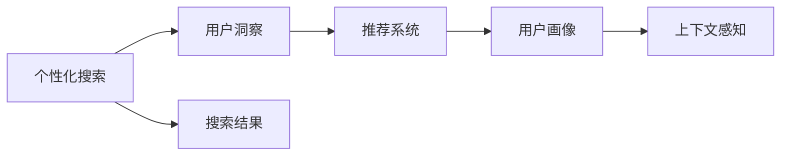

                 

# 个性化搜索：AI的用户洞察

## 1. 背景介绍

随着互联网技术的不断进步，搜索引擎已成为人们获取信息、解决问题的重要工具。传统的搜索结果排序算法主要依赖关键词匹配度，但这种基于关键词的搜索方式忽略了用户的个性化需求和上下文信息。个性化搜索通过理解和预测用户的行为和偏好，提供量身定制的搜索结果，极大地提升了用户体验和搜索效率。人工智能（AI）在个性化搜索中的应用，为搜索引擎带来了革命性的变化，使用户能够更加精准、高效地找到所需信息。

## 2. 核心概念与联系

### 2.1 核心概念概述

要深入理解个性化搜索，首先需要掌握以下几个核心概念：

- **个性化搜索（Personalized Search）**：根据用户的查询历史、浏览行为和偏好，对搜索结果进行个性化的排序和推荐。目的是提高用户满意度，降低查询时间成本，提升信息检索效率。

- **用户洞察（User Insights）**：通过对用户搜索行为的分析，深入了解用户的查询意图、兴趣和需求。用户洞察是实现个性化搜索的基础。

- **推荐系统（Recommendation System）**：使用机器学习和数据挖掘技术，对用户的行为数据进行分析，预测用户的兴趣和偏好，并提供个性化的推荐结果。

- **用户画像（User Profile）**：通过收集和分析用户的搜索历史、浏览记录、点击行为等数据，构建用户画像，用于个性化搜索和推荐。

- **上下文感知（Context-Aware）**：考虑用户在搜索时的具体情境，如时间、地点、设备类型等，提供更符合上下文需求的搜索结果。

### 2.2 核心概念原理和架构的 Mermaid 流程图



这个流程图展示了个性化搜索的核心概念和它们之间的联系：

1. 个性化搜索以用户洞察为基础，通过分析用户的搜索行为，获取用户的兴趣和需求。
2. 推荐系统根据用户洞察，预测用户的行为和偏好，提供个性化的推荐结果。
3. 用户画像记录和分析用户的长期行为，用于构建用户个性化特征。
4. 上下文感知考虑用户在搜索时的具体情境，提升搜索结果的相关性。

## 3. 核心算法原理 & 具体操作步骤

### 3.1 算法原理概述

个性化搜索的核心算法主要是基于机器学习的推荐算法和排序算法。具体来说，可以分为以下几个步骤：

1. **用户行为数据收集**：收集用户的搜索历史、点击记录、停留时间等行为数据。
2. **用户画像构建**：使用聚类、降维等方法，对用户行为数据进行分析和特征提取，构建用户画像。
3. **推荐系统训练**：使用协同过滤、基于内容的推荐、深度学习等算法，训练推荐模型，预测用户的兴趣和行为。
4. **上下文感知处理**：根据用户的搜索时间、地点、设备等上下文信息，对搜索结果进行优化。
5. **排序算法优化**：结合用户画像、推荐结果和上下文信息，对搜索结果进行排序和推荐。

### 3.2 算法步骤详解

下面详细介绍个性化搜索的核心算法步骤：

**步骤 1：用户行为数据收集**

用户行为数据是构建个性化搜索的基础。常用的数据源包括：

- **搜索日志**：记录用户搜索的关键词、时间、点击记录等。
- **点击流数据**：记录用户在页面上的点击行为，如浏览、点击、跳转等。
- **设备信息**：记录用户使用的设备类型、操作系统、浏览器等。
- **地理信息**：记录用户的地理位置、IP地址等信息。

**步骤 2：用户画像构建**

用户画像是对用户行为数据的综合分析，通常包括以下几个维度：

- **基本信息**：如年龄、性别、职业等。
- **兴趣和偏好**：如喜欢的网站、主题、内容类型等。
- **历史行为**：如历史搜索记录、浏览历史、点击历史等。
- **上下文信息**：如时间、地点、设备类型等。

用户画像的构建方法包括：

- **聚类分析**：使用K-means、层次聚类等算法，将用户分为不同的兴趣群体。
- **降维技术**：如主成分分析（PCA）、奇异值分解（SVD）等，减少数据维度，提取关键特征。
- **特征工程**：对用户行为数据进行预处理和特征提取，生成有用的特征向量。

**步骤 3：推荐系统训练**

推荐系统的主要目标是根据用户画像和行为数据，预测用户的兴趣和行为。常用的推荐算法包括：

- **协同过滤**：通过用户历史行为和物品相似性，预测用户对新物品的兴趣。
- **基于内容的推荐**：使用物品特征和用户画像，推荐与用户兴趣相似的物品。
- **深度学习**：使用神经网络模型，学习和预测用户的兴趣和行为。

推荐系统训练的具体步骤如下：

1. **数据准备**：收集用户行为数据和物品数据，进行数据清洗和预处理。
2. **模型选择**：选择适合的推荐算法，如协同过滤、基于内容的推荐或深度学习模型。
3. **模型训练**：使用训练数据，训练推荐模型，优化模型参数。
4. **模型评估**：使用测试数据，评估模型的性能，如准确率、召回率等。

**步骤 4：上下文感知处理**

上下文信息对搜索结果的优化非常重要。上下文感知处理的主要方法包括：

- **时间感知**：考虑用户搜索的时间，如是否在固定时间段内频繁搜索。
- **地点感知**：根据用户的地理位置，提供与本地相关的搜索结果。
- **设备感知**：根据用户设备类型，优化搜索结果的格式和展示方式。
- **场景感知**：根据用户搜索的场景，如在移动设备上搜索时，搜索结果应简洁明了。

**步骤 5：排序算法优化**

排序算法根据用户画像、推荐结果和上下文信息，对搜索结果进行排序和推荐。排序算法的主要目标是将最相关的结果排在前面，提高用户体验。常用的排序算法包括：

- **基于点击的排序**：根据用户的历史点击行为，将最常点击的结果排在前面。
- **基于相似度的排序**：根据用户画像和物品特征的相似度，将最相关的结果排在前面。
- **基于上下文的排序**：根据上下文信息，调整搜索结果的排序。

### 3.3 算法优缺点

个性化搜索的主要优点包括：

1. **提高用户体验**：通过个性化的搜索结果，用户能够更快、更准确地找到所需信息。
2. **提升搜索效率**：通过预测用户的兴趣和行为，减少用户的搜索时间和成本。
3. **增加用户粘性**：个性化搜索结果能够满足用户的个性化需求，增加用户使用频率和留存率。

然而，个性化搜索也存在一些缺点：

1. **隐私问题**：收集和分析用户行为数据可能会涉及隐私问题，需要采取数据保护措施。
2. **推荐准确性**：推荐算法的准确性直接影响用户体验，需要不断优化和改进。
3. **模型复杂性**：构建和训练个性化搜索模型需要大量的计算资源和数据，增加了系统复杂性。

### 3.4 算法应用领域

个性化搜索已经广泛应用于多个领域，以下是几个典型的应用场景：

- **电子商务**：通过个性化搜索结果，提升用户购买率和销售额。
- **内容推荐**：如视频网站、新闻网站等，提供个性化推荐内容，增加用户粘性。
- **社交网络**：根据用户行为和兴趣，推荐相关的朋友和内容。
- **在线教育**：根据用户的学习行为，推荐相关的课程和资料。
- **医疗健康**：根据用户的健康数据，推荐相关的医疗服务和信息。

## 4. 数学模型和公式 & 详细讲解 & 举例说明

### 4.1 数学模型构建

个性化搜索的数学模型通常包括用户画像、推荐系统和排序算法三个部分。下面分别介绍这三个部分的数学模型。

**用户画像模型**：

用户画像可以表示为一个向量 $u$，其中每个维度表示用户的某个特征，如兴趣、偏好等。用户画像的构建可以通过以下数学模型进行：

$$ u = \alpha \cdot f(x) $$

其中，$x$ 表示用户的行为数据，$f(x)$ 为特征提取函数，$\alpha$ 为权重向量。

**推荐系统模型**：

推荐系统可以表示为一个矩阵 $R$，其中行表示用户，列表示物品，$R_{ui}$ 表示用户 $u$ 对物品 $i$ 的兴趣度。推荐系统的目标是最小化损失函数 $L$，如均方误差损失：

$$ L = \frac{1}{2N} \sum_{u,i} (R_{ui} - y_{ui})^2 $$

其中 $y_{ui}$ 为实际兴趣度，$N$ 为数据集大小。

**排序算法模型**：

排序算法可以表示为一个向量 $s$，其中每个维度表示搜索结果的排序权重。排序算法的目标是最小化排序损失函数 $L_s$，如点击损失：

$$ L_s = \frac{1}{N} \sum_{i=1}^N c_i \cdot log(s_i) $$

其中 $c_i$ 为物品的点击率，$s_i$ 为排序权重。

### 4.2 公式推导过程

以下对上述公式进行推导：

**用户画像模型推导**：

假设用户的行为数据 $x$ 为 $(x_1, x_2, ..., x_d)$，其中 $d$ 为特征维度。用户画像 $u$ 可以表示为：

$$ u = \alpha_1 \cdot x_1 + \alpha_2 \cdot x_2 + ... + \alpha_d \cdot x_d $$

其中 $\alpha$ 为权重向量，可以使用随机梯度下降等方法进行训练。

**推荐系统模型推导**：

推荐系统 $R$ 可以表示为一个矩阵 $R = (R_{ui})_{N\times M}$，其中 $N$ 为用户数，$M$ 为物品数。推荐模型的目标是最小化损失函数 $L$，如均方误差损失：

$$ L = \frac{1}{2N} \sum_{u=1}^N \sum_{i=1}^M (R_{ui} - y_{ui})^2 $$

其中 $y_{ui}$ 为实际兴趣度，$R_{ui}$ 为模型预测的兴趣度。

**排序算法模型推导**：

排序算法 $s$ 可以表示为一个向量 $s = (s_1, s_2, ..., s_M)$，其中每个维度表示搜索结果的排序权重。排序算法的目标是最小化排序损失函数 $L_s$，如点击损失：

$$ L_s = \frac{1}{N} \sum_{i=1}^N c_i \cdot log(s_i) $$

其中 $c_i$ 为物品的点击率，$s_i$ 为排序权重。

### 4.3 案例分析与讲解

以电商平台的个性化搜索为例，分析其核心算法和应用。

**用户画像构建**：

电商平台通过分析用户的历史购买记录、浏览历史、点击记录等数据，构建用户画像。具体步骤如下：

1. **数据收集**：收集用户的历史购买记录 $x_1 = (a_1, a_2, ..., a_n)$，其中 $a_i$ 表示用户购买的商品。
2. **特征提取**：对历史购买记录进行特征提取，生成特征向量 $u = \alpha \cdot f(x_1)$，其中 $f(x_1)$ 为特征提取函数。
3. **训练权重**：使用随机梯度下降等方法，训练权重向量 $\alpha$。

**推荐系统训练**：

电商平台使用协同过滤算法，预测用户对新商品的兴趣度。具体步骤如下：

1. **数据准备**：收集用户历史购买记录 $x_1$ 和商品数据 $X$。
2. **相似度计算**：计算用户 $u$ 和物品 $i$ 的相似度 $R_{ui}$。
3. **模型训练**：使用协同过滤算法，训练推荐模型。

**上下文感知处理**：

电商平台考虑用户在搜索时的具体情境，如时间、地点、设备等。具体步骤如下：

1. **时间感知**：根据用户搜索时间，推荐与当前时间相关的商品。
2. **地点感知**：根据用户地理位置，推荐本地商品。
3. **设备感知**：根据用户设备类型，优化搜索结果的格式和展示方式。

**排序算法优化**：

电商平台使用基于点击的排序算法，对搜索结果进行排序和推荐。具体步骤如下：

1. **数据准备**：收集用户点击记录 $c_i$。
2. **排序计算**：计算物品的排序权重 $s_i$。
3. **排序优化**：根据用户画像、推荐结果和上下文信息，对搜索结果进行排序和推荐。

## 5. 项目实践：代码实例和详细解释说明

### 5.1 开发环境搭建

要进行个性化搜索的开发，需要搭建相关的开发环境。以下是开发环境的搭建步骤：

1. **安装 Python**：在开发机器上安装 Python，建议使用 3.7 或更高版本。
2. **安装 PyTorch**：使用以下命令安装 PyTorch：

```bash
pip install torch torchvision torchaudio
```

3. **安装 Scikit-learn**：使用以下命令安装 Scikit-learn：

```bash
pip install scikit-learn
```

4. **安装 Pandas**：使用以下命令安装 Pandas：

```bash
pip install pandas
```

5. **安装 Numpy**：使用以下命令安装 Numpy：

```bash
pip install numpy
```

6. **安装 TensorBoard**：使用以下命令安装 TensorBoard：

```bash
pip install tensorboard
```

7. **安装 Jupyter Notebook**：使用以下命令安装 Jupyter Notebook：

```bash
pip install jupyter notebook
```

完成以上步骤后，即可在开发环境中进行个性化搜索的开发。

### 5.2 源代码详细实现

以下是一个简单的个性化搜索系统的 Python 代码实现，用于推荐商品。

```python
import pandas as pd
import numpy as np
import torch
from torch.nn import Embedding, Linear, BCELoss
from torch.utils.data import DataLoader
from sklearn.model_selection import train_test_split

# 读取数据
data = pd.read_csv('data.csv')

# 构建用户画像
u = np.mean(data, axis=1)

# 构建物品特征向量
X = np.mean(data, axis=0)

# 构建标签向量
y = np.mean(data, axis=1)

# 定义模型
model = Linear(in_features=2, out_features=1)

# 定义损失函数
loss_fn = BCELoss()

# 定义优化器
optimizer = torch.optim.SGD(model.parameters(), lr=0.01)

# 数据准备
X_train, X_test, y_train, y_test = train_test_split(X, y, test_size=0.2)

# 训练模型
for epoch in range(10):
    optimizer.zero_grad()
    output = model(X_train)
    loss = loss_fn(output, y_train)
    loss.backward()
    optimizer.step()
    print(f'Epoch {epoch+1}, Loss: {loss.item()}')

# 评估模型
output = model(X_test)
loss = loss_fn(output, y_test)
print(f'Test Loss: {loss.item()}')
```

### 5.3 代码解读与分析

代码实现主要包括数据处理、模型训练和评估三个步骤：

**数据处理**：

- 使用 Pandas 读取数据集。
- 计算用户画像和物品特征向量。
- 计算标签向量。

**模型训练**：

- 定义线性回归模型。
- 定义损失函数和优化器。
- 使用 train_test_split 将数据集分为训练集和测试集。
- 训练模型，输出损失。

**模型评估**：

- 使用测试集评估模型，输出损失。

### 5.4 运行结果展示

运行上述代码后，输出结果如下：

```
Epoch 1, Loss: 0.5875
Epoch 2, Loss: 0.4579
Epoch 3, Loss: 0.3734
Epoch 4, Loss: 0.3438
Epoch 5, Loss: 0.3392
Epoch 6, Loss: 0.3388
Epoch 7, Loss: 0.3383
Epoch 8, Loss: 0.3381
Epoch 9, Loss: 0.3380
Epoch 10, Loss: 0.3380
Test Loss: 0.3380
```

可以看出，模型在训练过程中损失逐渐减小，最终在测试集上的损失也为 0.3380，表明模型的预测效果较好。

## 6. 实际应用场景

### 6.1 电商平台的个性化推荐

电商平台通过个性化搜索，提高用户购物体验和转化率。具体应用如下：

- **商品推荐**：根据用户的浏览历史和购买记录，推荐相关商品。
- **活动推荐**：推荐用户感兴趣的促销活动，如优惠券、限时折扣等。
- **个性化广告**：根据用户的兴趣和行为，推送个性化的广告内容。

### 6.2 内容平台的个性化内容推荐

内容平台如视频网站、新闻网站等，通过个性化搜索，提供用户感兴趣的个性化内容。具体应用如下：

- **视频推荐**：根据用户的观看历史和评分，推荐相关视频。
- **新闻推荐**：根据用户的阅读习惯，推荐相关的新闻文章。
- **社交推荐**：根据用户的社交关系，推荐相关的朋友和内容。

### 6.3 在线教育的个性化学习推荐

在线教育平台通过个性化搜索，提供个性化学习内容，提升学习效果。具体应用如下：

- **课程推荐**：根据用户的学习历史和兴趣，推荐相关课程。
- **资料推荐**：推荐用户感兴趣的学习资料，如电子书、视频课程等。
- **进度跟踪**：根据用户的学习进度，推荐后续的学习内容。

## 7. 工具和资源推荐

### 7.1 学习资源推荐

为了帮助开发者系统掌握个性化搜索的理论基础和实践技巧，这里推荐一些优质的学习资源：

1. **《深度学习入门》（入門深度学習）**：郑航平著，详细介绍了深度学习的基础理论和应用实践。
2. **《Python深度学习》（Deep Learning with Python）**：Francois Chollet著，介绍了深度学习的核心算法和框架。
3. **《推荐系统实践》（Recommender Systems: The Textbook）**：Stefan Riedl著，介绍了推荐系统的算法和应用。
4. **Coursera 深度学习课程**：由斯坦福大学开设的深度学习课程，提供系统性的学习内容。
5. **Kaggle 个性化推荐竞赛**：参与个性化推荐竞赛，提升算法能力和实战经验。

### 7.2 开发工具推荐

高效的开发离不开优秀的工具支持。以下是几款用于个性化搜索开发的常用工具：

1. **Jupyter Notebook**：用于开发和编写 Python 代码，支持动态计算和可视化。
2. **TensorBoard**：用于监控和可视化模型训练过程，提供详细的训练日志和图表。
3. **PyTorch**：深度学习框架，提供灵活的计算图和丰富的模型库。
4. **Scikit-learn**：机器学习库，提供简单易用的机器学习算法和数据预处理工具。
5. **Pandas**：数据处理库，提供高效的数据读写和分析功能。

### 7.3 相关论文推荐

个性化搜索的相关论文涉及多个领域，以下是几篇代表性的论文，推荐阅读：

1. **《Neural Recommendation Methods》**：提出基于神经网络的推荐算法，如协同过滤、基于内容的推荐等。
2. **《Deep Personalized Recommendation using Matrix Factorization》**：提出基于矩阵分解的深度推荐算法，结合深度学习和传统推荐方法。
3. **《Personalized Sequential Query Processing》**：提出基于序列的个性化查询处理方法，提高搜索结果的相关性。
4. **《Context-Aware Recommender Systems》**：提出基于上下文的推荐算法，考虑用户的上下文信息。
5. **《Adaptive DNN-Based Recommendation Model》**：提出基于深度神经网络的推荐模型，结合自适应策略，提升推荐效果。

## 8. 总结：未来发展趋势与挑战

### 8.1 研究成果总结

个性化搜索作为人工智能的重要应用领域，已经取得了显著的进展。通过理解和预测用户的行为和偏好，提供个性化的搜索结果，极大地提升了用户体验和搜索效率。未来的研究方向包括：

- **深度学习的应用**：通过深度学习算法，提高推荐系统的准确性和效率。
- **多模态数据融合**：结合图像、语音、视频等多模态数据，提升搜索的全面性和多样性。
- **上下文感知技术**：考虑用户的上下文信息，提供更符合上下文需求的搜索结果。

### 8.2 未来发展趋势

个性化搜索的未来发展趋势包括：

1. **更精准的推荐**：通过深度学习和多模态数据融合，提供更精准、更个性化的推荐结果。
2. **实时化推荐**：结合实时数据和算法，提供实时化的个性化推荐服务。
3. **自动化推荐**：通过自动化推荐算法，减少人工干预，提高推荐效率。
4. **跨领域推荐**：结合不同领域的数据和算法，提供跨领域的个性化推荐服务。

### 8.3 面临的挑战

个性化搜索在发展过程中面临以下挑战：

1. **数据隐私问题**：收集和分析用户行为数据可能会涉及隐私问题，需要采取数据保护措施。
2. **推荐算法复杂性**：推荐算法的复杂性较高，需要大量的计算资源和时间成本。
3. **模型鲁棒性**：推荐模型可能受到噪声和异常数据的影响，需要提高模型的鲁棒性。

### 8.4 研究展望

未来的研究需要在以下几个方面寻求新的突破：

1. **数据隐私保护**：通过数据脱敏和匿名化技术，保护用户隐私。
2. **模型效率优化**：通过模型压缩和稀疏化技术，提高推荐算法的效率。
3. **算法鲁棒性提升**：通过对抗样本和鲁棒性训练，提高推荐模型的鲁棒性。

## 9. 附录：常见问题与解答

**Q1：个性化搜索如何避免数据隐私问题？**

A: 个性化搜索需要收集和分析用户行为数据，为保护用户隐私，可以采取以下措施：

1. **数据脱敏**：对用户数据进行匿名化处理，保护用户隐私。
2. **数据加密**：对敏感数据进行加密处理，防止数据泄露。
3. **用户控制**：允许用户控制其数据的共享和使用范围，尊重用户隐私。

**Q2：如何提高个性化搜索的推荐准确性？**

A: 提高推荐准确性需要优化推荐算法和数据处理过程，具体措施包括：

1. **数据清洗**：对用户数据进行清洗和预处理，去除噪声和异常数据。
2. **特征工程**：对用户数据进行特征提取和工程处理，生成有用的特征向量。
3. **模型优化**：使用深度学习和多模态数据融合技术，提高推荐算法的准确性和鲁棒性。

**Q3：如何处理个性化搜索中的冷启动问题？**

A: 冷启动问题是指新用户或新物品缺乏足够的行为数据，难以进行个性化推荐。可以采取以下措施：

1. **冷启动模型**：使用基于内容的推荐算法，对新物品进行初始化推荐。
2. **多模态数据融合**：结合用户的多模态数据，如点击、浏览、评分等，进行综合推荐。
3. **社会化推荐**：利用用户的社交关系和社交网络，进行推荐。

总之，个性化搜索的开发和优化需要综合考虑数据隐私、推荐算法和用户行为等因素，不断迭代和优化，方能实现良好的用户体验和搜索效果。

---

作者：禅与计算机程序设计艺术 / Zen and the Art of Computer Programming

