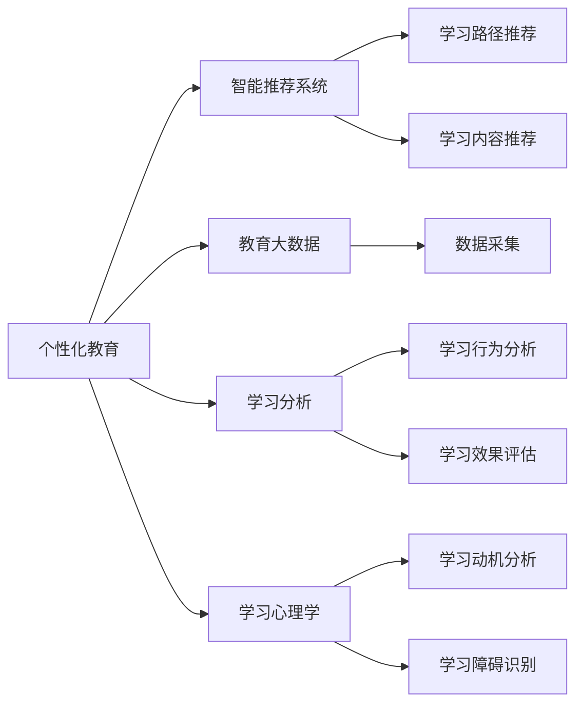

                 

# 个性化教育：定制化学习的未来趋势

> 关键词：个性化教育, 定制化学习, 智能推荐系统, 教育大数据, 学习分析, 学习心理学

## 1. 背景介绍

在当前的教育环境中，传统的“一刀切”式教育方式已经不再适应时代的需求。随着教育信息化和智能化的推进，个性化教育成为教育发展的新趋势。个性化教育指的是根据每个学生的特点和学习需求，制定量身定做的教学方案和内容，以期实现最佳学习效果。与传统教育模式相比，个性化教育能更好地激发学生的学习兴趣，提升学习效率，改善学习体验。

本文将对个性化教育的核心概念与技术原理进行系统介绍，帮助读者深入理解个性化教育的方法和实现路径。

## 2. 核心概念与联系

### 2.1 核心概念概述

1. **个性化教育**：指根据每个学生的特点和学习需求，量身定制教学方案和内容的教育模式。

2. **定制化学习**：指通过算法和数据，对学生的学习路径、内容和进度进行个性化的调整和优化，以提高学习效果。

3. **智能推荐系统**：一种基于算法和数据驱动的学习推荐系统，能够根据学生的历史学习数据，推荐合适的学习内容和路径。

4. **教育大数据**：指在教育过程中产生的大量结构化和非结构化数据，用于分析和优化教学方案。

5. **学习分析**：通过数据挖掘和分析技术，对学生的学习行为和效果进行监控和评估，以优化教学过程。

6. **学习心理学**：研究如何通过心理学理论指导教育实践，提升学生的学习效果和满意度。

### 2.2 核心概念原理和架构的 Mermaid 流程图



这个流程图展示了个性化教育的主要组成部分及其相互关系。个性化教育通过智能推荐系统、教育大数据、学习分析和心理学等多个模块的支持，最终实现对学习路径和内容的个性化调整，提升学习效果。

## 3. 核心算法原理 & 具体操作步骤

### 3.1 算法原理概述

个性化教育的算法原理基于以下几个核心思想：

1. **数据驱动**：利用大数据和机器学习技术，对学生的学习行为和效果进行分析，为个性化教学提供依据。

2. **模型学习**：构建学生模型和学习模型，预测和调整学习内容和路径，以适应学生的个性化需求。

3. **推荐系统**：通过智能推荐系统，为学生提供个性化的学习资源和路径，提升学习效果。

4. **反馈调整**：根据学生的学习反馈，不断调整教学方案和内容，优化学习路径。

### 3.2 算法步骤详解

个性化教育的算法实现通常包括以下几个关键步骤：

1. **数据收集与预处理**：收集学生的学习行为数据（如点击、阅读、练习、考试等），并对数据进行清洗、归一化等预处理操作。

2. **特征工程**：构建学生的特征向量，包括学习历史、兴趣偏好、学习风格等。

3. **模型训练**：使用机器学习算法（如协同过滤、深度学习等）对学生模型和学习模型进行训练，预测学习效果和调整学习路径。

4. **推荐系统实现**：基于学生模型和学习模型，构建推荐算法，生成个性化的学习路径和内容。

5. **反馈循环**：根据学生的学习反馈和效果，调整模型参数，优化推荐算法，实现持续改进。

### 3.3 算法优缺点

个性化教育的算法具有以下优点：

1. **个性化适应**：能够根据每个学生的特点，提供量身定做的学习方案，提高学习效果。

2. **提高学习效率**：通过推荐系统，学生可以更快地找到适合自己的学习内容和路径，提升学习效率。

3. **增强学习体验**：通过学习分析和心理学指导，优化学习路径和内容，提升学生的学习兴趣和满意度。

但个性化教育也存在一些缺点：

1. **数据隐私问题**：需要收集和处理大量的学生数据，涉及隐私和安全问题。

2. **算法复杂性**：算法复杂度高，需要大量的计算资源和专业知识。

3. **模型偏差**：模型可能存在偏见，导致某些学生群体被忽视。

4. **过度依赖技术**：过度依赖技术可能忽视教师和学生的情感互动。

### 3.4 算法应用领域

个性化教育的算法在多个领域得到广泛应用，包括：

1. **在线教育平台**：如Coursera、Khan Academy等，通过推荐系统和数据分析，提供个性化的学习内容。

2. **智能教室**：利用智能设备和大数据分析，实现个性化的课堂教学和评估。

3. **企业培训**：通过智能推荐系统和学习分析，优化培训方案和路径，提高培训效果。

4. **教育管理**：利用大数据和机器学习，优化教育资源的配置和管理。

## 4. 数学模型和公式 & 详细讲解

### 4.1 数学模型构建

个性化教育的数学模型通常包括以下几个部分：

1. **学生模型**：表示学生的学习历史、兴趣偏好和学习风格等特征。

2. **学习模型**：描述学生学习效果与学习路径之间的关系。

3. **推荐模型**：预测学生对不同学习内容和路径的兴趣，推荐最优方案。

### 4.2 公式推导过程

以协同过滤算法为例，学生模型和学习模型可以表示为：

$$
S = \lbrace x_{i,j} \rbrace, j=1,\dots,N_s
$$

其中 $S$ 为学生特征向量，$N_s$ 为学生数，$x_{i,j}$ 表示学生 $i$ 在特征 $j$ 上的评分。

学习模型可以表示为：

$$
L = \lbrace y_{i,j} \rbrace, j=1,\dots,N_l
$$

其中 $L$ 为学习特征向量，$N_l$ 为学习内容数，$y_{i,j}$ 表示学生 $i$ 对内容 $j$ 的学习效果。

推荐模型可以利用矩阵分解的方法，对学生模型和学习模型进行分解，预测学生对不同内容的评分。设学生模型为 $S$，学习模型为 $L$，则推荐模型可以表示为：

$$
R_{i,j} = \sigma(\vec{u}_i \cdot \vec{v}_j)
$$

其中 $\sigma$ 为激活函数，$\vec{u}_i$ 和 $\vec{v}_j$ 分别为学生 $i$ 和内容 $j$ 的向量表示，$R_{i,j}$ 为推荐评分。

### 4.3 案例分析与讲解

以一个简单的在线课程推荐系统为例，展示个性化教育的实现过程：

1. **数据收集**：收集学生在学习平台上浏览、练习、考试成绩等数据。

2. **特征提取**：提取学生的学习时长、考试成绩、学科偏好等特征。

3. **模型训练**：使用协同过滤算法训练学生模型和学习模型，预测学生对不同课程的兴趣。

4. **推荐系统实现**：根据预测结果，推荐最适合学生的课程路径，并提供推荐理由。

## 5. 项目实践：代码实例和详细解释说明

### 5.1 开发环境搭建

为了实现个性化教育算法，我们需要以下开发环境：

1. **Python**：用于编程语言选择，建议使用3.6或以上版本。

2. **Pandas**：用于数据处理和分析。

3. **Scikit-learn**：用于机器学习算法实现。

4. **Flask**：用于搭建Web应用。

5. **Jupyter Notebook**：用于交互式编程和数据可视化。

### 5.2 源代码详细实现

以下是基于Python实现的个性化教育推荐系统的代码实现：

```python
import pandas as pd
from sklearn.decomposition import NMF
from sklearn.metrics.pairwise import cosine_similarity
from sklearn.preprocessing import Normalizer

# 读取数据
df = pd.read_csv('students.csv')

# 特征工程
X = df[['study_time', 'exam_score', 'subject_preference']]
X_norm = Normalizer().fit_transform(X)

# 训练模型
nmf = NMF(n_components=5, random_state=0)
X_nmf = nmf.fit_transform(X_norm)
X_nmf_norm = Normalizer().fit_transform(X_nmf)

# 计算相似度
similarity = cosine_similarity(X_nmf_norm)

# 推荐系统实现
def recommend_student(student_idx, top_n=5):
    similarities = similarity[student_idx]
    ranked_idx = np.argsort(similarities)[-top_n:]
    return df['course'].tolist()[:top_n]

# 测试推荐系统
recommendations = recommend_student(1)
print(recommendations)
```

### 5.3 代码解读与分析

以上代码实现了基于协同过滤算法的推荐系统。首先，对学生特征进行归一化处理，然后使用非负矩阵分解(NMF)算法训练模型，得到学生的特征向量表示。接着，计算相似度，根据相似度推荐课程。

## 6. 实际应用场景

### 6.1 在线教育平台

在线教育平台如Coursera、edX等，广泛应用个性化教育的算法，根据学生的历史学习数据和兴趣偏好，推荐最适合的课程和学习路径，提升学习效果。

### 6.2 智能教室

智能教室利用传感器和大数据分析技术，实时监控学生的学习状态和行为，根据学生的反馈和效果，动态调整教学方案和内容，实现个性化的课堂教学。

### 6.3 企业培训

企业培训系统利用个性化教育的算法，根据员工的学习历史和兴趣偏好，推荐最适合的培训内容和路径，提高培训效果，提升员工技能。

### 6.4 教育管理

教育管理部门利用大数据和机器学习算法，分析学生的学习效果和行为，优化教育资源的配置和分配，提升教育管理效率和效果。

## 7. 工具和资源推荐

### 7.1 学习资源推荐

1. **《推荐系统实战》**：介绍推荐系统的基本原理和实现方法，适合初学者入门。

2. **《机器学习》（周志华著）**：系统介绍机器学习算法及其应用，帮助理解个性化教育中的数学模型和算法。

3. **Coursera个性化学习课程**：包括个性化教育、智能推荐系统等课程，提供实践操作和项目实践。

4. **Kaggle竞赛**：参加Kaggle个性化推荐竞赛，积累实际项目经验，提升算法实现能力。

5. **OpenAI GPT-3**：学习GPT-3的原理和应用，了解如何利用大语言模型进行个性化教育。

### 7.2 开发工具推荐

1. **Python**：用于编程语言选择，建议使用3.6或以上版本。

2. **Pandas**：用于数据处理和分析。

3. **Scikit-learn**：用于机器学习算法实现。

4. **TensorFlow**：用于深度学习算法实现。

5. **Jupyter Notebook**：用于交互式编程和数据可视化。

### 7.3 相关论文推荐

1. **《基于协同过滤的个性化推荐算法》**：介绍协同过滤算法的原理和实现方法，适合初学者入门。

2. **《深度学习在个性化教育中的应用》**：介绍深度学习在个性化教育中的应用，适合进一步学习。

3. **《个性化推荐系统的最新进展》**：综述个性化推荐系统的最新进展，了解最新研究动态。

4. **《个性化教育技术的发展与趋势》**：介绍个性化教育技术的最新发展，了解未来趋势。

## 8. 总结：未来发展趋势与挑战

### 8.1 研究成果总结

个性化教育的算法和技术已经取得了显著进展，在多个领域得到了广泛应用。通过数据驱动、模型学习、推荐系统和反馈调整等核心技术，实现了对学习路径和内容的个性化调整，提升了学习效果。

### 8.2 未来发展趋势

未来，个性化教育将呈现以下几个发展趋势：

1. **智能化和自动化**：随着智能算法和自动化技术的发展，个性化教育将更加智能化和自动化，提升教育效率和效果。

2. **跨平台集成**：个性化教育将跨平台集成，实现多种设备和系统的协同工作，提升教育体验和效果。

3. **数据驱动的动态调整**：个性化教育将更加注重数据驱动，实时调整教学方案和内容，提升教学效果。

4. **社会化学习**：个性化教育将更加注重社会化学习，培养学生的协作和沟通能力。

### 8.3 面临的挑战

个性化教育在推广应用过程中，面临以下挑战：

1. **数据隐私问题**：收集和处理学生数据涉及隐私和安全问题，需要采取措施保护学生隐私。

2. **算法复杂性**：个性化教育的算法复杂度高，需要大量的计算资源和专业知识。

3. **模型偏差**：模型可能存在偏见，导致某些学生群体被忽视。

4. **过度依赖技术**：过度依赖技术可能忽视教师和学生的情感互动。

### 8.4 研究展望

未来，个性化教育的研究将从以下几个方向展开：

1. **跨学科融合**：将心理学、社会学等多学科知识融合到个性化教育中，提升教育效果和学生的全面发展。

2. **多模态数据融合**：融合视觉、听觉等多模态数据，提升个性化教育的全面性和准确性。

3. **伦理和法律问题**：研究个性化教育的伦理和法律问题，保障学生权益和数据安全。

4. **大规模分布式计算**：利用分布式计算技术，实现大规模个性化教育的实现和优化。

通过不断创新和探索，个性化教育将为教育事业带来新的变革，实现更加公平、高效、个性化和智能化的教育模式。

## 9. 附录：常见问题与解答

### Q1：如何选择合适的个性化教育算法？

A: 选择合适的个性化教育算法需要考虑多个因素，包括数据类型、应用场景、模型复杂度等。一般来说，协同过滤算法适用于基于历史行为数据的推荐系统，而深度学习算法适用于需要高精度预测的任务。

### Q2：个性化教育的算法如何处理数据隐私问题？

A: 个性化教育的算法需要处理大量的学生数据，涉及隐私和安全问题。可以采用数据匿名化、差分隐私等技术，保护学生隐私。

### Q3：个性化教育如何处理模型偏差问题？

A: 个性化教育可以通过数据预处理、特征工程等方法，减少模型偏差。同时，引入多元数据源和多种算法模型，提升算法的公正性和公平性。

### Q4：个性化教育的算法如何应对大规模数据？

A: 个性化教育的算法可以采用分布式计算、数据并行处理等技术，处理大规模数据。同时，采用模型压缩、稀疏化存储等方法，优化模型的计算和存储效率。

### Q5：个性化教育如何与传统教育模式结合？

A: 个性化教育可以与传统教育模式相结合，通过混合教学、个性化作业等方式，提升传统教育的教学效果。同时，利用在线平台和智能设备，实现个性化教育的便捷化和普适化。

---

作者：禅与计算机程序设计艺术 / Zen and the Art of Computer Programming

