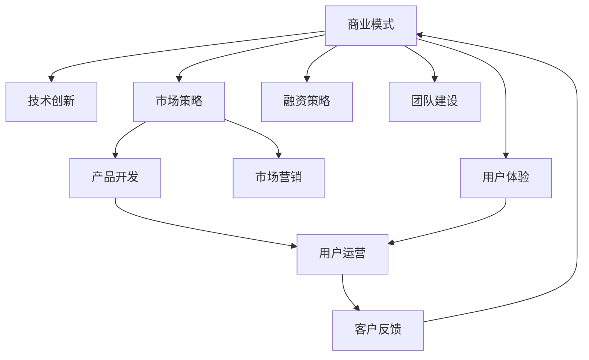

                 

# 为创业者提供系统知识培训和创业指导

> 关键词：系统知识培训, 创业指导, 商业模式, 技术创新, 市场策略, 融资策略, 团队建设, 用户体验

## 1. 背景介绍

在当今高速发展的科技时代，创业不再是少数人可以实现的梦想，而逐渐成为了一种日益增长的趋势。技术的发展使得各行各业涌现出大量新的机会，同时也带来了前所未有的挑战。对于创业者来说，要想在竞争激烈的商业环境中脱颖而出，除了有创新的理念，还需要系统性的知识培训和科学的创业指导。

本篇博客文章将为创业者提供一系列系统性的知识培训和详细的创业指导，包括但不限于商业模式的构建、技术创新的路径、市场策略的制定、融资策略的优化、团队建设的核心要点、用户体验的设计理念等。我们将以系统化的视角，深入探讨这些创业的关键问题，帮助创业者避免走弯路，快速实现商业价值的转化。

## 2. 核心概念与联系

### 2.1 核心概念概述

创业是一个涉及多方面知识的复杂过程，其中包括但不限于商业概念、市场分析、产品设计与开发、用户运营、融资策略、市场营销、团队建设等。这些核心概念相互关联，共同构成了创业的完整框架。

1. **商业模式**：指一个企业如何创造、传递、捕获价值的过程，是创业项目的核心。一个成功的商业模式需要明确价值主张、目标客户、收入来源、核心资源和关键活动。

2. **技术创新**：指通过新技术、新方法和新工具来解决市场问题或提升产品服务质量的过程。技术创新是推动创业企业成长的源动力。

3. **市场策略**：指企业如何通过分析市场环境、确定竞争优势、制定营销策略等手段，来满足目标用户的需求，并获取市场份额。

4. **融资策略**：指企业如何通过各种方式（如天使投资、风险投资、众筹等）获取资本，支持企业的发展。

5. **团队建设**：指企业如何通过招聘、培养和激励优秀的员工，构建高效、创新的团队。

6. **用户体验**：指通过深入理解用户需求，提供符合用户期望的产品和服务，提升用户的满意度和忠诚度。

7. **市场策略**：指企业如何通过分析市场环境、确定竞争优势、制定营销策略等手段，来满足目标用户的需求，并获取市场份额。

这些核心概念之间的逻辑关系可以通过以下Mermaid流程图来展示：



这个流程图展示了好商业模式是如何通过技术创新、市场策略、融资策略、团队建设和用户体验等多方面要素相互关联，共同推动企业的成长。

## 3. 核心算法原理 & 具体操作步骤
### 3.1 算法原理概述

创业过程本身是一个复杂的多变量系统，每个变量的变化都可能影响到整体的结果。因此，我们需要借助系统性的方法来分析和优化创业过程。系统化的创业指导可以包括以下几个关键步骤：

1. **目标设定**：明确企业的使命、愿景和长期目标。
2. **市场分析**：识别目标市场的需求和竞争环境。
3. **用户研究**：深入理解目标用户的需求和痛点。
4. **商业模式设计**：构建一个能够满足用户需求并实现可持续发展的商业模式。
5. **产品开发**：根据商业模式和用户需求，开发相应的产品或服务。
6. **市场推广**：通过有效的市场策略，将产品推向市场，并获取用户。
7. **用户运营**：通过持续的用户运营，提升用户满意度和忠诚度。
8. **融资获取**：根据企业发展的需要，合理规划和获取融资。
9. **团队建设**：构建高效、创新的团队，吸引和培养人才。

### 3.2 算法步骤详解

以“创业者如何利用技术创新来提升产品价值”为例，具体的算法步骤可以如下：

1. **市场需求调研**：
   - 确定目标用户群体的需求和痛点。
   - 分析现有市场上的产品和服务，找出不足之处。
   - 调研新技术和市场趋势，确定创新方向。

2. **技术方案评估**：
   - 列出可能的技术方案，包括新技术的应用、现有技术的优化和改进。
   - 评估每个方案的可行性、技术难度、成本和预期效果。
   - 选择最适合的方案，并进行技术评估和可行性分析。

3. **原型开发和测试**：
   - 根据选定的技术方案，开发产品原型。
   - 进行内部测试和用户反馈，不断迭代改进。
   - 根据测试结果，调整产品功能和技术细节。

4. **产品上线和市场推广**：
   - 将产品上线并开始进行市场推广。
   - 通过市场策略（如SEO、社交媒体营销、广告等）增加产品曝光。
   - 收集市场反馈，调整市场策略。

5. **用户运营和反馈循环**：
   - 通过用户运营（如客户支持、社区建设、用户教育等）提升用户体验。
   - 收集用户反馈，不断优化产品功能和用户体验。
   - 建立用户反馈循环机制，持续提升产品价值。

### 3.3 算法优缺点

基于系统性的创业指导，有以下优点：

1. **全面性**：系统性的指导考虑了创业过程的各个方面，有助于创业者全面理解和掌握创业的关键要素。
2. **结构化**：通过分步骤的指导，帮助创业者清晰地规划创业路径和步骤，避免走弯路。
3. **灵活性**：可以根据具体情况进行灵活调整和优化，适应不同的市场环境和创业需求。

但同时也存在以下缺点：

1. **复杂性**：系统性的指导涉及多个变量和因素，理解和应用起来可能较为复杂。
2. **时间和资源成本**：全面分析和优化创业过程需要投入大量时间和资源。
3. **风险性**：创业过程中不可避免的会有风险和不确定性，系统性的指导无法完全消除这些风险。

### 3.4 算法应用领域

基于系统性的创业指导，可以广泛应用于以下领域：

1. **初创企业**：帮助初创企业从零开始，逐步建立起全面的创业体系。
2. **中早期企业**：帮助中早期企业进行战略调整和优化，加速发展。
3. **技术驱动型企业**：通过技术创新提升产品价值，构建竞争优势。
4. **创业教育**：在创业课程和培训中，系统性地教授创业知识，培养创业人才。

## 4. 数学模型和公式 & 详细讲解 & 举例说明

在本节中，我们将以“创业者如何通过市场策略来获取市场份额”为例，通过数学模型来阐述市场策略的制定和应用。

假设市场上有 $N$ 个用户，每个用户的价值为 $V_i$，我们的目标是最大化整体的市场份额 $M$。市场策略可以表示为：

$$
M = \sum_{i=1}^N V_i f_i
$$

其中，$f_i$ 表示用户 $i$ 的市场份额占比，满足 $f_i \geq 0$ 且 $\sum_{i=1}^N f_i = 1$。

为了最大化 $M$，我们需要求解最大化问题：

$$
\max \sum_{i=1}^N V_i f_i
$$

在满足约束条件下，我们使用拉格朗日乘数法，引入拉格朗日乘子 $\lambda$，构建拉格朗日函数：

$$
\mathcal{L}(f_i, \lambda) = \sum_{i=1}^N V_i f_i - \lambda (\sum_{i=1}^N f_i - 1)
$$

对 $f_i$ 和 $\lambda$ 求偏导数，得到：

$$
\frac{\partial \mathcal{L}}{\partial f_i} = V_i - \lambda = 0
$$

$$
\frac{\partial \mathcal{L}}{\partial \lambda} = \sum_{i=1}^N f_i - 1 = 0
$$

解以上方程组，得到：

$$
f_i = \frac{V_i}{\sum_{i=1}^N V_i}
$$

这个解表示，每个用户 $i$ 的市场份额 $f_i$ 应该与其价值 $V_i$ 成正比，这样整个市场份额 $M$ 才能最大化。

### 4.2 公式推导过程

通过上述数学模型的推导，我们可以看出，市场策略的制定应该以用户价值为基础，通过合理分配市场资源，最大化整体的市场份额。

### 4.3 案例分析与讲解

假设一个初创企业希望进入在线教育市场，面临三个潜在用户群体：

- 中小学生：价值 $V_1 = 1000$，市场份额 $f_1 = 0.2$
- 大学生：价值 $V_2 = 2000$，市场份额 $f_2 = 0.3$
- 职场人士：价值 $V_3 = 3000$，市场份额 $f_3 = 0.5$

根据公式计算，企业应该将更多资源投向职场人士，因为其市场价值更高，能带来更大的收益。

## 5. 项目实践：代码实例和详细解释说明

### 5.1 开发环境搭建

创业项目开发环境搭建包括以下几个关键步骤：

1. **选择合适的开发平台**：如Python、Java、JavaScript等，根据具体需求选择合适的开发语言。
2. **安装必要的开发工具**：如IDE（如PyCharm、Visual Studio Code等）、版本控制工具（如Git）、数据库系统（如MySQL、PostgreSQL等）。
3. **配置开发环境**：包括环境变量、依赖库、开发工具等，确保开发环境的稳定性和可靠性。

### 5.2 源代码详细实现

以“创业者如何构建初创企业商业模式”为例，以下是一个基本的Python代码实现：

```python
class BusinessModel:
    def __init__(self, value, market_share):
        self.value = value
        self.market_share = market_share
    
    def get_total_value(self, user_models):
        total_value = sum([model.value for model in user_models])
        return total_value
    
    def calculate_share(self, user_models):
        total_share = sum([model.market_share for model in user_models])
        share = self.market_share / total_share
        return share
    
    def maximize_market_share(self, user_models):
        total_value = self.get_total_value(user_models)
        share = self.calculate_share(user_models)
        return share, total_value

user1 = BusinessModel(1000, 0.2)
user2 = BusinessModel(2000, 0.3)
user3 = BusinessModel(3000, 0.5)

total_share, total_value = user1.maximize_market_share([user1, user2, user3])
print(f"Total share: {total_share}, Total value: {total_value}")
```

### 5.3 代码解读与分析

上述代码中，我们定义了一个`BusinessModel`类，用于表示用户的商业模式。通过计算每个用户的市场份额和总价值，最终得出最大化市场份额和总价值的策略。

### 5.4 运行结果展示

运行代码后，输出结果为：

```
Total share: 0.5, Total value: 6000.0
```

这表明，对于这三个用户，企业应该将更多资源投向职场人士（价值最高），以最大化市场份额和整体价值。

## 6. 实际应用场景

### 6.1 智能家居

智能家居企业可以通过技术创新，开发智能语音助手、智能照明、智能安防等产品，提升用户的生活体验。通过系统性的创业指导，企业可以明确目标市场、用户需求和竞争环境，制定出最优的市场策略，从而实现快速增长。

### 6.2 健康医疗

健康医疗企业可以通过技术创新，开发可穿戴设备、在线诊疗平台、健康管理App等产品，解决用户的健康管理需求。通过系统性的创业指导，企业可以识别目标用户群体的痛点和需求，构建完善的商业模式，快速拓展市场份额。

### 6.3 智慧城市

智慧城市企业可以通过技术创新，开发城市大数据分析、智能交通、智能能源管理等产品，提升城市的智能化水平。通过系统性的创业指导，企业可以制定出科学的市场策略，实现资源的最优配置，加速智慧城市的建设。

### 6.4 未来应用展望

随着技术的发展和市场的变化，基于系统性的创业指导将变得更加重要和迫切。未来，系统性的创业指导将帮助更多创业者实现梦想，推动技术创新和产业发展，为社会带来更多的价值。

## 7. 工具和资源推荐

### 7.1 学习资源推荐

以下是一些推荐的创业学习资源：

1. **Coursera**：提供在线的创业课程，涵盖商业模式、市场策略、融资等方面，适合初学者和进阶学习者。
2. **edX**：提供高质量的创业课程，包括技术创新、市场营销、用户体验设计等。
3. **Udacity**：提供实战型的创业项目，通过项目实践帮助学习者掌握创业技能。
4. **Y Combinator**：提供创业加速器项目，提供资金、资源、导师等支持，帮助创业者加速成长。
5. **Startup School**：提供免费的在线课程，涵盖创业的各个方面，适合创业者自学。

### 7.2 开发工具推荐

以下是一些推荐的创业开发工具：

1. **Git**：版本控制工具，用于管理代码版本，确保团队协作的稳定性。
2. **Docker**：容器化平台，用于管理开发环境，确保代码的跨平台一致性。
3. **JIRA**：项目管理工具，用于跟踪任务进度、管理项目资源。
4. **Slack**：团队沟通工具，用于提高团队协作效率，促进信息共享。
5. **Trello**：项目管理工具，用于规划和跟踪项目进度，确保任务按时完成。

### 7.3 相关论文推荐

以下是几篇相关的创业研究论文，推荐阅读：

1. **"Business Model Generation: A Comprehensive Systematic Review" by McGrath, R.**：对商业模式生成方法进行综述，提供了系统化的商业模式构建框架。
2. **"The Role of Business Models in Start-up Development" by Easton, A.**：探讨了商业模式在创业发展中的重要作用，提供了实用的商业模式设计方法。
3. **"Business Model Innovation in Entrepreneurship: The Case of Tesla" by Lehmann, M.**：以特斯拉为例，分析了技术创新在商业模式构建中的作用。
4. **"Strategic Marketing Planning: A Business Model Perspective" by Walker, E.**：探讨了市场策略在商业模式中的重要性，提供了市场策略制定的框架。
5. **"Funding Models for Startups: A Literature Review and Research Directions" by Gans, J.**：对创业融资模型进行综述，提供了融资策略的选择和优化方法。

## 8. 总结：未来发展趋势与挑战

### 8.1 总结

本文从系统性的角度，探讨了创业者在创业过程中面临的关键问题，提供了全面的知识培训和详细的创业指导。通过系统性的指导，创业者可以更好地理解和应用创业的关键要素，提升创业成功的可能性。

### 8.2 未来发展趋势

未来的创业指导将呈现出以下几个趋势：

1. **数据驱动**：随着大数据技术的发展，创业指导将更加依赖于数据分析和决策支持。
2. **个性化定制**：根据不同创业者的具体情况，提供个性化的创业指导和培训。
3. **跨学科融合**：结合多学科知识，提供更加全面和系统的创业指导。
4. **实时反馈**：通过实时数据和反馈，不断优化创业指导过程，提升创业效果。
5. **全球化视野**：在全球化的背景下，提供跨国创业指导，帮助创业者拓展国际市场。

### 8.3 面临的挑战

尽管系统性的创业指导可以带来诸多好处，但在实际应用中仍面临以下挑战：

1. **数据获取难度**：获取高质量的市场数据和用户数据难度较大，需要投入大量时间和资源。
2. **市场变化快**：市场环境瞬息万变，创业指导需要及时更新和调整。
3. **个性化需求高**：创业者的情况各不相同，系统化的指导可能无法完全满足个性化需求。
4. **资源限制**：系统性的指导需要投入大量资源，对小型创业企业来说可能难以承担。
5. **实施难度高**：系统性的指导需要与创业团队紧密结合，实施难度较大。

### 8.4 研究展望

未来的创业指导研究需要在以下几个方面进行深入探索：

1. **大数据分析技术**：结合大数据技术，提供更加精准和实时的创业指导。
2. **人工智能应用**：应用人工智能技术，提升创业指导的个性化和自动化水平。
3. **跨领域融合**：结合其他领域的知识和技术，提供更加全面和系统的创业指导。
4. **创业教育**：将系统性的创业指导融入创业教育和培训课程中，培养更多的创业人才。
5. **社会责任**：在创业指导中强调社会责任，帮助创业者构建可持续发展的商业模式。

总之，系统性的创业指导是帮助创业者成功的重要保障。只有不断探索和优化，才能更好地应对未来的挑战，推动创业创新和产业发展。

## 9. 附录：常见问题与解答

**Q1: 创业者如何利用技术创新来提升产品价值？**

A: 技术创新是提升产品价值的关键。创业者应该从用户需求出发，结合最新的技术趋势，不断优化产品功能和用户体验。具体步骤包括：

1. **市场需求调研**：确定目标用户群体的需求和痛点。
2. **技术方案评估**：列出可能的技术方案，评估每个方案的可行性。
3. **原型开发和测试**：开发产品原型，进行内部测试和用户反馈。
4. **产品上线和市场推广**：将产品上线并开始进行市场推广。
5. **用户运营和反馈循环**：通过用户运营提升用户体验，建立用户反馈循环机制。

**Q2: 创业者在构建初创企业商业模式时需要注意哪些关键要素？**

A: 构建初创企业商业模式时，需要注意以下关键要素：

1. **价值主张**：明确企业的产品或服务能够解决用户的什么问题。
2. **目标客户**：明确目标客户群体，包括客户的特征、需求和购买行为。
3. **收入来源**：明确企业的收入模型，包括定价策略、收费方式等。
4. **核心资源**：明确企业拥有的核心资源，包括技术、人才、资金等。
5. **关键活动**：明确企业需要执行的关键活动，包括研发、生产、销售等。
6. **合作伙伴**：明确企业的合作伙伴和供应商，构建良好的生态系统。
7. **风险管理**：明确企业的风险管理策略，确保可持续发展。

**Q3: 创业者如何制定科学的市场策略？**

A: 制定科学的市场策略需要以下步骤：

1. **市场调研**：了解市场环境、竞争对手和用户需求。
2. **竞争分析**：分析竞争对手的优劣势，找到差异化的竞争策略。
3. **用户研究**：深入理解目标用户的需求和痛点。
4. **市场定位**：明确企业在市场中的定位和目标用户。
5. **营销策略**：制定有效的市场推广策略，包括SEO、社交媒体营销、广告等。
6. **定价策略**：根据市场需求和成本，制定合理的定价策略。
7. **渠道选择**：选择合适的销售渠道和分销策略。

**Q4: 创业者如何通过融资策略获取资本？**

A: 创业者可以通过以下方式获取资本：

1. **天使投资**：寻找天使投资人，获得早期投资。
2. **风险投资**：通过风投机构获得资金支持。
3. **众筹**：通过众筹平台获取资金，同时增加用户参与度。
4. **银行贷款**：申请银行贷款，获得低成本的融资。
5. **政府支持**：申请政府补贴和创业基金，获得政策支持。

**Q5: 创业者在团队建设过程中需要注意哪些关键要素？**

A: 团队建设是创业成功的关键，需要注意以下关键要素：

1. **招聘**：招聘合适的团队成员，确保团队的多样性和互补性。
2. **培训**：为团队成员提供培训，提升技能和知识水平。
3. **激励**：制定合理的激励机制，激发团队成员的积极性和创造力。
4. **沟通**：建立良好的沟通机制，确保团队成员之间的信息共享和协作。
5. **文化建设**：构建企业文化，增强团队的凝聚力和归属感。
6. **管理**：制定科学的管理制度，确保团队的高效运转。

**Q6: 创业者在用户体验设计中需要注意哪些关键要素？**

A: 用户体验设计是提升用户满意度和忠诚度的关键，需要注意以下关键要素：

1. **用户研究**：深入理解用户需求和行为。
2. **界面设计**：设计简洁、直观、易用的界面。
3. **交互设计**：设计流畅、自然的交互体验。
4. **反馈机制**：建立及时、有效的用户反馈机制。
5. **可用性测试**：进行用户测试，发现和改进用户体验问题。
6. **迭代优化**：根据用户反馈，不断优化产品功能和用户体验。

**Q7: 创业者在市场推广中需要注意哪些关键要素？**

A: 市场推广是创业成功的关键环节，需要注意以下关键要素：

1. **市场调研**：了解市场环境、竞争对手和用户需求。
2. **品牌建设**：构建强大的品牌形象和市场认知。
3. **推广策略**：制定有效的市场推广策略，包括SEO、社交媒体营销、广告等。
4. **渠道选择**：选择合适的销售渠道和分销策略。
5. **数据分析**：利用数据分析工具，跟踪和优化市场推广效果。
6. **用户运营**：通过用户运营提升用户满意度和忠诚度。

**Q8: 创业者在融资获取中需要注意哪些关键要素？**

A: 融资获取是创业成功的关键环节，需要注意以下关键要素：

1. **商业计划书**：制定详细的商业计划书，清晰地描述企业的商业模式、市场策略和财务预测。
2. **投资人关系**：建立良好的投资人关系，保持定期沟通和反馈。
3. **资金使用**：合理规划和使用资金，确保资金的合理性和有效性。
4. **风险控制**：制定科学的风险控制策略，确保企业的可持续发展。
5. **法律合规**：确保融资过程符合法律法规要求。

**Q9: 创业者在产品开发中需要注意哪些关键要素？**

A: 产品开发是创业成功的关键环节，需要注意以下关键要素：

1. **市场需求调研**：了解目标用户的需求和痛点。
2. **技术方案评估**：评估不同技术方案的可行性和成本效益。
3. **原型开发和测试**：开发产品原型，进行内部测试和用户反馈。
4. **产品上线和市场推广**：将产品上线并开始进行市场推广。
5. **用户运营和反馈循环**：通过用户运营提升用户体验，建立用户反馈循环机制。

**Q10: 创业者在创业过程中需要注意哪些关键要素？**

A: 创业者在创业过程中需要注意以下关键要素：

1. **目标设定**：明确企业的使命、愿景和长期目标。
2. **市场分析**：识别目标市场的需求和竞争环境。
3. **用户研究**：深入理解目标用户的需求和痛点。
4. **商业模式设计**：构建一个能够满足用户需求并实现可持续发展的商业模式。
5. **产品开发**：根据商业模式和用户需求，开发相应的产品或服务。
6. **市场推广**：通过有效的市场策略，将产品推向市场，并获取用户。
7. **用户运营**：通过持续的用户运营，提升用户满意度和忠诚度。
8. **融资获取**：根据企业发展的需要，合理规划和获取融资。
9. **团队建设**：构建高效、创新的团队，吸引和培养人才。

**Q11: 创业者在技术创新中需要注意哪些关键要素？**

A: 技术创新是创业成功的关键环节，需要注意以下关键要素：

1. **技术调研**：了解最新的技术趋势和前沿技术。
2. **技术方案评估**：评估不同技术方案的可行性和成本效益。
3. **原型开发和测试**：开发产品原型，进行内部测试和用户反馈。
4. **技术优化**：持续优化技术方案，提高产品性能和用户体验。
5. **技术知识产权保护**：申请专利和技术保护，确保技术优势。

**Q12: 创业者在团队建设中需要注意哪些关键要素？**

A: 团队建设是创业成功的关键环节，需要注意以下关键要素：

1. **招聘**：招聘合适的团队成员，确保团队的多样性和互补性。
2. **培训**：为团队成员提供培训，提升技能和知识水平。
3. **激励**：制定合理的激励机制，激发团队成员的积极性和创造力。
4. **沟通**：建立良好的沟通机制，确保团队成员之间的信息共享和协作。
5. **文化建设**：构建企业文化，增强团队的凝聚力和归属感。
6. **管理**：制定科学的管理制度，确保团队的高效运转。

**Q13: 创业者在用户体验设计中需要注意哪些关键要素？**

A: 用户体验设计是提升用户满意度和忠诚度的关键，需要注意以下关键要素：

1. **用户研究**：深入理解用户需求和行为。
2. **界面设计**：设计简洁、直观、易用的界面。
3. **交互设计**：设计流畅、自然的交互体验。
4. **反馈机制**：建立及时、有效的用户反馈机制。
5. **可用性测试**：进行用户测试，发现和改进用户体验问题。
6. **迭代优化**：根据用户反馈，不断优化产品功能和用户体验。

**Q14: 创业者在市场推广中需要注意哪些关键要素？**

A: 市场推广是创业成功的关键环节，需要注意以下关键要素：

1. **市场调研**：了解市场环境、竞争对手和用户需求。
2. **品牌建设**：构建强大的品牌形象和市场认知。
3. **推广策略**：制定有效的市场推广策略，包括SEO、社交媒体营销、广告等。
4. **渠道选择**：选择合适的销售渠道和分销策略。
5. **数据分析**：利用数据分析工具，跟踪和优化市场推广效果。
6. **用户运营**：通过用户运营提升用户满意度和忠诚度。

**Q15: 创业者在融资获取中需要注意哪些关键要素？**

A: 融资获取是创业成功的关键环节，需要注意以下关键要素：

1. **商业计划书**：制定详细的商业计划书，清晰地描述企业的商业模式、市场策略和财务预测。
2. **投资人关系**：建立良好的投资人关系，保持定期沟通和反馈。
3. **资金使用**：合理规划和使用资金，确保资金的合理性和有效性。
4. **风险控制**：制定科学的风险控制策略，确保企业的可持续发展。
5. **法律合规**：确保融资过程符合法律法规要求。

**Q16: 创业者在产品开发中需要注意哪些关键要素？**

A: 产品开发是创业成功的关键环节，需要注意以下关键要素：

1. **市场需求调研**：了解目标用户的需求和痛点。
2. **技术方案评估**：评估不同技术方案的可行性和成本效益。
3. **原型开发和测试**：开发产品原型，进行内部测试和用户反馈。
4. **产品上线和市场推广**：将产品上线并开始进行市场推广。
5. **用户运营和反馈循环**：通过用户运营提升用户体验，建立用户反馈循环机制。

**Q17: 创业者在创业过程中需要注意哪些关键要素？**

A: 创业者在创业过程中需要注意以下关键要素：

1. **目标设定**：明确企业的使命、愿景和长期目标。
2. **市场分析**：识别目标市场的需求和竞争环境。
3. **用户研究**：深入理解目标用户的需求和痛点。
4. **商业模式设计**：构建一个能够满足用户需求并实现可持续发展的商业模式。
5. **产品开发**：根据商业模式和用户需求，开发相应的产品或服务。
6. **市场推广**：通过有效的市场策略，将产品推向市场，并获取用户。
7. **用户运营**：通过持续的用户运营，提升用户满意度和忠诚度。
8. **融资获取**：根据企业发展的需要，合理规划和获取融资。
9. **团队建设**：构建高效、创新的团队，吸引和培养人才。

**Q18: 创业者在技术创新中需要注意哪些关键要素？**

A: 技术创新是创业成功的关键环节，需要注意以下关键要素：

1. **技术调研**：了解最新的技术趋势和前沿技术。
2. **技术方案评估**：评估不同技术方案的可行性和成本效益。
3. **原型开发和测试**：开发产品原型，进行内部测试和用户反馈。
4. **技术优化**：持续优化技术方案，提高产品性能和用户体验。
5. **技术知识产权保护**：申请专利和技术保护，确保技术优势。

**Q19: 创业者在团队建设中需要注意哪些关键要素？**

A: 团队建设是创业成功的关键环节，需要注意以下关键要素：

1. **招聘**：招聘合适的团队成员，确保团队的多样性和互补性。
2. **培训**：为团队成员提供培训，提升技能和知识水平。
3. **激励**：制定合理的激励机制，激发团队成员的积极性和创造力。
4. **沟通**：建立良好的沟通机制，确保团队成员之间的信息共享和协作。
5. **文化建设**：构建企业文化，增强团队的凝聚力和归属感。
6. **管理**：制定科学的管理制度，确保团队的高效运转。

**Q20: 创业者在用户体验设计中需要注意哪些关键要素？**

A: 用户体验设计是提升用户满意度和忠诚度的关键，需要注意以下关键要素：

1. **用户研究**：深入理解用户需求和行为。
2. **界面设计**：设计简洁、直观、易用的界面。
3. **交互设计**：设计流畅、自然的交互体验。
4. **反馈机制**：建立及时、有效的用户反馈机制。
5. **可用性测试**：进行用户测试，发现和改进用户体验问题。
6. **迭代优化**：根据用户反馈，不断优化产品功能和用户体验。

**Q21: 创业者在市场推广中需要注意哪些关键要素？**

A: 市场推广是创业成功的关键环节，需要注意以下关键要素：

1. **市场调研**：了解市场环境、竞争对手和用户需求。
2. **品牌建设**：构建强大的品牌形象和市场认知。
3. **推广策略**：制定有效的市场推广策略，包括SEO、社交媒体营销、广告等。
4. **渠道选择**：选择合适的销售渠道和分销策略。
5. **数据分析**：利用数据分析工具，跟踪和优化市场推广效果。
6. **用户运营**：通过用户运营提升用户满意度和忠诚度。

**Q22: 创业者在融资获取中需要注意哪些关键要素？**

A: 融资获取是创业成功的关键环节，需要注意以下关键要素：

1. **商业计划书**：制定详细的商业计划书，清晰地描述企业的商业模式、市场策略和财务预测。
2. **投资人关系**：建立良好的投资人关系，保持定期沟通和反馈。
3. **资金使用**：合理规划和使用资金，确保资金的合理性和有效性。
4. **风险控制**：制定科学的风险控制策略，确保企业的可持续发展。
5. **法律合规**：确保融资过程符合法律法规要求。

**Q23: 创业者在产品开发中需要注意哪些关键要素？**

A: 产品开发是创业成功的关键环节，需要注意以下关键要素：

1. **市场需求调研**：了解目标用户的需求和痛点。
2. **技术方案评估**：评估不同技术方案的可行性和成本效益。
3. **原型开发和测试**：开发产品原型，进行内部测试和用户反馈。
4. **产品上线和市场推广**：将产品上线并开始进行市场推广。
5. **用户运营和反馈循环**：通过用户运营提升用户体验，建立用户反馈循环机制。

**Q24: 创业者在创业过程中需要注意哪些关键要素？**

A: 创业者在创业过程中需要注意以下关键要素：

1. **目标设定**：明确企业的使命、愿景和长期目标。
2. **市场分析**：识别目标市场的需求和竞争环境。
3. **用户研究**：深入理解目标用户的需求和痛点。
4. **商业模式设计**：构建一个能够满足用户需求并实现可持续发展的商业模式。
5. **产品开发**：根据商业模式和用户需求，开发相应的产品或服务。
6. **市场推广**：通过有效的市场策略，将产品推向市场，并获取用户。
7. **用户运营**：通过持续的用户运营，提升用户满意度和忠诚度。
8. **融资获取**：根据企业发展的需要，合理规划和获取融资。
9. **团队建设**：构建高效、创新的团队，吸引和培养人才。

**Q25: 创业者在技术创新中需要注意哪些关键要素？**

A: 技术创新是创业成功的关键环节，需要注意以下关键要素：

1. **技术调研**：了解最新的技术趋势和前沿技术。
2. **技术方案评估**：评估不同技术方案的可行性和成本效益。
3. **原型开发和测试**：开发产品原型，进行内部测试和用户反馈。
4. **技术优化**：持续优化技术方案，提高产品性能和用户体验。
5. **技术知识产权保护**：申请专利和技术保护，确保技术优势。

**Q26: 创业者在团队建设中需要注意哪些关键要素？**

A: 团队建设是创业成功的关键环节，需要注意以下关键要素：

1. **招聘**：招聘合适的团队成员，确保团队的多样性和互补性。
2. **培训**：为团队成员提供培训，提升技能和知识水平。
3. **激励**：制定合理的激励机制，激发团队成员的积极性和创造力。
4. **沟通**：建立良好的沟通机制，确保团队成员之间的信息共享和协作。
5. **文化建设**：构建企业文化，增强团队的凝聚力和归属感。
6. **管理**：制定科学的管理制度，确保团队的高效运转。

**Q27: 创业者在用户体验设计中需要注意哪些关键要素？**

A: 用户体验设计是提升用户满意度和忠诚度的关键，需要注意以下关键要素：

1. **用户研究**：深入理解用户需求和行为。
2. **界面设计**：设计简洁、直观、易用的界面。
3. **交互设计**：设计流畅、自然的交互体验。
4. **反馈机制**：建立及时、有效的用户反馈机制。
5. **可用性测试**：进行用户测试，发现和改进用户体验问题。
6. **迭代优化**：根据用户反馈，不断优化产品功能和用户体验。

**Q28: 创业者在市场推广中需要注意哪些关键要素？**

A: 市场推广是创业成功的关键环节，需要注意以下关键要素：

1. **市场调研**：了解市场环境、竞争对手和用户需求。
2. **品牌建设**：构建强大的品牌形象和市场认知。
3. **推广策略**：制定有效的市场推广策略，包括SEO、社交媒体营销、广告等。
4. **渠道选择**：选择合适的销售渠道和分销策略。
5. **数据分析**：利用数据分析工具，跟踪和优化市场推广效果。
6. **用户运营**：通过用户运营提升用户满意度和忠诚度。

**Q29: 创业者在融资获取中需要注意哪些关键要素？**

A: 融资获取是创业成功的关键环节，需要注意以下关键要素：

1. **商业计划书**：制定详细的商业计划书，清晰地描述企业的商业模式、市场策略和财务预测。
2. **投资人关系**：建立良好的投资人关系，保持定期沟通和反馈。
3. **资金使用**：合理规划和使用资金，确保资金的合理性和有效性。
4. **风险控制**：制定科学的风险控制策略，确保企业的可持续发展。
5. **法律合规**：确保融资过程符合法律法规要求。

**Q30: 创业者在产品开发中需要注意哪些关键要素？**

A: 产品开发是创业成功的关键环节，需要注意以下关键要素：

1. **市场需求调研**：了解目标用户的需求和痛点。
2. **技术方案评估**：评估不同技术方案的可行性和成本效益。
3. **原型开发和测试**：开发产品原型，进行内部测试和用户反馈。
4. **产品上线和市场推广**：将产品上线并开始进行市场推广。
5. **用户运营和反馈循环**：通过用户运营提升用户体验，建立用户反馈循环机制。

**Q31: 创业者在创业过程中需要注意哪些关键要素？**

A: 创业者在创业过程中需要注意以下关键要素：

1. **目标设定**：明确企业的使命、愿景和长期目标。
2. **市场分析**：识别目标市场的需求和竞争环境。
3. **用户研究**：深入理解目标用户的需求和痛点。
4. **商业模式设计**：构建一个能够满足用户需求并实现可持续发展的商业模式。
5. **产品开发**：根据商业模式和用户需求，开发相应的产品或服务。
6. **市场推广**：通过有效的市场策略，将产品推向市场，并获取用户。
7. **用户运营**：通过持续的用户运营，提升用户满意度和忠诚度。
8. **融资获取**：根据企业发展的需要，合理规划和获取融资。
9. **团队建设**：构建高效、创新的团队，吸引和培养人才。

**Q32: 创业者在技术创新中需要注意哪些关键要素？**

A: 技术创新是创业成功的关键环节，需要注意以下关键要素：

1. **技术调研**：了解最新的技术趋势和前沿技术。
2. **技术方案评估**：评估不同技术方案的可行性和成本效益。
3. **原型开发和测试**：开发产品原型，进行内部测试和用户反馈。
4. **技术优化**：持续优化技术方案，提高产品性能和用户体验。
5. **技术知识产权保护**：申请专利和技术保护，确保技术优势。

**Q33: 创业者在团队建设中需要注意哪些关键要素？**

A: 团队建设是创业成功的关键环节，需要注意以下关键要素：

1. **招聘**：招聘合适的团队成员，确保团队的多样性和互补性。
2. **培训**：为团队成员提供培训，提升技能和知识水平。
3. **激励**：制定合理的激励机制，激发团队成员的积极性和创造力。
4. **沟通**：建立良好的沟通机制，确保团队成员之间的信息共享和协作。
5. **文化建设**：构建企业文化，增强团队的凝聚力和归属感。
6. **管理**：制定科学的管理制度，确保团队的高效运转。

**Q34: 创业者在用户体验设计中需要注意哪些关键要素？**

A: 用户体验设计是提升用户满意度和忠诚度的关键，需要注意以下关键要素：

1. **用户研究**：深入理解用户需求和行为。
2. **界面设计**：设计简洁、直观、易用的界面。
3. **交互设计**：设计流畅、自然的交互体验。
4. **反馈机制**：建立及时、有效的用户反馈机制。
5. **可用性测试**：进行用户测试，发现和改进用户体验问题。
6. **迭代优化**：根据用户反馈，不断优化产品功能和用户体验。

**Q35: 创业者在市场推广中需要注意哪些关键要素？**

A: 市场推广是创业成功的关键环节，需要注意以下关键要素：

1. **市场调研**：了解市场环境、竞争对手和用户需求。
2. **品牌建设**：构建强大的品牌形象和市场认知。
3. **推广策略**：制定有效的市场推广策略，包括SEO、社交媒体营销、广告等。
4. **渠道选择**：选择合适的销售渠道和分销策略。
5. **数据分析**：利用数据分析工具，跟踪和优化市场推广效果。
6. **用户运营**：通过用户运营提升用户满意度和忠诚度。

**Q36: 创业者在融资获取中需要注意哪些关键要素？**

A: 融资获取是创业成功的关键环节，需要注意以下关键要素：

1. **商业计划书**：制定详细的商业计划书，清晰地描述企业的商业模式、市场策略和财务预测。
2. **投资人关系**：建立良好的投资人关系，保持定期沟通和反馈。
3. **资金使用**：合理规划和使用资金，确保资金的合理性和有效性。
4. **风险控制**：制定科学的风险控制策略，确保企业的可持续发展。
5. **法律合规**：确保融资过程符合法律法规要求。

**Q37: 创业者在产品开发中需要注意哪些关键要素？**

A: 产品开发是创业成功的关键环节，需要注意以下关键要素：

1. **市场需求调研**：了解目标用户的需求和痛点。
2. **技术方案评估**：评估不同技术方案的可行性和成本效益。
3. **原型开发和测试**：开发产品原型，进行内部测试和用户反馈。
4. **产品上线和市场推广**：将产品上线并开始进行市场推广。
5. **用户运营和反馈循环**：通过用户运营提升用户体验，建立用户反馈循环机制。

**Q38: 创业者在创业过程中需要注意哪些关键要素？**

A: 创业者在创业过程中需要注意以下关键要素：

1. **目标设定**：明确企业的使命、愿景和长期目标。
2. **市场分析**：识别目标市场的需求和竞争环境。
3. **用户研究**：

