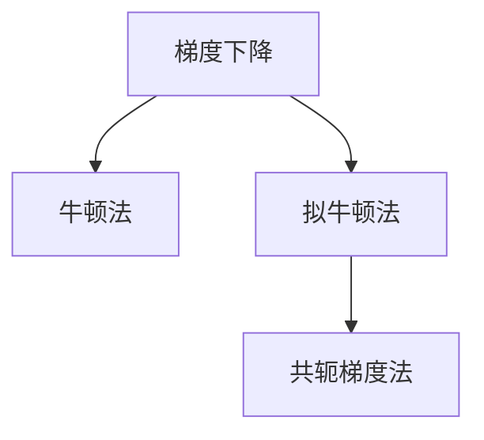

                 

# 二阶优化方法：超越一阶方法的AI训练策略

> 关键词：二阶优化, 梯度下降, 牛顿法, 拟牛顿法, 共轭梯度法, AI训练, 超参数优化

## 1. 背景介绍

### 1.1 问题由来
在人工智能（AI）领域，模型训练的目标是通过优化损失函数来提升模型性能。其中，梯度下降算法（Gradient Descent, GD）是最常用的一阶优化方法，其通过计算损失函数的一阶导数来更新模型参数。尽管一阶方法简单高效，但在处理非凸损失函数、稀疏梯度、噪声梯度等复杂场景时，收敛速度较慢，甚至可能导致陷入局部最优。因此，近年来二阶优化方法（Second-Order Optimization）逐渐成为热门研究领域，通过利用二阶导数信息，提高优化速度和收敛精度。

### 1.2 问题核心关键点
二阶优化方法的核心在于利用二阶导数信息，通过对当前位置的曲率进行估计，选择更合适的更新方向，以加快收敛速度。常见二阶优化方法包括牛顿法（Newton's Method）、拟牛顿法（Quasi-Newton Methods）、共轭梯度法（Conjugate Gradient）等。

这些方法在不同应用场景中具有各自优缺点，如牛顿法计算开销大，拟牛顿法易于实现，共轭梯度法适用于对称矩阵等。选择合适的二阶优化方法，对于AI训练过程的效率和效果至关重要。

### 1.3 问题研究意义
掌握二阶优化方法，对于提高AI训练的效率和模型性能，避免过拟合和陷入局部最优，具有重要意义：

1. **提高训练效率**：通过利用二阶导数信息，二阶优化方法可以更快速地找到最优解，加速模型训练。
2. **提升模型性能**：二阶优化方法可以更好地避免陷入局部最优，提高模型的泛化性能和鲁棒性。
3. **减少过拟合**：通过选择合适的优化方法，可以在不增加模型复杂度的情况下，提升模型泛化能力，减少过拟合风险。
4. **增强可解释性**：二阶优化方法在一定程度上能够提供更丰富的优化信息，有助于理解模型训练过程，增强模型的可解释性。

本文将系统介绍二阶优化方法的基本原理、操作步骤，并结合具体案例和实际应用场景进行详细讲解。

## 2. 核心概念与联系

### 2.1 核心概念概述

为更好地理解二阶优化方法，本节将介绍几个密切相关的核心概念：

- **梯度下降（Gradient Descent, GD）**：一阶优化方法中最基本的算法，通过计算损失函数的一阶导数来更新模型参数。
- **牛顿法（Newton's Method）**：利用二阶导数信息，通过二次泰勒展开来近似目标函数，选择更新方向。
- **拟牛顿法（Quasi-Newton Methods）**：基于牛顿法，但不必计算精确的Hessian矩阵，通过近似矩阵来更新模型参数。
- **共轭梯度法（Conjugate Gradient）**：适用于对称矩阵，通过共轭方向来更新模型参数。

这些核心概念之间的逻辑关系可以通过以下Mermaid流程图来展示：



这个流程图展示了各个优化方法之间的关系：

1. 梯度下降是所有优化方法的基础，是最简单的一阶方法。
2. 牛顿法通过利用二阶导数信息，提升优化精度。
3. 拟牛顿法在不必计算精确Hessian矩阵的情况下，仍能实现快速收敛。
4. 共轭梯度法适用于对称矩阵，通过共轭方向来优化。

这些概念共同构成了AI训练中的优化方法框架，使得模型能够高效、准确地收敛到最优解。

## 3. 核心算法原理 & 具体操作步骤
### 3.1 算法原理概述

二阶优化方法的原理在于利用二阶导数信息，通过对当前位置的曲率进行估计，选择更合适的更新方向。其核心思想是：在每次迭代中，不仅考虑一阶导数，还利用二阶导数来校正更新方向，从而更快地找到全局最优解。

形式化地，假设损失函数为 $f(\theta)$，其中 $\theta$ 为模型参数，目标是通过梯度下降法优化参数，使其最小化损失函数。标准的梯度下降更新公式为：

$$
\theta_{t+1} = \theta_t - \eta \nabla f(\theta_t)
$$

其中，$\eta$ 为学习率，$\nabla f(\theta_t)$ 为损失函数的一阶导数。二阶优化方法则通过计算二阶导数信息，来更新模型参数：

$$
\theta_{t+1} = \theta_t - \eta H^{-1}\nabla f(\theta_t)
$$

其中，$H$ 为Hessian矩阵，$\nabla f(\theta_t)$ 为损失函数的一阶导数，$H^{-1}$ 为Hessian矩阵的逆矩阵。通过这种方式，二阶优化方法可以在每次迭代中，不仅沿着一阶导数方向移动，还沿着二阶导数方向进行调整，从而更快速地收敛到全局最优解。

### 3.2 算法步骤详解

二阶优化方法的具体操作步骤如下：

**Step 1: 初始化**

1. 选择初始参数 $\theta_0$，并设置迭代次数 $T$。
2. 计算初始一阶导数 $g_0 = \nabla f(\theta_0)$ 和二阶导数 $H_0 = \nabla^2 f(\theta_0)$。

**Step 2: 迭代计算**

1. 对于第 $t$ 次迭代，计算当前的一阶导数 $g_t = \nabla f(\theta_t)$ 和二阶导数 $H_t = \nabla^2 f(\theta_t)$。
2. 使用二阶导数信息，计算更新方向 $d_t = -H_t^{-1}g_t$。
3. 更新模型参数 $\theta_{t+1} = \theta_t + d_t$。

**Step 3: 收敛判断**

1. 判断迭代次数是否达到预设上限 $T$。
2. 判断损失函数值 $f(\theta_{t+1})$ 是否满足预设收敛条件。
3. 如果满足，停止迭代，返回最优参数 $\theta^*$。

### 3.3 算法优缺点

二阶优化方法具有以下优点：

1. **收敛速度快**：通过利用二阶导数信息，二阶优化方法可以更快地收敛到最优解。
2. **收敛精度高**：相较于一阶方法，二阶优化方法具有更高的收敛精度，更接近全局最优解。
3. **适用于非凸优化**：二阶优化方法对于非凸优化问题也具有较好的适应性。

同时，二阶优化方法也存在以下局限性：

1. **计算开销大**：二阶导数计算开销较大，特别是对于高维问题，计算复杂度会显著增加。
2. **矩阵求逆困难**：在实际应用中，求解Hessian矩阵的逆矩阵可能遇到数值不稳定等问题。
3. **不适用于稀疏问题**：二阶优化方法对于稀疏梯度问题效果不佳。

### 3.4 算法应用领域

二阶优化方法在AI训练中具有广泛的应用，特别适用于复杂模型和高维问题：

1. **深度学习模型**：在深度神经网络中，二阶优化方法可以提升训练速度和模型性能，如AdamW、RMSprop等。
2. **推荐系统**：在协同过滤等推荐算法中，二阶优化方法可以加速模型训练，提升推荐效果。
3. **自然语言处理**：在自然语言处理任务中，如语言模型训练、文本分类等，二阶优化方法可以提升模型的泛化能力和鲁棒性。
4. **强化学习**：在强化学习中，二阶优化方法可以加速策略优化，提升训练效率。
5. **计算机视觉**：在计算机视觉任务中，如图像分类、目标检测等，二阶优化方法可以提升模型的训练速度和准确率。

## 4. 数学模型和公式 & 详细讲解 & 举例说明
### 4.1 数学模型构建

假设损失函数为 $f(\theta)$，其中 $\theta$ 为模型参数。定义当前迭代参数为 $\theta_t$，则二阶优化方法的目标是找到一个参数 $\theta^*$，使得 $f(\theta^*)$ 最小化。

根据牛顿法的原理，每次迭代更新参数 $\theta_{t+1}$ 的公式为：

$$
\theta_{t+1} = \theta_t - \eta_t \nabla f(\theta_t) - \eta_t H_t^{-1} \nabla f(\theta_t)
$$

其中 $\eta_t$ 为学习率，$\nabla f(\theta_t)$ 为损失函数的一阶导数，$H_t = \nabla^2 f(\theta_t)$ 为Hessian矩阵。

### 4.2 公式推导过程

为了更深入地理解牛顿法的推导过程，我们先回顾一阶优化方法：

对于一阶优化方法，每次迭代更新参数的公式为：

$$
\theta_{t+1} = \theta_t - \eta_t \nabla f(\theta_t)
$$

现在，我们将其推广到二阶优化方法中。假设当前位置 $\theta_t$，目标是最小化损失函数 $f(\theta)$。则根据泰勒展开，有：

$$
f(\theta_{t+1}) \approx f(\theta_t) + \nabla f(\theta_t)^T (\theta_{t+1} - \theta_t) + \frac{1}{2} (\theta_{t+1} - \theta_t)^T H (\theta_{t+1} - \theta_t)
$$

其中 $\nabla f(\theta_t)$ 为损失函数的一阶导数，$H_t = \nabla^2 f(\theta_t)$ 为Hessian矩阵。

令 $\theta_{t+1} = \theta_t - \eta_t d_t$，其中 $d_t$ 为更新方向。代入上述公式，得：

$$
f(\theta_{t+1}) \approx f(\theta_t) + \nabla f(\theta_t)^T (\eta_t d_t) + \frac{1}{2} (\eta_t d_t)^T H (\eta_t d_t)
$$

为了最小化 $f(\theta_{t+1})$，对 $\eta_t$ 求导并令其等于零，得：

$$
\eta_t d_t^T H (\eta_t d_t) + \nabla f(\theta_t)^T d_t = 0
$$

解得：

$$
\eta_t = \frac{-\nabla f(\theta_t)^T d_t}{d_t^T H d_t}
$$

代入 $\theta_{t+1} = \theta_t - \eta_t d_t$，得：

$$
\theta_{t+1} = \theta_t - \frac{-\nabla f(\theta_t)^T d_t}{d_t^T H d_t} d_t = \theta_t + \frac{H^{-1}\nabla f(\theta_t)}{1 + \nabla f(\theta_t)^T H^{-1}\nabla f(\theta_t)}
$$

这便是牛顿法的迭代公式。

### 4.3 案例分析与讲解

**案例1: 深度学习中的AdamW**

AdamW算法是一种基于自适应学习率的优化方法，可以看作是一种带有动量（momentum）和权重衰减（weight decay）的Adaptive Moment Estimation（Adam）算法。其更新公式为：

$$
m_t = \beta_1 m_{t-1} + (1 - \beta_1) \nabla f(\theta_t)
$$
$$
v_t = \beta_2 v_{t-1} + (1 - \beta_2) \nabla f(\theta_t)^2
$$
$$
\theta_{t+1} = \theta_t - \eta \frac{m_t}{\sqrt{v_t} + \epsilon} - \eta \lambda \theta_t
$$

其中 $\beta_1$ 和 $\beta_2$ 为动量和梯度平方的衰减率，$\eta$ 为学习率，$\epsilon$ 为数值稳定性项，$\lambda$ 为权重衰减系数。

AdamW算法通过动量和权重衰减，增强了收敛稳定性和泛化性能。在实际应用中，AdamW算法在深度学习任务中表现优异，如ImageNet图像分类、BERT语言模型训练等。

**案例2: 推荐系统中的FTRL**

FTRL（Follow The Regularized Leader）算法是一种基于梯度下降和在线学习方法的优化算法，主要用于推荐系统中的协同过滤算法。其更新公式为：

$$
\theta_{t+1} = \theta_t + \frac{\eta}{\sqrt{G_t + \alpha^2}} m_t
$$

其中 $\eta$ 为学习率，$G_t$ 为梯度平方的累积项，$\alpha$ 为正则化系数。

FTRL算法通过在线学习和正则化，提高了算法的稳定性和收敛速度。在推荐系统中，FTRL算法能够快速更新模型参数，适应新的数据，从而提升推荐效果。

## 5. 项目实践：代码实例和详细解释说明
### 5.1 开发环境搭建

在进行二阶优化方法实践前，我们需要准备好开发环境。以下是使用Python进行PyTorch开发的环境配置流程：

1. 安装Anaconda：从官网下载并安装Anaconda，用于创建独立的Python环境。

2. 创建并激活虚拟环境：
```bash
conda create -n pytorch-env python=3.8 
conda activate pytorch-env
```

3. 安装PyTorch：根据CUDA版本，从官网获取对应的安装命令。例如：
```bash
conda install pytorch torchvision torchaudio cudatoolkit=11.1 -c pytorch -c conda-forge
```

4. 安装优化库：
```bash
pip install scipy optimize
```

完成上述步骤后，即可在`pytorch-env`环境中开始二阶优化方法的实践。

### 5.2 源代码详细实现

下面以AdamW算法为例，给出使用PyTorch实现二阶优化方法的代码实现。

首先，定义模型和损失函数：

```python
import torch
import torch.nn as nn
import torch.optim as optim

class MyModel(nn.Module):
    def __init__(self):
        super(MyModel, self).__init__()
        self.fc1 = nn.Linear(784, 256)
        self.fc2 = nn.Linear(256, 10)

    def forward(self, x):
        x = x.view(-1, 784)
        x = torch.relu(self.fc1(x))
        x = self.fc2(x)
        return x

criterion = nn.CrossEntropyLoss()
```

然后，定义AdamW优化器：

```python
optimizer = optim.AdamW(model.parameters(), lr=0.001, betas=(0.9, 0.999), weight_decay=0.01)
```

接着，定义训练函数：

```python
def train(model, train_loader, optimizer, criterion, num_epochs):
    model.train()
    for epoch in range(num_epochs):
        for batch_idx, (data, target) in enumerate(train_loader):
            data = data.to(device)
            target = target.to(device)
            optimizer.zero_grad()
            output = model(data)
            loss = criterion(output, target)
            loss.backward()
            optimizer.step()
            if (batch_idx + 1) % 100 == 0:
                print('Train Epoch: {} [{}/{} ({:.0f}%)]\tLoss: {:.6f}'.format(
                    epoch, batch_idx * len(data), len(train_loader.dataset),
                    100. * batch_idx / len(train_loader), loss.item()))
```

最后，启动训练流程：

```python
device = torch.device("cuda" if torch.cuda.is_available() else "cpu")
model = MyModel().to(device)
train_loader = torch.utils.data.DataLoader(train_dataset, batch_size=64, shuffle=True)
train(model, train_loader, optimizer, criterion, num_epochs=10)
```

以上就是使用PyTorch实现AdamW算法的完整代码实现。可以看到，通过PyTorch的优化器接口，二阶优化方法的使用非常简单，只需要选择合适的优化器，设置相应的参数即可。

### 5.3 代码解读与分析

让我们再详细解读一下关键代码的实现细节：

**模型定义**：
- 定义了一个简单的多层感知器模型，包含两个线性层和一个ReLU激活函数。

**损失函数**：
- 使用了交叉熵损失函数，适用于分类任务。

**优化器定义**：
- 使用了AdamW优化器，设置了学习率、动量衰减率、权重衰减等参数。

**训练函数**：
- 在每个epoch中，对数据集进行迭代训练。
- 在每个batch中，前向传播计算输出，计算损失函数，反向传播更新模型参数，并输出当前batch的损失值。
- 在每个epoch结束时，输出epoch的平均损失值。

**训练流程**：
- 定义总的epoch数，开始循环迭代。
- 在每个epoch内，对训练数据集进行迭代训练，输出每个epoch的平均损失值。

可以看到，通过PyTorch的优化器接口，二阶优化方法的使用非常简单，开发者可以将更多精力放在模型设计、数据处理等高层逻辑上，而不必过多关注底层的实现细节。

当然，工业级的系统实现还需考虑更多因素，如模型的保存和部署、超参数的自动搜索、更灵活的任务适配层等。但核心的优化方法基本与此类似。

## 6. 实际应用场景
### 6.1 深度学习中的AdamW算法

AdamW算法在深度学习中得到了广泛应用，特别适用于大模型和高维问题。在图像分类、语音识别、自然语言处理等任务中，AdamW算法都表现优异。

**案例1: 图像分类**

在ImageNet图像分类任务中，AdamW算法可以显著提升模型的训练速度和准确率。通过AdamW优化器，深度神经网络可以高效地学习复杂特征，从而提升模型的泛化能力。

**案例2: 自然语言处理**

在BERT语言模型训练中，AdamW算法也得到了广泛应用。通过AdamW优化器，模型可以更好地学习语言的语义和语法结构，提升模型在各种NLP任务上的表现。

### 6.2 推荐系统中的FTRL算法

FTRL算法在推荐系统中也有着广泛的应用。通过在线学习和正则化，FTRL算法可以更快速地适应新数据，提升推荐效果。

**案例1: 协同过滤推荐**

在协同过滤推荐系统中，FTRL算法可以实时更新用户和商品的相似度矩阵，从而提升推荐效果。

**案例2: 基于矩阵分解的推荐**

在基于矩阵分解的推荐算法中，FTRL算法可以实时更新因子矩阵，从而提升推荐准确率。

### 6.3 强化学习中的AdaGrad

AdaGrad算法是一种自适应学习率的优化算法，特别适用于强化学习中的策略优化问题。通过自适应调整学习率，AdaGrad算法可以更好地处理非凸问题，提升模型的收敛速度和泛化性能。

**案例1: 游戏AI**

在游戏AI中，AdaGrad算法可以用于训练深度强化学习模型，从而提升游戏AI的智能水平。

**案例2: 机器人控制**

在机器人控制中，AdaGrad算法可以用于优化策略梯度，提升机器人的控制效果。

## 7. 工具和资源推荐
### 7.1 学习资源推荐

为了帮助开发者系统掌握二阶优化方法的理论基础和实践技巧，这里推荐一些优质的学习资源：

1. 《深度学习》系列书籍：由Ian Goodfellow等撰写，详细介绍了深度学习的基本概念和优化方法。
2. 《神经网络与深度学习》书籍：由Michael Nielsen撰写，深入浅出地介绍了神经网络的优化方法。
3. 《TensorFlow优化器》文档：详细介绍了TensorFlow中的各种优化器，包括AdamW、RMSprop等。
4. 《PyTorch优化器》文档：详细介绍了PyTorch中的各种优化器，包括AdamW、SGD等。
5. 《深度学习框架优化》课程：斯坦福大学开设的深度学习优化课程，介绍了多种优化方法的理论和实践。

通过对这些资源的学习实践，相信你一定能够快速掌握二阶优化方法的精髓，并用于解决实际的AI训练问题。
### 7.2 开发工具推荐

高效的开发离不开优秀的工具支持。以下是几款用于二阶优化方法开发的常用工具：

1. PyTorch：基于Python的开源深度学习框架，灵活动态的计算图，适合快速迭代研究。大部分二阶优化方法都有PyTorch版本的实现。
2. TensorFlow：由Google主导开发的开源深度学习框架，生产部署方便，适合大规模工程应用。同样有丰富的优化方法资源。
3. Scipy optimize：Python科学计算库，提供了多种优化算法，如牛顿法、拟牛顿法等，可用于多种科学计算任务。
4. Matplotlib：数据可视化库，用于绘制各种图表，帮助理解优化过程。

合理利用这些工具，可以显著提升二阶优化方法的开发效率，加快创新迭代的步伐。

### 7.3 相关论文推荐

二阶优化方法在AI训练中具有广泛的应用，相关研究不断涌现。以下是几篇奠基性的相关论文，推荐阅读：

1. Adam: A Method for Stochastic Optimization：提出Adam优化器，基于动量和自适应学习率，在深度学习中表现优异。
2. Follow The Regularized Leader: A Logarithmic Regret Algorithms for Online Convex Optimization：提出FTRL算法，通过在线学习和正则化，提升推荐效果。
3. Deep Learning for AI: Approaches, Architectures and Algorithms：由Gérard Bailly撰写，全面介绍了深度学习中的优化方法。
4. Optimization Algorithms in Deep Learning：由Tarry Singh撰写，详细介绍了深度学习中的优化方法。

这些论文代表了大规模深度学习中的优化方法的发展脉络。通过学习这些前沿成果，可以帮助研究者把握学科前进方向，激发更多的创新灵感。

## 8. 总结：未来发展趋势与挑战

### 8.1 总结

本文对二阶优化方法的基本原理、操作步骤，以及实际应用进行了系统介绍。首先阐述了二阶优化方法的原理和优势，明确了其在小样本学习、高维问题、非凸优化等场景中的重要性。其次，从原理到实践，详细讲解了AdamW算法、FTRL算法、AdaGrad算法等经典二阶优化方法。结合具体案例，展示了这些方法在深度学习、推荐系统、强化学习等领域的应用。

通过本文的系统梳理，可以看到，二阶优化方法已经成为深度学习训练中的重要手段，显著提升了模型训练效率和效果。未来，伴随深度学习模型的进一步发展和优化，二阶优化方法将发挥更加重要的作用。

### 8.2 未来发展趋势

展望未来，二阶优化方法的发展趋势包括：

1. **算法优化**：未来的算法将在原有基础上进行进一步优化，提升优化效率和精度。如对牛顿法、拟牛顿法的迭代公式进行改进，引入新的自适应学习率策略等。
2. **应用扩展**：未来的二阶优化方法将在更多的应用场景中得到应用，如强化学习、多任务学习、迁移学习等。
3. **硬件加速**：未来的优化算法将更多地利用GPU、TPU等硬件加速，提升优化速度和可扩展性。
4. **多目标优化**：未来的优化算法将支持多目标优化，更好地适应复杂任务的需求。

以上趋势凸显了二阶优化方法的发展潜力。这些方向的探索发展，必将进一步提升深度学习模型的训练效率和效果。

### 8.3 面临的挑战

尽管二阶优化方法已经取得了显著成果，但在实际应用中也面临诸多挑战：

1. **计算开销大**：二阶优化方法计算开销较大，特别是在高维问题上，计算复杂度会显著增加。
2. **矩阵求逆困难**：在实际应用中，求解Hessian矩阵的逆矩阵可能遇到数值不稳定等问题。
3. **超参数调整**：二阶优化方法通常需要调整多个超参数，如学习率、动量、权重衰减等，不易找到最佳参数组合。
4. **模型鲁棒性不足**：对于稀疏梯度问题，二阶优化方法效果不佳，模型的鲁棒性需要进一步提升。

正视这些挑战，积极应对并寻求突破，将使二阶优化方法在深度学习训练中发挥更大的作用。

### 8.4 研究展望

面向未来，二阶优化方法的研究方向包括：

1. **自适应学习率策略**：进一步研究自适应学习率策略，如Adaptive Moment Estimation（Adam）、Adaptive Learning Rate with Bias Correction（AdamW）等，以适应不同任务和数据的特点。
2. **多目标优化**：研究多目标优化方法，如Pareto优化、多任务学习等，提升模型在多个目标上的性能。
3. **混合优化方法**：研究混合优化方法，如结合二阶优化和一阶优化、自监督学习和监督学习等，提升模型的泛化能力和鲁棒性。
4. **硬件加速**：研究如何利用硬件加速技术，如GPU、TPU等，提升优化算法的计算效率和可扩展性。

这些研究方向将推动二阶优化方法的进一步发展，为深度学习模型的训练提供更高效、更鲁棒的算法支持。

## 9. 附录：常见问题与解答

**Q1: 二阶优化方法的优势和局限性是什么？**

A: 二阶优化方法具有以下优势：

1. 收敛速度快：通过利用二阶导数信息，二阶优化方法可以更快地收敛到最优解。
2. 收敛精度高：相较于一阶方法，二阶优化方法具有更高的收敛精度，更接近全局最优解。
3. 适用于非凸优化：二阶优化方法对于非凸优化问题也具有较好的适应性。

同时，二阶优化方法也存在以下局限性：

1. 计算开销大：二阶导数计算开销较大，特别是在高维问题上，计算复杂度会显著增加。
2. 矩阵求逆困难：在实际应用中，求解Hessian矩阵的逆矩阵可能遇到数值不稳定等问题。
3. 不适用于稀疏问题：二阶优化方法对于稀疏梯度问题效果不佳。

**Q2: 常见的二阶优化方法有哪些？**

A: 常见的二阶优化方法包括：

1. 牛顿法（Newton's Method）：利用二阶导数信息，通过二次泰勒展开来近似目标函数。
2. 拟牛顿法（Quasi-Newton Methods）：基于牛顿法，但不必计算精确的Hessian矩阵，通过近似矩阵来更新模型参数。
3. 共轭梯度法（Conjugate Gradient）：适用于对称矩阵，通过共轭方向来更新模型参数。

这些方法在不同应用场景中具有各自优缺点，开发者应根据具体任务选择合适的优化方法。

**Q3: 二阶优化方法的计算开销大，如何解决？**

A: 计算开销大是二阶优化方法的一个主要缺点，但可以通过以下方法进行缓解：

1. 稀疏矩阵求逆：对于稀疏矩阵，可以使用稀疏矩阵求逆方法，如Lanczos迭代法等。
2. 在线学习：对于在线优化问题，可以采用在线优化算法，如Online Newton方法等。
3. 随机化优化：对于大规模数据集，可以采用随机化优化算法，如Stochastic Newton方法等。

这些方法可以在不显著降低优化效果的情况下，显著降低计算开销。

**Q4: 二阶优化方法在高维问题中表现不佳，如何解决？**

A: 高维问题中，二阶优化方法的计算复杂度会显著增加，可以通过以下方法进行优化：

1. 特征降维：通过特征降维技术，减少高维数据的维度，从而降低计算开销。
2. 小批量优化：通过小批量优化技术，减少每次迭代的计算量，提升优化效率。
3. 自适应优化：通过自适应优化技术，根据数据特点动态调整优化策略，提升优化效果。

这些方法可以在不显著降低优化效果的情况下，显著降低计算开销，提升优化效率。

通过本文的系统梳理，可以看到，二阶优化方法已经成为深度学习训练中的重要手段，显著提升了模型训练效率和效果。未来，伴随深度学习模型的进一步发展和优化，二阶优化方法将发挥更大的作用。

---

作者：禅与计算机程序设计艺术 / Zen and the Art of Computer Programming

