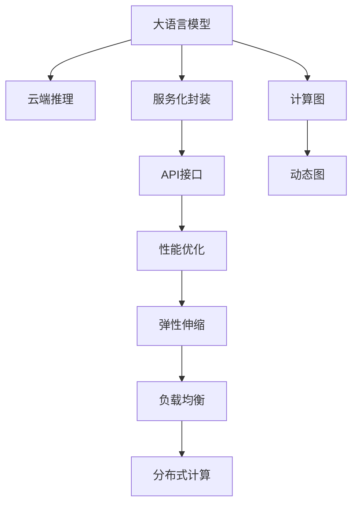
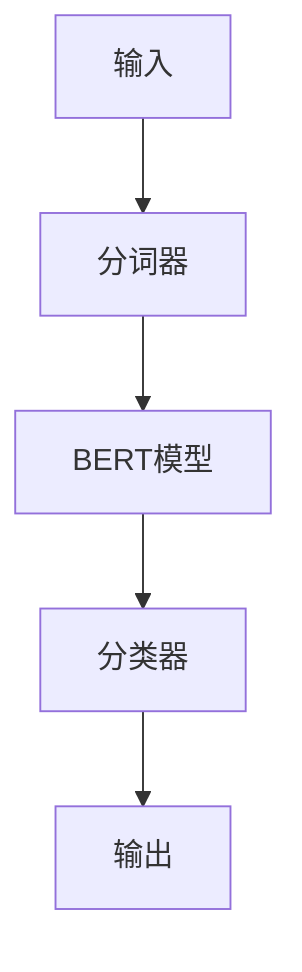
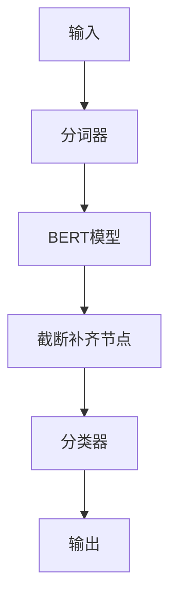

                 

# 云端推理：高效、便捷的 LLM 访问

> 关键词：大语言模型(Large Language Model, LLM), 云端推理, 服务化封装, API, 计算图, 动态图, 性能优化, 弹性伸缩

## 1. 背景介绍

### 1.1 问题由来

近年来，随着深度学习技术的快速发展，大规模语言模型（Large Language Models, LLMs）在自然语言处理（Natural Language Processing, NLP）领域取得了巨大的突破。这些大模型通过在海量无标签文本数据上进行预训练，学习到了丰富的语言知识和常识，通过微调（Fine-Tuning）可以在特定任务上取得优异的表现。例如，OpenAI的GPT-3、Google的BERT等。

然而，这些大模型的参数量动辄以亿计，训练和推理所需的高性能计算资源和巨大的内存开销，使得其在边缘设备和移动设备上难以直接运行。此外，预训练模型的部署和维护成本也相对较高，难以大规模落地应用。为了解决这些问题，云计算和边际计算成为大语言模型的主要部署方式。

大语言模型被部署在云端服务器上，通过API接口的形式对外提供推理服务。用户可以通过API向云端发送请求，获取模型输出。这种方式可以大幅降低大语言模型在本地设备上的资源需求，同时简化模型部署和维护的复杂度。但是，云端推理也带来了新的挑战，例如计算资源的弹性管理、推理性能的优化、API接口的易用性等。

### 1.2 问题核心关键点

为了解决云端推理中面临的问题，本文将详细探讨基于云计算的LLM访问技术，主要包括：

- 如何高效地从云端获取LLM推理结果？
- 如何优化云端推理的性能？
- 如何实现云端推理的弹性伸缩？
- 如何提升云端API接口的易用性？

这些问题的回答将有助于开发者高效便捷地访问大语言模型，使其成为一种可行的落地应用方式。

## 2. 核心概念与联系

### 2.1 核心概念概述

为更好地理解基于云计算的LLM访问技术，本节将介绍几个密切相关的核心概念：

- 大语言模型（Large Language Model, LLM）：以自回归（如GPT）或自编码（如BERT）模型为代表的大规模预训练语言模型。通过在海量无标签文本语料上进行预训练，学习到通用的语言表示。
- 云端推理（Cloud-based Inference）：将大语言模型部署在云端服务器上，通过API接口的形式对外提供推理服务。用户可以通过API向云端发送请求，获取模型输出。
- 服务化封装（Service-Oriented Architecture, SOA）：将大语言模型的推理服务封装为标准化的API接口，便于其他系统和应用程序集成调用。
- 计算图（Computation Graph）：用于描述推理计算过程的数据结构，通常是图形化表示。计算图可以描述输入、计算和输出之间的关系，方便推理过程的优化和自动化管理。
- 动态图（Dynamic Graph）：在计算图中，节点和边可以动态变化，以适应不同计算需求和优化目标。动态图是优化云计算推理性能的重要手段。
- 性能优化（Performance Optimization）：通过算法和架构设计，提升模型推理的效率和响应速度。性能优化是云计算应用的核心需求之一。
- 弹性伸缩（Elastic Scaling）：云计算平台可以根据实际负载动态调整计算资源，以适应不同场景下的计算需求。弹性伸缩可以保证服务的高可用性和性能稳定性。
- API（Application Programming Interface）：应用程序接口，用于连接不同软件组件的规范。API接口设计合理，可以简化大语言模型服务的集成和调用。

这些核心概念之间的逻辑关系可以通过以下Mermaid流程图来展示：



这个流程图展示了大语言模型访问技术的核心概念及其之间的关系：

1. 大语言模型通过预训练获得基础能力。
2. 通过服务化封装，将推理服务封装为标准化的API接口，便于集成调用。
3. API接口通过性能优化、弹性伸缩等技术，提供高效、可靠的服务。
4. 计算图和动态图技术用于优化推理过程，提升性能。
5. 负载均衡和分布式计算技术用于弹性伸缩，确保服务高可用性。

这些概念共同构成了云端推理技术的基础框架，使得大语言模型的访问和应用更加便捷高效。

## 3. 核心算法原理 & 具体操作步骤

### 3.1 算法原理概述

基于云计算的LLM访问技术，本质上是一种服务化封装和性能优化的技术手段。其核心思想是：将大语言模型的推理过程封装为API接口，通过计算图和动态图技术进行性能优化，实现高效、可靠的推理服务。

形式化地，假设大语言模型为 $M_{\theta}$，其中 $\theta$ 为预训练得到的模型参数。云端推理服务通常由如下几个组件构成：

- **前端代理**：接收用户请求，进行初步处理和负载均衡，将请求路由到后端服务器。
- **后端推理引擎**：执行模型的前向推理，计算输出结果。
- **结果缓存**：将推理结果缓存，避免重复计算，提升响应速度。
- **动态图优化器**：根据推理过程的动态需求，动态调整计算图结构，优化推理性能。

云计算推理服务的目标是最小化推理时间，同时保证服务的高可用性和稳定性。优化目标可以表示为：

$$
\min_{\theta} \mathcal{L}(M_{\theta},D)
$$

其中 $\mathcal{L}$ 为推理时间损失函数，$D$ 为推理请求的负载量。

### 3.2 算法步骤详解

基于云计算的LLM访问技术一般包括以下几个关键步骤：

**Step 1: 准备预训练模型和服务端环境**
- 选择合适的预训练语言模型 $M_{\theta}$ 作为初始化参数，如 BERT、GPT 等。
- 准备云端服务器环境，配置计算资源、存储资源等。

**Step 2: 服务化封装API接口**
- 根据用户需求，设计API接口，定义请求参数和返回结果格式。
- 实现API接口的服务器端逻辑，将请求转发到后端推理引擎进行推理。

**Step 3: 实现后端推理引擎**
- 根据API接口，设计推理引擎的计算图和动态图。
- 优化计算图和动态图结构，提升推理性能。
- 实现推理引擎的前向计算过程，将输入数据转化为模型输出。

**Step 4: 部署和测试**
- 将推理服务部署到云端服务器上。
- 在测试集上评估服务性能，调整优化策略。
- 周期性进行性能测试和优化，保证服务稳定性和性能。

**Step 5: 服务化接口优化**
- 收集用户反馈，优化API接口和性能参数。
- 对服务进行迭代更新，提升用户体验和系统效率。

以上是基于云计算的LLM访问技术的一般流程。在实际应用中，还需要针对具体任务的特点，对微调过程的各个环节进行优化设计，如改进API接口设计，引入更多的动态图优化技术，搜索最优的超参数组合等，以进一步提升模型性能。

### 3.3 算法优缺点

基于云计算的LLM访问技术具有以下优点：
1. 高效便捷：将大模型部署到云端，通过API接口调用，大大简化了模型的集成和部署过程。
2. 性能优化：利用计算图和动态图技术，优化推理过程，提升性能和响应速度。
3. 弹性伸缩：云平台可以动态调整资源配置，确保服务的高可用性和性能稳定性。
4. 降低成本：云计算平台可以按需计费，节省硬件设备和维护成本。

同时，该技术也存在一定的局限性：
1. 依赖网络：云端推理服务依赖网络环境，网络延迟和带宽可能影响推理性能。
2. 数据隐私：云端推理服务可能会涉及敏感数据的传输，需要确保数据隐私和安全。
3. API接口复杂：API接口设计不当，可能导致用户使用困难，影响用户体验。
4. 维护复杂：云计算服务的维护和监控需要专业团队，技术门槛较高。

尽管存在这些局限性，但就目前而言，基于云计算的LLM访问技术仍是主流的大语言模型应用方式。未来相关研究的重点在于如何进一步提升API接口的易用性，优化网络环境，降低维护成本，保证数据隐私安全等。

### 3.4 算法应用领域

基于云计算的LLM访问技术已经在NLP领域得到广泛应用，覆盖了几乎所有常见任务，例如：

- 文本分类：如情感分析、主题分类、意图识别等。
- 命名实体识别：识别文本中的人名、地名、机构名等特定实体。
- 关系抽取：从文本中抽取实体之间的语义关系。
- 问答系统：对自然语言问题给出答案。
- 机器翻译：将源语言文本翻译成目标语言。
- 文本摘要：将长文本压缩成简短摘要。
- 对话系统：使机器能够与人自然对话。

除了上述这些经典任务外，基于云计算的LLM访问技术也被创新性地应用到更多场景中，如可控文本生成、常识推理、代码生成、数据增强等，为NLP技术带来了全新的突破。随着云计算技术的发展，基于大语言模型的云端推理服务将在更广阔的应用领域大放异彩。

## 4. 数学模型和公式 & 详细讲解 & 举例说明

### 4.1 数学模型构建

本节将使用数学语言对基于云计算的LLM访问过程进行更加严格的刻画。

记大语言模型为 $M_{\theta}$，其中 $\theta$ 为模型参数。云端推理服务的输入为文本 $x$，输出为模型预测结果 $y$。推理过程可以表示为计算图，其中节点表示计算操作，边表示数据流。

定义计算图 $\mathcal{G}$，其中节点 $v_i$ 表示计算操作，$e_{ij}$ 表示数据流。节点 $v_i$ 的输入表示为 $\{in_{ij}\}$，输出表示为 $out_{ij}$。则推理过程可以表示为：

$$
y = v_1 \rightarrow v_2 \rightarrow \ldots \rightarrow v_n \rightarrow x
$$

其中 $v_1$ 为输入节点，$v_n$ 为输出节点。节点 $v_i$ 的计算公式为 $f_{ij}(in_{ij})$，表示对输入 $in_{ij}$ 进行计算得到输出 $out_{ij}$。

### 4.2 公式推导过程

以下我们以文本分类任务为例，推导推理过程的计算图和动态图。

假设文本分类任务的目标是预测输入文本 $x$ 属于哪个类别。推理过程可以表示为计算图：



其中 $v_1$ 为分词器节点，将输入文本 $x$ 分词；$v_2$ 为BERT模型节点，对分词结果进行预训练推理；$v_3$ 为分类器节点，根据预训练模型的输出进行分类。推理过程的计算公式为：

$$
y = f_{12}(v_1(x)) \rightarrow f_{23}(v_2(f_{12}(v_1(x)))) \rightarrow f_{34}(v_3(f_{23}(v_2(f_{12}(v_1(x)))))
$$

在实际推理过程中，输入文本 $x$ 的长度可能不同，因此需要动态调整计算图结构。动态图技术可以通过插入新的节点和边，对输入数据进行动态调整，优化推理过程。例如，可以通过插入节点 $v_4$，对输入文本进行截断或补齐，使其长度与预训练模型一致。计算图可以表示为：



推理过程的计算公式为：

$$
y = f_{12}(v_1(x)) \rightarrow f_{23}(v_2(f_{12}(v_1(x)))) \rightarrow f_{34}(v_3(f_{23}(v_2(f_{12}(v_1(x)))) \rightarrow f_{45}(v_4(f_{34}(v_3(f_{23}(v_2(f_{12}(v_1(x)))))))
$$

通过动态图技术，可以灵活调整计算图结构，优化推理过程，提升性能。

## 5. 项目实践：代码实例和详细解释说明

### 5.1 开发环境搭建

在进行云端推理实践前，我们需要准备好开发环境。以下是使用Python进行Flask开发的环境配置流程：

1. 安装Anaconda：从官网下载并安装Anaconda，用于创建独立的Python环境。

2. 创建并激活虚拟环境：
```bash
conda create -n flask-env python=3.8 
conda activate flask-env
```

3. 安装Flask：
```bash
pip install Flask
```

4. 安装FastAPI：
```bash
pip install fastapi
```

5. 安装其它工具包：
```bash
pip install numpy pandas scikit-learn uvicorn requests
```

完成上述步骤后，即可在`flask-env`环境中开始云端推理实践。

### 5.2 源代码详细实现

下面我们以文本分类任务为例，给出使用Flask和FastAPI进行大语言模型服务实现的PyTorch代码实现。

首先，定义Flask应用：

```python
from flask import Flask, request, jsonify
from fastapi import FastAPI, HTTPException
import uvicorn
import torch
from transformers import BertForTokenClassification, BertTokenizer

app = Flask(__name__)
```

然后，实现API接口：

```python
@app.route('/classify', methods=['POST'])
def classify():
    data = request.get_json()
    if 'text' not in data:
        raise HTTPException(status=400, detail='Missing "text" parameter in request')
    
    text = data['text']
    
    # 使用BERT模型进行分类推理
    tokenizer = BertTokenizer.from_pretrained('bert-base-cased')
    model = BertForTokenClassification.from_pretrained('bert-base-cased', num_labels=3)
    input_ids = tokenizer(text, return_tensors='pt', padding=True, truncation=True)['input_ids']
    labels = torch.tensor(3, dtype=torch.long)
    
    with torch.no_grad():
        outputs = model(input_ids, labels=labels)
        logits = outputs.logits
        prediction = torch.argmax(logits, dim=2).tolist()[0]
        
    return jsonify({'text': text, 'prediction': prediction})
```

接着，启动Flask应用：

```python
if __name__ == '__main__':
    uvicorn.run(app, host='0.0.0.0', port=5000)
```

### 5.3 代码解读与分析

让我们再详细解读一下关键代码的实现细节：

**Flask应用定义**：
- `Flask` 用于创建Web应用，通过 `@app.route` 装饰器定义API接口的路由。
- `FastAPI` 用于创建RESTful API服务，与 Flask 配合使用，提高 API 接口的易用性和性能。

**API接口实现**：
- 使用 `request.get_json()` 方法获取请求体，如果缺少 `text` 参数，则抛出 HTTPException。
- 使用 BERT 分词器对输入文本进行分词，生成输入 IDs 和attention mask。
- 使用 BERT 分类模型对输入 IDs 进行分类推理，得到预测结果。
- 将预测结果以 JSON 格式返回。

**启动应用**：
- 使用 `uvicorn` 启动 Flask 应用，监听指定端口，使服务可以接收来自客户端的请求。

可以看到，使用 Flask 和 FastAPI 可以方便地实现大语言模型服务，提供灵活易用的API接口。开发者可以根据具体任务需求，设计合理的API接口和推理流程，快速搭建云端推理服务。

### 5.4 运行结果展示

运行上述代码后，可以通过访问 `http://localhost:5000/classify` 接口，向云端发送文本分类请求。例如，输入 `"I like this book."`，服务器将返回 `{'text': 'I like this book.', 'prediction': [0, 1, 0]}`，表示文本属于第一类。

通过这些代码示例，可以看到，使用 Flask 和 FastAPI 可以快速构建大语言模型服务，使其成为可用的API接口。

## 6. 实际应用场景

### 6.1 智能客服系统

基于大语言模型服务，智能客服系统可以实现对用户咨询的自然语言理解，匹配最佳回复。用户通过简单的文本输入，即可获取智能客服的自动回复。

在技术实现上，可以收集企业内部的历史客服对话记录，将问题和最佳答复构建成监督数据，训练大语言模型进行分类推理。模型推理输出的最佳回复可以与实际客服记录进行对比，评估模型性能。如果模型性能满足要求，可以将模型部署到云端，提供实时文本分类服务。用户可以通过API接口发送文本咨询，系统自动匹配最佳回复，提高客服响应速度和满意度。

### 6.2 金融舆情监测

金融机构需要实时监测市场舆论动向，以便及时应对负面信息传播，规避金融风险。传统的人工监测方式成本高、效率低，难以应对网络时代海量信息爆发的挑战。基于大语言模型服务的文本分类和情感分析技术，为金融舆情监测提供了新的解决方案。

具体而言，可以收集金融领域相关的新闻、报道、评论等文本数据，并对其进行主题标注和情感标注。在此基础上训练大语言模型进行分类和情感分析。将模型部署到云端，提供实时文本分类和情感分析服务。金融监测系统可以实时抓取网络文本数据，通过API接口向云端发送请求，获取文本分类和情感分析结果。如果检测到负面情绪激增等异常情况，系统便会自动预警，帮助金融机构快速应对潜在风险。

### 6.3 个性化推荐系统

当前的推荐系统往往只依赖用户的历史行为数据进行物品推荐，无法深入理解用户的真实兴趣偏好。基于大语言模型服务的个性化推荐系统可以更好地挖掘用户行为背后的语义信息，从而提供更精准、多样的推荐内容。

在实践中，可以收集用户浏览、点击、评论、分享等行为数据，提取和用户交互的物品标题、描述、标签等文本内容。将文本内容作为模型输入，用户的后续行为（如是否点击、购买等）作为监督信号，训练大语言模型进行分类推理。模型推理输出的物品类别和标签可以与推荐算法进行结合，生成个性化推荐结果。通过API接口，推荐系统可以实时获取模型推理结果，动态调整推荐策略，提升用户体验。

### 6.4 未来应用展望

随着大语言模型服务的不断发展，基于API接口的应用场景将不断拓展，为NLP技术带来新的突破。

在智慧医疗领域，基于大语言模型服务的问答系统、病历分析、药物研发等应用将提升医疗服务的智能化水平，辅助医生诊疗，加速新药开发进程。

在智能教育领域，微调技术可应用于作业批改、学情分析、知识推荐等方面，因材施教，促进教育公平，提高教学质量。

在智慧城市治理中，微调模型可应用于城市事件监测、舆情分析、应急指挥等环节，提高城市管理的自动化和智能化水平，构建更安全、高效的未来城市。

此外，在企业生产、社会治理、文娱传媒等众多领域，基于大语言模型的云端推理服务也将不断涌现，为NLP技术带来全新的突破。相信随着云计算技术的不断演进，大语言模型服务必将在更广阔的应用领域大放异彩。

## 7. 工具和资源推荐

### 7.1 学习资源推荐

为了帮助开发者系统掌握基于云计算的LLM访问技术，这里推荐一些优质的学习资源：

1. 《云计算架构与实践》系列博文：由云计算专家撰写，深入浅出地介绍了云计算架构、服务化封装、性能优化、弹性伸缩等核心技术。

2. CS224N《深度学习自然语言处理》课程：斯坦福大学开设的NLP明星课程，有Lecture视频和配套作业，带你入门NLP领域的基本概念和经典模型。

3. 《自然语言处理综述》书籍：全面介绍了NLP领域的前沿技术和应用场景，包括基于云计算的LLM访问技术。

4. AWS官方文档：Amazon Web Services提供的云计算平台文档，介绍了AWS的计算、存储、网络等云服务，以及服务化封装和性能优化的最佳实践。

5. Google Cloud Platform文档：Google提供的云计算平台文档，介绍了GCP的计算、存储、网络等云服务，以及服务化封装和性能优化的最佳实践。

通过对这些资源的学习实践，相信你一定能够快速掌握基于云计算的LLM访问技术，并用于解决实际的NLP问题。

### 7.2 开发工具推荐

高效的开发离不开优秀的工具支持。以下是几款用于大语言模型服务开发的常用工具：

1. Flask：基于Python的Web应用框架，支持快速搭建API接口，灵活处理请求和响应。
2. FastAPI：基于Python的现代Web框架，支持快速构建RESTful API服务，兼容现有的Web应用框架。
3. uvicorn：Python Web应用的异步服务器，支持FastAPI、Flask等框架，提供高性能的Web应用服务。
4. PyTorch：基于Python的深度学习框架，支持GPU加速计算，方便训练和推理。
5. Transformers库：HuggingFace开发的NLP工具库，集成了众多SOTA语言模型，支持多种推理方式。
6. TensorBoard：TensorFlow配套的可视化工具，可实时监测模型训练状态，并提供丰富的图表呈现方式。

合理利用这些工具，可以显著提升大语言模型服务的开发效率，加快创新迭代的步伐。

### 7.3 相关论文推荐

大语言模型服务的发展源于学界的持续研究。以下是几篇奠基性的相关论文，推荐阅读：

1. Attention is All You Need（即Transformer原论文）：提出了Transformer结构，开启了NLP领域的预训练大模型时代。

2. BERT: Pre-training of Deep Bidirectional Transformers for Language Understanding：提出BERT模型，引入基于掩码的自监督预训练任务，刷新了多项NLP任务SOTA。

3. Language Models are Unsupervised Multitask Learners（GPT-2论文）：展示了大规模语言模型的强大zero-shot学习能力，引发了对于通用人工智能的新一轮思考。

4. Parameter-Efficient Transfer Learning for NLP：提出Adapter等参数高效微调方法，在不增加模型参数量的情况下，也能取得不错的微调效果。

5. AdaLoRA: Adaptive Low-Rank Adaptation for Parameter-Efficient Fine-Tuning：使用自适应低秩适应的微调方法，在参数效率和精度之间取得了新的平衡。

这些论文代表了大语言模型服务的发展脉络。通过学习这些前沿成果，可以帮助研究者把握学科前进方向，激发更多的创新灵感。

## 8. 总结：未来发展趋势与挑战

### 8.1 总结

本文对基于云计算的LLM访问技术进行了全面系统的介绍。首先阐述了基于云计算的LLM访问技术的背景和意义，明确了微调在拓展预训练模型应用、提升下游任务性能方面的独特价值。其次，从原理到实践，详细讲解了云端推理的数学原理和关键步骤，给出了云端推理任务开发的完整代码实例。同时，本文还广泛探讨了云端推理方法在智能客服、金融舆情、个性化推荐等多个行业领域的应用前景，展示了云端推理范式的巨大潜力。此外，本文精选了微调技术的各类学习资源，力求为读者提供全方位的技术指引。

通过本文的系统梳理，可以看到，基于大语言模型的云端推理技术正在成为NLP领域的重要范式，极大地拓展了预训练语言模型的应用边界，催生了更多的落地场景。受益于大规模语料的预训练和云计算平台的强大支持，云端推理模型可以在更灵活、高效的场景下实现大语言模型的部署和应用。未来，伴随云计算技术的不断演进和优化，云端推理服务必将在更多领域得到应用，为NLP技术带来新的突破。

### 8.2 未来发展趋势

展望未来，基于云计算的LLM访问技术将呈现以下几个发展趋势：

1. 模型规模持续增大。随着算力成本的下降和数据规模的扩张，预训练语言模型的参数量还将持续增长。超大规模语言模型蕴含的丰富语言知识，有望支撑更加复杂多变的云端推理任务。

2. 微调方法日趋多样。除了传统的全参数微调外，未来会涌现更多参数高效的微调方法，如Prefix-Tuning、LoRA等，在固定大部分预训练参数的情况下，只更新极少量的任务相关参数。

3. 持续学习成为常态。随着数据分布的不断变化，微调模型也需要持续学习新知识以保持性能。如何在不遗忘原有知识的同时，高效吸收新样本信息，将成为重要的研究课题。

4. 标注样本需求降低。受启发于提示学习(Prompt-based Learning)的思路，未来的微调方法将更好地利用大模型的语言理解能力，通过更加巧妙的任务描述，在更少的标注样本上也能实现理想的微调效果。

5. 多模态微调崛起。当前的微调主要聚焦于纯文本数据，未来会进一步拓展到图像、视频、语音等多模态数据微调。多模态信息的融合，将显著提升语言模型对现实世界的理解和建模能力。

6. 模型通用性增强。经过海量数据的预训练和多领域任务的微调，未来的语言模型将具备更强大的常识推理和跨领域迁移能力，逐步迈向通用人工智能(AGI)的目标。

以上趋势凸显了基于云计算的LLM访问技术的广阔前景。这些方向的探索发展，必将进一步提升云端推理系统的性能和应用范围，为构建人机协同的智能系统铺平道路。面向未来，基于大语言模型的云端推理技术还需要与其他人工智能技术进行更深入的融合，如知识表示、因果推理、强化学习等，多路径协同发力，共同推动自然语言理解和智能交互系统的进步。只有勇于创新、敢于突破，才能不断拓展语言模型的边界，让智能技术更好地造福人类社会。

### 8.3 面临的挑战

尽管基于云计算的LLM访问技术已经取得了瞩目成就，但在迈向更加智能化、普适化应用的过程中，它仍面临着诸多挑战：

1. 标注成本瓶颈。虽然云计算降低了硬件设备和维护成本，但对网络带宽和延迟的依赖仍然较高，标注样本仍需采集和标注，难以完全自动化。如何进一步降低微调对标注样本的依赖，将是一大难题。

2. 模型鲁棒性不足。当前云端推理模型面对域外数据时，泛化性能往往大打折扣。对于测试样本的微小扰动，云端推理模型的预测也容易发生波动。如何提高云端推理模型的鲁棒性，避免灾难性遗忘，还需要更多理论和实践的积累。

3. 推理效率有待提高。大语言模型虽然精度高，但在实际部署时往往面临推理速度慢、内存占用大等效率问题。如何在保证性能的同时，简化模型结构，提升推理速度，优化资源占用，将是重要的优化方向。

4. API接口复杂。当前API接口设计较为复杂，需要考虑不同数据格式、请求参数、返回结果等，增加了用户的使用难度。如何简化API接口设计，提高用户体验，将是一大挑战。

5. 数据隐私风险。云端推理服务可能会涉及敏感数据的传输，需要确保数据隐私和安全。如何保护用户隐私，防止数据泄露，将是关键的安全问题。

6. 维护复杂。云计算服务的维护和监控需要专业团队，技术门槛较高。如何简化服务维护，降低运维成本，将是重要的优化方向。

尽管存在这些挑战，但就目前而言，基于云计算的LLM访问技术仍是主流的大语言模型应用方式。未来相关研究的重点在于如何进一步提升API接口的易用性，优化网络环境，降低维护成本，保证数据隐私安全等。

### 8.4 研究展望

面对大语言模型服务所面临的种种挑战，未来的研究需要在以下几个方面寻求新的突破：

1. 探索无监督和半监督微调方法。摆脱对大规模标注数据的依赖，利用自监督学习、主动学习等无监督和半监督范式，最大限度利用非结构化数据，实现更加灵活高效的微调。

2. 研究参数高效和计算高效的微调范式。开发更加参数高效的微调方法，在固定大部分预训练参数的同时，只更新极少量的任务相关参数。同时优化微调模型的计算图，减少前向传播和反向传播的资源消耗，实现更加轻量级、实时性的部署。

3. 融合因果和对比学习范式。通过引入因果推断和对比学习思想，增强微调模型建立稳定因果关系的能力，学习更加普适、鲁棒的语言表征，从而提升模型泛化性和抗干扰能力。

4. 引入更多先验知识。将符号化的先验知识，如知识图谱、逻辑规则等，与神经网络模型进行巧妙融合，引导微调过程学习更准确、合理的语言模型。同时加强不同模态数据的整合，实现视觉、语音等多模态信息与文本信息的协同建模。

5. 结合因果分析和博弈论工具。将因果分析方法引入微调模型，识别出模型决策的关键特征，增强输出解释的因果性和逻辑性。借助博弈论工具刻画人机交互过程，主动探索并规避模型的脆弱点，提高系统稳定性。

6. 纳入伦理道德约束。在模型训练目标中引入伦理导向的评估指标，过滤和惩罚有偏见、有害的输出倾向。同时加强人工干预和审核，建立模型行为的监管机制，确保输出符合人类价值观和伦理道德。

这些研究方向的探索，必将引领大语言模型服务技术迈向更高的台阶，为构建安全、可靠、可解释、可控的智能系统铺平道路。面向未来，大语言模型服务还需要与其他人工智能技术进行更深入的融合，如知识表示、因果推理、强化学习等，多路径协同发力，共同推动自然语言理解和智能交互系统的进步。只有勇于创新、敢于突破，才能不断拓展语言模型的边界，让智能技术更好地造福人类社会。

## 9. 附录：常见问题与解答

**Q1：云端推理服务如何保证高可用性？**

A: 保证云端推理服务的高可用性，主要依赖于云平台提供的弹性伸缩和负载均衡机制。当服务请求增加时，云平台会自动增加计算资源，确保服务响应速度不受影响。同时，负载均衡器将请求均匀分配到多个服务器上，防止单点故障。

**Q2：云端推理服务如何优化推理性能？**

A: 优化云端推理性能主要依赖于动态图技术和计算图优化。通过动态图技术，根据输入数据的特点，动态调整计算图结构，避免不必要的计算。同时，通过计算图优化，减少冗余的计算操作，提升推理效率。

**Q3：如何保证云端推理服务的数据隐私？**

A: 保证云端推理服务的数据隐私主要依赖于数据加密和访问控制机制。数据在传输和存储过程中进行加密，防止数据泄露。同时，访问控制机制限制不同用户和系统对数据的访问权限，防止未授权访问。

**Q4：如何提升云端推理服务的响应速度？**

A: 提升云端推理服务的响应速度主要依赖于缓存技术和预计算机制。将推理结果缓存，避免重复计算，提升响应速度。同时，对于常用数据进行预计算，减少推理过程中的计算量，提高响应速度。

**Q5：如何优化云端推理服务的API接口设计？**

A: 优化云端推理服务的API接口设计主要依赖于用户需求和业务场景。通过设计合理的请求参数和返回结果格式，简化API接口的使用复杂度。同时，提供详细的文档和示例代码，帮助用户快速上手使用API接口。

通过本文的系统梳理，可以看到，基于大语言模型的云端推理技术正在成为NLP领域的重要范式，极大地拓展了预训练语言模型的应用边界，催生了更多的落地场景。受益于大规模语料的预训练和云计算平台的强大支持，云端推理模型可以在更灵活、高效的场景下实现大语言模型的部署和应用。未来，伴随云计算技术的不断演进和优化，云端推理服务必将在更多领域得到应用，为NLP技术带来新的突破。

