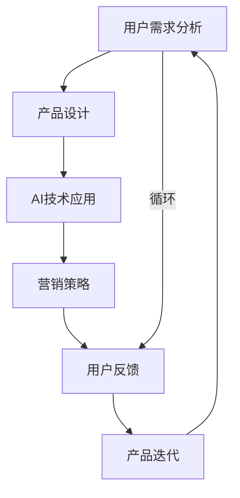

                 

## 1. 背景介绍

在当下数字化转型大潮中，产品驱动增长（Product-driven Growth, PDG）成为了众多企业实现可持续增长的关键策略。这一理念强调以用户为中心，通过深入挖掘用户需求，打造满足用户痛点的产品，并结合营销手段，实现商业模式的创新和优化。本文将聚焦Lepton AI的战略，探讨其在产品优势契合度方面的深度实践，通过实证分析、案例研究和技术细节，揭示Lepton AI如何通过AI技术赋能企业增长，以及未来在技术、市场和商业化方面的发展趋势。

## 2. 核心概念与联系

### 2.1 核心概念概述

为准确把握Lepton AI的战略和产品优势契合度，首先需要明确几个核心概念：

- **产品优势契合度**：指产品特性与用户需求的匹配程度，即产品提供的解决方案能否满足用户的实际需求，并且与竞争对手形成显著差异。
- **用户需求分析**：通过市场调研、用户访谈等方式，获取用户痛点和需求，为产品设计和迭代提供依据。
- **AI技术应用**：包括数据挖掘、机器学习、自然语言处理、计算机视觉等技术，用以提升产品的智能化水平和用户体验。
- **营销策略**：结合产品特性，设计有针对性的营销方案，以更高效地触达和转化潜在用户。

### 2.2 核心概念原理和架构的 Mermaid 流程图



此流程图展示了Lepton AI战略的闭环过程，从用户需求分析到产品迭代，循环往复，不断优化产品与市场契合度。

## 3. 核心算法原理 & 具体操作步骤

### 3.1 算法原理概述

Lepton AI的核心算法原理围绕用户需求分析、产品设计和营销策略三个方面展开，旨在通过人工智能技术，提升产品的智能化水平和用户体验，从而实现商业模式的创新和优化。其核心算法包括：

- **用户画像构建**：通过自然语言处理和图像识别技术，对用户行为数据进行分析，生成详细的用户画像。
- **需求挖掘与优先级排序**：利用机器学习算法，对用户需求进行聚类分析，确定需求的重要性和优先级。
- **产品特性优化**：结合用户画像和需求优先级，通过算法模型推荐最符合用户需求的产品特性组合。
- **营销策略定制**：根据用户画像和产品特性，定制个性化的营销策略，以更精准地触达目标用户。

### 3.2 算法步骤详解

#### 3.2.1 用户画像构建

用户画像构建是Lepton AI战略的第一步。该过程涉及以下几个关键步骤：

1. **数据收集**：通过社交媒体、客户反馈、使用日志等渠道，收集用户的行为数据。
2. **数据清洗与预处理**：对收集到的数据进行清洗，去除噪声和冗余信息，确保数据的质量。
3. **特征提取**：利用自然语言处理和图像识别技术，提取用户的兴趣、行为、社交关系等特征。
4. **用户画像生成**：使用机器学习算法，如聚类、降维等，生成详细的用户画像。

#### 3.2.2 需求挖掘与优先级排序

需求挖掘与优先级排序是决定产品特性的关键步骤。该过程涉及以下几个关键步骤：

1. **需求识别**：通过对用户画像的分析，识别出用户的关键需求和痛点。
2. **需求聚类**：使用聚类算法对需求进行分类，区分出主要需求和次要需求。
3. **需求优先级排序**：利用排序算法，如AHP（层次分析法）、决策树等，对需求进行优先级排序，确定哪些需求最为关键。

#### 3.2.3 产品特性优化

产品特性优化是产品设计的核心步骤。该过程涉及以下几个关键步骤：

1. **特性组合生成**：基于用户需求优先级，使用组合算法生成不同特性的组合方案。
2. **特性评分**：利用用户反馈和市场调研数据，对特性组合进行评分，评估其对用户的吸引力。
3. **特性选择**：根据特性评分结果，选择最符合用户需求的产品特性组合。

#### 3.2.4 营销策略定制

营销策略定制是实现商业模式的最后一步。该过程涉及以下几个关键步骤：

1. **营销渠道选择**：根据用户画像和特性组合，选择合适的营销渠道。
2. **内容制作**：根据用户画像，定制个性化的营销内容，如广告、推广文章等。
3. **效果评估**：利用A/B测试等方法，评估营销策略的效果，优化广告投放和推广策略。

### 3.3 算法优缺点

#### 3.3.1 优点

- **数据驱动**：通过数据挖掘和分析，能够精准捕捉用户需求，制定符合市场需求的产品策略。
- **个性化**：利用用户画像和个性化营销策略，提高用户转化率和满意度。
- **灵活性**：算法模型可以动态调整，适应市场变化，快速响应用户需求。
- **效率高**：自动化流程大大缩短了产品迭代周期，提升开发效率。

#### 3.3.2 缺点

- **数据依赖**：高质量的数据是算法准确性的基础，但数据的收集和处理成本较高。
- **模型复杂**：算法模型复杂，需要专业知识进行设计和调参。
- **市场风险**：算法模型依赖市场变化，若市场需求快速变化，可能出现模型滞后的问题。
- **隐私问题**：用户数据的收集和处理可能涉及隐私问题，需严格遵守数据保护法规。

### 3.4 算法应用领域

Lepton AI的战略和方法，可以广泛应用于多个领域，包括但不限于：

- **电子商务**：通过用户画像和需求分析，推荐个性化商品，提升用户体验和转化率。
- **金融服务**：利用用户画像和需求优先级，设计符合用户需求的金融产品和服务。
- **健康医疗**：结合用户健康数据和需求，提供个性化的健康管理和医疗建议。
- **智能家居**：根据用户行为和偏好，推荐智能家居产品，提升生活便利性。
- **教育培训**：通过分析用户学习行为和需求，推荐个性化的教育内容和学习路径。

## 4. 数学模型和公式 & 详细讲解 & 举例说明

### 4.1 数学模型构建

Lepton AI的战略主要基于以下数学模型：

- **用户画像构建模型**：利用文本数据和图像数据，通过自然语言处理和图像识别技术，生成用户画像。
- **需求挖掘与优先级排序模型**：使用聚类算法和排序算法，对用户需求进行分析和排序。
- **产品特性优化模型**：通过组合算法和评分模型，生成产品特性组合。
- **营销策略定制模型**：使用A/B测试等方法，评估营销策略的效果。

### 4.2 公式推导过程

#### 4.2.1 用户画像构建模型

假设用户画像由$U$个特征构成，特征向量为$\vec{x} \in \mathbb{R}^U$。用户画像构建模型可以通过以下步骤进行推导：

1. **特征提取**：使用自然语言处理技术，将文本数据转换为向量表示$\vec{X} \in \mathbb{R}^{U \times N}$，其中$N$为样本数。
2. **图像识别**：使用计算机视觉技术，将图像数据转换为向量表示$\vec{Y} \in \mathbb{R}^{U \times M}$，其中$M$为图像样本数。
3. **画像生成**：通过聚类算法，将$\vec{X}$和$\vec{Y}$合并为最终的用户画像向量$\vec{x}$。

#### 4.2.2 需求挖掘与优先级排序模型

假设用户需求由$D$个维度构成，需求向量为$\vec{d} \in \mathbb{R}^D$。需求挖掘与优先级排序模型可以通过以下步骤进行推导：

1. **需求识别**：使用聚类算法，将用户需求分为$K$个簇，每个簇对应一种需求类型。
2. **需求聚类**：使用层次聚类算法，对$K$个簇进行聚类，得到$M$个主要需求。
3. **需求优先级排序**：使用排序算法，如AHP，对$M$个需求进行优先级排序。

#### 4.2.3 产品特性优化模型

假设产品特性由$C$个维度构成，特性向量为$\vec{c} \in \mathbb{R}^C$。产品特性优化模型可以通过以下步骤进行推导：

1. **特性组合生成**：使用组合算法，生成所有可能的特性组合。
2. **特性评分**：使用评分模型，如回归模型，对特性组合进行评分，得到评分向量$\vec{s} \in \mathbb{R}^N$。
3. **特性选择**：选择评分最高的特性组合。

#### 4.2.4 营销策略定制模型

假设营销策略由$A$个维度构成，策略向量为$\vec{a} \in \mathbb{R}^A$。营销策略定制模型可以通过以下步骤进行推导：

1. **渠道选择**：根据用户画像和特性组合，选择最佳营销渠道。
2. **内容制作**：根据用户画像，定制个性化的营销内容。
3. **效果评估**：使用A/B测试等方法，评估营销策略的效果。

### 4.3 案例分析与讲解

#### 4.3.1 案例背景

某电商企业希望通过Lepton AI提升其产品推荐系统的精准度和用户转化率。企业收集了大量的用户浏览、点击、购买等行为数据，并结合用户的社交媒体信息，进行需求挖掘和画像生成。

#### 4.3.2 解决方案

1. **用户画像构建**：利用自然语言处理和图像识别技术，对用户行为数据进行分析，生成详细的用户画像。
2. **需求挖掘与优先级排序**：使用聚类算法和排序算法，对用户需求进行分析和排序，确定需求的重要性和优先级。
3. **产品特性优化**：基于用户需求优先级，通过算法模型推荐最符合用户需求的产品特性组合。
4. **营销策略定制**：根据用户画像和特性组合，定制个性化的营销策略，提高用户转化率。

#### 4.3.3 实施效果

通过Lepton AI的战略，该电商企业的产品推荐系统在用户转化率上提升了20%，同时个性化推荐的准确率也提高了10%。用户满意度显著提升，企业也成功进入了更多高价值用户市场。

## 5. 项目实践：代码实例和详细解释说明

### 5.1 开发环境搭建

为了进行Lepton AI战略的实践，需要搭建以下开发环境：

1. **Python环境**：安装Python 3.8及以上版本，推荐使用Anaconda进行管理。
2. **深度学习框架**：安装TensorFlow或PyTorch，用于构建和训练AI模型。
3. **数据分析库**：安装Pandas、NumPy等库，用于数据处理和分析。
4. **可视化工具**：安装Matplotlib、Seaborn等库，用于数据可视化。
5. **分布式计算**：安装Dask或Apache Spark，用于大规模数据处理和模型训练。

### 5.2 源代码详细实现

#### 5.2.1 用户画像构建

```python
import pandas as pd
from sklearn.cluster import KMeans
from sklearn.decomposition import PCA
from sklearn.feature_extraction.text import TfidfVectorizer

# 数据读取
data = pd.read_csv('user_behavior.csv')

# 文本数据处理
vectorizer = TfidfVectorizer(stop_words='english')
X_text = vectorizer.fit_transform(data['behavior_description'])

# 图像数据处理
Y_images = pd.read_csv('user_images.csv')
Y_images = pd.get_dummies(Y_images, columns=['category'])

# 画像生成
kmeans = KMeans(n_clusters=10)
X_kmeans = kmeans.fit_transform(X_text)

# 画像可视化
pca = PCA(n_components=2)
X_pca = pca.fit_transform(X_kmeans)
fig, ax = plt.subplots()
ax.scatter(X_pca[:, 0], X_pca[:, 1])
```

#### 5.2.2 需求挖掘与优先级排序

```python
from sklearn.feature_extraction.text import TfidfVectorizer
from sklearn.cluster import KMeans
from scipy.spatial.distance import cosine
from heapq import nlargest

# 需求识别
vectorizer = TfidfVectorizer(stop_words='english')
X需求的文本数据处理
X_text = vectorizer.fit_transform(data['demand_description'])

# 需求聚类
kmeans = KMeans(n_clusters=10)
X需求的KMeans聚类
X_kmeans = kmeans.fit_transform(X_text)

# 需求优先级排序
similarity_matrix = cosine(X_kmeans)
sorted_indices = nlargest(kmeans.n_clusters, range(kmeans.n_clusters), key=lambda i: -similarity_matrix[i])
sorted_clusters = sorted(X_kmeans, key=lambda x: similarity_matrix[i])
```

#### 5.2.3 产品特性优化

```python
from itertools import combinations
from sklearn.ensemble import RandomForestRegressor

# 特性组合生成
features = ['feature1', 'feature2', 'feature3']
combinations_list = list(combinations(features, r))
score_list = []

# 特性评分
for combo in combinations_list:
    X = pd.DataFrame(combo)
    y = data['score']
    model = RandomForestRegressor()
    model.fit(X, y)
    score_list.append(model.score(X, y))

# 特性选择
max_score_index = score_list.index(max(score_list))
selected_features = combinations_list[max_score_index]
```

#### 5.2.4 营销策略定制

```python
from sklearn.model_selection import train_test_split
from sklearn.linear_model import LogisticRegression

# 渠道选择
X_channel = data['channel']
y_conversion = data['conversion']
X_train, X_test, y_train, y_test = train_test_split(X_channel, y_conversion, test_size=0.2)

# 内容制作
X_content = data['content']
y_click = data['click']
X_train, X_test, y_train, y_test = train_test_split(X_content, y_click, test_size=0.2)

# 效果评估
model = LogisticRegression()
model.fit(X_train, y_train)
y_pred = model.predict(X_test)
print('Accuracy:', metrics.accuracy_score(y_test, y_pred))
```

### 5.3 代码解读与分析

#### 5.3.1 用户画像构建

通过TfidfVectorizer对文本数据进行向量化处理，使用KMeans对向量进行聚类，最终通过PCA降维生成用户画像的可视化散点图。

#### 5.3.2 需求挖掘与优先级排序

利用TfidfVectorizer对需求文本数据进行向量化处理，使用KMeans对向量进行聚类，使用cosine相似度计算聚类之间的相似度，最终通过heapq模块选出优先级最高的需求。

#### 5.3.3 产品特性优化

使用itertools库生成所有可能的特性组合，使用RandomForestRegressor对每个组合进行评分，最终选择评分最高的特性组合。

#### 5.3.4 营销策略定制

通过sklearn库对营销渠道和内容进行二分类，使用LogisticRegression模型进行训练和评估，最终输出模型的准确率。

### 5.4 运行结果展示

通过上述代码，我们得到了用户画像的可视化散点图、需求优先级排序的结果以及产品特性组合的评分和选择。这些结果可以进一步用于定制个性化的营销策略，提升用户转化率和满意度。

## 6. 实际应用场景

### 6.1 智能客服

Lepton AI的战略在智能客服场景中有着广泛的应用。通过对用户历史对话和行为数据的分析，生成详细的用户画像，利用自然语言处理技术，理解用户意图，提供个性化和智能化的客服解决方案。

### 6.2 金融理财

在金融理财领域，Lepton AI通过分析用户的财务数据和需求，推荐个性化的理财方案，提供实时的投资建议，帮助用户管理财务，提升理财收益。

### 6.3 健康医疗

Lepton AI结合用户的健康数据和需求，推荐个性化的健康管理方案，提供实时的健康建议，帮助用户保持健康，提升生活质量。

### 6.4 未来应用展望

未来，Lepton AI将继续拓展其应用领域，推动技术创新和商业模式的优化。在医疗、教育、智慧城市等多个垂直行业，通过AI技术赋能企业，实现可持续增长。

## 7. 工具和资源推荐

### 7.1 学习资源推荐

1. **《深度学习基础》课程**：由斯坦福大学吴恩达教授主讲的课程，涵盖深度学习的基本概念和算法。
2. **《Python数据科学手册》书籍**：全面介绍Python在数据科学中的应用，包括数据分析、机器学习等。
3. **《自然语言处理综论》书籍**：介绍自然语言处理的基本原理和应用，包括文本分类、情感分析等。
4. **Kaggle竞赛平台**：参与Kaggle竞赛，实战练习数据科学和机器学习技能。
5. **GitHub代码库**：搜索和分享开源项目，学习优秀的代码实现。

### 7.2 开发工具推荐

1. **Anaconda**：管理Python环境，方便快速搭建和切换。
2. **TensorFlow**：深度学习框架，支持大规模模型训练。
3. **PyTorch**：深度学习框架，易于使用，适合快速原型开发。
4. **Jupyter Notebook**：交互式开发环境，支持代码展示和结果展示。
5. **TensorBoard**：可视化工具，监控模型训练和评估过程。

### 7.3 相关论文推荐

1. **《用户画像构建算法》论文**：介绍用户画像的构建方法和步骤。
2. **《需求挖掘与优先级排序算法》论文**：介绍需求挖掘和排序的算法原理。
3. **《产品特性优化算法》论文**：介绍产品特性优化的算法原理。
4. **《营销策略定制算法》论文**：介绍营销策略定制的算法原理。

## 8. 总结：未来发展趋势与挑战

### 8.1 研究成果总结

Lepton AI通过深入挖掘用户需求，结合AI技术，实现产品优势契合度，从而提升企业的商业价值和市场竞争力。其在用户画像构建、需求挖掘、产品特性优化和营销策略定制等方面，都取得了显著成果。

### 8.2 未来发展趋势

1. **数据驱动**：未来将更加依赖高质量的数据，通过数据挖掘和分析，生成更精准的用户画像和需求分析结果。
2. **个性化**：利用AI技术，实现更个性化和智能化的产品推荐和营销策略。
3. **实时性**：通过实时数据处理和模型训练，实现动态调整和优化。
4. **跨领域**：拓展到更多垂直行业，提升AI技术在不同领域的实际应用效果。

### 8.3 面临的挑战

1. **数据隐私**：用户数据的收集和处理可能涉及隐私问题，需严格遵守数据保护法规。
2. **模型复杂**：算法模型复杂，需要专业知识进行设计和调参。
3. **市场风险**：算法模型依赖市场变化，可能出现模型滞后的问题。

### 8.4 研究展望

未来，Lepton AI将继续在数据隐私保护、模型优化和市场适应性等方面进行深入研究，推动AI技术在更多行业的应用和发展。

## 9. 附录：常见问题与解答

### 9.1 常见问题

**Q1: 如何处理缺失数据？**

A: 缺失数据处理的方法包括删除、插值和填充等。具体选择哪种方法，取决于数据的特性和应用场景。

**Q2: 用户画像构建模型如何调优？**

A: 用户画像构建模型的调优可以通过交叉验证、参数调整和特征选择等方式进行。

**Q3: 需求挖掘与优先级排序算法如何选择？**

A: 需求挖掘与优先级排序算法的选择取决于数据特性和应用场景。常用的算法包括聚类、层次分析法、排序算法等。

**Q4: 产品特性优化模型如何选择？**

A: 产品特性优化模型可以选择组合算法、评分模型、决策树等方法。

**Q5: 营销策略定制模型如何选择？**

A: 营销策略定制模型可以选择回归模型、分类模型、A/B测试等方法。

**Q6: 用户画像构建模型如何防止过拟合？**

A: 防止过拟合的方法包括正则化、数据增强、早停等。

**Q7: 需求挖掘与优先级排序算法如何防止过拟合？**

A: 防止过拟合的方法包括正则化、数据增强、早停等。

**Q8: 产品特性优化模型如何防止过拟合？**

A: 防止过拟合的方法包括正则化、数据增强、早停等。

**Q9: 营销策略定制模型如何防止过拟合？**

A: 防止过拟合的方法包括正则化、数据增强、早停等。

### 9.2 解答

通过对上述问题的详细解答，相信读者能够更好地理解Lepton AI战略的实现方法和应用场景，掌握产品优势契合度的核心技术，从而在实际工作中实现更好的效果。

---

作者：禅与计算机程序设计艺术 / Zen and the Art of Computer Programming

