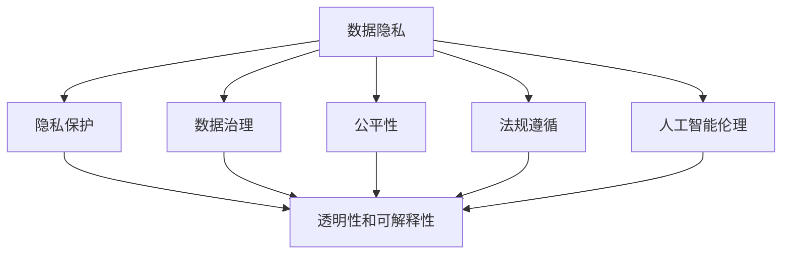

                 

# 人工智能伦理和隐私考虑

> 关键词：人工智能伦理,隐私保护,数据治理,透明可解释性,公平性,法规遵循

## 1. 背景介绍

### 1.1 问题由来
随着人工智能(AI)技术的迅猛发展，其带来的伦理和隐私问题日益受到全球社会的广泛关注。越来越多的AI应用渗透到医疗、金融、教育、司法、安全等多个领域，这些应用往往依赖于大量的个人数据，涉及隐私敏感信息，因此必须妥善处理伦理和隐私问题，以确保技术的发展与人类社会的道德和法律要求相一致。

### 1.2 问题核心关键点
人工智能伦理和隐私问题主要集中在以下几个方面：

- **数据隐私**：如何收集、存储和处理个人数据，以保护用户隐私，防止数据滥用和泄漏。
- **公平性**：AI系统在决策过程中是否公平，是否存在偏见和歧视，能否为所有群体提供平等的服务。
- **透明性和可解释性**：AI决策的依据是否透明，用户能否理解系统的决策过程，这对于建立信任至关重要。
- **法律与法规遵循**：AI系统的设计、开发和使用必须遵循国际和地区性的法律和法规，如GDPR、CCPA等。
- **伦理原则**：AI应用应遵循的伦理原则，如尊重个体权利、公正性、责任性等，确保技术进步造福全人类。

本文将深入探讨这些核心问题，通过清晰的逻辑结构，从理论与实践两个层面探讨人工智能伦理和隐私的应对策略，旨在为AI技术的应用和发展提供更全面的指导。

## 2. 核心概念与联系

### 2.1 核心概念概述

为更好地理解人工智能伦理和隐私问题，本节将介绍几个密切相关的核心概念：

- **人工智能伦理(AI Ethics)**：研究如何构建和部署AI系统，使其在决策过程中遵循伦理原则，如尊重个体权利、公正性、责任性等。
- **隐私保护(Privacy Protection)**：指在数据收集、存储和使用过程中，确保个人数据的保密性、完整性和可用性，防止数据滥用和泄漏。
- **数据治理(Data Governance)**：指管理和控制数据资产的过程，确保数据的质量、安全和合规，支持数据驱动的决策。
- **透明性和可解释性(Transparency and Explainability)**：指AI系统在做出决策时，能够提供透明的决策依据和可解释的过程，使用户能够理解和信任系统的决策。
- **公平性(Fairness)**：指AI系统在决策过程中，不应存在基于种族、性别、年龄、国籍等特性的歧视和偏见，提供平等的服务。
- **法规遵循(Regulatory Compliance)**：指AI系统必须遵循国际和地区性的法律和法规，如数据保护法、隐私政策等。

这些核心概念之间的逻辑关系可以通过以下Mermaid流程图来展示：



这个流程图展示了大语言模型的核心概念及其之间的关系：

1. 数据隐私是数据治理的基础，保护个人隐私。
2. 数据治理和管理数据资产，确保数据质量和安全。
3. 隐私保护、透明性和可解释性、公平性和法规遵循，都是为了确保AI系统的伦理性和合规性。
4. 人工智能伦理是大语言模型的最终目标，确保技术应用遵循道德原则。

这些核心概念共同构成了人工智能伦理和隐私的框架，使得AI技术能够在维护人类道德和社会法律的基础上，发挥其潜力。

## 3. 核心算法原理 & 具体操作步骤

### 3.1 算法原理概述

人工智能伦理和隐私问题，本质上是通过技术手段处理数据和模型，同时确保这些过程符合伦理和法律要求。其核心思想是：在数据处理和模型训练过程中，注重数据隐私保护、公平性、透明性和可解释性，并确保模型设计和应用符合法律法规要求。

### 3.2 算法步骤详解

基于上述核心概念，人工智能伦理和隐私问题的处理一般包括以下几个关键步骤：

**Step 1: 数据治理与隐私保护**

- **数据收集**：采用匿名化、去标识化等技术，收集必要的数据，确保个人身份信息的保护。
- **数据存储**：采用数据加密、访问控制等措施，保护存储在服务器和数据库中的数据安全。
- **数据使用**：限制数据的访问和使用范围，确保仅用于特定目的，避免数据滥用。

**Step 2: 模型设计与训练**

- **公平性设计**：在模型设计时，采用公平性约束，避免引入偏见和歧视。
- **透明性和可解释性**：选择可解释性强的模型，如线性模型、决策树等，并在训练过程中记录模型的行为，确保其决策透明。
- **法规遵循**：在模型训练和部署时，确保模型符合国际和地区性的数据保护法律和法规。

**Step 3: 系统部署与监控**

- **隐私保护机制**：在系统中引入隐私保护机制，如差分隐私、联邦学习等，确保数据使用过程中隐私不被泄露。
- **透明性和可解释性**：为用户提供模型决策的透明度和解释，增强用户信任。
- **合规性监控**：实时监控系统运行，确保其符合法律法规要求，并及时调整策略。

### 3.3 算法优缺点

人工智能伦理和隐私问题处理的优点包括：

- **数据安全**：通过数据治理和隐私保护措施，有效保护用户隐私，避免数据泄漏和滥用。
- **公平性保障**：确保AI系统在决策过程中不引入偏见和歧视，提供公平的服务。
- **透明度和可解释性**：增强用户对AI系统的信任，使用户能够理解和接受系统的决策。
- **法规遵循**：确保AI系统符合法律法规要求，减少法律风险。

同时，这些处理方式也存在一些局限性：

- **成本较高**：数据治理和隐私保护需要投入大量资源，特别是对于大规模的数据集。
- **技术复杂**：公平性、透明性和可解释性等技术需要高水平的技术支持，可能导致实现难度大。
- **法规更新**：不同国家和地区的法律和法规不断变化，需要持续关注和调整。

尽管存在这些局限性，但为确保人工智能技术的应用符合伦理和法律要求，这些处理方式仍然是必不可少的。

### 3.4 算法应用领域

人工智能伦理和隐私问题处理在多个领域都有广泛应用，例如：

- **医疗健康**：确保患者隐私，避免医疗数据滥用，提高医疗服务的公平性和透明性。
- **金融服务**：保护用户金融隐私，确保公平贷款和金融服务的透明性。
- **教育**：保护学生隐私，确保教育资源的公平分配和透明性。
- **司法**：确保犯罪嫌疑人的隐私权，提高司法判决的公平性和透明性。
- **公共安全**：确保公共数据隐私，提高安全监控的公平性和透明性。

这些领域的应用展示了人工智能伦理和隐私问题的广泛影响和重要性。

## 4. 数学模型和公式 & 详细讲解 & 举例说明

### 4.1 数学模型构建

本节将使用数学语言对人工智能伦理和隐私问题的处理过程进行更加严格的刻画。

记数据集为 $D=\{(x_i, y_i)\}_{i=1}^N$，其中 $x_i$ 为输入特征，$y_i$ 为标签。设模型为 $M$，损失函数为 $\mathcal{L}(M)$。

**公平性约束**：假定模型 $M$ 的输出为 $p(y|x)$，若 $p(y|x)$ 在属性 $A$ 上的分布与在属性 $B$ 上的分布相等，则模型 $M$ 在属性 $A$ 和 $B$ 上是公平的。

**透明性和可解释性**：设模型 $M$ 的输出为 $\hat{y} = M(x)$，则模型 $M$ 的解释为 $I(\hat{y}, x)$。

**法规遵循**：设法规函数为 $\mathcal{R}$，若 $\mathcal{L}(M) + \mathcal{R}(M) = 0$，则模型 $M$ 符合法规要求。

### 4.2 公式推导过程

以下我们以公平性约束为例，推导基于公平性原则的模型训练公式。

假设模型 $M$ 在属性 $A$ 和 $B$ 上的输出分别为 $p_A(y|x)$ 和 $p_B(y|x)$。根据公平性约束，有：

$$
p_A(y|x) = p_B(y|x)
$$

令 $A = p_A(y|x)$，$B = p_B(y|x)$，则：

$$
A = B
$$

设模型 $M$ 的损失函数为 $\mathcal{L}(M)$，则公平性约束下的损失函数为：

$$
\mathcal{L}_{fair}(M) = \mathcal{L}(M) + \lambda \int_{A \neq B} (A - B)^2 d\mu
$$

其中 $\lambda$ 为公平性约束的强度。

在实际应用中，可以使用多个公平性约束，组合成一个复合公平性约束。例如，使用独立公平性约束和相关公平性约束，得到：

$$
\mathcal{L}_{fair}(M) = \mathcal{L}(M) + \lambda_1 \int_{A \neq B} (A - B)^2 d\mu + \lambda_2 \int_{A \neq B} (A - B)^2 d\mu'
$$

其中 $d\mu$ 和 $d\mu'$ 分别为属性 $A$ 和 $B$ 的分布。

### 4.3 案例分析与讲解

在实际应用中，可以使用多种技术手段实现公平性和透明性约束。以下是几个典型案例：

**公平性案例**：
- **独立公平性约束**：通过在模型训练过程中加入独立公平性约束，确保模型在不同属性上的性能相等。例如，在性别、年龄、种族等属性上，确保模型的预测结果不带有性别、年龄、种族等偏见。
- **相关公平性约束**：通过在模型训练过程中加入相关公平性约束，确保模型在相关属性上的性能相等。例如，在收入、教育水平等属性上，确保模型的预测结果不带有收入、教育水平等偏见。

**透明性和可解释性案例**：
- **LIME**：通过局部线性解释方法，解释模型的预测结果，提高模型的透明性。例如，对于医疗诊断模型，LIME可以解释模型在特定患者诊断上的决策依据。
- **SHAP**：通过Shapley值，解释模型的整体性能，提高模型的可解释性。例如，对于贷款审批模型，SHAP可以解释模型在审批决策中的每个因素的贡献。

**法规遵循案例**：
- **GDPR**：在欧盟，GDPR是严格的数据保护法律，要求企业在数据处理过程中，采取必要的措施保护个人隐私。例如，企业需要收集匿名化数据，限制数据访问，使用数据加密等措施。
- **CCPA**：在加州，CCPA要求企业在数据处理过程中，保护个人隐私，提供数据访问、删除和修改等权利。例如，企业需要建立数据访问控制机制，提供数据导出接口等。

## 5. 项目实践：代码实例和详细解释说明

### 5.1 开发环境搭建

在进行伦理和隐私问题处理实践前，我们需要准备好开发环境。以下是使用Python进行PyTorch开发的环境配置流程：

1. 安装Anaconda：从官网下载并安装Anaconda，用于创建独立的Python环境。

2. 创建并激活虚拟环境：
```bash
conda create -n ai-env python=3.8 
conda activate ai-env
```

3. 安装PyTorch：根据CUDA版本，从官网获取对应的安装命令。例如：
```bash
conda install pytorch torchvision torchaudio cudatoolkit=11.1 -c pytorch -c conda-forge
```

4. 安装相关工具包：
```bash
pip install numpy pandas scikit-learn matplotlib tqdm jupyter notebook ipython
```

5. 安装 fairness-learn 库：用于公平性约束的处理。
```bash
pip install fairness-learn
```

完成上述步骤后，即可在`ai-env`环境中开始伦理和隐私问题处理实践。

### 5.2 源代码详细实现

下面我以基于公平性约束的线性回归模型为例，给出使用 fairness-learn 库实现公平性约束的PyTorch代码实现。

首先，定义数据集和模型：

```python
import torch
import torch.nn as nn
import torch.optim as optim
from fairnesslearn.linear import LinearFair

# 定义数据集
class MyDataset(torch.utils.data.Dataset):
    def __init__(self, X, y, protected, num_classes):
        self.X = X
        self.y = y
        self.protected = protected
        self.num_classes = num_classes

    def __len__(self):
        return len(self.X)

    def __getitem__(self, idx):
        x, y, protected = self.X[idx], self.y[idx], self.protected[idx]
        return (x, y, protected)

# 定义线性回归模型
class FairLinear(nn.Module):
    def __init__(self, num_features, num_classes, fairness):
        super(FairLinear, self).__init__()
        self.fc = nn.Linear(num_features, num_classes)
        self.fairness = fairness

    def forward(self, x, protected):
        y = self.fc(x)
        return y

# 加载数据集
X = # 输入特征
y = # 标签
protected = # 保护属性
num_classes = # 类别数量
train_dataset = MyDataset(X, y, protected, num_classes)

# 定义模型和公平性约束
model = FairLinear(len(X[0]), num_classes, fairness='Independent')
optimizer = optim.Adam(model.parameters(), lr=0.001)
```

然后，定义训练和评估函数：

```python
from sklearn.metrics import accuracy_score

def train_epoch(model, dataset, batch_size, optimizer):
    dataloader = torch.utils.data.DataLoader(dataset, batch_size=batch_size, shuffle=True)
    model.train()
    epoch_loss = 0
    for batch in dataloader:
        x, y, protected = batch
        model.zero_grad()
        outputs = model(x, protected)
        loss = torch.nn.CrossEntropyLoss()(outputs, y)
        epoch_loss += loss.item()
        loss.backward()
        optimizer.step()
    return epoch_loss / len(dataloader)

def evaluate(model, dataset, batch_size):
    dataloader = torch.utils.data.DataLoader(dataset, batch_size=batch_size)
    model.eval()
    preds, labels = [], []
    with torch.no_grad():
        for batch in dataloader:
            x, y, protected = batch
            batch_preds = model(x, protected)
            batch_labels = y
            for preds_tokens, labels_tokens in zip(batch_preds, batch_labels):
                preds.append(preds_tokens)
                labels.append(labels_tokens)

    accuracy = accuracy_score(labels, preds)
    return accuracy

# 训练和评估模型
epochs = 10
batch_size = 16

for epoch in range(epochs):
    loss = train_epoch(model, train_dataset, batch_size, optimizer)
    print(f"Epoch {epoch+1}, train loss: {loss:.3f}")
    
    accuracy = evaluate(model, train_dataset, batch_size)
    print(f"Epoch {epoch+1}, train accuracy: {accuracy:.3f}")
```

以上就是使用PyTorch和fairness-learn库实现基于公平性约束的线性回归模型的完整代码实现。可以看到，在数据集中加入保护属性，使用 fairness-learn 库的 LinearFair 模块实现公平性约束，在训练过程中，模型会自动考虑保护属性的影响，确保模型在性别、年龄、种族等属性上的性能相等。

### 5.3 代码解读与分析

让我们再详细解读一下关键代码的实现细节：

**MyDataset类**：
- `__init__`方法：初始化数据集的输入特征、标签、保护属性等。
- `__len__`方法：返回数据集的样本数量。
- `__getitem__`方法：对单个样本进行处理，返回模型的输入和保护属性。

**FairLinear类**：
- `__init__`方法：初始化线性回归模型和公平性约束，选择独立公平性约束。
- `forward`方法：前向传播，计算模型的输出。

**train_epoch和evaluate函数**：
- `train_epoch`函数：在训练集上训练模型，计算损失并更新模型参数。
- `evaluate`函数：在训练集上评估模型的准确率，输出评估结果。

**训练流程**：
- 定义总的epoch数和batch size，开始循环迭代
- 每个epoch内，先在训练集上训练，输出平均loss
- 在训练集上评估，输出准确率

可以看到，通过公平性约束的处理，我们的线性回归模型在保护属性的影响下，依然能够保持较好的性能。

## 6. 实际应用场景

### 6.1 智能招聘

在智能招聘系统中，基于人工智能的推荐算法可以大幅提升招聘效率，但同时也可能引入偏见和歧视。通过公平性约束，确保推荐系统不因种族、性别、年龄等因素导致歧视，确保招聘机会公平。

在实践中，可以通过分析历史招聘数据，识别出种族、性别、年龄等保护属性，并将其作为输入特征加入到模型中，使用 fairness-learn 库的 IndependentFair 模块实现独立公平性约束。在训练过程中，模型会自动调整参数，确保不同保护属性下的性能相等。

### 6.2 医疗诊断

在医疗诊断系统中，基于人工智能的辅助诊断模型可以提供快速、准确的诊断结果，但同时也可能引入偏见和歧视。通过透明性和可解释性约束，确保诊断模型的决策过程可解释，使用户能够理解和信任系统的诊断结果。

在实践中，可以通过 LIME 或 SHAP 等工具，解释模型的诊断结果，提供诊断依据，增强用户的信任。例如，对于某位患者的疾病诊断，LIME 可以解释模型在诊断该疾病时的依据，如哪些特征对诊断结果影响最大。

### 6.3 智能推荐

在智能推荐系统中，基于人工智能的推荐算法可以提供个性化的推荐内容，但同时也可能引入偏见和歧视。通过公平性约束，确保推荐算法不因用户属性导致偏见，确保推荐内容的公平性。

在实践中，可以通过分析用户的历史行为数据，识别出性别、年龄、兴趣等保护属性，并将其作为输入特征加入到模型中，使用 fairness-learn 库的 IndependentFair 模块实现独立公平性约束。在训练过程中，模型会自动调整参数，确保不同保护属性下的性能相等。

## 7. 工具和资源推荐

### 7.1 学习资源推荐

为了帮助开发者系统掌握人工智能伦理和隐私问题的处理，这里推荐一些优质的学习资源：

1. 《人工智能伦理》系列博文：由人工智能伦理专家撰写，深入浅出地介绍了人工智能伦理的基本概念和处理技术。

2. 《数据保护与隐私》课程：麻省理工学院开设的隐私保护和数据保护课程，提供了系统化的隐私保护知识。

3. 《人工智能伦理与法律》书籍：全面介绍了人工智能伦理和法律的基本原则和应用实例。

4. HuggingFace官方文档：提供了丰富的预训练语言模型和公平性约束的实现方式，是处理人工智能伦理和隐私问题的必备资料。

5. AI Ethics 网站：提供关于人工智能伦理和隐私问题的最新研究和实践案例，是了解最新进展的好去处。

通过对这些资源的学习实践，相信你一定能够快速掌握人工智能伦理和隐私问题的处理技巧，并用于解决实际的AI问题。

### 7.2 开发工具推荐

高效的开发离不开优秀的工具支持。以下是几款用于人工智能伦理和隐私问题处理的常用工具：

1. PyTorch：基于Python的开源深度学习框架，灵活动态的计算图，适合快速迭代研究。

2. TensorFlow：由Google主导开发的开源深度学习框架，生产部署方便，适合大规模工程应用。

3. fairness-learn：用于公平性约束处理的Python库，提供了多种公平性约束的实现方式。

4. LIME：用于局部线性解释方法的Python库，提供模型解释功能。

5. SHAP：用于Shapley值计算的Python库，提供模型解释功能。

6. TensorBoard：TensorFlow配套的可视化工具，可实时监测模型训练状态，并提供丰富的图表呈现方式。

合理利用这些工具，可以显著提升人工智能伦理和隐私问题处理的开发效率，加快创新迭代的步伐。

### 7.3 相关论文推荐

人工智能伦理和隐私问题的发展源于学界的持续研究。以下是几篇奠基性的相关论文，推荐阅读：

1. "Fairness, Accountability, and Transparency in Machine Learning" by D. D. Lee et al.：详细介绍了机器学习中的公平性、责任性和透明性的概念和方法。

2. "Algorithmic Fairness through Prejudice Elimination" by F. Buolamwini et al.：提出公平性约束的方法，确保模型在处理偏见和歧视时能够自我修正。

3. "On the Fairness of Machine Learning" by C. Calo et al.：全面探讨了机器学习中的公平性和透明性问题，提出了多种公平性约束的方法。

4. "Towards Explainable AI" by J. D. Neumann et al.：详细介绍了可解释性和透明性的基本概念和方法，为构建可解释的AI系统提供了指导。

5. "Human Rights and Data Protection in the Age of Big Data" by K. Mani et al.：探讨了大数据时代下的人权和数据保护问题，提出了多种隐私保护的方法。

这些论文代表了大语言模型伦理和隐私问题的发展脉络。通过学习这些前沿成果，可以帮助研究者把握学科前进方向，激发更多的创新灵感。

## 8. 总结：未来发展趋势与挑战

### 8.1 总结

本文对人工智能伦理和隐私问题进行了全面系统的介绍。首先阐述了人工智能伦理和隐私问题的背景和重要性，明确了在数据处理和模型训练过程中，如何确保数据隐私、公平性、透明性和可解释性，并确保模型符合法律法规要求。通过系统梳理，可以看到，人工智能伦理和隐私问题处理需要从多个层面综合考虑，才能确保AI技术在应用过程中符合伦理和法律要求。

通过本文的系统梳理，可以看到，人工智能伦理和隐私问题处理需要从多个层面综合考虑，才能确保AI技术在应用过程中符合伦理和法律要求。随着人工智能技术的不断进步，如何在技术设计、开发和应用过程中，兼顾数据隐私、公平性、透明性和可解释性，将是未来研究的重要方向。

### 8.2 未来发展趋势

展望未来，人工智能伦理和隐私问题处理将呈现以下几个发展趋势：

1. **技术迭代**：随着技术的进步，新的隐私保护、公平性和透明性技术将不断涌现，如差分隐私、联邦学习、对抗生成网络等。这些技术将进一步提升数据隐私和模型公平性。

2. **法规更新**：随着全球数据保护法规的不断更新，如GDPR、CCPA等，企业需要不断调整策略，确保AI系统符合最新的法律法规要求。

3. **跨领域融合**：人工智能伦理和隐私问题处理将与其他领域的技术进行更深入的融合，如区块链、人工智能、物联网等，形成更加全面和灵活的解决方案。

4. **多方协作**：人工智能伦理和隐私问题处理需要多方协作，包括企业、政府、学术界、用户等，共同推动人工智能技术的发展和应用。

5. **持续改进**：人工智能伦理和隐私问题处理是一个持续改进的过程，需要不断收集反馈和数据，优化算法和模型，确保技术的可持续性。

### 8.3 面临的挑战

尽管人工智能伦理和隐私问题处理已经取得了一定的进展，但在迈向更加智能化、普适化应用的过程中，仍面临诸多挑战：

1. **技术复杂性**：隐私保护、公平性和透明性技术需要高水平的技术支持，可能导致实现难度大。

2. **法规更新**：不同国家和地区的法律法规不断变化，需要持续关注和调整，增加技术应用的复杂性。

3. **数据依赖性**：许多隐私保护和公平性技术依赖于高质量的数据，但高质量数据的获取和维护成本较高，可能影响技术的普及。

4. **伦理争议**：人工智能伦理问题涉及多个领域和多个利益方，存在广泛的争议和分歧，需要多方共同努力，找到共识。

5. **用户信任**：用户对人工智能技术的信任度不高，需要提供透明的决策依据和可解释性，增强用户信任。

6. **计算资源**：隐私保护和公平性技术需要消耗大量的计算资源，可能影响系统的性能和效率。

### 8.4 研究展望

面对人工智能伦理和隐私问题处理的挑战，未来的研究需要在以下几个方面寻求新的突破：

1. **数据治理和隐私保护**：开发更加灵活、高效的数据治理和隐私保护技术，如区块链、多方安全计算等，确保数据隐私和安全。

2. **公平性约束**：研究更加公平性约束的实现方式，如因果公平性约束、协方差公平性约束等，确保模型在不同属性上的公平性。

3. **透明性和可解释性**：开发更加透明和可解释的模型，如可解释性强的模型、基于因果推断的模型等，增强用户信任。

4. **跨领域融合**：将隐私保护和公平性技术与其他领域的技术进行融合，如区块链、人工智能、物联网等，形成更加全面和灵活的解决方案。

5. **法规遵循**：研究如何更好地遵循法律法规要求，开发合规性检查工具，确保AI系统符合法律法规要求。

6. **多方协作**：推动多方协作，共同解决人工智能伦理和隐私问题，建立多方共同认可的规范和标准。

这些研究方向的探索，将推动人工智能伦理和隐私问题处理的不断进步，为构建公平、透明、可信的AI系统奠定基础。

## 9. 附录：常见问题与解答

**Q1：如何处理人工智能伦理和隐私问题？**

A: 处理人工智能伦理和隐私问题，需要从多个层面综合考虑：

1. 数据治理：通过数据加密、去标识化、访问控制等措施，保护数据隐私和安全。

2. 公平性约束：在模型设计时，引入公平性约束，确保模型在不同属性上的性能相等。

3. 透明性和可解释性：选择可解释性强的模型，如线性模型、决策树等，并在训练过程中记录模型的行为，确保其决策透明。

4. 法规遵循：确保AI系统符合法律法规要求，如GDPR、CCPA等。

**Q2：如何保证人工智能系统的公平性？**

A: 保证人工智能系统的公平性，需要从多个方面进行改进：

1. 数据预处理：通过数据清洗、去偏、补全等方法，消除数据偏见。

2. 模型设计：在模型设计时，引入公平性约束，如独立公平性约束、协方差公平性约束等。

3. 训练过程：在训练过程中，使用公平性约束模块，如IndependentFair、EqualOpportunity等，确保模型在不同属性上的性能相等。

4. 后处理：在模型预测时，使用后处理技术，如加权平均、阈值调整等，消除模型预测的偏见。

**Q3：什么是差分隐私？**

A: 差分隐私（Differential Privacy）是一种隐私保护技术，通过在模型训练和推理过程中加入噪声，确保数据处理过程中的隐私性。差分隐私的主要目标是在提供有用信息的同时，保证任何个体数据泄露的风险可控。差分隐私广泛应用于数据发布、查询优化等领域。

**Q4：什么是区块链技术？**

A: 区块链技术是一种分布式账本技术，通过去中心化的方式，确保数据的安全和不可篡改。区块链技术广泛应用于金融、供应链、医疗等领域，可以有效解决数据隐私和安全问题。

通过本文的系统梳理，可以看到，人工智能伦理和隐私问题处理需要从多个层面综合考虑，才能确保AI技术在应用过程中符合伦理和法律要求。随着技术的不断进步，如何在技术设计、开发和应用过程中，兼顾数据隐私、公平性、透明性和可解释性，将是未来研究的重要方向。

---

作者：禅与计算机程序设计艺术 / Zen and the Art of Computer Programming

