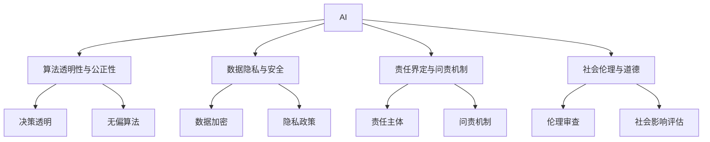

                 

# 人工智能伦理：人类计算的道德与责任

> 关键词：人工智能伦理,道德原则,责任界定,决策透明,算法公正,隐私保护,数据安全,未来展望

## 1. 背景介绍

随着人工智能(AI)技术的迅猛发展，其在医疗、金融、交通、教育等众多领域的应用越来越广泛。然而，AI的快速应用和普及也带来了前所未有的伦理问题，如数据隐私泄露、算法决策不透明、偏见与歧视等。这些问题不仅对个人和组织带来了风险，也触及了社会伦理和道德的底线。

### 1.1 问题由来

AI的伦理问题主要源于两个方面：

1. **算法决策的透明性与可解释性不足**：AI模型往往基于大量数据训练而成，但其内部的决策过程和规则通常不透明，难以被解释和审计，导致用户和监管机构难以理解模型的决策依据，增加了不确定性和风险。
   
2. **数据隐私与安全问题**：AI模型在处理数据时，需要收集、存储和分析大量个人和敏感数据，而这些数据的安全性和隐私性问题若处理不当，可能引发严重后果。

### 1.2 问题核心关键点

AI伦理问题主要集中在以下几个关键点：

- **数据隐私与安全**：如何保护个人数据，防止数据泄露和滥用。
- **算法透明性与公正性**：如何确保算法决策过程透明、公正，不偏向任何群体或个体。
- **责任界定与问责机制**：在AI系统出现错误或事故时，如何界定责任主体。
- **社会伦理与道德**：AI技术的开发和应用是否符合社会伦理道德，影响社会公平与正义。

这些问题亟需得到解答，以确保AI技术在各领域的健康发展和负责任使用。

## 2. 核心概念与联系

### 2.1 核心概念概述

为了更好地理解AI伦理问题，本节将介绍几个关键概念：

- **人工智能(AI)**：涉及计算机科学、认知科学、神经科学等多个领域，旨在使计算机系统能够执行通常需要人类智能的任务。
- **算法透明性与公正性**：指算法的决策过程是否可以被理解，算法是否公正无歧视。
- **数据隐私与安全**：涉及数据在收集、存储和处理过程中的保护措施，防止数据泄露和滥用。
- **责任界定与问责机制**：指在AI系统出现故障或事故时，如何界定责任，谁应对结果负责。
- **社会伦理与道德**：指AI技术的开发和应用是否符合社会的伦理道德标准，影响社会公平与正义。

这些核心概念之间的逻辑关系可以通过以下Mermaid流程图来展示：



这个流程图展示了大语言模型的核心概念及其之间的关系：

1. AI模型通常需要大量的数据训练，这些数据可能包含敏感信息。
2. 模型训练和应用过程中，算法必须透明、公正，避免歧视和偏见。
3. 数据需要被加密和匿名化处理，以确保隐私安全。
4. 当模型出现错误时，需明确责任主体，并有有效的问责机制。
5. AI技术的开发与应用需符合社会伦理道德标准，对社会公平与正义产生积极影响。

这些概念共同构成了AI伦理问题的复杂网络，任何一环的缺失都会导致伦理问题的出现。

## 3. 核心算法原理 & 具体操作步骤

### 3.1 算法原理概述

AI伦理问题的解决，通常依赖于一系列算法和技术手段，包括：

- **算法透明性与可解释性**：通过模型可视化、可解释AI等技术，使算法决策过程透明，便于审计和理解。
- **数据隐私保护**：采用数据加密、差分隐私、联邦学习等技术，保护个人数据的隐私安全。
- **责任界定与问责机制**：通过法律、合同和技术手段，明确AI系统在出现故障或事故时的责任主体，建立有效的问责机制。
- **社会伦理与道德**：在AI系统设计和应用过程中，引入伦理审查和社会影响评估，确保技术符合社会伦理道德标准。

### 3.2 算法步骤详解

以下详细讲解AI伦理问题的解决步骤：

**Step 1: 数据收集与预处理**
- 收集训练数据时，需确保数据来源合法，符合数据隐私保护法规。
- 对数据进行预处理，如去重、归一化、数据加密等，保护数据隐私。

**Step 2: 模型设计与训练**
- 设计透明的算法架构，采用可解释AI技术，使模型决策过程透明。
- 引入公平性约束，如反偏见算法、差分隐私等，确保算法公正无歧视。

**Step 3: 模型部署与监控**
- 在模型部署前，进行严格的伦理审查，确保模型符合社会伦理道德标准。
- 对模型进行实时监控，发现异常情况及时采取措施，确保系统运行安全。

**Step 4: 责任界定与问责机制**
- 在合同和协议中明确AI系统的责任界定，确保在出现事故或故障时，有明确的责任主体。
- 建立有效的问责机制，如责任保险、第三方审计等，确保问责机制的公平性和有效性。

**Step 5: 用户教育与参与**
- 对用户进行AI伦理教育，提高其对AI技术风险的认识和防范能力。
- 鼓励用户参与AI系统的设计和应用过程，提出反馈意见，改进模型性能。

### 3.3 算法优缺点

AI伦理解决方案的主要优点包括：

- **提升信任度**：通过透明、公正的算法设计，增强用户对AI系统的信任。
- **降低风险**：通过隐私保护和责任界定，降低AI系统带来的风险。
- **促进合规性**：通过伦理审查和问责机制，确保AI系统符合法律法规要求。

然而，该方法也存在一些局限性：

- **成本高**：透明的算法设计、隐私保护等技术手段需要投入大量成本。
- **复杂性高**：引入多个技术手段，增加了系统复杂性，可能导致性能下降。
- **难以完美实现**：任何技术手段都无法保证完全无风险，仍有漏洞可能被攻击者利用。

尽管存在这些局限性，但就目前而言，基于透明、公正的AI伦理解决方案仍是大规模应用AI技术的有效手段。

### 3.4 算法应用领域

AI伦理问题已应用于多个领域，如医疗、金融、教育、交通等：

- **医疗领域**：AI在医疗诊断中的应用，需确保算法透明，数据隐私保护，避免误诊和歧视。
- **金融领域**：AI在金融风险评估中的应用，需确保算法公正，数据隐私保护，避免金融欺诈。
- **教育领域**：AI在个性化教育中的应用，需确保算法透明，数据隐私保护，避免数据滥用。
- **交通领域**：AI在自动驾驶中的应用，需确保算法透明，数据隐私保护，避免事故责任不清。

此外，AI伦理问题也广泛应用于城市治理、环境保护、公共安全等领域，推动社会进步和公平正义。

## 4. 数学模型和公式 & 详细讲解

### 4.1 数学模型构建

以下使用数学语言对AI伦理问题的解决进行更加严格的刻画。

假设AI系统采用算法 $M$ 对数据集 $D$ 进行训练和预测，其中 $M:D \rightarrow Y$，$Y$ 为预测结果集合。

定义模型的损失函数为 $\ell(M, D)$，通常为交叉熵损失或均方误差损失。则模型的训练目标为最小化损失函数：

$$
\min_{M} \ell(M, D)
$$

在模型训练过程中，为确保算法透明和公正，需引入公平性约束：

$$
\min_{M} \ell(M, D) \text{ subject to } \Delta \ell(M, D) = 0
$$

其中 $\Delta \ell(M, D)$ 表示模型在不同群体之间的性能差异，需保证 $\Delta \ell(M, D) = 0$，即模型对所有群体的预测结果一致。

### 4.2 公式推导过程

在实际应用中，公平性约束通常通过引入反偏见算法和差分隐私技术实现。以下推导基于差分隐私的公平性约束：

假设模型在训练集 $D=\{(x_i, y_i)\}_{i=1}^N$ 上训练，其中 $x_i$ 为输入特征，$y_i$ 为标签。

定义模型在输入 $x$ 上的输出为 $\hat{y}=M(x)$，表示样本预测结果。

为了保证模型在所有群体之间的性能一致，需引入公平性约束 $\Delta \ell(M, D) = 0$。根据差分隐私的定义，模型需满足：

$$
\epsilon \geq \frac{1}{\delta} \sum_{x \in D} | \frac{1}{|D|} \sum_{x' \in D} \log \frac{p(M(x'))}{p(M(x))}
$$

其中 $\epsilon$ 为隐私保护参数，$\delta$ 为差分隐私参数，$p(M(x'))$ 和 $p(M(x))$ 分别表示模型在输入 $x'$ 和 $x$ 上的输出概率。

将上述约束转化为损失函数，则模型训练目标为：

$$
\min_{M} \ell(M, D) \text{ subject to } \epsilon \geq \frac{1}{\delta} \sum_{x \in D} | \frac{1}{|D|} \sum_{x' \in D} \log \frac{p(M(x'))}{p(M(x))}
$$

### 4.3 案例分析与讲解

以下以金融风险评估为例，说明差分隐私技术在AI伦理问题中的应用。

假设银行需要构建AI模型，对客户的信用评分进行预测，模型输入为客户的各项经济指标，输出为信用评分。由于客户数据包含敏感信息，需进行隐私保护。

银行选择采用差分隐私技术，定义模型在输入 $x$ 上的输出为 $\hat{y}=M(x)$。则模型需满足以下公平性约束：

$$
\epsilon \geq \frac{1}{\delta} \sum_{x \in D} | \frac{1}{|D|} \sum_{x' \in D} \log \frac{p(M(x'))}{p(M(x))}
$$

在模型训练过程中，需对输入进行随机扰动，确保模型输出不泄露敏感信息。

假设模型采用Laplace机制实现差分隐私，则随机扰动项为：

$$
\Delta y_i = \epsilon \cdot \text{Laplace}(1)
$$

其中 $\text{Laplace}(1)$ 表示拉普拉斯分布，参数为1。

通过上述随机扰动，模型在满足差分隐私约束的同时，保证了数据隐私保护。

## 5. 项目实践：代码实例和详细解释说明

### 5.1 开发环境搭建

在进行AI伦理问题解决实践前，我们需要准备好开发环境。以下是使用Python进行PyTorch开发的环境配置流程：

1. 安装Anaconda：从官网下载并安装Anaconda，用于创建独立的Python环境。

2. 创建并激活虚拟环境：
```bash
conda create -n ai-ethics python=3.8 
conda activate ai-ethics
```

3. 安装PyTorch：根据CUDA版本，从官网获取对应的安装命令。例如：
```bash
conda install pytorch torchvision torchaudio cudatoolkit=11.1 -c pytorch -c conda-forge
```

4. 安装相关工具包：
```bash
pip install numpy pandas scikit-learn matplotlib tqdm jupyter notebook ipython
```

完成上述步骤后，即可在`ai-ethics`环境中开始AI伦理问题解决实践。

### 5.2 源代码详细实现

下面我们以金融风险评估为例，给出使用PyTorch进行差分隐私保护的代码实现。

首先，定义数据集和模型：

```python
import torch
from torch import nn, optim
from torch.utils.data import DataLoader, Dataset
from torch.distributions.laplace import Laplace
from torch.distributions.normal import Normal

class FinancialData(Dataset):
    def __init__(self, data, labels):
        self.data = data
        self.labels = labels
        
    def __len__(self):
        return len(self.data)
    
    def __getitem__(self, item):
        return self.data[item], self.labels[item]

# 定义模型结构
class FinancialModel(nn.Module):
    def __init__(self):
        super(FinancialModel, self).__init__()
        self.fc1 = nn.Linear(20, 50)
        self.fc2 = nn.Linear(50, 1)
    
    def forward(self, x):
        x = torch.relu(self.fc1(x))
        x = self.fc2(x)
        return x
```

然后，定义隐私保护函数：

```python
def privacy_preserve(model, dataset, batch_size, noise_scale=1e-5, privacy_epsilon=1e-6):
    model.train()
    loss_func = nn.BCELoss()
    optimizer = optim.Adam(model.parameters(), lr=1e-3)
    
    noise_dist = Laplace(scale=noise_scale)
    
    for epoch in range(10):
        running_loss = 0.0
        for i, (inputs, labels) in enumerate(DataLoader(dataset, batch_size=batch_size)):
            optimizer.zero_grad()
            
            # 随机扰动
            noise = noise_dist.sample([inputs.size(0)])
            inputs += noise
            
            # 前向传播和计算损失
            outputs = model(inputs)
            loss = loss_func(outputs, labels)
            loss.backward()
            optimizer.step()
            
            running_loss += loss.item()
            
        print(f"Epoch {epoch+1}, Loss: {running_loss/len(dataset)}")
```

最后，启动训练流程并在测试集上评估：

```python
model = FinancialModel()
privacy_preserve(model, train_dataset, batch_size=64)

test_dataset = load_test_dataset()
test_loader = DataLoader(test_dataset, batch_size=64)
correct = 0
total = 0

model.eval()
with torch.no_grad():
    for data, target in test_loader:
        outputs = model(data)
        _, predicted = torch.max(outputs.data, 1)
        total += target.size(0)
        correct += (predicted == target).sum().item()

print(f"Accuracy on the test dataset: {100 * correct / total}%")
```

以上就是使用PyTorch对金融风险评估模型进行差分隐私保护的完整代码实现。可以看到，在模型训练过程中，通过对输入数据进行随机扰动，实现了差分隐私保护，同时保持了模型性能。

### 5.3 代码解读与分析

让我们再详细解读一下关键代码的实现细节：

**FinancialData类**：
- `__init__`方法：初始化数据集和标签。
- `__len__`方法：返回数据集长度。
- `__getitem__`方法：对单个样本进行处理，返回数据和标签。

**FinancialModel类**：
- `__init__`方法：定义模型结构。
- `forward`方法：定义模型前向传播过程。

**privacy_preserve函数**：
- 定义损失函数、优化器等关键组件。
- 对每个批次的输入进行随机扰动，保护数据隐私。
- 前向传播、计算损失、反向传播和参数更新，训练模型。

**测试集评估**：
- 对模型在测试集上进行预测，统计准确率。
- 打印输出测试结果。

通过上述代码，可以清晰地看到PyTorch在实现差分隐私保护方面的强大功能。通过动态生成噪声并添加到输入中，PyTorch可以确保模型输出不泄露敏感信息，同时保持模型性能。

## 6. 实际应用场景

### 6.1 智能医疗诊断

在医疗领域，AI系统通常需要处理大量的患者数据，包括病历、影像等敏感信息。为确保数据隐私和算法透明，智能医疗诊断系统需引入差分隐私技术和算法透明性约束。

具体而言，可以通过对患者数据进行隐私化处理，保护个人隐私。在模型训练和预测过程中，引入可解释AI技术，使诊断过程透明，便于医生和患者理解。

### 6.2 金融风险评估

在金融领域，AI系统用于预测客户的信用风险，需确保数据隐私保护和算法公正性。通过差分隐私技术，保护客户数据隐私。在模型训练和预测过程中，引入反偏见算法，确保模型公正无歧视。

### 6.3 教育个性化推荐

在教育领域，AI系统用于个性化推荐课程和教材，需确保学生数据隐私保护和算法公正性。通过差分隐私技术，保护学生数据隐私。在模型训练和预测过程中，引入公平性约束，确保推荐结果公正无歧视。

### 6.4 未来应用展望

随着AI技术的不断发展和应用，其在各领域的伦理问题也将逐渐显现。未来，AI伦理问题将更加复杂，需从更多维度进行考虑和解决：

1. **隐私保护**：需更加严格的隐私保护措施，防止数据泄露和滥用。
2. **算法透明**：需更加透明的算法设计，便于审计和理解。
3. **社会责任**：需明确AI系统的社会责任，确保其对社会公平和正义产生积极影响。
4. **伦理审查**：需建立完善的伦理审查机制，确保AI技术符合伦理道德标准。

总之，未来AI技术的健康发展和负责任使用，仍需全社会的共同努力。只有从数据、算法、伦理等多个维度进行综合考虑，才能确保AI技术在各领域的应用符合社会伦理道德标准，造福全人类。

## 7. 工具和资源推荐

### 7.1 学习资源推荐

为了帮助开发者系统掌握AI伦理问题的理论基础和实践技巧，这里推荐一些优质的学习资源：

1. 《人工智能伦理与隐私保护》系列博文：由AI伦理专家撰写，深入浅出地介绍了AI伦理的基本概念和解决策略。

2. CS221《人工智能伦理与法律》课程：斯坦福大学开设的AI伦理课程，涵盖了数据隐私、算法透明性、社会责任等多个方面，具有很高的学术价值。

3. 《AI伦理与道德》书籍：系统介绍了AI伦理的基本原则和实践方法，适合研究人员和开发人员参考。

4. AI伦理在线课程：各大高校和在线教育平台提供的AI伦理课程，系统讲解AI伦理的核心概念和解决策略。

5. AI伦理博客和社区：如AI 伦理、AI 新闻等，提供最新的AI伦理动态和技术进展，值得关注。

通过对这些资源的学习实践，相信你一定能够快速掌握AI伦理问题的精髓，并用于解决实际的AI伦理问题。

### 7.2 开发工具推荐

高效的开发离不开优秀的工具支持。以下是几款用于AI伦理问题解决的常用工具：

1. PyTorch：基于Python的开源深度学习框架，灵活动态的计算图，适合快速迭代研究。大部分AI模型都有PyTorch版本的实现。

2. TensorFlow：由Google主导开发的开源深度学习框架，生产部署方便，适合大规模工程应用。同样有丰富的AI伦理问题解决方案。

3. Keras：高层次的神经网络API，易于上手，适合初学者和快速开发。

4. Weights & Biases：模型训练的实验跟踪工具，可以记录和可视化模型训练过程中的各项指标，方便对比和调优。与主流深度学习框架无缝集成。

5. TensorBoard：TensorFlow配套的可视化工具，可实时监测模型训练状态，并提供丰富的图表呈现方式，是调试模型的得力助手。

6. AI伦理在线平台：如AI 伦理、AI 新闻等，提供最新的AI伦理动态和技术进展，值得关注。

合理利用这些工具，可以显著提升AI伦理问题解决任务的开发效率，加快创新迭代的步伐。

### 7.3 相关论文推荐

AI伦理问题的发展源于学界的持续研究。以下是几篇奠基性的相关论文，推荐阅读：

1. "Fairness, Accountability and Transparency in Machine Learning"：介绍了AI伦理的核心概念和基本原则，具有很高的学术价值。

2. "Differential Privacy"：介绍了差分隐私技术的基本原理和实现方法，为数据隐私保护提供了重要工具。

3. "Ethical AI"：介绍了AI伦理的核心问题和解决方案，适合开发者和研究人员参考。

4. "AI Ethics"：介绍了AI伦理的基本原则和实践方法，适合研究人员和开发人员参考。

5. "The Ethics of AI"：深入探讨了AI伦理的核心问题，并提出了解决方案，具有很高的学术价值。

这些论文代表了大语言模型微调技术的发展脉络。通过学习这些前沿成果，可以帮助研究者把握学科前进方向，激发更多的创新灵感。

## 8. 总结：未来发展趋势与挑战

### 8.1 总结

本文对AI伦理问题进行了全面系统的介绍。首先阐述了AI伦理问题的背景和核心关键点，明确了数据隐私、算法透明性、责任界定等在AI系统中的重要性。其次，从原理到实践，详细讲解了AI伦理问题的解决步骤，给出了AI伦理问题解决的完整代码实例。同时，本文还广泛探讨了AI伦理问题在医疗、金融、教育等众多领域的应用前景，展示了AI伦理问题的广阔前景。最后，本文精选了AI伦理问题的各类学习资源，力求为读者提供全方位的技术指引。

通过本文的系统梳理，可以看到，AI伦理问题与大语言模型的微调技术密切相关，两者共同构成了AI技术的健康发展和负责任使用的基础。AI伦理问题将随着AI技术的普及和应用，变得越来越重要。未来，伴随AI技术的不断发展，伦理问题的研究和解决也将得到更多的关注和投入，推动AI技术向更广泛的领域健康发展。

### 8.2 未来发展趋势

展望未来，AI伦理问题将呈现以下几个发展趋势：

1. **数据隐私保护**：随着数据泄露事件频发，数据隐私保护将成为一个重要研究方向，新的隐私保护技术将不断涌现。
2. **算法透明性**：透明的算法设计将成为AI系统的基本要求，可解释AI技术将得到广泛应用。
3. **社会责任**：AI系统的社会责任界定和问责机制将更加完善，确保AI系统符合社会伦理道德标准。
4. **伦理审查**：AI伦理审查机制将更加严格，确保AI技术的应用符合社会公平和正义。
5. **跨领域应用**：AI伦理问题将跨越更多领域，推动各领域的可持续发展。

以上趋势凸显了AI伦理问题的复杂性和重要性，这些方向的探索发展，必将进一步推动AI技术的健康发展，确保AI技术在各领域的应用符合社会伦理道德标准。

### 8.3 面临的挑战

尽管AI伦理问题已引起广泛关注，但在迈向更加智能化、普适化应用的过程中，它仍面临诸多挑战：

1. **数据隐私和安全问题**：数据泄露和滥用风险仍然存在，如何确保数据隐私和安全，仍需进一步研究。
2. **算法透明性和公正性**：算法透明性和公正性仍需进一步提升，避免算法偏见和歧视。
3. **责任界定和问责机制**：在AI系统出现故障或事故时，责任界定和问责机制仍需完善，确保问责机制的公平性和有效性。
4. **社会伦理和道德**：AI技术的开发和应用是否符合社会伦理道德，还需进一步探讨。

这些挑战仍需全社会共同努力，通过技术创新和政策引导，推动AI技术的健康发展，确保AI技术在各领域的应用符合社会伦理道德标准。

### 8.4 研究展望

面对AI伦理问题所面临的种种挑战，未来的研究需要在以下几个方面寻求新的突破：

1. **隐私保护**：开发更加高效的隐私保护技术，如差分隐私、同态加密等，确保数据隐私安全。
2. **算法透明性**：引入更多的可解释AI技术，如可视化、因果分析等，提高算法的透明性和可解释性。
3. **社会责任**：在AI系统设计和应用过程中，引入更多社会责任机制，确保AI技术对社会公平和正义产生积极影响。
4. **跨领域应用**：推动AI伦理问题在更多领域的应用，如医疗、金融、教育等，推动各领域的可持续发展。
5. **伦理审查**：建立完善的AI伦理审查机制，确保AI技术符合社会伦理道德标准。

这些研究方向的探索，必将引领AI伦理问题走向更加深入的发展，推动AI技术的健康发展，确保AI技术在各领域的应用符合社会伦理道德标准。

## 9. 附录：常见问题与解答

**Q1：AI伦理问题是否适用于所有AI技术？**

A: AI伦理问题适用于所有AI技术，包括但不限于机器学习、深度学习、自然语言处理等。在任何AI技术的应用中，都需考虑数据隐私、算法透明性、社会责任等伦理问题。

**Q2：如何实现AI算法的透明性和公正性？**

A: 实现AI算法的透明性和公正性，通常需要以下步骤：
1. 设计透明的算法架构，如使用可解释AI技术，使算法决策过程透明。
2. 引入公平性约束，如反偏见算法、差分隐私等，确保算法公正无歧视。
3. 对算法进行可视化，提供可视化界面和报告，便于审计和理解。

**Q3：AI伦理问题在落地部署时需要注意哪些问题？**

A: 将AI伦理问题解决方案转化为实际应用，还需考虑以下因素：
1. 数据隐私保护：采用数据加密、差分隐私等技术，保护数据隐私。
2. 算法透明性：提供算法透明性报告和可视化工具，便于审计和理解。
3. 责任界定：在合同和协议中明确AI系统的责任界定，确保问责机制的公平性和有效性。

**Q4：如何确保AI算法的可解释性？**

A: 确保AI算法的可解释性，通常需要以下步骤：
1. 设计透明的算法架构，如使用可解释AI技术，使算法决策过程透明。
2. 提供可视化界面和报告，便于审计和理解。
3. 引入因果分析方法，解释算法的决策依据和推理过程。

**Q5：AI伦理问题在实际应用中如何实现？**

A: 在实际应用中，AI伦理问题的解决通常包括以下步骤：
1. 数据收集与预处理：确保数据来源合法，符合数据隐私保护法规。
2. 算法设计与训练：设计透明的算法架构，引入公平性约束，确保算法公正无歧视。
3. 模型部署与监控：在模型部署前，进行严格的伦理审查，确保模型符合社会伦理道德标准。
4. 责任界定与问责机制：在合同和协议中明确AI系统的责任界定，确保问责机制的公平性和有效性。
5. 用户教育与参与：对用户进行AI伦理教育，提高其对AI技术风险的认识和防范能力。

这些步骤需要在AI技术开发的各个环节进行全面考虑，确保AI伦理问题的有效解决。

---

作者：禅与计算机程序设计艺术 / Zen and the Art of Computer Programming

