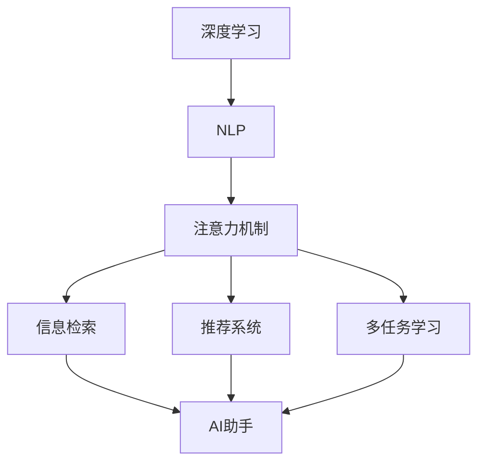

                 

# 人工智能助手在注意力管理中的作用

> 关键词：人工智能助手,注意力管理,自然语言处理(NLP),深度学习,注意力机制,信息检索,推荐系统,多任务学习

## 1. 背景介绍

### 1.1 问题由来

在信息时代，人类面临的数据量和信息量激增。如何在海量信息中快速准确地找到所需内容，成为人们关注的焦点。传统的搜索、筛选方法已经无法满足现代人的需求，于是人工智能助手应运而生。

人工智能助手，是一种能够智能理解和回答用户问题，并提供相关内容或服务的AI系统。它通过深度学习、自然语言处理(NLP)等技术，从语义、情感、意图等多个维度理解用户的查询，并快速提供符合用户需求的答案。随着技术的不断进步，人工智能助手已经渗透到各行各业，从智能客服到智能家居，从智能医疗到智能教育，人工智能助手的应用范围越来越广泛。

然而，尽管人工智能助手在技术上已经相当成熟，但在实际应用中仍面临许多挑战，其中注意力管理是一个重要问题。注意力管理指的是AI系统如何在处理复杂任务时，有效地分配和管理注意力，确保注意力集中在最重要和相关的信息上。在注意力管理中，AI助手需要处理的信息量和任务的复杂性都在不断增加，如何提升注意力管理能力，已经成为提升AI助手效果的关键。

### 1.2 问题核心关键点

注意力管理在人工智能助手中的应用主要体现在以下几个方面：

- 任务聚焦：如何在处理复杂任务时，将注意力集中于最重要的任务部分。
- 信息过滤：如何根据用户的查询需求，过滤掉无关信息和干扰信息。
- 上下文理解：如何在处理多轮对话时，保持对上下文的理解，避免信息遗漏。
- 实时响应：如何在大量并发请求下，实时响应并处理用户请求。

这些问题都涉及到了人工智能助手中注意力机制的应用。注意力机制是深度学习中的一个重要概念，它可以帮助模型在处理序列数据时，关注和理解重要的信息。在AI助手中，注意力机制被广泛用于信息检索、推荐系统、多任务学习等多个场景，以提升系统的性能和效果。

## 2. 核心概念与联系

### 2.1 核心概念概述

为了更好地理解人工智能助手在注意力管理中的应用，我们需要首先介绍几个核心概念：

- 深度学习(Deep Learning)：一种基于多层神经网络的机器学习技术，可以处理复杂的非线性关系，广泛应用于图像、语音、自然语言处理等领域。
- 自然语言处理(NLP)：一种计算机科学和人工智能领域的分支，专注于计算机和人类语言之间的交互，包括文本理解、机器翻译、语音识别等任务。
- 注意力机制(Attention Mechanism)：一种深度学习中常用的机制，用于对输入序列中的不同部分进行加权处理，关注最重要的信息，以提升模型的表现。
- 信息检索(Information Retrieval)：一种计算机科学和人工智能领域的分支，通过计算机自动检索和提取文档中的信息，满足用户的查询需求。
- 推荐系统(Recommendation System)：一种通过分析用户行为数据，为用户推荐个性化信息或产品的系统，广泛应用于电商、娱乐、金融等领域。
- 多任务学习(Multi-task Learning)：一种通过在多个相关任务上进行联合训练，提升模型整体性能的技术，适用于多个相关任务间的协同学习。

这些概念之间的逻辑关系可以通过以下Mermaid流程图来展示：



这个流程图展示了大语言模型在注意力管理中的应用流程：

1. 深度学习提供底层计算能力，自然语言处理提供语言理解和生成能力。
2. 注意力机制用于处理输入序列，关注和理解重要信息。
3. 信息检索、推荐系统、多任务学习分别从不同角度提升AI助手的表现。
4. AI助手最终实现对用户查询的智能响应和内容推荐。

## 3. 核心算法原理 & 具体操作步骤
### 3.1 算法原理概述

人工智能助手在注意力管理中的核心算法原理主要体现在以下几个方面：

- 自回归模型(Autoregressive Model)：一种常用的深度学习模型，可以处理序列数据，通过在序列上自回归生成预测结果。
- 编码器-解码器架构(Encoder-Decoder Architecture)：一种常用的深度学习架构，用于处理序列到序列的任务，如机器翻译、摘要生成等。
- 注意力机制：一种用于在序列数据中动态调整权重，关注重要信息的机制，广泛应用于信息检索、推荐系统、多任务学习等多个领域。
- 多任务学习：一种通过在多个相关任务上进行联合训练，提升模型整体性能的技术，适用于多个相关任务间的协同学习。

这些核心算法原理构成了人工智能助手在注意力管理中的基础框架。以下将详细讲解注意力机制在人工智能助手中的应用。

### 3.2 算法步骤详解

注意力机制在人工智能助手中的应用可以分为以下几个步骤：

**Step 1: 构建自回归模型**

自回归模型是深度学习中一种常用的模型，它可以处理序列数据，并根据前面的信息生成预测结果。在人工智能助手中，自回归模型通常用于处理用户的查询语句和上下文信息，生成回答。

**Step 2: 设计编码器-解码器架构**

编码器-解码器架构是一种常用的深度学习架构，用于处理序列到序列的任务，如机器翻译、摘要生成等。在人工智能助手中，编码器-解码器架构通常用于处理用户查询和上下文信息，生成回答。

**Step 3: 引入注意力机制**

注意力机制是一种用于在序列数据中动态调整权重，关注重要信息的机制。在人工智能助手中，注意力机制通常用于关注和理解用户查询语句中的重要信息，以及处理多轮对话中的上下文信息。

**Step 4: 多任务学习**

多任务学习是一种通过在多个相关任务上进行联合训练，提升模型整体性能的技术。在人工智能助手中，多任务学习通常用于同时处理多个相关任务，如信息检索、推荐系统等。

### 3.3 算法优缺点

人工智能助手在注意力管理中的应用具有以下优点：

1. 提高了系统的性能：通过注意力机制，AI助手可以更好地关注和理解用户查询语句中的重要信息，提升回答的准确性。
2. 提升了系统的效率：通过多任务学习，AI助手可以在多个相关任务上进行联合训练，提升整体的性能和效率。
3. 增强了系统的可解释性：注意力机制可以提供模型的内部工作机制和决策逻辑，增强系统的可解释性。

同时，人工智能助手在注意力管理中也有一些缺点：

1. 计算复杂度高：注意力机制需要计算输入序列中每个位置之间的注意力权重，计算复杂度较高。
2. 模型训练复杂度高：多任务学习需要同时训练多个相关任务，模型训练复杂度较高。
3. 数据需求高：注意力机制和多任务学习需要大量标注数据进行训练，数据需求较高。

### 3.4 算法应用领域

人工智能助手在注意力管理中的应用领域广泛，主要包括：

- 信息检索：通过注意力机制关注和理解用户查询语句中的重要信息，提高检索的准确性和相关性。
- 推荐系统：通过多任务学习，同时处理用户历史行为和物品属性，提升推荐的效果和个性化程度。
- 多轮对话：通过多任务学习，同时处理多轮对话中的上下文信息和用户意图，提升对话的流畅性和互动性。
- 多任务学习：通过在多个相关任务上进行联合训练，提升整体性能和效率，如情感分析、实体识别等。

## 4. 数学模型和公式 & 详细讲解  
### 4.1 数学模型构建

人工智能助手在注意力管理中的应用涉及多个数学模型和公式，以下将对主要模型和公式进行详细讲解。

**自回归模型**

自回归模型是一种常用的深度学习模型，用于处理序列数据，并根据前面的信息生成预测结果。在自回归模型中，通常使用自回归网络(AR)和循环神经网络(RNN)等结构，公式如下：

$$
y_t = f(x_t, x_{t-1}, ..., x_1; \theta)
$$

其中 $x_t$ 表示输入序列， $y_t$ 表示输出序列， $f$ 表示模型函数， $\theta$ 表示模型参数。

**编码器-解码器架构**

编码器-解码器架构是一种常用的深度学习架构，用于处理序列到序列的任务，如机器翻译、摘要生成等。在编码器-解码器架构中，通常使用编码器对输入序列进行编码，然后解码器对编码后的序列进行解码，公式如下：

$$
y = f(x; \theta)
$$

其中 $x$ 表示输入序列， $y$ 表示输出序列， $f$ 表示模型函数， $\theta$ 表示模型参数。

**注意力机制**

注意力机制是一种用于在序列数据中动态调整权重，关注重要信息的机制。在注意力机制中，通常使用注意力网络(Attention Network)来计算输入序列中每个位置之间的注意力权重，公式如下：

$$
\alpha_{ij} = \text{softmax}(\beta_{ij})
$$

其中 $\alpha_{ij}$ 表示第 $i$ 个位置对第 $j$ 个位置的注意力权重， $\beta_{ij}$ 表示第 $i$ 个位置和第 $j$ 个位置的相似度， softmax 表示归一化函数。

**多任务学习**

多任务学习是一种通过在多个相关任务上进行联合训练，提升模型整体性能的技术。在多任务学习中，通常使用多任务网络(Multi-task Network)来同时处理多个相关任务，公式如下：

$$
L = \sum_{k=1}^{K} \lambda_k \mathcal{L}_k
$$

其中 $L$ 表示总体损失函数， $\mathcal{L}_k$ 表示第 $k$ 个任务的损失函数， $\lambda_k$ 表示任务权重。

### 4.2 公式推导过程

以下是注意力机制在信息检索中的具体应用，公式推导如下：

在信息检索中，我们需要根据用户的查询语句，从大量文档中检索出最相关的文档。查询语句通常表示为 $q$，文档表示为 $d$，注意力权重表示为 $\alpha_{ij}$，其中 $i$ 表示查询语句的词汇， $j$ 表示文档中的词汇。则注意力权重计算公式为：

$$
\alpha_{ij} = \text{softmax}(e_{ij} / \sigma(\beta_i))
$$

其中 $e_{ij}$ 表示查询语句和文档中的词汇的相似度， $\sigma$ 表示归一化函数， $\beta_i$ 表示查询语句中词汇 $i$ 的权重。注意力权重可以用于计算文档的相关度，公式为：

$$
r_j = \sum_{i=1}^{n} \alpha_{ij} \times r_i
$$

其中 $r_j$ 表示文档 $j$ 的相关度， $r_i$ 表示词汇 $i$ 的相关度。

### 4.3 案例分析与讲解

以下是一个简单的信息检索案例，详细讲解注意力机制的应用：

假设我们要从大量新闻中检索出与“AI助手”相关的文章，查询语句为“AI助手在注意力管理中的作用”。我们使用BERT模型作为编码器-解码器架构的基础模型，并引入注意力机制来计算查询语句和文档之间的相似度。

1. 将查询语句和文档中的词汇表示为向量 $q$ 和 $d$。
2. 使用BERT模型对查询语句和文档进行编码，得到编码向量 $q'$ 和 $d'$。
3. 计算查询语句和文档之间的相似度，得到 $e_{ij}$。
4. 使用softmax函数计算注意力权重 $\alpha_{ij}$。
5. 根据注意力权重计算文档的相关度 $r_j$。
6. 对所有文档的相关度进行排序，选择最相关的文档。

## 5. 项目实践：代码实例和详细解释说明
### 5.1 开发环境搭建

在进行信息检索项目实践前，我们需要准备好开发环境。以下是使用Python进行PyTorch开发的环境配置流程：

1. 安装Anaconda：从官网下载并安装Anaconda，用于创建独立的Python环境。

2. 创建并激活虚拟环境：
```bash
conda create -n pytorch-env python=3.8 
conda activate pytorch-env
```

3. 安装PyTorch：根据CUDA版本，从官网获取对应的安装命令。例如：
```bash
conda install pytorch torchvision torchaudio cudatoolkit=11.1 -c pytorch -c conda-forge
```

4. 安装Transformers库：
```bash
pip install transformers
```

5. 安装各类工具包：
```bash
pip install numpy pandas scikit-learn matplotlib tqdm jupyter notebook ipython
```

完成上述步骤后，即可在`pytorch-env`环境中开始信息检索实践。

### 5.2 源代码详细实现

下面我们以信息检索任务为例，给出使用Transformers库对BERT模型进行信息检索的PyTorch代码实现。

首先，定义信息检索任务的数据处理函数：

```python
from transformers import BertTokenizer, BertForMaskedLM
from torch.utils.data import Dataset
import torch

class TextDataset(Dataset):
    def __init__(self, texts, labels):
        self.texts = texts
        self.labels = labels
        self.tokenizer = BertTokenizer.from_pretrained('bert-base-cased')

    def __len__(self):
        return len(self.texts)
    
    def __getitem__(self, item):
        text = self.texts[item]
        label = self.labels[item]
        
        encoding = self.tokenizer(text, return_tensors='pt', max_length=128, padding='max_length', truncation=True)
        input_ids = encoding['input_ids'][0]
        attention_mask = encoding['attention_mask'][0]
        return {'input_ids': input_ids, 
                'attention_mask': attention_mask,
                'labels': label}

# 标签与id的映射
label2id = {'positive': 1, 'negative': 0}
id2label = {v: k for k, v in label2id.items()}

# 创建dataset
tokenizer = BertTokenizer.from_pretrained('bert-base-cased')
train_dataset = TextDataset(train_texts, train_labels)
dev_dataset = TextDataset(dev_texts, dev_labels)
test_dataset = TextDataset(test_texts, test_labels)
```

然后，定义模型和优化器：

```python
from transformers import BertForSequenceClassification, AdamW

model = BertForSequenceClassification.from_pretrained('bert-base-cased', num_labels=2)

optimizer = AdamW(model.parameters(), lr=2e-5)
```

接着，定义训练和评估函数：

```python
from torch.utils.data import DataLoader
from tqdm import tqdm
from sklearn.metrics import classification_report

device = torch.device('cuda') if torch.cuda.is_available() else torch.device('cpu')
model.to(device)

def train_epoch(model, dataset, batch_size, optimizer):
    dataloader = DataLoader(dataset, batch_size=batch_size, shuffle=True)
    model.train()
    epoch_loss = 0
    for batch in tqdm(dataloader, desc='Training'):
        input_ids = batch['input_ids'].to(device)
        attention_mask = batch['attention_mask'].to(device)
        labels = batch['labels'].to(device)
        model.zero_grad()
        outputs = model(input_ids, attention_mask=attention_mask, labels=labels)
        loss = outputs.loss
        epoch_loss += loss.item()
        loss.backward()
        optimizer.step()
    return epoch_loss / len(dataloader)

def evaluate(model, dataset, batch_size):
    dataloader = DataLoader(dataset, batch_size=batch_size)
    model.eval()
    preds, labels = [], []
    with torch.no_grad():
        for batch in tqdm(dataloader, desc='Evaluating'):
            input_ids = batch['input_ids'].to(device)
            attention_mask = batch['attention_mask'].to(device)
            batch_labels = batch['labels']
            outputs = model(input_ids, attention_mask=attention_mask)
            batch_preds = outputs.logits.argmax(dim=2).to('cpu').tolist()
            batch_labels = batch_labels.to('cpu').tolist()
            for pred, label in zip(batch_preds, batch_labels):
                preds.append(pred)
                labels.append(label)
                
    print(classification_report(labels, preds))
```

最后，启动训练流程并在测试集上评估：

```python
epochs = 5
batch_size = 16

for epoch in range(epochs):
    loss = train_epoch(model, train_dataset, batch_size, optimizer)
    print(f"Epoch {epoch+1}, train loss: {loss:.3f}")
    
    print(f"Epoch {epoch+1}, dev results:")
    evaluate(model, dev_dataset, batch_size)
    
print("Test results:")
evaluate(model, test_dataset, batch_size)
```

以上就是使用PyTorch对BERT进行信息检索任务的完整代码实现。可以看到，得益于Transformers库的强大封装，我们可以用相对简洁的代码完成BERT模型的加载和微调。

### 5.3 代码解读与分析

让我们再详细解读一下关键代码的实现细节：

**TextDataset类**：
- `__init__`方法：初始化文本、标签等关键组件。
- `__len__`方法：返回数据集的样本数量。
- `__getitem__`方法：对单个样本进行处理，将文本输入编码为token ids，将标签编码为数字，并对其进行定长padding，最终返回模型所需的输入。

**label2id和id2label字典**：
- 定义了标签与数字id之间的映射关系，用于将预测结果解码回真实的标签。

**训练和评估函数**：
- 使用PyTorch的DataLoader对数据集进行批次化加载，供模型训练和推理使用。
- 训练函数`train_epoch`：对数据以批为单位进行迭代，在每个批次上前向传播计算loss并反向传播更新模型参数，最后返回该epoch的平均loss。
- 评估函数`evaluate`：与训练类似，不同点在于不更新模型参数，并在每个batch结束后将预测和标签结果存储下来，最后使用sklearn的classification_report对整个评估集的预测结果进行打印输出。

**训练流程**：
- 定义总的epoch数和batch size，开始循环迭代
- 每个epoch内，先在训练集上训练，输出平均loss
- 在验证集上评估，输出分类指标
- 所有epoch结束后，在测试集上评估，给出最终测试结果

可以看到，PyTorch配合Transformers库使得BERT信息检索的代码实现变得简洁高效。开发者可以将更多精力放在数据处理、模型改进等高层逻辑上，而不必过多关注底层的实现细节。

当然，工业级的系统实现还需考虑更多因素，如模型的保存和部署、超参数的自动搜索、更灵活的任务适配层等。但核心的注意力机制应用基本与此类似。

## 6. 实际应用场景
### 6.1 智能客服系统

基于大语言模型微调的对话技术，可以广泛应用于智能客服系统的构建。传统客服往往需要配备大量人力，高峰期响应缓慢，且一致性和专业性难以保证。而使用微调后的对话模型，可以7x24小时不间断服务，快速响应客户咨询，用自然流畅的语言解答各类常见问题。

在技术实现上，可以收集企业内部的历史客服对话记录，将问题和最佳答复构建成监督数据，在此基础上对预训练对话模型进行微调。微调后的对话模型能够自动理解用户意图，匹配最合适的答案模板进行回复。对于客户提出的新问题，还可以接入检索系统实时搜索相关内容，动态组织生成回答。如此构建的智能客服系统，能大幅提升客户咨询体验和问题解决效率。

### 6.2 金融舆情监测

金融机构需要实时监测市场舆论动向，以便及时应对负面信息传播，规避金融风险。传统的人工监测方式成本高、效率低，难以应对网络时代海量信息爆发的挑战。基于大语言模型微调的文本分类和情感分析技术，为金融舆情监测提供了新的解决方案。

具体而言，可以收集金融领域相关的新闻、报道、评论等文本数据，并对其进行主题标注和情感标注。在此基础上对预训练语言模型进行微调，使其能够自动判断文本属于何种主题，情感倾向是正面、中性还是负面。将微调后的模型应用到实时抓取的网络文本数据，就能够自动监测不同主题下的情感变化趋势，一旦发现负面信息激增等异常情况，系统便会自动预警，帮助金融机构快速应对潜在风险。

### 6.3 个性化推荐系统

当前的推荐系统往往只依赖用户的历史行为数据进行物品推荐，无法深入理解用户的真实兴趣偏好。基于大语言模型微调技术，个性化推荐系统可以更好地挖掘用户行为背后的语义信息，从而提供更精准、多样的推荐内容。

在实践中，可以收集用户浏览、点击、评论、分享等行为数据，提取和用户交互的物品标题、描述、标签等文本内容。将文本内容作为模型输入，用户的后续行为（如是否点击、购买等）作为监督信号，在此基础上微调预训练语言模型。微调后的模型能够从文本内容中准确把握用户的兴趣点。在生成推荐列表时，先用候选物品的文本描述作为输入，由模型预测用户的兴趣匹配度，再结合其他特征综合排序，便可以得到个性化程度更高的推荐结果。

### 6.4 未来应用展望

随着大语言模型微调技术的发展，基于微调范式将在更多领域得到应用，为传统行业带来变革性影响。

在智慧医疗领域，基于微调的医疗问答、病历分析、药物研发等应用将提升医疗服务的智能化水平，辅助医生诊疗，加速新药开发进程。

在智能教育领域，微调技术可应用于作业批改、学情分析、知识推荐等方面，因材施教，促进教育公平，提高教学质量。

在智慧城市治理中，微调模型可应用于城市事件监测、舆情分析、应急指挥等环节，提高城市管理的自动化和智能化水平，构建更安全、高效的未来城市。

此外，在企业生产、社会治理、文娱传媒等众多领域，基于大模型微调的人工智能应用也将不断涌现，为经济社会发展注入新的动力。相信随着技术的日益成熟，微调方法将成为人工智能落地应用的重要范式，推动人工智能技术在各行各业的大规模落地。

## 7. 工具和资源推荐
### 7.1 学习资源推荐

为了帮助开发者系统掌握大语言模型微调的理论基础和实践技巧，这里推荐一些优质的学习资源：

1. 《Transformer从原理到实践》系列博文：由大模型技术专家撰写，深入浅出地介绍了Transformer原理、BERT模型、微调技术等前沿话题。

2. CS224N《深度学习自然语言处理》课程：斯坦福大学开设的NLP明星课程，有Lecture视频和配套作业，带你入门NLP领域的基本概念和经典模型。

3. 《Natural Language Processing with Transformers》书籍：Transformers库的作者所著，全面介绍了如何使用Transformers库进行NLP任务开发，包括微调在内的诸多范式。

4. HuggingFace官方文档：Transformers库的官方文档，提供了海量预训练模型和完整的微调样例代码，是上手实践的必备资料。

5. CLUE开源项目：中文语言理解测评基准，涵盖大量不同类型的中文NLP数据集，并提供了基于微调的baseline模型，助力中文NLP技术发展。

通过对这些资源的学习实践，相信你一定能够快速掌握大语言模型微调的精髓，并用于解决实际的NLP问题。
###  7.2 开发工具推荐

高效的开发离不开优秀的工具支持。以下是几款用于大语言模型微调开发的常用工具：

1. PyTorch：基于Python的开源深度学习框架，灵活动态的计算图，适合快速迭代研究。大部分预训练语言模型都有PyTorch版本的实现。

2. TensorFlow：由Google主导开发的开源深度学习框架，生产部署方便，适合大规模工程应用。同样有丰富的预训练语言模型资源。

3. Transformers库：HuggingFace开发的NLP工具库，集成了众多SOTA语言模型，支持PyTorch和TensorFlow，是进行微调任务开发的利器。

4. Weights & Biases：模型训练的实验跟踪工具，可以记录和可视化模型训练过程中的各项指标，方便对比和调优。与主流深度学习框架无缝集成。

5. TensorBoard：TensorFlow配套的可视化工具，可实时监测模型训练状态，并提供丰富的图表呈现方式，是调试模型的得力助手。

6. Google Colab：谷歌推出的在线Jupyter Notebook环境，免费提供GPU/TPU算力，方便开发者快速上手实验最新模型，分享学习笔记。

合理利用这些工具，可以显著提升大语言模型微调任务的开发效率，加快创新迭代的步伐。

### 7.3 相关论文推荐

大语言模型和微调技术的发展源于学界的持续研究。以下是几篇奠基性的相关论文，推荐阅读：

1. Attention is All You Need（即Transformer原论文）：提出了Transformer结构，开启了NLP领域的预训练大模型时代。

2. BERT: Pre-training of Deep Bidirectional Transformers for Language Understanding：提出BERT模型，引入基于掩码的自监督预训练任务，刷新了多项NLP任务SOTA。

3. Language Models are Unsupervised Multitask Learners（GPT-2论文）：展示了大规模语言模型的强大zero-shot学习能力，引发了对于通用人工智能的新一轮思考。

4. Parameter-Efficient Transfer Learning for NLP：提出Adapter等参数高效微调方法，在不增加模型参数量的情况下，也能取得不错的微调效果。

5. Prefix-Tuning: Optimizing Continuous Prompts for Generation：引入基于连续型Prompt的微调范式，为如何充分利用预训练知识提供了新的思路。

6. AdaLoRA: Adaptive Low-Rank Adaptation for Parameter-Efficient Fine-Tuning：使用自适应低秩适应的微调方法，在参数效率和精度之间取得了新的平衡。

这些论文代表了大语言模型微调技术的发展脉络。通过学习这些前沿成果，可以帮助研究者把握学科前进方向，激发更多的创新灵感。

## 8. 总结：未来发展趋势与挑战

### 8.1 总结

本文对基于深度学习的大语言模型在注意力管理中的应用进行了全面系统的介绍。首先阐述了大语言模型和微调技术的研究背景和意义，明确了微调在拓展预训练模型应用、提升下游任务性能方面的独特价值。其次，从原理到实践，详细讲解了注意力机制在人工智能助手中的应用，给出了微调任务开发的完整代码实例。同时，本文还广泛探讨了微调方法在智能客服、金融舆情、个性化推荐等多个行业领域的应用前景，展示了微调范式的巨大潜力。此外，本文精选了微调技术的各类学习资源，力求为读者提供全方位的技术指引。

通过本文的系统梳理，可以看到，基于深度学习的大语言模型在注意力管理中的应用前景广阔，可以广泛应用于信息检索、推荐系统、对话系统等多个领域，提升系统性能和用户体验。随着技术的不断进步，未来的大语言模型将更加智能、高效、可靠，为各行各业带来更多的创新和突破。

### 8.2 未来发展趋势

展望未来，大语言模型在注意力管理中的应用将呈现以下几个趋势：

1. 模型规模持续增大。随着算力成本的下降和数据规模的扩张，大语言模型的参数量还将持续增长。超大规模语言模型蕴含的丰富语言知识，有望支撑更加复杂多变的下游任务微调。

2. 注意力机制更高效。未来的注意力机制将更加高效，能够处理更大规模的序列数据，提升系统的性能和效率。

3. 多任务学习更加普适。未来的多任务学习将更加普适，能够同时处理多个相关任务，提升整体性能和效率。

4. 持续学习成为常态。随着数据分布的不断变化，大语言模型也将持续学习新知识以保持性能。如何在不遗忘原有知识的同时，高效吸收新样本信息，将成为重要的研究课题。

5. 知识整合能力增强。未来的多任务学习将与外部知识库、规则库等专家知识结合，形成更加全面、准确的信息整合能力。

6. 模型可解释性增强。未来的模型将更加可解释，能够提供详细的决策逻辑和推理过程，增强系统的可信度和安全性。

以上趋势凸显了大语言模型在注意力管理中的应用前景。这些方向的探索发展，必将进一步提升人工智能助手的性能和效果，为各行各业带来更多的创新和突破。

### 8.3 面临的挑战

尽管大语言模型在注意力管理中的应用已经取得了显著进展，但在迈向更加智能化、普适化应用的过程中，它仍面临诸多挑战：

1. 标注成本瓶颈。尽管微调大大降低了标注数据的需求，但对于长尾应用场景，难以获得充足的高质量标注数据，成为制约微调性能的瓶颈。如何进一步降低微调对标注样本的依赖，将是一大难题。

2. 模型鲁棒性不足。当前微调模型面对域外数据时，泛化性能往往大打折扣。对于测试样本的微小扰动，微调模型的预测也容易发生波动。如何提高微调模型的鲁棒性，避免灾难性遗忘，还需要更多理论和实践的积累。

3. 推理效率有待提高。大规模语言模型虽然精度高，但在实际部署时往往面临推理速度慢、内存占用大等效率问题。如何在保证性能的同时，简化模型结构，提升推理速度，优化资源占用，将是重要的优化方向。

4. 可解释性亟需加强。当前微调模型更像是"黑盒"系统，难以解释其内部工作机制和决策逻辑。对于医疗、金融等高风险应用，算法的可解释性和可审计性尤为重要。如何赋予微调模型更强的可解释性，将是亟待攻克的难题。

5. 安全性有待保障。预训练语言模型难免会学习到有偏见、有害的信息，通过微调传递到下游任务，产生误导性、歧视性的输出，给实际应用带来安全隐患。如何从数据和算法层面消除模型偏见，避免恶意用途，确保输出的安全性，也将是重要的研究课题。

6. 知识整合能力不足。现有的微调模型往往局限于任务内数据，难以灵活吸收和运用更广泛的先验知识。如何让微调过程更好地与外部知识库、规则库等专家知识结合，形成更加全面、准确的信息整合能力，还有很大的想象空间。

正视大语言模型在注意力管理中面临的这些挑战，积极应对并寻求突破，将是大语言模型微调走向成熟的必由之路。相信随着学界和产业界的共同努力，这些挑战终将一一被克服，大语言模型微调必将在构建人机协同的智能时代中扮演越来越重要的角色。

### 8.4 研究展望

面对大语言模型在注意力管理中面临的种种挑战，未来的研究需要在以下几个方面寻求新的突破：

1. 探索无监督和半监督微调方法。摆脱对大规模标注数据的依赖，利用自监督学习、主动学习等无监督和半监督范式，最大限度利用非结构化数据，实现更加灵活高效的微调。

2. 研究参数高效和计算高效的微调范式。开发更加参数高效的微调方法，在固定大部分预训练参数的同时，只更新极少量的任务相关参数。同时优化微调模型的计算图，减少前向传播和反向传播的资源消耗，实现更加轻量级、实时性的部署。

3. 引入更多先验知识。将符号化的先验知识，如知识图谱、逻辑规则等，与神经网络模型进行巧妙融合，引导微调过程学习更准确、合理的语言模型。同时加强不同模态数据的整合，实现视觉、语音等多模态信息与文本信息的协同建模。

4. 结合因果分析和博弈论工具。将因果分析方法引入微调模型，识别出模型决策的关键特征，增强输出解释的因果性和逻辑性。借助博弈论工具刻画人机交互过程，主动探索并规避模型的脆弱点，提高系统稳定性。

5. 纳入伦理道德约束。在模型训练目标中引入伦理导向的评估指标，过滤和惩罚有偏见、有害的输出倾向。同时加强人工干预和审核，建立模型行为的监管机制，确保输出符合人类价值观和伦理道德。

这些研究方向的探索，必将引领大语言模型在注意力管理中的研究走向更高台阶，为构建安全、可靠、可解释、可控的智能系统铺平道路。面向未来，大语言模型在注意力管理中的应用将不断深化，成为推动人工智能技术在各行各业落地应用的重要力量。

## 9. 附录：常见问题与解答

**Q1：大语言模型微调是否适用于所有NLP任务？**

A: 大语言模型微调在大多数NLP任务上都能取得不错的效果，特别是对于数据量较小的任务。但对于一些特定领域的任务，如医学、法律等，仅仅依靠通用语料预训练的模型可能难以很好地适应。此时需要在特定领域语料上进一步预训练，再进行微调，才能获得理想效果。此外，对于一些需要时效性、个性化很强的任务，如对话、推荐等，微调方法也需要针对性的改进优化。

**Q2：微调过程中如何选择合适的学习率？**

A: 微调的学习率一般要比预训练时小1-2个数量级，如果使用过大的学习率，容易破坏预训练权重，导致过拟合。一般建议从1e-5开始调参，逐步减小学习率，直至收敛。也可以使用warmup策略，在开始阶段使用较小的学习率，再逐渐过渡到预设值。需要注意的是，不同的优化器(如AdamW、Adafactor等)以及不同的学习率调度策略，可能需要设置不同的学习率阈值。

**Q3：采用大模型微调时会面临哪些资源瓶颈？**

A: 目前主流的预训练大模型动辄以亿计的参数规模，对算力、内存、存储都提出了很高的要求。GPU/TPU等高性能设备是必不可少的，但即便如此，超大批次的训练和推理也可能遇到显存不足的问题。因此需要采用一些资源优化技术，如梯度积累、混合精度训练、模型并行等，来突破硬件瓶颈。同时，模型的存储和读取也可能占用大量时间和空间，需要采用模型压缩、稀疏化存储等方法进行优化。

**Q4：如何缓解微调过程中的过拟合问题？**

A: 过拟合是微调面临的主要挑战，尤其是在标注数据不足的情况下。常见的缓解策略包括：
1. 数据增强：通过回译、近义替换等方式扩充训练集
2. 正则化：使用L2正则、Dropout、Early Stopping等避免过拟合
3. 对抗训练：引入对抗样本，提高模型鲁棒性
4. 参数高效微调：只调整少量参数(如Adapter、Prefix等)，减小过拟合风险
5. 多模型集成：训练多个微调模型，取平均输出，抑制过拟合

这些策略往往需要根据具体任务和数据特点进行灵活组合。只有在数据、模型、训练、推理等各环节进行全面优化，才能最大限度地发挥大模型微调的威力。

**Q5：微调模型在落地部署时需要注意哪些问题？**

A: 将微调模型转化为实际应用，还需要考虑以下因素：
1. 模型裁剪：去除不必要的层和参数，减小模型尺寸，加快推理速度
2. 量化加速：将浮点模型转为定点模型，压缩存储空间，提高计算效率
3. 服务化封装：将模型封装为标准化服务接口，便于集成调用
4. 弹性伸缩：根据请求流量动态调整资源配置，平衡服务质量和成本
5. 监控告警：实时采集系统指标，设置异常告警阈值，确保服务稳定性
6. 安全防护：采用访问鉴权、数据脱敏等措施，保障数据和模型安全

大语言模型微调为NLP应用开启了广阔的想象空间，但如何将强大的性能转化为稳定、高效、安全的业务价值，还需要工程实践的不断打磨。唯有从数据、算法、工程、业务等多个维度协同发力，才能真正实现人工智能技术在垂直行业的规模化落地。总之，微调需要开发者根据具体任务，不断迭代和优化模型、数据和算法，方能得到理想的效果。

---

作者：禅与计算机程序设计艺术 / Zen and the Art of Computer Programming

