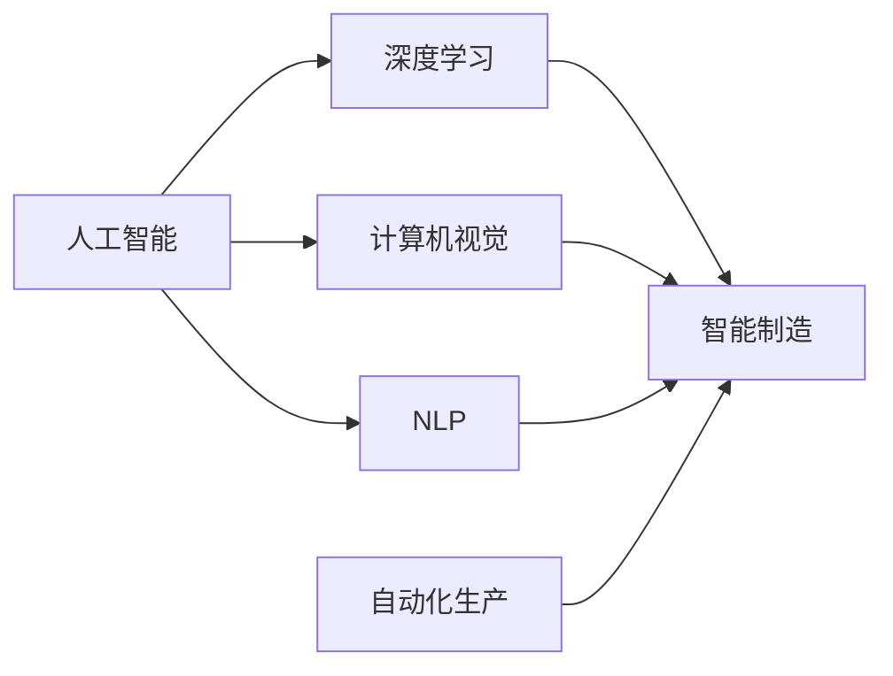

                 

# 人工智能在制造和自动化中的应用

## 1. 背景介绍

### 1.1 问题由来
制造和自动化行业，包括制造业、汽车工业、电子信息产业等，一直是国民经济的重要支柱。然而，传统制造自动化模式面临诸多挑战，如成本高、灵活性差、生产效率低下等问题。近年来，随着人工智能（AI）技术的迅猛发展，智能制造和自动化逐渐成为制造业转型的重要方向。

人工智能，特别是深度学习、计算机视觉、自然语言处理等技术，为制造和自动化带来了新的可能性，显著提升了生产效率、产品质量和资源利用率。本文将从背景、核心概念、算法原理、实践案例等角度，系统介绍AI在制造和自动化中的应用，以及未来的发展趋势和挑战。

## 2. 核心概念与联系

### 2.1 核心概念概述

**人工智能**：通过机器学习、深度学习等技术，使机器能够模拟人类智能行为，解决复杂问题。

**智能制造**：利用AI技术，对制造过程进行智能化管理，实现设备互联、数据集成和流程优化。

**自动化生产**：使用机器人和自动化设备，代替人工完成复杂或危险的生产任务，提高生产效率和安全性。

**深度学习**：一种基于多层神经网络的机器学习算法，能够从数据中学习到复杂非线性映射关系。

**计算机视觉**：使计算机能够理解并处理图像和视频信息，广泛应用于产品检测、质量控制等环节。

**自然语言处理（NLP）**：使计算机能够理解并处理自然语言文本，应用于生产调度、维护管理等场景。

这些核心概念之间互相联系，共同构成了AI在制造和自动化领域的应用基础。以下是一个Mermaid流程图，展示这些概念之间的联系：



通过这个图，可以看到AI技术在各个关键环节的应用，以及如何通过协同作用提升整个制造和自动化系统的智能水平。

## 3. 核心算法原理 & 具体操作步骤

### 3.1 算法原理概述

智能制造和自动化涉及多个AI技术的融合应用，核心算法原理主要包括以下几个方面：

**深度学习**：通过多层神经网络，从大量数据中学习复杂的非线性映射关系，实现模式识别和预测。

**计算机视觉**：通过图像处理和模式识别技术，使计算机能够理解图像信息，进行质量检测和缺陷分析。

**自然语言处理（NLP）**：通过文本处理和语义分析，使计算机能够理解并处理自然语言，实现生产调度、维护管理等任务。

**强化学习**：通过模拟环境中的试错过程，使机器能够自主优化策略，提升生产效率和设备利用率。

### 3.2 算法步骤详解

以下是AI在制造和自动化中应用的详细步骤：

**Step 1: 数据采集和预处理**
- 使用传感器、摄像头等设备采集生产数据、图像和文本信息。
- 对采集到的数据进行清洗、去噪、归一化等预处理，以提高数据质量。

**Step 2: 特征提取和模型训练**
- 利用深度学习算法，从预处理后的数据中提取特征，构建模型。
- 使用标注数据训练模型，优化模型参数。

**Step 3: 模型部署和应用**
- 将训练好的模型部署到生产设备或系统中，实现实时数据处理和决策。
- 使用计算机视觉技术进行产品检测和质量控制，利用自然语言处理进行维护管理和生产调度。

**Step 4: 持续优化**
- 通过实时监测和反馈机制，不断优化模型和系统，提升智能化水平。
- 结合人工智能技术和物联网设备，实现设备互联和数据集成。

### 3.3 算法优缺点

AI在制造和自动化中的应用有以下优点：

**优点**：
1. **提升效率**：自动化设备和智能系统能够快速处理大量数据，大幅提升生产效率。
2. **降低成本**：通过优化生产流程和设备维护，减少人工和物料浪费。
3. **提高质量**：利用计算机视觉和质量检测技术，实现实时监控和缺陷分析。
4. **增强灵活性**：智能系统能够适应多变的产品需求，快速切换生产线和工艺。

**缺点**：
1. **高初始成本**：需要投入大量资金购买硬件设备和软件系统。
2. **技术复杂性**：涉及多个AI技术的融合应用，对技术人员要求较高。
3. **数据隐私和安全**：生产数据和图像信息涉及企业商业机密，数据安全和隐私保护问题需要解决。

### 3.4 算法应用领域

AI在制造和自动化中的应用领域广泛，以下是几个典型应用场景：

**智能检测和质量控制**：利用计算机视觉技术，对产品进行自动检测和质量控制，实现高效、精确的检测结果。

**设备维护和预测性维修**：使用传感器和数据分析，实现设备运行状态的实时监控，预测设备故障并进行预防性维修。

**供应链管理**：通过数据分析和优化算法，优化供应链流程，减少库存成本和物流成本。

**生产调度和资源优化**：利用AI技术进行生产调度，优化资源配置和设备利用率，提高生产效率。

## 4. 数学模型和公式 & 详细讲解 & 举例说明

### 4.1 数学模型构建

以下是AI在制造和自动化应用中的数学模型构建：

**智能检测和质量控制**：
- 目标：通过计算机视觉技术，实现对产品的自动检测和质量控制。
- 数学模型：
$$
y = f(x;\theta)
$$
其中 $y$ 表示检测结果，$x$ 表示输入图像，$\theta$ 表示模型参数。

**设备维护和预测性维修**：
- 目标：通过传感器数据和预测模型，实现设备运行状态的实时监控和故障预测。
- 数学模型：
$$
\hat{y} = h(x;\theta)
$$
其中 $\hat{y}$ 表示预测结果，$x$ 表示传感器数据，$\theta$ 表示模型参数。

**生产调度和资源优化**：
- 目标：通过优化算法，实现生产调度和资源配置的最优化。
- 数学模型：
$$
\min_{x} f(x)
$$
其中 $f(x)$ 表示目标函数，$x$ 表示变量。

### 4.2 公式推导过程

以下是上述模型的详细推导过程：

**智能检测和质量控制**：
- 输入图像 $x$ 经过卷积神经网络（CNN）和全连接层（FC）后，得到检测结果 $y$。
- 公式推导：
$$
y = \sigma(W_1\sigma(W_0x + b_0) + b_1)
$$
其中 $W_0$ 和 $W_1$ 表示卷积和全连接层的权重，$b_0$ 和 $b_1$ 表示偏置项，$\sigma$ 表示激活函数。

**设备维护和预测性维修**：
- 传感器数据 $x$ 经过循环神经网络（RNN）后，得到预测结果 $\hat{y}$。
- 公式推导：
$$
\hat{y} = tanh(W_2x + b_2)
$$
其中 $W_2$ 和 $b_2$ 表示RNN层的权重和偏置项。

**生产调度和资源优化**：
- 生产任务 $x$ 经过线性规划算法，得到最优解 $x^*$。
- 公式推导：
$$
x^* = \arg\min_{x} \frac{1}{2}x^THx - c^Tx
$$
其中 $H$ 表示Hessian矩阵，$c$ 表示约束条件。

### 4.3 案例分析与讲解

**智能检测和质量控制案例**：
- 某汽车制造厂利用计算机视觉技术，对生产线上装配完成的汽车进行质量检测。
- 通过训练深度学习模型，模型能够自动检测到螺栓是否松动、密封条是否损坏等问题。
- 检测结果通过与预设标准比较，实现自动化质检，大幅提升了检测效率和准确率。

**设备维护和预测性维修案例**：
- 某大型工厂使用传感器监控设备运行状态，利用时间序列分析模型，预测设备故障。
- 模型通过实时监测传感器数据，识别设备运行异常，提前进行维修，避免了生产中断。
- 通过预测性维修，减少了设备停机时间和维护成本。

**生产调度和资源优化案例**：
- 某电子产品制造厂利用AI优化生产调度，实现设备资源的最优配置。
- 通过分析生产数据和设备状态，模型能够自动调整生产任务和设备调度，减少生产等待时间。
- 通过资源优化，提高了生产效率，降低了资源浪费。

## 5. 项目实践：代码实例和详细解释说明

### 5.1 开发环境搭建

为实现上述案例，需要先搭建好开发环境：

1. **安装Python和相关库**：
   ```bash
   pip install numpy scipy scikit-learn tensorflow keras pytorch opencv
   ```
2. **安装深度学习框架**：
   ```bash
   pip install tensorflow-gpu pytorch-gpu
   ```
3. **安装图像处理和计算机视觉库**：
   ```bash
   pip install opencv-python
   ```
4. **安装自然语言处理库**：
   ```bash
   pip install nltk spacy textblob
   ```

### 5.2 源代码详细实现

以下是智能检测和质量控制的代码实现：

```python
import numpy as np
import cv2
import keras
from keras.models import Sequential
from keras.layers import Conv2D, MaxPooling2D, Flatten, Dense

# 构建卷积神经网络模型
model = Sequential()
model.add(Conv2D(32, (3, 3), activation='relu', input_shape=(128, 128, 3)))
model.add(MaxPooling2D((2, 2)))
model.add(Conv2D(64, (3, 3), activation='relu'))
model.add(MaxPooling2D((2, 2)))
model.add(Flatten())
model.add(Dense(128, activation='relu'))
model.add(Dense(1, activation='sigmoid'))

# 加载预训练模型
model.load_weights('pretrained_model.h5')

# 读取图像
image = cv2.imread('test_image.jpg')

# 预处理图像
image = cv2.resize(image, (128, 128))
image = image / 255.0

# 预测检测结果
prediction = model.predict(np.array([image]))
print(prediction)
```

### 5.3 代码解读与分析

上述代码实现了基于卷积神经网络（CNN）的智能检测和质量控制。以下是关键代码解读：

1. **模型构建**：使用Keras库，构建了一个包含卷积层、池化层和全连接层的CNN模型。
2. **预训练模型加载**：加载预训练好的模型权重，加速模型训练。
3. **图像读取和预处理**：使用OpenCV库读取测试图像，并进行归一化处理。
4. **模型预测**：将预处理后的图像输入模型，进行检测结果预测。

## 6. 实际应用场景

### 6.1 智能检测和质量控制

智能检测和质量控制是AI在制造和自动化中应用最广泛的技术之一。通过计算机视觉技术，可以自动检测产品的外观缺陷、尺寸误差等问题，大幅提升检测效率和精度。

**典型应用**：
- 汽车制造业：对装配完成的汽车进行质量检测，检测螺栓松动、密封条损坏等问题。
- 电子产品制造：对组装完成的产品进行尺寸检测、外观缺陷检测。

**效果评估**：
- 检测效率：自动化检测速度远超人工检测，大幅提升了检测效率。
- 检测精度：AI模型具有高精度的检测能力，减少了人为误差。

### 6.2 设备维护和预测性维修

设备维护和预测性维修利用传感器数据和预测模型，实现设备运行状态的实时监控和故障预测。通过预测性维修，可以避免设备故障造成生产中断，提升设备利用率和生产效率。

**典型应用**：
- 大型工厂：利用传感器监测设备运行状态，预测设备故障并进行预防性维修。
- 电力设备：实时监测设备运行状态，预测设备故障并进行预防性维护。

**效果评估**：
- 设备停机时间：预测性维修减少了设备故障停机时间，提高了设备利用率。
- 维护成本：预防性维修减少了突发故障的维修成本。

### 6.3 生产调度和资源优化

生产调度和资源优化利用优化算法，实现生产任务和设备调度的最优配置。通过优化算法，可以合理分配生产任务和资源，提升生产效率和设备利用率。

**典型应用**：
- 电子产品制造：优化生产任务和设备调度，减少生产等待时间。
- 化工行业：优化生产任务和设备调度，减少生产等待时间和资源浪费。

**效果评估**：
- 生产效率：优化调度提高了生产效率，减少了生产等待时间。
- 资源利用率：优化调度提升了设备利用率，减少了资源浪费。

### 6.4 未来应用展望

未来，随着AI技术的不断进步，智能制造和自动化将迎来更多新的应用场景：

**智能仓储和物流**：利用AI技术，实现智能仓储和物流管理，提升物流效率和库存管理。

**柔性生产系统**：通过AI技术，实现生产系统的灵活配置，适应多变的产品需求。

**供应链优化**：通过AI技术，优化供应链流程，减少库存成本和物流成本。

## 7. 工具和资源推荐

### 7.1 学习资源推荐

1. **《深度学习》书籍**：Ian Goodfellow、Yoshua Bengio和Aaron Courville著，深度学习领域的经典教材，详细介绍了深度学习的基础理论和应用。
2. **《计算机视觉：模式与推理》书籍**：Richard Szeliski著，计算机视觉领域的经典教材，详细介绍了计算机视觉技术和算法。
3. **《自然语言处理综论》书籍**：Daniel Jurafsky和James H. Martin著，自然语言处理领域的经典教材，详细介绍了自然语言处理技术和算法。
4. **Coursera《深度学习专项课程》**：由Andrew Ng教授主讲，详细介绍了深度学习的基础理论和应用。
5. **edX《计算机视觉》课程**：由MIT教授 lecture主讲，详细介绍了计算机视觉技术和算法。

### 7.2 开发工具推荐

1. **TensorFlow**：Google开源的深度学习框架，支持多种硬件加速器，广泛应用于深度学习应用。
2. **PyTorch**：Facebook开源的深度学习框架，具有动态图和静态图两种模式，广泛应用于深度学习研究。
3. **Keras**：基于TensorFlow和Theano的高级深度学习框架，简单易用，适用于快速原型开发。
4. **OpenCV**：开源计算机视觉库，支持图像处理和计算机视觉应用。
5. **NLTK**：自然语言处理库，支持文本处理和语言分析。

### 7.3 相关论文推荐

1. **《DeepMind：学习图像数据中的结构》**：Google DeepMind发表的图像分类论文，提出了使用深度学习处理大规模图像数据的方案。
2. **《Transformer: Attention is All You Need》**：Google AI发表的神经机器翻译论文，提出了Transformer架构，改变了深度学习在自然语言处理中的应用。
3. **《Feature Pyramid Networks for Object Detection》**：Facebook AI发表的对象检测论文，提出了特征金字塔网络（FPN），提升了目标检测的精度和效率。

## 8. 总结：未来发展趋势与挑战

### 8.1 研究成果总结

AI在制造和自动化中的应用，带来了生产效率、产品质量和资源利用率的显著提升。深度学习、计算机视觉和自然语言处理等技术的融合应用，使得智能制造和自动化成为可能。未来，随着AI技术的不断进步，智能制造和自动化将迎来更多新的应用场景。

### 8.2 未来发展趋势

**技术发展**：
1. **深度学习模型优化**：随着深度学习模型的不断优化，模型的精度和效率将进一步提升，更好地适应复杂的制造和自动化任务。
2. **计算机视觉技术进步**：计算机视觉技术的进步，将实现更高效的视觉检测和质量控制。

**应用扩展**：
1. **智能仓储和物流**：通过AI技术，实现智能仓储和物流管理，提升物流效率和库存管理。
2. **柔性生产系统**：通过AI技术，实现生产系统的灵活配置，适应多变的产品需求。
3. **供应链优化**：通过AI技术，优化供应链流程，减少库存成本和物流成本。

**数据驱动**：
1. **数据集成与共享**：实现生产数据的全面集成和共享，提升数据驱动的决策能力。
2. **数据安全和隐私保护**：加强数据安全和隐私保护，确保数据的安全性和隐私性。

### 8.3 面临的挑战

**技术挑战**：
1. **模型复杂性**：深度学习模型复杂，对计算资源和数据需求较高。
2. **数据质量**：高质量的数据是AI应用的基础，数据采集和标注成本较高。
3. **算法鲁棒性**：AI模型在实际应用中，需要具备较高的鲁棒性和适应性，避免模型过拟合和误判。

**应用挑战**：
1. **设备互联**：实现设备互联和数据集成，需要标准化和互操作性。
2. **技术融合**：AI技术与其他技术（如物联网、大数据等）的融合应用，需要技术整合和协同优化。

**伦理和安全**：
1. **伦理导向**：AI模型需要具备伦理导向，避免模型偏见和有害输出。
2. **安全防护**：数据安全和模型安全是AI应用的重要保障，需要建立相应的安全防护机制。

### 8.4 研究展望

未来，AI在制造和自动化中的应用将面临更多挑战和机遇：

**技术优化**：
1. **模型压缩与优化**：通过模型压缩与优化，实现更高效和轻量级的AI应用。
2. **多模态融合**：实现视觉、语音、文本等多模态数据的融合，提升AI模型的感知能力。

**应用创新**：
1. **智能仓储与物流**：通过AI技术，实现智能仓储和物流管理，提升物流效率和库存管理。
2. **柔性生产系统**：通过AI技术，实现生产系统的灵活配置，适应多变的产品需求。
3. **供应链优化**：通过AI技术，优化供应链流程，减少库存成本和物流成本。

**伦理和安全**：
1. **伦理导向**：AI模型需要具备伦理导向，避免模型偏见和有害输出。
2. **安全防护**：数据安全和模型安全是AI应用的重要保障，需要建立相应的安全防护机制。

通过不断探索和创新，AI在制造和自动化中的应用将更加广泛和深入，为制造业的数字化转型提供新的动力。

## 9. 附录：常见问题与解答

**Q1：AI在制造和自动化中的应用有哪些？**

A: AI在制造和自动化中的应用广泛，包括智能检测和质量控制、设备维护和预测性维修、生产调度和资源优化等。

**Q2：AI在制造和自动化中面临哪些挑战？**

A: AI在制造和自动化中面临的挑战主要包括技术复杂性、数据质量和数据隐私、模型鲁棒性和算法融合等。

**Q3：如何实现设备维护和预测性维修？**

A: 通过传感器数据和预测模型，实现设备运行状态的实时监控和故障预测。具体流程包括数据采集、模型训练、实时监测和预测等步骤。

**Q4：AI在智能仓储和物流中的应用有哪些？**

A: AI在智能仓储和物流中的应用包括库存管理、配送路线优化、自动化仓储等。通过AI技术，实现智能仓储和物流管理，提升物流效率和库存管理。

**Q5：AI在生产调度和资源优化中的应用有哪些？**

A: AI在生产调度和资源优化中的应用包括生产任务优化、设备调度优化、资源配置优化等。通过AI技术，实现生产任务和设备调度的最优配置，提升生产效率和设备利用率。

---

作者：禅与计算机程序设计艺术 / Zen and the Art of Computer Programming

