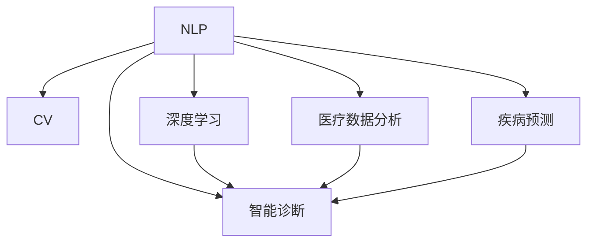

                 

# 人工智能在医疗保健中的应用

> 关键词：人工智能,医疗保健,自然语言处理,计算机视觉,深度学习,医疗数据分析,智能诊断,疾病预测

## 1. 背景介绍

### 1.1 问题由来

随着科技的进步，人工智能(AI)技术在医疗保健领域的应用日益广泛。从自然语言处理(NLP)、计算机视觉(CV)到深度学习、医疗数据分析，AI正在逐步改变医疗保健的各个方面，从疾病预测、智能诊断到个性化治疗，AI在提升医疗效率和效果方面展现出巨大的潜力。

### 1.2 问题核心关键点

人工智能在医疗保健中的应用，主要集中在以下几个方面：

- **自然语言处理(NLP)**：利用NLP技术处理医疗记录、病历文档等文本数据，提取和理解其中的关键信息，为医疗决策提供支持。

- **计算机视觉(CV)**：通过图像识别和分析，帮助医生在影像诊断、病灶检测等方面做出更加准确的判断。

- **深度学习**：利用深度学习模型进行图像、信号等复杂数据的处理和分析，提升医疗决策的精度和速度。

- **医疗数据分析**：对大规模医疗数据进行分析和挖掘，发现隐藏在数据背后的规律和模式，为疾病预防和治疗提供数据支持。

- **智能诊断**：基于AI技术的辅助诊断系统，能够提供快速、准确的诊断结果，辅助医生做出治疗决策。

- **疾病预测**：通过机器学习模型对疾病发展趋势进行预测，提前干预，降低疾病风险。

### 1.3 问题研究意义

人工智能在医疗保健中的应用，对提升医疗服务的质量和效率具有重要意义：

- **提高诊疗准确性**：AI技术能够处理和分析大量的医学数据，辅助医生进行准确诊断。
- **优化诊疗流程**：AI能够自动化部分诊疗流程，提高诊疗效率。
- **个性化治疗**：通过分析患者的病历和基因信息，提供个性化的治疗方案，提升治疗效果。
- **疾病预防**：通过数据分析和预测，提前预防和控制疾病传播。
- **降低医疗成本**：通过自动化和智能化管理，降低人力和物力成本。
- **推动医疗创新**：AI技术的应用推动了医疗领域的创新和发展，为医疗保健带来新的可能性。

## 2. 核心概念与联系

### 2.1 核心概念概述

为了更好地理解人工智能在医疗保健中的应用，本节将介绍几个核心概念：

- **自然语言处理(NLP)**：AI技术对自然语言进行理解和生成，广泛应用于医疗文本的自动化处理，如病历记录、医学文献等。

- **计算机视觉(CV)**：利用图像识别技术对医疗影像进行分析和处理，如X光片、CT、MRI等。

- **深度学习**：一种基于神经网络的机器学习技术，在图像处理、语音识别、自然语言处理等领域具有广泛应用。

- **医疗数据分析**：对医疗数据进行分析和挖掘，发现疾病发展趋势和规律，为医疗决策提供数据支持。

- **智能诊断**：基于AI技术的辅助诊断系统，能够提供快速、准确的诊断结果，辅助医生做出治疗决策。

- **疾病预测**：利用机器学习模型对疾病发展趋势进行预测，提前干预，降低疾病风险。

这些核心概念之间的逻辑关系可以通过以下Mermaid流程图来展示：



这个流程图展示了几大核心概念及其之间的关系：

1. NLP是医疗数据分析和智能诊断的基础，能够提供结构化的信息。
2. CV通过图像识别技术，辅助诊断和预测。
3. 深度学习技术为这些任务提供了强有力的算法支持。
4. 医疗数据分析能够发现疾病发展趋势和模式，为智能诊断和疾病预测提供数据支持。
5. 智能诊断和疾病预测是AI在医疗保健中的直接应用。

## 3. 核心算法原理 & 具体操作步骤
### 3.1 算法原理概述

人工智能在医疗保健中的应用，主要基于机器学习和深度学习技术。其核心思想是通过对大量医疗数据的学习，构建预测模型，辅助医疗决策。

形式化地，假设医疗数据集为 $D=\{(x_i,y_i)\}_{i=1}^N$，其中 $x_i$ 为输入特征，$y_i$ 为对应的输出标签。构建一个机器学习模型 $M$，使其能够通过学习训练数据集 $D$，预测新样本的标签 $y$。

### 3.2 算法步骤详解

基于机器学习和深度学习的医疗保健应用，通常包括以下几个关键步骤：

**Step 1: 数据收集与预处理**
- 收集医疗数据集，包括电子病历、影像数据、基因数据等。
- 对数据进行清洗和标注，如去除噪声、标注疾病类型等。

**Step 2: 模型选择与设计**
- 选择合适的机器学习或深度学习模型，如决策树、随机森林、卷积神经网络(CNN)、循环神经网络(RNN)、Transformer等。
- 设计合适的模型结构，包括网络层数、神经元个数等。

**Step 3: 模型训练**
- 将数据集划分为训练集、验证集和测试集。
- 使用训练集数据，通过反向传播算法优化模型参数，最小化损失函数。
- 在验证集上评估模型性能，避免过拟合。
- 使用测试集评估最终模型的性能。

**Step 4: 模型应用与优化**
- 将训练好的模型应用到实际医疗数据上，进行预测或诊断。
- 根据应用效果，调整模型参数或设计新的模型。

### 3.3 算法优缺点

基于机器学习和深度学习的医疗保健应用，具有以下优点：

1. **提高诊疗准确性**：AI技术能够处理和分析大量的医学数据，辅助医生进行准确诊断。
2. **优化诊疗流程**：AI能够自动化部分诊疗流程，提高诊疗效率。
3. **个性化治疗**：通过分析患者的病历和基因信息，提供个性化的治疗方案，提升治疗效果。
4. **疾病预防**：通过数据分析和预测，提前干预，降低疾病风险。
5. **降低医疗成本**：通过自动化和智能化管理，降低人力和物力成本。
6. **推动医疗创新**：AI技术的应用推动了医疗领域的创新和发展，为医疗保健带来新的可能性。

同时，这些技术也存在一些局限性：

1. **数据质量问题**：医疗数据往往存在噪声和不完整，可能影响模型的训练效果。
2. **隐私和安全问题**：医疗数据涉及隐私，需要严格的保护措施。
3. **模型解释性不足**：深度学习模型通常难以解释其决策过程，影响医生的信任度。
4. **计算资源需求高**：训练深度学习模型需要大量的计算资源，可能对设备和算力提出较高要求。
5. **模型泛化能力**：AI模型可能过拟合于训练数据，泛化能力有限。
6. **应用场景局限性**：不同医院和地区的医疗数据可能存在差异，AI模型的泛化能力有限。

尽管存在这些局限性，但人工智能在医疗保健中的应用已经展现出巨大的潜力，随着技术的不断进步，这些局限性有望得到克服。

### 3.4 算法应用领域

人工智能在医疗保健中的应用，覆盖了多个领域，包括但不限于：

- **影像诊断**：利用计算机视觉技术对医疗影像进行分析和处理，如X光片、CT、MRI等。
- **病历分析**：通过自然语言处理技术对电子病历进行分析，提取关键信息，辅助诊断和治疗。
- **疾病预测**：利用机器学习模型对疾病发展趋势进行预测，提前干预，降低疾病风险。
- **智能问答**：构建基于自然语言处理的智能问答系统，解答患者的常见问题，提供健康指导。
- **个性化治疗**：利用数据分析和机器学习技术，为患者提供个性化的治疗方案。
- **医疗机器人**：利用AI技术驱动的医疗机器人，进行手术操作、病床护理等。

## 4. 数学模型和公式 & 详细讲解 & 举例说明（备注：数学公式请使用latex格式，latex嵌入文中独立段落使用 $$，段落内使用 $)
### 4.1 数学模型构建

本节将使用数学语言对基于机器学习和深度学习的医疗保健应用进行更加严格的刻画。

假设医疗数据集为 $D=\{(x_i,y_i)\}_{i=1}^N$，其中 $x_i$ 为输入特征，$y_i$ 为对应的输出标签。定义模型 $M$ 在输入 $x$ 上的预测结果为 $\hat{y}=M(x)$，损失函数为 $\ell(y,\hat{y})$。

构建一个机器学习模型 $M$，使其能够通过学习训练数据集 $D$，预测新样本的标签 $y$。模型的优化目标是最小化经验风险，即：

$$
\min_{\theta} \mathcal{L}(M(x),y) = \mathbb{E}_{p(x,y)}[\ell(y,M(x))]
$$

其中 $\theta$ 为模型参数，$\mathcal{L}$ 为损失函数。

### 4.2 公式推导过程

以影像诊断为例，假设输入为 $x_i$ 是X光片的图像数据，输出 $y_i$ 为疾病类型。利用卷积神经网络(CNN)进行影像诊断，模型输出为 $\hat{y}=f(x;\theta)$，其中 $f$ 为CNN模型。

假设损失函数为交叉熵损失函数，则模型的优化目标为：

$$
\min_{\theta} \mathcal{L}(M(x),y) = -\frac{1}{N} \sum_{i=1}^N \sum_{c} y_{ic} \log f_{ic}(x_i)
$$

其中 $c$ 为疾病类型，$f_{ic}(x_i)$ 为模型在 $x_i$ 上预测为 $c$ 的置信度。

根据链式法则，损失函数对参数 $\theta$ 的梯度为：

$$
\frac{\partial \mathcal{L}(M(x),y)}{\partial \theta} = -\frac{1}{N} \sum_{i=1}^N \sum_{c} y_{ic} \frac{\partial f_{ic}(x_i)}{\partial \theta}
$$

其中 $\frac{\partial f_{ic}(x_i)}{\partial \theta}$ 为CNN模型的梯度，可以通过反向传播算法高效计算。

### 4.3 案例分析与讲解

以IBM的Watson诊断系统为例，其核心技术是基于深度学习和自然语言处理的双模态模型。Watson首先通过自然语言处理技术对病历文本进行分析，提取关键信息，然后使用卷积神经网络对影像数据进行处理，综合两种数据来源进行疾病预测和诊断。

在具体实现中，Watson使用多个子模型进行联合预测，每个子模型负责处理不同的特征数据。这些子模型通过权重共享和并行计算，提高了预测的准确性和效率。Watson系统还采用了自适应学习策略，根据病人的病情动态调整模型参数，进一步提升诊断效果。

## 5. 项目实践：代码实例和详细解释说明
### 5.1 开发环境搭建

在进行医疗保健AI应用开发前，我们需要准备好开发环境。以下是使用Python进行TensorFlow开发的环境配置流程：

1. 安装Anaconda：从官网下载并安装Anaconda，用于创建独立的Python环境。

2. 创建并激活虚拟环境：
```bash
conda create -n ai-env python=3.8 
conda activate ai-env
```

3. 安装TensorFlow：根据CUDA版本，从官网获取对应的安装命令。例如：
```bash
conda install tensorflow tensorflow-cpu=cuda11.1
```

4. 安装TensorBoard：
```bash
conda install tensorboard
```

5. 安装各类工具包：
```bash
pip install numpy pandas scikit-learn matplotlib tqdm jupyter notebook ipython
```

完成上述步骤后，即可在`ai-env`环境中开始AI应用开发。

### 5.2 源代码详细实现

下面我们以医学影像分类为例，给出使用TensorFlow构建卷积神经网络(CNN)的PyTorch代码实现。

首先，定义模型结构：

```python
import tensorflow as tf
from tensorflow.keras.layers import Conv2D, MaxPooling2D, Flatten, Dense

model = tf.keras.Sequential([
    Conv2D(32, (3, 3), activation='relu', input_shape=(128, 128, 3)),
    MaxPooling2D((2, 2)),
    Conv2D(64, (3, 3), activation='relu'),
    MaxPooling2D((2, 2)),
    Flatten(),
    Dense(128, activation='relu'),
    Dense(10, activation='softmax')
])
```

然后，定义训练和评估函数：

```python
from tensorflow.keras.preprocessing.image import ImageDataGenerator

# 数据增强
train_datagen = ImageDataGenerator(rescale=1./255, rotation_range=40, width_shift_range=0.2, height_shift_range=0.2, shear_range=0.2, zoom_range=0.2, horizontal_flip=True)

# 加载数据集
train_generator = train_datagen.flow_from_directory('train', target_size=(128, 128), batch_size=32, class_mode='categorical')

def train_epoch(model, dataset, batch_size, optimizer):
    dataloader = tf.data.Dataset.from_generator(lambda: dataset, output_signature=(batch_size, input_shape))
    model.compile(optimizer=optimizer, loss='categorical_crossentropy', metrics=['accuracy'])
    model.fit(dataloader, epochs=10, validation_data=dataset)

def evaluate(model, dataset, batch_size):
    dataloader = tf.data.Dataset.from_generator(lambda: dataset, output_signature=(batch_size, input_shape))
    model.evaluate(dataloader)
```

最后，启动训练流程并在测试集上评估：

```python
epochs = 10
batch_size = 32

for epoch in range(epochs):
    train_epoch(model, train_generator, batch_size, optimizer)
    evaluate(model, test_generator, batch_size)
```

以上就是使用TensorFlow进行医学影像分类的完整代码实现。可以看到，得益于TensorFlow的强大封装，我们可以用相对简洁的代码完成模型的构建和训练。

### 5.3 代码解读与分析

让我们再详细解读一下关键代码的实现细节：

**模型定义**：
- 使用Sequential模型定义多层神经网络结构。
- 包括卷积层、池化层、全连接层等，并使用ReLU和Softmax激活函数。

**数据增强**：
- 使用ImageDataGenerator进行数据增强，包括图像缩放、旋转、平移等操作，增加数据集的多样性，避免过拟合。

**训练和评估函数**：
- 使用tf.data.Dataset从生成器中获取数据，并进行批次化处理。
- 通过compile方法设置优化器、损失函数和评估指标。
- 使用fit方法进行模型训练，设置训练轮数和验证集。
- 使用evaluate方法在测试集上评估模型性能。

**训练流程**：
- 定义总的训练轮数和批次大小，开始循环迭代
- 每个epoch内，在训练集上进行训练，并使用测试集进行评估
- 循环执行，直至达到预设的轮数

可以看到，TensorFlow提供了强大的模型构建和训练框架，使得AI应用开发变得更加高效和便捷。

## 6. 实际应用场景
### 6.1 影像诊断

影像诊断是AI在医疗保健中最具代表性的应用之一。传统影像诊断依赖医生的经验和直觉，容易受到主观因素的影响。而AI可以通过大量的医学影像数据进行学习和训练，提供快速、准确的诊断结果。

在具体应用中，AI影像诊断系统通常包括以下几个步骤：

1. 数据收集：收集大量的医学影像数据，并进行标注和清洗。
2. 模型训练：使用卷积神经网络等深度学习模型，对影像数据进行训练，学习影像特征和疾病模式。
3. 预测和诊断：将新的影像数据输入模型，得到预测结果，辅助医生进行诊断。

例如，谷歌的DeepMind开发的AlphaGo在影像诊断中应用广泛，能够对X光片、CT、MRI等影像进行分析和处理，帮助医生快速准确地做出诊断。

### 6.2 病历分析

病历分析是另一个重要的医疗保健应用场景。通过自然语言处理技术，AI能够自动提取病历中的关键信息，如病史、症状、诊断等，为医生提供决策支持。

在具体应用中，AI病历分析系统通常包括以下几个步骤：

1. 数据收集：收集大量的电子病历数据，并进行标注和清洗。
2. 文本处理：使用自然语言处理技术，对病历文本进行分词、实体识别、句法分析等处理。
3. 信息提取：通过规则和模型，从病历文本中提取关键信息，如疾病类型、治疗方案等。
4. 决策支持：将提取出的信息输入到决策支持系统，辅助医生进行诊断和治疗。

例如，IBM的Watson Health通过自然语言处理技术，对电子病历进行分析，提取患者信息、病史和治疗方案，辅助医生进行诊断和治疗决策。

### 6.3 疾病预测

疾病预测是AI在医疗保健中的重要应用之一。通过分析患者的历史数据和当前状态，AI能够预测疾病的发展趋势和风险，提供预防和治疗方案。

在具体应用中，AI疾病预测系统通常包括以下几个步骤：

1. 数据收集：收集大量的患者历史数据，并进行标注和清洗。
2. 特征提取：使用机器学习模型，提取患者的特征信息，如年龄、性别、生活习惯等。
3. 模型训练：使用机器学习模型，对历史数据进行训练，学习疾病发展规律。
4. 风险评估：将新的患者数据输入模型，评估其疾病风险，提供预防和治疗建议。

例如，谷歌的DeepMind开发的DeepMind Health通过机器学习模型，对患者数据进行分析，预测疾病风险，提供个性化的预防和治疗方案。

## 7. 工具和资源推荐
### 7.1 学习资源推荐

为了帮助开发者系统掌握AI在医疗保健中的应用，这里推荐一些优质的学习资源：

1. Coursera《深度学习在医疗保健中的应用》课程：由斯坦福大学医学院和Google Health共同开设的课程，深入浅出地介绍了深度学习在医疗影像、病历分析、疾病预测等领域的应用。

2. 《深度学习在医疗保健中的应用》书籍：详细介绍了深度学习在医疗保健中的各种应用，包括影像诊断、病历分析、疾病预测等。

3. ArXiv上的相关论文：医学影像、病历分析、疾病预测等领域的最新研究成果，提供前沿技术和研究思路。

4. GitHub上的开源项目：收集了大量AI在医疗保健中的应用案例，提供实际开发经验和技术实现细节。

通过对这些资源的学习实践，相信你一定能够快速掌握AI在医疗保健中的应用方法，并用于解决实际的医疗问题。

### 7.2 开发工具推荐

高效的开发离不开优秀的工具支持。以下是几款用于AI在医疗保健应用开发的常用工具：

1. TensorFlow：基于Google的深度学习框架，功能强大，支持多种硬件加速。

2. PyTorch：Facebook开发的深度学习框架，灵活高效，支持动态计算图。

3. Keras：基于TensorFlow和Theano的高级神经网络库，易于上手。

4. Scikit-learn：Python的机器学习库，提供了丰富的算法和工具，支持数据预处理和模型评估。

5. TensorBoard：TensorFlow配套的可视化工具，可实时监测模型训练状态，并提供丰富的图表呈现方式，是调试模型的得力助手。

6. Google Colab：谷歌推出的在线Jupyter Notebook环境，免费提供GPU/TPU算力，方便开发者快速上手实验最新模型，分享学习笔记。

合理利用这些工具，可以显著提升AI在医疗保健应用开发的速度和效率，加快创新迭代的步伐。

### 7.3 相关论文推荐

AI在医疗保健中的应用源于学界的持续研究。以下是几篇奠基性的相关论文，推荐阅读：

1. Google的DeepMind开发的AlphaGo在影像诊断中的应用：通过深度学习和迁移学习技术，显著提升了影像诊断的准确性和效率。

2. IBM的Watson Health在病历分析和疾病预测中的应用：展示了自然语言处理和机器学习技术在医疗领域的应用潜力。

3. 《深度学习在医疗影像诊断中的应用》论文：详细介绍了深度学习在医学影像分类、分割、检测等任务中的应用。

4. 《自然语言处理在医疗保健中的应用》论文：展示了自然语言处理技术在病历分析、医疗问答等任务中的应用。

这些论文代表了大模型微调技术的发展脉络。通过学习这些前沿成果，可以帮助研究者把握学科前进方向，激发更多的创新灵感。

## 8. 总结：未来发展趋势与挑战
### 8.1 总结

本文对AI在医疗保健中的应用进行了全面系统的介绍。首先阐述了AI技术在医疗保健中的研究背景和应用意义，明确了AI在提升医疗服务质量和效率方面的独特价值。其次，从原理到实践，详细讲解了AI在医疗影像、病历分析、疾病预测等领域的应用方法，提供了完整的代码实例。同时，本文还广泛探讨了AI在医疗保健中的未来应用前景，展示了AI技术的广阔前景。

通过本文的系统梳理，可以看到，AI在医疗保健中的应用已经展现出巨大的潜力，从影像诊断、病历分析到疾病预测，AI技术正在逐步改变医疗保健的各个方面。随着技术的不断进步，AI必将在医疗保健领域发挥更大的作用，为患者提供更加精准、高效的诊疗服务。

### 8.2 未来发展趋势

展望未来，AI在医疗保健中的应用将呈现以下几个发展趋势：

1. **更高效的模型**：未来将开发更加高效、轻量级的模型，如Transformer、MobileNet等，能够在不增加计算资源的情况下提升模型性能。

2. **更广泛的场景**：随着技术的发展，AI将应用于更多的医疗场景，如手术辅助、病床护理等，推动医疗领域的智能化发展。

3. **更强的泛化能力**：未来的AI模型将具备更强的泛化能力，能够应对更多样化的数据和更复杂的应用场景。

4. **更灵活的模型**：未来的AI模型将更加灵活，能够根据不同的应用需求进行动态调整，提升模型的适应性。

5. **更可靠的推理**：未来的AI系统将具备更可靠的推理机制，能够提供更加准确、可信的诊断和治疗建议。

6. **更强的隐私保护**：未来的AI系统将更加注重数据隐私和安全性，保护患者隐私，增强系统的可信度。

以上趋势凸显了AI在医疗保健中的广阔前景。这些方向的探索发展，必将进一步提升AI系统的性能和应用范围，为医疗保健带来更多的可能性。

### 8.3 面临的挑战

尽管AI在医疗保健中的应用已经取得了显著的进展，但在迈向更加智能化、普适化应用的过程中，它仍面临诸多挑战：

1. **数据隐私和安全问题**：医疗数据涉及隐私，需要严格的保护措施。如何在数据隐私和安全方面取得平衡，是未来的一大挑战。

2. **模型的解释性问题**：深度学习模型通常难以解释其决策过程，影响医生的信任度。如何增强模型的可解释性，是未来需要解决的重要问题。

3. **计算资源需求高**：训练深度学习模型需要大量的计算资源，可能对设备和算力提出较高要求。如何降低计算成本，提高模型训练效率，是未来需要解决的问题。

4. **模型的泛化能力有限**：不同医院和地区的医疗数据可能存在差异，AI模型的泛化能力有限。如何在不同的医疗环境中应用AI模型，提升模型的泛化能力，是未来需要解决的问题。

5. **模型的伦理问题**：AI系统可能存在偏见和歧视，需要引入伦理约束，确保系统的公平性和公正性。如何在模型训练和应用中考虑伦理问题，是未来需要解决的问题。

6. **模型的安全和稳定性问题**：AI系统可能存在漏洞和安全隐患，需要加强模型的安全性和稳定性。如何在模型设计和应用中考虑安全性，是未来需要解决的问题。

正视AI在医疗保健中面临的这些挑战，积极应对并寻求突破，将是大规模应用AI技术的重要保障。相信随着学界和产业界的共同努力，这些挑战终将一一被克服，AI在医疗保健中的应用必将更加广泛和深入。

### 8.4 研究展望

面向未来，AI在医疗保健中的研究需要在以下几个方面寻求新的突破：

1. **无监督学习和半监督学习**：探索无监督和半监督学习技术，摆脱对大规模标注数据的依赖，利用自监督学习、主动学习等方法，提高模型的泛化能力。

2. **多模态融合**：探索多模态数据的融合技术，将医学影像、电子病历、基因数据等多种数据源结合，提升模型的综合分析能力。

3. **模型的可解释性**：引入因果推断和可解释性技术，增强模型的可解释性，提高医生对模型的信任度。

4. **数据隐私保护**：引入数据隐私保护技术，如差分隐私、联邦学习等，确保数据隐私和安全。

5. **智能辅助系统**：开发更加智能化的辅助系统，如智能问答、智能推荐等，提升医疗服务的质量和效率。

6. **跨学科融合**：探索跨学科的融合技术，如将AI与医学、社会学、心理学等学科结合，推动医疗保健的全面进步。

这些研究方向的探索，必将引领AI在医疗保健中的进一步发展，为构建安全、可靠、可解释、可控的智能系统铺平道路。面向未来，AI在医疗保健中的研究还需要与其他人工智能技术进行更深入的融合，如知识表示、因果推理、强化学习等，多路径协同发力，共同推动自然语言理解和智能交互系统的进步。只有勇于创新、敢于突破，才能不断拓展AI的边界，让智能技术更好地造福人类社会。

## 9. 附录：常见问题与解答
**Q1：AI在医疗保健中的数据隐私和安全问题如何解决？**

A: 数据隐私和安全问题是AI在医疗保健应用中的核心挑战之一。为了解决这些问题，可以采用以下措施：

1. **数据加密**：对医疗数据进行加密存储和传输，防止数据泄露和篡改。

2. **差分隐私**：在数据收集和分析过程中，加入噪声，确保数据隐私不被泄露。

3. **联邦学习**：在分布式环境中，通过模型训练过程中的通信控制，保护数据隐私。

4. **访问控制**：对医疗数据的访问进行严格控制，确保只有授权人员才能访问敏感数据。

5. **审计和监控**：对医疗数据的访问和使用进行审计和监控，确保数据使用合规。

通过以上措施，可以在确保数据隐私和安全的前提下，进行AI在医疗保健中的应用。

**Q2：AI在医疗保健中的模型解释性问题如何解决？**

A: 模型解释性问题是AI在医疗保健中的另一个重要挑战。为了解决这些问题，可以采用以下措施：

1. **模型可视化**：通过可视化工具，展示模型的内部结构和决策过程，帮助医生理解模型的工作原理。

2. **规则引擎**：引入规则引擎，将模型决策过程与业务规则结合，提高模型的可解释性。

3. **因果推断**：引入因果推断方法，分析模型决策的因果关系，增强模型的可解释性。

4. **可解释模型**：开发可解释性模型，如LIME、SHAP等，能够提供局部模型解释，帮助医生理解模型决策。

5. **模型审计**：对模型进行审计，评估模型的公平性、透明性和可解释性。

通过以上措施，可以增强AI在医疗保健中的模型解释性，提高医生的信任度。

**Q3：AI在医疗保健中的应用如何降低计算资源需求？**

A: 计算资源需求高是AI在医疗保健应用中的另一个重要挑战。为了降低计算资源需求，可以采用以下措施：

1. **模型压缩**：使用模型压缩技术，如剪枝、量化、低秩分解等，减少模型参数和计算量。

2. **分布式训练**：使用分布式训练技术，将模型训练任务分散到多个计算节点上，提高训练效率。

3. **边缘计算**：将部分计算任务转移到边缘设备上，如移动设备、传感器等，减少计算资源需求。

4. **模型微调**：通过微调技术，使用较少的数据和计算资源进行模型训练，提高模型的泛化能力。

5. **模型优化**：优化模型的架构和算法，提高计算效率。

通过以上措施，可以显著降低AI在医疗保健中的应用对计算资源的需求，提高模型的实用性和可扩展性。

**Q4：AI在医疗保健中的模型的泛化能力如何提升？**

A: 模型的泛化能力是AI在医疗保健中的核心需求之一。为了提升模型的泛化能力，可以采用以下措施：

1. **数据增强**：通过数据增强技术，增加数据集的多样性，避免模型过拟合。

2. **迁移学习**：利用迁移学习技术，将预训练模型的知识迁移到目标任务上，提升模型的泛化能力。

3. **多模态融合**：将多种数据源结合，提升模型的综合分析能力，增强模型的泛化能力。

4. **对抗训练**：通过对抗训练技术，提高模型对噪声和攻击的鲁棒性，增强模型的泛化能力。

5. **模型集成**：通过模型集成技术，将多个模型的预测结果结合，提高模型的泛化能力。

通过以上措施，可以显著提升AI在医疗保健中的模型泛化能力，增强模型在不同环境中的适用性。

**Q5：AI在医疗保健中的应用如何确保模型的公平性和公正性？**

A: 模型的公平性和公正性是AI在医疗保健中的重要问题。为了确保模型的公平性和公正性，可以采用以下措施：

1. **公平性评估**：对模型进行公平性评估，确保模型不产生歧视和偏见。

2. **公平性约束**：在模型训练过程中，加入公平性约束，确保模型公平性。

3. **数据平衡**：确保训练数据中不同群体的数据平衡，防止模型对特定群体产生偏见。

4. **可解释性**：增强模型的可解释性，确保医生能够理解模型的决策过程。

5. **伦理审查**：引入伦理审查机制，确保模型的应用符合伦理和法律规定。

通过以上措施，可以确保AI在医疗保健中的应用具备公平性和公正性，避免产生偏见和歧视。

---

作者：禅与计算机程序设计艺术 / Zen and the Art of Computer Programming

