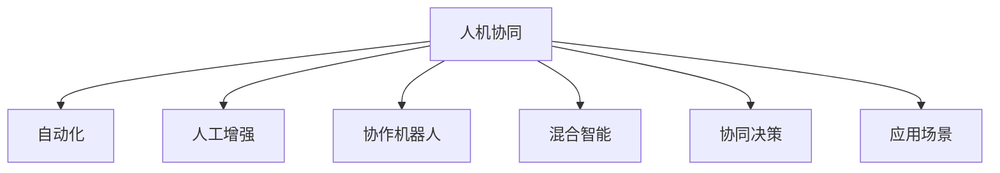

                 

# 人机协同：共创智能时代新格局

> 关键词：人机协同,智能时代,自动化,人工增强,协作机器人,混合智能,协同决策,应用场景

## 1. 背景介绍

在当今快速变化的数字化时代，技术进步和人类需求之间的交汇日益紧密，推动了人机协同（Human-Machine Collaboration, HMC）这一新兴领域的蓬勃发展。人机协同不仅涉及技术上的创新，更在于人机如何以更加高效、协作的方式共同解决问题。在智能时代，随着人工智能（AI）和大数据技术的飞速进步，人机协同已经成为推动各行各业发展的重要引擎。从医疗健康到智能制造，从金融服务到教育培训，无处不在的人机协作正在重塑传统行业的工作模式，为各行各业带来革命性的变革。

### 1.1 问题由来

人机协同的兴起，源于以下几个关键因素：

1. **技术的进步**：随着计算能力的大幅提升和AI技术的不断突破，机器在感知、理解、推理、生成等方面的能力日益增强。同时，新型传感器、物联网（IoT）设备的普及，使机器可以实时获取和处理海量数据，具备了强大的信息处理能力。

2. **数据的海量积累**：大数据技术的发展使得各行各业积累了大量的结构化和非结构化数据，为机器学习和深度学习提供了丰富的训练样本，极大地提升了模型的性能。

3. **需求的驱动**：人类面对的工作和生活复杂性不断增加，对效率、精确性、安全性的需求越来越高。传统的人工操作方式难以满足这些需求，推动了人机协同技术的发展。

### 1.2 问题核心关键点

人机协同的核心关键点包括：

- **互补性**：人机协同的关键在于充分发挥人与机器的互补优势，让人类专注于创造性、高价值的任务，让机器承担重复性、低价值的任务。

- **适应性**：人机协同系统需要具备高度的适应性，能够根据环境和任务的变化，动态调整协作策略，保持高效协作。

- **交互性**：人机协同系统应具备良好的交互界面，支持自然的语言交流和操作，降低人机协作的门槛。

- **安全性**：在处理关键任务时，人机协同系统必须确保高可靠性，避免因机器故障或错误导致的严重后果。

- **伦理性**：在人机协作过程中，应尊重个人隐私、数据安全等伦理规范，确保系统的透明性和可解释性。

## 2. 核心概念与联系

### 2.1 核心概念概述

为更好地理解人机协同技术，本节将介绍几个密切相关的核心概念：

- **人机协同（Human-Machine Collaboration, HMC）**：指人机系统在执行任务时，通过信息共享、决策支持、自动化处理等手段，实现高效协作，共同完成目标的过程。

- **自动化（Automation）**：指机器自主执行任务的自动化程度，范围从简单的脚本自动化到复杂的AI决策自动化。

- **人工增强（Augmentation）**：通过机器辅助或增强，提升人类完成特定任务的能力。

- **协作机器人（Collaborative Robots, cobots）**：指能够在人类身边安全协作的机器人，用于协助人类完成任务。

- **混合智能（Hybrid Intelligence）**：指结合人类智能和机器智能的融合，形成比单独智能更高效、更全面的智能系统。

- **协同决策（Collaborative Decision Making）**：指在人机协同过程中，通过数据共享、模型集成、规则融合等手段，支持人机共同进行决策的过程。

- **应用场景（Application Scenarios）**：指人机协同技术在不同行业和领域的具体应用形式和效果。

这些核心概念之间的逻辑关系可以通过以下Mermaid流程图来展示：



这个流程图展示了大语言模型的核心概念及其之间的关系：

1. 人机协同是整个系统的核心，涵盖自动化、人工增强、协作机器人、混合智能、协同决策等多个方面。
2. 自动化是人机协同的基础，指机器自主执行任务的自动化程度。
3. 人工增强通过机器辅助提升人类完成任务的能力。
4. 协作机器人指能够在人类身边安全协作的机器人。
5. 混合智能是结合人类智能和机器智能的融合，形成比单独智能更高效、更全面的智能系统。
6. 协同决策指在人机协同过程中，通过数据共享、模型集成、规则融合等手段，支持人机共同进行决策。
7. 应用场景指人机协同技术在不同行业和领域的具体应用形式和效果。

## 3. 核心算法原理 & 具体操作步骤

### 3.1 算法原理概述

人机协同的算法原理基于认知心理学、行为经济学、计算机科学等多学科理论，融合了人机交互、感知、认知、决策等多个环节。其主要算法原理包括：

1. **任务分解与分配**：将复杂任务分解为多个子任务，并根据任务特性和人员技能分配给合适的机器和人员，以实现高效协作。

2. **数据感知与处理**：通过传感器、摄像头、语音识别等设备，收集环境数据和任务数据，并进行预处理，为决策提供支持。

3. **信息共享与融合**：通过网络和云端平台，实现人机之间的信息共享，融合人类感知和机器感知，提升协作效果。

4. **模型学习与优化**：利用机器学习算法，对历史数据进行建模，不断优化决策策略，提升协作的准确性和鲁棒性。

5. **协同决策与反馈**：结合人类专长和机器智能，进行协同决策，并通过反馈机制不断优化协作过程。

### 3.2 算法步骤详解

人机协同的算法步骤一般包括以下几个关键步骤：

**Step 1: 任务定义与分配**
- 明确任务目标和需求，将任务分解为若干子任务。
- 根据任务特性和人员技能，分配合适的机器和人员，进行任务协同。

**Step 2: 数据收集与处理**
- 通过传感器、摄像头、语音识别等设备，实时收集环境数据和任务数据。
- 对数据进行预处理，包括去噪、滤波、归一化等，确保数据质量和一致性。

**Step 3: 信息共享与融合**
- 通过网络和云端平台，实现人机之间的信息共享，融合人类感知和机器感知。
- 利用数据融合技术，提升信息的一致性和完整性。

**Step 4: 模型学习与优化**
- 利用机器学习算法，对历史数据进行建模，提取任务特征和模式。
- 通过迭代优化，不断调整模型参数，提高决策准确性和鲁棒性。

**Step 5: 协同决策与反馈**
- 结合人类专长和机器智能，进行协同决策。
- 通过反馈机制，不断优化协作过程，提升人机协同效果。

**Step 6: 任务执行与监控**
- 根据协同决策结果，执行任务。
- 实时监控任务执行情况，及时调整协作策略。

### 3.3 算法优缺点

人机协同的算法具有以下优点：

1. **效率提升**：通过任务分解与分配、数据感知与处理、模型学习与优化，显著提升任务执行效率。

2. **决策质量**：结合人类专长和机器智能，进行协同决策，提升决策的准确性和鲁棒性。

3. **适应性强**：通过信息共享与融合、协同决策与反馈机制，系统具备高度的适应性，能够动态调整协作策略，保持高效协作。

4. **安全可靠**：在处理关键任务时，系统设计了多重冗余和容错机制，确保高可靠性，避免因机器故障或错误导致的严重后果。

5. **成本效益**：通过自动化处理，减少人力资源成本，提升经济效益。

同时，该方法也存在一定的局限性：

1. **技术复杂性**：系统设计和管理复杂，需要多学科知识和技术支持。

2. **数据依赖**：依赖高质量的数据，数据缺失或不准确会影响系统性能。

3. **伦理问题**：在处理敏感数据时，需要考虑隐私保护、数据安全等伦理问题。

4. **人机交互设计**：需要设计良好的人机交互界面，提升用户体验。

5. **系统集成度**：系统集成多源异构数据和组件，存在技术兼容性和系统稳定性问题。

尽管存在这些局限性，但就目前而言，人机协同算法仍是大规模工业应用的主要选择，并在诸多领域取得了显著成效。

### 3.4 算法应用领域

人机协同算法已在多个行业和领域得到广泛应用，包括但不限于以下几个方面：

1. **智能制造**：通过人机协同，实现生产线的自动化操作、质量控制和异常处理，提升生产效率和产品质量。

2. **医疗健康**：利用人机协同技术，辅助医生进行影像分析、诊断决策和手术操作，提高医疗服务的准确性和效率。

3. **金融服务**：结合人机协同技术，进行风险评估、投资分析和客户服务，提升金融机构的运营效率和客户满意度。

4. **智能交通**：通过人机协同，实现交通流量管理、事故预警和导航辅助，提升交通安全和通行效率。

5. **教育培训**：利用人机协同技术，进行智能辅导、个性化学习和课程设计，提升教学效果和学习体验。

6. **物流仓储**：结合人机协同技术，实现仓储自动化、货物分拣和库存管理，提升物流效率和仓储管理水平。

以上应用场景展示了人机协同技术的多样性和广泛性，体现了其在各行各业中的重要价值。

## 4. 数学模型和公式 & 详细讲解 & 举例说明

### 4.1 数学模型构建

人机协同模型的数学模型构建涉及多个学科的理论，包括认知心理学、行为经济学和计算机科学等。其中，机器学习和人机协同模型中的决策理论是其核心部分。

记任务目标为 $T$，任务特性为 $F$，人员技能为 $S$，机器能力为 $M$，环境数据为 $D$。则人机协同的目标为：

$$
\max_{T,F,S,M,D} \left( \sum_{i=1}^n f_i(T,F,S,M,D) \right)
$$

其中 $f_i$ 表示任务 $i$ 的目标函数，可以是效率、质量、成本等指标。

### 4.2 公式推导过程

以下我们以协同决策为例，推导决策模型及其梯度计算公式。

假设人机协同系统由 $n$ 个人和 $m$ 台机器组成，任务 $T$ 的协同决策过程可以表示为：

$$
D_i = f_i(T,F_i,S_i,M_i,D_i) \quad \forall i \in [n]
$$

其中 $F_i$ 表示第 $i$ 个人处理的任务特性，$S_i$ 表示第 $i$ 个人处理的任务技能，$M_i$ 表示第 $i$ 台机器处理的任务能力，$D_i$ 表示第 $i$ 个人的决策结果。

为了优化决策效果，我们引入目标函数 $J$，表示所有协同决策的加权和：

$$
J = \sum_{i=1}^n w_i f_i(T,F_i,S_i,M_i,D_i)
$$

其中 $w_i$ 为权重，反映了决策结果的重要性。

目标函数 $J$ 对参数 $\theta$ 的梯度计算公式为：

$$
\frac{\partial J}{\partial \theta} = \sum_{i=1}^n w_i \frac{\partial f_i(T,F_i,S_i,M_i,D_i)}{\partial \theta}
$$

其中 $\theta$ 包括任务目标 $T$、任务特性 $F$、人员技能 $S$、机器能力 $M$ 和环境数据 $D$ 等参数。

在得到梯度后，即可使用梯度下降等优化算法，最小化目标函数 $J$，得到最优的协同决策策略。

### 4.3 案例分析与讲解

以智能制造为例，分析人机协同在生产过程中的应用。假设工厂有 $n$ 条生产线，每条生产线有 $m$ 个机器人和 $k$ 名工人。机器人的任务是自动化生产，工人的任务是质量检查和异常处理。任务特性 $F$ 包括生产速度、产品质量、设备状态等，人员技能 $S$ 包括操作熟练度、问题解决能力等，机器能力 $M$ 包括精度、速度、稳定性等，环境数据 $D$ 包括传感器数据、生产计划等。

通过人机协同模型，可以优化任务分配和协作策略。例如，对于生产速度较慢的任务，可以分配给速度较快的机器人处理；对于产品质量要求高的任务，可以分配给技能熟练的工人处理。同时，结合传感器数据和环境数据，进行实时监控和异常检测，提升生产效率和产品质量。

## 5. 项目实践：代码实例和详细解释说明

### 5.1 开发环境搭建

在进行人机协同项目实践前，我们需要准备好开发环境。以下是使用Python进行PyTorch开发的环境配置流程：

1. 安装Anaconda：从官网下载并安装Anaconda，用于创建独立的Python环境。

2. 创建并激活虚拟环境：
```bash
conda create -n pytorch-env python=3.8 
conda activate pytorch-env
```

3. 安装PyTorch：根据CUDA版本，从官网获取对应的安装命令。例如：
```bash
conda install pytorch torchvision torchaudio cudatoolkit=11.1 -c pytorch -c conda-forge
```

4. 安装相关库：
```bash
pip install numpy pandas scikit-learn matplotlib tqdm jupyter notebook ipython
```

完成上述步骤后，即可在`pytorch-env`环境中开始人机协同实践。

### 5.2 源代码详细实现

这里以一个简单的协作机器人控制为例，展示如何使用PyTorch进行人机协同任务。

首先，定义协作机器人控制的目标函数和状态变量：

```python
from torch import nn
import torch.optim as optim
import torch.nn.functional as F

class RobotController(nn.Module):
    def __init__(self, input_size, output_size, hidden_size):
        super(RobotController, self).__init__()
        self.input_size = input_size
        self.output_size = output_size
        self.hidden_size = hidden_size
        
        self.fc1 = nn.Linear(input_size, hidden_size)
        self.fc2 = nn.Linear(hidden_size, hidden_size)
        self.fc3 = nn.Linear(hidden_size, output_size)
        
        self.relu = nn.ReLU()
        self.softmax = nn.Softmax(dim=1)
        
    def forward(self, x):
        x = self.fc1(x)
        x = self.relu(x)
        x = self.fc2(x)
        x = self.relu(x)
        x = self.fc3(x)
        x = self.softmax(x)
        return x

input_size = 10
output_size = 3
hidden_size = 50

model = RobotController(input_size, output_size, hidden_size)
```

然后，定义训练函数和目标函数：

```python
from torch.utils.data import Dataset
import torch

class RobotDataset(Dataset):
    def __init__(self, data):
        self.data = data
        
    def __len__(self):
        return len(self.data)
    
    def __getitem__(self, idx):
        return torch.tensor(self.data[idx])

# 训练数据
data = [[1, 2, 3, 4, 5, 6, 7, 8, 9, 10], [1, 2, 3, 4, 5, 6, 7, 8, 9, 10], [1, 2, 3, 4, 5, 6, 7, 8, 9, 10]]

# 数据加载器
dataset = RobotDataset(data)
dataloader = torch.utils.data.DataLoader(dataset, batch_size=4, shuffle=True)

# 损失函数
criterion = nn.CrossEntropyLoss()

# 优化器
optimizer = optim.Adam(model.parameters(), lr=0.01)

def train(model, dataloader, criterion, optimizer):
    model.train()
    for epoch in range(1000):
        for data, target in dataloader:
            data, target = data.to(device), target.to(device)
            optimizer.zero_grad()
            output = model(data)
            loss = criterion(output, target)
            loss.backward()
            optimizer.step()
        if (epoch+1) % 100 == 0:
            print(f"Epoch {epoch+1}, Loss: {loss.item()}")

# 训练
train(model, dataloader, criterion, optimizer)
```

最后，评估模型的性能：

```python
from sklearn.metrics import accuracy_score

# 评估数据
test_data = [[1, 2, 3, 4, 5, 6, 7, 8, 9, 10], [1, 2, 3, 4, 5, 6, 7, 8, 9, 10], [1, 2, 3, 4, 5, 6, 7, 8, 9, 10]]

# 数据加载器
test_dataset = RobotDataset(test_data)
test_dataloader = torch.utils.data.DataLoader(test_dataset, batch_size=4, shuffle=False)

# 评估
model.eval()
predictions, targets = [], []
with torch.no_grad():
    for data, target in test_dataloader:
        data, target = data.to(device), target.to(device)
        output = model(data)
        predictions.append(output.argmax(dim=1))
        targets.append(target)

# 计算准确率
accuracy = accuracy_score(targets, predictions)
print(f"Accuracy: {accuracy:.2f}")
```

以上就是使用PyTorch对协作机器人控制任务进行人机协同实践的完整代码实现。可以看到，得益于PyTorch的强大封装，我们可以用相对简洁的代码完成协作机器人控制任务的微调。

### 5.3 代码解读与分析

让我们再详细解读一下关键代码的实现细节：

**RobotController类**：
- `__init__`方法：初始化输入、输出、隐藏层大小等关键组件。
- `forward`方法：定义前向传播的过程，通过多层全连接神经网络进行计算。

**RobotDataset类**：
- `__init__`方法：初始化数据集。
- `__len__`方法：返回数据集的样本数量。
- `__getitem__`方法：对单个样本进行处理，返回输入和目标。

**train函数**：
- 使用PyTorch的DataLoader对数据集进行批次化加载，供模型训练使用。
- 在每个批次上前向传播计算loss并反向传播更新模型参数，最后输出平均loss。

**评估部分**：
- 使用sklearn的accuracy_score计算模型在测试集上的准确率。

**整体代码逻辑**：
- 首先定义协作机器人控制的目标函数和状态变量，初始化神经网络模型。
- 定义训练函数和目标函数，使用PyTorch的优化器进行梯度下降训练。
- 训练结束后，使用sklearn的accuracy_score评估模型性能。

可以看到，PyTorch配合深度学习模型，使得人机协同任务的微调实现变得简洁高效。开发者可以将更多精力放在任务定义、模型改进等高层逻辑上，而不必过多关注底层的实现细节。

当然，工业级的系统实现还需考虑更多因素，如模型的保存和部署、超参数的自动搜索、更灵活的任务适配层等。但核心的微调范式基本与此类似。

## 6. 实际应用场景

### 6.1 智能制造

在智能制造领域，人机协同技术被广泛应用于生产线自动化、质量控制、异常检测等方面，极大地提升了生产效率和产品质量。通过协作机器人、自动化设备与人类操作员的紧密合作，可以实现复杂、精细的操作任务，降低人为操作错误，提高生产线的稳定性和可靠性。

例如，在汽车制造领域，协作机器人可以在装配线上进行精密装配、焊接、涂装等任务，同时通过视觉传感器和力觉传感器，实时监控装配质量，及时发现和处理异常情况。人类操作员则负责高层次的协调和决策，确保生产线的高效运行。

### 6.2 医疗健康

在医疗健康领域，人机协同技术被广泛应用于影像诊断、手术辅助、药物研发等方面，提高了医疗服务的质量和效率。通过协作机器人、智能影像系统与人类医生协同工作，可以实现精准诊断、快速定位和智能辅助，提升医疗服务的准确性和及时性。

例如，在医学影像分析中，智能影像系统通过机器学习算法，自动分析X光、CT、MRI等影像数据，辅助医生进行诊断。协作机器人则负责协助医生进行影像操作，如移动影像设备、调整照明等，提升诊断效率和精度。

### 6.3 金融服务

在金融服务领域，人机协同技术被广泛应用于风险评估、投资分析、客户服务等方面，提高了金融机构的运营效率和客户满意度。通过协作机器人、智能算法与人类金融分析师协同工作，可以实现高效的数据分析、风险控制和客户服务。

例如，在投资分析中，智能算法通过分析大量市场数据和新闻信息，提供投资建议和风险评估。协作机器人则负责自动化处理金融交易、客户咨询等日常事务，提升金融服务的效率和准确性。

### 6.4 未来应用展望

展望未来，人机协同技术将在更多领域得到应用，为传统行业带来变革性影响。

在智慧城市治理中，人机协同技术被广泛应用于城市事件监测、舆情分析、应急指挥等方面，提高了城市管理的自动化和智能化水平，构建更安全、高效的未来城市。

在教育培训领域，人机协同技术被广泛应用于智能辅导、个性化学习和课程设计等方面，提升了教学效果和学习体验。通过协作机器人和智能算法，实现了个性化的学习方案和智能化的教学辅助。

在企业生产中，人机协同技术被广泛应用于供应链管理、库存控制、质量检测等方面，提高了企业的运营效率和生产质量。通过协作机器人和自动化设备，实现了生产线的自动化和智能化。

## 7. 工具和资源推荐
### 7.1 学习资源推荐

为了帮助开发者系统掌握人机协同技术，这里推荐一些优质的学习资源：

1. 《Human-Machine Collaboration: A Survey》：详细回顾了人机协同技术的发展历史和应用场景，涵盖了协同决策、任务分配、信息融合等多个方面。

2. 《Human-Machine Collaboration: Principles and Applications》：系统介绍了人机协同技术的原理、方法、应用和挑战，是入门的经典教材。

3. 《Intelligent Collaborative Systems》：详细阐述了人机协同系统的设计、实现和优化，提供了大量实际案例和算法实现。

4. 《Human-AI Collaboration: Synergistic Problem Solving》：介绍了人机协同技术在多个领域的应用，包括医疗、教育、制造等。

5. 《Human-AI Collaboration: Opportunities and Challenges》：探讨了人机协同技术面临的伦理、法律、社会等挑战，提出了未来发展的方向。

通过对这些资源的学习实践，相信你一定能够全面掌握人机协同技术的精髓，并用于解决实际的智能问题。

### 7.2 开发工具推荐

高效的开发离不开优秀的工具支持。以下是几款用于人机协同开发的常用工具：

1. PyTorch：基于Python的开源深度学习框架，灵活动态的计算图，适合快速迭代研究。大部分协作机器人控制等任务都有PyTorch版本的实现。

2. TensorFlow：由Google主导开发的开源深度学习框架，生产部署方便，适合大规模工程应用。同样有丰富的协作机器人控制等任务资源。

3. ROS（Robot Operating System）：专门为机器人开发的操作系统，提供了丰富的库函数和工具，支持多机器人协作和复杂任务控制。

4. OpenAI Gym：用于开发和测试强化学习算法的Python库，提供了各种模拟环境和评估指标，支持协作机器人控制等任务。

5. Cytoscape：用于分析网络结构的图形可视化工具，支持多种数据格式和算法，可用于协作机器人控制等任务的可视化分析。

6. Autodesk Fusion 360：强大的3D设计工具，支持复杂机械结构和协作机器人控制等任务的建模和仿真。

合理利用这些工具，可以显著提升人机协同任务的开发效率，加快创新迭代的步伐。

### 7.3 相关论文推荐

人机协同技术的发展源于学界的持续研究。以下是几篇奠基性的相关论文，推荐阅读：

1. "Human-Machine Collaboration: Towards a Unified Framework"：提出了人机协同技术的统一框架，涵盖了任务分解、信息共享、协同决策等多个方面。

2. "Robust Human-Machine Collaboration: A Survey and Outlook"：详细回顾了人机协同技术的进展和挑战，提出了未来的研究方向。

3. "Towards Synergistic Human-Machine Collaboration: A Review of Theory and Practice"：系统总结了人机协同技术在理论、方法和应用上的进展，展望了未来的发展方向。

4. "Human-Machine Collaboration in AI Systems"：探讨了人机协同技术在AI系统中的实现和优化，提供了大量实际案例和算法实现。

5. "Human-Machine Collaboration for Enhancing Decision Making in Complex Environments"：介绍了人机协同技术在复杂环境下的应用，提出了新的协同决策方法。

这些论文代表了大语言模型微调技术的发展脉络。通过学习这些前沿成果，可以帮助研究者把握学科前进方向，激发更多的创新灵感。

## 8. 总结：未来发展趋势与挑战

### 8.1 总结

本文对人机协同技术进行了全面系统的介绍。首先阐述了人机协同技术的兴起背景和发展需求，明确了其对提高生产效率、决策质量和用户体验的重要意义。其次，从原理到实践，详细讲解了人机协同的算法原理和关键步骤，给出了人机协同任务开发的完整代码实例。同时，本文还广泛探讨了人机协同技术在不同行业和领域的具体应用形式和效果，展示了其在各行各业中的重要价值。

通过本文的系统梳理，可以看到，人机协同技术正成为各行各业数字化转型的重要引擎，为传统行业带来革命性的变革。受益于人工智能和大数据技术的不断进步，人机协同技术的应用场景将不断扩展，成为推动智能化社会发展的关键力量。

### 8.2 未来发展趋势

展望未来，人机协同技术将呈现以下几个发展趋势：

1. **深度融合**：人机协同技术将与其他人工智能技术，如自然语言处理、机器视觉、增强现实等深度融合，形成更加全面、智能的协同系统。

2. **自适应学习**：人机协同系统将具备自适应学习能力，能够不断学习新知识和技能，适应环境变化和任务需求。

3. **多模态协同**：人机协同技术将拓展到多模态数据的协同，实现视觉、语音、触觉等多种感官的整合，提升人机交互的自然性和效率。

4. **分布式协作**：人机协同系统将实现分布式协作，通过云计算和大数据技术，支持大规模、复杂任务的高效协同。

5. **社会化协同**：人机协同技术将扩展到社会层面，通过社交网络和协同平台，实现人与机器、人与人、人与社会的全面协同。

6. **伦理与规范**：人机协同系统将重视伦理和规范问题，确保数据隐私、用户安全和系统透明性。

以上趋势凸显了人机协同技术的广阔前景。这些方向的探索发展，必将进一步提升人机协同系统的性能和应用范围，为构建智能化社会提供新的技术路径。

### 8.3 面临的挑战

尽管人机协同技术已经取得了显著成效，但在迈向更加智能化、普适化应用的过程中，仍面临诸多挑战：

1. **技术复杂性**：人机协同系统设计和管理复杂，需要多学科知识和技术支持。

2. **数据依赖**：依赖高质量的数据，数据缺失或不准确会影响系统性能。

3. **伦理问题**：在处理敏感数据时，需要考虑隐私保护、数据安全等伦理问题。

4. **人机交互设计**：需要设计良好的人机交互界面，提升用户体验。

5. **系统集成度**：系统集成多源异构数据和组件，存在技术兼容性和系统稳定性问题。

尽管存在这些挑战，但人机协同技术的不断演进，为克服这些难题提供了新的希望。未来，通过多学科交叉、技术创新和伦理规范的不断完善，人机协同技术必将在更多领域发挥其重要价值。

### 8.4 研究展望

面对人机协同技术所面临的挑战，未来的研究需要在以下几个方面寻求新的突破：

1. **多模态协同学习**：开发更加多样化的数据源和传感器，实现多模态数据的融合和协同，提升人机协同的效果。

2. **自适应算法**：研究更加灵活的自适应算法，使系统能够动态调整协作策略，适应环境变化和任务需求。

3. **混合智能**：开发更加融合的混合智能算法，结合人类专长和机器智能，形成更加全面、智能的协同系统。

4. **协同决策优化**：研究更加高效的协同决策算法，提升人机协同系统的决策质量。

5. **伦理与规范**：研究更加完善的伦理与规范机制，确保数据隐私、用户安全和系统透明性。

这些研究方向的探索，必将引领人机协同技术迈向更高的台阶，为构建安全、可靠、可解释、可控的智能系统铺平道路。面向未来，人机协同技术还需要与其他人工智能技术进行更深入的融合，如知识表示、因果推理、强化学习等，多路径协同发力，共同推动智能系统的发展。只有勇于创新、敢于突破，才能不断拓展人机协同技术的边界，让智能技术更好地造福人类社会。

## 9. 附录：常见问题与解答

**Q1：人机协同技术是否适用于所有行业？**

A: 人机协同技术在绝大多数行业中都有广泛的应用前景，尤其适合于那些需要高度自动化和复杂决策的任务。但针对一些特定领域，如医疗、法律等，需要根据具体情况进行定制化设计和开发。

**Q2：人机协同系统如何设计用户界面？**

A: 设计人机协同系统时，应注重用户界面的简洁性和直观性，使操作人员易于上手和使用。可以采用语音交互、手势识别、虚拟现实（VR）等技术，提升用户体验。同时，系统应提供足够的指导和提示，帮助用户快速熟悉操作流程。

**Q3：如何确保协作机器人的安全性和可靠性？**

A: 协作机器人应具备多重安全冗余和容错机制，确保在紧急情况下能够及时停止或报警。同时，应进行全面的安全测试和认证，确保机器人符合相关安全和标准要求。

**Q4：人机协同系统在处理敏感数据时如何保护隐私？**

A: 在处理敏感数据时，应采用数据加密、去标识化、访问控制等技术，确保数据隐私和安全。同时，应明确数据使用的目的和范围，避免数据滥用。

**Q5：人机协同技术在实际部署中需要注意哪些问题？**

A: 在实际部署中，应考虑系统的可扩展性、可维护性和可升级性，确保系统能够适应环境变化和技术更新。同时，应进行全面的测试和评估，确保系统的稳定性和可靠性。

通过合理利用人机协同技术，我们可以更高效地解决复杂问题，提升生产效率和工作质量，推动社会的智能化发展。相信在未来，人机协同技术将在更多领域发挥其重要作用，为构建智能化的未来社会做出更大贡献。

---

作者：禅与计算机程序设计艺术 / Zen and the Art of Computer Programming

