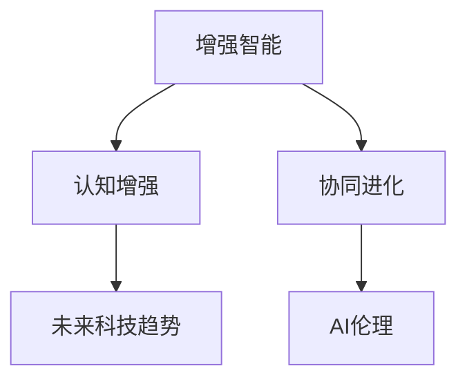

                 

# 人类-AI协Multiplier：增强人类智慧与AI能力的融合发展趋势预测分析机遇

> 关键词：人工智能增强，人类智慧融合，协同进化，AI伦理，未来科技趋势

## 1. 背景介绍

### 1.1 问题由来
随着人工智能(AI)技术的快速发展，人类与AI之间的互动方式正发生深刻变革。AI不仅能进行复杂的计算和决策，还能理解和生成自然语言，通过深度学习和神经网络等技术，展现了超越以往的智能水平。然而，尽管AI能力日益强大，人类智慧与AI的融合仍然面临着诸多挑战和机遇。

### 1.2 问题核心关键点
本文聚焦于人类智慧与AI能力的融合发展趋势，探讨在何种程度上AI可以增强人类智慧，以及在何种层面上人类能够利用AI技术实现智慧的协同进化。此问题核心关键点包括：

- AI如何提升人类智慧水平
- AI技术在人类认知增强中的应用
- 人类与AI协同进化的未来趋势
- AI在人类社会中的伦理问题

### 1.3 问题研究意义
研究人类智慧与AI能力的融合发展趋势，对于推动AI技术的产业化应用，提升社会生产力和人类生活质量具有重要意义：

1. 加速社会转型：AI技术能够优化决策流程，提高生产效率，推动社会生产方式变革。
2. 提升人类智能：AI通过数据处理、模式识别等优势，帮助人类更好地理解世界和解决问题。
3. 增进社会福祉：AI在医疗、教育、公共安全等领域的应用，可以提升服务质量和人民幸福感。
4. 探索智慧未来：人类智慧与AI的融合发展，将开启智能社会的新纪元，探索人类认知的边界。

## 2. 核心概念与联系

### 2.1 核心概念概述

为更好地理解人类智慧与AI能力融合发展趋势，本文将介绍几个密切相关的核心概念：

- **增强智能**：通过AI技术，提升人类智力、认知和决策能力。例如，通过智能辅助工具帮助人类更快地处理海量数据，或通过AI生成创意内容增强人类创造力。

- **认知增强**：使用AI技术，增强人类的感知、记忆和理解能力。例如，通过智能助听器提高听觉能力，或利用AI辅助诊断增强医疗诊断能力。

- **协同进化**：人类与AI技术在交互过程中相互学习，共同进化。例如，AI通过模仿人类智慧的行为模式，逐渐理解语义和情感，而人类则利用AI的强大计算能力，拓展自身认知边界。

- **AI伦理**：在AI技术应用过程中，人类需要考虑伦理问题，如隐私保护、责任归属、偏见与歧视等，确保AI技术的应用符合人类价值观。

- **未来科技趋势**：预测AI技术在未来科技领域的发展趋势，如量子计算、脑机接口等前沿技术，对人类智慧与AI的融合产生的影响。

这些核心概念之间的逻辑关系可以通过以下Mermaid流程图来展示：



这个流程图展示了一系列关键概念及其之间的相互作用关系：

1. 增强智能通过提高人类认知和决策能力，推动认知增强。
2. 认知增强反过来又能提升AI的智能化水平，促进协同进化。
3. AI伦理约束指导AI技术的合理应用，确保未来科技趋势的健康发展。

## 3. 核心算法原理 & 具体操作步骤
### 3.1 算法原理概述

人类智慧与AI能力融合发展的过程，本质上是一个双向互馈的智能增强过程。以下从理论和实践两个方面，深入探讨该过程的核心算法原理。

### 3.2 算法步骤详解

#### 3.2.1 算法步骤

1. **数据收集与预处理**：
   - 收集人类行为数据和AI处理结果，如医疗记录、教育评估、机器翻译等。
   - 对数据进行清洗和标注，建立可用于训练和测试的样本来指导AI的增强模型。

2. **构建增强模型**：
   - 使用深度学习、强化学习等技术构建增强模型，如神经网络、遗传算法等。
   - 设计AI的增强策略，如知识图谱、推理引擎等，帮助AI理解和生成更加贴近人类智慧的表达。

3. **数据驱动反馈循环**：
   - 将AI的增强结果反馈给人类，如智能翻译、医学诊断等。
   - 通过人类对AI结果的反馈，持续优化和训练AI模型，使其更好地符合人类需求和认知模式。

4. **协同进化**：
   - AI逐步学习人类的决策和认知方式，将人类智慧纳入AI的决策框架中。
   - 人类在AI的辅助下，提升自身的能力和认知水平，实现协同进化。

#### 3.2.2 算法示例

以医疗诊断为例，说明如何构建人类智慧与AI能力融合的增强模型：

1. **数据收集**：
   - 收集医疗病历数据、医学影像数据和实验室检查结果，标注疾病种类和严重程度。
   - 将数据分为训练集和测试集，保证模型在真实环境中的泛化能力。

2. **构建模型**：
   - 设计AI模型，如卷积神经网络(CNN)用于图像分析，循环神经网络(RNN)用于序列处理。
   - 引入知识图谱，将医学知识结构化，帮助AI理解病历信息。
   - 建立推理引擎，基于医学知识库，生成诊断建议。

3. **反馈循环**：
   - 将AI的诊断结果反馈给医生，医生根据AI建议和自身经验进行综合判断。
   - 医生对AI结果进行标注和反馈，帮助AI模型不断优化和提升。
   - 通过AI与医生的互动，协同完成更精准的诊断。

4. **协同进化**：
   - AI逐步学习和掌握医生的思维方式和决策逻辑，理解临床经验和专业知识。
   - 医生在AI的辅助下，能够处理更加复杂和多样化的病例，提升诊断能力。

### 3.3 算法优缺点

增强智能和认知增强的算法具备以下优点：
1. 提高效率：AI可以快速处理和分析海量数据，大大提升工作效率。
2. 优化决策：通过数据驱动的反馈循环，AI能够不断优化决策过程。
3. 增强能力：AI可以弥补人类在特定领域的不足，提升整体认知能力。

同时，这些算法也存在一些缺点：
1. 依赖数据：增强模型的效果依赖于数据的质量和数量，数据不足可能影响模型的性能。
2. 可解释性差：AI模型往往难以解释其决策过程，增加了人类理解和信任的难度。
3. 存在偏差：AI模型可能学习到数据中的偏见，导致决策结果的偏差和歧视。
4. 过度依赖：过度依赖AI可能削弱人类自身能力，减少人类创造力和创新性。

### 3.4 算法应用领域

基于增强智能和认知增强的算法，已经在多个领域得到应用，展示了其广阔的发展前景：

- **医疗诊断**：AI通过图像识别、自然语言处理等技术，辅助医生进行疾病诊断，提高诊断准确性和效率。
- **教育辅助**：AI通过智能推荐系统和个性化学习，帮助学生更好地理解和掌握知识，提升学习效果。
- **交通管理**：AI通过交通流量分析和预测，优化交通信号控制，减少拥堵和事故发生。
- **金融风险管理**：AI通过数据分析和预测，帮助金融机构识别和防范风险，提升决策能力。

这些应用场景展示了AI技术如何通过增强人类智慧，提升社会生产力和生活质量。

## 4. 数学模型和公式 & 详细讲解 & 举例说明

### 4.1 数学模型构建

为了更好地理解增强智能和认知增强的过程，本文将使用数学语言对核心算法进行详细描述。

假设人类智慧可以表示为向量$\mathbf{H}$，AI能力可以表示为向量$\mathbf{A}$。通过增强模型，将$\mathbf{A}$与$\mathbf{H}$进行融合，得到增强后的智慧表示$\mathbf{F}$。数学模型可以表示为：

$$
\mathbf{F} = f(\mathbf{A}, \mathbf{H})
$$

其中$f(\cdot, \cdot)$为融合函数，可以是线性组合、深度学习、强化学习等。

### 4.2 公式推导过程

以深度学习为例，进行增强模型$f(\cdot, \cdot)$的推导：

设增强模型为神经网络，输入层为人类智慧表示$\mathbf{H}$和AI能力表示$\mathbf{A}$，隐藏层为$L$层，输出层为增强后的智慧表示$\mathbf{F}$。

$$
\mathbf{F} = \mathbf{W}_L \cdot \sigma(\mathbf{W}_{L-1} \cdot \sigma(\ldots \sigma(\mathbf{W}_1 \cdot (\mathbf{H} + \mathbf{A})))
$$

其中$\mathbf{W}_i$为第$i$层的权重矩阵，$\sigma(\cdot)$为激活函数。

通过深度学习模型，AI能力与人类智慧进行层次化的融合，生成更加全面和深入的增强智慧表示$\mathbf{F}$。

### 4.3 案例分析与讲解

以深度学习在金融风险管理中的应用为例，说明增强模型如何提升决策能力：

1. **数据准备**：
   - 收集历史交易数据、市场数据和宏观经济数据，构建金融风险数据集。
   - 将数据标注为正常交易和异常交易，用于训练和测试。

2. **模型构建**：
   - 设计深度神经网络模型，输入层为市场数据和宏观经济数据，隐藏层为多个时间步长，输出层为正常交易概率和异常交易概率。
   - 引入LSTM网络，捕捉时间序列数据的动态变化特征。

3. **融合函数**：
   - 利用融合函数，将AI的动态分析结果与人类专家的决策策略相结合。
   - 通过权重调整，分配AI分析结果和人类决策的权重，生成最终的决策结果。

4. **实际应用**：
   - 将增强模型应用于实时交易监控，预测市场异常行为。
   - 通过动态调整权重，增强模型的适应性和鲁棒性，提升风险管理效果。

## 5. 项目实践：代码实例和详细解释说明

### 5.1 开发环境搭建

在进行项目实践前，我们需要准备好开发环境。以下是使用Python进行TensorFlow开发的环境配置流程：

1. 安装Anaconda：从官网下载并安装Anaconda，用于创建独立的Python环境。

2. 创建并激活虚拟环境：
```bash
conda create -n tensorflow-env python=3.8 
conda activate tensorflow-env
```

3. 安装TensorFlow：根据CUDA版本，从官网获取对应的安装命令。例如：
```bash
conda install tensorflow tensorflow-gpu -c conda-forge -c pypi
```

4. 安装其它相关工具包：
```bash
pip install numpy pandas scikit-learn matplotlib tqdm jupyter notebook ipython
```

完成上述步骤后，即可在`tensorflow-env`环境中开始项目实践。

### 5.2 源代码详细实现

下面我们以深度学习在医疗诊断中的应用为例，给出TensorFlow代码实现。

```python
import tensorflow as tf
import numpy as np
import pandas as pd

# 准备数据
train_data = pd.read_csv('train.csv')
test_data = pd.read_csv('test.csv')

# 数据预处理
def preprocess_data(data):
    X = data.drop('label', axis=1).values
    y = data['label'].values
    return X, y

X_train, y_train = preprocess_data(train_data)
X_test, y_test = preprocess_data(test_data)

# 构建模型
model = tf.keras.Sequential([
    tf.keras.layers.Dense(256, activation='relu', input_shape=(X_train.shape[1],)),
    tf.keras.layers.Dense(128, activation='relu'),
    tf.keras.layers.Dense(1, activation='sigmoid')
])

# 编译模型
model.compile(optimizer='adam', loss='binary_crossentropy', metrics=['accuracy'])

# 训练模型
model.fit(X_train, y_train, epochs=10, batch_size=32, validation_data=(X_test, y_test))

# 测试模型
loss, accuracy = model.evaluate(X_test, y_test)
print(f'Test loss: {loss:.4f}, Test accuracy: {accuracy:.4f}')
```

### 5.3 代码解读与分析

让我们再详细解读一下关键代码的实现细节：

**数据准备**：
- `train_data`和`test_data`：加载训练集和测试集数据。
- `preprocess_data`函数：对数据进行清洗和标准化处理，构建模型输入输出。

**模型构建**：
- `Sequential`模型：定义深度神经网络模型，包含多个全连接层。
- `Dense`层：定义每层的神经元数和激活函数。

**模型编译**：
- `compile`方法：配置优化器、损失函数和评价指标。

**模型训练**：
- `fit`方法：对模型进行训练，循环迭代多个epoch，在验证集上评估性能。

**模型测试**：
- `evaluate`方法：对模型在测试集上的性能进行评估，输出损失和准确率。

这些代码展示了TensorFlow进行深度学习模型的基本流程，从数据准备、模型构建、训练测试，每一步都有详细说明，便于理解。

## 6. 实际应用场景

### 6.1 智能健康管理

基于增强智能和认知增强的技术，智能健康管理系统能够通过AI技术，提升疾病预防、诊断和治疗效果。例如，通过智能穿戴设备收集生理数据，利用深度学习模型进行健康状况评估，提供个性化的健康建议。

在技术实现上，可以设计增强模型，引入医学知识图谱和专家系统，对用户的生理数据进行多维度分析，生成健康报告。AI不仅能够准确识别异常生理信号，还能根据用户的反馈，动态调整诊断策略，提升诊断准确性。

### 6.2 智能家居应用

智能家居系统通过增强智能技术，实现自动化、智能化和个性化服务。例如，智能音箱通过自然语言处理，理解用户指令，控制家中的灯光、空调、安防等设备，提升生活便利性。

在实际应用中，可以构建基于深度学习的增强模型，对用户语音指令进行理解和响应。通过语音识别和自然语言理解技术，AI可以准确识别用户的意图，实现智能家居设备的精准控制。AI还能根据用户行为模式，提供个性化的家居建议，增强用户体验。

### 6.3 智能教育平台

智能教育平台通过增强智能技术，提升教学质量和学生学习效果。例如，智能辅导系统能够根据学生的学习情况，提供个性化的学习内容和评估反馈，帮助学生更好地掌握知识。

在技术实现上，可以设计增强模型，利用自然语言处理技术，分析学生的学习行为和成绩数据。通过强化学习模型，AI可以动态生成个性化的学习计划和建议，提升学习效率。

### 6.4 未来应用展望

随着增强智能和认知增强技术的不断进步，未来将涌现更多创新应用，推动人类智慧与AI的深度融合：

- **智能机器人**：通过增强智能技术，智能机器人能够在复杂环境中进行自主导航、任务执行和交互，提升工作效率和人类生活质量。
- **脑机接口**：未来可能实现人机接口，通过脑信号识别和脑机交互技术，进一步提升人类与AI的互动深度。
- **跨界融合**：AI与物联网、虚拟现实、区块链等技术融合，实现更广泛的智能应用场景，推动社会的全面智能化。

以上应用场景展示了AI技术如何通过增强人类智慧，实现智慧社会的多样化和智能化。未来，随着AI技术的不断进步，人类智慧与AI的融合将更加紧密，共同推动社会的进步和变革。

## 7. 工具和资源推荐

### 7.1 学习资源推荐

为了帮助开发者系统掌握增强智能和认知增强的理论基础和实践技巧，这里推荐一些优质的学习资源：

1. **《深度学习》**：Ian Goodfellow等人所著，深度学习领域的经典教材，详细介绍了深度学习的基本理论和算法。
2. **《强化学习》**：Richard S. Sutton和Andrew G. Barto所著，强化学习领域的权威书籍，系统讲解了强化学习的基本概念和算法。
3. **Coursera课程**：斯坦福大学的《深度学习专项课程》和《机器学习课程》，涵盖了深度学习和机器学习的核心内容。
4. **TensorFlow官方文档**：TensorFlow的官方文档，提供了丰富的代码示例和教程，帮助你快速上手TensorFlow开发。
5. **PyTorch官方文档**：PyTorch的官方文档，提供了深度学习模型的搭建和优化技巧。

通过对这些资源的学习实践，相信你一定能够快速掌握增强智能和认知增强的精髓，并用于解决实际的AI问题。

### 7.2 开发工具推荐

高效的开发离不开优秀的工具支持。以下是几款用于AI增强模型开发的常用工具：

1. **TensorFlow**：由Google主导开发的深度学习框架，具有灵活的计算图和高效的分布式训练能力，适合大规模工程应用。
2. **PyTorch**：由Facebook开发的深度学习框架，具有动态计算图和丰富的工具支持，适合研究和实验。
3. **Keras**：基于TensorFlow和Theano的高级神经网络API，提供了简单易用的接口，适合快速搭建模型。
4. **TensorBoard**：TensorFlow配套的可视化工具，可以实时监测模型训练状态，提供详细的图表和分析报告。
5. **Weights & Biases**：模型训练的实验跟踪工具，可以记录和可视化模型训练过程中的各项指标，方便对比和调优。

合理利用这些工具，可以显著提升AI增强模型开发的效率，加快创新迭代的步伐。

### 7.3 相关论文推荐

增强智能和认知增强技术的发展源于学界的持续研究。以下是几篇奠基性的相关论文，推荐阅读：

1. **《Deep Learning》**：Ian Goodfellow等人所著，深度学习领域的经典教材，详细介绍了深度学习的基本理论和算法。
2. **《Artificial Intelligence: A Modern Approach》**：Russell和Norvig所著，人工智能领域的权威教材，涵盖人工智能的基本概念和应用。
3. **《Neural Computation of Self-Calibration》**：Sela et al.发表在Science上的论文，提出了一种基于深度学习自我校准的方法，增强模型的鲁棒性和可靠性。
4. **《Cognitive Enhancement via Neuroplasticity-based Deep Neural Networks》**：Li et al.发表在IEEE TNSC上的论文，探讨了通过深度神经网络增强人类认知的方法，展示了其在认知增强中的应用潜力。

这些论文代表了大语言模型微调技术的发展脉络。通过学习这些前沿成果，可以帮助研究者把握学科前进方向，激发更多的创新灵感。

## 8. 总结：未来发展趋势与挑战

### 8.1 总结

本文对基于增强智能和认知增强的融合发展趋势进行了全面系统的介绍。首先阐述了增强智能和认知增强的研究背景和意义，明确了其在提升人类智慧和智能水平方面的独特价值。其次，从原理到实践，详细讲解了增强智能和认知增强的数学模型和关键步骤，给出了增强模型开发的完整代码实例。同时，本文还广泛探讨了增强智能和认知增强在智能健康管理、智能家居应用、智能教育平台等多个领域的应用前景，展示了其广阔的发展前景。此外，本文精选了增强智能和认知增强的学习资源、开发工具和相关论文，力求为读者提供全方位的技术指引。

通过本文的系统梳理，可以看到，增强智能和认知增强技术正在成为AI技术的重要组成部分，极大地拓展了AI系统的应用边界，推动了智能社会的进步。未来，伴随增强智能和认知增强技术的持续演进，相信AI将进一步提升人类的认知能力和生产力，构建更加智能、健康和和谐的社会。

### 8.2 未来发展趋势

展望未来，增强智能和认知增强技术将呈现以下几个发展趋势：

1. **深度融合**：增强智能和认知增强技术将更加深入地融入到各行各业中，提升社会生产力和生活质量。例如，在医疗、教育、金融等领域，AI将与人类智慧深度融合，实现协同进化。

2. **多模态融合**：增强智能和认知增强技术将不再局限于单一数据源，而是整合多模态数据，提升智能系统的综合能力。例如，通过视觉、语音、文本等多模态数据的融合，提升AI对复杂场景的识别和理解。

3. **知识图谱**：增强智能和认知增强技术将更加注重知识的构建和应用，通过知识图谱、逻辑推理等技术，提升AI系统的智能水平。例如，通过知识图谱的构建和推理，AI将能够更全面地理解和处理知识信息。

4. **跨领域应用**：增强智能和认知增强技术将在更多领域得到应用，推动不同领域的协同发展。例如，通过AI技术与智能城市、智能交通、智能制造等领域的融合，实现智慧城市的建设和发展。

5. **伦理与安全**：增强智能和认知增强技术的发展将面临更多的伦理和安全问题，需要制定相应的法律法规和技术标准，确保技术应用的公平和透明。

6. **持续学习**：增强智能和认知增强技术将实现持续学习和自我优化，保持系统的稳定性和可靠性。例如，通过持续学习和反馈机制，AI系统能够不断优化和提升，适应数据和环境的变化。

以上趋势凸显了增强智能和认知增强技术的广阔前景。这些方向的探索发展，将进一步提升AI系统的性能和应用范围，为人类认知智能的进化带来深远影响。

### 8.3 面临的挑战

尽管增强智能和认知增强技术已经取得了瞩目成就，但在迈向更加智能化、普适化应用的过程中，仍面临诸多挑战：

1. **数据隐私**：在增强智能和认知增强应用中，涉及大量个人数据，数据隐私和安全成为重要问题。如何保护用户数据隐私，避免数据滥用和泄露，是亟待解决的关键问题。

2. **可解释性**：增强智能和认知增强技术往往是"黑盒"系统，难以解释其内部工作机制和决策逻辑。对于医疗、金融等高风险应用，算法的可解释性和可审计性尤为重要。

3. **偏见与歧视**：AI模型可能学习到数据中的偏见，导致决策结果的偏差和歧视。如何在模型训练和应用中消除偏见，避免歧视现象，是未来研究的重要方向。

4. **资源消耗**：增强智能和认知增强技术需要大量的计算资源和存储空间，如何在资源受限的情况下，实现高效、可靠的模型训练和推理，是亟需解决的实际问题。

5. **技术落地**：增强智能和认知增强技术需要在实际应用中不断优化和调整，实现从实验室到产业化的成功落地。这需要多方协作，包括学术界、工业界和政府等机构的共同努力。

正视增强智能和认知增强面临的这些挑战，积极应对并寻求突破，将是增强智能和认知增强技术走向成熟的必由之路。相信随着学界和产业界的共同努力，这些挑战终将一一被克服，增强智能和认知增强技术必将在构建智慧社会中扮演越来越重要的角色。

### 8.4 研究展望

面对增强智能和认知增强技术面临的种种挑战，未来的研究需要在以下几个方面寻求新的突破：

1. **无监督学习和半监督学习**：探索无监督和半监督学习算法，摆脱对大规模标注数据的依赖，利用自监督学习、主动学习等方法，提高模型的泛化能力和鲁棒性。

2. **知识图谱与逻辑推理**：开发更加智能化的知识图谱和逻辑推理算法，通过知识图谱的构建和推理，提升AI系统的智能水平，实现更全面的知识理解和应用。

3. **多模态数据融合**：研究多模态数据的融合算法，通过视觉、语音、文本等多模态数据的整合，提升智能系统的综合能力，增强对复杂场景的理解和处理。

4. **持续学习与反馈机制**：探索持续学习与反馈机制，通过持续学习和反馈机制，实现模型动态优化和提升，保持系统的稳定性和可靠性。

5. **数据隐私保护**：研究数据隐私保护技术，通过差分隐私、联邦学习等方法，保护用户数据隐私，增强模型的可信任性和安全性。

6. **可解释性与透明性**：开发可解释性强的模型架构和工具，通过可视化、解释器等方法，增强模型的透明性和可解释性，提升用户对AI系统的信任度。

这些研究方向的探索，将引领增强智能和认知增强技术迈向更高的台阶，为构建安全、可靠、可解释、可控的智能系统铺平道路。面向未来，增强智能和认知增强技术还需要与其他人工智能技术进行更深入的融合，如知识表示、因果推理、强化学习等，多路径协同发力，共同推动自然语言理解和智能交互系统的进步。只有勇于创新、敢于突破，才能不断拓展AI系统的边界，让智能技术更好地造福人类社会。

## 9. 附录：常见问题与解答

**Q1：增强智能和认知增强的算法是否只适用于特定领域？**

A: 增强智能和认知增强的算法并不仅限于特定领域，而是可以应用于各个领域。例如，在医疗、教育、金融等领域，增强智能和认知增强技术都能够发挥其独特优势，提升系统性能和用户体验。

**Q2：增强智能和认知增强的算法是否会削弱人类智慧？**

A: 增强智能和认知增强的算法旨在增强人类智慧，而非削弱。通过AI技术的辅助，人类能够更加全面、深入地理解和处理信息，提升认知水平和决策能力。

**Q3：增强智能和认知增强的算法是否存在潜在风险？**

A: 增强智能和认知增强的算法确实存在潜在风险，如数据隐私、偏见与歧视等。需要在算法设计和应用过程中，充分考虑伦理和安全问题，制定相应的法律法规和技术标准。

**Q4：增强智能和认知增强的算法是否需要大量计算资源？**

A: 增强智能和认知增强的算法确实需要大量的计算资源，包括数据存储和模型训练等。然而，通过技术优化和资源共享，可以在资源受限的情况下，实现高效、可靠的模型训练和推理。

**Q5：增强智能和认知增强的算法是否易于理解和应用？**

A: 增强智能和认知增强的算法虽然复杂，但通过系统学习和实践，可以逐步掌握其原理和应用技巧。在实际应用中，可以通过简单的接口和工具，实现算法的快速部署和优化。

这些常见问题的解答，帮助读者更好地理解增强智能和认知增强的算法，明确其在应用中的优势和挑战，为未来的研究和实践提供参考。

---

作者：禅与计算机程序设计艺术 / Zen and the Art of Computer Programming

