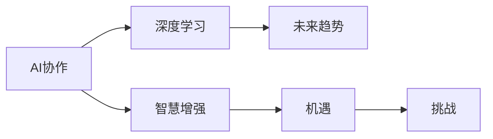

                 

# 人类-AI协作：增强人类智慧与AI能力的融合发展趋势预测分析机遇

> 关键词：AI协作,智慧增强,深度学习,人工智能,未来趋势

## 1. 背景介绍

### 1.1 问题由来

在当今数字化、信息化时代，人工智能（AI）技术正逐渐渗透到各行各业，成为推动社会进步的重要力量。然而，AI在带来便利的同时，也引发了一系列道德、伦理和社会问题。例如，自动化可能导致大量工作岗位消失，AI的决策过程缺乏透明度和可解释性，以及在公共领域中可能出现的算法偏见等问题。这些挑战呼唤人类与AI的深度协作，以实现智慧的增强与和谐发展。

### 1.2 问题核心关键点

1. **AI协作**：指的是人类与AI技术的紧密合作，通过共同解决问题，实现更高效率和更优决策。
2. **智慧增强**：通过AI技术提升人类智慧，包括决策能力、问题解决能力和创造力。
3. **深度学习**：一种基于神经网络的机器学习方法，可以模拟人脑处理复杂任务的能力。
4. **未来趋势**：AI技术发展的方向和可能的社会影响。
5. **机遇与挑战**：AI协作在实际应用中的潜力及其面临的难题。

这些核心概念构成了本文的核心框架，旨在深入探讨人类与AI协作的发展趋势，并分析其中的机遇与挑战。

## 2. 核心概念与联系

### 2.1 核心概念概述

为了更好地理解人类-AI协作的机制和应用，本节将介绍几个关键概念：

- **AI协作**：涉及技术、人机交互、决策过程等多个方面，旨在实现人类与AI的互动和融合。
- **智慧增强**：通过AI技术帮助人类进行更高效的思考和决策，提升认知水平和创新能力。
- **深度学习**：基于神经网络的机器学习技术，已广泛应用于图像识别、语音识别、自然语言处理等领域。
- **未来趋势**：AI技术的未来发展方向及其对社会的影响。
- **机遇与挑战**：AI协作在实现过程中可能带来的积极和消极影响。

这些概念之间相互关联，共同构成了一个关于人类-AI协作的全面框架。

### 2.2 核心概念原理和架构的 Mermaid 流程图(Mermaid 流程节点中不要有括号、逗号等特殊字符)



该流程图展示了核心概念之间的逻辑关系：AI协作通过深度学习技术提升智慧，智慧增强带来了未来的发展机遇，同时也面临一定的挑战。

## 3. 核心算法原理 & 具体操作步骤

### 3.1 算法原理概述

人类-AI协作的核心算法原理主要基于深度学习和强化学习，通过构建复杂的神经网络模型，使AI能够模拟人类的认知和决策过程。在协作中，AI通过学习大量的数据和经验，逐渐掌握人类的思维模式和行为习惯，从而与人类共同完成任务。

### 3.2 算法步骤详解

1. **数据收集与预处理**：收集与任务相关的数据，并对数据进行清洗、归一化等预处理，以提高模型的训练效果。
2. **模型构建与训练**：选择合适的深度学习模型架构，如卷积神经网络（CNN）、循环神经网络（RNN）、长短期记忆网络（LSTM）或变换器（Transformer），并使用大规模标注数据进行训练。
3. **模型评估与优化**：通过交叉验证等方法评估模型性能，调整模型参数以提高准确率和泛化能力。
4. **协作交互与反馈**：将训练好的模型应用于实际任务中，通过人类反馈调整模型，使其更好地适应人类的需求和行为。

### 3.3 算法优缺点

**优点**：
- **高效性**：深度学习模型能够在处理复杂任务时表现出高效性。
- **适应性**：通过持续学习，AI可以适应不同场景和任务，提高决策的准确性和及时性。
- **创新性**：深度学习模型能够挖掘数据中的潜在模式，帮助人类发现新的知识和解决方案。

**缺点**：
- **数据依赖**：深度学习模型需要大量标注数据进行训练，数据不足可能导致性能下降。
- **解释性不足**：深度学习模型通常被视为"黑盒"，其决策过程难以解释，缺乏透明性。
- **资源消耗大**：深度学习模型参数众多，计算复杂度高，对计算资源要求较高。

### 3.4 算法应用领域

人类-AI协作的算法已经在多个领域取得了显著成果，包括但不限于：

1. **医疗**：通过AI辅助诊断、治疗方案推荐等方式，提高医疗服务的精准性和效率。
2. **金融**：利用AI进行风险评估、欺诈检测、投资分析等，提升金融决策的科学性和可靠性。
3. **教育**：通过AI个性化教学、智能辅导等方式，提供更高效、更有针对性的教育服务。
4. **制造**：通过AI进行质量检测、生产调度和供应链管理，优化制造业的运营效率。
5. **交通**：利用AI进行智能交通管理、自动驾驶、路径规划等，提升交通系统的安全和效率。
6. **娱乐**：通过AI生成内容、推荐系统等方式，提升用户体验和娱乐效果。

## 4. 数学模型和公式 & 详细讲解 & 举例说明（备注：数学公式请使用latex格式，latex嵌入文中独立段落使用 $$，段落内使用 $)
### 4.1 数学模型构建

在深度学习中，常用的数学模型包括前馈神经网络（Feedforward Neural Network, FNN）、卷积神经网络（Convolutional Neural Network, CNN）、循环神经网络（Recurrent Neural Network, RNN）和长短期记忆网络（Long Short-Term Memory, LSTM）。以FNN为例，其基本结构如下：

$$
f_{W,b}(x)=f(Wx+b)=\sigma(\sum_{i=1}^nW_ix_i+b)
$$

其中，$W$ 和 $b$ 是模型的权重和偏置项，$x$ 是输入，$f$ 是激活函数。

### 4.2 公式推导过程

以CNN为例，其核心公式包括卷积运算、池化运算和全连接层等。卷积运算公式如下：

$$
C(x)=\sigma\left(\sum_{i=1}^M\sum_{j=1}^NW_{ij} * x_{i,j}+b\right)
$$

其中，$W$ 是卷积核，$x$ 是输入数据，$*$ 表示卷积运算，$\sigma$ 是激活函数。

### 4.3 案例分析与讲解

以图像识别任务为例，CNN能够通过卷积层和池化层提取图像的特征，再通过全连接层进行分类。在训练过程中，通过反向传播算法更新模型参数，使得模型在测试集上取得最优性能。

## 5. 项目实践：代码实例和详细解释说明

### 5.1 开发环境搭建

在进行项目实践前，需要先搭建好开发环境。以下是使用Python和TensorFlow进行AI协作的实践环境搭建步骤：

1. 安装Python和TensorFlow：
   ```
   pip install tensorflow
   ```

2. 安装所需的深度学习库：
   ```
   pip install numpy scipy scikit-learn matplotlib
   ```

3. 配置GPU环境：
   ```
   pip install tensorflow-gpu
   ```

### 5.2 源代码详细实现

以下是一个简单的图像分类项目，使用CNN模型进行图像识别。

```python
import tensorflow as tf
from tensorflow.keras import layers

# 加载数据集
(x_train, y_train), (x_test, y_test) = tf.keras.datasets.mnist.load_data()

# 数据预处理
x_train = x_train / 255.0
x_test = x_test / 255.0

# 定义模型
model = tf.keras.Sequential([
    layers.Conv2D(32, (3, 3), activation='relu', input_shape=(28, 28, 1)),
    layers.MaxPooling2D((2, 2)),
    layers.Flatten(),
    layers.Dense(10, activation='softmax')
])

# 编译模型
model.compile(optimizer='adam',
              loss='sparse_categorical_crossentropy',
              metrics=['accuracy'])

# 训练模型
model.fit(x_train, y_train, epochs=5, validation_data=(x_test, y_test))
```

### 5.3 代码解读与分析

- `Sequential` 表示使用序列模型，可以按照顺序添加多个层。
- `Conv2D` 和 `MaxPooling2D` 分别表示卷积层和池化层，用于提取图像特征。
- `Flatten` 表示将多维数据展平为一维数据，方便进行全连接层处理。
- `Dense` 表示全连接层，用于进行分类。

## 6. 实际应用场景

### 6.1 医疗诊断

在医疗领域，AI协作可以帮助医生进行疾病诊断、治疗方案推荐和风险评估等。例如，通过深度学习模型分析医学影像，可以快速识别出病变区域，辅助医生进行精准诊断。

### 6.2 金融风险管理

金融行业可以利用AI协作进行风险评估和欺诈检测。通过分析历史交易数据，深度学习模型可以识别出异常交易模式，及时预警潜在的金融风险。

### 6.3 智能教育

AI协作在教育领域可以提供个性化教学和智能辅导。通过深度学习模型分析学生的学习数据，可以为每个学生定制个性化的学习计划，提高学习效果。

### 6.4 未来应用展望

未来，人类-AI协作将在更多领域得到广泛应用，带来更深刻的变化和机遇。例如：

1. **智能城市**：通过AI协作优化城市管理，提升公共服务的效率和质量。
2. **智能制造**：利用AI协作优化生产流程，提高制造业的自动化和智能化水平。
3. **智能交通**：通过AI协作实现自动驾驶和智能交通管理，提升交通安全和效率。
4. **智能医疗**：利用AI协作进行精准医疗和个性化治疗，提高医疗服务的质量和可及性。
5. **智能金融**：通过AI协作优化金融决策，提高投资和风险管理的精准度。

## 7. 工具和资源推荐

### 7.1 学习资源推荐

1. **深度学习课程**：斯坦福大学的CS231n《卷积神经网络》课程，介绍了CNN的基本原理和应用。
2. **AI协作书籍**：《深度学习与人工智能》、《AI协作之道》等书籍，深入探讨AI协作的原理和应用。
3. **在线平台**：Coursera、Udacity等在线平台，提供丰富的AI课程和实践项目。

### 7.2 开发工具推荐

1. **TensorFlow**：谷歌开源的深度学习框架，适合进行大规模模型训练和部署。
2. **PyTorch**：Facebook开源的深度学习框架，以其灵活性和易用性著称。
3. **Jupyter Notebook**：一个开源的Web应用，支持编写、执行和分享代码。

### 7.3 相关论文推荐

1. **深度学习**：Geoffrey Hinton, Yoshua Bengio, and Geoffrey Hinton. "Deep learning." Nature, 521(7553):436-444, 2015.
2. **AI协作**：Yoshua Bengio, Ian Goodfellow, and Aaron Courville. "Deep Learning." MIT Press, 2019.
3. **智慧增强**：Ian Goodfellow. "Generative Adversarial Networks." Advances in Neural Information Processing Systems, 2014.

## 8. 总结：未来发展趋势与挑战

### 8.1 研究成果总结

本文系统介绍了人类-AI协作的原理和操作步骤，并通过具体案例展示了其在医疗、金融、教育等领域的实际应用。通过对深度学习模型的构建和训练，能够实现高效、智能的协作效果。

### 8.2 未来发展趋势

未来，人类-AI协作将向以下几个方向发展：

1. **更高效**：通过更先进的算法和计算资源，使得AI协作在处理复杂任务时更加高效。
2. **更智能**：通过深度学习和大数据分析，AI协作能够更好地模拟人类的思维和行为。
3. **更透明**：通过提高算法的透明性和可解释性，使得AI协作的决策过程更加可信和可靠。
4. **更普及**：通过技术普及和人才培养，使得AI协作在各行各业得到更广泛的应用。

### 8.3 面临的挑战

尽管AI协作带来了许多机遇，但仍面临一些挑战：

1. **数据隐私**：在数据驱动的AI协作中，如何保护个人隐私和数据安全是一个重要问题。
2. **伦理道德**：AI协作中的决策透明性和责任归属需要得到明确规定。
3. **资源消耗**：AI协作的高计算需求可能带来巨大的资源消耗和成本。
4. **技术壁垒**：AI协作需要高水平的技术积累和专业知识，推广应用难度较大。
5. **社会接受度**：公众对AI协作的信任度和接受度需要进一步提高。

### 8.4 研究展望

未来，需要在以下几个方面进行深入研究：

1. **隐私保护**：开发更高效的隐私保护算法，确保数据安全和隐私。
2. **透明性**：提升AI协作算法的透明性和可解释性，提高信任度。
3. **资源优化**：通过模型压缩和分布式计算等方法，优化AI协作的资源消耗。
4. **社会伦理**：制定AI协作的伦理规范和标准，确保其符合社会价值观。
5. **普适性**：推动AI协作技术在不同行业的普及和应用。

## 9. 附录：常见问题与解答

**Q1: AI协作的实际应用有哪些？**

A: AI协作在医疗、金融、教育、制造、交通等多个领域有广泛应用，如疾病诊断、风险评估、个性化教学、自动驾驶等。

**Q2: AI协作的算法原理是什么？**

A: AI协作的算法原理主要包括深度学习和强化学习，通过构建复杂的神经网络模型，使AI能够模拟人类的认知和决策过程。

**Q3: 如何提高AI协作的透明性和可解释性？**

A: 可以通过可视化工具和模型压缩等方法，提高AI协作的透明性和可解释性。

**Q4: 人类-AI协作的未来趋势有哪些？**

A: 未来AI协作将向更高效、智能、透明、普适的方向发展，带来更多机遇和挑战。

**Q5: AI协作在医疗领域的应用前景如何？**

A: 在医疗领域，AI协作可以辅助医生进行疾病诊断、治疗方案推荐和风险评估，提高医疗服务的精准性和效率。

---

作者：禅与计算机程序设计艺术 / Zen and the Art of Computer Programming

