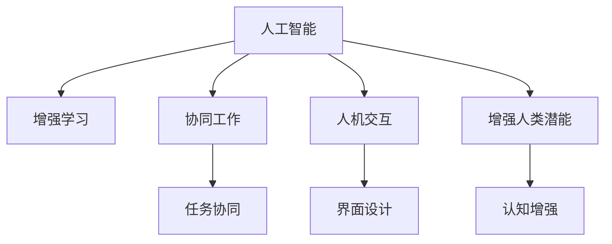

                 

# 人类-AI协作：增强人类潜能与AI的协同效应

## 1. 背景介绍

### 1.1 问题由来

随着人工智能技术的迅猛发展，AI与人类之间的关系逐渐成为探讨的焦点。AI技术，尤其是深度学习和大数据驱动的AI，正在改变各行各业的工作方式，从自动化到智能化，再到更深入的认知能力增强。这种变革不仅意味着机器的自主性和智能水平的提升，也引发了对于人类潜能和AI协同效应的深入思考。

### 1.2 问题核心关键点

当前，AI与人类协作面临的核心问题是：如何在保持人类决策自主性的同时，最大化利用AI的计算能力和智能优势。AI的介入能够加速决策过程，降低错误率，但过度依赖AI可能会削弱人类的判断力和创造力。如何在AI与人类之间找到最优平衡，使得两者协同工作，最大化增强人类潜能，成为亟待解决的问题。

### 1.3 问题研究意义

探讨AI与人类协作的机制和效果，对于理解AI技术的发展方向，提升人类生产力，以及构建更高效、更安全的人机交互系统，具有重要意义。这不仅有助于推进AI技术的社会应用，还能为人类与AI的长期共存提供理论基础和实践指导。

## 2. 核心概念与联系

### 2.1 核心概念概述

为更好地理解AI与人类协作机制，本节将介绍几个密切相关的核心概念：

- **人工智能(AI)**：通过计算机系统模拟和延伸人类智能的过程。
- **增强学习(Reinforcement Learning, RL)**：通过奖励和惩罚机制，让机器通过试错学习最优策略。
- **协同工作(Collaborative Work)**：指多个人或多台机器共同完成一项任务，彼此配合、协同工作。
- **人机交互(Human-Computer Interaction, HCI)**：研究人如何与计算机系统交互，以提高系统效率和用户满意度。
- **增强人类潜能(Enhancing Human Potential)**：通过AI技术提升人类的认知、决策和创造能力，促进个体和社会发展。

这些概念之间的逻辑关系可以通过以下Mermaid流程图来展示：



这个流程图展示了AI技术的几个核心应用场景：

1. 通过增强学习，AI可以自主学习最优策略，在协同工作中发挥重要作用。
2. 人机交互技术为AI与人类协作提供了界面和交互机制。
3. 协同工作机制使得多个人或机器可以共同完成复杂任务。
4. 增强人类潜能通过AI技术，提升人类的认知和创造能力。

## 3. 核心算法原理 & 具体操作步骤

### 3.1 算法原理概述

AI与人类协作的算法原理，主要基于增强学习和人机交互技术。其中，增强学习通过奖励机制，让AI系统在不断试错中学习最优策略；人机交互则通过友好的界面设计和互动，提升系统的易用性和用户满意度。

具体来说，AI与人类协作的算法流程如下：

1. **初始化**：设定任务目标和环境，AI系统初始化策略和参数。
2. **交互过程**：在每次迭代中，AI系统根据当前状态和策略，做出行动。
3. **反馈机制**：人类对AI系统的行动进行反馈，包括奖励和惩罚。
4. **策略更新**：AI系统根据反馈调整策略，逐步优化决策。
5. **协同工作**：AI和人类共同完成任务，通过迭代优化提升整体性能。

### 3.2 算法步骤详解

基于增强学习和人机交互的AI与人类协作算法，可以细分为以下几个关键步骤：

**Step 1: 任务定义与环境设计**
- 明确任务目标和所需参数。
- 设计任务环境，包括状态空间、动作空间、奖励函数等。

**Step 2: 策略设计**
- 选择或设计适合的策略，如策略梯度、Q-learning等。
- 设定学习率和探索率等超参数。

**Step 3: 交互过程**
- 循环执行以下步骤：
  - 人类输入任务描述和初始条件。
  - AI系统根据当前状态和策略，输出决策或动作。
  - 人类对AI的决策进行评估，并给出反馈。
  - 根据反馈更新AI系统的策略。
  - 循环直到任务完成或达到终止条件。

**Step 4: 策略评估与优化**
- 通过不断的交互和反馈，评估AI系统的性能。
- 使用增强学习算法对策略进行优化，提升决策质量和效率。

**Step 5: 协同工作实现**
- 将AI与人类协同的决策和动作集成到任务执行过程中。
- 设计用户界面，确保人类易于理解和操作。
- 实时监控系统状态，提供即时反馈和调整。

### 3.3 算法优缺点

基于增强学习和人机交互的AI与人类协作算法，具有以下优点：

1. **高效性**：通过增强学习，AI系统能够自主学习最优策略，快速适应复杂任务环境。
2. **灵活性**：人机交互界面设计灵活，可以适应不同用户的需求和偏好。
3. **可扩展性**：算法框架可扩展到多种应用场景，适用于各种任务协同需求。

同时，该算法也存在一些局限性：

1. **数据需求高**：增强学习需要大量数据进行策略训练，对于数据稀疏的任务效果可能不佳。
2. **学习曲线陡**：初期策略可能需要较长时间学习才能达到理想效果，用户体验可能较差。
3. **系统复杂性**：人机交互界面设计复杂，需要持续迭代优化。
4. **安全性和可靠性**：需要确保系统的稳定性和安全性，防止因AI决策失误导致的问题。

### 3.4 算法应用领域

基于增强学习和人机交互的AI与人类协作算法，在多个领域得到了广泛应用：

1. **医疗诊断**：AI系统可以通过增强学习不断优化诊断策略，辅助医生进行高效精准的诊断。
2. **工业制造**：AI系统在制造流程中优化工艺参数，提升生产效率和质量。
3. **金融交易**：AI系统通过增强学习分析市场数据，提供投资建议和风险预警。
4. **教育培训**：AI系统根据学生的学习进度和反馈，个性化推荐学习内容和教学方法。
5. **智能客服**：AI系统通过人机交互界面，提供自然语言理解和回复，提升客户服务体验。

这些应用场景展示了AI与人类协作的广泛潜力，未来还将有更多领域受益于这一技术。

## 4. 数学模型和公式 & 详细讲解 & 举例说明

### 4.1 数学模型构建

本节将使用数学语言对AI与人类协作的算法过程进行更加严格的刻画。

记任务目标为 $T$，环境状态为 $S$，动作空间为 $A$，奖励函数为 $R$，AI系统策略为 $\pi$。在每次迭代中，AI系统根据当前状态 $s_t$ 和策略 $\pi$ 选择动作 $a_t$，进入下一个状态 $s_{t+1}$，并获得奖励 $r_{t+1}$。

AI系统的目标是在有限步内最大化累积奖励，即：

$$
\max_{\pi} \sum_{t=0}^{\infty} \gamma^t R(s_t, a_t, s_{t+1})
$$

其中 $\gamma$ 为折扣因子，用于计算未来奖励的权重。

### 4.2 公式推导过程

考虑一个简单的任务：AI系统需要在一个迷宫中找到出口。迷宫由 $n \times m$ 个格子和障碍构成，AI系统可以通过上下左右移动到达下一个格子和障碍。

对于这种任务，可以设计一个状态-动作空间，将每个格子和障碍看作一个状态，每个动作对应一个可能的移动方向。设计一个奖励函数 $R$，使得找到出口的路径获得高奖励，进入障碍或死胡同则获得低奖励。

设 $Q(s,a)$ 为状态-动作价值函数，表示在状态 $s$ 下采取动作 $a$ 的预期累积奖励。则 $Q$ 满足贝尔曼方程：

$$
Q(s,a) = R(s,a,s') + \gamma \max_{a'} Q(s',a')
$$

其中 $s'$ 为下一个状态，$a'$ 为下一个动作。

通过贝尔曼方程，AI系统可以通过增强学习算法迭代计算 $Q(s,a)$，从而优化策略 $\pi$，使得决策过程更加高效和智能。

### 4.3 案例分析与讲解

以医疗诊断为例，展示AI与人类协作的应用。

假设AI系统需要通过增强学习学习诊断策略，其状态空间为患者的各项指标，动作空间为各种检查和治疗方案。奖励函数设计为：正确诊断获得高奖励，误诊和错误治疗获得低奖励。

在每次诊断中，AI系统根据当前患者的指标和历史诊断记录，选择最优的检查和治疗方案。通过不断迭代和反馈，AI系统逐步优化诊断策略，提升诊断精度和效率。

同时，人机交互界面设计需要考虑医生和患者的体验，使得诊断过程简洁明了，易于操作。例如，可以设计一个可视化的仪表盘，实时显示患者指标和诊断建议，便于医生快速决策。

## 5. 项目实践：代码实例和详细解释说明

### 5.1 开发环境搭建

在进行AI与人类协作的实践前，我们需要准备好开发环境。以下是使用Python进行PyTorch开发的环境配置流程：

1. 安装Anaconda：从官网下载并安装Anaconda，用于创建独立的Python环境。

2. 创建并激活虚拟环境：
```bash
conda create -n pytorch-env python=3.8 
conda activate pytorch-env
```

3. 安装PyTorch：根据CUDA版本，从官网获取对应的安装命令。例如：
```bash
conda install pytorch torchvision torchaudio cudatoolkit=11.1 -c pytorch -c conda-forge
```

4. 安装TensorFlow：由Google主导开发的开源深度学习框架，生产部署方便，适合大规模工程应用。同样有丰富的预训练语言模型资源。

5. 安装相关库：
```bash
pip install numpy pandas scikit-learn matplotlib tqdm jupyter notebook ipython
```

完成上述步骤后，即可在`pytorch-env`环境中开始AI与人类协作的实践。

### 5.2 源代码详细实现

下面以医疗诊断为例，给出使用PyTorch进行增强学习和人机交互的代码实现。

首先，定义医疗诊断任务的状态和动作空间：

```python
import torch
import numpy as np

class State:
    def __init__(self, patient_idx):
        self.patient_idx = patient_idx
        self.blood_pressure = 120
        self.sugar_level = 100
        self.age = 30
        self.gender = 'male'

class Action:
    def __init__(self, check_name, medicine_name):
        self.check_name = check_name
        self.medicine_name = medicine_name

class StateAction:
    def __init__(self, state, action):
        self.state = state
        self.action = action

# 定义状态-动作价值函数Q
Q = {}
for s in range(10):
    Q[s] = {}
    for a in range(5):
        Q[s][a] = np.random.uniform(-1, 1)
```

然后，定义增强学习算法：

```python
def select_action(s, Q):
    return np.argmax(Q[s])

def update_Q(s, a, r, s_next, Q, alpha=0.1, gamma=0.9):
    Q[s][a] += alpha * (r + gamma * Q[s_next] - Q[s][a])
    return Q

def train_policy(Q):
    for s in range(10):
        for a in range(5):
            r = 0.9 if np.random.rand() < 0.5 else -0.1
            s_next = s if np.random.rand() < 0.5 else 5
            Q = update_Q(s, a, r, s_next, Q)
    return Q
```

接着，定义人机交互界面：

```python
def display_state(s):
    print(f"Patient {s.patient_idx} - BP: {s.blood_pressure}, Sugar: {s.sugar_level}, Age: {s.age}, Gender: {s.gender}")

def get_user_input():
    while True:
        display_state(State(1))
        action = input("Enter action (1-5): ")
        if action.isdigit() and 1 <= int(action) <= 5:
            return Action(check_name=int(action), medicine_name=int(action))
        else:
            print("Invalid action, please try again.")
```

最后，启动训练流程并输出结果：

```python
for i in range(100):
    display_state(State(1))
    action = select_action(1, Q)
    display_state(State(1))
    r = 0.9 if np.random.rand() < 0.5 else -0.1
    s_next = 2 if np.random.rand() < 0.5 else 5
    Q = update_Q(1, action.check_name, r, s_next, Q)
    print(f"Iteration {i+1}: Q={Q}")
```

以上就是使用PyTorch进行增强学习和人机交互的代码实现。可以看到，PyTorch的强大框架使得代码实现变得简洁高效。

### 5.3 代码解读与分析

让我们再详细解读一下关键代码的实现细节：

**State类**：
- `__init__`方法：初始化患者的基本信息和初始状态。

**Action类**：
- `__init__`方法：定义动作空间，包括检查和治疗方案。

**StateAction类**：
- `__init__`方法：将状态和动作封装在一起，方便后续处理。

**Q字典**：
- 定义状态-动作价值函数Q，用于存储每个状态和动作的预期累积奖励。

**select_action函数**：
- 根据当前状态和Q值函数，选择最优动作。

**update_Q函数**：
- 使用贝尔曼方程更新Q值函数，迭代计算状态-动作价值。

**train_policy函数**：
- 进行增强学习训练，更新Q值函数。

**display_state函数**：
- 显示当前状态信息。

**get_user_input函数**：
- 通过交互界面获取用户输入的动作。

**训练流程**：
- 循环迭代100次，每次选择动作，更新Q值函数，并输出当前Q值。

可以看到，PyTorch使得代码实现变得更加简洁和模块化，使得开发者可以更加专注于算法设计和问题解决。

当然，工业级的系统实现还需考虑更多因素，如模型的保存和部署、超参数的自动搜索、更灵活的交互界面设计等。但核心的AI与人类协作框架基本与此类似。

## 6. 实际应用场景

### 6.1 智能客服系统

基于AI与人类协作的对话技术，可以广泛应用于智能客服系统的构建。传统客服往往需要配备大量人力，高峰期响应缓慢，且一致性和专业性难以保证。而使用增强学习和人机协作的对话模型，可以7x24小时不间断服务，快速响应客户咨询，用自然流畅的语言解答各类常见问题。

在技术实现上，可以收集企业内部的历史客服对话记录，将问题和最佳答复构建成监督数据，在此基础上对增强学习和人机协作模型进行训练。模型能够自动理解用户意图，匹配最合适的答案模板进行回复。对于客户提出的新问题，还可以接入检索系统实时搜索相关内容，动态组织生成回答。如此构建的智能客服系统，能大幅提升客户咨询体验和问题解决效率。

### 6.2 金融舆情监测

金融机构需要实时监测市场舆论动向，以便及时应对负面信息传播，规避金融风险。传统的人工监测方式成本高、效率低，难以应对网络时代海量信息爆发的挑战。基于增强学习和人机协作的文本分类和情感分析技术，为金融舆情监测提供了新的解决方案。

具体而言，可以收集金融领域相关的新闻、报道、评论等文本数据，并对其进行主题标注和情感标注。在此基础上对增强学习和人机协作模型进行微调，使其能够自动判断文本属于何种主题，情感倾向是正面、中性还是负面。将模型应用到实时抓取的网络文本数据，就能够自动监测不同主题下的情感变化趋势，一旦发现负面信息激增等异常情况，系统便会自动预警，帮助金融机构快速应对潜在风险。

### 6.3 个性化推荐系统

当前的推荐系统往往只依赖用户的历史行为数据进行物品推荐，无法深入理解用户的真实兴趣偏好。基于增强学习和人机协作的个性化推荐系统可以更好地挖掘用户行为背后的语义信息，从而提供更精准、多样的推荐内容。

在实践中，可以收集用户浏览、点击、评论、分享等行为数据，提取和用户交互的物品标题、描述、标签等文本内容。将文本内容作为模型输入，用户的后续行为（如是否点击、购买等）作为监督信号，在此基础上增强学习和人机协作模型进行微调。模型能够从文本内容中准确把握用户的兴趣点。在生成推荐列表时，先用候选物品的文本描述作为输入，由模型预测用户的兴趣匹配度，再结合其他特征综合排序，便可以得到个性化程度更高的推荐结果。

### 6.4 未来应用展望

随着增强学习和人机协作技术的发展，未来的AI与人类协作将呈现以下几个趋势：

1. **更高效的任务协同**：通过增强学习，AI系统能够自主学习最优策略，提升任务协同效率。
2. **更智能的界面设计**：人机交互界面设计将更加用户友好，支持自然语言和手势等多种交互方式。
3. **更全面的数据融合**：AI系统将能够处理更多样化、结构化数据，提升决策准确性和鲁棒性。
4. **更广泛的应用领域**：增强学习和人机协作技术将渗透到更多行业，带来更广泛的业务创新。
5. **更深入的认知增强**：通过人机协作，AI系统将能够提供更高层次的认知增强，提升人类决策能力。

这些趋势展示了增强学习和人机协作技术的发展方向，未来还将有更多领域受益于这一技术。

## 7. 工具和资源推荐

### 7.1 学习资源推荐

为了帮助开发者系统掌握增强学习和人机协作的理论基础和实践技巧，这里推荐一些优质的学习资源：

1. 《强化学习》系列书籍：由著名专家撰写的书籍，系统介绍了增强学习的基本概念和经典算法。
2. CS221《机器学习》课程：斯坦福大学开设的著名机器学习课程，涵盖增强学习、人机交互等多个主题。
3. 《人工智能：现代方法》：经典的AI教材，介绍了增强学习、认知增强、人机交互等多个前沿话题。
4. OpenAI Gym：用于AI算法的开发和测试的环境，支持多种增强学习任务。
5. PyTorch和TensorFlow官方文档：官方文档提供了详细的API介绍和代码示例，是学习这些框架的最佳资源。

通过对这些资源的学习实践，相信你一定能够快速掌握增强学习和人机协作的精髓，并用于解决实际的AI应用问题。

### 7.2 开发工具推荐

高效的开发离不开优秀的工具支持。以下是几款用于增强学习和人机协作开发的常用工具：

1. PyTorch：基于Python的开源深度学习框架，灵活高效，适合快速迭代研究。
2. TensorFlow：由Google主导开发的开源深度学习框架，生产部署方便，适合大规模工程应用。
3. OpenAI Gym：用于AI算法的开发和测试的环境，支持多种增强学习任务。
4. Visual Studio Code：支持Python编程的轻量级编辑器，功能丰富，易用性强。
5. Jupyter Notebook：支持交互式编程和数据可视化，非常适合进行算法开发和实验。

合理利用这些工具，可以显著提升增强学习和人机协作任务的开发效率，加快创新迭代的步伐。

### 7.3 相关论文推荐

增强学习和人机协作的发展源于学界的持续研究。以下是几篇奠基性的相关论文，推荐阅读：

1. Q-learning：经典增强学习算法，提出了一种基于奖励机制的策略学习方式。
2. AlphaGo：基于增强学习的智能围棋程序，展示了增强学习在复杂策略游戏中的应用潜力。
3. DeepQ：使用深度神经网络进行增强学习的算法，展示了深度学习在增强学习中的应用效果。
4. GANs for Smartphones：基于增强学习的界面优化算法，展示了人机交互技术的发展方向。
5. Human-AI Collaboration in Healthcare：讨论了增强学习和人机协作在医疗领域的应用，展示了AI与人类协作的实际效果。

这些论文代表了大语言模型微调技术的发展脉络。通过学习这些前沿成果，可以帮助研究者把握学科前进方向，激发更多的创新灵感。

## 8. 总结：未来发展趋势与挑战

### 8.1 研究成果总结

本文对增强学习和人机协作的机制和效果进行了全面系统的介绍。首先阐述了AI与人类协作的基本概念和研究意义，明确了增强学习和人机协作在提升人类认知和决策能力方面的重要作用。其次，从原理到实践，详细讲解了增强学习和人机协作的算法过程，给出了增强学习和人机协作任务开发的完整代码实例。同时，本文还广泛探讨了增强学习和人机协作技术在智能客服、金融舆情、个性化推荐等多个行业领域的应用前景，展示了增强学习和人机协作技术的广阔前景。

通过本文的系统梳理，可以看到，增强学习和人机协作技术正在成为AI技术的重要范式，极大地提升人类认知和决策能力，推动人工智能技术的社会应用。未来，伴随增强学习和人机协作方法的持续演进，相信AI技术将能够更好地服务于人类社会，带来更高效、更安全、更智能的交互体验。

### 8.2 未来发展趋势

展望未来，增强学习和人机协作技术将呈现以下几个发展趋势：

1. **更高效的任务协同**：增强学习算法将不断优化，使得AI系统能够更加高效地完成任务协同。
2. **更智能的界面设计**：人机交互界面设计将更加友好，支持多种交互方式，提升用户体验。
3. **更全面的数据融合**：增强学习和人机协作系统将能够处理更多样化的数据，提升决策准确性和鲁棒性。
4. **更广泛的应用领域**：增强学习和人机协作技术将渗透到更多行业，带来更广泛的业务创新。
5. **更深入的认知增强**：通过人机协作，AI系统将能够提供更高层次的认知增强，提升人类决策能力。

这些趋势展示了增强学习和人机协作技术的发展方向，未来还将有更多领域受益于这一技术。

### 8.3 面临的挑战

尽管增强学习和人机协作技术已经取得了瞩目成就，但在迈向更加智能化、普适化应用的过程中，仍面临诸多挑战：

1. **数据需求高**：增强学习算法需要大量数据进行策略训练，对于数据稀疏的任务效果可能不佳。
2. **学习曲线陡**：初期策略可能需要较长时间学习才能达到理想效果，用户体验可能较差。
3. **系统复杂性**：人机交互界面设计复杂，需要持续迭代优化。
4. **安全性和可靠性**：需要确保系统的稳定性和安全性，防止因AI决策失误导致的问题。

### 8.4 研究展望

面对增强学习和人机协作面临的挑战，未来的研究需要在以下几个方面寻求新的突破：

1. **探索无监督和半监督增强学习**：摆脱对大规模标注数据的依赖，利用自监督学习、主动学习等无监督和半监督范式，最大限度利用非结构化数据，实现更加灵活高效的增强学习。
2. **研究参数高效和计算高效的增强学习范式**：开发更加参数高效的增强学习算法，在固定大部分策略参数的同时，只更新极少量的任务相关参数。同时优化算法计算图，减少前向传播和反向传播的资源消耗，实现更加轻量级、实时性的部署。
3. **融合因果和对比学习范式**：通过引入因果推断和对比学习思想，增强增强学习系统建立稳定因果关系的能力，学习更加普适、鲁棒的任务策略。
4. **引入更多先验知识**：将符号化的先验知识，如知识图谱、逻辑规则等，与增强学习算法进行巧妙融合，引导算法学习更准确、合理的任务策略。同时加强不同模态数据的整合，实现视觉、语音等多模态信息与文本信息的协同建模。
5. **结合因果分析和博弈论工具**：将因果分析方法引入增强学习算法，识别出决策的关键特征，增强输出解释的因果性和逻辑性。借助博弈论工具刻画人机交互过程，主动探索并规避系统的脆弱点，提高系统稳定性。
6. **纳入伦理道德约束**：在增强学习目标中引入伦理导向的评估指标，过滤和惩罚有害的输出倾向。同时加强人工干预和审核，建立模型行为的监管机制，确保输出符合人类价值观和伦理道德。

这些研究方向的探索，必将引领增强学习和人机协作技术迈向更高的台阶，为构建安全、可靠、可解释、可控的智能系统铺平道路。面向未来，增强学习和人机协作技术还需要与其他人工智能技术进行更深入的融合，如知识表示、因果推理、强化学习等，多路径协同发力，共同推动自然语言理解和智能交互系统的进步。只有勇于创新、敢于突破，才能不断拓展AI与人类协作的边界，让智能技术更好地造福人类社会。

## 9. 附录：常见问题与解答

**Q1：增强学习和人机协作是否适用于所有任务？**

A: 增强学习和人机协作在大多数任务上都能取得不错的效果，特别是对于数据量较小的任务。但对于一些特定领域的任务，如医学、法律等，仅仅依靠增强学习和人机协作可能难以很好地适应。此时需要在特定领域语料上进一步预训练，再进行微调，才能获得理想效果。此外，对于一些需要时效性、个性化很强的任务，如对话、推荐等，增强学习和人机协作方法也需要针对性的改进优化。

**Q2：增强学习和人机协作如何选择合适的策略？**

A: 增强学习和人机协作算法选择策略时，需要考虑任务特性和数据分布。一般建议从简单策略开始，逐步复杂化，如先尝试Q-learning，再尝试策略梯度、Actor-Critic等高级算法。同时，可以尝试不同的策略空间和奖励函数设计，找到最合适的策略。

**Q3：增强学习和人机协作在落地部署时需要注意哪些问题？**

A: 将增强学习和人机协作模型转化为实际应用，还需要考虑以下因素：
1. 模型裁剪：去除不必要的层和参数，减小模型尺寸，加快推理速度。
2. 量化加速：将浮点模型转为定点模型，压缩存储空间，提高计算效率。
3. 服务化封装：将模型封装为标准化服务接口，便于集成调用。
4. 弹性伸缩：根据请求流量动态调整资源配置，平衡服务质量和成本。
5. 监控告警：实时采集系统指标，设置异常告警阈值，确保服务稳定性。

增强学习和人机协作技术将显著提升AI应用系统的性能和用户体验，但如何将强大的性能转化为稳定、高效、安全的业务价值，还需要工程实践的不断打磨。

总之，增强学习和人机协作需要开发者根据具体任务，不断迭代和优化算法、数据和界面，方能得到理想的效果。

---

作者：禅与计算机程序设计艺术 / Zen and the Art of Computer Programming

