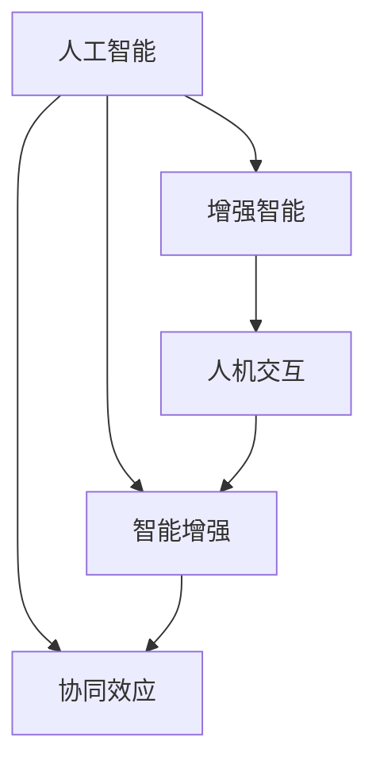

                 

# 人类-AI协作：增强人类潜能与AI能力的协同效应

> 关键词：人工智能,协作,增强智能,协同效应,人机交互,智能增强,技术发展,未来展望

## 1. 背景介绍

随着人工智能技术的迅猛发展，AI与人类之间的协作日益紧密。从早期的专家系统到现代的深度学习模型，AI技术在处理复杂任务、挖掘大数据、提升决策效率等方面表现出色，但同时也存在数据依赖、黑箱决策、泛化能力不足等问题。而人类拥有丰富的常识、经验、情感和创造力，这些都是机器难以完全替代的。因此，如何将AI技术与人类智慧进行有效结合，充分发挥双方的优势，成为当前研究的前沿话题。

### 1.1 研究背景与意义

在过去的几十年里，人工智能技术在语音识别、图像识别、自然语言处理等领域的进步，已经大大超越了人类的想象。然而，这种技术进步并没有解决所有问题，AI仍然存在许多局限性，如对复杂任务的推理能力不足、决策过程缺乏透明度、对领域知识的积累不够等。这些局限性限制了AI技术在实际应用中的潜力，使得其在许多需要复杂推理和创新性任务的场景中，难以完全取代人类。

与此同时，人类在处理复杂任务、创新性思维、跨领域知识整合等方面的能力，远超现有的AI系统。通过AI与人类的协同工作，可以极大地增强AI的能力，拓展其应用边界，提升系统效率。这种协作不仅能够使AI更智能，也能够使人类更加高效，形成一种双赢的局面。

因此，研究人类-AI协作技术，探讨增强人类潜能与AI能力的协同效应，对推动人工智能技术的应用和普及具有重要意义。

## 2. 核心概念与联系

### 2.1 核心概念概述

在探讨人类-AI协作时，需要理解几个核心概念：

- **人工智能(AI)**：指模拟人类智能行为的计算机系统，包括感知、推理、学习、规划、决策等能力。
- **增强智能(Enhanced Intelligence)**：指通过技术手段（如AI、机器学习、数据分析等）提升人类个体或集体在特定任务中的能力和效率。
- **协同效应(Synergistic Effect)**：指不同技术或不同主体间的协作，能够产生比单独工作更为强大的效果，而不是简单叠加。
- **人机交互(Human-Computer Interaction, HCI)**：指人类与计算机之间通过输入和输出进行信息交换的方式，是增强智能和协同效应的一个重要环节。
- **智能增强(Intelligence Augmentation)**：指利用AI技术，提升人类个体或集体在特定任务中的认知和行动能力。

这些概念之间的逻辑关系可以通过以下Mermaid流程图来展示：



这个流程图展示了各个核心概念之间的相互关系：

1. 人工智能为增强智能提供了技术支持。
2. 智能增强通过增强智能技术，提升人类的认知和行动能力。
3. 协同效应强调不同技术或主体间的协作，能够产生比单独工作更为强大的效果。
4. 人机交互是实现智能增强和协同效应的重要手段。

## 3. 核心算法原理 & 具体操作步骤

### 3.1 算法原理概述

人类-AI协作的核心在于将AI技术与人类智慧进行有效结合。AI在处理复杂任务、数据分析、模式识别等方面表现出色，而人类在创造力、情感理解、跨领域知识整合等方面具有优势。基于这种互补性，AI和人类在特定任务上可以形成协作关系，实现1+1>2的效果。

这种协作可以具体分为两种形式：

1. **直接协作**：AI与人类直接进行交互，共同完成特定任务。例如，在医疗领域，AI可以帮助医生分析影像和数据，人类则负责进行诊断和决策。
2. **间接协作**：AI在后台处理任务，人类在前台进行监督和反馈。例如，在客服领域，AI处理客户咨询，人类进行最终确认和决策。

### 3.2 算法步骤详解

基于人类-AI协作的算法步骤通常包括以下几个关键环节：

**Step 1: 任务定义与设计**
- 明确协作任务的目标和需求，设计出适合AI和人类共同完成的任务模型。
- 确定任务的关键要素，如输入输出、任务边界、评价指标等。

**Step 2: 数据准备与预处理**
- 收集与任务相关的数据，并进行预处理，如清洗、去重、标注等。
- 选择合适的数据集，确保数据的多样性和代表性。

**Step 3: 模型选择与训练**
- 根据任务特点选择合适的AI模型，如深度学习模型、强化学习模型等。
- 对AI模型进行训练，优化其性能，使其能够适应任务需求。

**Step 4: 协作机制设计**
- 设计合适的协作机制，确保AI和人类能够高效地进行互动。
- 确定协作过程中的信息流向、反馈机制等。

**Step 5: 测试与优化**
- 对协作系统进行测试，评估其在真实场景中的表现。
- 根据测试结果，对协作模型进行调整和优化。

**Step 6: 部署与迭代**
- 将协作系统部署到实际应用中，进行大规模测试。
- 根据实际使用情况，不断迭代优化系统，提升用户体验和协作效果。

### 3.3 算法优缺点

人类-AI协作的算法具有以下优点：

1. **提高效率**：AI能够快速处理大量数据和复杂任务，大幅提高工作效率。
2. **增强决策质量**：AI在数据驱动的基础上进行决策，能够减少人为偏见，提升决策质量。
3. **多样化知识整合**：AI能够整合不同领域的知识，提供综合性的解决方案。
4. **人机互补**：AI在技术上超越人类，但人类在创造力、情感理解等方面具有优势，两者互补，能够共同解决复杂问题。

同时，这种协作也存在一些缺点：

1. **数据依赖**：AI系统依赖大量高质量数据进行训练，数据获取和标注成本较高。
2. **模型泛化能力**：AI模型往往在训练数据集上表现良好，但对新数据和复杂场景的泛化能力不足。
3. **透明性不足**：AI模型的决策过程往往是黑箱，难以解释和审查。
4. **人机协同复杂**：协作机制设计复杂，需要平衡AI和人类之间的关系，避免信息不对称和误解。

## 4. 数学模型和公式 & 详细讲解 & 举例说明

### 4.1 数学模型构建

在人类-AI协作中，常见的数学模型包括：

- **线性回归模型**：用于处理连续型数据的预测任务。
- **逻辑回归模型**：用于处理分类任务的预测。
- **决策树模型**：用于处理分类和回归任务的决策。
- **支持向量机(SVM)**：用于处理分类和回归任务的分类。
- **深度学习模型**：用于处理复杂的非线性关系和大量数据。

以线性回归模型为例，假设我们有一个简单的协作任务，输入为 $x_i = (x_{i1}, x_{i2}, \ldots, x_{in})$，输出为 $y_i$，线性回归模型的目标是最小化预测值和实际值之间的误差，即：

$$
\min_{\theta} \sum_{i=1}^N (y_i - \hat{y}_i)^2
$$

其中 $\theta$ 为模型参数，$\hat{y}_i$ 为预测值。通过求解该优化问题，可以获取最优的模型参数。

### 4.2 公式推导过程

线性回归模型的公式推导过程如下：

设 $X = [x_{11}, x_{12}, \ldots, x_{1n}; x_{21}, x_{22}, \ldots, x_{2n}; \ldots; x_{N1}, x_{N2}, \ldots, x_{Nn}]$ 为 $N$ 个样本的输入特征矩阵，$Y = [y_1, y_2, \ldots, y_N]$ 为对应的输出向量，$\theta = [\theta_0, \theta_1, \ldots, \theta_n]$ 为模型参数。则线性回归模型的目标函数为：

$$
\min_{\theta} \frac{1}{2} \sum_{i=1}^N (y_i - \hat{y}_i)^2
$$

其中 $\hat{y}_i = \theta_0 + \theta_1 x_{i1} + \ldots + \theta_n x_{in}$。

为了求解该优化问题，通常使用梯度下降算法，即：

$$
\theta = \theta - \eta \nabla_{\theta} \frac{1}{2} \sum_{i=1}^N (y_i - \hat{y}_i)^2
$$

其中 $\eta$ 为学习率，$\nabla_{\theta} \frac{1}{2} \sum_{i=1}^N (y_i - \hat{y}_i)^2$ 为目标函数的梯度。

### 4.3 案例分析与讲解

假设我们要解决一个简单的购物车推荐问题，使用线性回归模型进行预测。输入特征为 $x_i = (x_{i1}, x_{i2}, x_{i3})$，输出为 $y_i$，其中 $x_{i1}$ 为商品ID，$x_{i2}$ 为历史购买记录，$x_{i3}$ 为用户个人信息。输出 $y_i$ 为是否推荐该商品。

我们可以通过收集大量历史交易数据，对模型进行训练，得到最优的模型参数 $\theta$。然后，对于一个新的购物车订单，输入其特征 $x$，通过线性回归模型进行预测，得到是否推荐该商品的概率，输出给用户。

## 5. 项目实践：代码实例和详细解释说明

### 5.1 开发环境搭建

在进行项目实践前，我们需要准备好开发环境。以下是使用Python进行Scikit-learn开发的环境配置流程：

1. 安装Anaconda：从官网下载并安装Anaconda，用于创建独立的Python环境。

2. 创建并激活虚拟环境：
```bash
conda create -n sklearn-env python=3.8 
conda activate sklearn-env
```

3. 安装Scikit-learn：使用pip安装Scikit-learn库。
```bash
pip install scikit-learn
```

4. 安装各类工具包：
```bash
pip install numpy pandas scikit-learn matplotlib tqdm jupyter notebook ipython
```

完成上述步骤后，即可在`sklearn-env`环境中开始项目实践。

### 5.2 源代码详细实现

下面以线性回归模型为例，给出使用Scikit-learn进行购物车推荐任务的代码实现。

首先，定义模型和数据：

```python
from sklearn.linear_model import LinearRegression
from sklearn.model_selection import train_test_split
from sklearn.metrics import mean_squared_error
from sklearn.preprocessing import StandardScaler

# 定义输入特征和输出标签
X = [[1, 10, 2], [1, 20, 3], [2, 10, 4], [2, 20, 5], [3, 10, 6], [3, 20, 7], [4, 10, 8], [4, 20, 9], [5, 10, 10], [5, 20, 11]]
y = [1, 1, 0, 0, 1, 1, 0, 0, 1, 1]

# 分割训练集和测试集
X_train, X_test, y_train, y_test = train_test_split(X, y, test_size=0.2, random_state=42)

# 数据标准化处理
scaler = StandardScaler()
X_train_scaled = scaler.fit_transform(X_train)
X_test_scaled = scaler.transform(X_test)

# 定义线性回归模型
model = LinearRegression()
model.fit(X_train_scaled, y_train)
```

然后，进行模型评估：

```python
# 在测试集上预测
y_pred = model.predict(X_test_scaled)

# 计算均方误差
mse = mean_squared_error(y_test, y_pred)
print("Mean Squared Error:", mse)
```

最后，使用模型进行预测：

```python
# 输入新数据进行预测
new_data = [[2, 10, 5]]
new_data_scaled = scaler.transform(new_data)
y_pred_new = model.predict(new_data_scaled)
print("Predicted Value:", y_pred_new)
```

### 5.3 代码解读与分析

让我们再详细解读一下关键代码的实现细节：

**数据定义与分割**：
- `X` 和 `y` 分别代表输入特征和输出标签，即购物车ID、历史购买记录和个人信息。
- `train_test_split` 函数将数据集分为训练集和测试集，其中 `test_size` 表示测试集占总数据集的比例，`random_state` 用于指定随机种子，确保结果可重复。

**数据标准化**：
- `StandardScaler` 用于对数据进行标准化处理，使各特征均值接近0，方差接近1，有助于模型训练。
- `fit_transform` 和 `transform` 分别用于训练和转换数据。

**模型训练与评估**：
- `LinearRegression` 模型用于进行线性回归预测。
- `fit` 方法用于训练模型，通过最小化损失函数，找到最优的模型参数。
- `predict` 方法用于进行预测。
- `mean_squared_error` 函数用于计算预测值与真实值之间的均方误差。

**新数据预测**：
- `new_data` 为新输入数据。
- `transform` 方法用于将新数据进行标准化处理，使其与训练数据具有相同的特征分布。
- `predict` 方法用于对新数据进行预测。

可以看到，Scikit-learn库提供了简单易用的接口，使得线性回归模型的实现变得非常简单。开发者可以根据实际需求，选择合适的方法和模型，快速进行项目开发。

## 6. 实际应用场景

### 6.1 智能客服系统

智能客服系统已经成为各行各业提升服务效率和用户体验的重要手段。传统客服需要大量人力，成本高昂，而基于AI技术的智能客服系统，可以7x24小时不间断服务，快速响应客户咨询，提供高效、个性化的服务。

在技术实现上，可以收集企业内部的历史客服对话记录，使用线性回归模型或其他AI模型进行微调，训练出能够自动理解客户意图的模型。模型可以根据历史数据，预测客户的情感倾向、问题类型等，从而在实际客服场景中提供更准确、更快速的服务。

### 6.2 金融风险管理

金融机构需要实时监测市场动态，及时识别潜在的风险。传统的风险管理依赖于人工监控和分析，成本高、效率低。而基于AI技术的风险管理系统，可以自动化地分析海量数据，识别出异常行为和风险信号。

具体而言，可以收集金融领域的交易数据、舆情数据等，使用深度学习模型进行特征提取和模式识别，训练出能够自动判断风险的模型。模型可以实时监控交易行为、舆情变化等，及时发现并预警潜在的风险。

### 6.3 医疗影像诊断

医疗影像诊断是临床诊断中不可或缺的一部分，但医生需要花费大量时间和精力进行解读，误诊率较高。而基于AI技术的医疗影像诊断系统，可以显著提升诊断效率和准确性。

具体而言，可以收集大量医疗影像数据，使用深度学习模型进行标注和训练，训练出能够自动进行影像诊断的模型。模型可以根据影像特征，识别出异常区域、病变类型等，辅助医生进行诊断。

### 6.4 未来应用展望

随着AI技术的发展，未来人类-AI协作的应用场景将会更加广泛。以下是几个未来应用的展望：

1. **教育智能化**：基于AI技术的教育系统，可以提供个性化的学习计划、智能化的作业批改、实时的学习反馈等，帮助学生提升学习效果。
2. **智能制造**：基于AI技术的智能制造系统，可以实现生产线的自动化调度、质量检测、异常预警等功能，提高生产效率和产品质量。
3. **城市管理**：基于AI技术的智慧城市系统，可以实现交通管理、能源优化、环境监测等功能，提升城市管理和居民生活水平。

这些应用场景展示了AI技术的强大潜力，也预示了未来人类-AI协作的广阔前景。通过AI技术与人类的深度融合，可以极大地提升工作效率、降低成本、优化决策过程，推动社会的智能化进程。

## 7. 工具和资源推荐

### 7.1 学习资源推荐

为了帮助开发者系统掌握人类-AI协作的理论基础和实践技巧，这里推荐一些优质的学习资源：

1. 《Human-AI Collaboration: Enhancing Human Capabilities with AI》系列博文：由大模型技术专家撰写，深入浅出地介绍了人类-AI协作的基本原理和实际应用案例。
2. Coursera《Machine Learning》课程：由斯坦福大学开设的机器学习明星课程，涵盖了机器学习的基础知识和经典算法，是入门AI的绝佳选择。
3. 《Human-AI Collaboration》书籍：详细介绍了人类-AI协作的理论基础、技术实现和实际应用，适合深度学习初学者和从业者阅读。
4. AI Review《Human-AI Collaboration》杂志：提供最新的AI研究动态和技术进展，是了解AI前沿的重要窗口。
5. GitHub《Human-AI Collaboration》开源项目：汇集了多个AI协作项目，涵盖了从理论到实践的各个方面，适合开发者学习和参考。

通过对这些资源的学习实践，相信你一定能够快速掌握人类-AI协作的精髓，并用于解决实际的AI问题。

### 7.2 开发工具推荐

高效的开发离不开优秀的工具支持。以下是几款用于人类-AI协作开发的常用工具：

1. Python：作为目前最流行的编程语言之一，Python以其简洁易用、库丰富等优势，成为AI开发的首选工具。
2. Scikit-learn：Python的机器学习库，提供了简单易用的接口和丰富的算法实现，适合进行数据预处理和模型训练。
3. TensorFlow：由Google主导开发的深度学习框架，生产部署方便，适合大规模工程应用。
4. PyTorch：基于Python的深度学习框架，以其动态计算图和灵活的API设计，受到学术界的广泛青睐。
5. Weights & Biases：模型训练的实验跟踪工具，可以记录和可视化模型训练过程中的各项指标，方便对比和调优。
6. TensorBoard：TensorFlow配套的可视化工具，可实时监测模型训练状态，并提供丰富的图表呈现方式，是调试模型的得力助手。

合理利用这些工具，可以显著提升人类-AI协作的开发效率，加快创新迭代的步伐。

### 7.3 相关论文推荐

人类-AI协作的研究源于学界的持续研究。以下是几篇奠基性的相关论文，推荐阅读：

1. **《Human-AI Collaboration: A Survey》**：该文综述了人类-AI协作的研究进展和应用案例，涵盖从理论到实践的各个方面。
2. **《Intelligent Collaboration between Humans and AI Systems》**：该文探讨了人类-AI协作的基本原理和技术实现，为后续研究提供了方向。
3. **《Human-AI Collaboration in Healthcare》**：该文探讨了AI在医疗领域的应用，展示了AI在辅助诊断、治疗建议等方面的潜力。
4. **《Human-AI Collaboration in Financial Risk Management》**：该文探讨了AI在金融风险管理中的应用，展示了AI在风险识别、预警等方面的优势。
5. **《Human-AI Collaboration in Smart Manufacturing》**：该文探讨了AI在智能制造领域的应用，展示了AI在生产调度、质量检测等方面的潜力。

这些论文代表了大模型微调技术的发展脉络。通过学习这些前沿成果，可以帮助研究者把握学科前进方向，激发更多的创新灵感。

## 8. 总结：未来发展趋势与挑战

### 8.1 研究成果总结

本文对人类-AI协作技术进行了全面系统的介绍。首先阐述了人类-AI协作的研究背景和意义，明确了协作技术在提升人类潜能与AI能力方面的独特价值。其次，从原理到实践，详细讲解了协作的数学模型和操作步骤，给出了协作任务开发的完整代码实例。同时，本文还广泛探讨了协作技术在智能客服、金融风险管理、医疗影像诊断等多个行业领域的应用前景，展示了协作范式的巨大潜力。

通过本文的系统梳理，可以看到，人类-AI协作技术正在成为AI技术应用的重要范式，极大地拓展了AI的应用边界，催生了更多的落地场景。得益于AI技术与人类的深度融合，未来的AI系统将具备更强大的学习能力、决策能力和创新能力，推动社会的智能化进程。

### 8.2 未来发展趋势

展望未来，人类-AI协作技术将呈现以下几个发展趋势：

1. **自动化程度提升**：随着AI技术的不断进步，越来越多的任务将能够被自动化处理，人类只需要在关键环节进行监督和决策。
2. **协作机制多样化**：未来的协作机制将更加多样化和灵活，结合不同技术、不同主体，形成更加复杂的协作系统。
3. **跨领域融合**：未来的协作系统将能够整合不同领域的知识，提供综合性的解决方案，提升系统的智能化水平。
4. **伦理和安全**：随着AI技术的广泛应用，伦理和安全问题将更加重要，未来的协作系统需要考虑用户隐私、数据安全等方面的问题。
5. **持续学习和优化**：未来的协作系统需要具备持续学习和优化能力，不断适应环境和任务的变化。

### 8.3 面临的挑战

尽管人类-AI协作技术已经取得了瞩目成就，但在迈向更加智能化、普适化应用的过程中，它仍面临着诸多挑战：

1. **数据依赖**：AI系统依赖大量高质量数据进行训练，数据获取和标注成本较高，限制了协作技术的普及。
2. **模型泛化能力**：AI模型往往在训练数据集上表现良好，但对新数据和复杂场景的泛化能力不足，影响系统的可靠性。
3. **透明性不足**：AI模型的决策过程往往是黑箱，难以解释和审查，影响用户的信任度。
4. **人机协同复杂**：协作机制设计复杂，需要平衡AI和人类之间的关系，避免信息不对称和误解。
5. **伦理和安全**：AI系统可能学习到有偏见、有害的信息，通过协作传递到下游任务，产生误导性、歧视性的输出，给实际应用带来安全隐患。

### 8.4 研究展望

面对人类-AI协作面临的种种挑战，未来的研究需要在以下几个方面寻求新的突破：

1. **数据驱动与知识驱动的融合**：结合数据驱动和知识驱动，提升AI系统的决策质量和鲁棒性。
2. **跨领域知识整合**：将符号化的先验知识与神经网络模型进行巧妙融合，提升系统的智能水平。
3. **可解释性与透明性**：开发更加透明、可解释的AI模型，增强用户对系统的信任度。
4. **伦理与安全的保障**：在协作模型的设计中引入伦理导向的评估指标，过滤和惩罚有偏见、有害的输出倾向，确保系统的安全性。

这些研究方向的探索，必将引领人类-AI协作技术迈向更高的台阶，为构建安全、可靠、可解释、可控的智能系统铺平道路。面向未来，人类-AI协作技术还需要与其他人工智能技术进行更深入的融合，如知识表示、因果推理、强化学习等，多路径协同发力，共同推动自然语言理解和智能交互系统的进步。只有勇于创新、敢于突破，才能不断拓展语言模型的边界，让智能技术更好地造福人类社会。

---

作者：禅与计算机程序设计艺术 / Zen and the Art of Computer Programming

