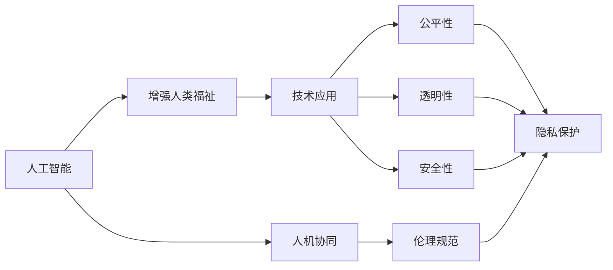

                 

# 人类-AI协作：增强人类福祉

## 1. 背景介绍

### 1.1 问题由来

随着人工智能（AI）技术的不断进步，机器学习和深度学习算法在多个领域中取得了显著成效。无论是医疗、金融、教育，还是交通、能源等，AI技术都在逐步改变人类的生活方式和社会结构。然而，AI技术的发展同时也带来了一些挑战和伦理问题，尤其是关于人类与AI协作的未来方向。

在AI技术高速发展的背景下，如何确保AI不仅能够提高生产力，还能增强人类的福祉，成为了当前研究的核心议题。本文将探讨人类-AI协作的现状与未来，分析其在增强人类福祉方面的潜力与挑战。

### 1.2 问题核心关键点

- **人类-AI协作**：如何通过AI技术提升人类的生产力和生活品质，同时避免过度依赖和技术风险。
- **增强人类福祉**：如何利用AI技术改善医疗、教育、安全等领域的实践，提升人类的生活质量。
- **技术伦理**：在推进AI技术应用的同时，如何确保技术的公平性、透明性和安全性。
- **人机协同**：如何在人类-AI协作中实现更加智能、高效、可控的协同工作模式。

这些关键点构成了人类-AI协作研究的基础，旨在通过技术创新与伦理规范，共同提升人类的福祉水平。

## 2. 核心概念与联系

### 2.1 核心概念概述

在探讨人类-AI协作的框架下，我们需要理解以下几个核心概念：

- **人工智能（AI）**：一种模拟人类智能行为的技术，包括机器学习、深度学习、自然语言处理等。
- **增强人类福祉**：通过AI技术解决人类面临的实际问题，提高生活质量，促进社会公平与和谐。
- **人机协同（Human-AI Collaboration）**：利用AI技术辅助人类工作，实现人机互动与合作，提高工作效率和质量。
- **AI伦理**：在AI技术应用中，确保技术的安全性、公平性和透明性，保护个人隐私和数据安全。

这些概念之间的关系可以通过以下Mermaid流程图来展示：



这个流程图展示了AI技术如何在多个层面促进人类福祉的提升，同时强调了伦理规范的重要性。

### 2.2 核心概念原理和架构的 Mermaid 流程图

在人工智能领域，通常采用三层架构来设计模型，包括数据输入层、模型层和输出层。以自然语言处理（NLP）为例，数据输入层处理文本、语音等自然语言信息，模型层包括编码器、解码器等组件，输出层生成文本、语音等自然语言响应。这种架构使得AI能够理解和生成自然语言，从而实现人机互动。

以下是使用Mermaid绘制的NLP三层架构图：


## 3. 核心算法原理 & 具体操作步骤

### 3.1 算法原理概述

在人类-AI协作中，AI技术通常通过以下步骤实现增强人类福祉：

1. **数据采集与预处理**：收集人类活动相关的数据，并进行清洗和标注，以便于机器学习模型处理。
2. **模型训练与优化**：使用机器学习或深度学习算法，训练模型以识别数据中的模式，并通过超参数调整和模型验证，提升模型性能。
3. **模型部署与应用**：将训练好的模型部署到实际应用场景中，通过API接口或集成到现有系统中，实现人机互动。
4. **持续优化与反馈**：根据实际应用效果，收集反馈数据，重新训练模型以优化性能。

### 3.2 算法步骤详解

以医疗诊断为例，具体步骤如下：

1. **数据采集**：从医院收集病人的医疗记录、检查结果、治疗方案等信息，并标注病人的疾病类型和诊断结果。
2. **数据预处理**：清洗数据，去除噪声，并转换成模型可以处理的格式。
3. **模型训练**：使用深度学习模型（如卷积神经网络CNN、循环神经网络RNN、Transformer等）对数据进行训练，优化模型参数。
4. **模型验证与测试**：在独立的测试集上评估模型的性能，确保模型的泛化能力。
5. **模型部署**：将训练好的模型集成到医疗系统中，提供诊断建议。
6. **持续优化**：收集医生的反馈，重新训练模型以提升准确性和可靠性。

### 3.3 算法优缺点

基于AI的增强人类福祉具有以下优点：

- **提高效率**：AI技术可以自动化处理大量数据，提高工作效率。
- **降低成本**：通过减少人工操作和错误，降低成本。
- **精准决策**：基于数据和算法的决策，通常比人工更加精准。

同时，也存在以下缺点：

- **数据隐私**：收集和处理个人数据时，涉及隐私保护问题。
- **技术风险**：AI模型的错误可能导致严重后果。
- **伦理问题**：AI在决策过程中可能存在偏见，影响公平性。
- **依赖性**：过度依赖AI可能导致人类技能退化。

### 3.4 算法应用领域

AI技术在多个领域中得到了广泛应用，包括但不限于：

- **医疗健康**：通过AI辅助诊断、治疗计划生成、药物研发等，提高医疗效率和质量。
- **教育培训**：利用AI进行个性化教学、考试评分、学习推荐等，提升教育效果。
- **金融服务**：通过AI进行风险评估、欺诈检测、客户服务等，增强金融安全。
- **智能交通**：通过AI进行交通流量预测、事故预警、自动驾驶等，改善交通管理。
- **环境保护**：利用AI进行环境监测、资源管理、灾害预警等，促进环境保护。

## 4. 数学模型和公式 & 详细讲解 & 举例说明

### 4.1 数学模型构建

以医疗诊断为例，可以构建一个简单的二分类模型，用于判断病人是否患有某种疾病。假设输入为病人的症状描述，输出为疾病的二元分类结果。

### 4.2 公式推导过程

假设我们有 $n$ 个病人数据，每个数据包含 $m$ 个特征 $x_i$，对应的疾病标签为 $y_i \in \{0, 1\}$，表示病人是否患有疾病。

二分类模型可以表示为：
$$
P(y|x; \theta) = \sigma(\sum_{i=1}^m \theta_ix_i)
$$
其中，$\sigma$ 为sigmoid函数，$\theta$ 为模型参数。

模型的损失函数可以定义如下：
$$
\mathcal{L}(\theta) = -\frac{1}{n}\sum_{i=1}^n [y_i\log P(y_i|x_i; \theta) + (1-y_i)\log (1-P(y_i|x_i; \theta))]
$$

模型的目标是最小化损失函数 $\mathcal{L}(\theta)$，以获得最优的模型参数 $\theta$。

### 4.3 案例分析与讲解

以某医院的肿瘤诊断为例，训练一个二分类模型来预测病人是否患有肺癌。该模型在收集到的1000个病人数据上进行训练，其中包含病人的症状描述和疾病标签。

使用交叉熵损失函数，通过随机梯度下降（SGD）算法进行模型训练。训练过程中，每个样本的损失函数如下：
$$
\mathcal{L}(\theta) = -[y_i\log P(y_i|x_i; \theta) + (1-y_i)\log (1-P(y_i|x_i; \theta))]
$$

模型训练后，可以用于新的病人数据进行疾病预测。例如，对一个新的病人数据 $x$ 进行预测，得到模型输出 $P(y|x; \theta)$，若 $P(y|x; \theta) > 0.5$，则预测该病人患有疾病。

## 5. 项目实践：代码实例和详细解释说明

### 5.1 开发环境搭建

要构建和训练一个医疗诊断模型，需要搭建一个Python开发环境，并选择合适的深度学习框架和工具库。

1. 安装Anaconda：从官网下载并安装Anaconda，用于创建独立的Python环境。
2. 创建并激活虚拟环境：
```bash
conda create -n myenv python=3.8 
conda activate myenv
```
3. 安装TensorFlow、Keras等深度学习框架：
```bash
conda install tensorflow keras scikit-learn pandas numpy
```

### 5.2 源代码详细实现

以下是一个简单的医疗诊断模型代码实现，使用Keras框架：

```python
from keras.models import Sequential
from keras.layers import Dense, Dropout, Activation
from keras.optimizers import Adam

# 定义模型
model = Sequential()
model.add(Dense(64, input_dim=m, activation='relu'))
model.add(Dropout(0.5))
model.add(Dense(1, activation='sigmoid'))

# 编译模型
model.compile(loss='binary_crossentropy', optimizer=Adam(lr=0.001), metrics=['accuracy'])

# 训练模型
model.fit(X_train, y_train, batch_size=32, epochs=10, validation_data=(X_test, y_test))
```

### 5.3 代码解读与分析

- `Sequential` 用于定义序列模型。
- `Dense` 添加全连接层，`input_dim` 表示输入特征维度，`activation` 表示激活函数。
- `Dropout` 添加丢弃层，防止过拟合。
- `Activation` 设置激活函数。
- `Adam` 编译模型时指定优化器。
- `fit` 方法用于训练模型，`X_train` 和 `y_train` 为训练集数据和标签，`X_test` 和 `y_test` 为测试集数据和标签。

## 6. 实际应用场景

### 6.1 医疗健康

在医疗健康领域，AI技术被广泛用于疾病诊断、治疗方案生成、药物研发等。例如，Google DeepMind开发的AlphaGo已经在围棋领域展示了超强学习能力，通过AI技术辅助医生进行肿瘤诊断和治疗计划生成，显著提高了诊断准确性和治疗效果。

### 6.2 教育培训

教育领域中，AI技术可以用于个性化教学、智能辅导、考试评分等。例如，Khan Academy利用AI技术分析学生的学习行为，提供个性化的学习路径和辅导，显著提升了学生的学习效果。

### 6.3 智能交通

智能交通系统通过AI技术进行交通流量预测、事故预警、自动驾驶等，提高了交通管理效率。例如，特斯拉的Autopilot系统利用AI技术进行自动驾驶，显著降低了交通事故率。

### 6.4 环境保护

AI技术在环境保护中也发挥了重要作用。例如，NASA利用AI技术分析卫星数据，监测森林火灾和气候变化，提升了环境保护的效率和精度。

## 7. 工具和资源推荐

### 7.1 学习资源推荐

为了帮助开发者系统掌握人类-AI协作的理论基础和实践技巧，这里推荐一些优质的学习资源：

1. 《人工智能与增强人类福祉》系列博文：由大模型技术专家撰写，深入浅出地介绍了AI技术在增强人类福祉方面的应用和挑战。
2. 斯坦福大学《人工智能伦理》课程：探讨AI技术的伦理问题，包括隐私保护、数据安全、公平性等。
3. Coursera《深度学习》课程：由斯坦福大学教授Andrew Ng主讲，系统介绍了深度学习的基本概念和应用。
4. Google AI博客：分享Google AI团队在技术创新和应用实践中的最新进展。
5. ArXiv预印本：最新的AI研究成果和论文，涵盖了多个领域的应用。

通过对这些资源的学习实践，相信你一定能够快速掌握人类-AI协作的精髓，并用于解决实际的AI问题。

### 7.2 开发工具推荐

高效的开发离不开优秀的工具支持。以下是几款用于人类-AI协作开发的常用工具：

1. Python：Python语言具有丰富的开源库和工具，适合快速迭代研究。
2. TensorFlow：由Google主导开发的深度学习框架，生产部署方便，适合大规模工程应用。
3. Keras：基于TensorFlow的高级深度学习框架，易于使用，适合快速原型开发。
4. Weights & Biases：模型训练的实验跟踪工具，可以记录和可视化模型训练过程中的各项指标，方便对比和调优。
5. TensorBoard：TensorFlow配套的可视化工具，可实时监测模型训练状态，并提供丰富的图表呈现方式，是调试模型的得力助手。

合理利用这些工具，可以显著提升人类-AI协作任务的开发效率，加快创新迭代的步伐。

### 7.3 相关论文推荐

人类-AI协作的研究源于学界的持续研究。以下是几篇奠基性的相关论文，推荐阅读：

1. AlphaGo：通过深度学习和蒙特卡洛树搜索算法，开发的围棋AI系统，展示了AI在复杂游戏中的强大能力。
2. Google Health AI：Google AI团队在医疗健康领域的研究，包括自然语言处理、医学影像分析等。
3. Khan Academy：通过AI技术进行个性化教学的案例，展示了AI在教育领域的应用潜力。
4. Tesla Autopilot：特斯拉的自动驾驶系统，展示了AI在智能交通领域的应用前景。
5. NASA AI：NASA利用AI技术进行环境保护的研究，展示了AI在环境保护领域的应用。

这些论文代表了大模型微调技术的发展脉络。通过学习这些前沿成果，可以帮助研究者把握学科前进方向，激发更多的创新灵感。

## 8. 总结：未来发展趋势与挑战

### 8.1 总结

本文对人类-AI协作在增强人类福祉方面的研究进行了全面系统的介绍。首先阐述了AI技术在多个领域中的广泛应用，明确了AI技术在提高生产力和生活质量方面的独特价值。其次，从原理到实践，详细讲解了AI技术在医疗、教育、交通等领域的具体实现步骤。最后，本文还探讨了AI技术在应用过程中面临的伦理、隐私等挑战，强调了技术伦理和规范的重要性。

通过本文的系统梳理，可以看到，人类-AI协作技术正在成为推动社会进步的重要力量，通过技术创新与伦理规范，共同提升人类的福祉水平。

### 8.2 未来发展趋势

展望未来，人类-AI协作技术将呈现以下几个发展趋势：

1. **多模态融合**：AI技术将突破单一模态的限制，实现视觉、听觉、触觉等多模态数据的融合，提升综合处理能力。
2. **人机协同增强**：通过AI技术辅助人类工作，实现更智能、高效、可控的协同工作模式，提升工作效率。
3. **个性化服务**：利用AI技术进行个性化服务，满足用户多样化的需求，提升用户体验。
4. **自适应学习**：AI技术将具备自适应学习能力，通过不断学习用户行为和反馈，优化服务效果。
5. **智能决策**：AI技术将增强决策能力，支持人类进行复杂决策，提升决策效率和质量。

这些趋势凸显了人类-AI协作技术的广阔前景，展示了其在多个领域中的广泛应用潜力。

### 8.3 面临的挑战

尽管人类-AI协作技术已经取得了显著进展，但在迈向更加智能化、普适化应用的过程中，仍面临诸多挑战：

1. **数据隐私**：在收集和处理个人数据时，如何保护用户隐私和数据安全，成为一大难题。
2. **技术公平性**：AI技术在应用过程中，如何避免技术偏见，确保公平性，避免歧视性输出。
3. **伦理规范**：如何在技术应用过程中，确保伦理规范，避免技术滥用，保护用户权益。
4. **技术可靠性**：如何提高AI技术的可靠性，避免技术错误带来的严重后果。
5. **人机协同**：如何在人机协同过程中，实现高效的协作模式，避免人机交互中的误操作和误解。

这些挑战需要学界和产业界的共同努力，才能确保AI技术的良性发展，实现其在人类福祉方面的最大潜力。

### 8.4 研究展望

未来研究需要在以下几个方面寻求新的突破：

1. **隐私保护技术**：开发更加高效的隐私保护技术，确保用户数据的安全和匿名性。
2. **公平性算法**：研究公平性算法，确保AI技术在应用过程中，不产生歧视性输出。
3. **自适应学习模型**：开发自适应学习模型，增强AI技术的个性化服务能力。
4. **智能决策系统**：研究智能决策系统，支持人类进行复杂决策，提升决策效率和质量。
5. **伦理规范框架**：构建AI伦理规范框架，确保AI技术在应用过程中，符合伦理规范，保护用户权益。

这些研究方向的探索，必将引领人类-AI协作技术迈向更高的台阶，为构建安全、可靠、可解释、可控的智能系统铺平道路。面向未来，人类-AI协作技术还需要与其他人工智能技术进行更深入的融合，共同推动自然语言理解和智能交互系统的进步。只有勇于创新、敢于突破，才能不断拓展语言模型的边界，让智能技术更好地造福人类社会。

## 9. 附录：常见问题与解答

**Q1：人类-AI协作是否适用于所有领域？**

A: 人类-AI协作技术在大多数领域中都有广泛的应用前景，如医疗、教育、金融、交通等。但对于一些特定领域，如高风险、高安全性要求的环境，AI技术还需要进一步优化和规范。

**Q2：如何确保AI技术的公平性？**

A: 确保AI技术的公平性，需要从数据采集、模型训练、模型部署等各个环节进行优化。例如，在数据采集阶段，确保数据样本的多样性和代表性；在模型训练阶段，使用公平性算法和对抗样本进行训练；在模型部署阶段，进行公平性评估和调整。

**Q3：AI技术在应用过程中，如何确保伦理规范？**

A: 确保AI技术的伦理规范，需要从技术设计、应用流程和监管机制等多个层面进行考虑。例如，在技术设计阶段，引入伦理导向的评估指标；在应用流程中，设置伦理审核机制；在监管机制中，建立数据透明和责任追究机制。

**Q4：人类-AI协作中，如何实现高效的协同工作模式？**

A: 实现高效的协同工作模式，需要设计合理的交互界面和协同机制。例如，在医疗领域，利用AI技术辅助医生进行诊断和治疗，减少医生的工作负担；在教育领域，利用AI技术进行个性化教学和辅导，提升教学效果。

**Q5：人类-AI协作中，如何提高AI技术的可靠性？**

A: 提高AI技术的可靠性，需要从数据质量、模型架构、算法优化等方面进行优化。例如，在数据质量方面，确保数据的准确性和完备性；在模型架构方面，使用可靠的多模态融合和自适应学习模型；在算法优化方面，使用鲁棒性算法和对抗训练。

---

作者：禅与计算机程序设计艺术 / Zen and the Art of Computer Programming

