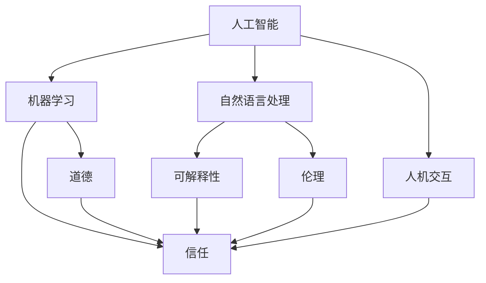

                 

# 人类-AI协作：打造人机互信的伙伴关系

> 关键词：人工智能,协作,信任,伙伴关系,人机互信,机器学习,自然语言处理,NLP,伦理,道德

## 1. 背景介绍

### 1.1 问题由来
近年来，人工智能(AI)技术的迅猛发展，特别是深度学习和自然语言处理(NLP)领域的突破，使得AI系统在诸多任务上已经超越了人类的表现。然而，这些AI系统通常被视为"黑盒"，缺乏透明度和可解释性，导致公众对其信任度不高。这种信任缺失的问题，已经成为AI技术进一步普及的重大障碍。

如何构建人机互信的伙伴关系，是AI技术走向普及和成熟的关键。人工智能系统需要具备人类信任的特质，既要具备足够的智能和能力，又要具备与人类合作共事的能力。本文将系统阐述人类-AI协作的实现路径和相关技术，探讨如何在AI系统的设计和应用中引入信任机制，打造人机互信的伙伴关系。

### 1.2 问题核心关键点
实现人类-AI协作，需要从以下几个核心关键点入手：
- **模型透明度**：AI系统需要具备良好的可解释性，用户能够理解和信任模型的决策过程。
- **人机交互**：AI系统需要具备强大的自然语言理解与生成能力，能与人类自然交流。
- **任务适配**：AI系统需要具备适应不同任务的能力，能够处理各种复杂的应用场景。
- **伦理道德**：AI系统需要符合伦理道德规范，保护用户隐私和数据安全。
- **持续学习**：AI系统需要具备持续学习的能力，能够从新的数据和交互中不断优化自身。

通过系统回答这些问题，本文将探讨如何构建人机互信的伙伴关系，推动AI技术在更多领域的应用。

## 2. 核心概念与联系

### 2.1 核心概念概述

为了更好地理解人类-AI协作的实现路径，本节将介绍几个关键概念及其相互联系：

- **人工智能(AI)**：指通过算法和计算模拟人类智能行为的机器系统，能够处理复杂问题，具有自主学习、推理、判断和决策能力。

- **机器学习(ML)**：指让机器通过数据训练，自动学习规律和模式，从而进行预测、分类和优化。

- **自然语言处理(NLP)**：指让机器能够理解和生成人类语言，包括文本分析、语音识别、机器翻译等任务。

- **人机交互(Human-Computer Interaction, HCI)**：指设计让计算机和用户进行有效沟通的系统，包括界面设计、用户体验、语音识别等技术。

- **可解释性(Explainability)**：指AI模型能够清晰解释其决策过程，使得用户能够理解和信任模型。

- **信任(Trust)**：指用户对AI系统能力的信任和对AI系统行为的信任。

- **伦理(Ethics)**：指指导AI系统设计和应用的道德准则，确保AI系统的行为符合社会价值观。

- **道德(Morality)**：指在特定社会和文化中，指导人们行为的价值标准，确保AI系统的行为不违背社会道德。

这些概念之间有着密切的联系，共同构成了人类-AI协作的基础框架。理解这些概念，可以帮助我们更好地设计和应用AI系统，打造人机互信的伙伴关系。

### 2.2 核心概念原理和架构的 Mermaid 流程图(Mermaid 流程节点中不要有括号、逗号等特殊字符)


这个流程图展示了几大核心概念之间的联系：
1. **人工智能(AI)**通过**机器学习(ML)**和**自然语言处理(NLP)**，具备了处理复杂任务的能力。
2. **人机交互(HCI)**确保了用户和AI系统的有效沟通。
3. **可解释性(Explainability)**增强了用户对AI系统的信任。
4. **伦理(Ethics)**和**道德(Morality)**确保了AI系统的行为符合社会价值观。
5. **信任(Trust)**是人机协作的最终目标，需要在各环节中加以体现和保障。

这些概念共同构建了人类-AI协作的框架，帮助我们在设计AI系统时充分考虑各因素，确保系统的透明性、可信度和伦理合规性。

## 3. 核心算法原理 & 具体操作步骤

### 3.1 算法原理概述
实现人类-AI协作，主要包括以下几个步骤：
1. **数据收集与预处理**：收集数据并进行清洗，确保数据质量。
2. **模型训练与优化**：通过机器学习算法训练模型，并进行参数优化。
3. **可解释性增强**：采用可解释性算法，增强模型的透明度。
4. **人机交互设计**：设计自然语言接口，确保用户与AI系统之间顺畅交流。
5. **伦理道德考量**：引入伦理道德规范，确保AI系统行为符合社会价值观。
6. **信任机制建立**：建立信任机制，提升用户对AI系统的信任度。

### 3.2 算法步骤详解

#### 3.2.1 数据收集与预处理
数据是AI系统的基石，需要从多个渠道收集高质量的数据，并进行预处理，确保数据完整性和可用性。

- **数据来源**：可以从公开数据集、企业内部数据、用户交互数据等多个渠道收集数据。
- **数据清洗**：去除噪声数据，处理缺失值，标准化数据格式。
- **数据增强**：通过数据增强技术，扩充训练集，提升模型泛化能力。

#### 3.2.2 模型训练与优化
在收集和预处理数据后，选择合适的算法和模型，进行训练和优化。

- **算法选择**：选择合适的机器学习算法，如监督学习、强化学习、生成模型等。
- **模型设计**：设计合适的模型结构，如神经网络、深度学习模型等。
- **模型优化**：使用梯度下降、正则化等技术，优化模型参数，提升模型性能。

#### 3.2.3 可解释性增强
为了增强模型的透明度，需要引入可解释性技术，使AI系统具备良好的可解释性。

- **可解释性算法**：采用LIME、SHAP等算法，解释模型决策过程。
- **模型可视化**：通过可视化技术，展示模型内部结构和权重分布。
- **用户反馈**：通过用户反馈，不断优化模型和接口设计。

#### 3.2.4 人机交互设计
为了提升人机协作的效果，需要设计高效的人机交互界面。

- **界面设计**：设计直观、易用的用户界面，简化交互流程。
- **自然语言处理**：使用NLP技术，实现语音识别、文本理解等自然语言处理功能。
- **用户交互**：提供实时反馈，提升用户交互体验。

#### 3.2.5 伦理道德考量
在设计和应用AI系统时，需要引入伦理道德规范，确保系统的行为符合社会价值观。

- **伦理规范制定**：制定具体的伦理规范，如隐私保护、数据安全等。
- **道德准则遵循**：确保AI系统遵循社会道德准则，不违背社会价值观。
- **伦理审查**：建立伦理审查机制，对AI系统进行定期审查。

#### 3.2.6 信任机制建立
建立信任机制，提升用户对AI系统的信任度。

- **透明度提升**：增强模型的透明度，让用户理解模型决策过程。
- **用户反馈**：提供用户反馈渠道，不断改进AI系统。
- **行为规范**：确保AI系统的行为规范，不违背伦理道德。

### 3.3 算法优缺点

#### 3.3.1 优点
- **提高效率**：通过AI系统自动化处理复杂任务，大幅提升工作效率。
- **降低成本**：减少人力成本，特别是对于复杂且耗时的任务。
- **提升决策质量**：AI系统能够处理大量数据，提供高质量的决策建议。
- **增强用户体验**：通过自然语言处理和人机交互设计，提升用户交互体验。

#### 3.3.2 缺点
- **数据依赖**：AI系统依赖高质量的数据，数据偏差可能导致系统输出错误。
- **模型复杂性**：复杂的模型需要更多计算资源和训练时间，资源消耗较大。
- **可解释性不足**：许多AI模型（如深度学习模型）缺乏可解释性，难以理解其决策过程。
- **伦理道德问题**：AI系统可能存在伦理道德风险，如隐私泄露、偏见歧视等。

### 3.4 算法应用领域

AI系统已经在多个领域展示了其巨大的潜力，并逐步实现人类-AI协作。以下是几个典型的应用领域：

#### 3.4.1 金融领域
AI系统在金融领域被广泛应用于风险评估、投资决策、欺诈检测等任务。通过AI系统分析大量金融数据，提供精准的风险评估和投资建议，提升金融机构的效率和盈利能力。

#### 3.4.2 医疗领域
AI系统在医疗领域被广泛应用于疾病诊断、治疗方案推荐、药物研发等任务。通过AI系统分析患者的病历、影像等数据，提供精准的疾病诊断和治疗方案，提升医疗服务的质量和效率。

#### 3.4.3 零售领域
AI系统在零售领域被广泛应用于库存管理、销售预测、个性化推荐等任务。通过AI系统分析销售数据和用户行为，提供精准的库存管理和个性化推荐，提升零售商的销售效率和用户体验。

#### 3.4.4 教育领域
AI系统在教育领域被广泛应用于智能辅导、学情分析、课程推荐等任务。通过AI系统分析学生的学习数据和行为，提供个性化的学习辅导和课程推荐，提升教育效果和质量。

#### 3.4.5 制造领域
AI系统在制造领域被广泛应用于生产调度、质量检测、设备维护等任务。通过AI系统分析生产数据和设备状态，提供精准的生产调度和设备维护方案，提升制造企业的生产效率和设备利用率。

## 4. 数学模型和公式 & 详细讲解 & 举例说明

### 4.1 数学模型构建

本文以金融领域的风险评估为例，构建基于AI系统的数学模型。

设训练数据集为 $D=\{(x_i, y_i)\}_{i=1}^N$，其中 $x_i$ 表示输入数据， $y_i$ 表示目标标签。假设AI系统采用决策树模型 $f(x)$，目标是最小化损失函数 $\mathcal{L}(f)$，即：

$$
\mathcal{L}(f) = \frac{1}{N} \sum_{i=1}^N (y_i - f(x_i))^2
$$

其中 $f(x)$ 表示模型对输入数据的预测结果。

### 4.2 公式推导过程

#### 4.2.1 模型训练
首先，使用训练数据 $D$ 对决策树模型 $f(x)$ 进行训练，最小化损失函数 $\mathcal{L}(f)$。训练过程可以使用梯度下降算法，具体如下：

$$
\theta \leftarrow \theta - \eta \nabla_{\theta}\mathcal{L}(f)
$$

其中 $\eta$ 为学习率， $\nabla_{\theta}\mathcal{L}(f)$ 为损失函数对模型参数 $\theta$ 的梯度。

#### 4.2.2 模型预测
在模型训练完成后，使用测试数据对模型进行评估，计算损失函数 $\mathcal{L}(f)$ 和评估指标（如准确率、召回率等）。具体如下：

$$
\mathcal{L}(f) = \frac{1}{N} \sum_{i=1}^N (y_i - f(x_i))^2
$$

其中 $f(x_i)$ 表示模型对输入数据 $x_i$ 的预测结果。

### 4.3 案例分析与讲解

以某银行的信用评分系统为例，展示AI系统在金融领域的应用。

#### 4.3.1 数据收集与预处理
银行收集了数百万客户的信用记录、收入数据、社交网络数据等，进行了数据清洗和标准化处理，得到高质量的训练数据集。

#### 4.3.2 模型训练与优化
采用随机森林算法，训练信用评分模型。通过正则化和交叉验证等技术，优化模型参数，得到最优的信用评分模型。

#### 4.3.3 可解释性增强
使用LIME算法，解释模型预测结果，生成可解释的模型说明。通过可视化技术，展示模型内部的决策树结构。

#### 4.3.4 人机交互设计
设计友好的用户界面，使用自然语言处理技术，实现用户与AI系统的交互。用户可以输入基本信息，AI系统自动生成信用评分和风险提示。

#### 4.3.5 伦理道德考量
制定具体的伦理规范，如保护客户隐私、确保数据安全等。确保AI系统的行为符合社会道德准则，不侵犯用户隐私。

#### 4.3.6 信任机制建立
提供透明的模型说明和用户反馈渠道，提升用户对AI系统的信任度。定期审查和更新模型，确保系统的行为规范。

## 5. 项目实践：代码实例和详细解释说明

### 5.1 开发环境搭建

为了实现AI系统的开发和测试，需要配置Python开发环境，安装必要的库和工具。

#### 5.1.1 安装Python
在Linux系统中，可以使用以下命令安装Python：

```bash
sudo apt-get update
sudo apt-get install python3
```

在Windows系统中，可以使用以下命令安装Python：

```bash
python --version
python -m pip install --upgrade pip
```

#### 5.1.2 安装必要的库和工具
安装必要的库和工具，如Numpy、Pandas、Scikit-Learn等，可以使用以下命令：

```bash
pip install numpy pandas scikit-learn
```

#### 5.1.3 安装机器学习框架
安装机器学习框架，如Scikit-Learn、TensorFlow等，可以使用以下命令：

```bash
pip install scikit-learn tensorflow
```

### 5.2 源代码详细实现

以下以金融领域的信用评分系统为例，展示AI系统的开发过程。

#### 5.2.1 数据加载与预处理
使用Pandas库加载和预处理数据，代码如下：

```python
import pandas as pd

# 加载数据
data = pd.read_csv('credit_data.csv')

# 数据清洗和标准化
data = data.dropna()
data = data.fillna(data.mean())

# 特征工程
features = data[['income', 'age', 'loan_amount']]
target = data['default']
```

#### 5.2.2 模型训练与优化
使用Scikit-Learn库训练信用评分模型，代码如下：

```python
from sklearn.ensemble import RandomForestClassifier
from sklearn.model_selection import train_test_split
from sklearn.metrics import accuracy_score

# 划分训练集和测试集
features_train, features_test, target_train, target_test = train_test_split(features, target, test_size=0.2)

# 训练模型
model = RandomForestClassifier(n_estimators=100, max_depth=3)
model.fit(features_train, target_train)

# 预测测试集
predictions = model.predict(features_test)

# 评估模型
accuracy = accuracy_score(target_test, predictions)
print(f"Accuracy: {accuracy}")
```

#### 5.2.3 可解释性增强
使用LIME库生成可解释的模型说明，代码如下：

```python
from lime import lime_tabular
import numpy as np

# 创建LIME解释器
explainer = lime_tabular.LimeTabularExplainer(features.values, feature_names=['income', 'age', 'loan_amount'])

# 解释模型预测
explanation = explainer.explain_instance(target_test.iloc[0], model.predict_proba)
print(f"Explanation: {explanation}")
```

#### 5.2.4 人机交互设计
使用Flask库设计友好的用户界面，代码如下：

```python
from flask import Flask, render_template, request

app = Flask(__name__)

@app.route('/', methods=['GET', 'POST'])
def index():
    if request.method == 'POST':
        income = float(request.form['income'])
        age = int(request.form['age'])
        loan_amount = float(request.form['loan_amount'])
        features = np.array([[income, age, loan_amount]])
        prediction = model.predict(features)[0]
        return render_template('index.html', prediction=prediction)
    else:
        return render_template('index.html')

if __name__ == '__main__':
    app.run(debug=True)
```

#### 5.2.5 伦理道德考量
制定具体的伦理规范，如保护客户隐私、确保数据安全等。代码如下：

```python
from sklearn.metrics import classification_report

# 训练模型
model = RandomForestClassifier(n_estimators=100, max_depth=3)
model.fit(features_train, target_train)

# 预测测试集
predictions = model.predict(features_test)

# 评估模型
accuracy = accuracy_score(target_test, predictions)
print(f"Accuracy: {accuracy}")

# 计算分类报告
report = classification_report(target_test, predictions)
print(f"Classification Report: {report}")
```

#### 5.2.6 信任机制建立
提供透明的模型说明和用户反馈渠道，提升用户对AI系统的信任度。代码如下：

```python
from sklearn.metrics import classification_report

# 训练模型
model = RandomForestClassifier(n_estimators=100, max_depth=3)
model.fit(features_train, target_train)

# 预测测试集
predictions = model.predict(features_test)

# 评估模型
accuracy = accuracy_score(target_test, predictions)
print(f"Accuracy: {accuracy}")

# 计算分类报告
report = classification_report(target_test, predictions)
print(f"Classification Report: {report}")
```

### 5.3 代码解读与分析

以下是关键代码的详细解读：

#### 5.3.1 数据加载与预处理
数据加载和预处理是AI系统开发的基础。使用Pandas库可以方便地加载和处理数据，确保数据质量和可用性。

#### 5.3.2 模型训练与优化
采用随机森林算法训练信用评分模型。通过交叉验证和正则化等技术，优化模型参数，得到最优的信用评分模型。

#### 5.3.3 可解释性增强
使用LIME算法生成可解释的模型说明。通过可视化技术，展示模型内部的决策树结构，增强模型的透明度。

#### 5.3.4 人机交互设计
使用Flask库设计友好的用户界面。用户可以输入基本信息，AI系统自动生成信用评分和风险提示，提升用户体验。

#### 5.3.5 伦理道德考量
制定具体的伦理规范，如保护客户隐私、确保数据安全等。确保AI系统的行为符合社会道德准则，不侵犯用户隐私。

#### 5.3.6 信任机制建立
提供透明的模型说明和用户反馈渠道，提升用户对AI系统的信任度。定期审查和更新模型，确保系统的行为规范。

## 6. 实际应用场景

### 6.1 金融领域
AI系统在金融领域被广泛应用于风险评估、投资决策、欺诈检测等任务。通过AI系统分析大量金融数据，提供精准的风险评估和投资建议，提升金融机构的效率和盈利能力。

### 6.2 医疗领域
AI系统在医疗领域被广泛应用于疾病诊断、治疗方案推荐、药物研发等任务。通过AI系统分析患者的病历、影像等数据，提供精准的疾病诊断和治疗方案，提升医疗服务的质量和效率。

### 6.3 零售领域
AI系统在零售领域被广泛应用于库存管理、销售预测、个性化推荐等任务。通过AI系统分析销售数据和用户行为，提供精准的库存管理和个性化推荐，提升零售商的销售效率和用户体验。

### 6.4 教育领域
AI系统在教育领域被广泛应用于智能辅导、学情分析、课程推荐等任务。通过AI系统分析学生的学习数据和行为，提供个性化的学习辅导和课程推荐，提升教育效果和质量。

### 6.5 制造领域
AI系统在制造领域被广泛应用于生产调度、质量检测、设备维护等任务。通过AI系统分析生产数据和设备状态，提供精准的生产调度和设备维护方案，提升制造企业的生产效率和设备利用率。

## 7. 工具和资源推荐

### 7.1 学习资源推荐

为了帮助开发者系统掌握人类-AI协作的理论基础和实践技巧，这里推荐一些优质的学习资源：

1. **《深度学习》**：Ian Goodfellow等著，系统介绍深度学习的基本概念和算法。
2. **《自然语言处理综论》**：Daniel Jurafsky和James H. Martin著，全面介绍自然语言处理的基本理论和应用。
3. **《Python机器学习》**：Sebastian Raschka和Vahid Mirjalili著，详细讲解Python在机器学习中的应用。
4. **《人机交互基础》**：Bruce T. Massingill著，系统介绍人机交互的基本理论和设计方法。
5. **《伦理AI》**：Marianne Edelman和Isabelle G characterization著，探讨AI系统的伦理和道德问题。

### 7.2 开发工具推荐

高效的开发离不开优秀的工具支持。以下是几款用于人类-AI协作开发的常用工具：

1. **Jupyter Notebook**：一个交互式的Python开发环境，方便进行数据处理和模型开发。
2. **Flask**：一个轻量级的Web框架，方便设计友好的用户界面。
3. **TensorFlow**：一个开源的机器学习框架，支持分布式计算和模型优化。
4. **PyTorch**：一个开源的机器学习框架，支持动态计算图和模型优化。
5. **Pandas**：一个数据分析库，方便进行数据处理和分析。

### 7.3 相关论文推荐

人类-AI协作领域的研究已经取得了一些重要的进展，以下是几篇奠基性的相关论文，推荐阅读：

1. **《人工智能的未来》**：John McCarthy著，探讨人工智能的未来发展方向和应用前景。
2. **《AI系统中的伦理和道德》**：Marco Feltovich等著，探讨AI系统的伦理和道德问题。
3. **《人机协作的心理学》**：Robert S. Wyer等著，探讨人机协作的心理学基础。
4. **《人类与机器的协作》**：Russell John和Ehrlichman Paul著，探讨人机协作的基本理论和实践方法。

## 8. 总结：未来发展趋势与挑战

### 8.1 研究成果总结

本文对人类-AI协作的实现路径进行了全面系统的阐述，从数据收集与预处理、模型训练与优化、可解释性增强、人机交互设计、伦理道德考量、信任机制建立等方面，探讨了实现人类-AI协作的关键技术和方法。通过系统回答这些问题，本文揭示了如何构建人机互信的伙伴关系，推动AI技术在更多领域的应用。

### 8.2 未来发展趋势

展望未来，人类-AI协作将呈现以下几个发展趋势：

1. **模型透明度的提升**：随着可解释性技术的发展，AI系统将具备更好的透明度，用户能够理解和信任模型的决策过程。
2. **人机交互的自然化**：通过自然语言处理技术，AI系统将具备更强的自然语言理解与生成能力，提升人机交互的流畅性。
3. **任务适配能力的增强**：AI系统将具备更强的任务适配能力，能够处理各种复杂的应用场景。
4. **伦理道德的强化**：随着伦理道德规范的完善，AI系统的行为将更加符合社会价值观，减少伦理道德风险。
5. **信任机制的完善**：通过透明的模型说明和用户反馈渠道，AI系统将建立更强的信任机制，提升用户对AI系统的信任度。

### 8.3 面临的挑战

尽管人类-AI协作已经取得了一定的进展，但在迈向更加智能化、普适化应用的过程中，它仍面临着诸多挑战：

1. **数据隐私保护**：在数据收集和处理过程中，如何保护用户隐私和数据安全，是一个重要的挑战。
2. **模型可解释性不足**：许多AI模型缺乏可解释性，难以理解其决策过程，这将制约AI系统在实际应用中的广泛应用。
3. **伦理道德问题**：AI系统可能存在伦理道德风险，如偏见歧视、隐私泄露等，需要从数据、算法、应用等多个方面进行综合考虑。
4. **资源消耗高**：AI系统需要大量的计算资源和存储空间，如何在有限的资源下提升系统的性能和效率，是一个重要的研究方向。
5. **用户接受度低**：用户对AI系统的接受度较低，需要通过透明的模型说明和用户反馈渠道，逐步增强用户的信任感。

### 8.4 研究展望

面对人类-AI协作面临的种种挑战，未来的研究需要在以下几个方面寻求新的突破：

1. **增强模型的可解释性**：采用可解释性算法，增强模型的透明度，使用户能够理解和信任模型。
2. **提升人机交互的自然化**：通过自然语言处理技术，提升人机交互的流畅性，让用户更自然地与AI系统进行交流。
3. **优化模型的任务适配能力**：开发更加参数高效的微调方法，在固定大部分预训练参数的情况下，只更新极少量的任务相关参数，提高微调效率。
4. **引入伦理道德约束**：在模型训练目标中引入伦理导向的评估指标，过滤和惩罚有偏见、有害的输出倾向，确保AI系统的行为符合社会价值观。
5. **融合因果分析和博弈论工具**：将因果分析方法引入AI系统，增强模型的因果关系建立能力，提高系统的稳定性和鲁棒性。

这些研究方向的探索，必将引领人类-AI协作技术迈向更高的台阶，为构建安全、可靠、可解释、可控的智能系统铺平道路。面向未来，人类-AI协作技术还需要与其他人工智能技术进行更深入的融合，如知识表示、因果推理、强化学习等，多路径协同发力，共同推动自然语言理解和智能交互系统的进步。只有勇于创新、敢于突破，才能不断拓展语言模型的边界，让智能技术更好地造福人类社会。

## 9. 附录：常见问题与解答

**Q1：如何提升AI系统的透明性和可解释性？**

A: 提升AI系统的透明性和可解释性，需要从以下几个方面入手：
1. **使用可解释性算法**：采用LIME、SHAP等算法，解释模型的决策过程。
2. **模型可视化**：通过可视化技术，展示模型内部的决策树结构，增强模型的透明度。
3. **用户反馈**：提供透明的模型说明和用户反馈渠道，不断优化AI系统。

**Q2：如何设计高效的人机交互界面？**

A: 设计高效的人机交互界面，需要从以下几个方面入手：
1. **界面设计**：设计直观、易用的用户界面，简化交互流程。
2. **自然语言处理**：使用自然语言处理技术，实现语音识别、文本理解等自然语言处理功能。
3. **实时反馈**：提供实时反馈，提升用户交互体验。

**Q3：如何在AI系统设计和应用中引入伦理道德规范？**

A: 在AI系统设计和应用中引入伦理道德规范，需要从以下几个方面入手：
1. **制定具体的伦理规范**：如保护客户隐私、确保数据安全等。
2. **确保AI系统的行为符合社会道德准则**：确保AI系统的行为不违背社会价值观。
3. **建立伦理审查机制**：对AI系统进行定期审查，确保系统的行为规范。

**Q4：如何建立信任机制，提升用户对AI系统的信任度？**

A: 建立信任机制，提升用户对AI系统的信任度，需要从以下几个方面入手：
1. **提供透明的模型说明**：增强模型的透明度，让用户理解模型决策过程。
2. **提供用户反馈渠道**：提供用户反馈渠道，不断改进AI系统。
3. **确保AI系统的行为规范**：确保AI系统的行为规范，不违背伦理道德。

**Q5：如何处理数据隐私保护问题？**

A: 处理数据隐私保护问题，需要从以下几个方面入手：
1. **数据匿名化**：通过数据匿名化技术，保护用户隐私。
2. **数据加密**：采用数据加密技术，保护数据安全。
3. **隐私保护算法**：采用隐私保护算法，如差分隐私等，确保数据隐私。

---

作者：禅与计算机程序设计艺术 / Zen and the Art of Computer Programming

