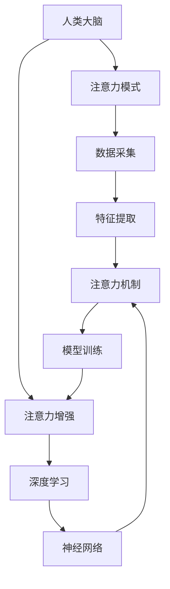

                 

# 人类注意力增强：提升专注力和注意力在商业中的未来发展机遇分析机遇趋势分析

> 关键词：人类注意力增强, 专注力提升, 商业机会, 人工智能, 神经网络, 深度学习, 注意力机制, 未来趋势

## 1. 背景介绍

### 1.1 问题由来
在快节奏的现代生活中，人们的注意力被各种信息和娱乐形式分散，导致生产力下降，决策质量受损。如何在商业环境中提升个人的专注力和注意力，成为亟待解决的问题。近年来，随着人工智能和深度学习的快速发展，人类注意力增强的技术也得到了广泛关注。通过模拟人类大脑的工作原理，构建人工注意力机制，可以显著提高个人的工作效率和创造力。

### 1.2 问题核心关键点
人类注意力增强的核心在于如何构建和训练模型，使其能够识别并强化特定情境下的人类注意力模式。这包括对注意力模式的数据采集、特征提取、模型训练和结果应用等多个环节。其中，注意力机制的构建是关键，它能够帮助模型在特定任务中更加有效地利用有限的注意力资源。

### 1.3 问题研究意义
人类注意力增强的研究和应用，对于提升个体和企业的生产力、决策质量、创造力以及心理福祉具有重要意义。在商业环境中，通过增强个体的注意力，可以显著提高工作效率，减少决策错误，提升团队协作和创新能力。同时，基于人工智能的注意力增强技术，还可以帮助企业优化资源分配，提高客户满意度，增强市场竞争力。

## 2. 核心概念与联系

### 2.1 核心概念概述

为更好地理解人类注意力增强的原理和应用，本节将介绍几个关键概念：

- **人类注意力增强**：通过构建和训练模型，提升个体在特定任务中的专注力和注意力，以提高工作效率、决策质量和创造力。
- **注意力机制**：借鉴人类大脑的注意力模式，构建深度学习模型中的注意力机制，使模型能够在处理复杂任务时，更加高效地分配注意力资源。
- **深度学习**：基于神经网络的机器学习范式，能够通过多层非线性变换，自动学习特征表示和模式识别。
- **神经网络**：由神经元（节点）和连接（边）组成的计算模型，用于模拟人类大脑的神经元连接和信号传递。
- **人类大脑**：复杂的信息处理和认知中枢，其注意力模式可以通过科学研究和仿真技术进行模拟和增强。

这些核心概念之间的逻辑关系可以通过以下Mermaid流程图来展示：



这个流程图展示了几组核心概念及其之间的关系：

1. 人类大脑通过注意力模式指导信息处理，大脑的注意力机制是注意力增强技术的灵感来源。
2. 注意力增强利用深度学习，通过构建神经网络，模拟人类大脑的注意力模式。
3. 神经网络中的注意力机制，帮助模型在特定任务中高效分配注意力资源。
4. 注意力增强过程包括数据采集、特征提取、模型训练等多个步骤。

这些概念共同构成了人类注意力增强的技术框架，使得模型能够在复杂任务中，通过更有效地利用注意力资源，提升个体的专注力和工作效率。

## 3. 核心算法原理 & 具体操作步骤
### 3.1 算法原理概述

人类注意力增强的核心算法是基于深度学习的注意力机制。其核心思想是构建能够模拟人类注意力模式的模型，使其能够在特定任务中更加高效地利用注意力资源，从而提升个体的专注力和工作效率。

形式化地，假设我们希望构建一个注意力增强模型 $M$，用于处理任务 $T$，其中 $T$ 可以是一个分类任务、信息检索任务、序列标注任务等。注意力机制的目标是学习一个权重矩阵 $A$，用于对输入序列 $\mathbf{x} = \{x_1, x_2, \ldots, x_n\}$ 中的每个元素分配不同的注意力权重 $a_i$，使得模型在处理序列时，能够更加关注那些对任务 $T$ 更加重要的元素。注意力机制的构建过程如下：

1. 输入序列 $\mathbf{x}$ 经过一个线性变换 $W$ 和激活函数 $f$，得到特征表示 $\mathbf{h} = f(W\mathbf{x})$。
2. 特征表示 $\mathbf{h}$ 通过一个自注意力层，得到注意力权重 $A$。
3. 注意力权重 $A$ 和特征表示 $\mathbf{h}$ 相乘，得到加权和 $\mathbf{v} = A \mathbf{h}$。
4. 对加权和 $\mathbf{v}$ 进行线性变换和激活函数处理，得到最终输出 $\mathbf{y} = f(W_v \mathbf{v})$。

其中，自注意力层的计算公式为：

$$
A_{ij} = \text{softmax}(e_{ij} / \sqrt{d_k})
$$

$$
e_{ij} = \mathbf{q}_i \cdot \mathbf{K}_j
$$

$$
\mathbf{q}, \mathbf{K}, \mathbf{V} = W_q \mathbf{h}, W_k \mathbf{h}, W_v \mathbf{h}
$$

其中 $d_k$ 是关键向量的维度，$q, k, v$ 分别是查询向量、键向量和值向量，通过这些向量之间的点积，计算出注意力权重 $A$。

### 3.2 算法步骤详解

基于深度学习的注意力增强模型通常包含以下几个关键步骤：

**Step 1: 数据准备**
- 收集与特定任务相关的数据集，包括输入序列 $\mathbf{x}$ 和对应的标签 $y$。
- 对数据集进行预处理，如分词、标记、标准化等，得到可输入模型的格式。

**Step 2: 模型构建**
- 选择合适的深度学习框架和注意力机制，构建注意力增强模型。
- 设计模型的结构，包括输入层、注意力层、输出层等。
- 设置模型参数，如学习率、批大小、迭代轮数等。

**Step 3: 模型训练**
- 将数据集划分为训练集、验证集和测试集。
- 使用训练集对模型进行迭代优化，最小化损失函数。
- 在验证集上评估模型性能，避免过拟合。
- 在测试集上测试模型泛化能力，评估最终效果。

**Step 4: 应用部署**
- 将训练好的模型应用于实际任务中。
- 对输入序列进行预处理，提取特征。
- 将特征输入模型，获取注意力加权和。
- 对加权和进行后处理，得到最终输出。

### 3.3 算法优缺点

基于深度学习的注意力增强模型具有以下优点：
1. 可以高效地处理长序列和复杂任务，提高模型的泛化能力。
2. 通过模拟人类注意力机制，提升个体的工作效率和创造力。
3. 可扩展性强，能够应用到多个商业领域。
4. 通过不断优化模型结构和训练过程，可以提升模型性能。

同时，该模型也存在一些局限性：
1. 对标注数据依赖度高，需要大量高质量的数据进行训练。
2. 模型训练和优化需要较高的计算资源。
3. 模型的可解释性不足，难以理解模型内部工作机制。
4. 对于某些特定任务，模型的注意力机制可能不够准确。
5. 模型的鲁棒性和泛化能力可能受数据分布影响。

尽管存在这些局限性，但就目前而言，基于深度学习的注意力增强模型仍然是提升个体注意力最有效的方法之一。未来相关研究将更多关注如何优化模型结构和训练过程，减少对标注数据的依赖，提升模型的泛化能力和可解释性。

### 3.4 算法应用领域

基于深度学习的注意力增强模型在多个领域得到了广泛应用，例如：

- **教育领域**：帮助学生更加专注地学习和理解知识，提高学习效率。
- **医疗领域**：帮助医生更准确地诊断和处理患者信息，提高诊疗质量。
- **金融领域**：帮助投资者更准确地分析和预测市场趋势，提高投资决策的准确性。
- **人力资源领域**：帮助招聘人员更准确地评估和选拔候选人，提高招聘效率。
- **智能家居领域**：帮助用户更加智能地控制和优化家居环境，提升生活质量。

这些领域的应用展示了注意力增强技术在提升个体注意力和效率方面的巨大潜力。

## 4. 数学模型和公式 & 详细讲解  
### 4.1 数学模型构建

人类注意力增强模型的数学模型构建涉及多个步骤，以下将详细介绍：

**Step 1: 输入序列表示**
- 输入序列 $\mathbf{x} = \{x_1, x_2, \ldots, x_n\}$ 经过一个线性变换 $W$ 和激活函数 $f$，得到特征表示 $\mathbf{h} = f(W\mathbf{x})$。

**Step 2: 注意力机制计算**
- 特征表示 $\mathbf{h}$ 通过一个自注意力层，得到注意力权重 $A$。
- 自注意力层的计算公式为：
  $$
  A_{ij} = \text{softmax}(e_{ij} / \sqrt{d_k})
  $$
  $$
  e_{ij} = \mathbf{q}_i \cdot \mathbf{K}_j
  $$
  $$
  \mathbf{q}, \mathbf{K}, \mathbf{V} = W_q \mathbf{h}, W_k \mathbf{h}, W_v \mathbf{h}
  $$

**Step 3: 加权和计算**
- 注意力权重 $A$ 和特征表示 $\mathbf{h}$ 相乘，得到加权和 $\mathbf{v} = A \mathbf{h}$。
- 对加权和 $\mathbf{v}$ 进行线性变换和激活函数处理，得到最终输出 $\mathbf{y} = f(W_v \mathbf{v})$。

### 4.2 公式推导过程

以下我们将对注意力机制的公式进行详细推导，以理解其计算过程。

设输入序列 $\mathbf{x} = \{x_1, x_2, \ldots, x_n\}$，经过线性变换和激活函数处理，得到特征表示 $\mathbf{h} = f(W\mathbf{x})$。

**Step 1: 特征表示计算**
$$
\mathbf{h} = f(W\mathbf{x})
$$

**Step 2: 注意力权重计算**
- 设查询向量、键向量和值向量的维度为 $d_q$、$d_k$、$d_v$，则查询向量 $\mathbf{q} = W_q \mathbf{h}$，键向量 $\mathbf{K} = W_k \mathbf{h}$，值向量 $\mathbf{V} = W_v \mathbf{h}$。
- 计算查询向量和键向量的点积 $e_{ij} = \mathbf{q}_i \cdot \mathbf{K}_j$。
- 对 $e_{ij}$ 进行归一化处理，得到注意力权重 $A_{ij} = \text{softmax}(e_{ij} / \sqrt{d_k})$。

**Step 3: 加权和计算**
- 计算加权和 $\mathbf{v} = A \mathbf{h}$，其中 $A = \text{softmax}(e_{ij} / \sqrt{d_k})$。
- 对加权和 $\mathbf{v}$ 进行线性变换和激活函数处理，得到最终输出 $\mathbf{y} = f(W_v \mathbf{v})$。

### 4.3 案例分析与讲解

**案例分析：情感分析**
- 输入序列为包含情感词的文本，目标任务为判断文本情感极性。
- 将文本转化为词向量，输入模型进行特征提取。
- 模型输出加权和，通过阈值判断情感极性。
- 模型训练过程中，通过标注数据进行监督学习，优化注意力权重。

**讲解：**
在情感分析任务中，模型通过注意力机制，对输入文本中的情感词进行加权，从而判断文本情感极性。通过调整查询向量、键向量、值向量的参数，可以优化模型的注意力权重，提升情感分类效果。

## 5. 项目实践：代码实例和详细解释说明
### 5.1 开发环境搭建

在进行注意力增强模型开发前，我们需要准备好开发环境。以下是使用Python进行PyTorch开发的环境配置流程：

1. 安装Anaconda：从官网下载并安装Anaconda，用于创建独立的Python环境。

2. 创建并激活虚拟环境：
```bash
conda create -n attention-env python=3.8 
conda activate attention-env
```

3. 安装PyTorch：根据CUDA版本，从官网获取对应的安装命令。例如：
```bash
conda install pytorch torchvision torchaudio cudatoolkit=11.1 -c pytorch -c conda-forge
```

4. 安装Transformer库：
```bash
pip install transformers
```

5. 安装各类工具包：
```bash
pip install numpy pandas scikit-learn matplotlib tqdm jupyter notebook ipython
```

完成上述步骤后，即可在`attention-env`环境中开始注意力增强模型的开发。

### 5.2 源代码详细实现

下面我们以情感分析任务为例，给出使用Transformers库对注意力增强模型进行训练的PyTorch代码实现。

首先，定义情感分析任务的数据处理函数：

```python
from transformers import BertTokenizer
from torch.utils.data import Dataset
import torch

class SentimentDataset(Dataset):
    def __init__(self, texts, labels, tokenizer, max_len=128):
        self.texts = texts
        self.labels = labels
        self.tokenizer = tokenizer
        self.max_len = max_len
        
    def __len__(self):
        return len(self.texts)
    
    def __getitem__(self, item):
        text = self.texts[item]
        label = self.labels[item]
        
        encoding = self.tokenizer(text, return_tensors='pt', max_length=self.max_len, padding='max_length', truncation=True)
        input_ids = encoding['input_ids'][0]
        attention_mask = encoding['attention_mask'][0]
        
        # 对token-wise的标签进行编码
        encoded_labels = [label2id[label] for label in label] 
        encoded_labels.extend([label2id['O']] * (self.max_len - len(encoded_labels)))
        labels = torch.tensor(encoded_labels, dtype=torch.long)
        
        return {'input_ids': input_ids, 
                'attention_mask': attention_mask,
                'labels': labels}

# 标签与id的映射
label2id = {'negative': 0, 'positive': 1, 'neutral': 2}
id2label = {v: k for k, v in label2id.items()}

# 创建dataset
tokenizer = BertTokenizer.from_pretrained('bert-base-cased')

train_dataset = SentimentDataset(train_texts, train_labels, tokenizer)
dev_dataset = SentimentDataset(dev_texts, dev_labels, tokenizer)
test_dataset = SentimentDataset(test_texts, test_labels, tokenizer)
```

然后，定义模型和优化器：

```python
from transformers import BertForTokenClassification, AdamW

model = BertForTokenClassification.from_pretrained('bert-base-cased', num_labels=len(label2id))

optimizer = AdamW(model.parameters(), lr=2e-5)
```

接着，定义训练和评估函数：

```python
from torch.utils.data import DataLoader
from tqdm import tqdm
from sklearn.metrics import classification_report

device = torch.device('cuda') if torch.cuda.is_available() else torch.device('cpu')
model.to(device)

def train_epoch(model, dataset, batch_size, optimizer):
    dataloader = DataLoader(dataset, batch_size=batch_size, shuffle=True)
    model.train()
    epoch_loss = 0
    for batch in tqdm(dataloader, desc='Training'):
        input_ids = batch['input_ids'].to(device)
        attention_mask = batch['attention_mask'].to(device)
        labels = batch['labels'].to(device)
        model.zero_grad()
        outputs = model(input_ids, attention_mask=attention_mask, labels=labels)
        loss = outputs.loss
        epoch_loss += loss.item()
        loss.backward()
        optimizer.step()
    return epoch_loss / len(dataloader)

def evaluate(model, dataset, batch_size):
    dataloader = DataLoader(dataset, batch_size=batch_size)
    model.eval()
    preds, labels = [], []
    with torch.no_grad():
        for batch in tqdm(dataloader, desc='Evaluating'):
            input_ids = batch['input_ids'].to(device)
            attention_mask = batch['attention_mask'].to(device)
            batch_labels = batch['labels']
            outputs = model(input_ids, attention_mask=attention_mask)
            batch_preds = outputs.logits.argmax(dim=2).to('cpu').tolist()
            batch_labels = batch_labels.to('cpu').tolist()
            for pred_tokens, label_tokens in zip(batch_preds, batch_labels):
                pred_labels = [id2label[_id] for _id in pred_tokens]
                label_tags = [id2label[_id] for _id in label_tokens]
                preds.append(pred_labels[:len(label_tags)])
                labels.append(label_tags)
                
    print(classification_report(labels, preds))
```

最后，启动训练流程并在测试集上评估：

```python
epochs = 5
batch_size = 16

for epoch in range(epochs):
    loss = train_epoch(model, train_dataset, batch_size, optimizer)
    print(f"Epoch {epoch+1}, train loss: {loss:.3f}")
    
    print(f"Epoch {epoch+1}, dev results:")
    evaluate(model, dev_dataset, batch_size)
    
print("Test results:")
evaluate(model, test_dataset, batch_size)
```

以上就是使用PyTorch对BERT进行情感分析任务注意力增强的完整代码实现。可以看到，得益于Transformers库的强大封装，我们可以用相对简洁的代码完成BERT模型的加载和注意力增强。

### 5.3 代码解读与分析

让我们再详细解读一下关键代码的实现细节：

**SentimentDataset类**：
- `__init__`方法：初始化文本、标签、分词器等关键组件。
- `__len__`方法：返回数据集的样本数量。
- `__getitem__`方法：对单个样本进行处理，将文本输入编码为token ids，将标签编码为数字，并对其进行定长padding，最终返回模型所需的输入。

**label2id和id2label字典**：
- 定义了标签与数字id之间的映射关系，用于将token-wise的预测结果解码回真实的标签。

**训练和评估函数**：
- 使用PyTorch的DataLoader对数据集进行批次化加载，供模型训练和推理使用。
- 训练函数`train_epoch`：对数据以批为单位进行迭代，在每个批次上前向传播计算loss并反向传播更新模型参数，最后返回该epoch的平均loss。
- 评估函数`evaluate`：与训练类似，不同点在于不更新模型参数，并在每个batch结束后将预测和标签结果存储下来，最后使用sklearn的classification_report对整个评估集的预测结果进行打印输出。

**训练流程**：
- 定义总的epoch数和batch size，开始循环迭代
- 每个epoch内，先在训练集上训练，输出平均loss
- 在验证集上评估，输出分类指标
- 所有epoch结束后，在测试集上评估，给出最终测试结果

可以看到，PyTorch配合Transformers库使得BERT注意力增强的代码实现变得简洁高效。开发者可以将更多精力放在数据处理、模型改进等高层逻辑上，而不必过多关注底层的实现细节。

当然，工业级的系统实现还需考虑更多因素，如模型的保存和部署、超参数的自动搜索、更灵活的任务适配层等。但核心的注意力增强范式基本与此类似。

## 6. 实际应用场景
### 6.1 智能客服系统

基于注意力增强技术的智能客服系统，可以显著提升客户咨询体验和问题解决效率。传统的客服系统往往依赖于预定义的脚本和规则，难以应对复杂多变的客户需求。通过注意力增强模型，智能客服系统可以更加灵活地理解和响应客户问题，提高服务质量。

在技术实现上，可以收集企业内部的历史客服对话记录，将问题和最佳答复构建成监督数据，在此基础上对预训练注意力增强模型进行微调。微调后的模型能够自动理解客户意图，匹配最合适的答复，减少客户等待时间，提升满意度。

### 6.2 金融舆情监测

金融机构需要实时监测市场舆论动向，以便及时应对负面信息传播，规避金融风险。传统的人工监测方式成本高、效率低，难以应对网络时代海量信息爆发的挑战。基于注意力增强技术的文本分类和情感分析技术，为金融舆情监测提供了新的解决方案。

具体而言，可以收集金融领域相关的新闻、报道、评论等文本数据，并对其进行主题标注和情感标注。在此基础上对预训练注意力增强模型进行微调，使其能够自动判断文本属于何种主题，情感倾向是正面、中性还是负面。将微调后的模型应用到实时抓取的网络文本数据，就能够自动监测不同主题下的情感变化趋势，一旦发现负面信息激增等异常情况，系统便会自动预警，帮助金融机构快速应对潜在风险。

### 6.3 个性化推荐系统

当前的推荐系统往往只依赖用户的历史行为数据进行物品推荐，无法深入理解用户的真实兴趣偏好。基于注意力增强技术的个性化推荐系统可以更好地挖掘用户行为背后的语义信息，从而提供更精准、多样的推荐内容。

在实践中，可以收集用户浏览、点击、评论、分享等行为数据，提取和用户交互的物品标题、描述、标签等文本内容。将文本内容作为模型输入，用户的后续行为（如是否点击、购买等）作为监督信号，在此基础上微调预训练注意力增强模型。微调后的模型能够从文本内容中准确把握用户的兴趣点。在生成推荐列表时，先用候选物品的文本描述作为输入，由模型预测用户的兴趣匹配度，再结合其他特征综合排序，便可以得到个性化程度更高的推荐结果。

### 6.4 未来应用展望

随着注意力增强技术的不断发展，基于注意力增强的大模型微调方法将在大规模商业应用中发挥更大作用。以下是一些可能的未来应用场景：

- **智能教育**：通过注意力增强技术，帮助学生更加专注地学习和理解知识，提高学习效率。
- **医疗健康**：帮助医生更准确地诊断和处理患者信息，提高诊疗质量。
- **金融服务**：帮助投资者更准确地分析和预测市场趋势，提高投资决策的准确性。
- **人力资源**：帮助招聘人员更准确地评估和选拔候选人，提高招聘效率。
- **智能家居**：帮助用户更加智能地控制和优化家居环境，提升生活质量。

这些领域的应用展示了注意力增强技术在提升个体注意力和效率方面的巨大潜力。

## 7. 工具和资源推荐
### 7.1 学习资源推荐

为了帮助开发者系统掌握注意力增强技术的理论基础和实践技巧，这里推荐一些优质的学习资源：

1. 《深度学习与人类注意力增强》系列博文：由大模型技术专家撰写，深入浅出地介绍了深度学习在人类注意力增强中的应用，涵盖模型构建、训练技巧等。

2. 《人类注意力增强：原理与实践》课程：斯坦福大学开设的NLP明星课程，有Lecture视频和配套作业，带你入门NLP领域的基本概念和经典模型。

3. 《Attention is All You Need》书籍：Transformer原论文，详细介绍了注意力机制的原理和应用，是深度学习模型的经典之作。

4. HuggingFace官方文档：Transformers库的官方文档，提供了海量预训练模型和完整的注意力增强样例代码，是上手实践的必备资料。

5. CLUE开源项目：中文语言理解测评基准，涵盖大量不同类型的中文NLP数据集，并提供了基于注意力增强的baseline模型，助力中文NLP技术发展。

通过对这些资源的学习实践，相信你一定能够快速掌握注意力增强技术的精髓，并用于解决实际的NLP问题。
###  7.2 开发工具推荐

高效的开发离不开优秀的工具支持。以下是几款用于注意力增强模型开发的常用工具：

1. PyTorch：基于Python的开源深度学习框架，灵活动态的计算图，适合快速迭代研究。大部分预训练语言模型都有PyTorch版本的实现。

2. TensorFlow：由Google主导开发的开源深度学习框架，生产部署方便，适合大规模工程应用。同样有丰富的预训练语言模型资源。

3. Transformers库：HuggingFace开发的NLP工具库，集成了众多SOTA语言模型，支持PyTorch和TensorFlow，是进行注意力增强模型开发的利器。

4. Weights & Biases：模型训练的实验跟踪工具，可以记录和可视化模型训练过程中的各项指标，方便对比和调优。与主流深度学习框架无缝集成。

5. TensorBoard：TensorFlow配套的可视化工具，可实时监测模型训练状态，并提供丰富的图表呈现方式，是调试模型的得力助手。

6. Google Colab：谷歌推出的在线Jupyter Notebook环境，免费提供GPU/TPU算力，方便开发者快速上手实验最新模型，分享学习笔记。

合理利用这些工具，可以显著提升注意力增强模型的开发效率，加快创新迭代的步伐。

### 7.3 相关论文推荐

人类注意力增强的研究和应用源于学界的持续研究。以下是几篇奠基性的相关论文，推荐阅读：

1. Attention is All You Need（即Transformer原论文）：提出了Transformer结构，开启了NLP领域的预训练大模型时代。

2. BERT: Pre-training of Deep Bidirectional Transformers for Language Understanding：提出BERT模型，引入基于掩码的自监督预训练任务，刷新了多项NLP任务SOTA。

3. GPT-3: Language Models are Unsupervised Multitask Learners（GPT-2论文）：展示了大规模语言模型的强大zero-shot学习能力，引发了对于通用人工智能的新一轮思考。

4. Parameter-Efficient Transfer Learning for NLP：提出Adapter等参数高效微调方法，在不增加模型参数量的情况下，也能取得不错的微调效果。

5. Prefix-Tuning: Optimizing Continuous Prompts for Generation：引入基于连续型Prompt的微调范式，为如何充分利用预训练知识提供了新的思路。

6. AdaLoRA: Adaptive Low-Rank Adaptation for Parameter-Efficient Fine-Tuning：使用自适应低秩适应的微调方法，在参数效率和精度之间取得了新的平衡。

这些论文代表了大模型注意力增强技术的发展脉络。通过学习这些前沿成果，可以帮助研究者把握学科前进方向，激发更多的创新灵感。

## 8. 总结：未来发展趋势与挑战

### 8.1 总结

本文对基于深度学习的注意力增强模型进行了全面系统的介绍。首先阐述了注意力增强的研究背景和意义，明确了模型在提升个体专注力和工作效率方面的独特价值。其次，从原理到实践，详细讲解了注意力增强模型的数学原理和关键步骤，给出了模型构建的完整代码实例。同时，本文还广泛探讨了注意力增强模型在智能客服、金融舆情、个性化推荐等多个领域的应用前景，展示了模型在提升注意力和效率方面的巨大潜力。此外，本文精选了注意力增强模型的各类学习资源，力求为读者提供全方位的技术指引。

通过本文的系统梳理，可以看到，基于深度学习的注意力增强模型正在成为提升个体注意力的重要工具，在多个商业领域展示了其卓越的效果。未来，伴随深度学习技术的不断演进，注意力增强模型将在更广泛的场景中得到应用，为人们的工作和生活带来深远的变革。

### 8.2 未来发展趋势

展望未来，人类注意力增强技术将呈现以下几个发展趋势：

1. **模型规模持续增大**：随着算力成本的下降和数据规模的扩张，预训练语言模型的参数量还将持续增长。超大规模语言模型蕴含的丰富语言知识，有望支撑更加复杂多变的注意力增强任务。

2. **注意力增强范式多样化**：除了传统的全参数注意力增强外，未来会涌现更多参数高效的注意力增强方法，如Prefix-Tuning、LoRA等，在节省计算资源的同时也能保证增强效果。

3. **持续学习成为常态**：随着数据分布的不断变化，注意力增强模型也需要持续学习新知识以保持性能。如何在不遗忘原有知识的同时，高效吸收新样本信息，将成为重要的研究课题。

4. **标注样本需求降低**：受启发于提示学习(Prompt-based Learning)的思路，未来的注意力增强方法将更好地利用大模型的语言理解能力，通过更加巧妙的任务描述，在更少的标注样本上也能实现理想的增强效果。

5. **多模态注意力增强崛起**：当前的注意力增强模型主要聚焦于纯文本数据，未来会进一步拓展到图像、视频、语音等多模态数据增强。多模态信息的融合，将显著提升语言模型对现实世界的理解和建模能力。

6. **模型通用性增强**：经过海量数据的预训练和多领域任务的增强，未来的语言模型将具备更强大的常识推理和跨领域迁移能力，逐步迈向通用人工智能(AGI)的目标。

以上趋势凸显了人类注意力增强技术的广阔前景。这些方向的探索发展，必将进一步提升NLP系统的性能和应用范围，为人类认知智能的进化带来深远影响。

### 8.3 面临的挑战

尽管人类注意力增强技术已经取得了瞩目成就，但在迈向更加智能化、普适化应用的过程中，它仍面临着诸多挑战：

1. **标注成本瓶颈**：虽然注意力增强大大降低了标注数据的需求，但对于长尾应用场景，难以获得充足的高质量标注数据，成为制约模型性能提升的瓶颈。如何进一步降低模型对标注样本的依赖，将是一大难题。

2. **模型鲁棒性不足**：当前注意力增强模型面对域外数据时，泛化性能往往大打折扣。对于测试样本的微小扰动，增强模型的预测也容易发生波动。如何提高增强模型的鲁棒性，避免灾难性遗忘，还需要更多理论和实践的积累。

3. **推理效率有待提高**：大规模注意力增强模型虽然精度高，但在实际部署时往往面临推理速度慢、内存占用大等效率问题。如何在保证性能的同时，简化模型结构，提升推理速度，优化资源占用，将是重要的优化方向。

4. **可解释性亟需加强**：当前注意力增强模型更像是"黑盒"系统，难以解释其内部工作机制和决策逻辑。对于医疗、金融等高风险应用，算法的可解释性和可审计性尤为重要。如何赋予增强模型更强的可解释性，将是亟待攻克的难题。

5. **安全性有待保障**：预训练语言模型难免会学习到有偏见、有害的信息，通过增强传递到下游任务，产生误导性、歧视性的输出，给实际应用带来安全隐患。如何从数据和算法层面消除模型偏见，避免恶意用途，确保输出的安全性，也将是重要的研究课题。

6. **知识整合能力不足**：现有的注意力增强模型往往局限于任务内数据，难以灵活吸收和运用更广泛的先验知识。如何让增强过程更好地与外部知识库、规则库等专家知识结合，形成更加全面、准确的信息整合能力，还有很大的想象空间。

正视注意力增强面临的这些挑战，积极应对并寻求突破，将是大模型增强技术的未来发展方向。相信随着学界和产业界的共同努力，这些挑战终将一一被克服，注意力增强模型必将在构建安全、可靠、可解释、可控的智能系统中扮演越来越重要的角色。

### 8.4 研究展望

面向未来，人类注意力增强技术的研究方向可以从以下几个方面寻求新的突破：

1. **探索无监督和半监督注意力增强方法**：摆脱对大规模标注数据的依赖，利用自监督学习、主动学习等无监督和半监督范式，最大限度利用非结构化数据，实现更加灵活高效的增强。

2. **研究参数高效和计算高效的注意力增强范式**：开发更加参数高效的增强方法，在固定大部分预训练参数的同时，只更新极少量的任务相关参数。同时优化增强模型的计算图，减少前向传播和反向传播的资源消耗，实现更加轻量级、实时性的部署。

3. **引入更多先验知识**：将符号化的先验知识，如知识图谱、逻辑规则等，与神经网络模型进行巧妙融合，引导增强过程学习更准确、合理的语言模型。同时加强不同模态数据的整合，实现视觉、语音等多模态信息与文本信息的协同建模。

4. **结合因果分析和博弈论工具**：将因果分析方法引入增强模型，识别出模型决策的关键特征，增强输出解释的因果性和逻辑性。借助博弈论工具刻画人机交互过程，主动探索并规避模型的脆弱点，提高系统稳定性。

5. **纳入伦理道德约束**：在模型训练目标中引入伦理导向的评估指标，过滤和惩罚有偏见、有害的输出倾向。同时加强人工干预和审核，建立模型行为的监管机制，确保输出符合人类价值观和伦理道德。

这些研究方向代表了人类注意力增强技术的未来发展方向。这些方向的探索，必将引领增强模型技术迈向更高的台阶，为构建安全、可靠、可解释、可控的智能系统铺平道路。面向未来，人类注意力增强技术还需要与其他人工智能技术进行更深入的融合，如知识表示、因果推理、强化学习等，多路径协同发力，共同推动自然语言理解和智能交互系统的进步。只有勇于创新、敢于突破，才能不断拓展语言模型的边界，让智能技术更好地造福人类社会。

## 9. 附录：常见问题与解答

**Q1：人类注意力增强是否适用于所有NLP任务？**

A: 人类注意力增强在大多数NLP任务上都能取得不错的效果，特别是对于数据量较小的任务。但对于一些特定领域的任务，如医学、法律等，仅仅依靠通用语料预训练的模型可能难以很好地适应。此时需要在特定领域语料上进一步预训练，再进行增强，才能获得理想效果。此外，对于一些需要时效性、个性化很强的任务，如对话、推荐等，增强方法也需要针对性的改进优化。

**Q2：如何选择合适的注意力增强算法？**

A: 注意力增强算法的选择应根据具体任务需求和数据特点进行。常见的注意力增强算法包括Transformer、BART、T5等，它们在不同的任务上表现有所差异。例如，Transformer适用于长文本和复杂语义结构的任务，而BART和T5则适用于文本生成和摘要任务。此外，还可以结合任务需求，引入参数高效和计算高效的增强方法，如Adapter、LoRA等，以进一步提升模型性能。

**Q3：注意力增强模型的训练和优化有哪些技巧？**

A: 注意力增强模型的训练和优化需要综合考虑多个因素，以下是一些常用的技巧：
1. 数据增强：通过回译、近义替换等方式扩充训练集，增强模型泛化能力。
2. 正则化：使用L2正则、Dropout、Early Stopping等防止过拟合。
3. 对抗训练：引入对抗样本，提高模型鲁棒性。
4. 多模型集成：训练多个增强模型，取平均输出，抑制过拟合。
5. 参数高效增强：只调整少量参数，减少计算资源消耗。

这些技巧需要根据具体任务和数据特点灵活应用，以达到最优的训练效果。

**Q4：注意力增强模型在落地部署时需要注意哪些问题？**

A: 将注意力增强模型转化为实际应用，还需要考虑以下因素：
1. 模型裁剪：去除不必要的层和参数，减小模型尺寸，加快推理速度。
2. 量化加速：将浮点模型转为定点模型，压缩存储空间，提高计算效率。
3. 服务化封装：将模型封装为标准化服务接口，便于集成调用。
4. 弹性伸缩：根据请求流量动态调整资源配置，平衡服务质量和成本。
5. 监控告警：实时采集系统指标，设置异常告警阈值，确保服务稳定性。
6. 安全防护：采用访问鉴权、数据脱敏等措施，保障数据和模型安全。

大模型注意力增强为NLP应用开启了广阔的想象空间，但如何将强大的性能转化为稳定、高效、安全的业务价值，还需要工程实践的不断打磨。唯有从数据、算法、工程、业务等多个维度协同发力，才能真正实现人工智能技术在垂直行业的规模化落地。总之，注意力增强需要开发者根据具体任务，不断迭代和优化模型、数据和算法，方能得到理想的效果。

---

作者：禅与计算机程序设计艺术 / Zen and the Art of Computer Programming

