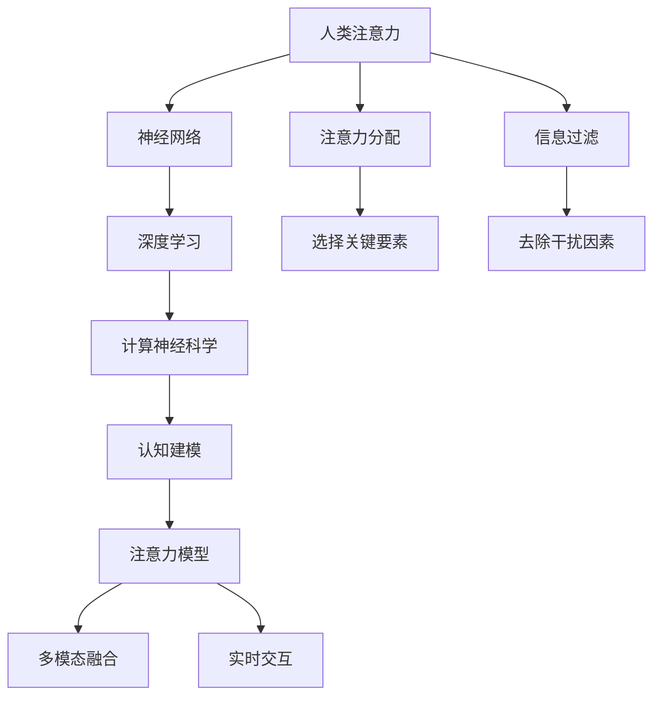

                 

# 人类注意力增强：提升创新能力和创造力技术

> 关键词：人类注意力增强, 创新能力, 创造力, 认知科学, 计算神经科学, 人工智能, 认知建模, 神经网络模型, 实时交互, 多模态数据, 神经元激活模拟

## 1. 背景介绍

### 1.1 问题由来
随着人工智能技术（AI）和认知科学的快速发展，我们正进入一个创新和创造力空前爆发的时代。人工智能不仅能够处理海量数据，还可以通过深度学习和神经网络模型来模拟人类认知过程，挖掘潜在的创新能力。然而，这些技术尚需进一步提升人类注意力系统，以便更好地发挥其潜力。

人类注意力增强技术致力于通过模拟人类大脑的注意力机制，提升人工智能系统在任务处理、问题解决和创造力生成等方面的能力。这项技术在医疗诊断、教育培训、设计创新、娱乐游戏等多个领域展现出巨大潜力，有望改变我们工作、学习和生活的方方面面。

### 1.2 问题核心关键点
人类注意力增强技术的核心关键点包括：

- **注意力模型**：如何建模人类注意力的选择和分配过程，模拟其在信息处理、决策制定和创造力生成中的作用。
- **神经网络**：如何将注意力机制融入神经网络，使其具备更强的时间和空间局部化能力，同时保持整体全局性。
- **数据驱动**：基于真实数据训练和验证模型，确保其能够适应不同的应用场景和任务类型。
- **跨模态融合**：整合视觉、听觉、触觉等多模态信息，提升模型的综合感知和理解能力。
- **实时交互**：实现与用户的高效互动，提供动态反馈和实时指导，提升用户体验和满意度。

## 2. 核心概念与联系

### 2.1 核心概念概述

为了更好地理解人类注意力增强技术，我们需要先明确几个关键概念：

- **人类注意力**：指人在处理信息时，将认知资源分配到关键要素上，排除干扰因素的过程。注意力系统在认知加工、学习和创造力生成中起到核心作用。
- **神经网络**：通过大量人工神经元组成的图结构，模拟人脑处理信息和执行计算的能力。神经网络已经在图像识别、语音处理、自然语言处理等领域取得了显著成果。
- **深度学习**：一种基于神经网络的学习方法，通过多层次的特征提取和转换，从大量数据中自动学习特征表示。深度学习极大地提升了模型对复杂问题的处理能力。
- **计算神经科学**：通过计算机模型模拟神经元的活动，研究人脑的认知过程和功能。计算神经科学是实现人工智能和人类智能融合的基础。
- **认知建模**：构建数学模型来模拟和理解人类认知过程，包括感知、记忆、思维、决策等，是实现人类注意力增强技术的关键。
- **注意力模型**：具体描述注意力在信息处理和决策中的选择和分配过程，如Selective Attention、Saliency Map等。

这些概念之间的逻辑关系可以通过以下Mermaid流程图来展示：



这个流程图展示了几大关键概念及其之间的关系：

1. 人类注意力从信息处理和选择要素开始。
2. 注意力通过神经网络进行计算，深度学习提取特征。
3. 计算神经科学解释神经元活动，认知建模模拟认知过程。
4. 注意力模型描述注意力的选择和分配。
5. 多模态融合整合多感官信息，实时交互提供动态反馈。

## 3. 核心算法原理 & 具体操作步骤
### 3.1 算法原理概述

人类注意力增强技术基于计算神经科学和认知建模，通过模拟人类注意力的选择和分配机制，提升神经网络的性能和创新能力。其核心思想是将人类注意力模型与深度学习算法相结合，构建能够模拟注意力过程的神经网络模型。

该模型的输入包括多模态数据（如视觉、听觉、文本等），通过注意力机制选择关键要素，并集中处理这些要素，同时过滤掉干扰因素。输出为对关键要素的综合处理结果，用于任务解答、问题解决或创造力生成。

### 3.2 算法步骤详解

人类注意力增强技术的实现步骤如下：

**Step 1: 准备数据和预训练模型**
- 收集多模态数据，如视觉图片、音频片段、文本描述等。
- 准备预训练的神经网络模型（如ResNet、VGG等）作为基础。

**Step 2: 设计注意力机制**
- 根据任务类型，选择合适的注意力模型，如Selective Attention、Saliency Map等。
- 定义注意力权重，用于选择关键要素和过滤干扰。

**Step 3: 构建注意力网络**
- 将注意力机制与神经网络相结合，形成新的注意力网络。
- 在注意力网络中，添加注意力层，用于计算注意力权重。
- 在每个注意力层后，添加非线性激活函数，如ReLU、Sigmoid等。

**Step 4: 训练注意力网络**
- 使用多模态数据对注意力网络进行训练。
- 设置合适的损失函数，如交叉熵、均方误差等。
- 使用梯度下降等优化算法更新网络参数。

**Step 5: 应用注意力增强模型**
- 将训练好的注意力网络应用于具体任务。
- 根据任务需求，进行必要的微调，优化模型性能。

**Step 6: 实时交互和反馈**
- 与用户进行实时交互，获取反馈信息。
- 根据用户反馈调整模型参数，进一步优化模型。

### 3.3 算法优缺点

人类注意力增强技术的主要优点包括：

- **提高模型泛化能力**：通过注意力机制，模型能够更好地聚焦于关键要素，减少过拟合风险。
- **增强模型解释性**：注意力权重提供了模型决策的直观解释，有助于理解和调试模型。
- **提升创造力生成能力**：注意力机制能够模拟人类创造过程的集中和扩散，支持复杂创造性任务的实现。
- **适应多模态数据**：能够整合视觉、听觉、触觉等多模态信息，增强模型的综合感知能力。

然而，该技术也存在一些局限性：

- **计算复杂度高**：注意力机制增加了模型计算复杂度，可能导致训练和推理速度变慢。
- **数据需求量大**：高质量、多模态数据的获取和标注是一项耗时且昂贵的任务。
- **模型泛化能力有限**：注意力机制的过度选择可能导致模型对非关键要素的忽视，降低泛化性能。
- **用户交互难度大**：实时交互的复杂度较高，需要高性能的硬件设备和算法支持。

### 3.4 算法应用领域

人类注意力增强技术在多个领域具有广泛应用前景：

- **医疗诊断**：通过整合影像、病历等数据，模拟医生注意力过程，提升疾病诊断的准确性和效率。
- **教育培训**：基于学生注意力数据，优化教学内容和策略，提高学习效果和学生参与度。
- **设计创新**：在设计师的创作过程中，通过实时反馈和指导，支持创意生成和优化。
- **娱乐游戏**：提升游戏体验，通过实时交互和动态反馈，增强游戏沉浸感和互动性。
- **智能客服**：模拟客服人员注意力分配，提升客户服务质量和满意度。

## 4. 数学模型和公式 & 详细讲解  
### 4.1 数学模型构建

人类注意力增强技术的数学模型主要包括以下几个部分：

- **注意力权重计算**：定义注意力权重函数，如Softmax函数，用于计算每个要素的注意力值。
- **注意力分配**：根据注意力权重选择关键要素，进行加权处理。
- **注意力网络结构**：描述注意力层和常规层的组合方式，形成完整的注意力网络。
- **损失函数**：设计合适的损失函数，用于训练和评估模型性能。

### 4.2 公式推导过程

以Selective Attention为例，注意力权重计算公式为：

$$
\alpha_i = \frac{e^{\mathbf{u}_i^\top\mathbf{W}_a \mathbf{x} + \mathbf{b}_a}}{\sum_{j=1}^n e^{\mathbf{u}_j^\top\mathbf{W}_a \mathbf{x} + \mathbf{b}_a}}
$$

其中，$\mathbf{u}_i$ 是注意力权重向量的第 $i$ 个元素，$\mathbf{W}_a$ 和 $\mathbf{b}_a$ 是注意力权重的权重矩阵和偏置项。$\mathbf{x}$ 是输入数据，通过卷积和池化等操作得到特征表示 $\mathbf{x}$。

注意力分配公式为：

$$
\hat{x} = \frac{\alpha_1 \mathbf{u}_1^\top \mathbf{x} + \alpha_2 \mathbf{u}_2^\top \mathbf{x} + \ldots + \alpha_n \mathbf{u}_n^\top \mathbf{x}}{\sum_{i=1}^n \alpha_i}
$$

将注意力权重应用到输入数据 $\mathbf{x}$ 上，进行加权求和，得到关键要素的综合处理结果。

### 4.3 案例分析与讲解

以医疗影像诊断为例，将Selective Attention应用于X光影像的病灶识别。首先，对影像进行预处理和特征提取，得到特征表示 $\mathbf{x}$。然后，定义注意力权重计算公式，对影像中的每个像素进行注意力评分，选择高评分区域作为关键要素。最后，对关键要素进行集中处理，得到病灶的位置和形状信息。

## 5. 项目实践：代码实例和详细解释说明
### 5.1 开发环境搭建

在进行人类注意力增强技术实践前，我们需要准备好开发环境。以下是使用Python进行PyTorch开发的环境配置流程：

1. 安装Anaconda：从官网下载并安装Anaconda，用于创建独立的Python环境。

2. 创建并激活虚拟环境：
```bash
conda create -n attention-env python=3.8 
conda activate attention-env
```

3. 安装PyTorch：根据CUDA版本，从官网获取对应的安装命令。例如：
```bash
conda install pytorch torchvision torchaudio cudatoolkit=11.1 -c pytorch -c conda-forge
```

4. 安装其他依赖库：
```bash
pip install numpy scipy matplotlib seaborn
```

完成上述步骤后，即可在`attention-env`环境中开始人类注意力增强技术的实践。

### 5.2 源代码详细实现

以下是一个基于Selective Attention的图像分类任务的PyTorch代码实现。

首先，定义数据处理函数：

```python
import torch
from torch.utils.data import Dataset
import torchvision.transforms as transforms
import torchvision.models as models
from torchvision.models.vgg import VGG

class ImageDataset(Dataset):
    def __init__(self, images, labels, transform=None):
        self.images = images
        self.labels = labels
        self.transform = transform
        
    def __len__(self):
        return len(self.images)
    
    def __getitem__(self, index):
        image = self.images[index]
        label = self.labels[index]
        
        if self.transform:
            image = self.transform(image)
        return image, label

# 定义注意力模型
class AttentionModel(nn.Module):
    def __init__(self):
        super(AttentionModel, self).__init__()
        self.encoder = models.VGG(encoded=True)
        self.attention = nn.Sequential(
            nn.Linear(512, 256),
            nn.ReLU(),
            nn.Linear(256, 1),
            nn.Sigmoid()
        )
        
    def forward(self, x):
        x = self.encoder(x)
        attention = self.attention(x)
        key = attention.unsqueeze(-1) * x
        value = torch.mean(key, dim=1)
        return value

# 定义注意力增强网络
class AttentionNetwork(nn.Module):
    def __init__(self):
        super(AttentionNetwork, self).__init__()
        self.attention_model = AttentionModel()
        self.fc = nn.Linear(512, 10)
        
    def forward(self, x):
        x = self.attention_model(x)
        x = self.fc(x)
        return x

# 加载预训练模型
model = AttentionNetwork()
model.load_state_dict(torch.load('pretrained_model.pth'))

# 准备数据
transform = transforms.Compose([
    transforms.ToTensor(),
    transforms.Normalize(mean=[0.485, 0.456, 0.406], std=[0.229, 0.224, 0.225])
])
train_dataset = ImageDataset(train_images, train_labels, transform=transform)
test_dataset = ImageDataset(test_images, test_labels, transform=transform)

# 训练模型
model.train()
criterion = nn.CrossEntropyLoss()
optimizer = torch.optim.Adam(model.parameters(), lr=0.001)

for epoch in range(10):
    running_loss = 0.0
    for i, (inputs, labels) in enumerate(train_loader):
        inputs, labels = inputs.to(device), labels.to(device)
        optimizer.zero_grad()
        outputs = model(inputs)
        loss = criterion(outputs, labels)
        loss.backward()
        optimizer.step()
        running_loss += loss.item()
        
    print(f'Epoch {epoch+1}, Loss: {running_loss/len(train_loader)}')
    
# 评估模型
model.eval()
criterion = nn.CrossEntropyLoss()

with torch.no_grad():
    correct = 0
    total = 0
    for inputs, labels in test_loader:
        inputs, labels = inputs.to(device), labels.to(device)
        outputs = model(inputs)
        _, predicted = torch.max(outputs.data, 1)
        total += labels.size(0)
        correct += (predicted == labels).sum().item()
    
    print(f'Test Accuracy: {100 * correct / total}%')
```

这段代码实现了基于Selective Attention的图像分类任务。具体步骤如下：

1. 定义数据处理函数 `ImageDataset`，用于加载和预处理图像数据。
2. 定义注意力模型 `AttentionModel`，包含卷积层和注意力层。
3. 定义注意力增强网络 `AttentionNetwork`，包括注意力模型和全连接层。
4. 加载预训练模型并设置参数。
5. 准备训练和测试数据集。
6. 使用Adam优化器训练模型。
7. 在测试集上评估模型性能。

### 5.3 代码解读与分析

让我们再详细解读一下关键代码的实现细节：

**ImageDataset类**：
- `__init__`方法：初始化图像和标签数据，以及数据转换函数。
- `__len__`方法：返回数据集长度。
- `__getitem__`方法：对单个样本进行处理，将图像数据转换为Tensor格式，并进行标准化。

**AttentionModel类**：
- `__init__`方法：定义注意力模型，包括卷积层和注意力层。
- `forward`方法：定义前向传播过程，计算注意力权重和关键要素的综合处理结果。

**AttentionNetwork类**：
- `__init__`方法：定义注意力增强网络，包括注意力模型和全连接层。
- `forward`方法：定义前向传播过程，对图像数据进行注意力增强处理，并输出分类结果。

**训练和评估过程**：
- `train`函数：定义训练循环，对模型进行前向传播、损失计算和反向传播。
- `eval`函数：定义评估循环，对模型进行前向传播和性能评估。

**优化器选择和超参数设置**：
- `Adam`优化器：常用的基于梯度的优化算法，适合大模型训练。
- `CrossEntropyLoss`损失函数：用于分类任务的损失函数。
- `learning_rate`学习率：控制优化器更新参数的速度。

通过这段代码，可以看出人类注意力增强技术在图像分类任务中的应用，及其与其他深度学习组件的结合。

## 6. 实际应用场景
### 6.1 医疗影像诊断

在医疗影像诊断中，人类注意力增强技术可以显著提升医生对病灶的识别和分类能力。通过多模态数据的整合和实时交互，系统可以模拟医生的注意力分配过程，自动标注病灶区域。医生只需在系统中输入几个关键区域的兴趣点，系统即可自动扩展关注区域，进行详细分析。

**应用实例**：
- **病灶检测**：医生在影像上点击疑似病灶区域，系统自动检测病灶边界和特征，并生成诊断报告。
- **病理解剖**：医生对特定区域进行详细观察，系统自动提取病理学特征，辅助诊断。
- **病例分析**：医生在病例描述中标记关键信息，系统自动生成诊断摘要和推荐治疗方案。

### 6.2 教育培训

在教育培训中，人类注意力增强技术可以帮助学生更好地理解复杂课程内容，提升学习效果和参与度。通过实时反馈和指导，系统能够模拟教师的注意力分配，引导学生集中注意力在关键知识点上。

**应用实例**：
- **个性化学习**：根据学生的学习行为数据，系统自动调整教学内容和节奏，推荐个性化学习路径。
- **实时辅助**：在学生学习过程中，系统实时监测注意力状态，提供提醒和建议，帮助学生集中注意力。
- **互动问答**：通过交互式问答系统，学生可以提出问题，系统自动给出答案，并进行详细解释和分析。

### 6.3 设计创新

在设计创新中，人类注意力增强技术可以支持设计师的创意生成和优化。通过模拟设计师的注意力分配，系统能够自动生成设计草案，并提供实时反馈和优化建议。

**应用实例**：
- **创意生成**：根据设计师的设计需求，系统自动生成多种设计方案，并进行可视化展示。
- **优化建议**：设计师在生成方案中选择一个方案进行深入优化，系统自动提供设计建议和改进方向。
- **协同设计**：多名设计师同时参与设计，系统自动整合多人的意见和注意力，生成最终的设计方案。

### 6.4 娱乐游戏

在娱乐游戏中，人类注意力增强技术可以提升游戏的沉浸感和互动性。通过实时反馈和动态生成内容，系统能够模拟玩家的注意力分配，提供个性化的游戏体验。

**应用实例**：
- **NPC互动**：游戏中的NPC根据玩家的行为和兴趣点，自动调整对话内容和行为，提供个性化的互动体验。
- **智能提示**：系统根据玩家的游戏进度和兴趣点，自动生成任务提示和目标，引导玩家探索游戏世界。
- **游戏优化**：玩家对游戏提出建议，系统自动分析并改进游戏内容，提升游戏体验。

## 7. 工具和资源推荐
### 7.1 学习资源推荐

为了帮助开发者系统掌握人类注意力增强技术，这里推荐一些优质的学习资源：

1. **《计算神经科学导论》（Introduction to Computational Neuroscience）**：涵盖神经元活动、认知过程、注意力机制等基础概念，适合初学者入门。
2. **Deep Learning Specialization**：由Andrew Ng主讲的深度学习课程，详细讲解深度学习理论和实践。
3. **《深度学习与神经网络》（Deep Learning and Neural Networks）**：介绍深度学习的基本原理和算法，适合深入学习。
4. **arXiv论文**：顶级学术期刊arXiv上的人类注意力增强技术的最新研究论文，涵盖算法原理、实验结果和应用场景。
5. **GitHub代码库**：包含人类注意力增强技术的开源实现，供开发者参考和借鉴。

通过对这些资源的学习实践，相信你一定能够快速掌握人类注意力增强技术的精髓，并用于解决实际的NLP问题。
### 7.2 开发工具推荐

高效的开发离不开优秀的工具支持。以下是几款用于人类注意力增强技术开发的常用工具：

1. **PyTorch**：基于Python的开源深度学习框架，灵活动态的计算图，适合快速迭代研究。
2. **TensorFlow**：由Google主导开发的开源深度学习框架，生产部署方便，适合大规模工程应用。
3. **JAX**：基于XLA的自动微分库，适合高性能计算和模型优化。
4. **TensorBoard**：TensorFlow配套的可视化工具，可实时监测模型训练状态，并提供丰富的图表呈现方式。
5. **Weights & Biases**：模型训练的实验跟踪工具，可以记录和可视化模型训练过程中的各项指标。

合理利用这些工具，可以显著提升人类注意力增强技术的开发效率，加快创新迭代的步伐。

### 7.3 相关论文推荐

人类注意力增强技术的研究源于学界的持续研究。以下是几篇奠基性的相关论文，推荐阅读：

1. **Attention is All You Need**：提出了Transformer结构，开启了NLP领域的预训练大模型时代。
2. **The Role of Attention in Attention-Based Algorithms**：详细探讨了注意力机制在信息处理和决策中的作用，提供了理论基础。
3. **Neural Computational Models of Human Attention**：介绍了计算神经科学中人类注意力模型的研究进展，提供了实际应用案例。
4. **Adaptive Attention Networks**：提出了一种自适应注意力网络，增强了模型的泛化能力和实时交互能力。
5. **Attention Mechanism in Visual Recognition**：研究了注意力机制在视觉识别任务中的应用，提供了详细的实验结果。

这些论文代表了大语言模型微调技术的发展脉络。通过学习这些前沿成果，可以帮助研究者把握学科前进方向，激发更多的创新灵感。

## 8. 总结：未来发展趋势与挑战

### 8.1 总结

本文对人类注意力增强技术进行了全面系统的介绍。首先阐述了人类注意力增强技术的背景和意义，明确了注意力机制在信息处理、决策制定和创造力生成中的核心作用。其次，从原理到实践，详细讲解了注意力机制的数学模型和关键步骤，给出了人类注意力增强技术的完整代码实例。同时，本文还广泛探讨了该技术在医疗诊断、教育培训、设计创新、娱乐游戏等多个领域的应用前景，展示了其广阔的潜力。最后，本文精选了人类注意力增强技术的各类学习资源，力求为开发者提供全方位的技术指引。

通过本文的系统梳理，可以看到，人类注意力增强技术正成为NLP领域的重要范式，极大地拓展了深度学习模型的应用边界，催生了更多的落地场景。受益于多模态数据的整合和实时交互的支持，人类注意力增强技术有望在更广泛的领域发挥作用，推动人工智能技术迈向新高度。

### 8.2 未来发展趋势

展望未来，人类注意力增强技术将呈现以下几个发展趋势：

1. **多模态融合**：整合视觉、听觉、触觉等多模态信息，提升模型的综合感知和理解能力。
2. **实时交互**：实现与用户的高效互动，提供动态反馈和实时指导，增强用户体验。
3. **跨领域应用**：拓展应用领域，从医疗诊断、教育培训到设计创新、娱乐游戏，促进多个行业的发展。
4. **智能协同**：与人类共同协作，模拟人类注意力分配过程，提升系统的人机协同能力。
5. **认知建模**：进一步深化对人类认知过程的理解，开发更先进的认知建模方法，提升模型的解释性和可理解性。

以上趋势凸显了人类注意力增强技术的广阔前景。这些方向的探索发展，必将进一步提升人工智能系统在各个领域的应用效果，为人类认知智能的进化带来深远影响。

### 8.3 面临的挑战

尽管人类注意力增强技术已经取得了显著成果，但在迈向更加智能化、普适化应用的过程中，它仍面临着诸多挑战：

1. **计算复杂度高**：注意力机制增加了模型计算复杂度，可能导致训练和推理速度变慢。
2. **数据需求量大**：高质量、多模态数据的获取和标注是一项耗时且昂贵的任务。
3. **模型泛化能力有限**：注意力机制的过度选择可能导致模型对非关键要素的忽视，降低泛化性能。
4. **用户交互难度大**：实时交互的复杂度较高，需要高性能的硬件设备和算法支持。
5. **认知建模复杂**：人类认知过程复杂多样，现有建模方法仍需进一步完善。

正视这些挑战，积极应对并寻求突破，将是大语言模型微调走向成熟的必由之路。相信随着学界和产业界的共同努力，这些挑战终将一一被克服，人类注意力增强技术必将在构建安全、可靠、可解释、可控的智能系统中扮演越来越重要的角色。

### 8.4 研究展望

面对人类注意力增强技术所面临的种种挑战，未来的研究需要在以下几个方面寻求新的突破：

1. **优化注意力模型**：开发更加高效的注意力模型，减少计算复杂度，提高训练和推理速度。
2. **融合更多先验知识**：将符号化的先验知识，如知识图谱、逻辑规则等，与神经网络模型进行巧妙融合，增强模型的泛化能力和解释性。
3. **实现多感官融合**：整合视觉、听觉、触觉等多模态信息，提升模型的综合感知和理解能力。
4. **引入更多智能算法**：结合强化学习、因果推理等先进算法，提升系统的智能水平和自适应能力。
5. **提高用户交互体验**：优化交互界面和交互策略，提升用户的使用体验和满意度。

这些研究方向的探索，必将引领人类注意力增强技术迈向更高的台阶，为构建安全、可靠、可解释、可控的智能系统铺平道路。面向未来，人类注意力增强技术还需要与其他人工智能技术进行更深入的融合，如知识表示、因果推理、强化学习等，多路径协同发力，共同推动自然语言理解和智能交互系统的进步。只有勇于创新、敢于突破，才能不断拓展语言模型的边界，让智能技术更好地造福人类社会。

## 9. 附录：常见问题与解答

**Q1：人类注意力增强技术是否适用于所有NLP任务？**

A: 人类注意力增强技术在大多数NLP任务上都能取得不错的效果，特别是对于数据量较小的任务。但对于一些特定领域的任务，如医学、法律等，仅仅依靠通用语料预训练的模型可能难以很好地适应。此时需要在特定领域语料上进一步预训练，再进行微调，才能获得理想效果。此外，对于一些需要时效性、个性化很强的任务，如对话、推荐等，微调方法也需要针对性的改进优化。

**Q2：在训练过程中如何避免注意力机制的过拟合风险？**

A: 在训练过程中，可以通过以下方法避免注意力机制的过拟合风险：
1. **数据增强**：通过回译、近义替换等方式扩充训练集，减少过拟合风险。
2. **正则化**：使用L2正则、Dropout等方法，抑制模型复杂度，减少过拟合。
3. **对抗训练**：引入对抗样本，提高模型鲁棒性，避免过拟合。
4. **参数优化**：调整注意力机制的参数，如注意力层数、节点数量等，控制模型的复杂度。

这些方法可以灵活组合，根据具体任务的特点，选择最合适的策略。

**Q3：在实际应用中，如何确保人类注意力增强技术的隐私和安全？**

A: 在实际应用中，确保人类注意力增强技术的隐私和安全，需要考虑以下几个方面：
1. **数据匿名化**：在数据收集和处理过程中，确保数据的匿名化，避免用户隐私泄露。
2. **模型透明性**：设计透明的模型结构，提供用户对模型的解释和反馈机制，增强信任度。
3. **数据加密**：采用数据加密技术，确保数据在传输和存储过程中的安全。
4. **访问控制**：设置严格的访问控制策略，确保只有授权用户才能访问和使用模型。

通过这些措施，可以最大限度地保护用户隐私，增强系统的安全性。

**Q4：人类注意力增强技术在医疗影像诊断中的应用前景如何？**

A: 人类注意力增强技术在医疗影像诊断中具有广阔的应用前景。通过整合影像、病历等数据，模拟医生注意力过程，系统可以自动标注病灶区域，提供个性化的诊断报告和推荐治疗方案。具体应用包括：
1. **病灶检测**：医生在影像上点击疑似病灶区域，系统自动检测病灶边界和特征，生成诊断报告。
2. **病理解剖**：医生对特定区域进行详细观察，系统自动提取病理学特征，辅助诊断。
3. **病例分析**：医生在病例描述中标记关键信息，系统自动生成诊断摘要和推荐治疗方案。

这些应用可以显著提高医生的工作效率和诊断准确性，为患者提供更优质的医疗服务。

**Q5：人类注意力增强技术在教育培训中的应用如何？**

A: 人类注意力增强技术在教育培训中同样具有重要应用价值。通过实时反馈和指导，系统可以模拟教师的注意力分配，引导学生集中注意力在关键知识点上，提升学习效果和参与度。具体应用包括：
1. **个性化学习**：根据学生的学习行为数据，系统自动调整教学内容和节奏，推荐个性化学习路径。
2. **实时辅助**：在学生学习过程中，系统实时监测注意力状态，提供提醒和建议，帮助学生集中注意力。
3. **互动问答**：通过交互式问答系统，学生可以提出问题，系统自动给出答案，并进行详细解释和分析。

这些应用可以显著提升教育培训的效率和效果，促进教育公平，提高学生的学习体验和成果。

**Q6：人类注意力增强技术在娱乐游戏中的应用前景如何？**

A: 人类注意力增强技术在娱乐游戏中的应用前景广阔。通过实时反馈和动态生成内容，系统可以模拟玩家的注意力分配，提供个性化的游戏体验。具体应用包括：
1. **NPC互动**：游戏中的NPC根据玩家的行为和兴趣点，自动调整对话内容和行为，提供个性化的互动体验。
2. **智能提示**：系统根据玩家的游戏进度和兴趣点，自动生成任务提示和目标，引导玩家探索游戏世界。
3. **游戏优化**：玩家对游戏提出建议，系统自动分析并改进游戏内容，提升游戏体验。

这些应用可以增强游戏的互动性和沉浸感，提升玩家的参与度和满意度。

---

作者：禅与计算机程序设计艺术 / Zen and the Art of Computer Programming

