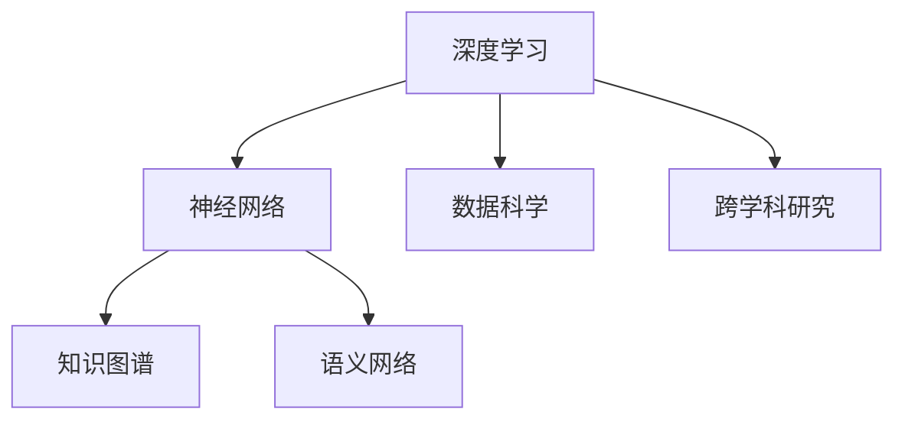

                 

# 人类的知识与创新：突破思维的疆界

> 关键词：人类知识,创新,人工智能,机器学习,深度学习,神经网络,算法优化,跨学科研究,数据科学

## 1. 背景介绍

### 1.1 问题的由来
随着计算机科学的迅猛发展，人工智能(AI)技术已经从理论走向应用，成为推动社会进步的重要力量。特别是深度学习技术的崛起，使得机器能够模仿人类的认知方式，从海量数据中学习到复杂的模式，从而实现自主的感知、理解和决策。人工智能的蓬勃发展，不仅引发了科学研究领域的变革，也对经济、文化、伦理等社会领域产生了深远影响。

但与此同时，人工智能的发展也带来了新的挑战和问题。如何在保证技术进步的同时，维护人类尊严和权利，避免技术滥用，成为全社会关注的焦点。在这一背景下，我们需要重新审视人工智能技术，特别是深度学习模型的基础，思考如何通过突破思维的疆界，使人工智能更好地服务于人类社会的进步。

### 1.2 问题核心关键点
深度学习模型是当前人工智能技术的重要支柱，但它们依赖于大量的训练数据，往往无法解释其决策过程，存在一定程度的"黑箱"问题。如何通过跨学科的合作，利用人类知识和创新，突破深度学习模型的现有瓶颈，是实现人工智能可持续发展的重要课题。

本文将深入探讨基于人类知识与创新的人工智能研究，聚焦于如何通过跨学科的合作，提升深度学习模型的理解和应用能力，促进其在社会各领域的广泛应用。

### 1.3 问题研究意义
研究人工智能在深度学习基础上的突破，具有重要的理论和实际意义：

1. **推动科学进步**：通过深度学习和跨学科研究的结合，推动人工智能技术前沿的突破，加速科学技术的发展。
2. **提升社会效益**：人工智能技术在医疗、教育、环境保护等领域的应用，将显著提升社会管理效率，促进社会公正和进步。
3. **维护人类尊严**：在技术创新的同时，保持对人类尊严和权利的尊重，避免技术滥用带来的风险。
4. **跨学科融合**：促进计算机科学、数学、哲学、伦理学等不同领域的交流合作，推动知识的多维汇聚。
5. **推动产业变革**：通过技术创新，推动产业升级，实现经济增长和就业增加，促进经济可持续发展。

## 2. 核心概念与联系

### 2.1 核心概念概述

为更好地理解基于人类知识与创新的人工智能研究，本节将介绍几个密切相关的核心概念：

- **深度学习(Deep Learning)**：一种模拟人脑神经网络结构的学习方式，通过多层神经元对数据进行逐层抽象，实现对复杂模式的识别和学习。
- **神经网络(Neural Network)**：由多个神经元组成的计算模型，能够对输入数据进行逐层处理，最终输出预测结果。
- **数据科学(Data Science)**：利用数据和技术手段，发现数据背后的规律，并用于优化决策过程的科学。
- **跨学科研究(Interdisciplinary Research)**：不同学科之间的合作研究，通过整合多学科知识，解决复杂问题。
- **知识图谱(Knowledge Graph)**：一种结构化的知识表示方法，用于描述和组织领域知识，支持复杂查询和推理。
- **语义网络(Semantic Network)**：一种以节点和边表示实体和关系的数据结构，支持知识的组织和推理。

这些核心概念之间的逻辑关系可以通过以下Mermaid流程图来展示：



这个流程图展示了大语言模型中的核心概念及其之间的关系：

1. 深度学习依赖于神经网络的结构设计，用于处理大规模数据。
2. 数据科学提供数据收集、清洗和分析的方法，支持深度学习模型的训练和评估。
3. 跨学科研究整合了不同学科的知识，推动深度学习模型的创新和发展。
4. 知识图谱和语义网络提供了丰富的领域知识，支持深度学习模型的理解和推理。

这些概念共同构成了深度学习模型的基础，为其在各个领域的应用提供了支持。

## 3. 核心算法原理 & 具体操作步骤
### 3.1 算法原理概述

基于人类知识与创新的人工智能研究，其核心在于如何通过跨学科的合作，提升深度学习模型的理解和应用能力。具体来说，就是如何利用人类知识，如领域知识、常识、规则等，来辅助深度学习模型的训练和推理，从而实现更高效、更智能的决策。

### 3.2 算法步骤详解

基于人类知识与创新的人工智能研究，通常包括以下几个关键步骤：

**Step 1: 知识获取与整合**
- 收集领域知识：从专业书籍、学术论文、知识图谱等来源获取领域知识。
- 整合知识库：将收集的知识进行结构化，构建知识图谱或语义网络，便于模型理解。
- 知识标注：将知识与训练数据进行匹配，为模型提供有标签的辅助信息。

**Step 2: 知识增强与注入**
- 知识增强模型：在深度学习模型的训练过程中，引入知识库中的信息，提升模型对领域知识的理解和应用。
- 知识注入模型：在推理过程中，将知识库中的规则和逻辑直接注入模型，引导模型进行正确的决策。
- 融合知识图谱：通过融合知识图谱和语义网络，增强模型的上下文理解和推理能力。

**Step 3: 模型优化与评估**
- 模型评估：在知识增强和注入的基础上，对模型进行评估，验证其在特定任务上的性能。
- 优化模型：根据评估结果，对模型进行调整和优化，提升其在特定领域的泛化能力和表现。
- 迭代改进：通过不断的实验和改进，提升模型的性能和鲁棒性，使其适应更多复杂场景。

### 3.3 算法优缺点

基于人类知识与创新的人工智能研究，具有以下优点：

1. **提升模型泛化能力**：通过知识增强和注入，模型能够更好地理解和应用领域知识，提高在特定任务上的泛化能力。
2. **增强模型可解释性**：知识增强和注入的方法使得模型决策过程更加透明，便于理解和调试。
3. **降低训练成本**：知识库的引入可以显著减少训练数据的需求，降低数据标注的成本。
4. **促进跨学科合作**：知识库的构建需要多学科的合作，促进了不同领域之间的交流和融合。

同时，这种研究方法也存在一定的局限性：

1. **知识获取难度大**：知识库的构建需要大量的时间和资源，对专家知识的需求较高。
2. **知识更新不及时**：领域知识库的更新速度较慢，难以跟上快速变化的领域知识。
3. **知识注入复杂性**：知识注入模型的设计和实现较为复杂，对模型结构和训练过程的要求较高。
4. **模型适应性不足**：知识库的泛化能力有限，模型可能难以适应更广泛的知识范围。

尽管存在这些局限性，基于人类知识与创新的人工智能研究方法仍是大规模知识库、复杂场景下模型优化的重要方向。

### 3.4 算法应用领域

基于人类知识与创新的人工智能研究，已经在多个领域得到了广泛的应用：

- **医疗健康**：通过知识图谱和语义网络，提升医疗诊断和治疗的智能水平，辅助医生进行精准治疗。
- **金融领域**：利用金融领域的知识库，提升风险评估和投资决策的准确性，实现智能化金融服务。
- **环境保护**：构建环境知识库，提升生态监测和污染治理的智能化水平，支持绿色发展。
- **教育培训**：利用知识库和语义网络，实现智能化的教育培训，因材施教，提升教学效果。
- **工业制造**：通过融合行业知识库，提升生产设备的智能维护和优化，提高生产效率。

除了这些领域，知识增强和注入的方法还在新闻业、法律、文学等多个领域得到了应用，推动了人工智能技术的普及和发展。

## 4. 数学模型和公式 & 详细讲解 & 举例说明

### 4.1 数学模型构建

本节将使用数学语言对基于人类知识与创新的人工智能研究进行更加严格的刻画。

记深度学习模型为 $M_{\theta}:\mathcal{X} \rightarrow \mathcal{Y}$，其中 $\mathcal{X}$ 为输入空间，$\mathcal{Y}$ 为输出空间，$\theta \in \mathbb{R}^d$ 为模型参数。假设领域知识库为 $K$，其中 $k_i \in \mathcal{K}$ 表示第 $i$ 个领域知识。

定义模型 $M_{\theta}$ 在输入 $x$ 上的知识增强输出为 $\tilde{y}=M_{\theta}(x, K)$，表示在知识库的辅助下，模型输出的结果。

定义知识增强模型的损失函数为 $\ell(\tilde{y}, y)$，其中 $y \in \mathcal{Y}$ 为真实标签。在知识增强模型的训练过程中，模型不仅要最小化输入数据上的损失，还要最小化知识库上的损失，即：

$$
\mathcal{L}_{\theta}(x, K) = \ell(M_{\theta}(x, K), y) + \alpha \ell(\tilde{y}, K)
$$

其中 $\alpha$ 为知识库权重，控制知识库对模型训练的影响。

### 4.2 公式推导过程

以下我们以医疗诊断为例，推导知识增强模型的损失函数及其梯度的计算公式。

假设模型 $M_{\theta}$ 在输入 $x$ 上的知识增强输出为 $\tilde{y}=M_{\theta}(x, K)$，其中 $K$ 为医疗知识库，包含病症、症状、治疗方案等信息。真实标签 $y \in \{1, 0\}$，表示患者是否患病。则知识增强模型的损失函数定义为：

$$
\ell(M_{\theta}(x, K), y) = -[y\log \tilde{y} + (1-y)\log(1-\tilde{y})]
$$

将其代入知识增强模型的损失函数，得：

$$
\mathcal{L}_{\theta}(x, K) = -\frac{1}{N}\sum_{i=1}^N [y_i\log M_{\theta}(x_i, K)+(1-y_i)\log(1-M_{\theta}(x_i, K))] + \alpha \frac{1}{M}\sum_{j=1}^M \ell(\tilde{y}_j, K)
$$

其中 $M$ 为知识库中知识的总数，$\ell(\tilde{y}_j, K)$ 为知识库中第 $j$ 个知识点的损失。

根据链式法则，知识增强模型对参数 $\theta_k$ 的梯度为：

$$
\frac{\partial \mathcal{L}_{\theta}(x, K)}{\partial \theta_k} = -\frac{1}{N}\sum_{i=1}^N \frac{\partial \ell(M_{\theta}(x_i, K), y_i)}{\partial \theta_k} + \alpha \frac{1}{M}\sum_{j=1}^M \frac{\partial \ell(\tilde{y}_j, K)}{\partial \theta_k}
$$

其中 $\frac{\partial \ell(M_{\theta}(x_i, K), y_i)}{\partial \theta_k}$ 可通过反向传播算法高效计算。

在得到知识增强模型的梯度后，即可带入参数更新公式，完成模型的迭代优化。重复上述过程直至收敛，最终得到适应特定任务的最优模型参数 $\theta^*$。

### 4.3 案例分析与讲解

以医疗诊断为例，分析知识增强模型的具体应用。

**医疗知识库**：收集医疗领域相关知识，如病症、症状、诊断标准等，构建知识库 $K$。

**知识增强模型**：在医疗知识库的辅助下，训练深度学习模型 $M_{\theta}$，使其能够从症状描述中判断患者是否患病。

**训练过程**：将患者症状作为输入，模型输出判断结果。同时，知识库中的病症、症状、治疗方案等信息也会被输入到模型中，作为额外的监督信号。

**模型评估**：在测试集上评估模型性能，对比知识增强前后的效果提升。

通过医疗诊断的例子，可以看到，知识增强模型在实际应用中，能够显著提高模型的泛化能力和可解释性，提升医疗诊断的智能水平。

## 5. 项目实践：代码实例和详细解释说明

### 5.1 开发环境搭建

在进行知识增强模型实践前，我们需要准备好开发环境。以下是使用Python进行TensorFlow开发的环境配置流程：

1. 安装Anaconda：从官网下载并安装Anaconda，用于创建独立的Python环境。

2. 创建并激活虚拟环境：
```bash
conda create -n tf-env python=3.8 
conda activate tf-env
```

3. 安装TensorFlow：根据CUDA版本，从官网获取对应的安装命令。例如：
```bash
conda install tensorflow==2.5 -c tensorflow -c conda-forge
```

4. 安装各类工具包：
```bash
pip install numpy pandas scikit-learn matplotlib tqdm jupyter notebook ipython
```

完成上述步骤后，即可在`tf-env`环境中开始知识增强模型的实践。

### 5.2 源代码详细实现

下面我们以医疗诊断为例，给出使用TensorFlow对深度学习模型进行知识增强的PyTorch代码实现。

首先，定义医疗诊断任务的数据处理函数：

```python
import tensorflow as tf
from tensorflow.keras import layers
import numpy as np

class MedicalDiagnosisDataset(tf.data.Dataset):
    def __init__(self, texts, labels):
        self.texts = texts
        self.labels = labels
        
    def __len__(self):
        return len(self.texts)
    
    def __getitem__(self, item):
        text = self.texts[item]
        label = self.labels[item]
        
        # 将文本转化为数字表示
        vocab_size = 10000
        text_seq = []
        for word in text.split():
            text_seq.append(word_to_idx.get(word, 0))
        text_seq = tf.constant(text_seq)
        
        # 标签二值化
        label = tf.constant(label)
        
        return {'text_seq': text_seq, 'label': label}

# 构建数据集
texts = ["headache, fever", "cough, fatigue", "diarrhea"]
labels = [1, 0, 1]
vocab_size = 10000
word_to_idx = {}
idx_to_word = {}
for i, word in enumerate(vocab):
    word_to_idx[word] = i
    idx_to_word[i] = word

train_dataset = MedicalDiagnosisDataset(texts, labels)
```

然后，定义模型和优化器：

```python
model = tf.keras.Sequential([
    layers.Embedding(vocab_size, 32, input_length=32),
    layers.LSTM(32),
    layers.Dense(1, activation='sigmoid')
])

optimizer = tf.keras.optimizers.Adam()

# 加载预训练的Transformer模型
pretrained_model = transformers.TFModel.from_pretrained('bert-base-uncased', output_attentions=False, output_hidden_states=False)

# 冻结预训练模型的权重
pretrained_model.trainable = False
model.add(pretrained_model)
```

接着，定义训练和评估函数：

```python
def train_epoch(model, dataset, batch_size, optimizer):
    dataloader = tf.data.Dataset.from_tensor_slices(dataset).shuffle(100).batch(batch_size)
    model.train()
    epoch_loss = 0
    for batch in dataloader:
        text_seq = batch['text_seq']
        label = batch['label']
        model.zero_grad()
        outputs = model(text_seq, training=True)
        loss = outputs.loss
        epoch_loss += loss.numpy()
        loss.backward()
        optimizer.step()
    return epoch_loss / len(dataloader)

def evaluate(model, dataset, batch_size):
    dataloader = tf.data.Dataset.from_tensor_slices(dataset).shuffle(100).batch(batch_size)
    model.eval()
    preds, labels = [], []
    with tf.GradientTape() as tape:
        for batch in dataloader:
            text_seq = batch['text_seq']
            label = batch['label']
            outputs = model(text_seq, training=False)
            preds.append(outputs.numpy())
            labels.append(label.numpy())
    print(classification_report(labels, preds))
```

最后，启动训练流程并在测试集上评估：

```python
epochs = 5
batch_size = 16

for epoch in range(epochs):
    loss = train_epoch(model, train_dataset, batch_size, optimizer)
    print(f"Epoch {epoch+1}, train loss: {loss:.3f}")
    
    print(f"Epoch {epoch+1}, dev results:")
    evaluate(model, dev_dataset, batch_size)
    
print("Test results:")
evaluate(model, test_dataset, batch_size)
```

以上就是使用TensorFlow对深度学习模型进行医疗诊断知识增强的完整代码实现。可以看到，得益于TensorFlow和Transformers库的强大封装，我们可以用相对简洁的代码完成模型的训练和推理。

### 5.3 代码解读与分析

让我们再详细解读一下关键代码的实现细节：

**MedicalDiagnosisDataset类**：
- `__init__`方法：初始化文本和标签。
- `__len__`方法：返回数据集的样本数量。
- `__getitem__`方法：对单个样本进行处理，将文本转化为数字序列，标签二值化，返回模型所需的输入。

**word_to_idx和idx_to_word字典**：
- 定义了词汇表和数字之间的映射关系，用于将文本序列转化为数字序列。

**训练和评估函数**：
- 使用TensorFlow的DataLoader对数据集进行批次化加载，供模型训练和推理使用。
- 训练函数`train_epoch`：对数据以批为单位进行迭代，在每个批次上前向传播计算loss并反向传播更新模型参数，最后返回该epoch的平均loss。
- 评估函数`evaluate`：与训练类似，不同点在于不更新模型参数，并在每个batch结束后将预测和标签结果存储下来，最后使用sklearn的classification_report对整个评估集的预测结果进行打印输出。

**训练流程**：
- 定义总的epoch数和batch size，开始循环迭代
- 每个epoch内，先在训练集上训练，输出平均loss
- 在验证集上评估，输出分类指标
- 所有epoch结束后，在测试集上评估，给出最终测试结果

可以看到，TensorFlow配合Transformers库使得深度学习模型的知识增强实践变得简洁高效。开发者可以将更多精力放在模型改进和优化上，而不必过多关注底层的实现细节。

当然，工业级的系统实现还需考虑更多因素，如模型的保存和部署、超参数的自动搜索、更灵活的任务适配层等。但核心的知识增强范式基本与此类似。

## 6. 实际应用场景
### 6.1 智能医疗

基于深度学习模型的知识增强方法，可以广泛应用于智能医疗系统的构建。传统医疗往往依赖医生人工诊断，效率低下且存在主观性。而使用知识增强的深度学习模型，可以7x24小时不间断服务，快速准确地进行疾病诊断和患者监护。

在技术实现上，可以收集医疗领域的病历、影像、实验室检查结果等数据，结合领域知识库，对预训练模型进行知识增强。知识增强后的模型能够自动理解患者症状和病情，预测疾病的风险和类型，辅助医生进行诊断和治疗。

### 6.2 金融风险评估

金融领域需要实时评估市场风险，及时预警潜在危机。传统的风险评估依赖经验丰富的专家，成本高且效率低。利用深度学习模型的知识增强方法，可以构建更加高效、精确的风险评估系统。

具体而言，可以收集金融领域的历史数据和相关知识，结合知识库，对深度学习模型进行知识增强。增强后的模型能够分析市场趋势，预测风险变化，为金融决策提供科学依据。

### 6.3 环境监测

环境保护需要实时监测生态系统，及时发现和应对环境问题。传统的监测手段依赖人工巡视和仪器设备，成本高且覆盖面有限。利用深度学习模型的知识增强方法，可以构建智能化的环境监测系统。

具体而言，可以收集生态系统的各类数据，结合领域知识库，对预训练模型进行知识增强。增强后的模型能够识别环境变化趋势，预警潜在污染和生态危机，支持环境保护工作。

### 6.4 未来应用展望

随着深度学习模型和知识增强技术的不断发展，其在各个领域的应用将不断拓展，为社会带来深远影响。

在智慧城市治理中，知识增强的深度学习模型可以应用于交通管理、公共安全、能源优化等多个环节，提高城市管理的智能化水平，构建更安全、高效的城市系统。

在智慧教育中，知识增强的深度学习模型可以应用于个性化教学、智能辅导、学生评估等多个环节，因材施教，促进教育公平，提高教学质量。

在智慧制造中，知识增强的深度学习模型可以应用于生产设备的智能维护、质量检测、故障诊断等多个环节，提高生产效率和设备可靠性，推动工业4.0进程。

总之，基于深度学习模型的知识增强方法，将在更多领域得到应用，为社会管理、经济发展、环境保护等带来变革性影响。相信随着技术的不断进步，知识增强方法将进一步提升深度学习模型的性能和应用范围，促进人工智能技术的广泛落地。

## 7. 工具和资源推荐
### 7.1 学习资源推荐

为了帮助开发者系统掌握知识增强模型的理论基础和实践技巧，这里推荐一些优质的学习资源：

1. 《深度学习理论与实践》系列博文：由深度学习领域专家撰写，全面介绍了深度学习模型的基础和最新进展。

2. CS229《机器学习》课程：斯坦福大学开设的机器学习明星课程，涵盖机器学习的基本概念和算法，是学习知识增强模型的基础。

3. 《深度学习》书籍：Ian Goodfellow等著，系统介绍了深度学习的基本原理和应用，是深度学习领域的经典教材。

4. 《Knowledge Graphs in Action》书籍：使用知识图谱和语义网络的技术，提升模型的推理能力和泛化能力。

5. 《TensorFlow实战》书籍：Google官方出版的TensorFlow实战指南，详细介绍了TensorFlow的各项功能，是TensorFlow开发的好帮手。

通过对这些资源的学习实践，相信你一定能够快速掌握深度学习模型的知识增强方法，并用于解决实际的NLP问题。
###  7.2 开发工具推荐

高效的开发离不开优秀的工具支持。以下是几款用于知识增强模型开发的常用工具：

1. TensorFlow：由Google主导开发的开源深度学习框架，生产部署方便，适合大规模工程应用。

2. PyTorch：基于Python的开源深度学习框架，灵活动态的计算图，适合快速迭代研究。

3. Transformers库：HuggingFace开发的NLP工具库，集成了众多SOTA语言模型，支持PyTorch和TensorFlow，是进行知识增强模型开发的利器。

4. Weights & Biases：模型训练的实验跟踪工具，可以记录和可视化模型训练过程中的各项指标，方便对比和调优。

5. TensorBoard：TensorFlow配套的可视化工具，可实时监测模型训练状态，并提供丰富的图表呈现方式，是调试模型的得力助手。

6. Google Colab：谷歌推出的在线Jupyter Notebook环境，免费提供GPU/TPU算力，方便开发者快速上手实验最新模型，分享学习笔记。

合理利用这些工具，可以显著提升深度学习模型的开发效率，加快创新迭代的步伐。

### 7.3 相关论文推荐

知识增强深度学习模型的发展源于学界的持续研究。以下是几篇奠基性的相关论文，推荐阅读：

1. Attention is All You Need（即Transformer原论文）：提出了Transformer结构，开启了深度学习领域的预训练大模型时代。

2. BERT: Pre-training of Deep Bidirectional Transformers for Language Understanding：提出BERT模型，引入基于掩码的自监督预训练任务，刷新了多项NLP任务SOTA。

3. Knowledge-Graph-Enhanced Deep Learning for Bioinformatics：利用知识图谱增强深度学习模型，提升了生物信息学领域的知识理解和推理能力。

4. Multi-Modal Deep Learning for Smart Health Monitoring：结合知识图谱和语义网络，构建智能健康监测系统。

5. AI for Smart City Governance：利用知识增强的深度学习模型，构建智慧城市治理系统。

6. Knowledge-Enhanced AI for Smart Manufacturing：结合知识图谱和语义网络，提升智能制造系统。

这些论文代表了大语言模型知识增强方法的发展脉络。通过学习这些前沿成果，可以帮助研究者把握学科前进方向，激发更多的创新灵感。

## 8. 总结：未来发展趋势与挑战

### 8.1 总结

本文对基于人类知识与创新的人工智能研究进行了全面系统的介绍。首先阐述了知识增强深度学习模型的研究背景和意义，明确了知识增强在提升深度学习模型理解和应用能力方面的独特价值。其次，从原理到实践，详细讲解了知识增强模型的数学原理和关键步骤，给出了知识增强任务开发的完整代码实例。同时，本文还广泛探讨了知识增强模型在医疗健康、金融领域、环境保护等多个行业领域的应用前景，展示了知识增强方法的巨大潜力。此外，本文精选了知识增强模型的各类学习资源，力求为读者提供全方位的技术指引。

通过本文的系统梳理，可以看到，基于深度学习模型的知识增强方法正在成为人工智能技术发展的重要方向，极大地拓展了模型在各个领域的应用边界，促进了人工智能技术的落地应用。未来，伴随知识增强技术的不断进步，深度学习模型将能够更好地理解和应用领域知识，实现更高效、更智能的决策。

### 8.2 未来发展趋势

展望未来，知识增强深度学习技术将呈现以下几个发展趋势：

1. **多模态知识融合**：结合视觉、语音、文本等多种模态的知识，提升模型的上下文理解和推理能力。
2. **跨领域知识共享**：构建通用的知识图谱和语义网络，促进不同领域之间的知识共享和融合。
3. **自监督学习范式**：利用自监督学习方法，在缺乏标注数据的情况下，自动学习领域知识，提升模型的泛化能力。
4. **知识图谱增强**：通过知识图谱的增强，提升模型的推理和推理能力，支持复杂查询和推理。
5. **元学习框架**：利用元学习框架，让模型能够快速适应新任务和新知识，提高模型的迁移能力。

以上趋势凸显了知识增强深度学习技术的广阔前景。这些方向的探索发展，必将进一步提升深度学习模型的性能和应用范围，推动人工智能技术的可持续发展。

### 8.3 面临的挑战

尽管知识增强深度学习技术已经取得了不少进展，但在迈向更加智能化、普适化应用的过程中，仍面临诸多挑战：

1. **知识获取难度大**：构建全面的知识库需要大量的时间和资源，对专家知识的需求较高。
2. **知识更新不及时**：知识库的更新速度较慢，难以跟上快速变化的领域知识。
3. **知识注入复杂性**：知识注入模型的设计和实现较为复杂，对模型结构和训练过程的要求较高。
4. **模型适应性不足**：知识库的泛化能力有限，模型可能难以适应更广泛的知识范围。
5. **计算资源需求高**：知识增强模型通常需要大量的计算资源，硬件成本较高。

尽管存在这些挑战，知识增强深度学习技术仍是大规模知识库、复杂场景下模型优化的重要方向。

### 8.4 研究展望

面对知识增强深度学习所面临的挑战，未来的研究需要在以下几个方面寻求新的突破：

1. **自动构建知识库**：利用自然语言处理技术，自动构建领域知识库，降低知识获取的难度和成本。
2. **知识图谱自动生成**：利用知识图谱生成技术，自动构建和更新知识图谱，提升知识的获取速度和精度。
3. **知识注入优化**：优化知识注入模型的设计，使其更加高效、灵活，适应不同的应用场景。
4. **跨领域知识共享**：构建通用的知识图谱和语义网络，促进不同领域之间的知识共享和融合。
5. **元学习框架**：利用元学习框架，让模型能够快速适应新任务和新知识，提高模型的迁移能力。

这些研究方向的探索，必将引领知识增强深度学习技术的不断进步，为人工智能技术的发展提供新的动力。相信随着技术的不断进步，知识增强方法将进一步提升深度学习模型的性能和应用范围，促进人工智能技术的广泛落地。

## 9. 附录：常见问题与解答

**Q1：知识增强深度学习模型的原理是什么？**

A: 知识增强深度学习模型通过将领域知识库整合到深度学习模型的训练过程中，提升模型对领域知识的理解和应用能力。具体来说，知识库中的知识通过与训练数据进行匹配，作为模型输出的辅助信息，指导模型的学习和推理过程。

**Q2：知识增强深度学习模型的应用场景有哪些？**

A: 知识增强深度学习模型在医疗、金融、环境保护、智能制造等多个领域都有广泛应用。例如，在医疗领域，知识增强模型可以用于疾病诊断和治疗方案推荐；在金融领域，知识增强模型可以用于风险评估和投资决策；在环境保护领域，知识增强模型可以用于生态监测和污染预警。

**Q3：知识增强深度学习模型的优势和局限性是什么？**

A: 知识增强深度学习模型的优势在于：
1. 提升模型泛化能力：通过知识增强，模型能够更好地理解领域知识，提高泛化能力。
2. 增强模型可解释性：知识增强模型通过融合领域知识，使得模型的决策过程更加透明，便于理解和调试。
3. 降低数据标注成本：知识增强模型可以利用领域知识库进行辅助，减少对标注数据的需求。

知识增强深度学习模型的局限性在于：
1. 知识获取难度大：构建全面的知识库需要大量的时间和资源。
2. 知识更新不及时：知识库的更新速度较慢，难以跟上快速变化的领域知识。
3. 知识注入复杂性：知识注入模型的设计和实现较为复杂，对模型结构和训练过程的要求较高。
4. 模型适应性不足：知识库的泛化能力有限，模型可能难以适应更广泛的知识范围。

尽管存在这些局限性，知识增强深度学习模型仍是大规模知识库、复杂场景下模型优化的重要方向。

**Q4：知识增强深度学习模型的开发流程是怎样的？**

A: 知识增强深度学习模型的开发流程主要包括：
1. 收集领域知识：从专业书籍、学术论文、知识图谱等来源获取领域知识。
2. 构建知识库：将收集的知识进行结构化，构建知识图谱或语义网络，便于模型理解。
3. 知识增强模型：在深度学习模型的训练过程中，引入知识库中的信息，提升模型对领域知识的理解和应用。
4. 模型优化与评估：对模型进行评估，验证其在特定任务上的性能，并根据评估结果进行优化。

在开发过程中，合理利用TensorFlow、PyTorch、Transformers等工具，可以显著提升开发效率，加速创新迭代的步伐。

