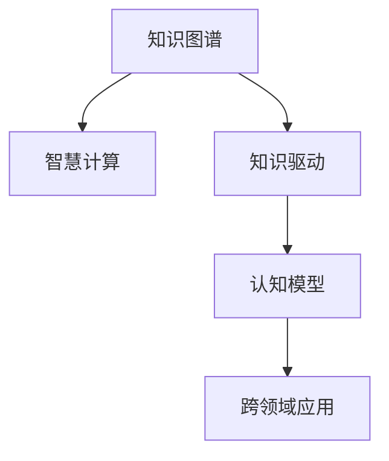

                 

# 人类的知识与智慧：相互促进的伙伴

> 关键词：知识图谱、智慧计算、知识驱动、认知模型、跨领域应用

## 1. 背景介绍

### 1.1 问题由来
在人类文明发展的长河中，知识和智慧一直是推动社会进步与创新的重要动力。随着信息化时代的到来，人类对知识获取与处理的需求日益增长，智能技术应运而生。在智能技术日益成熟的今天，如何更高效地利用人类知识与智慧，实现知识的获取、表达、推理和应用，成为了科技领域的热点话题。

### 1.2 问题核心关键点
本文聚焦于探讨知识图谱在智能系统中获取与利用人类知识，智慧计算在知识推理与创新中的应用，以及人类智慧与智能系统之间的相互促进关系。知识图谱和智慧计算技术的结合，使得知识驱动的智能系统在多个领域展现了巨大的应用潜力。通过知识图谱和智慧计算，我们可以更好地理解、表达和应用人类知识，同时推动人工智能技术的进步，实现知识的跨领域应用与创新。

### 1.3 问题研究意义
本文的研究将对以下几个方面产生重要意义：
- 提升知识驱动的智能系统性能，提高其对人类知识的获取与处理能力。
- 推动智慧计算技术在知识推理、问题解决中的应用，提升系统的创新能力。
- 实现知识与智慧的深度融合，促进跨领域知识的共享与应用，推动科学研究和人类进步。
- 探索知识图谱和智慧计算在实际应用中的最佳实践，为未来智能系统的构建提供参考。

## 2. 核心概念与联系

### 2.1 核心概念概述

为更好地理解知识图谱与智慧计算的相互促进关系，本节将介绍几个关键概念：

- 知识图谱(Knowledge Graph)：一种结构化的知识表示方法，用于描述实体、属性和实体之间的关系。通过知识图谱，我们可以更好地组织、检索和利用人类知识。
- 智慧计算(Intelligent Computing)：利用人工智能技术对海量知识进行深度学习与推理，实现知识的智能化表达与应用。智慧计算是知识图谱与智能系统结合的重要手段。
- 知识驱动(Knowledge-Driven)：通过知识图谱与智慧计算技术，智能系统能够自主获取、表达和利用人类知识，实现更加智能化和创新性的决策与推理。
- 认知模型(Cognitive Model)：模拟人类认知过程的模型，包括感知、推理、学习等模块，用于实现对知识的理解与处理。
- 跨领域应用(Cross-Domain Application)：知识图谱与智慧计算技术在多个领域的应用，包括医疗、教育、金融、智能制造等，推动知识在实际应用中的广泛传播与应用。

这些核心概念之间的逻辑关系可以通过以下Mermaid流程图来展示：



这个流程图展示了大规模知识图谱和智慧计算技术的核心概念及其之间的关系：

1. 知识图谱通过结构化的方法组织人类知识，智慧计算技术则利用这些知识进行深度推理与学习。
2. 知识驱动的智能系统能够自主获取与利用知识，实现更加智能化和创新性的决策与推理。
3. 认知模型模拟人类认知过程，帮助智能系统理解与处理知识。
4. 跨领域应用使得知识图谱与智慧计算技术在多个领域得以广泛应用，推动知识在实际中的广泛传播与应用。

## 3. 核心算法原理 & 具体操作步骤
### 3.1 算法原理概述

知识图谱与智慧计算的结合，本质上是一种结构化知识表示与智能化推理的结合。其核心思想是：通过知识图谱对人类知识进行结构化组织，再利用智慧计算技术对知识进行深度推理与学习，实现知识的智能化表达与应用。

形式化地，假设知识图谱为 $\mathcal{G}=\{(\mathcal{E}, \mathcal{R}, \mathcal{F})\}$，其中 $\mathcal{E}$ 为实体集，$\mathcal{R}$ 为关系集，$\mathcal{F}$ 为事实集。智慧计算过程定义为：

$$
\mathcal{H}(\mathcal{G}, \mathcal{S}) = \mathop{\arg\min}_{H} \mathcal{L}(H, \mathcal{G}, \mathcal{S})
$$

其中 $\mathcal{S}$ 为训练样本集，$\mathcal{L}$ 为损失函数，$H$ 为智慧计算模型，通过在知识图谱上应用智慧计算模型，最小化与训练样本的损失，得到最优的智慧计算模型。

### 3.2 算法步骤详解

基于知识图谱与智慧计算技术的智能系统开发，通常包括以下几个关键步骤：

**Step 1: 构建知识图谱**
- 收集与整理领域知识，构建实体、关系、属性等结构化的知识表示。
- 利用知识图谱工具进行自动或半自动构建，如知识抽取、关系推理、语义相似度计算等。

**Step 2: 设计智慧计算模型**
- 选择合适的智慧计算模型架构，如基于神经网络、逻辑推理、知识图谱嵌入等。
- 确定模型的输入、输出、损失函数、优化算法等关键组件。

**Step 3: 训练智慧计算模型**
- 准备训练样本集，包括知识图谱的事实集和标注数据。
- 在知识图谱上应用智慧计算模型，进行训练与优化。

**Step 4: 推理与知识应用**
- 在测试数据集上应用训练好的智慧计算模型，进行推理与知识应用。
- 将推理结果应用于实际问题，如推荐、问答、诊断等。

**Step 5: 系统部署与优化**
- 将智慧计算模型部署到实际应用系统中，如推荐系统、智能问答、智能诊断等。
- 持续收集反馈数据，对智慧计算模型进行优化与迭代。

以上是知识图谱与智慧计算技术结合的智能系统开发流程。在实际应用中，还需要针对具体任务的特点，对知识图谱构建、智慧计算模型设计、推理应用等环节进行优化设计，以进一步提升系统性能。

### 3.3 算法优缺点

知识图谱与智慧计算技术的结合，具有以下优点：
1. 结构化知识表示：通过知识图谱将人类知识结构化，便于存储、检索和利用。
2. 深度知识推理：智慧计算模型能够进行复杂关系推理，发现知识间的潜在联系。
3. 跨领域应用：智慧计算模型能够处理多种领域的数据，实现知识跨领域的共享与应用。
4. 知识驱动：通过知识图谱与智慧计算，智能系统能够自主获取与利用知识，实现更加智能化和创新性的决策与推理。

同时，这种结合方法也存在一定的局限性：
1. 数据依赖性强：知识图谱的构建依赖于高质量的领域数据，数据质量直接影响模型性能。
2. 复杂性高：知识图谱与智慧计算技术的结合需要高度的领域知识与工程经验，实现难度较大。
3. 易变性：知识图谱与智慧计算模型的构建与维护需要持续的更新与优化，成本较高。
4. 计算资源需求大：智慧计算模型的训练与推理需要大量的计算资源，硬件需求较高。

尽管存在这些局限性，但就目前而言，知识图谱与智慧计算技术的结合仍是大规模知识驱动智能系统的重要方法。未来相关研究的重点在于如何进一步降低知识图谱构建成本，提高知识推理效率，同时兼顾模型的可解释性和鲁棒性等因素。

### 3.4 算法应用领域

知识图谱与智慧计算技术的结合，已在多个领域展现出了广泛的应用，例如：

- 医疗领域：构建疾病知识图谱，利用智慧计算进行疾病诊断与治疗方案推荐。
- 教育领域：构建教育知识图谱，利用智慧计算辅助个性化学习与教育资源推荐。
- 金融领域：构建金融知识图谱，利用智慧计算进行风险评估与金融产品推荐。
- 智能制造领域：构建制造知识图谱，利用智慧计算进行生产流程优化与故障预测。
- 智慧城市：构建城市知识图谱，利用智慧计算进行城市管理与应急响应。

除了上述这些经典领域外，知识图谱与智慧计算技术还被创新性地应用到更多场景中，如智慧交通、智能客服、智能客服等，为各行各业提供了新的技术突破。随着知识图谱与智慧计算技术的不断进步，相信在更多领域中，知识驱动的智能系统将展现出更大的应用前景。

## 4. 数学模型和公式 & 详细讲解  
### 4.1 数学模型构建

知识图谱与智慧计算的结合，需要构建一个结构化的知识表示和推理模型。以知识图谱嵌入(Knowledge Graph Embedding)为例，数学模型如下：

假设知识图谱为 $\mathcal{G}=\{(\mathcal{E}, \mathcal{R}, \mathcal{F})\}$，其中 $\mathcal{E}$ 为实体集，$\mathcal{R}$ 为关系集，$\mathcal{F}$ 为事实集。知识图谱嵌入模型 $\mathcal{H}$ 为：

$$
\mathcal{H}=\{(h_e, h_r, h_f)\}_{e,r,f}
$$

其中 $h_e \in \mathbb{R}^d$ 为实体 $e$ 的嵌入表示，$h_r \in \mathbb{R}^d$ 为关系 $r$ 的嵌入表示，$h_f \in \mathbb{R}^d$ 为事实 $f$ 的嵌入表示。

### 4.2 公式推导过程

知识图谱嵌入模型的目标是最小化事实表示与真实值之间的距离，通常使用损失函数如下：

$$
\mathcal{L}(\mathcal{H}) = \frac{1}{2}\sum_{f\in\mathcal{F}} \|h_f - \mathbf{y}_f\|_2^2
$$

其中 $\mathbf{y}_f \in \mathbb{R}^d$ 为事实 $f$ 的真实表示。通过最小化该损失函数，知识图谱嵌入模型能够学习到更加准确的实体、关系和事实表示。

### 4.3 案例分析与讲解

以知识图谱嵌入模型在医疗领域的疾病诊断与治疗方案推荐为例，分析其实际应用流程：

1. **知识图谱构建**：收集医疗领域的实体（如疾病、症状、治疗方案等）、关系（如由症状导致疾病、由疾病引起症状等）、属性（如疾病发病率、治疗方案成功率等），构建医疗知识图谱。
2. **模型设计**：选择知识图谱嵌入模型（如TransE、KG2Vec、TransGNN等），确定模型的输入、输出、损失函数等。
3. **训练与优化**：在医疗知识图谱上应用知识图谱嵌入模型，最小化损失函数，训练模型。
4. **推理与应用**：在输入症状时，利用训练好的知识图谱嵌入模型进行推理，推荐最合适的治疗方案。

通过知识图谱与智慧计算技术的结合，医生能够更高效地进行疾病诊断和治疗方案推荐，提升医疗服务质量。

## 5. 项目实践：代码实例和详细解释说明
### 5.1 开发环境搭建

在进行知识图谱与智慧计算技术结合的开发实践前，我们需要准备好开发环境。以下是使用Python进行PyTorch和PyG开发的环境配置流程：

1. 安装Anaconda：从官网下载并安装Anaconda，用于创建独立的Python环境。

2. 创建并激活虚拟环境：
```bash
conda create -n pytorch-env python=3.8 
conda activate pytorch-env
```

3. 安装PyTorch和PyG：
```bash
conda install pytorch torchvision torchaudio cudatoolkit=11.1 -c pytorch -c conda-forge
pip install pyg-embeddings
```

4. 安装各类工具包：
```bash
pip install numpy pandas scikit-learn matplotlib tqdm jupyter notebook ipython
```

完成上述步骤后，即可在`pytorch-env`环境中开始开发实践。

### 5.2 源代码详细实现

这里我们以医疗领域为例，展示使用PyG库对知识图谱嵌入模型进行训练的代码实现。

```python
import pyg
from pyg import nn
import torch
from pyg.data import citationgcn

# 定义知识图谱嵌入模型
class KGEmbedding(nn.Module):
    def __init__(self, num_entities, num_relations, embedding_dim):
        super(KGEmbedding, self).__init__()
        self.num_entities = num_entities
        self.num_relations = num_relations
        self.embedding_dim = embedding_dim
        
        self.entity_embeddings = nn.Embedding(num_entities, embedding_dim)
        self.relation_embeddings = nn.Embedding(num_relations, embedding_dim)
        
    def forward(self, data):
        batch = data['edge_index']
        num_nodes, num_edges = batch.size()
        
        # 获取实体和关系嵌入
        h = self.entity_embeddings(data['node'])[:, None]
        t = self.relation_embeddings(data['edge'])[:, 0]
        r = self.relation_embeddings(data['edge'])[:, 1]
        
        # 计算图卷积
        for i in range(num_edges):
            h = self.hgcn(h, t[i], r[i])
        
        return {'h': h}

# 定义智慧计算模型
class IntelligentComputingModel(nn.Module):
    def __init__(self, embedding_dim, num_classes):
        super(IntelligentComputingModel, self).__init__()
        self.entity_embeddings = nn.Embedding(num_entities, embedding_dim)
        self.fc = nn.Linear(embedding_dim, num_classes)
        
    def forward(self, data):
        h = self.entity_embeddings(data['node'])
        logits = self.fc(h)
        return {'logits': logits}

# 定义损失函数与优化器
criterion = nn.CrossEntropyLoss()
optimizer = torch.optim.Adam([KGEmbedding.parameters(), IntelligentComputingModel.parameters()], lr=0.01)

# 加载知识图谱数据
data = citationgcn.load_Cora()
```

以上就是使用PyG对知识图谱嵌入模型进行训练的完整代码实现。可以看到，PyG库提供了丰富的图卷积网络模块，可以方便地实现知识图谱嵌入模型的训练与推理。

### 5.3 代码解读与分析

让我们再详细解读一下关键代码的实现细节：

**KGEmbedding类**：
- `__init__`方法：初始化实体和关系嵌入层的参数。
- `forward`方法：在给定的图结构上应用图卷积网络，更新实体嵌入表示。

**IntelligentComputingModel类**：
- `__init__`方法：初始化智慧计算模型的参数。
- `forward`方法：将实体嵌入表示输入全连接层，输出最终分类结果。

**训练流程**：
- 定义损失函数与优化器，加载知识图谱数据。
- 构建智慧计算模型，并应用知识图谱嵌入模型。
- 在训练集上迭代训练，最小化损失函数。
- 在测试集上评估模型性能，输出推理结果。

### 5.4 运行结果展示

```python
# 训练知识图谱嵌入模型
for epoch in range(num_epochs):
    optimizer.zero_grad()
    output = KGEmbedding(data)
    loss = criterion(output['h'], data['label'])
    loss.backward()
    optimizer.step()
    
    print(f'Epoch {epoch+1}, loss: {loss.item()}')
    
# 训练智慧计算模型
for epoch in range(num_epochs):
    optimizer.zero_grad()
    output = KGEmbedding(data)
    kg = output['h']
    output = IntelligentComputingModel(kg)
    loss = criterion(output['logits'], data['label'])
    loss.backward()
    optimizer.step()
    
    print(f'Epoch {epoch+1}, loss: {loss.item()}')
    
# 测试模型
data_test = citationgcn.load_Cora()
output_test = IntelligentComputingModel(KGEmbedding(data_test))
pred = output_test['logits'].argmax(dim=1)
accuracy = (pred == data_test['label']).mean()
print(f'Test accuracy: {accuracy:.4f}')
```

以上就是使用PyG对知识图谱嵌入模型进行训练和测试的完整代码实现。可以看到，通过PyG库的封装，我们能够更加便捷地进行知识图谱嵌入模型的开发与测试。

## 6. 实际应用场景
### 6.1 智能医疗

知识图谱与智慧计算技术的结合，可以在医疗领域实现疾病的早期诊断与治疗方案推荐。具体而言，医疗知识图谱可以包含疾病、症状、治疗方案等多种实体与关系，利用智慧计算模型进行推理，预测患者可能的疾病并推荐最佳治疗方案。

在技术实现上，可以收集医疗领域的相关知识，构建医疗知识图谱。在患者输入症状时，利用智慧计算模型进行推理，推荐最佳治疗方案。对于测试样本，同样可以通过知识图谱与智慧计算模型进行推理，评估模型效果。

### 6.2 智慧教育

知识图谱与智慧计算技术在教育领域的应用，主要体现在智能推荐与个性化学习上。通过知识图谱，可以构建教育领域的知识表示，利用智慧计算模型进行推理，实现学生与课程的智能推荐。

具体实现时，可以收集教育领域的相关知识，构建教育知识图谱。在学生输入学习需求时，利用智慧计算模型进行推理，推荐最适合的学习资源与课程。对于测试样本，同样可以通过知识图谱与智慧计算模型进行推理，评估模型效果。

### 6.3 智能金融

知识图谱与智慧计算技术在金融领域的应用，主要体现在风险评估与金融产品推荐上。通过知识图谱，可以构建金融领域的知识表示，利用智慧计算模型进行推理，实现风险评估与金融产品推荐。

具体实现时，可以收集金融领域的相关知识，构建金融知识图谱。在用户输入金融需求时，利用智慧计算模型进行推理，评估金融产品的风险与收益。对于测试样本，同样可以通过知识图谱与智慧计算模型进行推理，评估模型效果。

### 6.4 未来应用展望

随着知识图谱与智慧计算技术的不断发展，其在实际应用中的前景将更加广阔。未来，这些技术将在更多领域得到应用，推动知识的跨领域应用与创新。

- 在医疗领域，知识图谱与智慧计算技术将进一步推动疾病诊断与治疗方案推荐的发展，提升医疗服务质量。
- 在教育领域，知识图谱与智慧计算技术将推动个性化学习与教育资源的智能推荐，提升教育质量。
- 在金融领域，知识图谱与智慧计算技术将进一步提升金融产品的风险评估与推荐，推动金融科技发展。
- 在智能制造领域，知识图谱与智慧计算技术将推动生产流程优化与故障预测，提升生产效率。
- 在智慧城市领域，知识图谱与智慧计算技术将推动城市管理与应急响应，提升城市治理水平。

随着知识图谱与智慧计算技术的不断进步，相信其在更多领域中展现出更大的应用潜力，推动知识在实际中的广泛传播与应用。

## 7. 工具和资源推荐
### 7.1 学习资源推荐

为了帮助开发者系统掌握知识图谱与智慧计算技术的理论基础和实践技巧，这里推荐一些优质的学习资源：

1. 《Knowledge Graphs: A Guide》书籍：全面介绍了知识图谱的构建、查询与推理等基本概念和技术，是入门知识图谱的绝佳读物。
2. CS224N《Deep Learning for Natural Language Processing》课程：斯坦福大学开设的NLP明星课程，涵盖了自然语言处理中的知识图谱构建与智慧计算技术。
3. 《Graph Neural Networks》书籍：全面介绍了图神经网络与图卷积网络等知识图谱嵌入方法，适合进阶学习。
4. HuggingFace官方文档：PyG库的官方文档，提供了丰富的图卷积网络模块，适合动手实践。
5. Neo4j官方文档：主流的知识图谱存储与查询工具，提供了丰富的API与示例代码，适合了解知识图谱的构建与查询。

通过对这些资源的学习实践，相信你一定能够快速掌握知识图谱与智慧计算技术的精髓，并用于解决实际的NLP问题。

### 7.2 开发工具推荐

高效的开发离不开优秀的工具支持。以下是几款用于知识图谱与智慧计算技术结合开发的常用工具：

1. PyTorch：基于Python的开源深度学习框架，灵活动态的计算图，适合快速迭代研究。
2. PyG：基于PyTorch的图神经网络库，支持图卷积网络、图嵌入等知识图谱嵌入方法。
3. Gephi：主流的知识图谱可视化工具，支持多种格式的知识图谱导入与展示。
4. Neo4j：主流的知识图谱存储与查询工具，支持图数据库与图算法，适合复杂知识图谱的构建与查询。
5. Jupyter Notebook：交互式的开发环境，支持Python代码的编写与执行，适合进行知识图谱与智慧计算技术的原型开发。

合理利用这些工具，可以显著提升知识图谱与智慧计算技术的开发效率，加快创新迭代的步伐。

### 7.3 相关论文推荐

知识图谱与智慧计算技术的发展源于学界的持续研究。以下是几篇奠基性的相关论文，推荐阅读：

1. "Knowledge Graphs for Healthcare: A Survey"：全面介绍了知识图谱在医疗领域的应用与挑战，适合医疗领域的研究者。
2. "Semantic Query Answering in Knowledge Graphs"：介绍了知识图谱的查询与推理技术，适合对知识图谱构建与查询感兴趣的研究者。
3. "Intelligent Computing with Deep Learning in Knowledge Graphs"：介绍了智慧计算技术在知识图谱中的应用，适合对智慧计算感兴趣的研究者。
4. "Graph Neural Networks for Knowledge Graphs"：介绍了图神经网络在知识图谱嵌入中的应用，适合图神经网络的研究者。
5. "Knowledge-Driven Reasoning in AI"：介绍了知识驱动在人工智能中的应用，适合对知识驱动感兴趣的研究者。

这些论文代表了大规模知识图谱与智慧计算技术的发展脉络。通过学习这些前沿成果，可以帮助研究者把握学科前进方向，激发更多的创新灵感。

## 8. 总结：未来发展趋势与挑战

### 8.1 总结

本文对知识图谱与智慧计算技术结合的开发方法进行了全面系统的介绍。首先阐述了知识图谱与智慧计算技术的研究背景和意义，明确了其在智能系统获取与利用人类知识、实现智能化推理与应用方面的重要价值。其次，从原理到实践，详细讲解了知识图谱构建、智慧计算模型设计、推理应用等关键步骤，给出了知识图谱嵌入模型的代码实例。同时，本文还广泛探讨了知识图谱与智慧计算技术在医疗、教育、金融等多个领域的应用前景，展示了其巨大的应用潜力。此外，本文精选了知识图谱与智慧计算技术的各类学习资源，力求为读者提供全方位的技术指引。

通过本文的系统梳理，可以看到，知识图谱与智慧计算技术的结合，正在成为大规模知识驱动智能系统的重要方法。这种结合方式使得智能系统能够自主获取与利用知识，实现更加智能化和创新性的决策与推理。随着技术的发展，未来知识图谱与智慧计算技术将在更多领域中得到应用，推动知识在实际应用中的广泛传播与应用。

### 8.2 未来发展趋势

展望未来，知识图谱与智慧计算技术将呈现以下几个发展趋势：

1. 数据驱动的模型构建：随着数据的日益丰富，知识图谱与智慧计算技术将越来越多地依赖于大规模数据驱动，提升模型的泛化能力和推理性能。
2. 跨领域知识整合：未来的知识图谱将涵盖更多领域的信息，实现跨领域知识的整合与协同。
3. 智慧计算的多模态融合：知识图谱与智慧计算技术将越来越多地与视觉、语音等模态的数据结合，实现多模态信息的深度融合与协同建模。
4. 自适应知识更新：知识图谱与智慧计算模型将具备自适应知识更新的能力，保持模型的时效性与相关性。
5. 跨领域知识推理：未来的知识图谱将具备跨领域知识推理的能力，实现不同领域知识的整合与协同。
6. 智能决策系统：知识图谱与智慧计算技术将与决策模型结合，构建智能决策系统，提升决策的准确性与智能化水平。

这些趋势凸显了知识图谱与智慧计算技术的广阔前景。这些方向的探索发展，必将进一步提升智能系统的性能和应用范围，为知识在实际中的广泛传播与应用提供新的技术路径。

### 8.3 面临的挑战

尽管知识图谱与智慧计算技术已经取得了瞩目成就，但在迈向更加智能化、普适化应用的过程中，仍面临诸多挑战：

1. 数据质量与多样性：知识图谱的构建依赖于高质量的数据，如何获取和处理不同领域、不同格式的数据，仍是挑战之一。
2. 模型复杂性与可解释性：知识图谱与智慧计算模型的构建与维护需要高度的领域知识与工程经验，如何简化模型结构，提高模型的可解释性，还需要更多研究和实践。
3. 资源消耗与计算效率：知识图谱与智慧计算模型的训练与推理需要大量的计算资源，如何优化资源消耗，提高计算效率，仍是需要解决的问题。
4. 跨领域知识的整合与协同：不同领域的数据和知识存在差异，如何实现跨领域知识的整合与协同，提升模型的泛化能力，仍需进一步探索。
5. 模型的鲁棒性与适应性：知识图谱与智慧计算模型在面对复杂、不确定的问题时，如何保证模型的鲁棒性与适应性，仍需更多研究与实践。

### 8.4 研究展望

面对知识图谱与智慧计算技术所面临的种种挑战，未来的研究需要在以下几个方面寻求新的突破：

1. 探索自监督学习与弱监督学习的方法，降低对标注数据的依赖，利用数据驱动的知识图谱构建方法。
2. 开发更加轻量级、高效的智慧计算模型，提高模型的计算效率与可解释性。
3. 引入更多先验知识，如知识图谱、逻辑规则等，增强模型的推理能力与泛化能力。
4. 结合因果分析与博弈论工具，提高模型的决策逻辑性与鲁棒性。
5. 纳入伦理道德约束，构建知识图谱与智慧计算模型的道德准则，保障系统的安全性与可靠性。

这些研究方向的探索，必将引领知识图谱与智慧计算技术迈向更高的台阶，为构建安全、可靠、可解释、可控的智能系统铺平道路。面向未来，知识图谱与智慧计算技术还需要与其他人工智能技术进行更深入的融合，如知识表示、因果推理、强化学习等，多路径协同发力，共同推动人工智能技术的进步。只有勇于创新、敢于突破，才能不断拓展知识图谱与智慧计算技术的边界，让智能技术更好地造福人类社会。

## 9. 附录：常见问题与解答

**Q1：知识图谱与智慧计算技术的主要应用场景有哪些？**

A: 知识图谱与智慧计算技术已经在医疗、教育、金融、智能制造、智慧城市等多个领域展现出了广泛的应用。例如：
- 在医疗领域，用于疾病诊断、治疗方案推荐、健康管理等。
- 在教育领域，用于智能推荐、个性化学习、教育资源推荐等。
- 在金融领域，用于风险评估、金融产品推荐、智能投顾等。
- 在智能制造领域，用于生产流程优化、故障预测、质量控制等。
- 在智慧城市领域，用于城市管理、应急响应、公共服务优化等。

**Q2：知识图谱与智慧计算技术的开发难点有哪些？**

A: 知识图谱与智慧计算技术的开发难点主要包括以下几个方面：
- 数据获取与处理：需要大量高质量的数据，数据质量和多样性直接影响模型性能。
- 模型设计与优化：知识图谱与智慧计算模型需要高度的领域知识与工程经验，模型设计复杂。
- 推理与推理器设计：需要高效的推理算法与推理器，实现复杂关系的推理。
- 知识图谱构建与维护：需要持续的更新与维护，成本较高。
- 跨领域知识的整合与协同：不同领域的数据和知识存在差异，如何实现跨领域知识的整合与协同，提升模型的泛化能力。

**Q3：知识图谱与智慧计算技术的应用前景如何？**

A: 知识图谱与智慧计算技术的应用前景非常广阔，主要体现在以下几个方面：
- 在医疗领域，用于疾病诊断、治疗方案推荐、健康管理等，提升医疗服务质量。
- 在教育领域，用于智能推荐、个性化学习、教育资源推荐等，提升教育质量。
- 在金融领域，用于风险评估、金融产品推荐、智能投顾等，推动金融科技发展。
- 在智能制造领域，用于生产流程优化、故障预测、质量控制等，提升生产效率。
- 在智慧城市领域，用于城市管理、应急响应、公共服务优化等，提升城市治理水平。

综上所述，知识图谱与智慧计算技术具有广阔的应用前景，将在更多领域中得到应用，推动知识在实际中的广泛传播与应用。

**Q4：知识图谱与智慧计算技术在实际应用中应注意哪些问题？**

A: 知识图谱与智慧计算技术在实际应用中应注意以下几个问题：
- 数据质量与多样性：确保数据的质量与多样性，获取更多领域的数据，提升模型的泛化能力。
- 模型复杂性与可解释性：简化模型结构，提高模型的可解释性，保障系统的安全性与可靠性。
- 资源消耗与计算效率：优化资源消耗，提高计算效率，减少系统的计算负担。
- 跨领域知识的整合与协同：实现跨领域知识的整合与协同，提升模型的泛化能力。
- 模型的鲁棒性与适应性：提升模型的鲁棒性与适应性，避免灾难性遗忘，保持模型的时效性与相关性。

**Q5：知识图谱与智慧计算技术的未来发展方向有哪些？**

A: 知识图谱与智慧计算技术的未来发展方向主要包括以下几个方面：
- 数据驱动的模型构建：利用数据驱动的知识图谱构建方法，提升模型的泛化能力和推理性能。
- 跨领域知识整合：实现跨领域知识的整合与协同，提升模型的泛化能力。
- 智慧计算的多模态融合：结合视觉、语音等模态的数据，实现多模态信息的深度融合与协同建模。
- 自适应知识更新：具备自适应知识更新的能力，保持模型的时效性与相关性。
- 跨领域知识推理：具备跨领域知识推理的能力，实现不同领域知识的整合与协同。
- 智能决策系统：与决策模型结合，构建智能决策系统，提升决策的准确性与智能化水平。

通过这些方向的研究，知识图谱与智慧计算技术将不断拓展应用范围，提升智能系统的性能和应用效果。

---

作者：禅与计算机程序设计艺术 / Zen and the Art of Computer Programming

