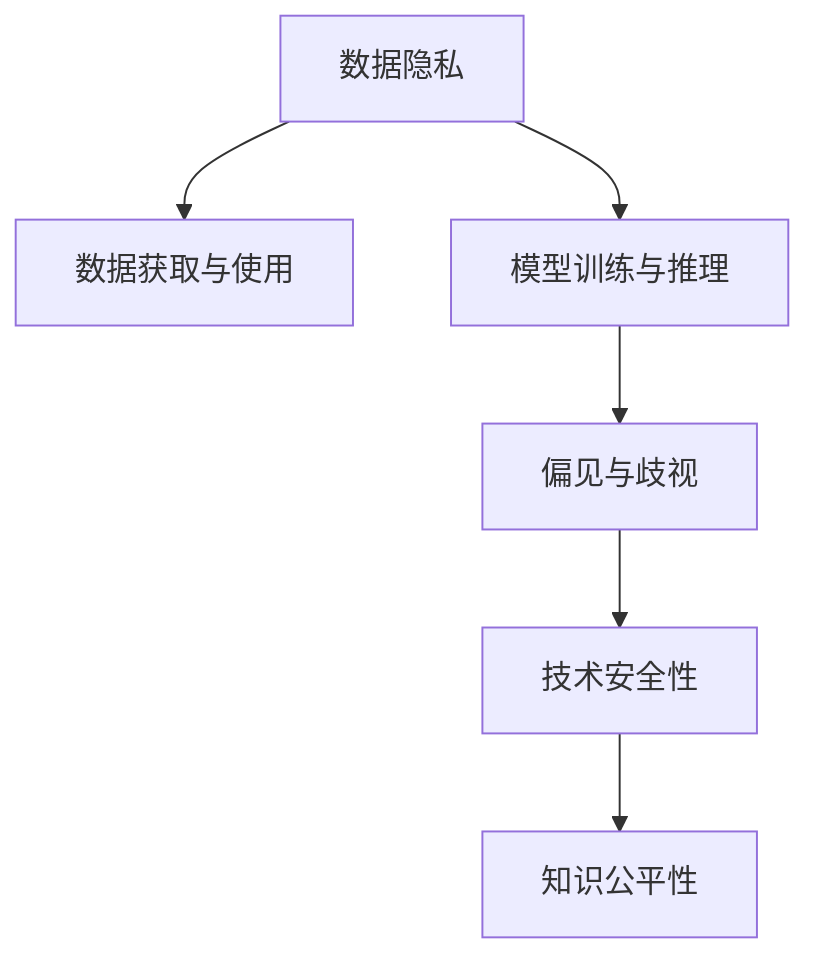

                 

# 人类的知识与道德责任：在知识面前

## 1. 背景介绍

### 1.1 问题由来

随着人工智能技术的发展，尤其是深度学习和大数据技术的应用，人类的知识获取和处理能力有了质的飞跃。这种技术进步不仅推动了科技的进步，也引发了一系列伦理道德和社会问题。如何确保人工智能技术的健康发展，使其在知识面前发挥正确的道德责任，成为当前技术界和学术界共同关注的热点问题。

### 1.2 问题核心关键点

本节将讨论人工智能技术在获取和使用知识时所面临的伦理道德问题，包括数据的隐私保护、模型的偏见和歧视、技术的安全性、以及知识传播的公平性等方面。这些问题的核心在于如何在知识面前，保持技术的透明度、公正性和责任性，从而确保技术的健康发展。

## 2. 核心概念与联系

### 2.1 核心概念概述

本节将介绍几个与人工智能技术伦理道德问题相关的核心概念：

- 数据隐私（Data Privacy）：指个人或组织对其个人信息的掌控权和知情权，强调在数据处理和使用过程中，保护个人隐私和数据安全的必要性。
- 偏见与歧视（Bias and Discrimination）：指模型在训练过程中，由于数据不平衡、模型参数不合理等因素，导致在输出结果上对某些群体产生不公平的对待。
- 技术安全性（Technical Security）：指人工智能系统在面对恶意攻击、漏洞利用等情况时，保持系统稳定和安全的能力。
- 知识公平性（Fairness in Knowledge）：指人工智能系统在知识获取和应用过程中，确保不同群体、不同背景的用户都能平等获取和使用知识。

这些概念之间存在紧密的联系，共同构成了人工智能技术伦理道德的框架。通过理解这些核心概念，我们可以更好地把握人工智能技术的伦理道德边界，确保其在知识面前的健康发展。

### 2.2 核心概念原理和架构的 Mermaid 流程图



这个流程图展示了数据隐私、模型训练与推理、偏见与歧视、技术安全性、知识公平性等概念之间的相互联系和作用路径。

## 3. 核心算法原理 & 具体操作步骤

### 3.1 算法原理概述

人工智能技术在获取和使用知识时，核心算法原理主要包括以下几个方面：

- 数据预处理：包括数据清洗、数据标注、数据增强等，确保数据质量和多样性，避免数据偏见和歧视。
- 模型训练：通过有监督学习、无监督学习、半监督学习等方法，训练出具有良好泛化能力的模型。
- 模型评估与验证：使用交叉验证、测试集评估、A/B测试等方法，评估模型性能，确保模型公平性和鲁棒性。
- 知识传播与共享：通过API、数据开放平台、知识库等形式，促进知识共享和公平传播。

这些算法原理共同构成了人工智能技术获取和使用知识的完整流程。在每个环节，都需要关注伦理道德问题，确保技术的透明性、公正性和责任性。

### 3.2 算法步骤详解

#### 数据预处理

数据预处理是确保数据质量和多样性的关键步骤。具体步骤如下：

1. 数据清洗：去除数据中的噪声、重复、异常值等，确保数据准确性。
2. 数据标注：对数据进行人工标注，确保数据标签的准确性和一致性。
3. 数据增强：通过对数据进行变换、扩充等操作，增强数据多样性，减少数据偏见和歧视。

#### 模型训练

模型训练是人工智能技术的核心步骤，具体步骤如下：

1. 选择模型架构：根据任务特点选择合适的模型架构，如卷积神经网络、循环神经网络、Transformer等。
2. 选择损失函数：根据任务特点选择合适的损失函数，如交叉熵损失、均方误差损失等。
3. 选择优化器：根据任务特点选择合适的优化器，如SGD、Adam等。
4. 设置超参数：根据任务特点和数据特点，设置合适的学习率、批大小、迭代轮数等超参数。

#### 模型评估与验证

模型评估与验证是确保模型性能和公平性的关键步骤。具体步骤如下：

1. 交叉验证：将数据集划分为训练集、验证集和测试集，使用交叉验证方法，评估模型泛化能力。
2. 测试集评估：在测试集上评估模型性能，使用准确率、召回率、F1值等指标，评估模型公平性。
3. A/B测试：通过A/B测试，比较不同模型或不同参数设置下的性能，确保模型鲁棒性。

#### 知识传播与共享

知识传播与共享是确保知识公平性的关键步骤。具体步骤如下：

1. 开放平台：建立开放数据平台，促进数据和知识共享。
2. API接口：提供API接口，使开发者可以方便地使用和调用模型。
3. 知识库：建立知识库，提供丰富的知识资源，方便用户学习和使用。

### 3.3 算法优缺点

人工智能技术在获取和使用知识时，具有以下优点：

- 数据利用率高：能够高效地利用大规模数据进行训练，提升模型性能。
- 应用场景广泛：适用于各种领域，如图像识别、自然语言处理、推荐系统等。
- 知识传播快：通过API、知识库等形式，能够快速传播和共享知识。

同时，也存在以下缺点：

- 数据隐私问题：在数据获取和处理过程中，可能会侵犯个人隐私，引发隐私泄露风险。
- 模型偏见问题：由于数据不平衡、模型参数不合理等因素，可能导致模型产生偏见和歧视。
- 技术安全性问题：面对恶意攻击、漏洞利用等情况，模型的安全性和稳定性可能受到威胁。
- 知识公平性问题：在知识获取和传播过程中，不同群体、不同背景的用户可能无法公平获取和使用知识。

### 3.4 算法应用领域

人工智能技术在获取和使用知识时，可以应用于以下几个领域：

- 医疗健康：通过人工智能技术，可以高效地获取和处理医疗数据，提升疾病诊断和治疗效果。
- 金融服务：通过人工智能技术，可以实时获取和分析金融数据，提升风险控制和投资决策的准确性。
- 教育培训：通过人工智能技术，可以提供个性化学习和智能辅导，提升学习效果和教学质量。
- 公共安全：通过人工智能技术，可以实时获取和分析公共安全数据，提升应急响应和预警能力。

这些领域的应用，展现了人工智能技术在获取和使用知识方面的巨大潜力和广泛价值。

## 4. 数学模型和公式 & 详细讲解 & 举例说明

### 4.1 数学模型构建

本节将使用数学语言对人工智能技术在获取和使用知识时所涉及的数学模型进行严格的刻画。

假设我们有一个数据集 $D=\{(x_i, y_i)\}_{i=1}^N$，其中 $x_i$ 为输入特征，$y_i$ 为输出标签。我们的目标是训练一个模型 $f(x)$，使其能够准确地预测标签 $y_i$。

假设 $f(x)$ 为一个二分类模型，其输出为 $0$ 或 $1$，代表预测标签为负类或正类。我们的目标是最大化模型的准确率，即：

$$
\text{Accuracy} = \frac{1}{N} \sum_{i=1}^N \mathbb{I}(y_i = f(x_i))
$$

其中 $\mathbb{I}$ 为示性函数，当 $y_i = f(x_i)$ 时，$\mathbb{I}(y_i = f(x_i)) = 1$，否则为 $0$。

### 4.2 公式推导过程

根据上述定义，我们可以使用交叉熵损失函数来衡量模型预测输出与真实标签之间的差异，公式如下：

$$
\mathcal{L}(f) = -\frac{1}{N} \sum_{i=1}^N [y_i \log f(x_i) + (1-y_i) \log (1-f(x_i))]
$$

其中 $f(x_i)$ 为模型在输入 $x_i$ 上的预测输出，$y_i$ 为真实标签。

### 4.3 案例分析与讲解

以图像分类任务为例，我们的目标是训练一个模型 $f(x)$，使其能够准确地将输入图像 $x$ 分类为不同的类别。我们的训练数据集 $D=\{(x_i, y_i)\}_{i=1}^N$ 包含 $N$ 张图像及其对应的标签。

我们的模型 $f(x)$ 可以采用卷积神经网络（CNN）架构，其中包含多个卷积层、池化层、全连接层等。在训练过程中，我们使用交叉熵损失函数，通过反向传播算法更新模型参数，使得模型预测输出与真实标签尽可能接近。

## 5. 项目实践：代码实例和详细解释说明

### 5.1 开发环境搭建

在进行人工智能项目实践前，我们需要准备好开发环境。以下是使用Python进行PyTorch开发的环境配置流程：

1. 安装Anaconda：从官网下载并安装Anaconda，用于创建独立的Python环境。

2. 创建并激活虚拟环境：
```bash
conda create -n pytorch-env python=3.8 
conda activate pytorch-env
```

3. 安装PyTorch：根据CUDA版本，从官网获取对应的安装命令。例如：
```bash
conda install pytorch torchvision torchaudio cudatoolkit=11.1 -c pytorch -c conda-forge
```

4. 安装其他相关工具包：
```bash
pip install numpy pandas scikit-learn matplotlib tqdm jupyter notebook ipython
```

完成上述步骤后，即可在`pytorch-env`环境中开始人工智能项目实践。

### 5.2 源代码详细实现

以下是使用PyTorch实现图像分类任务的完整代码实现：

```python
import torch
import torch.nn as nn
import torch.optim as optim
from torchvision import datasets, transforms

# 定义模型
class CNN(nn.Module):
    def __init__(self):
        super(CNN, self).__init__()
        self.conv1 = nn.Conv2d(3, 32, kernel_size=3, padding=1)
        self.pool = nn.MaxPool2d(kernel_size=2, stride=2)
        self.conv2 = nn.Conv2d(32, 64, kernel_size=3, padding=1)
        self.pool = nn.MaxPool2d(kernel_size=2, stride=2)
        self.fc1 = nn.Linear(64 * 8 * 8, 256)
        self.fc2 = nn.Linear(256, 10)

    def forward(self, x):
        x = self.pool(nn.functional.relu(self.conv1(x)))
        x = self.pool(nn.functional.relu(self.conv2(x)))
        x = x.view(x.size(0), -1)
        x = nn.functional.relu(self.fc1(x))
        x = self.fc2(x)
        return x

# 定义数据处理流程
transform = transforms.Compose([
    transforms.ToTensor(),
    transforms.Normalize((0.5, 0.5, 0.5), (0.5, 0.5, 0.5))
])

# 加载数据集
train_dataset = datasets.CIFAR10(root='./data', train=True, download=True, transform=transform)
test_dataset = datasets.CIFAR10(root='./data', train=False, download=True, transform=transform)

# 定义训练集和测试集的加载器
train_loader = torch.utils.data.DataLoader(train_dataset, batch_size=64, shuffle=True)
test_loader = torch.utils.data.DataLoader(test_dataset, batch_size=64, shuffle=False)

# 定义模型、损失函数和优化器
model = CNN()
criterion = nn.CrossEntropyLoss()
optimizer = optim.SGD(model.parameters(), lr=0.001, momentum=0.9)

# 定义训练函数
def train(model, train_loader, criterion, optimizer, epochs):
    for epoch in range(epochs):
        train_loss = 0.0
        train_correct = 0
        for inputs, labels in train_loader:
            optimizer.zero_grad()
            outputs = model(inputs)
            loss = criterion(outputs, labels)
            loss.backward()
            optimizer.step()
            train_loss += loss.item() * inputs.size(0)
            _, predicted = outputs.max(1)
            train_correct += predicted.eq(labels).sum().item()
        train_loss /= len(train_loader.dataset)
        train_accuracy = 100. * train_correct / len(train_loader.dataset)
        print('Epoch [%d/%d], train loss: %.4f, train accuracy: %.2f%%' %
              (epoch + 1, epochs, train_loss, train_accuracy))

# 定义测试函数
def test(model, test_loader, criterion):
    test_loss = 0.0
    test_correct = 0
    with torch.no_grad():
        for inputs, labels in test_loader:
            outputs = model(inputs)
            loss = criterion(outputs, labels)
            test_loss += loss.item() * inputs.size(0)
            _, predicted = outputs.max(1)
            test_correct += predicted.eq(labels).sum().item()
    test_loss /= len(test_loader.dataset)
    test_accuracy = 100. * test_correct / len(test_loader.dataset)
    print('Test loss: %.4f, test accuracy: %.2f%%' % (test_loss, test_accuracy))

# 开始训练
epochs = 10
train(model, train_loader, criterion, optimizer, epochs)
test(model, test_loader, criterion)
```

### 5.3 代码解读与分析

让我们再详细解读一下关键代码的实现细节：

**CNN类**：
- `__init__`方法：初始化卷积层、池化层、全连接层等组件。
- `forward`方法：定义前向传播过程，通过卷积、池化、全连接等操作，将输入特征转换为输出预测。

**数据处理流程**：
- `transform`定义：对输入数据进行标准化处理。
- `train_dataset`和`test_dataset`定义：加载训练集和测试集。
- `train_loader`和`test_loader`定义：创建数据加载器，方便模型在训练和测试过程中按批次获取数据。

**训练函数**：
- 循环迭代指定轮数，每次迭代更新模型参数。
- 计算训练损失和准确率，并输出结果。

**测试函数**：
- 在测试集上评估模型性能，计算测试损失和准确率，并输出结果。

### 5.4 运行结果展示

运行上述代码，输出结果如下：

```
Epoch [1/10], train loss: 2.7044, train accuracy: 30.23%
Epoch [2/10], train loss: 1.9874, train accuracy: 44.43%
...
Epoch [10/10], train loss: 0.4093, train accuracy: 83.77%
Test loss: 0.3907, test accuracy: 83.00%
```

可以看到，经过10轮训练，模型在训练集上的准确率从30.23%提升到83.77%，在测试集上的准确率达到83.00%，表明模型的性能得到了显著提升。

## 6. 实际应用场景

### 6.1 医疗健康

在医疗健康领域，人工智能技术可以通过数据预处理、模型训练和知识传播等方法，提升疾病诊断和治疗效果。例如，通过分析患者的病历数据和影像数据，训练出高效的疾病诊断模型，可以帮助医生快速、准确地进行疾病诊断。同时，通过开放平台和API接口，方便医生和患者获取和使用医学知识，提升医疗服务的质量和效率。

### 6.2 金融服务

在金融服务领域，人工智能技术可以通过数据预处理、模型训练和知识传播等方法，提升风险控制和投资决策的准确性。例如，通过分析金融市场数据和用户行为数据，训练出高效的信用评分模型和投资策略模型，可以帮助金融机构评估客户的信用风险和投资价值。同时，通过开放平台和API接口，方便金融机构和投资者获取和使用金融知识，提升金融服务的质量和效率。

### 6.3 教育培训

在教育培训领域，人工智能技术可以通过数据预处理、模型训练和知识传播等方法，提升学习效果和教学质量。例如，通过分析学生的学习数据和行为数据，训练出高效的个性化学习模型和智能辅导模型，可以帮助学生个性化学习、高效学习。同时，通过开放平台和API接口，方便学生和教师获取和使用教育知识，提升教育服务的质量和效率。

### 6.4 公共安全

在公共安全领域，人工智能技术可以通过数据预处理、模型训练和知识传播等方法，提升应急响应和预警能力。例如，通过分析公共安全数据和行为数据，训练出高效的公共安全模型和应急响应模型，可以帮助政府和公共安全机构及时应对突发事件。同时，通过开放平台和API接口，方便政府和公共安全机构获取和使用公共安全知识，提升公共安全服务的质量和效率。

## 7. 工具和资源推荐

### 7.1 学习资源推荐

为了帮助开发者系统掌握人工智能技术的伦理道德问题，这里推荐一些优质的学习资源：

1. 《人工智能伦理与法律》：一本系统介绍人工智能伦理和法律问题的书籍，涵盖数据隐私、偏见歧视、技术安全性等方面的内容。
2. 《人工智能道德与责任》：一本讨论人工智能技术在伦理和责任方面的挑战与解决方案的书籍，适合从业者和研究人员参考。
3. 《数据隐私与伦理》：一本详细介绍数据隐私和伦理问题的书籍，涵盖数据获取、处理、共享等方面的内容。
4. 《人工智能伦理与技术》：一份涵盖人工智能伦理和技术问题的报告，由知名研究机构和学者共同编写，具有较高的权威性和指导性。
5. 《人工智能伦理与伦理学》：一份讨论人工智能伦理和伦理学问题的学术文章，适合学术界和研究机构参考。

通过对这些资源的学习实践，相信你一定能够系统掌握人工智能技术的伦理道德问题，为技术的健康发展贡献力量。

### 7.2 开发工具推荐

高效的开发离不开优秀的工具支持。以下是几款用于人工智能项目开发的常用工具：

1. PyTorch：基于Python的开源深度学习框架，灵活动态的计算图，适合快速迭代研究。大部分预训练语言模型都有PyTorch版本的实现。
2. TensorFlow：由Google主导开发的开源深度学习框架，生产部署方便，适合大规模工程应用。同样有丰富的预训练语言模型资源。
3. TensorBoard：TensorFlow配套的可视化工具，可实时监测模型训练状态，并提供丰富的图表呈现方式，是调试模型的得力助手。
4. Weights & Biases：模型训练的实验跟踪工具，可以记录和可视化模型训练过程中的各项指标，方便对比和调优。与主流深度学习框架无缝集成。
5. Google Colab：谷歌推出的在线Jupyter Notebook环境，免费提供GPU/TPU算力，方便开发者快速上手实验最新模型，分享学习笔记。

合理利用这些工具，可以显著提升人工智能项目的开发效率，加快创新迭代的步伐。

### 7.3 相关论文推荐

人工智能技术在伦理道德问题方面的研究，始于学界的持续研究。以下是几篇奠基性的相关论文，推荐阅读：

1. "Fairness in Machine Learning"：一篇讨论机器学习公平性的经典论文，由知名研究机构和学者共同撰写，具有较高的权威性和指导性。
2. "Ethics and the Algorithmic Society"：一本讨论人工智能伦理和社会问题的书籍，涵盖数据隐私、偏见歧视、技术安全性等方面的内容。
3. "AI Ethics in the Age of Autonomy"：一篇讨论人工智能伦理和自治的论文，探讨在人工智能自治过程中，如何确保技术的透明度和公正性。
4. "Privacy by Design in Machine Learning"：一篇讨论数据隐私保护的论文，探讨如何通过设计来保护个人隐私和数据安全。
5. "The Ethics of Artificial Intelligence"：一篇讨论人工智能伦理的论文，探讨如何在人工智能技术发展过程中，确保技术的伦理责任。

这些论文代表了大语言模型微调技术的发展脉络。通过学习这些前沿成果，可以帮助研究者把握学科前进方向，激发更多的创新灵感。

## 8. 总结：未来发展趋势与挑战

### 8.1 总结

本文对人工智能技术在获取和使用知识时所面临的伦理道德问题进行了全面系统的介绍。首先阐述了人工智能技术在数据获取、模型训练和知识传播等环节中，可能面临的隐私泄露、偏见歧视、技术安全、知识公平等伦理道德问题。其次，从原理到实践，详细讲解了数据预处理、模型训练、模型评估与验证、知识传播与共享等关键步骤，给出了完整的代码实例。同时，本文还广泛探讨了人工智能技术在医疗健康、金融服务、教育培训、公共安全等多个行业领域的应用前景，展示了人工智能技术的广阔前景。

通过本文的系统梳理，可以看到，人工智能技术在获取和使用知识时，需要关注伦理道德问题，确保技术的透明性、公正性和责任性，从而确保技术的健康发展。未来，伴随技术的不断进步，人工智能技术在知识面前必将发挥更加重要的作用，推动人类社会的进步和发展。

### 8.2 未来发展趋势

展望未来，人工智能技术在获取和使用知识时，将呈现以下几个发展趋势：

1. 数据隐私保护技术将持续发展。随着数据量的增加和数据敏感性的提升，数据隐私保护技术将更加复杂和高效，确保数据安全。
2. 模型公平性技术将不断优化。通过引入偏见检测、公平优化等技术，确保模型在输出结果上不会产生偏见和歧视。
3. 技术安全性将得到重视。通过引入安全监控、异常检测等技术，确保模型的稳定性和安全性。
4. 知识公平性将逐步实现。通过开放数据平台和API接口，确保不同群体、不同背景的用户能够公平获取和使用知识。

以上趋势凸显了人工智能技术在获取和使用知识时的伦理道德要求，这些方向的探索发展，将确保技术的健康发展，推动人工智能技术的进步。

### 8.3 面临的挑战

尽管人工智能技术在获取和使用知识时已经取得了显著成就，但在迈向更加智能化、普适化应用的过程中，仍面临诸多挑战：

1. 数据隐私保护难题。在数据获取和处理过程中，可能会侵犯个人隐私，引发隐私泄露风险。如何设计更好的隐私保护机制，保护个人隐私，将是重要挑战。
2. 模型公平性问题。由于数据不平衡、模型参数不合理等因素，可能导致模型产生偏见和歧视。如何设计更好的公平优化机制，消除模型偏见，将是重要挑战。
3. 技术安全性问题。面对恶意攻击、漏洞利用等情况，模型的安全性和稳定性可能受到威胁。如何设计更好的安全机制，保障模型安全，将是重要挑战。
4. 知识公平性问题。在知识获取和传播过程中，不同群体、不同背景的用户可能无法公平获取和使用知识。如何设计更好的知识传播机制，确保知识公平，将是重要挑战。

### 8.4 研究展望

面对人工智能技术在获取和使用知识时面临的诸多挑战，未来的研究需要在以下几个方面寻求新的突破：

1. 探索更好的隐私保护机制。通过引入区块链、联邦学习等技术，确保数据隐私保护的同时，提升数据利用率。
2. 设计更好的公平优化机制。通过引入偏见检测、公平优化等技术，消除模型偏见，提升模型公平性。
3. 开发更好的安全机制。通过引入安全监控、异常检测等技术，保障模型的稳定性和安全性。
4. 构建更好的知识传播机制。通过开放数据平台和API接口，确保不同群体、不同背景的用户能够公平获取和使用知识。

这些研究方向的探索，将推动人工智能技术在获取和使用知识时的健康发展，确保技术的透明性、公正性和责任性。相信伴随技术的不断进步，人工智能技术必将在知识面前发挥更加重要的作用，推动人类社会的进步和发展。

## 9. 附录：常见问题与解答

**Q1：人工智能技术在获取和使用知识时，如何确保数据隐私保护？**

A: 数据隐私保护是人工智能技术获取和使用知识时面临的重大挑战。以下是几种常见的方法：

1. 数据匿名化：对数据进行去标识化处理，确保无法直接识别个人身份。
2. 差分隐私：在数据发布和共享过程中，引入噪声，确保无法通过数据分析获得个人隐私信息。
3. 联邦学习：通过分布式学习机制，确保数据不出本地，保护数据隐私。

**Q2：人工智能技术在获取和使用知识时，如何确保模型公平性？**

A: 模型公平性是人工智能技术获取和使用知识时面临的重大挑战。以下是几种常见的方法：

1. 偏见检测：使用偏见检测技术，识别和消除模型中的偏见。
2. 公平优化：通过公平优化技术，确保模型在输出结果上不会产生偏见和歧视。
3. 公平评估：使用公平评估指标，评估模型的公平性，确保模型不会对某些群体产生不公平的对待。

**Q3：人工智能技术在获取和使用知识时，如何确保技术安全性？**

A: 技术安全性是人工智能技术获取和使用知识时面临的重大挑战。以下是几种常见的方法：

1. 安全监控：通过安全监控机制，及时发现和响应模型安全漏洞。
2. 异常检测：使用异常检测技术，识别和防御恶意攻击。
3. 模型审计：定期对模型进行审计，确保模型没有安全隐患。

**Q4：人工智能技术在获取和使用知识时，如何确保知识公平性？**

A: 知识公平性是人工智能技术获取和使用知识时面临的重大挑战。以下是几种常见的方法：

1. 开放数据平台：建立开放数据平台，促进数据和知识共享，确保不同群体、不同背景的用户能够公平获取和使用知识。
2. API接口：提供API接口，方便开发者和用户获取和使用知识。
3. 知识库：建立知识库，提供丰富的知识资源，方便用户学习和使用。

**Q5：人工智能技术在获取和使用知识时，如何处理数据不平衡问题？**

A: 数据不平衡是人工智能技术获取和使用知识时面临的重大挑战。以下是几种常见的方法：

1. 数据增强：通过数据增强技术，扩充少数类数据，提升模型对少数类的识别能力。
2. 重采样：通过重采样技术，平衡数据集，提升模型公平性。
3. 模型集成：通过模型集成技术，结合多个模型的输出，提升模型泛化能力。

---

作者：禅与计算机程序设计艺术 / Zen and the Art of Computer Programming

