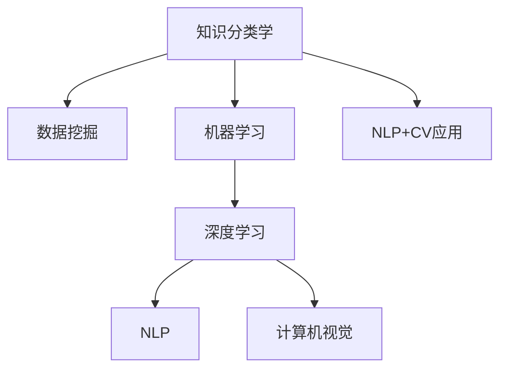

                 

# 人类的知识分类学：秩序之美

> 关键词：
- 知识分类学
- 人工智能
- 数据科学
- 机器学习
- 深度学习
- 计算理论

## 1. 背景介绍

### 1.1 问题由来

在人类文明发展的漫长历程中，知识的积累和分类一直是智慧传承的重要途径。随着信息时代的到来，数据量呈指数级增长，知识的分类、存储、检索和使用变得更为复杂。人类知识的秩序之美，在数字世界的构建中愈发显现。

然而，传统的知识分类方法已难以满足现代科技的发展需求。一方面，知识库过于庞大，手工分类效率低下；另一方面，知识之间的关联性日益复杂，分类标准难以统一。这些问题呼唤新的技术和理论来重新审视和改进知识分类学，使其适应数据驱动的未来。

### 1.2 问题核心关键点

面对数据和知识复杂性的挑战，人工智能（AI）和大数据技术提供了全新的解决方案。利用机器学习和深度学习算法，我们可以从海量的数据中自动学习知识模式，并建立新的分类标准。这种基于数据驱动的知识分类方法，不仅能够高效处理海量数据，还能够在保持分类的灵活性和适应性方面提供新的可能性。

这一技术领域涵盖了多个学科的知识，包括数据科学、人工智能、机器学习、深度学习、计算理论等。技术层面的突破为知识的科学分类提供了新的工具和方法。

### 1.3 问题研究意义

通过将人工智能和大数据技术应用于知识分类学，我们可以实现对知识的高效管理和智能利用。这一研究具有重要意义：

1. **提升知识获取效率**：借助机器学习算法，自动从大规模数据中挖掘有价值的信息，减少人工分类的时间成本。
2. **改善知识组织结构**：通过深度学习模型，发现知识之间的复杂关联，优化知识分类标准。
3. **促进跨领域知识整合**：借助多模态数据融合技术，整合不同领域的知识资源，形成更加全面和系统的知识体系。
4. **提升知识应用效果**：通过知识分类和组织，实现知识的智能检索和推荐，促进知识在各行各业中的应用。
5. **推动技术创新**：为新一代知识管理系统的开发和优化提供理论和方法支持。

## 2. 核心概念与联系

### 2.1 核心概念概述

为了更好地理解人工智能和大数据在知识分类中的应用，本节将介绍几个核心概念：

- **知识分类学(Knowledge Classification)**：研究如何将大规模无序数据自动转化为结构化的知识体系，从而方便知识的存储、检索和应用。
- **数据挖掘(Data Mining)**：利用算法从数据中自动发现隐藏模式和知识的过程，是知识分类学的重要技术基础。
- **机器学习(Machine Learning)**：通过算法使计算机自动学习知识，并利用这些知识进行分类、预测等任务。
- **深度学习(Deep Learning)**：一种通过多层次神经网络进行特征提取和分类的机器学习技术，适用于处理复杂结构化数据。
- **自然语言处理(Natural Language Processing, NLP)**：研究如何让计算机理解、处理和生成人类语言的技术，是知识分类学的核心领域之一。
- **计算机视觉(Computer Vision)**：利用算法让计算机理解图像和视频内容，进行分类和识别，是知识分类学的另一核心领域。

这些概念之间的联系可以通过以下Mermaid流程图来展示：



这个流程图展示了大数据和人工智能技术在知识分类中的应用路径：

1. 知识分类学从数据挖掘中获取原始数据。
2. 通过机器学习，对数据进行特征提取和分类。
3. 深度学习算法进一步提升了分类的准确性和鲁棒性。
4. NLP和计算机视觉技术分别用于处理文本和图像数据。
5. 这些技术手段最终应用在具体的知识分类应用场景中，如问答系统、信息检索、视觉搜索等。

## 3. 核心算法原理 & 具体操作步骤

### 3.1 算法原理概述

基于人工智能和大数据技术的知识分类方法，核心在于通过数据挖掘、机器学习、深度学习等算法，自动发现和利用数据中的知识模式，从而实现知识的分类和组织。

其基本步骤如下：

1. **数据采集**：从互联网、文献库、数据库等渠道收集数据。
2. **数据清洗**：对收集到的数据进行去重、纠错、标准化处理。
3. **特征提取**：通过算法提取数据的特征，为后续的分类和分析做准备。
4. **模型训练**：使用机器学习算法或深度学习算法，对数据进行训练，建立分类模型。
5. **模型评估**：对训练好的模型进行评估，确保其分类效果。
6. **知识分类**：利用模型对新数据进行分类，生成结构化的知识体系。

### 3.2 算法步骤详解

具体实现步骤如下：

1. **数据采集**：
   ```python
   import requests
   import json
   
   # 数据采集
   response = requests.get('https://example.com/data')
   data = json.loads(response.text)
   ```

2. **数据清洗**：
   ```python
   import pandas as pd
   
   # 数据清洗
   df = pd.DataFrame(data)
   df = df.drop_duplicates()  # 去重
   df = df.dropna()  # 删除缺失值
   df = df.fillna('')  # 填充空值
   ```

3. **特征提取**：
   ```python
   from sklearn.feature_extraction.text import TfidfVectorizer
   
   # 特征提取
   vectorizer = TfidfVectorizer(stop_words='english')
   X = vectorizer.fit_transform(df['content'])
   ```

4. **模型训练**：
   ```python
   from sklearn.model_selection import train_test_split
   from sklearn.linear_model import LogisticRegression
   
   # 模型训练
   X_train, X_test, y_train, y_test = train_test_split(X, df['label'], test_size=0.2)
   model = LogisticRegression()
   model.fit(X_train, y_train)
   ```

5. **模型评估**：
   ```python
   from sklearn.metrics import accuracy_score
   
   # 模型评估
   y_pred = model.predict(X_test)
   accuracy = accuracy_score(y_test, y_pred)
   print(f'Accuracy: {accuracy:.2f}')
   ```

6. **知识分类**：
   ```python
   # 知识分类
   new_data = vectorizer.transform(new_content)
   new_label = model.predict(new_data)
   ```

### 3.3 算法优缺点

基于人工智能和大数据技术的知识分类方法具有以下优点：

- **高效性**：自动处理大规模数据，大幅降低人工分类的时间和成本。
- **准确性**：通过机器学习算法，提高分类准确性。
- **灵活性**：分类标准和模型可以灵活调整，适应不同应用场景。

但同时也存在一些缺点：

- **数据依赖**：分类效果依赖于数据的质量和多样性。
- **模型复杂**：深度学习模型参数量大，训练复杂度高。
- **解释性不足**：模型的分类过程难以解释，缺乏透明度。
- **泛化能力**：过度依赖训练数据，泛化能力有限。

### 3.4 算法应用领域

基于人工智能和大数据技术的知识分类方法，在多个领域得到了广泛应用：

- **科学研究**：自动分类科学论文、专利，提高科研效率。
- **信息检索**：优化搜索引擎，提升搜索结果的相关性和准确性。
- **医疗健康**：自动分类医疗影像、病历，辅助诊断和治疗。
- **金融服务**：自动分类金融报告、新闻，预测市场趋势。
- **社交媒体**：自动分类用户评论，分析舆情。
- **智能客服**：自动分类用户咨询，提供个性化服务。

## 4. 数学模型和公式 & 详细讲解 & 举例说明

### 4.1 数学模型构建

知识分类学的数学模型主要基于机器学习和深度学习的算法，以下是其中的几个关键模型：

- **朴素贝叶斯(Naive Bayes)**：基于贝叶斯定理，对数据进行分类。
- **支持向量机(Support Vector Machine, SVM)**：通过在高维空间中找到最优超平面进行分类。
- **决策树(Decision Tree)**：基于树形结构对数据进行分类。
- **随机森林(Random Forest)**：通过集成多个决策树提高分类效果。
- **神经网络(Neural Network)**：通过多层神经网络进行特征提取和分类。

### 4.2 公式推导过程

以朴素贝叶斯算法为例，其分类公式为：

$$
P(Y|X) \propto \prod_{i=1}^{n} P(X_i|Y)P(Y)
$$

其中 $X$ 为特征向量，$Y$ 为分类标签，$P(Y|X)$ 表示在给定特征 $X$ 下，分类为 $Y$ 的概率。$P(X_i|Y)$ 为给定分类 $Y$ 下，特征 $X_i$ 的条件概率。$P(Y)$ 为先验概率。

### 4.3 案例分析与讲解

**案例1：文本分类**

```python
from sklearn.naive_bayes import MultinomialNB
from sklearn.pipeline import make_pipeline

# 特征提取
vectorizer = TfidfVectorizer(stop_words='english')
X = vectorizer.fit_transform(df['content'])

# 训练模型
model = make_pipeline(vectorizer, MultinomialNB())
model.fit(X, df['label'])

# 分类新数据
new_data = vectorizer.transform(new_content)
new_label = model.predict(new_data)
```

**案例2：图像分类**

```python
from keras.applications.resnet50 import ResNet50
from keras.preprocessing import image
from keras.applications.resnet50 import preprocess_input, decode_predictions

# 加载模型
model = ResNet50(weights='imagenet')

# 加载图像
img = image.load_img('image.jpg', target_size=(224, 224))
img_array = image.img_to_array(img)
img_array = np.expand_dims(img_array, axis=0)
img_array = preprocess_input(img_array)

# 分类图像
preds = model.predict(img_array)
labels = decode_predictions(preds, top=3)[0]
for label in labels:
    print(f'{label[1]}: {label[2]}')
```

## 5. 项目实践：代码实例和详细解释说明

### 5.1 开发环境搭建

在进行知识分类学实践前，我们需要准备好开发环境。以下是使用Python进行Scikit-learn开发的环境配置流程：

1. 安装Anaconda：从官网下载并安装Anaconda，用于创建独立的Python环境。
   ```bash
   conda create -n scikit-learn-env python=3.8 
   conda activate scikit-learn-env
   ```

2. 安装Scikit-learn：
   ```bash
   conda install scikit-learn
   ```

3. 安装相关库：
   ```bash
   pip install pandas numpy matplotlib scikit-learn nltk
   ```

完成上述步骤后，即可在`scikit-learn-env`环境中开始项目实践。

### 5.2 源代码详细实现

下面我们以文本分类任务为例，给出使用Scikit-learn对朴素贝叶斯模型进行分类的PyTorch代码实现。

首先，定义数据集：

```python
from sklearn.datasets import fetch_20newsgroups
from sklearn.feature_extraction.text import TfidfVectorizer
from sklearn.model_selection import train_test_split

# 加载数据集
data = fetch_20newsgroups(subset='train')
X = data.data
y = data.target

# 划分训练集和测试集
X_train, X_test, y_train, y_test = train_test_split(X, y, test_size=0.2, random_state=42)
```

然后，定义特征提取和模型训练：

```python
from sklearn.naive_bayes import MultinomialNB
from sklearn.pipeline import make_pipeline

# 特征提取
vectorizer = TfidfVectorizer(stop_words='english')

# 训练模型
model = make_pipeline(vectorizer, MultinomialNB())
model.fit(X_train, y_train)
```

最后，评估模型并进行分类：

```python
# 模型评估
from sklearn.metrics import accuracy_score

y_pred = model.predict(X_test)
accuracy = accuracy_score(y_test, y_pred)
print(f'Accuracy: {accuracy:.2f}')

# 分类新数据
new_data = vectorizer.transform(new_content)
new_label = model.predict(new_data)
```

### 5.3 代码解读与分析

让我们再详细解读一下关键代码的实现细节：

**fetch_20newsgroups函数**：
- 用于加载20个新组数据集，包含18个新闻组和20个训练样本，每个样本包含一个新闻文档和对应的类别标签。

**train_test_split函数**：
- 用于将数据集划分为训练集和测试集，并确保样本的随机性和可重复性。

**TfidfVectorizer类**：
- 用于将文本数据转换为TF-IDF特征向量，保留词语的频率和逆文档频率信息，适合文本分类任务。

**MultinomialNB类**：
- 用于训练朴素贝叶斯分类器，基于贝叶斯定理进行文本分类。

**make_pipeline函数**：
- 用于封装多个步骤的组合，方便快速构建管道。

可以看到，Scikit-learn提供的工具使得文本分类的代码实现变得简洁高效。开发者可以将更多精力放在数据处理、模型改进等高层逻辑上，而不必过多关注底层的实现细节。

当然，工业级的系统实现还需考虑更多因素，如模型的保存和部署、超参数的自动搜索、更灵活的任务适配层等。但核心的知识分类过程基本与此类似。

## 6. 实际应用场景

### 6.1 科研文献管理

科研文献管理一直是学术界的痛点问题，传统的手工分类和归档工作量大、效率低。基于知识分类学的自动化方法，可以有效解决这一问题。

通过爬取互联网上的科研论文，提取论文标题、摘要、引用等信息，并对其进行分类。使用自然语言处理技术，如TF-IDF、LDA等，提取论文的关键词和主题，然后利用机器学习算法，如朴素贝叶斯、支持向量机等，对论文进行自动分类。

这将大幅提升科研文献的管理效率，同时也能为研究人员提供更加高效、准确的检索服务。

### 6.2 金融市场分析

金融市场瞬息万变，快速、准确的信息分析是获取高收益的关键。通过收集金融报告、新闻、社交媒体等信息，并对其进行分类和情感分析，可以实时监测市场动态。

具体而言，可以构建一个实时数据流，通过自然语言处理技术对新闻和社交媒体文本进行情感分析和主题分类，然后利用机器学习算法，如随机森林、神经网络等，对市场趋势进行预测。这将帮助投资者做出更加准确的投资决策。

### 6.3 医疗影像诊断

医疗影像诊断是医疗领域的重要任务，传统的基于医生的诊断方法效率低、误差大。基于知识分类学的自动诊断方法，可以大幅提升诊断的准确性和效率。

通过收集并标注大量的医疗影像数据，然后利用深度学习算法，如卷积神经网络(CNN)、循环神经网络(RNN)等，对影像进行自动分类和分析。这将显著提高诊断的效率和准确性，为医疗工作带来革命性变革。

### 6.4 未来应用展望

随着人工智能和大数据技术的不断进步，基于知识分类学的应用场景将更加广阔：

- **智能推荐系统**：通过自动分类用户行为数据，实现个性化的内容推荐，提升用户体验。
- **自动摘要系统**：对长文本进行自动分类和摘要，生成简洁明了的摘要内容。
- **知识图谱构建**：通过自动分类和关联，构建更加全面、系统的知识图谱，方便知识管理和应用。
- **信息检索系统**：利用自动分类和索引技术，提升信息检索的准确性和效率。
- **社交媒体分析**：通过自动分类和情感分析，实时监测舆情，预测社会动态。

这些应用场景将深刻改变人类的工作和生活方式，推动社会生产力的提升。相信在不久的将来，基于知识分类学的技术将广泛应用，为人类知识的秩序之美添上浓墨重彩的一笔。

## 7. 工具和资源推荐

### 7.1 学习资源推荐

为了帮助开发者系统掌握知识分类学的理论基础和实践技巧，这里推荐一些优质的学习资源：

1. **《机器学习》（周志华）**：系统介绍机器学习的基本概念、算法和应用，是学习知识分类学的必读之作。
2. **《深度学习》（Ian Goodfellow）**：全面讲解深度学习的原理和应用，适合深入学习知识分类学的高阶算法。
3. **Coursera课程**：斯坦福大学的《机器学习》课程，由Andrew Ng主讲，覆盖机器学习的基本概念和应用。
4. **Kaggle竞赛**：参加Kaggle上的数据挖掘和机器学习竞赛，实战演练知识分类学的应用技能。
5. **GitHub项目**：如Scikit-learn，提供丰富的机器学习库和代码示例，方便开发者快速上手。

通过对这些资源的学习实践，相信你一定能够快速掌握知识分类学的精髓，并用于解决实际的分类问题。

### 7.2 开发工具推荐

高效的开发离不开优秀的工具支持。以下是几款用于知识分类学开发的常用工具：

1. **Python**：编程语言，支持Scikit-learn、TensorFlow等常用机器学习库。
2. **Jupyter Notebook**：交互式编程环境，方便开发者快速实验和分享代码。
3. **TensorBoard**：TensorFlow的可视化工具，可以实时监测模型训练状态，提供丰富的图表呈现方式。
4. **PyTorch**：深度学习框架，支持动态计算图，适合快速迭代研究。
5. **WEKA**：机器学习工作流工具，方便数据预处理和模型训练。

合理利用这些工具，可以显著提升知识分类学任务的开发效率，加快创新迭代的步伐。

### 7.3 相关论文推荐

知识分类学的研究源于学界的持续研究。以下是几篇奠基性的相关论文，推荐阅读：

1. **《A Survey of Text Classification Techniques》**：全面综述了文本分类的多种算法和技术，适合初学者入门。
2. **《ImageNet Classification with Deep Convolutional Neural Networks》**：提出卷积神经网络，开创了深度学习在图像分类中的应用。
3. **《Deep Learning for NLP》**：介绍深度学习在自然语言处理中的应用，适合深入学习知识分类学的高级算法。
4. **《Knowledge-Graph Embeddings》**：讨论知识图谱的构建和表示学习，为知识分类学提供新的思路。
5. **《Multi-Task Learning with Adversarial Data Augmentation》**：提出多任务学习与对抗数据增强技术，提升模型泛化能力。

这些论文代表了大数据和人工智能技术在知识分类学的发展脉络。通过学习这些前沿成果，可以帮助研究者把握学科前进方向，激发更多的创新灵感。

## 8. 总结：未来发展趋势与挑战

### 8.1 总结

本文对基于人工智能和大数据技术的知识分类学进行了全面系统的介绍。首先阐述了知识分类学的研究背景和意义，明确了其在人工智能和大数据时代的重要性。其次，从原理到实践，详细讲解了知识分类学的数学模型和操作步骤，给出了具体的代码实例。同时，本文还广泛探讨了知识分类学的应用场景，展示了其在科研文献管理、金融市场分析、医疗影像诊断等诸多领域的应用前景。

通过本文的系统梳理，可以看到，基于大数据和人工智能的知识分类方法正在成为科学研究、商业决策、医疗健康等领域的重要工具。其高效、准确、灵活的特点，为人类知识的组织和管理带来了新的可能性。未来，伴随技术不断进步，知识分类学必将在更广阔的领域发挥其独特价值，推动社会的进步和发展。

### 8.2 未来发展趋势

展望未来，知识分类学将呈现以下几个发展趋势：

1. **多模态融合**：将文本、图像、音频等多模态数据进行融合，提高分类效果。
2. **跨领域迁移**：通过迁移学习，实现知识在不同领域的自动迁移和应用。
3. **自适应学习**：引入自适应学习算法，提高模型对新数据的适应能力。
4. **分布式计算**：利用分布式计算框架，提高模型训练和推理的效率。
5. **解释性增强**：引入可解释性模型，提高分类过程的透明性和可理解性。
6. **伦理和社会责任**：引入伦理和社会责任评估，确保知识分类学的应用符合社会价值观。

以上趋势凸显了知识分类学的广阔前景。这些方向的探索发展，必将进一步提升分类模型的性能和应用范围，为人类知识的科学分类提供新的方法。

### 8.3 面临的挑战

尽管知识分类学已经取得了瞩目成就，但在迈向更加智能化、普适化应用的过程中，它仍面临着诸多挑战：

1. **数据质量**：分类效果依赖于数据的质量和多样性，如何获取高质量、高覆盖率的数据是一个难题。
2. **模型复杂度**：深度学习模型参数量大，训练复杂度高，如何降低模型复杂度，提高训练效率，是一个关键问题。
3. **解释性不足**：模型的分类过程难以解释，缺乏透明度，如何增强模型的可解释性，是一个重要课题。
4. **泛化能力**：过度依赖训练数据，泛化能力有限，如何提高模型的泛化能力，是一个重要研究方向。
5. **计算资源**：大规模数据和高维度特征的处理，需要大量计算资源，如何优化计算资源，是一个关键问题。
6. **伦理和社会责任**：模型可能学习到有偏见、有害的信息，如何确保模型的伦理和社会责任，是一个重要课题。

正视知识分类学面临的这些挑战，积极应对并寻求突破，将是大数据和人工智能技术不断进步的重要动力。

### 8.4 研究展望

未来的研究需要在以下几个方面寻求新的突破：

1. **跨领域迁移学习**：探索如何实现知识在不同领域的自动迁移和应用，提升模型的泛化能力。
2. **自适应学习算法**：引入自适应学习算法，提高模型对新数据的适应能力。
3. **多模态融合技术**：将文本、图像、音频等多模态数据进行融合，提高分类效果。
4. **分布式计算框架**：利用分布式计算框架，提高模型训练和推理的效率。
5. **可解释性增强**：引入可解释性模型，提高分类过程的透明性和可理解性。
6. **伦理和社会责任**：引入伦理和社会责任评估，确保知识分类学的应用符合社会价值观。

这些研究方向的探索，必将推动知识分类学向更高的台阶发展，为人类知识的科学分类提供新的方法和工具。

## 9. 附录：常见问题与解答

**Q1: 知识分类学的应用场景有哪些？**

A: 知识分类学的应用场景非常广泛，涵盖科研文献管理、金融市场分析、医疗影像诊断等多个领域。具体应用场景包括：

1. **科研文献管理**：自动分类科研论文，提高科研效率。
2. **金融市场分析**：自动分类金融报告、新闻，预测市场趋势。
3. **医疗影像诊断**：自动分类医疗影像，提高诊断效率。
4. **信息检索系统**：自动分类和索引文本，提升信息检索效率。
5. **智能推荐系统**：自动分类用户行为数据，实现个性化推荐。
6. **社交媒体分析**：自动分类和情感分析，实时监测舆情。

**Q2: 如何选择合适的特征提取方法？**

A: 选择合适的特征提取方法，要根据具体应用场景和数据特征来决定。以下是一些常用的特征提取方法：

1. **TF-IDF**：用于文本分类和检索，提取文本的关键词和主题。
2. **LDA**：用于主题建模，提取文本的主题分布。
3. **SIFT**：用于图像分类，提取图像的局部特征。
4. **CNN**：用于图像分类和识别，提取图像的卷积特征。
5. **RNN**：用于序列数据分类，提取序列的时间依赖特征。

**Q3: 如何提高知识分类模型的泛化能力？**

A: 提高知识分类模型的泛化能力，可以通过以下方法：

1. **数据增强**：通过数据增强技术，扩充训练数据集的多样性。
2. **正则化**：引入正则化技术，防止模型过拟合。
3. **迁移学习**：通过迁移学习，利用已有知识，提高模型的泛化能力。
4. **集成学习**：通过集成多个模型，提高模型的稳定性和泛化能力。
5. **自适应学习**：引入自适应学习算法，提高模型对新数据的适应能力。

**Q4: 知识分类学的核心算法有哪些？**

A: 知识分类学的核心算法包括：

1. **朴素贝叶斯**：基于贝叶斯定理，对数据进行分类。
2. **支持向量机**：通过在高维空间中找到最优超平面进行分类。
3. **决策树**：基于树形结构对数据进行分类。
4. **随机森林**：通过集成多个决策树提高分类效果。
5. **神经网络**：通过多层神经网络进行特征提取和分类。

**Q5: 如何评估知识分类模型的性能？**

A: 评估知识分类模型的性能，通常使用以下指标：

1. **准确率**：分类正确的样本数占总样本数的比例。
2. **召回率**：分类正确的正样本数占实际正样本数的比例。
3. **F1分数**：综合考虑准确率和召回率的加权平均值。
4. **ROC曲线**：绘制分类器的真正例率与假正例率之间的关系曲线，评估分类器的性能。
5. **混淆矩阵**：显示分类器在不同类别上的分类情况，直观展示分类器的性能。

---

作者：禅与计算机程序设计艺术 / Zen and the Art of Computer Programming

