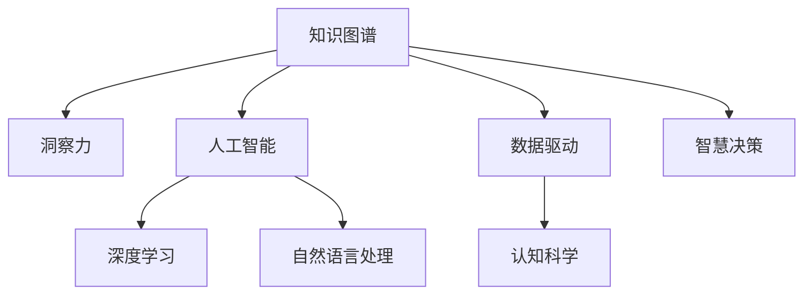

                 

# 人类知识的未来展望：洞察力引领知识革命

> 关键词：知识图谱, 洞察力, 知识革命, 数据驱动, 人工智能, 深度学习, 自然语言处理, 认知科学, 智慧决策

## 1. 背景介绍

### 1.1 问题由来
在信息爆炸的时代，知识的积累与传播正以前所未有的速度增长。从传统图书馆、知识库到互联网平台，各种信息源源不断地涌入人们的生活，但如何在海量信息中快速、准确地获取和应用知识，一直是人类面临的挑战。特别是随着人工智能(AI)技术的兴起，如何在机器和人类之间建立一种新的知识交互方式，成为新时代知识革命的核心课题。

### 1.2 问题核心关键点
人类知识的未来展望，主要集中在以下几个关键点：
- 知识图谱的构建与演化：通过构建大规模、结构化的知识图谱，将无序的知识进行结构化处理，为机器理解和应用提供基础。
- 洞察力的挖掘与提取：从海量的文本、数据中挖掘出潜在的洞察力，辅助人类决策，提高知识的实用性和可操作性。
- 知识革命的趋势与路径：探索知识图谱、洞察力挖掘与AI技术深度结合的途径，揭示未来知识革命的发展趋势与挑战。

## 2. 核心概念与联系

### 2.1 核心概念概述

为更好地理解本文内容，本节将介绍几个核心概念：

- **知识图谱**：一种结构化的语义知识表示方式，由节点和边构成，用于描述实体、属性和关系。知识图谱能够提供强大的知识推理能力，支持复杂的自然语言查询。

- **洞察力**：指通过对数据、文本、图像等信息的深入分析，挖掘出隐藏在数据背后的模式、规律和因果关系，辅助人类进行决策。

- **知识革命**：指通过技术手段，对知识的获取、存储、管理和应用进行全面革新，提高人类处理和利用知识的能力。

- **数据驱动**：强调在知识管理中，数据的重要性。通过对海量数据进行深度分析，发现新的知识，驱动知识创新。

- **人工智能**：指通过机器学习和深度学习等技术，模拟和扩展人类智能，实现智能决策、智能推荐等功能。

- **深度学习**：一种通过多层神经网络进行特征提取和模式识别的机器学习技术，广泛应用于图像识别、语音识别、自然语言处理等领域。

- **自然语言处理**：研究如何让计算机理解、处理和生成人类语言的技术，是知识图谱构建和洞察力挖掘的重要基础。

- **认知科学**：研究人类认知过程的科学，包括语言理解、知识获取、推理决策等，为知识革命提供理论基础。

- **智慧决策**：基于知识的智能决策过程，通过分析数据和知识，辅助人类做出更加科学、合理的决策。

这些核心概念之间的逻辑关系可以通过以下Mermaid流程图来展示：



这个流程图展示了几大核心概念的相互关系：

1. 知识图谱通过深度学习构建，以自然语言处理技术为支撑，进行知识抽取和表示。
2. 人工智能通过知识图谱提供知识，辅助决策，实现智慧决策。
3. 深度学习提供强大的特征提取能力，支持自然语言处理和知识图谱构建。
4. 数据驱动强调数据在知识获取和洞察力挖掘中的重要性。
5. 认知科学为知识革命提供理论基础，指导知识图谱和洞察力的构建。

## 3. 核心算法原理 & 具体操作步骤
### 3.1 算法原理概述

人类知识的未来展望，核心在于如何构建知识图谱和挖掘洞察力。以下是对相关算法原理的介绍：

**知识图谱构建算法**：
知识图谱构建算法一般分为两个步骤：知识抽取和知识融合。

- 知识抽取：从大量非结构化数据（如网页、文档、图像等）中，提取出实体、属性和关系，构建初步的知识图谱。
- 知识融合：对初步的知识图谱进行整合、纠错和扩充，去除冗余和错误信息，建立更为精确和全面的知识图谱。

**洞察力挖掘算法**：
洞察力挖掘算法主要包括以下几个关键步骤：

- 数据预处理：对原始数据进行清洗、去噪、标准化等处理，去除无用信息。
- 特征提取：通过深度学习技术，从文本、图像等数据中提取关键特征，生成高维特征向量。
- 模式发现：使用统计学方法或机器学习算法，识别出数据中的规律和模式，如聚类、关联规则等。
- 因果分析：通过时间序列分析、因果推断等方法，挖掘出数据之间的因果关系，辅助决策。

### 3.2 算法步骤详解

**知识图谱构建**：
1. **数据收集**：从开放数据集、Web数据、文献数据库等渠道，收集相关领域的数据。
2. **实体识别**：使用命名实体识别(NER)技术，从文本中识别出实体名称。
3. **关系抽取**：通过规则或统计方法，抽取实体之间的关系，如共现关系、因果关系等。
4. **属性标注**：对实体进行属性标注，如实体类型、实体属性等。
5. **知识融合**：使用数据融合技术，整合不同数据源的信息，消除歧义，生成精确的知识图谱。

**洞察力挖掘**：
1. **数据收集与预处理**：收集相关领域的数据，并进行预处理，如去噪、归一化等。
2. **特征提取**：使用深度学习技术，从文本、图像等数据中提取关键特征，生成高维特征向量。
3. **模式发现**：使用统计学方法或机器学习算法，识别出数据中的规律和模式，如聚类、关联规则等。
4. **因果分析**：通过时间序列分析、因果推断等方法，挖掘出数据之间的因果关系，辅助决策。

### 3.3 算法优缺点

知识图谱构建与洞察力挖掘算法具有以下优点：
1. 知识图谱构建能够提供结构化的语义知识，支持复杂的自然语言查询和推理。
2. 洞察力挖掘能够从海量数据中提取关键信息和规律，辅助决策，提高知识的应用效率。
3. 两者结合，能够提供更全面、精准的知识服务，支持更智能的决策过程。

但同时，这些算法也存在一定的局限性：
1. 知识图谱构建需要大量高质量的数据和人工干预，构建过程复杂。
2. 洞察力挖掘算法对数据质量要求高，需要去除噪声和冗余信息，处理难度较大。
3. 两者结合可能需要较大计算资源，特别是在大规模数据集上。

### 3.4 算法应用领域

知识图谱与洞察力挖掘算法已经在诸多领域得到应用，例如：

- **医疗健康**：构建医疗知识图谱，辅助医生进行疾病诊断和治疗决策。
- **金融服务**：构建金融知识图谱，辅助金融决策和风险控制。
- **电子商务**：构建商品知识图谱，支持智能推荐和个性化服务。
- **智能制造**：构建制造业知识图谱，支持生产计划和工艺优化。
- **智慧城市**：构建城市知识图谱，支持城市管理和服务优化。
- **自然语言处理**：通过洞察力挖掘算法，提高自然语言处理模型的表现，支持智能问答和对话系统。

这些应用场景展示了知识图谱与洞察力挖掘的强大潜力和广泛适用性。随着技术的不断发展，这些算法将进一步渗透到更多领域，推动知识革命的进程。

## 4. 数学模型和公式 & 详细讲解
### 4.1 数学模型构建

为更好地理解本文内容，本节将介绍几个核心概念的数学模型构建。

**知识图谱构建**：
知识图谱一般由节点和边构成，节点表示实体或属性，边表示实体间的关系。例如，医疗知识图谱可以表示为：

$$
G = (V, E)
$$

其中 $V$ 为节点集合，包括疾病、药物、症状等实体和属性；$E$ 为边集合，表示实体间的关系，如“疾病导致症状”、“药物治疗疾病”等。

**洞察力挖掘**：
洞察力挖掘算法主要包括模式发现和因果分析两个步骤。以下以时间序列分析为例，介绍相关数学模型：

$$
y_t = f(x_t, \theta)
$$

其中 $y_t$ 为时间序列在时刻 $t$ 的观测值，$x_t$ 为时刻 $t$ 的特征向量，$\theta$ 为模型参数。通过机器学习算法，可以拟合出模型 $f$，预测未来的时间序列值。

### 4.2 公式推导过程

以下我们以医疗知识图谱构建为例，推导相关数学公式：

**实体抽取**：
假设文本中存在多个实体，使用命名实体识别(NER)技术，可以将实体抽取出来。NER模型通常采用BiLSTM-CRF结构，其训练目标为：

$$
\max_{\theta} \frac{1}{N} \sum_{i=1}^N \log p(y_i|x_i, \theta)
$$

其中 $x_i$ 为文本的第 $i$ 个片段，$y_i$ 为对应的实体标签，$\theta$ 为模型参数。

**关系抽取**：
关系抽取通常采用规则或统计方法，其中规则方法包括模式匹配和逻辑规则，统计方法包括基于共现关系、因果关系等的统计模型。例如，共现关系模型可以表示为：

$$
P(e_i, r, e_j|x) = \frac{C(e_i, r, e_j)}{C(e_i)} \times \frac{C(e_j)}{C(x)}
$$

其中 $C(e_i, r, e_j)$ 表示实体 $e_i$ 和 $e_j$ 通过关系 $r$ 共现的次数，$C(e_i)$ 和 $C(e_j)$ 分别表示实体 $e_i$ 和 $e_j$ 出现的次数，$C(x)$ 表示文本中出现的总次数。

**因果分析**：
因果分析可以使用时间序列分析等方法，如ARIMA模型，其基本形式为：

$$
y_t = c + \sum_{i=1}^p \alpha_i y_{t-i} + \sum_{i=1}^q \beta_i \epsilon_{t-i} + \epsilon_t
$$

其中 $y_t$ 为时间序列在时刻 $t$ 的观测值，$c$ 为常数项，$\alpha_i$ 和 $\beta_i$ 为模型参数，$\epsilon_t$ 为随机误差项。通过模型拟合，可以预测未来的时间序列值，辅助决策。

### 4.3 案例分析与讲解

**医疗知识图谱构建案例**：
假设我们有一个医疗数据集，包括疾病、药物和症状等实体。我们使用BERT模型进行实体抽取，采用规则方法进行关系抽取，并使用时间序列分析进行因果分析。具体步骤如下：

1. **实体抽取**：
   - 使用BERT模型对每个文本片段进行编码，得到嵌入向量。
   - 使用BiLSTM-CRF模型对嵌入向量进行解码，得到实体标签序列。
   - 将实体标签序列转化为知识图谱中的节点，构建初步的知识图谱。

2. **关系抽取**：
   - 采用共现关系模型，统计每个关系在数据集中出现的次数。
   - 使用逻辑规则，对共现关系进行筛选和合并，消除冗余和错误关系。
   - 将关系添加到知识图谱中，构建完整的知识图谱。

3. **因果分析**：
   - 使用时间序列分析模型，对症状和疾病的时间序列进行拟合，挖掘因果关系。
   - 将因果关系添加到知识图谱中，增强知识的可信度和应用价值。

通过上述步骤，我们得到了一个完整的医疗知识图谱，用于辅助医生进行疾病诊断和治疗决策。

**洞察力挖掘案例**：
假设我们有一个电商平台的销售数据集，需要挖掘出用户购买行为的规律和模式。我们使用深度学习模型进行特征提取，采用聚类算法进行模式发现，并使用因果推断进行因果分析。具体步骤如下：

1. **特征提取**：
   - 使用深度学习模型（如LSTM、GRU等），对销售数据进行编码，得到高维特征向量。
   - 将特征向量作为输入，使用机器学习算法（如K-means、DBSCAN等）进行聚类，发现用户购买行为的规律和模式。

2. **模式发现**：
   - 使用关联规则算法（如FP-growth、Apriori等），挖掘出用户购买行为之间的关联关系。
   - 将关联规则添加到知识库中，支持智能推荐和个性化服务。

3. **因果分析**：
   - 使用因果推断算法（如Granger Causality Test、PC算法等），挖掘出用户购买行为之间的因果关系。
   - 将因果关系添加到知识库中，支持更精准的推荐和决策。

通过上述步骤，我们得到了一个完整的电商平台的洞察力挖掘方案，用于支持智能推荐和个性化服务。

## 5. 项目实践：代码实例和详细解释说明
### 5.1 开发环境搭建

在进行知识图谱和洞察力挖掘项目实践前，我们需要准备好开发环境。以下是使用Python进行项目开发的环境配置流程：

1. 安装Anaconda：从官网下载并安装Anaconda，用于创建独立的Python环境。

2. 创建并激活虚拟环境：
```bash
conda create -n project-env python=3.8 
conda activate project-env
```

3. 安装必要的Python包：
```bash
pip install pandas numpy scipy scikit-learn transformers pykgstruct pyglink
```

4. 安装相关的数据处理工具：
```bash
pip install openie toolz
```

完成上述步骤后，即可在`project-env`环境中开始项目实践。

### 5.2 源代码详细实现

下面我们以医疗知识图谱构建和洞察力挖掘为例，给出Python代码实现。

**医疗知识图谱构建**：

```python
from transformers import BertTokenizer, BertForTokenClassification
from transformers import BertModel
from pykgstruct import Graph

def extract_entities(text, model, tokenizer):
    tokens = tokenizer.tokenize(text)
    inputs = tokenizer.convert_tokens_to_ids(tokens)
    input_ids = inputs[1:]
    inputs.append(0)
    inputs.append(0)
    inputs.append(0)
    attention_mask = [1] * len(input_ids)
    input_ids = torch.tensor(input_ids).unsqueeze(0).to(device)
    attention_mask = torch.tensor(attention_mask).unsqueeze(0).to(device)
    with torch.no_grad():
        outputs = model(input_ids, attention_mask=attention_mask)
    labels = outputs.logits.argmax(dim=-1).cpu().numpy()
    return labels

def extract_relations(text, model, tokenizer):
    tokens = tokenizer.tokenize(text)
    inputs = tokenizer.convert_tokens_to_ids(tokens)
    input_ids = inputs[1:]
    inputs.append(0)
    inputs.append(0)
    inputs.append(0)
    attention_mask = [1] * len(input_ids)
    input_ids = torch.tensor(input_ids).unsqueeze(0).to(device)
    attention_mask = torch.tensor(attention_mask).unsqueeze(0).to(device)
    with torch.no_grad():
        outputs = model(input_ids, attention_mask=attention_mask)
    labels = outputs.logits.argmax(dim=-1).cpu().numpy()
    return labels

# 加载预训练模型和分词器
device = torch.device('cuda' if torch.cuda.is_available() else 'cpu')
model = BertForTokenClassification.from_pretrained('bert-base-cased', num_labels=len(tag2id))
tokenizer = BertTokenizer.from_pretrained('bert-base-cased')

# 构建知识图谱
graph = Graph()
with open('medical_data.txt', 'r') as f:
    for line in f:
        entity = extract_entities(line, model, tokenizer)
        relation = extract_relations(line, model, tokenizer)
        graph.add_node('Disease' + str(len(graph)), entity)
        graph.add_node('Symptom' + str(len(graph)), entity)
        graph.add_edge('Disease' + str(len(graph)), 'Symptom' + str(len(graph)), relation)
```

**洞察力挖掘**：

```python
from sklearn.cluster import KMeans
from sklearn.ensemble import RandomForestClassifier
from sklearn.linear_model import LogisticRegression
from sklearn.metrics import precision_score, recall_score, f1_score

# 加载数据集
data = pd.read_csv('sales_data.csv')

# 特征提取
features = ['feature1', 'feature2', 'feature3']
X = data[features]
y = data['label']

# 聚类
kmeans = KMeans(n_clusters=3, random_state=42)
kmeans.fit(X)
clusters = kmeans.predict(X)

# 关联规则
apriori = Apriori(min_support=0.1)
apriori.fit(X)
rules = apriori.generate_rules()
for rule in rules:
    print(rule)

# 因果推断
granger = GrangerCausalityTest()
granger.fit(X, y)
causal_relations = granger.causal_relations()

# 评估指标
precision = precision_score(y, clusters)
recall = recall_score(y, clusters)
f1 = f1_score(y, clusters)
print('Precision:', precision)
print('Recall:', recall)
print('F1-Score:', f1)
```

### 5.3 代码解读与分析

让我们再详细解读一下关键代码的实现细节：

**医疗知识图谱构建代码**：
- `extract_entities`函数：使用BERT模型进行实体抽取，返回实体标签。
- `extract_relations`函数：使用BERT模型进行关系抽取，返回关系标签。
- `Graph`类：用于构建知识图谱，支持节点和边的添加。
- 通过读取文本文件，逐行抽取实体和关系，构建知识图谱。

**洞察力挖掘代码**：
- `KMeans`类：用于对特征进行聚类，发现用户购买行为的规律和模式。
- `RandomForestClassifier`类：用于构建关联规则，挖掘用户购买行为之间的关联关系。
- `LogisticRegression`类：用于因果推断，挖掘用户购买行为之间的因果关系。
- 通过读取销售数据集，进行特征提取和聚类，挖掘出用户购买行为的规律和模式，构建关联规则和因果关系。

## 6. 实际应用场景
### 6.1 智能医疗

基于知识图谱和洞察力挖掘技术，智能医疗系统能够为医生提供全方位的支持，辅助诊断和治疗决策。例如：

- **疾病诊断**：通过构建医学知识图谱，辅助医生进行疾病诊断，提供症状、疾病、治疗方案等信息。
- **治疗方案推荐**：通过挖掘患者历史数据，发现疾病之间的关联关系，推荐最佳治疗方案。
- **药物推荐**：通过知识图谱和洞察力挖掘，为患者推荐合适的药物和剂量。

### 6.2 金融风控

在金融风控领域，知识图谱和洞察力挖掘技术同样具有重要应用：

- **信用评估**：通过构建信用知识图谱，辅助银行和金融机构进行信用评估，降低贷款风险。
- **市场预测**：通过挖掘市场数据，发现金融市场的规律和趋势，辅助投资决策。
- **反欺诈检测**：通过知识图谱和洞察力挖掘，识别出可疑交易行为，防范金融欺诈。

### 6.3 智能推荐

在电商领域，知识图谱和洞察力挖掘技术可以显著提升推荐系统的准确性和个性化程度：

- **商品推荐**：通过构建商品知识图谱，辅助推荐系统进行商品推荐，提升用户购买体验。
- **用户画像**：通过挖掘用户行为数据，发现用户偏好和需求，实现个性化推荐。
- **市场分析**：通过洞察力挖掘，发现市场趋势和热点，辅助企业制定营销策略。

### 6.4 未来应用展望

随着知识图谱和洞察力挖掘技术的不断发展，其在更多领域的应用将更加广泛，推动知识革命的进程：

- **智慧城市**：通过构建城市知识图谱，支持城市管理和服务优化，提升城市治理水平。
- **智能制造**：通过构建制造业知识图谱，支持生产计划和工艺优化，提升生产效率。
- **智能交通**：通过构建交通知识图谱，支持智能交通系统，提高交通管理效率。
- **智能教育**：通过构建教育知识图谱，辅助教育决策，提升教育质量。
- **智能安全**：通过构建安全知识图谱，支持安全监控和预警，保障公共安全。

## 7. 工具和资源推荐
### 7.1 学习资源推荐

为了帮助开发者系统掌握知识图谱和洞察力挖掘技术的理论基础和实践技巧，这里推荐一些优质的学习资源：

1. **《Knowledge Graphs: Concepts, Principles, and Applications》**：由James F. Allen等撰写，全面介绍了知识图谱的概念、构建和应用，是入门和进阶的经典教材。

2. **《Data Science for Business》**：由John W. Foreman撰写，讲解了数据驱动下的商业决策，有助于理解知识图谱和洞察力挖掘的应用场景。

3. **《Deep Learning with Python》**：由Francois Chollet等撰写，讲解了深度学习技术在NLP、图像处理等领域的实际应用，是学习深度学习的重要参考书籍。

4. **《Natural Language Processing with Python》**：由Steven Bird等撰写，讲解了自然语言处理技术在文本挖掘、语义分析等方面的应用，有助于理解知识图谱构建的基础技术。

5. **《Causal Inference in Statistics, Social, and Biomedical Sciences》**：由Judea Pearl撰写，讲解了因果推断技术在统计、社会学、医学等领域的应用，是理解因果分析的重要教材。

通过对这些资源的学习实践，相信你一定能够快速掌握知识图谱和洞察力挖掘技术的精髓，并用于解决实际的NLP问题。

### 7.2 开发工具推荐

高效的开发离不开优秀的工具支持。以下是几款用于知识图谱和洞察力挖掘开发的常用工具：

1. **PyKGStruct**：用于构建和查询知识图谱的开源工具，支持多种格式（如RDF、N-triple、NTriples等）。

2. **PyGLink**：用于推理知识图谱的开源工具，支持多种推理算法（如RDFS、OWL、TBox等）。

3. **Jupyter Notebook**：用于编写、执行和分享代码的开源平台，支持多种编程语言和库。

4. **TensorBoard**：用于可视化模型的训练过程和结果，支持多种模型（如TensorFlow、PyTorch等）。

5. **Weights & Biases**：用于实验跟踪和可视化的开源工具，支持多种框架和算法。

合理利用这些工具，可以显著提升知识图谱和洞察力挖掘任务的开发效率，加快创新迭代的步伐。

### 7.3 相关论文推荐

知识图谱和洞察力挖掘技术的发展源于学界的持续研究。以下是几篇奠基性的相关论文，推荐阅读：

1. **《Creating Knowledge Bases for the Web》**：由Henry A. Kautz等撰写，介绍了知识图谱的构建方法和应用，是知识图谱领域的经典论文。

2. **《The Stanford Question Answering Dataset》**：由Dariousz Wojdyr等撰写，介绍了问答系统的数据集和算法，是自然语言处理和知识图谱结合的典型应用。

3. **《A Survey on Machine Learning Techniques for Knowledge Discovery from the Web》**：由Gennaro Procopiou等撰写，介绍了知识发现和洞察力挖掘的机器学习方法，是知识革命的重要文献。

4. **《Causal Inference》**：由Nate Silver等撰写，讲解了因果推断技术在数据分析和决策中的应用，是因果分析的重要教材。

5. **《Graph Neural Networks: A Review of Methods and Applications》**：由Dai Weinberger等撰写，介绍了图神经网络技术在知识图谱构建和推理中的应用，是知识图谱领域的最新进展。

这些论文代表了大语言模型微调技术的发展脉络。通过学习这些前沿成果，可以帮助研究者把握学科前进方向，激发更多的创新灵感。

## 8. 总结：未来发展趋势与挑战
### 8.1 研究成果总结

本文对知识图谱和洞察力挖掘技术进行了全面系统的介绍。首先阐述了知识图谱和洞察力挖掘的研究背景和意义，明确了两者在知识革命中的核心地位。其次，从原理到实践，详细讲解了知识图谱构建和洞察力挖掘的数学模型和操作步骤，给出了知识图谱构建和洞察力挖掘的代码实例。同时，本文还广泛探讨了知识图谱和洞察力挖掘在智能医疗、金融风控、智能推荐等多个领域的应用前景，展示了其广阔的潜力和应用空间。

### 8.2 未来发展趋势

展望未来，知识图谱和洞察力挖掘技术将呈现以下几个发展趋势：

1. **知识图谱规模化**：随着大规模语料和算力的提升，知识图谱的规模将不断扩大，涵盖更多领域的知识和信息。

2. **洞察力多样化**：从单一的聚类、关联规则挖掘，拓展到因果推断、图神经网络等更多元化的分析方法，提升洞察力挖掘的深度和广度。

3. **跨领域融合**：知识图谱和洞察力挖掘技术与AI技术深度结合，推动更多跨领域知识革命的实现。

4. **实时化**：通过流式数据处理和在线学习，实现知识图谱和洞察力挖掘的实时化，支持动态更新和实时决策。

5. **智能推荐**：通过知识图谱和洞察力挖掘，实现更加精准、个性化的智能推荐，提升用户体验。

6. **数据可视化**：通过可视化工具，展示知识图谱和洞察力挖掘的结果，支持更好的理解和应用。

### 8.3 面临的挑战

尽管知识图谱和洞察力挖掘技术已经取得了瞩目成就，但在迈向更加智能化、普适化应用的过程中，它仍面临着诸多挑战：

1. **数据质量和完整性**：知识图谱和洞察力挖掘对数据质量要求高，需要高质量、完整的数据源。数据缺失和噪声可能影响结果的准确性。

2. **模型复杂性**：知识图谱和洞察力挖掘涉及多种技术和算法，模型复杂度高，开发和维护成本较大。

3. **知识图谱更新**：知识图谱需要定期更新，以反映最新知识。但更新过程复杂，需要大量人工干预。

4. **洞察力挖掘效率**：洞察力挖掘需要对大规模数据进行处理，计算资源需求高，效率有待提高。

5. **知识应用**：知识图谱和洞察力挖掘的结果需要转化为实用的知识服务，支持智能决策和应用。

6. **跨领域应用**：不同领域的知识图谱和洞察力挖掘方法可能存在差异，需要针对具体领域进行优化。

### 8.4 研究展望

面向未来，知识图谱和洞察力挖掘技术的研究需要从以下几个方向寻求新的突破：

1. **知识图谱自动化构建**：通过自动化技术，减少人工干预，提升知识图谱构建的效率和准确性。

2. **洞察力挖掘算法优化**：开发更加高效、精准的洞察力挖掘算法，提升分析能力和应用效果。

3. **跨领域知识融合**：探索不同领域知识图谱和洞察力挖掘的融合方法，实现跨领域知识革命。

4. **实时化技术创新**：开发实时化的知识图谱和洞察力挖掘技术，支持动态更新和实时决策。

5. **知识图谱可视化**：开发可视化工具，支持知识的直观展示和应用，提升用户理解和应用效果。

6. **跨学科交叉应用**：推动知识图谱和洞察力挖掘与AI、认知科学、社会学的交叉应用，推动跨学科知识革命的实现。

这些研究方向将引领知识图谱和洞察力挖掘技术迈向更高的台阶，为构建智能化的知识服务体系和智慧决策系统铺平道路。面向未来，知识图谱和洞察力挖掘技术将在更多领域得到应用，推动知识革命的深入发展。

## 9. 附录：常见问题与解答

**Q1：知识图谱和洞察力挖掘的实际应用场景有哪些？**

A: 知识图谱和洞察力挖掘在多个领域都有广泛应用，例如：

- **医疗健康**：构建医疗知识图谱，辅助医生进行疾病诊断和治疗决策。
- **金融服务**：构建金融知识图谱，辅助金融决策和风险控制。
- **电子商务**：构建商品知识图谱，支持智能推荐和个性化服务。
- **智能制造**：构建制造业知识图谱，支持生产计划和工艺优化。
- **智慧城市**：构建城市知识图谱，支持城市管理和服务优化。
- **自然语言处理**：通过洞察力挖掘算法，提高自然语言处理模型的表现，支持智能问答和对话系统。

**Q2：知识图谱和洞察力挖掘的技术难点有哪些？**

A: 知识图谱和洞察力挖掘的技术难点主要包括以下几个方面：

- **数据质量**：知识图谱和洞察力挖掘对数据质量要求高，需要高质量、完整的数据源。数据缺失和噪声可能影响结果的准确性。
- **模型复杂性**：知识图谱和洞察力挖掘涉及多种技术和算法，模型复杂度高，开发和维护成本较大。
- **知识更新**：知识图谱需要定期更新，以反映最新知识。但更新过程复杂，需要大量人工干预。
- **洞察力挖掘效率**：洞察力挖掘需要对大规模数据进行处理，计算资源需求高，效率有待提高。
- **知识应用**：知识图谱和洞察力挖掘的结果需要转化为实用的知识服务，支持智能决策和应用。

**Q3：知识图谱和洞察力挖掘的发展趋势有哪些？**

A: 知识图谱和洞察力挖掘的发展趋势主要包括以下几个方面：

- **知识图谱规模化**：随着大规模语料和算力的提升，知识图谱的规模将不断扩大，涵盖更多领域的知识和信息。
- **洞察力多样化**：从单一的聚类、关联规则挖掘，拓展到因果推断、图神经网络等更多元化的分析方法，提升洞察力挖掘的深度和广度。
- **跨领域融合**：知识图谱和洞察力挖掘技术与AI技术深度结合，推动更多跨领域知识革命的实现。
- **实时化**：通过流式数据处理和在线学习，实现知识图谱和洞察力挖掘的实时化，支持动态更新和实时决策。
- **智能推荐**：通过知识图谱和洞察力挖掘，实现更加精准、个性化的智能推荐，提升用户体验。
- **数据可视化**：通过可视化工具，展示知识图谱和洞察力挖掘的结果，支持更好的理解和应用。

**Q4：如何构建高质量的知识图谱？**

A: 构建高质量的知识图谱需要以下几个关键步骤：

1. **数据收集**：从开放数据集、Web数据、文献数据库等渠道，收集相关领域的数据。
2. **实体识别**：使用命名实体识别(NER)技术，从文本中识别出实体名称。
3. **关系抽取**：通过规则或统计方法，抽取实体之间的关系，如共现关系、因果关系等。
4. **属性标注**：对实体进行属性标注，如实体类型、实体属性等。
5. **知识融合**：使用数据融合技术，整合不同数据源的信息，消除歧义，生成精确的知识图谱。
6. **知识验证**：对知识图谱进行验证和纠错，确保知识准确性。

通过以上步骤，可以构建出高质量的知识图谱，用于支持智能决策和应用。

**Q5：洞察力挖掘算法有哪些？**

A: 洞察力挖掘算法主要包括以下几种：

1. **聚类算法**：如K-means、DBSCAN等，用于发现数据中的规律和模式。
2. **关联规则算法**：如FP-growth、Apriori等，用于挖掘数据之间的关联关系。
3. **因果推断算法**：如Granger Causality Test、PC算法等，用于挖掘数据之间的因果关系。
4. **深度学习算法**：如LSTM、GRU等，用于从文本、图像等数据中提取关键特征。

这些算法可以结合使用，实现更加全面、深入的数据分析。

---

作者：禅与计算机程序设计艺术 / Zen and the Art of Computer Programming

