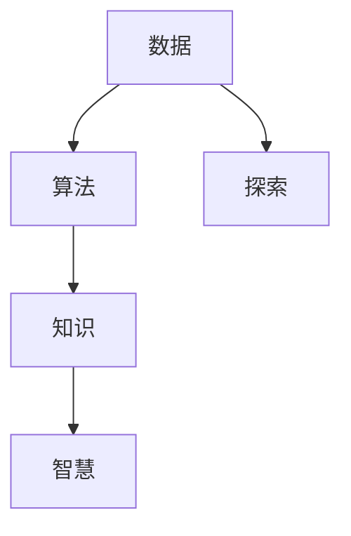

                 

# 人类知识的本质：一场永不停歇的探索长河

> 关键词：人类知识、数据、算法、智慧、探索、长河

## 1. 背景介绍

人类社会的知识体系，是人类智慧的结晶，是无数智者追求真理的产物。自古以来，人类不断探索知识的本质，试图从纷繁复杂的信息中提炼出系统的知识框架。从古希腊的亚里士多德、柏拉图，到文艺复兴时期的达芬奇、伽利略，再到近现代的牛顿、达尔文，人类对于知识的追求从未停止。

在现代信息爆炸的时代，知识的获取、存储、处理和应用变得愈发重要。大数据和人工智能技术的迅猛发展，为人类的知识探索开辟了新的道路。借助计算机技术，我们可以高效地处理海量数据，从中提炼出高价值的信息，进而构建起更加系统、全面的知识体系。

## 2. 核心概念与联系

### 2.1 核心概念概述

为了深入探讨人类知识的本质，我们需要首先明确几个核心概念及其相互之间的关系。

- **知识(Knowledge)**：人类智慧的结晶，是通过观察、实验、推理等方法获得的经验和理论的集合。
- **数据(Data)**：反映客观事实的数字、符号、文本等形式的信息集合。
- **算法(Algorithm)**：解决问题的方法和步骤，是实现从数据到知识转化的桥梁。
- **智慧(Wisdom)**：基于知识和经验，对复杂问题进行判断和决策的能力。
- **探索(Exploration)**：追求未知、挑战极限的过程，是人类智慧的源泉。

这些概念之间通过一系列逻辑关系联系起来，形成一个完整的知识探索体系。数据是知识的基础，算法是知识转化的工具，智慧是知识应用的体现，而探索则是知识体系不断演进的驱动力。

### 2.2 核心概念原理和架构的 Mermaid 流程图



这个流程图展示了数据、算法、知识和探索之间的关系。数据通过算法转化成知识，而知识又在智慧的引导下被应用到探索过程中。探索过程又产生了新的数据，进而形成新的知识，不断循环往复，推动知识体系的发展和进步。

## 3. 核心算法原理 & 具体操作步骤

### 3.1 算法原理概述

在数据驱动的知识探索过程中，算法扮演着至关重要的角色。算法通过处理数据，从中提炼出有价值的信息，最终构建起系统的知识体系。从数据挖掘、机器学习到深度学习，各种算法技术的不断进步，极大地推动了知识的探索和应用。

在知识探索的算法中，最核心的算法是数据挖掘算法和机器学习算法。这些算法通过统计分析、模型训练等方法，从数据中发现规律和模式，进而形成知识。

### 3.2 算法步骤详解

知识探索的算法步骤可以分为以下几个关键环节：

1. **数据预处理**：清洗、转换、整合原始数据，使其适合算法处理。
2. **特征提取**：从数据中提取有代表性的特征，形成输入向量的结构化表示。
3. **模型训练**：选择适合问题的模型，利用训练数据训练模型参数，使其能够准确地从输入数据中提取知识。
4. **知识验证**：通过测试数据验证模型的准确性和泛化能力，确保模型能够正确地应用到新的数据上。
5. **知识应用**：将模型应用到实际问题中，提取和应用知识。

### 3.3 算法优缺点

知识探索的算法具有以下优点：

1. **自动化**：算法可以自动处理大量的数据，从海量数据中提炼出有价值的信息，大大提高了知识探索的效率。
2. **可扩展性**：算法可以轻松扩展到大规模数据集上，具有较好的可扩展性。
3. **可解释性**：现代算法，如深度学习，具有一定的可解释性，能够通过可视化、特征分析等方式，揭示知识的来源和形式。

同时，算法也存在一些缺点：

1. **数据依赖性**：算法的性能很大程度上依赖于数据的质量和数量，数据的偏差可能导致算法的误导性。
2. **模型复杂性**：现代算法，如深度学习，往往具有复杂的模型结构，需要大量的计算资源和时间。
3. **可解释性不足**：某些算法，如深度学习，其内部决策过程难以解释，难以提供可靠的知识来源。

### 3.4 算法应用领域

知识探索的算法在多个领域得到了广泛的应用，例如：

- **金融风险管理**：通过分析历史数据，预测市场趋势，规避风险。
- **医疗健康**：利用患者数据，诊断疾病，制定治疗方案。
- **智能推荐系统**：通过用户行为数据，推荐个性化的商品和服务。
- **自然语言处理**：通过文本数据，进行情感分析、文本分类、机器翻译等。
- **图像识别**：通过图像数据，进行物体检测、人脸识别等。
- **交通管理**：通过交通数据，优化路线规划，减少交通拥堵。

## 4. 数学模型和公式 & 详细讲解 & 举例说明

### 4.1 数学模型构建

在知识探索的算法中，数学模型是其核心组成部分。数学模型通过对数据进行数学抽象，建立数据和知识之间的映射关系，进而提取有价值的信息。

在知识探索的数学模型中，最经典的模型是线性回归模型。线性回归模型通过拟合数据，建立输入和输出之间的关系，广泛应用于金融风险管理、医疗健康等领域。

### 4.2 公式推导过程

线性回归模型的基本公式为：

$$
y = \beta_0 + \beta_1 x_1 + \beta_2 x_2 + ... + \beta_n x_n + \epsilon
$$

其中 $y$ 表示输出，$\beta_0$ 表示截距，$\beta_1, \beta_2, ..., \beta_n$ 表示输入特征的系数，$x_1, x_2, ..., x_n$ 表示输入特征，$\epsilon$ 表示误差项。

线性回归模型的目标是最小化误差项 $\epsilon$，通常使用最小二乘法求解模型参数。

### 4.3 案例分析与讲解

以金融风险管理为例，假设我们有一组历史数据，包括贷款申请者的年龄、收入、负债等信息，以及是否违约的标签。利用线性回归模型，可以从这些数据中提取贷款申请者的风险特征，预测其违约概率。

线性回归模型的训练过程可以分为以下几个步骤：

1. **数据预处理**：将数据进行清洗、转换、整合，形成输入和输出矩阵。
2. **模型初始化**：将模型参数 $\beta_0, \beta_1, \beta_2, ..., \beta_n$ 随机初始化。
3. **前向传播**：将输入数据 $x_1, x_2, ..., x_n$ 输入模型，计算输出 $y$。
4. **损失函数计算**：计算模型输出 $y$ 与真实标签之间的误差 $\epsilon$。
5. **反向传播**：根据误差 $\epsilon$ 计算模型参数的梯度。
6. **参数更新**：使用梯度下降法更新模型参数 $\beta_0, \beta_1, \beta_2, ..., \beta_n$。
7. **重复迭代**：重复步骤3到6，直到模型收敛。

## 5. 项目实践：代码实例和详细解释说明

### 5.1 开发环境搭建

在进行知识探索的算法实践时，我们需要准备好开发环境。以下是使用Python进行Scikit-learn开发的流程：

1. 安装Anaconda：从官网下载并安装Anaconda，用于创建独立的Python环境。
2. 创建并激活虚拟环境：
```bash
conda create -n sklearn-env python=3.8 
conda activate sklearn-env
```

3. 安装Scikit-learn：
```bash
pip install scikit-learn
```

4. 安装各类工具包：
```bash
pip install numpy pandas matplotlib jupyter notebook
```

完成上述步骤后，即可在`sklearn-env`环境中开始项目实践。

### 5.2 源代码详细实现

这里以线性回归模型为例，给出使用Scikit-learn库进行金融风险管理的代码实现。

```python
import numpy as np
from sklearn.linear_model import LinearRegression

# 生成随机数据
np.random.seed(0)
X = np.random.randn(100, 5)
y = np.dot(X, np.array([0.5, -1, 2, -0.5, 1])) + np.random.randn(100)

# 创建线性回归模型
model = LinearRegression()

# 拟合模型
model.fit(X, y)

# 预测新数据
X_new = np.array([[0.1, 0.2, 0.3, 0.4, 0.5]])
y_new = model.predict(X_new)
print(y_new)
```

这段代码首先生成一组随机数据，然后使用线性回归模型对数据进行拟合。最后，使用模型对新数据进行预测。

### 5.3 代码解读与分析

这段代码涉及了Scikit-learn库中的线性回归模型。关键代码如下：

- `LinearRegression`：创建线性回归模型。
- `fit(X, y)`：拟合模型，将数据 $X$ 和标签 $y$ 输入模型，训练模型参数。
- `predict(X_new)`：使用模型对新数据 $X_new$ 进行预测，返回预测结果 $y_new$。

可以看到，Scikit-learn库提供了简单易用的接口，使得线性回归模型的实现变得非常简单。

## 6. 实际应用场景

### 6.1 金融风险管理

在金融风险管理中，线性回归模型可以用于预测贷款申请者的违约概率。通过分析历史贷款数据，建立贷款申请者的特征与违约概率之间的关系，可以识别高风险客户，降低违约风险。

### 6.2 医疗健康

在医疗健康领域，线性回归模型可以用于预测疾病的发病率。通过分析患者的病历数据，建立疾病特征与发病概率之间的关系，可以辅助医生诊断和治疗。

### 6.3 智能推荐系统

在智能推荐系统中，线性回归模型可以用于预测用户对商品的兴趣程度。通过分析用户的历史行为数据，建立用户特征与商品兴趣之间的关系，可以推荐个性化的商品和服务。

### 6.4 未来应用展望

随着算法技术的不断进步，知识探索的应用领域将更加广泛，为各行各业带来深刻变革。未来，算法将应用于更多的领域，如智慧城市、交通管理、环境保护等，推动社会的全面进步。

## 7. 工具和资源推荐

### 7.1 学习资源推荐

为了帮助开发者系统掌握知识探索的理论基础和实践技巧，这里推荐一些优质的学习资源：

1. 《统计学习基础》：李航教授的经典教材，系统介绍了统计学习的理论和方法，是机器学习入门的必读书籍。
2. 《机器学习实战》：Peter Harrington撰写的实战教程，通过具体的案例，介绍了机器学习的基本算法和实现方法。
3. 《深度学习》：Ian Goodfellow的经典教材，全面介绍了深度学习的理论、算法和应用。
4. Coursera的机器学习课程：由斯坦福大学Andrew Ng教授主讲，是机器学习领域的经典课程。
5. Kaggle平台：提供海量数据集和竞赛，是练习和应用机器学习的绝佳平台。

通过这些资源的学习实践，相信你一定能够快速掌握知识探索的精髓，并用于解决实际的业务问题。

### 7.2 开发工具推荐

高效的开发离不开优秀的工具支持。以下是几款用于知识探索开发的常用工具：

1. Python：开源的高级编程语言，拥有丰富的第三方库和工具，是知识探索开发的首选语言。
2. R语言：专门用于统计分析和数据挖掘的编程语言，拥有丰富的统计分析和数据可视化库。
3. Scikit-learn：基于Python的机器学习库，提供了大量的经典算法和数据预处理工具。
4. TensorFlow：由Google开发的深度学习框架，支持分布式计算和高效的模型训练。
5. PyTorch：由Facebook开发的深度学习框架，提供了灵活的模型定义和高效的自动微分机制。

合理利用这些工具，可以显著提升知识探索任务的开发效率，加快创新迭代的步伐。

### 7.3 相关论文推荐

知识探索的算法发展源于学界的持续研究。以下是几篇奠基性的相关论文，推荐阅读：

1. 《线性回归》：由Jerzy Neyman和Egon Pearson提出，奠定了线性回归模型的理论基础。
2. 《支持向量机》：由Vladimir Vapnik和Alexander Chervonenkis提出，奠定了支持向量机的理论基础。
3. 《随机森林》：由Breiman提出，展示了集成学习在分类和回归任务中的强大表现。
4. 《深度学习》：由Geoffrey Hinton、Yoshua Bengio和Yann LeCun提出，展示了深度学习在图像识别、语音识别等领域的突破性进展。
5. 《卷积神经网络》：由Fukushima提出，展示了卷积神经网络在图像识别等领域的强大表现。

这些论文代表了大数据和人工智能算法的演进历程。通过学习这些前沿成果，可以帮助研究者把握学科前进方向，激发更多的创新灵感。

## 8. 总结：未来发展趋势与挑战

### 8.1 总结

本文对基于数据驱动的知识探索过程进行了全面系统的介绍。首先阐述了知识、数据、算法、智慧、探索等核心概念及其相互之间的关系，明确了知识探索在人类智慧中的重要地位。其次，从原理到实践，详细讲解了知识探索的数学模型和关键步骤，给出了知识探索任务开发的完整代码实例。同时，本文还广泛探讨了知识探索方法在金融风险管理、医疗健康、智能推荐等多个行业领域的应用前景，展示了知识探索技术的广泛应用。

通过本文的系统梳理，可以看到，数据驱动的知识探索方法在多个领域得到了广泛应用，为人类的知识体系带来了新的活力和可能性。大数据和人工智能技术为人类的知识探索提供了新的工具和方法，极大地提高了知识探索的效率和精度，为人类的智慧发展开辟了新的道路。

### 8.2 未来发展趋势

展望未来，知识探索技术将呈现以下几个发展趋势：

1. **数据规模持续增大**：随着互联网和物联网的普及，数据的规模将持续增长。大数据技术的发展，将使得知识探索能够处理更多、更复杂的数据集。
2. **算法复杂性提升**：深度学习等复杂算法的不断涌现，将使得知识探索能够解决更加复杂、更加精细的任务。
3. **跨领域融合**：知识探索技术将与其他技术，如自然语言处理、计算机视觉等进行更深入的融合，形成更加全面、精准的知识体系。
4. **自动化和智能化提升**：自动化和智能化技术的发展，将使得知识探索过程更加高效、更加智能。
5. **伦理和社会责任**：知识探索技术将面临更多的伦理和社会责任问题，需要构建更加规范、透明的知识体系。

以上趋势凸显了知识探索技术的广阔前景。这些方向的探索发展，将进一步提升知识探索的效率和精度，为人类的智慧发展提供新的动力。

### 8.3 面临的挑战

尽管知识探索技术已经取得了显著成就，但在迈向更加智能化、普适化应用的过程中，它仍面临着诸多挑战：

1. **数据质量和数量**：数据的偏见、噪声和缺失等问题，将对知识探索的效果产生影响。如何获取高质量、大规模的数据，是知识探索的重要挑战。
2. **算法复杂性和效率**：复杂算法的计算资源消耗大，训练时间长。如何提高算法的效率，是知识探索技术发展的瓶颈。
3. **模型可解释性**：深度学习等复杂模型的内部决策过程难以解释，难以提供可靠的知识来源。如何提高模型的可解释性，是知识探索技术的挑战之一。
4. **伦理和社会责任**：知识探索技术可能带来数据隐私、算法偏见等问题。如何构建伦理规范，保障技术的安全和公正，是知识探索技术的重大挑战。
5. **跨领域融合**：不同领域的数据和问题具有不同的特点，如何构建统一的知识体系，进行跨领域的知识融合，是知识探索技术的难点。

正视知识探索面临的这些挑战，积极应对并寻求突破，将是大数据和人工智能技术迈向成熟的必由之路。

### 8.4 研究展望

面对知识探索面临的挑战，未来的研究需要在以下几个方面寻求新的突破：

1. **数据增强和预处理**：通过数据增强和预处理技术，提高数据的质量和数量，减少数据偏差和噪声。
2. **高效算法设计**：设计高效的算法，减少计算资源消耗，提高算法的效率。
3. **模型可解释性提升**：通过可解释性技术，提高模型的可解释性，增强知识的可信度和可靠性。
4. **伦理和社会责任保障**：构建伦理规范，保障数据隐私和算法公正，确保知识探索技术的安全和公正。
5. **跨领域知识融合**：构建统一的知识体系，进行跨领域的知识融合，形成更加全面、精准的知识体系。

这些研究方向的探索，将引领知识探索技术迈向更高的台阶，为构建安全、可靠、可解释、可控的知识体系铺平道路。面向未来，知识探索技术还需要与其他人工智能技术进行更深入的融合，如自然语言处理、计算机视觉等，多路径协同发力，共同推动知识探索技术的进步。

## 9. 附录：常见问题与解答

**Q1：数据驱动的知识探索是否适用于所有领域？**

A: 数据驱动的知识探索在大多数领域都适用，尤其是在大数据时代，数据在各行各业中都扮演着重要角色。然而，对于一些需要大量专业知识和人类直觉的领域，如哲学、艺术等，数据驱动的方法可能难以完全替代人类智慧的直觉和经验。

**Q2：如何处理数据的噪声和偏见？**

A: 数据噪声和偏见是知识探索中的重要挑战。处理方法包括：
1. 数据清洗：通过数据清洗技术，去除噪声和异常值。
2. 特征选择：通过特征选择技术，保留有代表性的特征。
3. 数据增强：通过数据增强技术，生成更多的训练数据，减少数据偏差。
4. 模型优化：通过模型优化技术，提高模型的鲁棒性，减少模型对数据的依赖。

**Q3：如何提高算法的可解释性？**

A: 提高算法的可解释性是知识探索中的重要挑战。方法包括：
1. 特征重要性分析：通过特征重要性分析，了解模型对各特征的依赖程度。
2. 可视化技术：通过可视化技术，展示模型内部的决策过程和特征权重。
3. 可解释性模型：使用可解释性模型，如决策树、逻辑回归等，提高模型的可解释性。

**Q4：知识探索技术在实际应用中需要注意哪些问题？**

A: 知识探索技术在实际应用中需要注意以下问题：
1. 数据隐私：保护用户数据隐私，防止数据泄露。
2. 算法偏见：避免算法偏见，确保技术的公平性。
3. 模型鲁棒性：提高模型的鲁棒性，防止模型过拟合。
4. 知识应用：确保知识应用的准确性和可靠性，避免误导性。

正视知识探索面临的这些挑战，积极应对并寻求突破，将是大数据和人工智能技术迈向成熟的必由之路。相信随着学界和产业界的共同努力，这些挑战终将一一被克服，知识探索技术必将在构建安全、可靠、可解释、可控的知识体系中扮演越来越重要的角色。

---

作者：禅与计算机程序设计艺术 / Zen and the Art of Computer Programming

