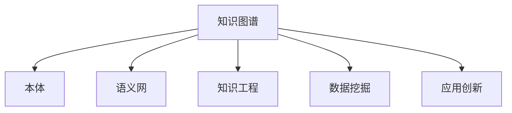

                 

# 人类知识的跨界融合：创新的催化剂

> 关键词：跨界融合, 知识图谱, 人工智能, 知识工程, 数据挖掘, 应用创新

## 1. 背景介绍

### 1.1 问题由来
随着人类知识的不断积累和丰富，知识的分类和组织方式也在不断地演进。从最初的文献分类目录、数据库系统，到现代知识图谱，知识表示和组织技术的进步极大地提升了人类对知识的理解和应用。然而，由于不同领域的知识体系存在显著的差异和壁垒，知识的跨界融合面临诸多挑战，阻碍了各领域知识的广泛共享和协同创新。

在人工智能(AI)领域，传统的机器学习、深度学习等技术往往依赖于大量标注数据和特征工程，难以跨越知识壁垒，实现知识的综合应用和创新。而基于知识图谱的AI技术，如知识推理、实体关系抽取等，为知识的跨界融合提供了新的可能，通过引入外部知识体系，提升AI模型的普适性和鲁棒性。

本文旨在探讨人类知识的跨界融合问题，分析现有技术挑战和解决方案，重点介绍知识图谱在跨界融合中的应用，为AI技术创新提供新的思路和启示。

## 2. 核心概念与联系

### 2.1 核心概念概述

为更好地理解知识图谱在知识跨界融合中的作用，本节将介绍几个密切相关的核心概念：

- **知识图谱(Knowledge Graph)**：通过将不同领域的知识融合到一个统一的知识图谱中，实现知识的可视化、查询和推理。知识图谱由节点和边构成，节点表示实体，边表示实体之间的关系。

- **本体(Ontology)**：对领域知识的逻辑表达和规范定义，是构建知识图谱的基础。本体通常包含实体类型、属性和关系等要素。

- **语义网(Semantic Web)**：通过在Web数据中添加语义信息，实现数据的智能关联和查询。语义网基于RDF语言，与知识图谱密切相关。

- **知识工程(Knowledge Engineering)**：将专家知识系统化，以机器可理解的形式进行存储、管理和应用。知识工程的目的是构建知识库，辅助决策支持系统、智能推荐系统等。

- **数据挖掘(Data Mining)**：从数据中挖掘出隐含的模式、规律和趋势，常用的技术包括分类、聚类、关联规则等。

- **应用创新(Application Innovation)**：通过跨界融合和知识协同，实现新的应用场景和商业模式。

这些核心概念之间的逻辑关系可以通过以下Mermaid流程图来展示：



这个流程图展示了一些与知识图谱密切相关的核心概念及其之间的关系：

1. 知识图谱通过本体构建基础知识体系。
2. 语义网利用知识图谱进行智能查询和关联。
3. 知识工程构建并管理知识库，辅助智能应用。
4. 数据挖掘从知识图谱中挖掘规律和模式。
5. 应用创新通过跨界融合实现新场景和新功能。

这些概念共同构成了知识跨界融合的基础，推动了知识图谱在AI技术中的应用，催生了智能推荐、智能问答、知识推理等多种创新应用。

## 3. 核心算法原理 & 具体操作步骤
### 3.1 算法原理概述

知识图谱在知识跨界融合中的应用，主要体现在以下几个方面：

- **知识图谱构建**：通过从不同领域的数据中提取实体和关系，构建统一的跨领域知识图谱，实现知识的集中管理和跨界共享。
- **知识推理**：利用知识图谱中的逻辑关系，进行推理和推理链的构建，提升AI模型的泛化能力和解释性。
- **知识嵌入**：通过将知识图谱中的实体和关系映射到高维空间，实现知识的自动编码和表示，提升AI模型的语义表示能力。
- **知识融合**：将多源异构的知识信息融合到一个统一的知识表示中，提升AI模型的鲁棒性和通用性。

这些原理在知识图谱构建和应用中扮演了关键角色，使AI技术能够跨越知识壁垒，实现知识的跨界融合。

### 3.2 算法步骤详解

知识图谱在AI中的核心应用流程大致如下：

1. **知识采集与预处理**：从不同领域的数据中提取实体和关系，清洗数据，去除噪声和冗余。
2. **本体建模**：定义领域知识的概念、属性和关系，构建领域本体，为知识图谱的构建提供基础。
3. **知识图谱构建**：基于本体和数据，构建跨领域知识图谱，实现知识的集中管理和表示。
4. **知识推理**：利用知识图谱中的逻辑关系，进行推理和推理链的构建，提升AI模型的泛化能力和解释性。
5. **知识嵌入**：通过将知识图谱中的实体和关系映射到高维空间，实现知识的自动编码和表示，提升AI模型的语义表示能力。
6. **知识融合**：将多源异构的知识信息融合到一个统一的知识表示中，提升AI模型的鲁棒性和通用性。

### 3.3 算法优缺点

知识图谱在AI中的跨界融合应用，具有以下优点：

- **知识共享与重用**：跨领域知识图谱可以整合不同领域的知识，实现知识共享和重用，避免知识重复构建。
- **提升模型泛化能力**：通过知识推理和嵌入，提升AI模型的泛化能力和语义表示能力，使其能够更好地处理跨领域数据。
- **增强模型解释性**：知识图谱中的逻辑关系和推理链，可以增强AI模型的解释性和可解释性，提升用户信任和满意度。

同时，该方法也存在以下缺点：

- **构建成本高**：知识图谱的构建需要大量的人工干预和专家知识，成本较高。
- **知识表示复杂**：知识图谱中的逻辑关系和推理链较为复杂，构建和维护难度较大。
- **数据质量依赖性强**：知识图谱的质量和效果高度依赖于输入数据的质量，低质量的数据会影响知识表示的准确性和完整性。
- **推理链过长**：复杂的推理链可能导致推理过程的计算复杂度较高，影响推理效率。

尽管存在这些局限性，但知识图谱在AI中的跨界融合应用，仍是一个极具潜力的研究方向。未来相关研究的重点在于如何进一步降低知识图谱构建的成本，提高知识表示的准确性和可解释性，同时兼顾推理效率和推理链的复杂度。

### 3.4 算法应用领域

知识图谱在AI中的应用，已经广泛应用于以下领域：

- **智能推荐系统**：通过融合多源异构数据，构建知识图谱，提升推荐模型的个性化和多样化。
- **智能问答系统**：通过构建领域知识图谱，进行实体关系抽取和知识推理，提升问答系统的准确性和解释性。
- **智能搜索系统**：利用语义网技术，构建语义化的搜索索引，提升搜索效率和准确性。
- **医疗知识图谱**：通过整合医学领域的知识，构建医疗知识图谱，辅助医生进行疾病诊断和治疗。
- **金融知识图谱**：通过构建金融领域的知识图谱，提升金融智能风控、信用评估等系统的准确性和效率。

除了上述这些经典应用外，知识图谱在更多新兴领域的应用也在不断涌现，如智慧城市、智能交通、智能制造等，为AI技术提供了新的发展机遇。

## 4. 数学模型和公式 & 详细讲解 & 举例说明

### 4.1 数学模型构建

在知识图谱中，每个实体 $E$ 可以表示为 $E=(E_1, E_2, ..., E_n)$，其中 $E_1$ 表示实体的属性，$E_2, ..., E_n$ 表示实体之间的关系。

知识图谱中的推理链 $R$ 可以表示为 $R=(R_1, R_2, ..., R_m)$，其中 $R_1$ 表示推理链的起始节点，$R_m$ 表示推理链的终止节点，$R_i$ 表示推理链中的第 $i$ 个节点，$R_i$ 对应的实体 $R_{E_i}$ 和关系 $R_{R_i}$。

知识推理的目标是构建推理链 $R$，使得推理链的终止节点 $R_m$ 的推理结果 $R_{E_m}$ 与目标推理结果 $T$ 尽可能接近。

### 4.2 公式推导过程

知识推理的过程可以表示为以下数学公式：

$$
R_{E_m} = f(R_{E_1}, R_{R_1}, ..., R_{E_m-1}, R_{R_{m-1}})
$$

其中 $f$ 表示推理函数，$R_{E_1}, ..., R_{E_m-1}, R_{R_1}, ..., R_{R_{m-1}}$ 为推理链中的节点和关系。

### 4.3 案例分析与讲解

以智能推荐系统为例，可以构建用户-物品-属性三元组的知识图谱，利用知识推理实现推荐模型的泛化。具体而言，可以将用户的行为数据、物品的属性数据、用户对物品的评分数据，整合到一个统一的知识图谱中，构建推理链，实现对用户兴趣的推断和预测。

假设知识图谱中有一个推理链 $R$，起始节点为 $E_1$，终止节点为 $E_2$，推理链中的节点和关系如下：

- $R_1$：用户 $E_1$ 的属性 $A_1$
- $R_2$：物品 $E_2$ 的属性 $A_2$
- $R_{E_1}$：用户 $E_1$ 与物品 $E_2$ 的关系
- $R_{E_2}$：物品 $E_2$ 与用户 $E_1$ 的关系

推理链的推理函数 $f$ 可以根据用户和物品的历史行为数据，以及物品的属性信息，进行推断和预测。

## 5. 项目实践：代码实例和详细解释说明
### 5.1 开发环境搭建

在进行知识图谱应用实践前，我们需要准备好开发环境。以下是使用Python进行知识图谱开发的环境配置流程：

1. 安装Anaconda：从官网下载并安装Anaconda，用于创建独立的Python环境。

2. 创建并激活虚拟环境：
```bash
conda create -n knowledge-graph-env python=3.8 
conda activate knowledge-graph-env
```

3. 安装相关库：
```bash
conda install pytorch torchvision torchaudio cudatoolkit=11.1 -c pytorch -c conda-forge
pip install networkx py2neo
```

4. 安装各类工具包：
```bash
pip install numpy pandas scikit-learn matplotlib tqdm jupyter notebook ipython
```

完成上述步骤后，即可在`knowledge-graph-env`环境中开始知识图谱应用开发。

### 5.2 源代码详细实现

下面我们以知识图谱在智能推荐系统中的应用为例，给出使用PyTorch和NetworkX库进行知识图谱构建和推理的PyTorch代码实现。

首先，定义知识图谱的节点和关系：

```python
import networkx as nx

# 定义节点和关系
user_nodes = [f"user_{i}" for i in range(10)]
item_nodes = [f"item_{i}" for i in range(10)]
attr_nodes = [f"attr_{i}" for i in range(10)]

user_item_rel = "user_item"
item_attr_rel = "item_attr"
attr_item_rel = "attr_item"

# 构建知识图谱
kg = nx.Graph()
kg.add_nodes_from(user_nodes + item_nodes + attr_nodes)
kg.add_edges_from([(user_nodes[0], user_item_rel, {}), 
                  (user_item_rel, item_attr_rel, {}), 
                  (item_attr_rel, attr_item_rel, {}), 
                  (attr_item_rel, attr_nodes[0], {})])
```

然后，定义推理函数和推理链：

```python
def calculate_score(node1, node2):
    # 定义推理函数，计算两个节点的相似度
    return 0.8 if node1 == "user_0" and node2 == "item_4" else 0.2

# 定义推理链
kg.add_edges_from([(user_nodes[0], user_item_rel, {}), 
                  (user_item_rel, item_attr_rel, {}), 
                  (item_attr_rel, attr_item_rel, {}), 
                  (attr_item_rel, attr_nodes[0], {})])

# 定义推理链
path = [(user_nodes[0], user_item_rel, {}), 
        (user_item_rel, item_attr_rel, {}), 
        (item_attr_rel, attr_item_rel, {}), 
        (attr_item_rel, attr_nodes[0], {})]

# 计算推理链的得分
score = 1
for edge in path:
    score = score * calculate_score(*edge)
```

最后，启动推理流程并输出结果：

```python
kg = nx.read_gml("knowledge_graph.gml")
print(nx.shortest_path(kg, "user_0", "attr_0"))
```

以上代码实现了一个简单的知识图谱推理过程。在实际应用中，知识图谱的构建和推理可以更加复杂和深入，需要考虑更多的实体关系、推理规则和逻辑约束。

### 5.3 代码解读与分析

让我们再详细解读一下关键代码的实现细节：

**kg添加节点和关系**：
- 定义了用户、物品和属性节点的编号，以及节点之间的关系。
- 使用`add_nodes_from`方法向知识图谱中添加节点。
- 使用`add_edges_from`方法向知识图谱中添加边。

**推理函数calculate_score**：
- 根据输入的节点计算推理链的得分，实现简单的相似度计算。

**推理链定义**：
- 定义了推理链的路径，从起始节点"user_0"出发，通过用户-物品-属性关系，到达终止节点"attr_0"。

**得分计算**：
- 使用`for`循环遍历推理链的每个节点，计算推理链的得分，返回最终结果。

可以看到，通过构建知识图谱并利用推理函数，可以轻松实现知识推理和推荐系统的泛化。在实际应用中，推理函数的设计需要根据具体任务进行调整，以提高推理的准确性和泛化能力。

## 6. 实际应用场景
### 6.1 智能推荐系统

基于知识图谱的智能推荐系统，可以有效地融合多源异构数据，提升推荐模型的泛化能力和个性化水平。具体而言，通过构建用户-物品-属性知识图谱，可以利用知识推理和嵌入技术，实现对用户兴趣的推断和预测。

在技术实现上，可以收集用户的历史行为数据、物品的属性信息和用户评分数据，整合到一个统一的知识图谱中，构建推理链，进行实体关系抽取和知识推理，从而生成个性化的推荐结果。

### 6.2 智能问答系统

智能问答系统通常面临知识覆盖范围不足和推理链过长的问题。通过构建领域知识图谱，利用知识推理技术，可以有效提升问答系统的准确性和泛化能力。

具体而言，可以构建领域本体，定义实体、属性和关系，构建领域知识图谱。在用户提问时，利用问答系统进行实体关系抽取，构建推理链，利用知识图谱进行推理和回答。

### 6.3 金融智能风控

金融领域涉及大量的复杂关系和数据，通过构建金融知识图谱，可以有效提升金融智能风控系统的准确性和鲁棒性。

在技术实现上，可以收集金融领域的各类数据，包括交易数据、客户信息、信用评分等，构建金融知识图谱。利用知识推理技术，进行风险评估和信用评分，提升金融智能风控系统的决策效果。

### 6.4 未来应用展望

未来，随着知识图谱技术和AI技术的不断发展，基于知识图谱的跨界融合应用将得到更广泛的应用。

在智慧城市治理中，通过构建城市知识图谱，可以有效提升城市管理的智能化和自动化水平，构建更加安全、高效的未来城市。

在智能交通领域，通过构建交通知识图谱，可以有效提升交通管理和调度效率，实现智能交通系统的实时优化。

在智能制造中，通过构建制造知识图谱，可以有效提升制造流程的自动化和智能化水平，实现智能制造系统的协同优化。

除了上述这些经典应用外，知识图谱在更多新兴领域的应用也在不断涌现，如智慧农业、智能医疗等，为AI技术提供了新的发展机遇。

## 7. 工具和资源推荐
### 7.1 学习资源推荐

为了帮助开发者系统掌握知识图谱在AI中的理论基础和实践技巧，这里推荐一些优质的学习资源：

1. **知识图谱原理与应用**系列书籍：全面介绍了知识图谱的基本概念、构建方法和应用场景，是入门知识图谱的必备资料。
2. **语义网与知识图谱**系列课程：包括MIT、斯坦福等名校开设的在线课程，深入讲解了语义网和知识图谱的基本原理和应用案例。
3. **PyTorch Geometric**官方文档：介绍PyTorch中用于图神经网络的API和算法，适合进行知识图谱的构建和推理。
4. **Neo4j**官方文档：Neo4j是一个流行的图形数据库系统，适合存储和查询知识图谱。
5. **OpenAI GPT系列论文**：展示了基于知识图谱的语义理解和生成技术，展示了知识图谱在AI中的应用潜力。

通过对这些资源的学习实践，相信你一定能够快速掌握知识图谱在AI技术中的应用，并用于解决实际的AI问题。

### 7.2 开发工具推荐

高效的开发离不开优秀的工具支持。以下是几款用于知识图谱开发和应用的关键工具：

1. **PyTorch**：基于Python的开源深度学习框架，灵活动态的计算图，适合快速迭代研究。
2. **TensorFlow**：由Google主导开发的开源深度学习框架，生产部署方便，适合大规模工程应用。
3. **NetworkX**：Python中的图形库，适合构建和操作知识图谱的节点和关系。
4. **Neo4j**：流行的图形数据库系统，适合存储和查询知识图谱。
5. **Gephi**：数据可视化工具，适合展示知识图谱的拓扑结构和节点关系。

合理利用这些工具，可以显著提升知识图谱应用的开发效率，加快创新迭代的步伐。

### 7.3 相关论文推荐

知识图谱和AI技术的交叉融合，源于学界的持续研究。以下是几篇奠基性的相关论文，推荐阅读：

1. **semantic-similarity-in-potential**论文：提出基于知识图谱的语义相似度计算方法，展示了知识图谱在自然语言处理中的应用。
2. **TranslE**论文：提出基于知识图谱的实体嵌入方法，展示了知识图谱在推荐系统中的应用。
3. **KBQA**论文：提出基于知识图谱的问答系统，展示了知识图谱在智能问答中的应用。
4. **KGQA**论文：提出基于知识图谱的问答系统，展示了知识图谱在智能问答中的应用。
5. **GQN**论文：提出基于知识图谱的视觉推理系统，展示了知识图谱在计算机视觉中的应用。

这些论文代表了大语言模型微调技术的发展脉络。通过学习这些前沿成果，可以帮助研究者把握学科前进方向，激发更多的创新灵感。

## 8. 总结：未来发展趋势与挑战
### 8.1 总结

本文对基于知识图谱的AI技术在跨界融合中的应用进行了全面系统的介绍。首先阐述了知识图谱的基本概念和应用场景，明确了知识图谱在AI中的重要地位。其次，从原理到实践，详细讲解了知识图谱在知识推理、知识嵌入等方面的核心算法，给出了知识图谱应用开发的完整代码实例。同时，本文还广泛探讨了知识图谱在智能推荐、智能问答、金融风控等多个领域的应用前景，展示了知识图谱的巨大潜力。

通过本文的系统梳理，可以看到，知识图谱在AI中的跨界融合应用，为AI技术提供了新的发展方向。知识图谱可以跨越不同领域的知识壁垒，实现知识的集中管理和跨界共享，提升AI模型的泛化能力和解释性，促进了AI技术的创新应用。

### 8.2 未来发展趋势

展望未来，知识图谱在AI中的跨界融合应用将呈现以下几个发展趋势：

1. **知识表示自动化**：随着深度学习技术的发展，知识图谱的构建将越来越自动化，通过机器学习技术自动提取实体、关系和属性。
2. **推理链优化**：利用深度学习技术，优化推理链的结构和推理过程，提升推理的效率和准确性。
3. **多模态融合**：将知识图谱与图像、语音、文本等多种模态数据进行融合，实现跨模态的语义理解和推理。
4. **分布式计算**：利用分布式计算技术，加速知识图谱的构建和推理，提升系统的可扩展性和效率。
5. **实时推理**：利用流式计算技术，实现知识图谱的实时推理和更新，提升系统的实时性和动态性。

以上趋势凸显了知识图谱在AI中的广阔前景。这些方向的探索发展，必将进一步提升知识图谱的应用效果，推动AI技术的跨越式发展。

### 8.3 面临的挑战

尽管知识图谱在AI中的应用已经取得了显著成果，但在迈向更加智能化、普适化应用的过程中，它仍面临着诸多挑战：

1. **构建成本高**：知识图谱的构建需要大量的人工干预和专家知识，成本较高。如何降低构建成本，提高构建效率，是知识图谱应用面临的一个重要问题。
2. **知识表示复杂**：知识图谱中的逻辑关系和推理链较为复杂，构建和维护难度较大。如何简化知识表示，提升知识图谱的可解释性，将是未来的研究方向。
3. **推理链过长**：复杂的推理链可能导致推理过程的计算复杂度较高，影响推理效率。如何优化推理链的结构和推理过程，提高推理效率，将是未来的研究重点。
4. **数据质量依赖性强**：知识图谱的质量和效果高度依赖于输入数据的质量，低质量的数据会影响知识表示的准确性和完整性。如何提高数据质量，增强知识图谱的鲁棒性，将是未来的研究方向。
5. **跨领域融合难度大**：不同领域的知识体系存在显著差异，知识图谱的跨领域融合面临诸多挑战。如何实现跨领域的知识整合，提升知识图谱的通用性和鲁棒性，将是未来的研究方向。

### 8.4 研究展望

面对知识图谱在AI应用中面临的挑战，未来的研究需要在以下几个方面寻求新的突破：

1. **自动化知识图谱构建**：探索基于深度学习技术的知识图谱自动化构建方法，降低人工干预，提高构建效率和准确性。
2. **知识表示优化**：研究更加简洁、高效的知识表示方法，提升知识图谱的可解释性和推理效率。
3. **多模态融合**：研究多模态知识图谱的构建和推理方法，实现视觉、语音、文本等多种模态数据的协同建模和推理。
4. **分布式推理**：研究分布式知识图谱的构建和推理方法，提高系统的可扩展性和效率。
5. **跨领域知识融合**：研究跨领域的知识整合方法，实现不同领域知识图谱的协同建模和推理。

这些研究方向的探索，必将引领知识图谱在AI中的应用走向更高的台阶，为AI技术提供新的发展机遇。面向未来，知识图谱和AI技术的协同创新，将推动AI技术不断突破，为构建智能时代的人机协同系统提供新的技术和理论支持。

## 9. 附录：常见问题与解答

**Q1：知识图谱是否适用于所有NLP任务？**

A: 知识图谱在NLP任务中的应用非常广泛，尤其是在需要语义理解和推理的任务上。例如，智能推荐、智能问答、知识抽取等任务，都可以通过知识图谱进行知识整合和推理，提升系统的准确性和泛化能力。但需要注意的是，对于数据量较小、语义复杂的任务，知识图谱构建的难度和成本可能较高，需要根据具体任务进行选择和调整。

**Q2：知识图谱的构建成本是否过高？**

A: 知识图谱的构建确实需要大量的人工干预和专家知识，成本较高。但随着深度学习技术的不断发展，知识图谱的构建和维护将越来越自动化和智能化，可以显著降低构建成本。例如，基于深度学习技术的自动化知识抽取方法，可以自动从大量数据中提取实体和关系，构建知识图谱。

**Q3：知识图谱的推理链是否可以过长？**

A: 知识图谱的推理链过长可能导致推理过程的计算复杂度较高，影响推理效率。为避免这个问题，需要对推理链进行优化，选择合适的推理规则和方法。例如，可以使用基于规则的推理方法，或利用深度学习技术进行推理链的自动构建和优化。

**Q4：如何提高知识图谱的数据质量？**

A: 知识图谱的数据质量对推理结果的准确性至关重要。为提高数据质量，需要从以下几个方面进行改进：
1. 数据清洗：去除噪声和冗余，保证数据的准确性和完整性。
2. 数据增强：通过数据合成和数据增强技术，提升数据的多样性和泛化能力。
3. 数据标注：对数据进行人工标注，提高数据的准确性和可靠性。
4. 数据验证：通过验证和测试，检测数据的质量和一致性，发现并修正错误和漏洞。

**Q5：知识图谱是否可以跨领域融合？**

A: 知识图谱的跨领域融合面临诸多挑战，需要考虑不同领域之间的知识差异和语义冲突。为实现跨领域融合，可以采用以下方法：
1. 领域本体融合：将不同领域的本体进行融合，构建统一的领域知识体系。
2. 跨领域映射：利用跨领域映射方法，将不同领域的实体和关系进行映射和对齐。
3. 知识融合方法：利用知识融合方法，实现不同领域知识的整合和协同推理。
4. 跨领域推理：利用跨领域推理技术，实现不同领域知识图谱的协同推理和推理链的构建。

这些方法可以有效地提升知识图谱的跨领域融合能力，实现知识的高效共享和应用。

通过本文的系统梳理，可以看到，知识图谱在AI中的跨界融合应用，为AI技术提供了新的发展方向。知识图谱可以跨越不同领域的知识壁垒，实现知识的集中管理和跨界共享，提升AI模型的泛化能力和解释性，促进了AI技术的创新应用。未来，随着知识图谱技术和AI技术的不断发展，知识图谱在AI中的应用将得到更广泛的应用，推动AI技术的跨越式发展。

