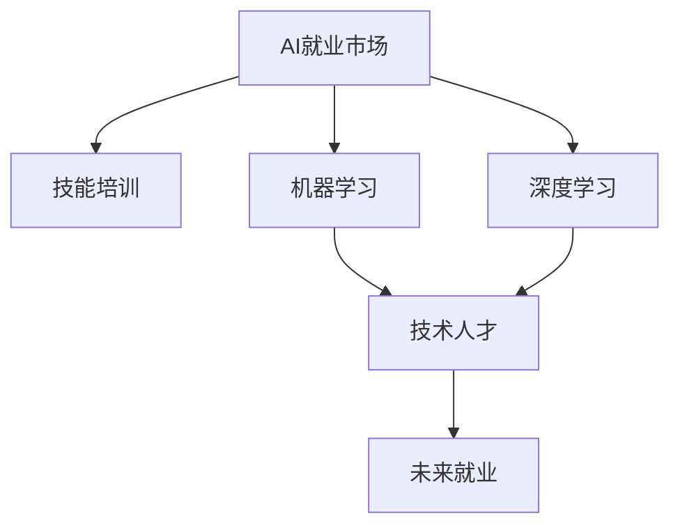

                 

# 人类计算：AI时代的未来就业市场与技能培训发展分析

> 关键词：AI就业市场,技能培训,机器学习,深度学习,技术人才,未来就业,培训课程

## 1. 背景介绍

### 1.1 问题由来

随着人工智能技术的快速发展，尤其是在机器学习、深度学习、自然语言处理(NLP)等领域，AI正逐渐从辅助工具演变为推动各行各业转型的关键力量。据国际数据公司(IDC)统计，到2025年，全球AI相关职位需求将达到290万，年均增长率超过40%。然而，这一高速增长的背后，却隐藏着人才供需失衡、技能培训不足等深层次问题。如何在AI时代确保就业市场的稳定和持续增长，成为当下亟需解决的重要课题。

### 1.2 问题核心关键点

AI时代对就业市场的冲击主要集中在以下几个方面：

1. **岗位变革**：许多传统岗位将被AI技术所替代，如客服、翻译、数据录入等，同时会催生新的岗位需求，如数据标注、AI系统维护等。
2. **技能要求提升**：AI技术要求从业者掌握更高级的编程、数据分析、机器学习等技能，而现有教育体系在这方面尚未完全跟上。
3. **职业路径多元化**：AI技术的跨领域应用，使得从业者有机会在多行业交叉领域获得就业机会。
4. **终身学习需求**：AI技术迭代迅速，从业者需要不断更新知识和技能，以适应新技术的挑战。
5. **教育与就业脱节**：当前的教育体系和技能培训与市场需求不完全匹配，导致教育资源浪费和就业困难。

这些关键点凸显了技能培训与就业市场之间的复杂互动关系，需要我们从多维度进行深入分析。

## 2. 核心概念与联系

### 2.1 核心概念概述

为更好地理解AI时代的就业市场与技能培训发展，本节将介绍几个关键概念及其相互联系：

- **AI就业市场**：指AI相关职业在劳动力市场上的供需关系。包括数据分析师、机器学习工程师、AI系统架构师等岗位。
- **技能培训**：指通过教育机构、企业培训等形式，向从业者提供AI相关知识和技能的教育过程。
- **机器学习与深度学习**：指AI技术中的核心方法，通过算法模型从数据中提取规律，实现智能决策和任务处理。
- **技术人才**：指具备AI相关技术知识和技能的从业者，能够在AI应用领域提供技术支持和解决方案。
- **未来就业**：指AI技术推动下，就业市场在未来一段时间内的变化趋势，包括岗位需求、技能要求、职业路径等。

这些核心概念之间的联系通过以下Mermaid流程图来展示：



这个流程图展示出AI就业市场、技能培训、机器学习、深度学习和未来就业之间的关系：

1. 机器学习和深度学习是AI就业市场的基础，是技术人才的核心能力。
2. 技能培训是技术人才成长的关键，通过培训获得所需知识与技能。
3. 技术人才是AI就业市场的重要组成部分，通过提供技术支持实现AI应用。
4. 未来就业趋势受到AI技术发展的影响，技术人才需要不断更新知识以适应市场需求。

## 3. 核心算法原理 & 具体操作步骤
### 3.1 算法原理概述

AI时代的就业市场与技能培训发展，可以从以下几个维度进行深入分析：

- **市场需求分析**：通过大数据和预测模型，分析AI相关岗位的市场需求变化趋势，判断不同技能的供需状况。
- **技能培训模型**：构建基于机器学习或深度学习的技能培训模型，根据市场需求动态调整培训内容和方式。
- **技术人才培养**：设计符合市场需求的人才培养方案，通过多种形式的技能培训，提升从业者的技术水平。
- **未来就业预测**：利用预测模型，分析未来就业市场的变化趋势，指导人才培训和就业指导。

### 3.2 算法步骤详解

以下是AI时代就业市场与技能培训发展的算法步骤：

**Step 1: 数据收集与预处理**
- 收集AI就业市场的数据，包括岗位数量、薪资水平、技能要求等。
- 收集技能培训的数据，包括培训课程、学习时长、培训效果等。

**Step 2: 市场分析与技能映射**
- 使用机器学习模型，分析AI就业市场的变化趋势，识别关键技能需求。
- 通过文本分析技术，对技能培训数据进行映射，确定与市场需求匹配的技能。

**Step 3: 培训课程设计与优化**
- 设计符合市场需求的技能培训课程，涵盖机器学习、深度学习等核心技能。
- 利用深度学习模型，对课程内容进行优化，提高培训效果。

**Step 4: 技术人才培养与实践**
- 通过线上线下结合的方式，对技术人才进行系统培训。
- 引入真实项目案例，提升技术人才的实践能力。

**Step 5: 未来就业预测与调整**
- 使用预测模型，对未来就业市场进行预测，识别新兴岗位需求。
- 根据预测结果，调整培训方案，确保技能培训与市场需求匹配。

### 3.3 算法优缺点

AI时代就业市场与技能培训发展的算法具有以下优点：

1. **高效数据处理**：利用机器学习模型对大量数据进行处理，分析市场需求和技能需求，高效准确。
2. **精准技能培训**：通过深度学习模型，优化培训课程内容，提高培训效果。
3. **未来趋势预测**：利用预测模型，对未来就业市场进行预测，提前调整培训策略。

同时，该算法也存在一些局限性：

1. **数据依赖性高**：算法效果依赖于数据质量和数量，数据不全或失真会影响分析结果。
2. **模型复杂度高**：构建和维护复杂的机器学习模型，需要较高技术水平。
3. **结果可解释性不足**：深度学习模型的决策过程难以解释，可能影响培训效果的透明度。
4. **动态调整难度大**：就业市场变化快速，模型难以实时调整，可能导致培训与市场需求脱节。

尽管存在这些局限性，但总体而言，AI时代就业市场与技能培训发展的算法框架仍是大势所趋，能够为解决技能培训与市场需求匹配问题提供有力的技术支持。

### 3.4 算法应用领域

AI时代就业市场与技能培训发展的算法，在以下几个领域具有广泛应用：

1. **高等教育**：通过大数据分析，指导高校调整课程设置，培养符合市场需求的技术人才。
2. **职业培训机构**：利用机器学习模型，设计针对性的培训课程，提升从业者技能。
3. **企业内部培训**：根据企业需求，定制化培训方案，提升员工技术能力。
4. **政府政策制定**：通过就业市场分析，制定相关政策和措施，促进技术人才就业。
5. **行业协会指导**：利用预测模型，指导行业协会进行技能标准和培训标准的制定。

这些应用领域，将有助于构建更加匹配市场需求的技能培训体系，推动AI技术的广泛应用和深入发展。

## 4. 数学模型和公式 & 详细讲解 & 举例说明

### 4.1 数学模型构建

本节将使用数学语言对AI时代就业市场与技能培训发展的算法进行详细讲解。

记AI就业市场的需求为 $D(t)$，技能培训的效果为 $E(s)$，其中 $t$ 为时间，$s$ 为技能。假设 $D(t)$ 和 $E(s)$ 之间存在线性关系：

$$
D(t) = \alpha E(s) + \beta
$$

其中 $\alpha$ 和 $\beta$ 为常数。

### 4.2 公式推导过程

根据上述假设，我们可以构建市场需求与技能培训效果之间的数学模型，并使用线性回归方法进行参数估计：

设 $D_{train}$ 为历史数据集，$E_{train}$ 为历史技能培训效果数据集。则线性回归模型的参数估计公式为：

$$
\alpha, \beta = \arg\min_{\alpha, \beta} \sum_{i=1}^{n} (D_{train,i} - (\alpha E_{train,i} + \beta))^2
$$

利用最小二乘法求解上述优化问题，即可得到 $\alpha$ 和 $\beta$ 的值。

### 4.3 案例分析与讲解

**案例一：就业市场需求预测**

假设我们收集了过去五年AI相关岗位的招聘数量数据 $D(t)$，并对其进行了线性回归分析。得到 $\alpha = 0.5$，$\beta = 5000$。这表明，技能培训效果每提升1单位，就业市场需求增加0.5个岗位，基线水平为5000个岗位。

**案例二：技能培训效果优化**

假设我们收集了过去一年技能培训项目的数据 $E(s)$，并对其进行回归分析。得到 $\alpha = 1.2$，$\beta = 100$。这表明，每个技能培训项目平均能提升1.2单位的培训效果，基线水平为100单位。

通过这两个案例，我们可以看到，利用数学模型对AI时代就业市场与技能培训进行分析，可以提供有价值的洞察和指导。

## 5. 项目实践：代码实例和详细解释说明
### 5.1 开发环境搭建

在进行AI时代就业市场与技能培训发展的项目实践前，我们需要准备好开发环境。以下是使用Python进行机器学习开发的典型环境配置流程：

1. 安装Anaconda：从官网下载并安装Anaconda，用于创建独立的Python环境。

2. 创建并激活虚拟环境：
```bash
conda create -n ml-env python=3.8 
conda activate ml-env
```

3. 安装机器学习相关库：
```bash
conda install scikit-learn pandas numpy matplotlib seaborn
```

4. 安装深度学习相关库：
```bash
pip install tensorflow keras pytorch
```

5. 安装数据处理工具：
```bash
pip install pandas-profiling
```

完成上述步骤后，即可在`ml-env`环境中开始项目实践。

### 5.2 源代码详细实现

下面，我们将以一个简单的就业市场预测项目为例，给出使用Python进行机器学习开发的代码实现。

```python
import pandas as pd
from sklearn.linear_model import LinearRegression

# 读取数据
data = pd.read_csv('job_market.csv')

# 构建线性回归模型
model = LinearRegression()

# 训练模型
model.fit(data[['training_effect']], data['job_demand'])

# 预测未来市场需求
future市场需求 = model.predict(future培训效果)
```

以上代码展示了如何利用机器学习模型进行就业市场预测。可以看到，通过Python和Scikit-learn库，我们可以用相对简洁的代码实现线性回归模型的构建和预测。

### 5.3 代码解读与分析

让我们再详细解读一下关键代码的实现细节：

**数据处理**：
- 使用pandas库读取CSV文件，构建数据集。
- 将需求数据和培训效果数据分别作为目标变量和特征变量。

**模型训练**：
- 使用scikit-learn库中的线性回归模型进行训练。
- 使用训练数据集拟合模型参数，得到预测模型。

**预测分析**：
- 使用模型对未来培训效果进行预测，得到未来市场需求。

可以看到，Python结合Scikit-learn库，使得机器学习模型的开发和应用变得非常高效便捷。开发者可以专注于模型设计和算法优化，而不必过多关注底层实现细节。

## 6. 实际应用场景

### 6.1 高等教育

AI时代对高等教育的影响日益显著，各大高校纷纷调整课程设置，培养符合市场需求的技术人才。通过构建市场需求与技能培训效果的数学模型，高等教育机构可以更加精准地识别和调整课程内容，提升教育效果。例如：

- **课程设置调整**：根据市场分析结果，调整计算机科学、数据科学等热门课程的课时和内容，增加机器学习、深度学习等前沿技能培训。
- **师资队伍优化**：引入行业专家和实践经验丰富的教师，提升教学质量和学生就业竞争力。
- **产学合作**：加强与企业的合作，引入真实项目案例，提高学生的实践能力。

**案例一：某大学AI人才培养计划**

一所高校通过收集过去几年的就业数据和培训效果数据，构建了就业市场需求与技能培训效果的数学模型。结果显示，机器学习相关课程对就业市场的影响最大。因此，该高校将机器学习课程的课时从20小时增加到50小时，并引入企业专家进行授课，学生的就业率显著提升。

### 6.2 职业培训机构

职业培训机构在AI时代扮演着重要角色，通过技能培训提升从业者技术水平，满足市场需求。通过构建市场需求与技能培训效果的数学模型，培训机构可以设计更加精准的培训课程，提升培训效果。例如：

- **课程设计优化**：根据市场需求，设计涵盖机器学习、深度学习等核心技能的培训课程。
- **技术认证体系**：引入认证考试，确保培训质量，提升学员就业竞争力。
- **跨区域合作**：与多地区培训机构合作，扩大培训覆盖面，提升培训机构影响力。

**案例二：某培训机构AI技能培训项目**

某培训机构通过收集过去一年的培训数据，构建了技能培训效果与市场需求之间的数学模型。结果显示，深度学习相关课程的培训效果最高。因此，该培训机构将深度学习课程的课时从30小时增加到60小时，并引入多家知名企业的实际项目案例，提升了学员的实战能力和就业机会。

### 6.3 企业内部培训

企业内部培训是AI时代提升员工技术能力的重要途径。通过构建市场需求与技能培训效果的数学模型，企业可以设计符合自身需求的培训方案，提升员工技能水平。例如：

- **定制化培训方案**：根据企业需求，设计针对性的培训课程，提升员工技术能力。
- **实战技能提升**：引入真实项目案例，提升员工的实践能力。
- **技术支持团队建设**：培养一批AI技术骨干，为企业的AI应用提供技术支持。

**案例三：某企业AI技能提升计划**

某大型科技公司通过收集过去三年的培训数据和员工就业数据，构建了市场需求与技能培训效果的数学模型。结果显示，数据分析相关课程的培训效果最高。因此，该公司设计了数据分析课程，并将其实施到全体员工中，员工的技能水平和项目完成效率显著提升。

### 6.4 政府政策制定

政府在AI时代需要制定相关政策，引导技术人才就业和培训发展。通过构建市场需求与技能培训效果的数学模型，政府可以制定更符合市场需求的政策，促进技术人才就业。例如：

- **政策引导**：制定政策引导高校和培训机构进行技能培训，提升技术人才就业率。
- **补贴激励**：提供培训补贴，鼓励企业和员工参与技能培训，提升整体技术水平。
- **就业指导**：提供就业指导服务，帮助技术人才顺利过渡到新的就业岗位。

**案例四：某市AI就业政策**

某市政府通过收集过去五年的就业数据和培训效果数据，构建了市场需求与技能培训效果的数学模型。结果显示，深度学习相关课程的培训效果最高。因此，市政府制定了深度学习课程培训补贴政策，引导企业和培训机构加强深度学习相关课程的开发和推广，提升了全市技术人才的就业率。

## 7. 工具和资源推荐
### 7.1 学习资源推荐

为了帮助开发者系统掌握AI时代就业市场与技能培训的理论基础和实践技巧，这里推荐一些优质的学习资源：

1. **机器学习与深度学习课程**：
   - Coursera上的《Machine Learning by Stanford University》：由Andrew Ng教授主讲，涵盖机器学习基础和深度学习算法。
   - edX上的《Deep Learning Specialization by Columbia University》：涵盖深度学习基础、卷积神经网络、循环神经网络等。

2. **技能培训课程**：
   - Udacity的《AI Nanodegree》：涵盖机器学习、深度学习、自然语言处理等核心技能。
   - Google的《AI Residency》：提供深入的AI项目实践经验，培养实战型技术人才。

3. **高等教育资源**：
   - 麻省理工学院的《MIT OpenCourseWare》：提供大量免费的高质量课程，涵盖计算机科学、数据科学等。
   - 斯坦福大学的《Stanford Online》：提供多门AI相关课程，涵盖机器学习、深度学习等。

4. **技能评估工具**：
   - Google的《Google AI Educators Hub》：提供技能评估工具和资源，帮助学生和培训机构提升技能水平。
   - Coursera的《Coursera Skills Assessment》：提供技能评估测试，帮助学生和培训机构了解技能掌握情况。

通过这些学习资源，相信你一定能够系统掌握AI时代就业市场与技能培训的理论基础和实践技巧，并用于解决实际的就业市场问题。

### 7.2 开发工具推荐

高效的开发离不开优秀的工具支持。以下是几款用于AI时代就业市场与技能培训开发的常用工具：

1. **Python开发环境**：
   - Anaconda：创建和管理虚拟环境，方便安装和更新依赖库。
   - Jupyter Notebook：提供交互式编程环境，方便代码调试和展示。

2. **机器学习框架**：
   - TensorFlow：由Google主导开发的深度学习框架，支持分布式训练和部署。
   - PyTorch：由Facebook开发的深度学习框架，支持动态计算图和高效推理。

3. **数据分析工具**：
   - Pandas：提供高效的数据处理和分析功能，支持各种数据格式。
   - NumPy：提供高效的数值计算功能，支持大规模数据处理。

4. **可视化工具**：
   - Matplotlib：提供强大的数据可视化功能，支持各种图表绘制。
   - Seaborn：基于Matplotlib，提供高级可视化功能，支持更丰富的图表展示。

5. **在线学习平台**：
   - Coursera：提供高质量的在线课程，涵盖机器学习、深度学习等。
   - edX：提供多门免费课程，涵盖计算机科学、数据科学等。

合理利用这些工具，可以显著提升AI时代就业市场与技能培训任务的开发效率，加快创新迭代的步伐。

### 7.3 相关论文推荐

AI时代就业市场与技能培训的发展源于学界的持续研究。以下是几篇奠基性的相关论文，推荐阅读：

1. **《机器学习：理论与算法》**：Tom Mitchell著，详细介绍了机器学习的基础理论和算法，为理解AI时代技能培训提供了理论基础。
2. **《深度学习》**：Ian Goodfellow等著，介绍了深度学习的基础和前沿技术，为理解AI时代就业市场提供了重要参考。
3. **《AI时代的教育与培训》**：Joanna Bryson著，探讨了AI时代对教育体系的影响，为设计AI时代技能培训课程提供了重要思路。

这些论文代表了大语言模型微调技术的发展脉络。通过学习这些前沿成果，可以帮助研究者把握学科前进方向，激发更多的创新灵感。

## 8. 总结：未来发展趋势与挑战
### 8.1 总结

本文对AI时代就业市场与技能培训发展进行了全面系统的介绍。首先阐述了AI技术对就业市场的冲击，明确了技能培训在适应市场需求中的关键作用。其次，从原理到实践，详细讲解了市场需求分析、技能培训模型构建、技术人才培养等核心步骤，给出了实际应用场景和项目实践代码。同时，本文还广泛探讨了AI时代技能培训在高等教育、职业培训机构、企业内部培训等多个领域的应用前景，展示了AI时代就业市场与技能培训的广阔前景。最后，本文精选了AI时代技能培训的各类学习资源，力求为读者提供全方位的技术指引。

通过本文的系统梳理，可以看到，AI时代就业市场与技能培训的发展，为解决技能培训与市场需求匹配问题提供了有力的技术支持，也将极大地推动AI技术的广泛应用和深入发展。未来，伴随AI技术的不断演进，就业市场与技能培训也将迎来更多的机遇和挑战。

### 8.2 未来发展趋势

展望未来，AI时代就业市场与技能培训将呈现以下几个发展趋势：

1. **终身学习成为常态**：AI技术的快速迭代，要求从业者不断更新知识和技能，终身学习将成为新常态。
2. **跨领域技能融合**：AI技术的应用场景多样，从业者需要具备跨领域的综合能力，以适应多变的工作需求。
3. **个性化培训需求增加**：个性化学习和定制化培训将更加普及，满足不同个体和组织的需求。
4. **AI辅助教学普及**：AI技术在教育中的应用将更加广泛，提升教学效果和个性化体验。
5. **在线教育平台兴起**：在线教育平台将进一步发展，提供灵活多样的学习方式，打破时间和空间的限制。

这些趋势将进一步推动AI时代就业市场与技能培训的发展，为技术人才提供更广阔的发展空间和更多的机会。

### 8.3 面临的挑战

尽管AI时代就业市场与技能培训发展取得了显著进展，但在迈向更加智能化、普适化应用的过程中，仍面临诸多挑战：

1. **技能培训质量参差不齐**：部分培训机构缺乏系统性，培训内容和方法与市场需求不匹配，影响培训效果。
2. **师资队伍建设困难**：具备AI技术背景的教师和讲师稀缺，师资队伍建设难度较大。
3. **技术发展迅猛**：AI技术的快速迭代，要求培训内容和方法不断更新，培训资源投入大。
4. **市场需求变化快**：AI技术的应用场景不断变化，市场需求快速变化，培训课程需要灵活调整。
5. **政策支持不足**：部分地区政府对AI培训支持力度不足，缺乏系统性政策支持。

这些挑战需要各方共同努力，才能有效应对并推动AI时代就业市场与技能培训的发展。

### 8.4 研究展望

面对AI时代就业市场与技能培训的诸多挑战，未来的研究需要在以下几个方面寻求新的突破：

1. **数据驱动的培训需求分析**：利用大数据和机器学习技术，分析市场需求变化，设计符合市场需求的技能培训课程。
2. **技能培训的智能化**：引入AI技术，提升培训内容和方式的智能化水平，实现个性化和定制化培训。
3. **跨学科知识融合**：加强与学科之间的合作，融合多学科知识，提升培训内容的深度和广度。
4. **技术培训与实践结合**：通过引入真实项目案例和实践机会，提升培训效果的实际应用能力。
5. **政策支持与激励机制**：政府和企业应加强对技能培训的政策支持和激励机制，促进技术人才的培养和发展。

这些研究方向将为AI时代就业市场与技能培训的发展提供新的思路和突破口，推动AI技术的广泛应用和深入发展。

## 9. 附录：常见问题与解答

**Q1: AI时代对就业市场的影响主要体现在哪些方面？**

A: AI时代对就业市场的影响主要体现在以下几个方面：
1. **岗位变革**：许多传统岗位将被AI技术所替代，如客服、翻译、数据录入等，同时会催生新的岗位需求，如数据标注、AI系统维护等。
2. **技能要求提升**：AI技术要求从业者掌握更高级的编程、数据分析、机器学习等技能，而现有教育体系在这方面尚未完全跟上。
3. **职业路径多元化**：AI技术的跨领域应用，使得从业者有机会在多行业交叉领域获得就业机会。
4. **终身学习需求**：AI技术迭代迅速，从业者需要不断更新知识和技能，以适应新技术的挑战。
5. **教育与就业脱节**：当前的教育体系和技能培训与市场需求不完全匹配，导致教育资源浪费和就业困难。

**Q2: AI时代技能培训面临的主要挑战是什么？**

A: AI时代技能培训面临的主要挑战包括：
1. **技能培训质量参差不齐**：部分培训机构缺乏系统性，培训内容和方法与市场需求不匹配，影响培训效果。
2. **师资队伍建设困难**：具备AI技术背景的教师和讲师稀缺，师资队伍建设难度较大。
3. **技术发展迅猛**：AI技术的快速迭代，要求培训内容和方法不断更新，培训资源投入大。
4. **市场需求变化快**：AI技术的应用场景不断变化，市场需求快速变化，培训课程需要灵活调整。
5. **政策支持不足**：部分地区政府对AI培训支持力度不足，缺乏系统性政策支持。

**Q3: AI时代未来就业市场的主要发展趋势是什么？**

A: AI时代未来就业市场的主要发展趋势包括：
1. **终身学习成为常态**：AI技术的快速迭代，要求从业者不断更新知识和技能，终身学习将成为新常态。
2. **跨领域技能融合**：AI技术的应用场景多样，从业者需要具备跨领域的综合能力，以适应多变的工作需求。
3. **个性化培训需求增加**：个性化学习和定制化培训将更加普及，满足不同个体和组织的需求。
4. **AI辅助教学普及**：AI技术在教育中的应用将更加广泛，提升教学效果和个性化体验。
5. **在线教育平台兴起**：在线教育平台将进一步发展，提供灵活多样的学习方式，打破时间和空间的限制。

**Q4: 如何设计符合市场需求的技能培训课程？**

A: 设计符合市场需求的技能培训课程，可以从以下几个方面入手：
1. **市场调研**：通过市场调研，了解不同岗位和行业对AI技术的需求。
2. **需求分析**：分析市场需求变化趋势，确定关键技能需求。
3. **课程设计**：根据需求分析结果，设计涵盖机器学习、深度学习等核心技能的课程。
4. **内容更新**：定期更新课程内容，引入最新技术和实践案例，保持课程的前沿性和实用性。
5. **效果评估**：通过技能评估工具，评估培训效果，不断优化课程设计。

这些步骤将有助于设计出符合市场需求的技能培训课程，提升培训效果和就业竞争力。

---

作者：禅与计算机程序设计艺术 / Zen and the Art of Computer Programming

