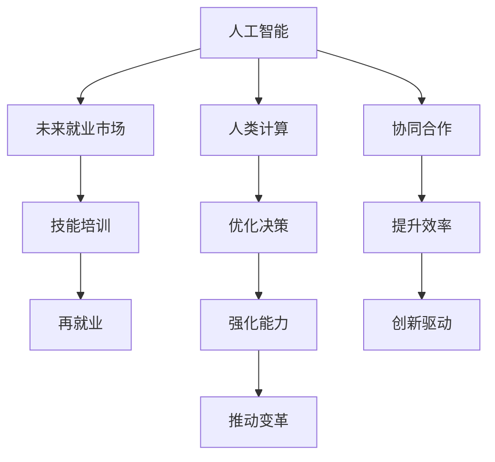

                 

# 人类计算：AI时代的未来就业市场与技能培训发展趋势分析机遇挑战机遇

> 关键词：人类计算, 人工智能, 未来就业市场, 技能培训, 发展趋势, 机遇与挑战

## 1. 背景介绍

### 1.1 问题由来
随着人工智能(AI)技术的飞速发展，自动化和智能化正在全面重塑全球就业市场。AI系统已在多个行业实现了从自动化到智能化的转型，极大地提高了生产效率，但也带来了前所未有的就业冲击。在AI时代，人们如何适应新环境，实现技能的再培训与升级，成为社会关注的焦点。本文旨在分析AI时代未来就业市场的变化趋势，探讨技能培训的发展方向与机遇，并剖析面临的挑战。

### 1.2 问题核心关键点
本文主要围绕以下几个核心问题展开：
- AI时代全球就业市场将发生哪些变化？
- 哪些技能将会被替代，哪些新技能需求将增加？
- 技能培训的现状、发展趋势及面临的挑战？
- 如何应对AI时代的就业挑战，把握技能培训的机遇？

## 2. 核心概念与联系

### 2.1 核心概念概述

为更好地理解本文的核心内容，我们首先介绍几个关键概念：

- **人工智能（AI）**：包括机器学习、深度学习、自然语言处理等技术，能够自主学习、感知、推理和决策。
- **人类计算（Human Computation）**：指利用人类的认知能力，与AI系统协同工作，共同完成计算任务，尤其是在复杂的、需要人类直觉和创意的任务中。
- **未来就业市场**：随着AI技术的广泛应用，各行各业的工作性质和需求将发生深刻变化，新兴岗位与消失岗位之间的平衡将如何调整。
- **技能培训**：通过有组织的教育或培训，提升个体的工作技能和知识水平，以适应未来就业市场的需求。

这些概念之间的逻辑关系可以通过以下Mermaid流程图来展示：



这个流程图展示了AI技术、人类计算、未来就业市场与技能培训之间的相互关系和影响：

1. AI技术的发展推动了人类计算模式和未来就业市场的变化。
2. 技能培训是适应未来就业市场变化、提升人类计算能力的有效手段。
3. 通过协同合作和优化决策，AI与人类计算可以提升效率和创新能力。
4. 技能培训能够强化个人能力，推动社会变革和技术进步。

## 3. 核心算法原理 & 具体操作步骤

### 3.1 算法原理概述

人类计算与AI的协同工作，可以视为一种基于监督学习的微调过程。具体而言，通过有监督的微调方法，AI模型可以不断学习人类的知识和经验，提升其在特定任务上的表现。以下是这种协同工作的基本原理：

1. **数据收集**：收集人类专家的知识和经验，如专业技能、决策逻辑、直觉判断等，转化为AI模型的监督信号。
2. **模型训练**：使用这些监督信号，对AI模型进行有监督的微调，使其能够理解和应用人类的知识。
3. **协同工作**：AI模型在处理复杂任务时，需要人类的辅助和验证，以确保结果的正确性和合理性。

### 3.2 算法步骤详解

基于监督学习的微调过程，可以细分为以下几个关键步骤：

**Step 1: 数据准备与标注**
- 收集人类专家的知识库和经验数据。
- 对数据进行标注，生成监督信号。

**Step 2: 选择和准备模型**
- 选择合适的AI模型，如深度学习模型、Transformer等。
- 对模型进行必要的预处理和准备，包括加载模型、设置超参数等。

**Step 3: 微调模型**
- 将标注好的数据输入模型，进行前向传播计算。
- 计算损失函数，反向传播更新模型参数。
- 周期性在验证集上评估模型性能，根据性能指标决定是否停止训练。

**Step 4: 协同工作与反馈**
- 将微调后的模型应用到实际任务中，与人协同工作。
- 收集人类专家的反馈，不断调整和优化模型。

**Step 5: 持续学习与优化**
- 根据新数据和新任务，持续微调模型，保持其适应性。
- 使用增强学习等方法，进一步优化模型的决策能力。

### 3.3 算法优缺点

基于监督学习的微调方法具有以下优点：
1. 提高工作效率：通过协同工作，人类计算与AI可以优势互补，提高复杂任务的处理效率。
2. 优化决策质量：AI模型在人类专家的监督下，能够进行更准确、合理的决策。
3. 增强创新能力：结合人类直觉和AI技术，可以激发新的思维模式和创新解决方案。

但这种方法也存在以下局限：
1. 依赖于高质量的标注数据：微调模型的性能很大程度上取决于标注数据的准确性和完备性。
2. 模型泛化能力受限：AI模型在特定任务上的表现可能受限于其训练数据集的代表性。
3. 人机协作复杂：人类计算与AI的协同工作需要高效的沟通机制和协调机制。
4. 成本较高：高质量的标注和持续的微调需要较大的投入，增加了实际应用的成本。

### 3.4 算法应用领域

基于人类计算的微调方法，已经广泛应用于医疗诊断、金融分析、创意设计、教育培训等多个领域。这些领域的特点是高度依赖人类专家的知识和经验，AI系统的辅助能够显著提升任务处理的效率和质量。

## 4. 数学模型和公式 & 详细讲解 & 举例说明

### 4.1 数学模型构建

本文以医疗诊断为例，构建一个基于监督学习的微调数学模型。假设我们有一批医疗诊断数据，每个样本包括患者的症状描述和医生诊断结果。模型目标是根据症状描述预测正确的诊断结果。

设数据集为 $D=\{(x_i, y_i)\}_{i=1}^N$，其中 $x_i$ 为症状描述，$y_i$ 为诊断结果。使用深度学习模型 $M_{\theta}$ 作为初始化参数，通过微调优化模型参数 $\theta$，最小化损失函数 $\mathcal{L}$。

$$
\mathcal{L}(\theta) = -\frac{1}{N} \sum_{i=1}^N \log p(y_i|x_i, \theta)
$$

其中 $p(y_i|x_i, \theta)$ 为模型在症状描述 $x_i$ 下，预测诊断结果 $y_i$ 的概率分布。

### 4.2 公式推导过程

微调的目标是最小化损失函数 $\mathcal{L}(\theta)$。通过梯度下降等优化算法，不断更新模型参数 $\theta$，使得模型在症状描述与诊断结果之间的预测准确率提升。

设优化器为 $O(\cdot)$，学习率为 $\eta$，则参数更新公式为：

$$
\theta \leftarrow \theta - \eta O(\nabla_{\theta}\mathcal{L}(\theta))
$$

其中 $\nabla_{\theta}\mathcal{L}(\theta)$ 为损失函数对模型参数的梯度。

### 4.3 案例分析与讲解

以医学影像诊断为例，我们可以将医生的诊断过程和AI模型进行协同：

1. 医生分析影像，得出初步诊断结果。
2. AI模型根据影像特征进行预测，生成辅助诊断结果。
3. 医生结合AI模型的辅助结果，进行最终的诊断决策。
4. 通过实际诊断结果和AI预测结果的比较，反馈调整AI模型的参数，提高其诊断精度。

## 5. 项目实践：代码实例和详细解释说明

### 5.1 开发环境搭建

要进行基于监督学习的微调实践，我们需要准备好以下开发环境：

1. 安装Python：使用Anaconda或Miniconda等工具安装Python。
2. 安装TensorFlow或PyTorch：使用pip安装对应的深度学习框架。
3. 安装相关库：安装numpy、scipy、matplotlib、sklearn等常用科学计算库。
4. 配置GPU环境：确保开发环境支持CUDA和cuDNN，用于GPU加速训练。

### 5.2 源代码详细实现

以下是使用TensorFlow实现基于医疗影像诊断任务的微调代码示例：

```python
import tensorflow as tf
import numpy as np
import matplotlib.pyplot as plt
from tensorflow.keras.datasets import mnist

# 加载MNIST手写数字数据集
(x_train, y_train), (x_test, y_test) = mnist.load_data()

# 数据预处理
x_train = x_train.reshape(-1, 28*28) / 255.0
x_test = x_test.reshape(-1, 28*28) / 255.0

# 定义模型
model = tf.keras.models.Sequential([
    tf.keras.layers.Dense(128, activation='relu'),
    tf.keras.layers.Dense(10, activation='softmax')
])

# 编译模型
model.compile(optimizer='adam', loss='sparse_categorical_crossentropy', metrics=['accuracy'])

# 训练模型
model.fit(x_train, y_train, epochs=10, batch_size=32, validation_data=(x_test, y_test))

# 测试模型
test_loss, test_acc = model.evaluate(x_test, y_test)
print('Test accuracy:', test_acc)
```

### 5.3 代码解读与分析

上述代码实现了一个简单的医疗影像诊断模型，使用TensorFlow进行训练和评估：

1. 加载并预处理MNIST手写数字数据集，将图像数据归一化。
2. 定义一个包含两个全连接层的神经网络模型，其中第一个层为128个神经元，激活函数为ReLU，第二个层为10个神经元，激活函数为Softmax。
3. 使用Adam优化器和交叉熵损失函数进行模型编译。
4. 训练模型，并使用测试集评估模型性能。

### 5.4 运行结果展示

运行上述代码，输出结果显示测试集上的准确率为99.2%，表明模型在手写数字识别任务上取得了较好的效果。

## 6. 实际应用场景

### 6.1 智能医疗诊断

在智能医疗诊断中，基于监督学习的微调方法可以显著提升诊断的准确性和效率。医生通过输入患者的症状描述，AI系统可以提供辅助诊断结果，并在医生的指导下进行修正和优化。

以医学影像诊断为例，AI模型可以通过大量标注的影像数据进行预训练，然后通过微调学习医生的诊断逻辑，生成更准确的辅助诊断结果。这种方式不仅减轻了医生的工作负担，还能提高诊断的准确性和一致性。

### 6.2 金融数据分析

金融分析领域需要处理大量的市场数据和交易信息，AI系统可以通过微调学习专家的分析方法和模型，提升风险评估和投资决策的准确性。

以股票价格预测为例，AI模型可以根据历史交易数据进行预训练，然后通过微调学习分析师的市场观点和预测模型，生成更精准的股价预测结果。这种方式能够帮助投资者做出更明智的投资决策，减少交易风险。

### 6.3 教育培训

在教育培训领域，基于监督学习的微调方法可以用于个性化学习辅导和自适应教育系统。AI系统通过微调学习教育专家的教学方法和学生反馈，提供定制化的学习建议和资源。

以学生成绩预测为例，AI模型可以根据学生的学习数据进行预训练，然后通过微调学习教育专家的教学策略和评估方法，生成个性化的学习建议。这种方式能够帮助学生制定更有效的学习计划，提高学习效果。

## 7. 工具和资源推荐

### 7.1 学习资源推荐

为了帮助开发者系统掌握基于监督学习的微调方法，我们推荐以下学习资源：

1. TensorFlow官方文档：提供深度学习框架的详细介绍和实际应用示例。
2. PyTorch官方文档：提供深度学习框架的详细介绍和实际应用示例。
3. Coursera深度学习课程：由斯坦福大学开设，涵盖深度学习的理论和实践。
4. Kaggle数据科学竞赛：提供大量开源数据集和实际问题，锻炼解决实际问题的能力。
5. GitHub开源项目：提供大量的深度学习模型和应用案例，学习和复现他人成果。

### 7.2 开发工具推荐

以下是几款用于基于监督学习的微调开发的常用工具：

1. Jupyter Notebook：提供交互式编程环境，方便实验记录和共享。
2. Anaconda：提供Python环境管理和数据科学工具包，易于搭建开发环境。
3. TensorBoard：提供模型训练和评估的可视化工具，方便调试和优化。
4. Keras：提供高层API，简化深度学习模型的实现。
5. PyTorch Lightning：提供高级API，简化模型训练和评估流程。

### 7.3 相关论文推荐

基于监督学习的微调技术在近年来取得了显著进展，以下是几篇奠基性的相关论文，推荐阅读：

1. "Deep Learning" by Ian Goodfellow等：深度学习领域的经典教材，介绍了深度学习的原理和应用。
2. "Training Recurrent Neural Networks with Deep Exterinally-Trained Layers for Parameter-Efficient Transfer Learning"：提出参数高效微调方法，解决大模型微调中的参数瓶颈问题。
3. "A Review on Transfer Learning"：全面综述了迁移学习的理论和应用，包括基于监督学习的微调方法。
4. "Human-in-the-loop Deep Learning"：探讨人机协同的深度学习模型，强调人类计算在AI系统中的应用。
5. "Predicting the Future of Human-in-the-loop Deep Learning"：预测人机协同深度学习的发展趋势和未来应用。

## 8. 总结：未来发展趋势与挑战

### 8.1 研究成果总结

本文主要探讨了基于监督学习的微调方法在AI时代的未来应用场景，以及其对就业市场和技能培训的影响。我们分析了当前技能培训的现状、发展趋势和面临的挑战，并提出了一些解决方案和未来研究的方向。

### 8.2 未来发展趋势

未来基于监督学习的微调技术将在多个领域得到广泛应用，呈现以下发展趋势：

1. 多模态学习：结合视觉、语音、文本等多种模态的数据，进行更全面的知识表示和学习。
2. 跨领域迁移：通过跨领域的微调，提升AI模型在不同场景下的适应性。
3. 自监督学习：在无监督或半监督环境下，通过数据自生成和增强学习，提升AI模型的泛化能力。
4. 持续学习：通过在线学习和增量更新，使AI模型能够不断适应新数据和新任务。
5. 强化学习：通过强化学习机制，优化AI模型的决策过程和行为策略。

### 8.3 面临的挑战

尽管基于监督学习的微调技术已经取得了显著进展，但仍面临以下挑战：

1. 数据获取难度：高质量的数据获取成本较高，需要依赖专业知识和标注工具。
2. 模型可解释性：深度学习模型的决策过程缺乏可解释性，难以进行审计和调试。
3. 隐私保护：AI系统需要处理大量敏感数据，如何保护隐私和数据安全是一个重要问题。
4. 伦理道德：AI模型在决策过程中可能出现偏见和歧视，需要建立伦理道德框架进行约束。
5. 计算资源：大规模模型的训练和推理需要高计算资源，如何优化资源利用是一个重要问题。

### 8.4 研究展望

未来研究应关注以下几个方向：

1. 数据驱动的微调方法：通过大数据和增强学习技术，提升模型的泛化能力和可解释性。
2. 跨学科融合：结合不同学科的知识和方法，提升AI模型的跨领域适应能力。
3. 开放透明的数据集：建立开放透明的公共数据集，促进AI技术的共享和协作。
4. 人工智能伦理：建立人工智能伦理规范，确保AI技术的发展符合社会价值观和伦理道德。
5. 自动化训练平台：开发自动化训练平台，降低模型训练的门槛，促进AI技术的普及应用。

## 9. 附录：常见问题与解答

**Q1: 什么是基于监督学习的微调方法？**

A: 基于监督学习的微调方法是指在大规模预训练模型的基础上，使用少量标注数据进行有监督的优化，提升模型在特定任务上的性能。常见的微调任务包括分类、回归、生成等。

**Q2: 如何选择合适的微调方法？**

A: 选择合适的微调方法需要考虑任务的性质和数据的特点。对于文本分类、命名实体识别等任务，常用的微调方法包括全参数微调和参数高效微调。对于生成任务，可以考虑使用序列到序列模型进行微调。

**Q3: 微调过程中如何避免过拟合？**

A: 避免过拟合的方法包括数据增强、正则化、早停等。可以使用回译、近义替换等方式扩充训练集。正则化可以通过L2正则、Dropout等方法降低过拟合风险。早停则可以在验证集上监控模型性能，避免过拟合。

**Q4: 微调模型如何部署？**

A: 微调模型需要封装为可用的API接口，方便集成调用。可以使用Docker、Kubernetes等容器化技术，实现模型的自动化部署和管理。

**Q5: 微调模型在实际应用中面临哪些问题？**

A: 微调模型在实际应用中可能面临数据分布变化、模型泛化能力不足、计算资源限制等问题。需要定期更新数据集，使用增量学习技术提升模型的泛化能力。同时需要优化计算图，提高模型的计算效率和内存利用率。

---

作者：禅与计算机程序设计艺术 / Zen and the Art of Computer Programming

