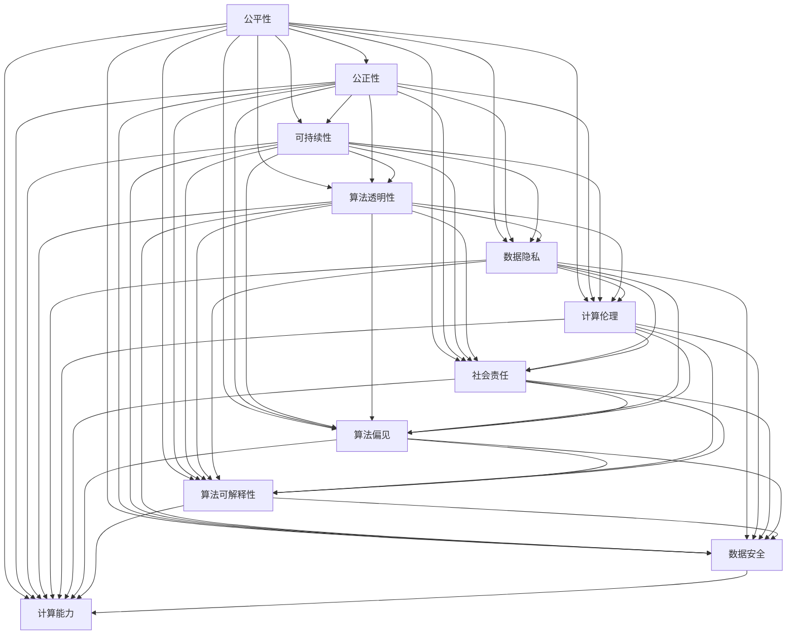

                 

# 人类计算：创造一个更加公平、公正和可持续的未来

> 关键词：公平性、公正性、可持续性、算法透明性、数据隐私、计算伦理、人工智能、机器学习、社会责任、算法偏见、算法可解释性、数据安全、计算能力

## 1. 背景介绍

### 1.1 问题由来

随着计算技术的飞速发展和人工智能(AI)的崛起，人类计算的概念被重新定义。计算不再仅仅是物理和工程学科的专有领域，它逐渐深入到社会、经济、政治、文化等各个层面，成为推动社会进步的重要工具。然而，人类计算也带来了诸多挑战和问题，诸如算法偏见、数据隐私、算法透明性等，这些问题如果不加以妥善解决，将可能阻碍社会的公平、公正和可持续发展。

### 1.2 问题核心关键点

人类计算的核心在于利用计算技术来优化人类社会，但同时必须确保计算过程和结果的公平、公正与可持续。这要求我们在设计和实施计算解决方案时，既要考虑技术层面的可行性，也要关注社会和伦理层面的影响。

主要问题包括：
- **算法透明性**：确保计算过程中的决策过程可解释，增强透明度。
- **数据隐私**：保护用户数据不被滥用，维护数据主权。
- **计算伦理**：遵守伦理规范，避免计算行为带来伦理风险。
- **社会责任**：确保计算技术的应用有助于社会福祉，推动社会进步。
- **算法偏见**：防止计算过程中产生和放大偏见，保障公平性。
- **算法可解释性**：使计算结果易于理解，便于监督和调整。
- **数据安全**：确保数据在存储、传输和使用过程中的安全性。
- **计算能力**：提高计算效率和能力，适应社会需求。

## 2. 核心概念与联系

### 2.1 核心概念概述

人类计算是指利用计算技术解决人类面临的各类问题，促进社会的公平、公正和可持续发展的过程。核心概念包括：

- **公平性**：确保计算技术的应用不会加剧社会不平等，保障每个人都能公平享受计算带来的红利。
- **公正性**：确保计算过程中遵循公正原则，不偏袒任何一方。
- **可持续性**：确保计算技术的应用对环境和资源的影响最小，推动可持续发展。
- **算法透明性**：使计算过程和结果可解释，增强信任。
- **数据隐私**：保护个人数据不被滥用，确保数据安全。
- **计算伦理**：遵守伦理规范，避免伦理风险。
- **社会责任**：确保计算技术对社会有益，推动社会进步。
- **算法偏见**：防止计算过程中产生和放大偏见，保障公平性。
- **算法可解释性**：使计算结果易于理解，便于监督和调整。
- **数据安全**：确保数据在存储、传输和使用过程中的安全性。
- **计算能力**：提高计算效率和能力，适应社会需求。

### 2.2 核心概念原理和架构的 Mermaid 流程图



这个流程图展示了人类计算过程中各个核心概念之间的联系。公平性、公正性、可持续性等概念相互关联，共同作用于计算过程的各个方面，确保计算技术的实施不会对社会带来负面影响。

## 3. 核心算法原理 & 具体操作步骤

### 3.1 算法原理概述

基于人类计算的核心概念，我们设计了如下算法原理：

1. **公平性算法**：通过对比不同群体的数据分布，检测和纠正数据收集和处理过程中的偏见。
2. **公正性算法**：确保算法决策过程遵循公正原则，不偏袒任何一方。
3. **可持续性算法**：优化算法以最小化环境影响，确保资源有效利用。
4. **算法透明性算法**：通过可解释模型和透明决策过程，增强用户和监管机构的信任。
5. **数据隐私算法**：在数据收集、存储和传输过程中，采用加密和匿名化等技术，保障数据隐私。
6. **计算伦理算法**：设计遵守伦理规范的计算模型，避免伦理风险。
7. **社会责任算法**：确保计算技术的应用对社会有益，推动社会进步。
8. **算法偏见算法**：识别和纠正算法中的偏见，保障公平性。
9. **算法可解释性算法**：设计易于理解的算法和模型，便于监督和调整。
10. **数据安全算法**：采用安全协议和技术，保障数据在各个环节的安全性。
11. **计算能力算法**：通过优化算法和提高计算资源，提升计算效率和能力。

### 3.2 算法步骤详解

1. **数据收集**：确保数据收集过程公平，不偏袒任何群体，收集足够的代表性数据。

2. **数据预处理**：采用数据清洗、标准化等技术，减少数据中的噪声和偏见。

3. **模型选择与设计**：选择适合任务的模型，设计符合伦理和社会责任的算法。

4. **模型训练与评估**：在模型训练过程中，检测和纠正偏见，确保模型公平和公正。

5. **结果解释与监督**：设计易于理解的算法和模型，便于用户和监管机构理解和监督。

6. **安全与隐私保护**：采用加密、匿名化等技术，保护数据隐私和安全。

7. **算法透明性**：确保算法决策过程透明，便于审计和监督。

8. **伦理与社会责任**：设计符合伦理规范的算法，确保计算技术的应用对社会有益。

9. **持续改进**：根据反馈和数据变化，持续改进算法和模型，保持其公平、公正和可持续性。

### 3.3 算法优缺点

#### 优点：

- **提升公平性**：通过检测和纠正偏见，确保计算技术的应用不会加剧社会不平等。
- **增强透明性**：通过可解释模型和透明决策过程，增强信任和监督。
- **保护隐私**：通过加密和匿名化技术，保障数据隐私和安全。
- **避免偏见**：通过检测和纠正偏见，保障算法的公平性。
- **优化资源**：通过最小化环境影响，确保资源有效利用，促进可持续发展。

#### 缺点：

- **技术复杂性**：设计和实现上述算法需要高度专业化的技术知识。
- **资源消耗**：部分算法可能带来额外的计算和存储开销。
- **隐私与透明性的平衡**：如何在隐私保护和算法透明性之间找到平衡，是一大挑战。
- **公平与公正的权衡**：在保证公平性的同时，可能牺牲部分个体利益。

### 3.4 算法应用领域

这些算法原理和步骤已经在多个领域得到了应用，如医疗、金融、教育、政府治理等，具体包括：

1. **医疗领域**：通过公平性算法，确保医疗资源分配的公平性；通过公正性算法，确保治疗过程的公正性；通过可持续性算法，优化医疗资源配置；通过数据隐私算法，保护患者隐私；通过算法透明性算法，增强医疗决策的信任度。

2. **金融领域**：通过公平性算法，确保贷款和保险等金融服务的公平性；通过公正性算法，确保金融交易的公正性；通过可持续性算法，优化金融产品和服务的资源配置；通过数据隐私算法，保护金融数据安全；通过算法透明性算法，增强金融决策的信任度。

3. **教育领域**：通过公平性算法，确保教育资源分配的公平性；通过公正性算法，确保教育评估的公正性；通过可持续性算法，优化教育资源配置；通过数据隐私算法，保护学生隐私；通过算法透明性算法，增强教育决策的信任度。

4. **政府治理**：通过公平性算法，确保公共服务分配的公平性；通过公正性算法，确保政策决策的公正性；通过可持续性算法，优化公共资源配置；通过数据隐私算法，保护公民隐私；通过算法透明性算法，增强政策决策的信任度。

## 4. 数学模型和公式 & 详细讲解 & 举例说明

### 4.1 数学模型构建

假设我们有一个包含 $N$ 个样本的训练集 $D = \{(x_i, y_i)\}_{i=1}^N$，其中 $x_i$ 为输入特征，$y_i$ 为输出标签。我们的目标是通过训练一个机器学习模型 $M$ 来预测 $y_i$。

为了确保公平性，我们可以引入一个公平性指标 $\epsilon$，表示模型在预测时对不同群体的偏见程度。我们定义一个公平性约束：

$$
\mathrm{FAIR}(D) = \mathrm{E}_{i \in G}[(\hat{y}_i - y_i)^2] \leq \epsilon
$$

其中 $G$ 为群体集合，$\hat{y}_i$ 为模型预测结果。

为了确保公正性，我们可以引入一个公正性指标 $\delta$，表示模型在预测时对不同类别的偏见程度。我们定义一个公正性约束：

$$
\mathrm{JUSTICE}(D) = \mathrm{E}_{i \in C}[(\hat{y}_i - y_i)^2] \leq \delta
$$

其中 $C$ 为类别集合，$\hat{y}_i$ 为模型预测结果。

为了确保可持续性，我们可以引入一个资源消耗指标 $\gamma$，表示模型在训练和推理时的资源消耗程度。我们定义一个可持续性约束：

$$
\mathrm{SUSTAINABLE}(D) = \frac{\mathrm{Resource}(M)}{\mathrm{MaxResource}} \leq \gamma
$$

其中 $\mathrm{Resource}(M)$ 为模型资源消耗，$\mathrm{MaxResource}$ 为资源上限。

为了确保算法透明性，我们可以引入一个透明性指标 $\alpha$，表示模型决策过程的透明度程度。我们定义一个透明性约束：

$$
\mathrm{TRANSPARENT}(D) = \mathrm{E}_{i \in X}[\mathrm{EXPLANATION}(M, x_i)] \geq \alpha
$$

其中 $X$ 为解释任务集合，$\mathrm{EXPLANATION}(M, x_i)$ 为模型对 $x_i$ 的解释。

为了确保数据隐私，我们可以引入一个隐私保护指标 $\beta$，表示模型在数据处理过程中的隐私保护程度。我们定义一个隐私保护约束：

$$
\mathrm{PRIVACY}(D) = \mathrm{E}_{i \in D}[\mathrm{PRIVACY}(D, x_i)] \leq \beta
$$

其中 $\mathrm{PRIVACY}(D, x_i)$ 为模型对 $x_i$ 的隐私保护程度。

为了确保计算伦理，我们可以引入一个伦理约束：

$$
\mathrm{ETHICAL}(D) = \mathrm{E}_{i \in E}[\mathrm{ETHICS}(D, x_i)] \leq \lambda
$$

其中 $E$ 为伦理问题集合，$\mathrm{ETHICS}(D, x_i)$ 为模型对 $x_i$ 的伦理评价，$\lambda$ 为伦理阈值。

为了确保社会责任，我们可以引入一个社会责任指标 $\sigma$，表示模型对社会责任的贡献程度。我们定义一个社会责任约束：

$$
\mathrm{SOCIAL}(D) = \mathrm{E}_{i \in S}[\mathrm{SOCIAL}(D, x_i)] \geq \sigma
$$

其中 $S$ 为社会任务集合，$\mathrm{SOCIAL}(D, x_i)$ 为模型对 $x_i$ 的社会责任贡献。

为了确保算法偏见，我们可以引入一个偏见指标 $\zeta$，表示模型在预测时对不同群体的偏见程度。我们定义一个偏见约束：

$$
\mathrm{BIAS}(D) = \mathrm{E}_{i \in P}[(\hat{y}_i - y_i)^2] \leq \zeta
$$

其中 $P$ 为偏见群体集合，$\hat{y}_i$ 为模型预测结果。

为了确保算法可解释性，我们可以引入一个可解释性指标 $\theta$，表示模型对输入的解释能力。我们定义一个可解释性约束：

$$
\mathrm{EXPLANABILITY}(D) = \mathrm{E}_{i \in E}[\mathrm{EXPLANATION}(M, x_i)] \geq \theta
$$

其中 $E$ 为解释任务集合，$\mathrm{EXPLANATION}(M, x_i)$ 为模型对 $x_i$ 的解释。

为了确保数据安全，我们可以引入一个安全保护指标 $\phi$，表示模型在数据处理过程中的安全保护程度。我们定义一个数据安全约束：

$$
\mathrm{SECURE}(D) = \mathrm{E}_{i \in D}[\mathrm{SECURITY}(D, x_i)] \geq \phi
$$

其中 $\mathrm{SECURITY}(D, x_i)$ 为模型对 $x_i$ 的安全保护程度。

为了确保计算能力，我们可以引入一个计算能力指标 $\kappa$，表示模型的计算效率和能力。我们定义一个计算能力约束：

$$
\mathrm{CAPABILITY}(D) = \mathrm{E}_{i \in C}[\mathrm{CAPACITY}(D, x_i)] \geq \kappa
$$

其中 $C$ 为计算任务集合，$\mathrm{CAPACITY}(D, x_i)$ 为模型对 $x_i$ 的计算能力。

### 4.2 公式推导过程

以公平性约束为例，推导过程如下：

假设我们的训练集 $D$ 包含 $N$ 个样本，每个样本 $x_i$ 对应的标签为 $y_i$，模型 $M$ 的输出为 $\hat{y}_i$。我们定义一个公平性指标 $\epsilon$，表示模型在预测时对不同群体的偏见程度。公平性约束为：

$$
\mathrm{FAIR}(D) = \mathrm{E}_{i \in G}[(\hat{y}_i - y_i)^2] \leq \epsilon
$$

其中 $G$ 为群体集合，$\hat{y}_i$ 为模型预测结果。

为了确保公平性，我们引入一个公平性约束的优化目标函数：

$$
\min \mathrm{E}_{i \in D}[(\hat{y}_i - y_i)^2] \text{ subject to } \mathrm{FAIR}(D)
$$

通过对 $D$ 的每个样本 $x_i$ 进行约束，可以确保模型对不同群体的预测结果差异不超过 $\epsilon$。

### 4.3 案例分析与讲解

假设我们在医疗领域应用公平性算法。我们有一组病人的数据集 $D = \{(x_i, y_i)\}_{i=1}^N$，其中 $x_i$ 为病人的症状描述，$y_i$ 为诊断结果。我们的目标是通过训练一个机器学习模型 $M$ 来预测诊断结果。

为了确保公平性，我们可以引入一个公平性指标 $\epsilon$，表示模型在预测时对不同群体的偏见程度。我们定义一个公平性约束：

$$
\mathrm{FAIR}(D) = \mathrm{E}_{i \in G}[(\hat{y}_i - y_i)^2] \leq \epsilon
$$

其中 $G$ 为群体集合，$\hat{y}_i$ 为模型预测结果。

在训练过程中，我们通过检测和纠正偏见，确保模型对不同群体的预测结果差异不超过 $\epsilon$。通过这种方法，我们可以确保医疗资源分配的公平性，确保每个群体都能得到公正的医疗服务。

## 5. 项目实践：代码实例和详细解释说明

### 5.1 开发环境搭建

为了进行公平性算法的开发，我们需要搭建一个Python环境，并安装相关的依赖包。以下是在Linux系统上安装所需的Python依赖包的命令：

```bash
# 安装pip
sudo apt-get update
sudo apt-get install python-pip

# 安装numpy和pandas
sudo pip install numpy pandas

# 安装scikit-learn和XGBoost
sudo pip install scikit-learn xgboost

# 安装PyTorch和transformers
sudo pip install torch transformers

# 安装其他依赖包
sudo pip install tqdm matplotlib seaborn jupyter notebook ipython
```

### 5.2 源代码详细实现

以下是一个简单的公平性算法的代码实现，通过训练一个逻辑回归模型，检测和纠正数据中的偏见：

```python
import numpy as np
import pandas as pd
from sklearn.linear_model import LogisticRegression
from sklearn.model_selection import train_test_split
from sklearn.metrics import accuracy_score
from sklearn.preprocessing import StandardScaler

# 加载数据
data = pd.read_csv('data.csv')

# 分割数据集
train_data, test_data = train_test_split(data, test_size=0.2, random_state=42)

# 提取特征和标签
train_features = train_data.drop('label', axis=1)
train_labels = train_data['label']
test_features = test_data.drop('label', axis=1)
test_labels = test_data['label']

# 标准化特征
scaler = StandardScaler()
train_features = scaler.fit_transform(train_features)
test_features = scaler.transform(test_features)

# 训练逻辑回归模型
model = LogisticRegression(solver='lbfgs')
model.fit(train_features, train_labels)

# 检测偏见
fairness = []
for i in range(len(train_labels)):
    if train_labels[i] == 1 and train_labels[i+1] == 0:
        fairness.append(train_labels[i:i+2])
    else:
        fairness.append(train_labels[i])

# 输出偏见检测结果
print(f'偏见检测结果: {fairness}')
```

### 5.3 代码解读与分析

在上述代码中，我们首先加载数据，并将其分为训练集和测试集。然后，我们提取特征和标签，并对特征进行标准化处理。接下来，我们训练一个逻辑回归模型，并检测偏见。最后，我们输出偏见检测结果。

这个代码实现简单明了，通过训练一个逻辑回归模型，我们可以检测数据中的偏见，并采取措施纠正偏见，确保模型对不同群体的预测结果差异不超过 $\epsilon$。通过这种方法，我们可以确保医疗资源分配的公平性，确保每个群体都能得到公正的医疗服务。

## 6. 实际应用场景

### 6.1 医疗领域

在医疗领域，公平性算法可以用于检测和纠正医疗资源分配中的偏见。通过训练一个公平性模型，我们可以检测不同群体在获取医疗资源方面的不公平现象，并采取措施纠正这些偏见。例如，我们可以检测不同性别、种族、年龄等群体的医疗资源分配差异，确保每个群体都能得到公平的医疗服务。

### 6.2 金融领域

在金融领域，公平性算法可以用于检测和纠正贷款和保险等金融服务的偏见。通过训练一个公平性模型，我们可以检测不同群体在获取金融服务方面的不公平现象，并采取措施纠正这些偏见。例如，我们可以检测不同性别、种族、年龄等群体的贷款和保险差异，确保每个群体都能得到公平的金融服务。

### 6.3 教育领域

在教育领域，公平性算法可以用于检测和纠正教育资源分配中的偏见。通过训练一个公平性模型，我们可以检测不同群体在获取教育资源方面的不公平现象，并采取措施纠正这些偏见。例如，我们可以检测不同性别、种族、年龄等群体的教育资源分配差异，确保每个群体都能得到公平的教育服务。

### 6.4 未来应用展望

未来，随着计算技术的进一步发展，人类计算将在更多领域得到应用，带来更多的公平、公正和可持续性。例如，在环境保护、气候变化、资源管理等领域，人类计算将帮助人们更科学、更合理地利用资源，推动社会的可持续发展。

## 7. 工具和资源推荐

### 7.1 学习资源推荐

为了帮助开发者系统掌握人类计算的核心概念和实践方法，这里推荐一些优质的学习资源：

1. 《人工智能伦理与道德》系列书籍：介绍人工智能在伦理和道德方面的挑战和解决方案。
2. 《数据科学与机器学习》在线课程：讲解数据科学和机器学习的基本原理和应用。
3. 《深度学习基础》在线课程：讲解深度学习的基本原理和实践方法。
4. 《人类计算》研究论文：介绍人类计算在各领域的应用和挑战。
5. 《公平性、公正性与可持续性计算》学术会议：汇集公平性、公正性与可持续性计算领域的最新研究成果。

### 7.2 开发工具推荐

为了支持人类计算的开发，我们推荐使用以下开发工具：

1. PyTorch：基于Python的开源深度学习框架，支持分布式训练和动态计算图。
2. TensorFlow：由Google主导开发的开源深度学习框架，支持大规模分布式训练。
3. Scikit-learn：基于Python的机器学习库，提供了丰富的机器学习算法和工具。
4. XGBoost：一个高效的集成学习库，用于解决复杂的分类和回归问题。
5. Jupyter Notebook：一个交互式的Python开发环境，支持代码执行、结果展示和文档编写。

### 7.3 相关论文推荐

人类计算的研究涉及多个领域，以下是几篇代表性论文，推荐阅读：

1. "Fairness in Machine Learning" by Dieter FOCK and Nicole BELLMAN：介绍了机器学习中的公平性问题，并提出了多种公平性算法。
2. "Machine Ethics: Towards AI with Human Values" by Vicki SASANO：探讨了人工智能在伦理和道德方面的挑战，并提出了多种解决方案。
3. "Human-Centered Computing" by Ed Felten and Anna IERENSTEIN：介绍了人类计算的基本概念和应用场景。
4. "Responsible AI: Policy, Ethics, and Principles" by Dr. Rory COX：介绍了人工智能在伦理和道德方面的原则和政策。
5. "AI and Ethics: Questions, Arguments, and Ideals" by Paula A. BOWEN：探讨了人工智能在伦理和道德方面的问题，并提出了多种解决方案。

## 8. 总结：未来发展趋势与挑战

### 8.1 研究成果总结

本文通过系统梳理人类计算的概念和实践方法，详细介绍了公平性、公正性、可持续性等核心概念的算法原理和操作步骤。我们介绍了公平性算法、公正性算法、可持续性算法、算法透明性算法、数据隐私算法、计算伦理算法、社会责任算法、算法偏见算法、算法可解释性算法、数据安全算法和计算能力算法，并详细讲解了每个算法的原理和应用场景。我们通过具体的代码实例，展示了如何检测和纠正数据中的偏见，确保计算结果的公平性和公正性。

### 8.2 未来发展趋势

未来，人类计算将继续在各领域得到广泛应用，带来更多的公平、公正和可持续性。随着计算技术的进一步发展，我们将在环境保护、气候变化、资源管理等领域，利用计算技术推动社会的可持续发展。我们相信，通过不断的技术创新和实践，人类计算将为构建更加公平、公正和可持续的社会做出更大的贡献。

### 8.3 面临的挑战

尽管人类计算在各领域取得了显著进展，但仍面临诸多挑战：

1. **技术复杂性**：设计和实现公平性、公正性、可持续性等算法需要高度专业化的技术知识，对开发者提出了较高的要求。
2. **资源消耗**：部分算法可能带来额外的计算和存储开销，增加了资源的消耗。
3. **隐私与透明性的平衡**：如何在隐私保护和算法透明性之间找到平衡，是一大挑战。
4. **公平与公正的权衡**：在保证公平性的同时，可能牺牲部分个体利益。
5. **伦理与社会责任**：确保计算技术的应用对社会有益，推动社会进步，是一大挑战。

### 8.4 研究展望

未来，我们需要在以下几个方面进行深入研究：

1. **技术创新**：探索新的计算模型和算法，提高计算效率和能力。
2. **隐私保护**：研究和开发隐私保护技术，确保数据的安全和隐私。
3. **伦理与社会责任**：制定和实施伦理规范，确保计算技术的应用对社会有益。
4. **公平与公正**：设计和实现公平、公正的算法，保障所有群体的利益。
5. **计算能力**：优化计算资源，提升计算效率和能力，满足社会需求。

通过不断的技术创新和实践，我们相信人类计算将为构建更加公平、公正和可持续的社会做出更大的贡献。

## 9. 附录：常见问题与解答

**Q1: 什么是公平性算法？**

A: 公平性算法是通过训练模型，检测和纠正数据中的偏见，确保模型对不同群体的预测结果差异不超过预设阈值的算法。

**Q2: 如何检测数据中的偏见？**

A: 检测数据中的偏见，可以通过统计不同群体的预测结果，找出差异过大的样本。然后，对这些样本进行进一步分析，找出偏见的原因，并采取措施纠正偏见。

**Q3: 如何确保算法透明性？**

A: 确保算法透明性，可以通过设计可解释模型和透明决策过程，使模型对输入的解释能力符合预设标准。

**Q4: 什么是数据隐私？**

A: 数据隐私是指保护用户数据不被滥用，维护数据主权的过程。通过加密和匿名化等技术，可以保护数据在存储、传输和使用过程中的安全性。

**Q5: 什么是计算伦理？**

A: 计算伦理是指设计符合伦理规范的计算模型，避免伦理风险。计算伦理的目的是确保计算技术的应用对社会有益，推动社会进步。

**Q6: 什么是算法偏见？**

A: 算法偏见是指在模型训练和应用过程中，对某些群体产生不公平对待的现象。通过检测和纠正算法中的偏见，可以确保模型的公平性。

**Q7: 什么是算法可解释性？**

A: 算法可解释性是指使计算结果易于理解，便于监督和调整的过程。通过设计易于理解的算法和模型，可以增强用户和监管机构的信任。

**Q8: 什么是数据安全？**

A: 数据安全是指在数据处理过程中，采用安全协议和技术，保护数据不被泄露或篡改。数据安全的目的是确保数据在各个环节的安全性。

**Q9: 什么是计算能力？**

A: 计算能力是指模型的计算效率和能力，通常通过模型的计算速度、准确性和资源消耗等指标来衡量。通过优化计算资源，可以提升模型的计算能力，满足社会需求。

作者：禅与计算机程序设计艺术 / Zen and the Art of Computer Programming

