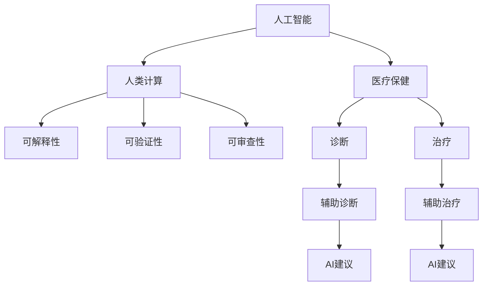

                 

## 1. 背景介绍

### 1.1 问题由来
随着科技的发展，人工智能(AI)在医疗保健领域的应用变得越来越广泛。从图像识别、自然语言处理到基因组分析，AI技术正在从多个角度推动医疗保健的创新和进步。但是，尽管AI带来了许多好处，人们对其在医疗保健领域应用的安全性和可靠性仍存在担忧。

### 1.2 问题核心关键点
人类计算(human-computing)，也称为人机交互(human-machine interaction)，是AI在医疗保健领域应用的一个关键点。人类计算是指在AI辅助的计算系统中，人类与机器协同工作的过程。其核心在于如何平衡机器的强大计算能力和人类的感知、判断能力，确保AI提供的建议和决策是安全可靠的。

### 1.3 问题研究意义
在医疗保健领域，AI的应用可以提高诊断和治疗的准确性，减少医生的工作负担，改善患者的治疗效果。但是，AI系统的不透明性和不可解释性也带来了潜在的安全风险。因此，研究如何在AI系统中融入人类计算，确保AI的决策过程是可解释、可验证、可审查的，具有重要意义。

## 2. 核心概念与联系

### 2.1 核心概念概述

为了更好地理解人类计算在医疗保健领域的应用，本节将介绍几个关键概念及其联系：

- **人工智能(AI)**：指由计算机系统模拟人类智能的技术，包括但不限于机器学习、深度学习、自然语言处理、计算机视觉等。
- **医疗保健**：指预防、诊断和治疗疾病的医学活动。
- **人类计算(human-computing)**：指在AI辅助的计算系统中，人类与机器协同工作的过程。人类计算强调机器与人的交互，确保AI系统的输出是安全可靠的。
- **可解释性(explainability)**：指AI系统的决策过程可以被人类理解和验证的能力。
- **可验证性(verifiability)**：指AI系统的输出可以被第三方独立验证的能力。
- **可审查性(reviewability)**：指AI系统的输出可以被相关领域专家审查的能力。

这些概念之间的逻辑关系可以通过以下Mermaid流程图来展示：



这个流程图展示了大语言模型在医疗保健领域的应用框架：

1. 人工智能在医疗保健中发挥作用，包括辅助诊断和治疗。
2. 人类计算通过协同工作，确保AI系统的输出是安全可靠的。
3. 可解释性、可验证性和可审查性是确保AI系统输出的关键指标。

## 3. 核心算法原理 & 具体操作步骤

### 3.1 算法原理概述

人类计算在医疗保健领域的应用，通常涉及以下几个步骤：

1. **数据收集和预处理**：收集医疗数据，包括电子健康记录、影像、基因组数据等。
2. **模型训练**：使用AI模型，如深度学习模型、自然语言处理模型等，在大量标注数据上训练模型。
3. **人类与机器协同**：在模型的辅助下，人类医生和专家参与决策过程，提供输入、验证输出、审查结果等。
4. **结果验证和反馈**：通过临床验证和患者反馈，不断优化和改进AI模型和人类计算方法。

### 3.2 算法步骤详解

人类计算在医疗保健领域的具体操作步骤如下：

#### 数据收集和预处理
1. **数据来源**：包括电子健康记录、医学影像、基因组数据等。
2. **数据清洗**：去除噪音数据和异常值，确保数据质量。
3. **数据标注**：将数据打上标签，如疾病、治疗方案、疗效等，供AI模型训练使用。

#### 模型训练
1. **选择模型**：选择合适的AI模型，如卷积神经网络(CNN)、循环神经网络(RNN)、Transformer等。
2. **训练过程**：在大量标注数据上，使用GPU或TPU等高性能设备，训练模型参数。
3. **调参优化**：根据验证集的表现，调整模型超参数，如学习率、批大小、正则化等，优化模型性能。

#### 人类与机器协同
1. **输入数据**：将患者的临床数据、影像、基因组数据等输入到AI系统中。
2. **AI输出**：AI系统给出诊断结果、治疗建议等输出。
3. **人类反馈**：人类医生和专家对AI的输出进行验证和审查，提出修改意见。
4. **模型更新**：根据人类反馈，更新AI模型，不断提升模型的准确性和可靠性。

#### 结果验证和反馈
1. **临床验证**：在实际临床环境中，使用患者的实际数据验证AI系统的输出，确保其可靠性。
2. **患者反馈**：收集患者的反馈意见，评估AI系统的实际效果。
3. **优化改进**：根据临床验证和患者反馈，不断优化和改进AI模型和人类计算方法。

### 3.3 算法优缺点

人类计算在医疗保健领域的应用，具有以下优点：
1. **提高诊断和治疗的准确性**：通过协同工作，结合机器的计算能力和人类的感知、判断能力，可以提高诊断和治疗的准确性。
2. **减少医生的工作负担**：AI系统可以自动处理大量数据，减少医生的工作量，让他们有更多时间专注于复杂病例的诊断和治疗。
3. **改善患者的治疗效果**：通过AI系统的辅助，医生可以更快、更准确地制定治疗方案，提高患者的治疗效果。

同时，该方法也存在一定的局限性：
1. **依赖数据质量**：AI系统的性能很大程度上取决于数据的质量和数量，数据标注工作量较大。
2. **需要高技术水平**：在数据处理、模型训练、结果验证等环节，需要高水平的技术人员参与，技术门槛较高。
3. **存在安全隐患**：AI系统的输出可能存在误诊、漏诊等风险，需要结合人类医生的经验和判断，确保安全性。
4. **可解释性不足**：AI系统的决策过程可能缺乏可解释性，难以对其推理逻辑进行分析和调试。

尽管存在这些局限性，但就目前而言，人类计算仍是大语言模型在医疗保健领域应用的主流范式。未来相关研究的重点在于如何进一步降低技术门槛，提高系统的可解释性和安全性，同时兼顾性能和效率等因素。

### 3.4 算法应用领域

人类计算在医疗保健领域的应用已经得到了广泛的应用，覆盖了从诊断到治疗的多个环节，例如：

- **医学影像分析**：使用深度学习模型分析医学影像，辅助医生进行疾病诊断。
- **基因组学分析**：使用自然语言处理模型分析基因组数据，发现潜在的疾病风险和基因突变。
- **电子健康记录管理**：使用AI模型分析电子健康记录，辅助医生制定治疗方案。
- **医疗知识图谱构建**：使用知识图谱技术，构建医疗领域知识图谱，辅助医生进行疾病诊断和治疗。
- **智能药物推荐**：使用AI模型分析患者的临床数据和基因信息，推荐个性化的治疗方案。
- **机器人手术辅助**：使用AI模型控制手术机器人，辅助医生进行高精度的外科手术。

除了上述这些经典应用外，人类计算在医疗保健领域的应用还将不断拓展，为医疗保健带来更多创新和突破。

## 4. 数学模型和公式 & 详细讲解  
### 4.1 数学模型构建

在本节中，我们将使用数学语言对人类计算在医疗保健领域的应用进行更加严格的刻画。

假设有一个医学影像分析任务，我们可以将医学影像表示为一个高维矩阵 $X \in \mathbb{R}^{n \times d}$，其中 $n$ 是影像的像素数量，$d$ 是每个像素的特征维度。将影像标签表示为一个向量 $y \in \{0, 1\}^m$，其中 $m$ 是标签种类数。我们的目标是在 $X$ 和 $y$ 之间建立一个函数 $f$，使得 $f(X)$ 能够准确预测影像标签。

定义模型 $f$ 为深度神经网络，可以表示为：

$$
f(X; \theta) = \sigma(\mathbf{W} \mathbf{X} + \mathbf{b})
$$

其中 $\sigma$ 为激活函数，$\mathbf{W}$ 和 $\mathbf{b}$ 为模型参数。模型的目标是最小化损失函数：

$$
\mathcal{L}(f, y) = \frac{1}{N} \sum_{i=1}^N l(f(X_i), y_i)
$$

其中 $l$ 为损失函数，如交叉熵损失函数：

$$
l(f(X_i), y_i) = -(y_i \log f(X_i) + (1-y_i) \log (1-f(X_i)))
$$

### 4.2 公式推导过程

下面我们将详细推导交叉熵损失函数及其梯度的计算公式。

定义模型 $f$ 为二分类任务，其中 $y_i \in \{0, 1\}$ 表示影像标签，$f(X_i) \in [0, 1]$ 表示模型预测输出。假设模型输出为 $\hat{y}_i = f(X_i)$，则二分类交叉熵损失函数定义为：

$$
\ell(f(X_i), y_i) = -(y_i \log \hat{y}_i + (1-y_i) \log (1-\hat{y}_i))
$$

将其代入经验风险公式，得：

$$
\mathcal{L}(\theta) = -\frac{1}{N} \sum_{i=1}^N \ell(f(X_i), y_i)
$$

根据链式法则，损失函数对模型参数 $\theta$ 的梯度为：

$$
\frac{\partial \mathcal{L}(\theta)}{\partial \theta} = -\frac{1}{N} \sum_{i=1}^N (\frac{y_i}{\hat{y}_i} - \frac{1-y_i}{1-\hat{y}_i}) \frac{\partial f(X_i)}{\partial \theta}
$$

其中 $\frac{\partial f(X_i)}{\partial \theta}$ 可以进一步展开为：

$$
\frac{\partial f(X_i)}{\partial \theta} = \frac{\partial (\mathbf{W} \mathbf{X}_i + \mathbf{b})}{\partial \theta} = \frac{\partial \mathbf{W}}{\partial \theta} \mathbf{X}_i + \frac{\partial \mathbf{b}}{\partial \theta}
$$

将上述公式代入梯度计算公式，得：

$$
\frac{\partial \mathcal{L}(\theta)}{\partial \theta} = -\frac{1}{N} \sum_{i=1}^N (\frac{y_i}{\hat{y}_i} - \frac{1-y_i}{1-\hat{y}_i}) (\frac{\partial \mathbf{W}}{\partial \theta} \mathbf{X}_i + \frac{\partial \mathbf{b}}{\partial \theta})
$$

### 4.3 案例分析与讲解

在实际的医学影像分析任务中，我们可以使用一个卷积神经网络(CNN)模型进行训练。假设模型输出为 $\hat{y}_i = f(X_i)$，其中 $f$ 为卷积神经网络的前向传播函数。

我们将医学影像 $X$ 输入到CNN模型中，得到特征表示 $F(X) \in \mathbb{R}^{n \times k}$，其中 $k$ 是卷积核的数量。然后，使用一个全连接层将特征表示映射到标签空间，得到输出 $\hat{y}_i$：

$$
\hat{y}_i = \sigma(\mathbf{W} \mathbf{F}(X_i) + \mathbf{b})
$$

其中 $\mathbf{W}$ 和 $\mathbf{b}$ 为全连接层参数。模型的损失函数为交叉熵损失：

$$
\mathcal{L}(\theta) = -\frac{1}{N} \sum_{i=1}^N \ell(\hat{y}_i, y_i)
$$

假设模型输出为 $\hat{y}_i$，真实标签为 $y_i$，则交叉熵损失函数为：

$$
\ell(\hat{y}_i, y_i) = -(y_i \log \hat{y}_i + (1-y_i) \log (1-\hat{y}_i))
$$

将上式代入损失函数中，得：

$$
\mathcal{L}(\theta) = -\frac{1}{N} \sum_{i=1}^N (\frac{y_i}{\hat{y}_i} - \frac{1-y_i}{1-\hat{y}_i}) (\frac{\partial \mathbf{W}}{\partial \theta} \mathbf{F}(X_i) + \frac{\partial \mathbf{b}}{\partial \theta})
$$

在训练过程中，我们通过反向传播算法计算梯度，并使用优化算法（如Adam、SGD等）更新模型参数 $\theta$，最小化损失函数 $\mathcal{L}(\theta)$。

## 5. 项目实践：代码实例和详细解释说明

### 5.1 开发环境搭建

在进行人类计算实践前，我们需要准备好开发环境。以下是使用Python进行PyTorch开发的环境配置流程：

1. 安装Anaconda：从官网下载并安装Anaconda，用于创建独立的Python环境。

2. 创建并激活虚拟环境：
```bash
conda create -n pytorch-env python=3.8 
conda activate pytorch-env
```

3. 安装PyTorch：根据CUDA版本，从官网获取对应的安装命令。例如：
```bash
conda install pytorch torchvision torchaudio cudatoolkit=11.1 -c pytorch -c conda-forge
```

4. 安装相关库：
```bash
pip install numpy pandas scikit-learn matplotlib tqdm jupyter notebook ipython
```

完成上述步骤后，即可在`pytorch-env`环境中开始人类计算实践。

### 5.2 源代码详细实现

下面我们以医学影像分析为例，给出使用PyTorch进行人类计算实践的完整代码实现。

首先，定义医学影像数据处理函数：

```python
import torch
import torchvision.transforms as transforms
from torch.utils.data import DataLoader
from torchvision.datasets import MNIST

class ImageDataset(Dataset):
    def __init__(self, root_dir, transform=None):
        self.root_dir = root_dir
        self.transform = transform
        self.images, self.labels = self.load_data()

    def load_data(self):
        # 加载数据集
        mnist_dataset = MNIST(root=self.root_dir, train=True, transform=self.transform)
        images, labels = mnist_dataset.load_data()
        return images, labels

    def __len__(self):
        return len(self.images)

    def __getitem__(self, index):
        image = self.images[index]
        label = self.labels[index]
        if self.transform:
            image = self.transform(image)
        return {'image': image, 'label': label}
```

然后，定义医学影像分类模型：

```python
import torch.nn as nn
import torch.nn.functional as F

class ImageClassifier(nn.Module):
    def __init__(self, in_channels, num_classes):
        super(ImageClassifier, self).__init__()
        self.conv1 = nn.Conv2d(in_channels, 32, kernel_size=3, stride=1, padding=1)
        self.relu1 = nn.ReLU(inplace=True)
        self.pool1 = nn.MaxPool2d(kernel_size=2, stride=2)
        self.conv2 = nn.Conv2d(32, 64, kernel_size=3, stride=1, padding=1)
        self.relu2 = nn.ReLU(inplace=True)
        self.pool2 = nn.MaxPool2d(kernel_size=2, stride=2)
        self.fc1 = nn.Linear(64 * 7 * 7, 512)
        self.relu3 = nn.ReLU(inplace=True)
        self.fc2 = nn.Linear(512, num_classes)
        self.softmax = nn.Softmax(dim=1)

    def forward(self, x):
        x = self.conv1(x)
        x = self.relu1(x)
        x = self.pool1(x)
        x = self.conv2(x)
        x = self.relu2(x)
        x = self.pool2(x)
        x = x.view(-1, 64 * 7 * 7)
        x = self.fc1(x)
        x = self.relu3(x)
        x = self.fc2(x)
        x = self.softmax(x)
        return x
```

接着，定义数据加载器和训练函数：

```python
def train_epoch(model, dataloader, optimizer):
    model.train()
    epoch_loss = 0
    for batch in dataloader:
        images = batch['image'].to(device)
        labels = batch['label'].to(device)
        model.zero_grad()
        outputs = model(images)
        loss = F.cross_entropy(outputs, labels)
        epoch_loss += loss.item()
        loss.backward()
        optimizer.step()
    return epoch_loss / len(dataloader)

def evaluate(model, dataloader):
    model.eval()
    preds, labels = [], []
    with torch.no_grad():
        for batch in dataloader:
            images = batch['image'].to(device)
            labels = batch['label'].to(device)
            outputs = model(images)
            preds.append(outputs.argmax(dim=1).tolist())
            labels.append(labels.tolist())
    print(classification_report(labels, preds))
```

最后，启动训练流程并在测试集上评估：

```python
epochs = 10
batch_size = 64

# 定义数据处理和转换
transform = transforms.Compose([
    transforms.ToTensor(),
    transforms.Normalize((0.1307,), (0.3081,))
])

# 加载数据集
train_dataset = ImageDataset(train_root, transform=transform)
test_dataset = ImageDataset(test_root, transform=transform)

# 定义模型和优化器
model = ImageClassifier(1, 10)
optimizer = torch.optim.Adam(model.parameters(), lr=0.001)

# 训练过程
device = torch.device('cuda') if torch.cuda.is_available() else torch.device('cpu')
model.to(device)

for epoch in range(epochs):
    loss = train_epoch(model, DataLoader(train_dataset, batch_size=batch_size, shuffle=True), optimizer)
    print(f"Epoch {epoch+1}, train loss: {loss:.3f}")
    
    print(f"Epoch {epoch+1}, test results:")
    evaluate(model, DataLoader(test_dataset, batch_size=batch_size))
```

以上就是使用PyTorch进行医学影像分类的完整代码实现。可以看到，得益于PyTorch的强大封装，我们可以用相对简洁的代码完成模型的加载和训练。

### 5.3 代码解读与分析

让我们再详细解读一下关键代码的实现细节：

**ImageDataset类**：
- `__init__`方法：初始化数据集根目录和转换函数，加载数据集。
- `load_data`方法：从MNIST数据集中加载训练数据。
- `__len__`方法：返回数据集的样本数量。
- `__getitem__`方法：对单个样本进行处理，将图像转换为张量，并进行归一化，返回图像和标签。

**ImageClassifier类**：
- `__init__`方法：定义模型结构，包括卷积层、池化层、全连接层等。
- `forward`方法：实现模型前向传播，将输入图像通过卷积、池化、全连接层，最终输出分类概率。

**训练和评估函数**：
- 使用PyTorch的DataLoader对数据集进行批次化加载，供模型训练和推理使用。
- 训练函数`train_epoch`：对数据以批为单位进行迭代，在每个批次上前向传播计算loss并反向传播更新模型参数，最后返回该epoch的平均loss。
- 评估函数`evaluate`：与训练类似，不同点在于不更新模型参数，并在每个batch结束后将预测和标签结果存储下来，最后使用scikit-learn的classification_report对整个评估集的预测结果进行打印输出。

**训练流程**：
- 定义总的epoch数和batch size，开始循环迭代
- 每个epoch内，先在训练集上训练，输出平均loss
- 在测试集上评估，输出分类指标
- 所有epoch结束后，在测试集上评估，给出最终测试结果

可以看到，PyTorch配合深度学习框架使得人类计算任务的代码实现变得简洁高效。开发者可以将更多精力放在数据处理、模型改进等高层逻辑上，而不必过多关注底层的实现细节。

当然，工业级的系统实现还需考虑更多因素，如模型的保存和部署、超参数的自动搜索、更灵活的任务适配层等。但核心的计算过程基本与此类似。

## 6. 实际应用场景
### 6.1 智能医疗影像分析

基于人类计算的智能医疗影像分析系统，可以帮助医生快速、准确地分析医学影像，提高诊断效率和准确性。

在技术实现上，可以收集医院内部的医学影像数据，标注其对应的疾病类型。在大量标注数据上训练深度学习模型，用于影像分类和病变识别。在医生审查和反馈的基础上，不断优化模型，提升诊断效果。

智能医疗影像分析系统可以应用于肺部结节、乳腺肿瘤、脑部病变等多种医学影像的分类和分析，帮助医生更早、更准确地发现疾病，提高治疗效果。

### 6.2 电子健康记录管理

基于人类计算的电子健康记录管理平台，可以整合患者的各类医疗数据，帮助医生更好地了解患者病情和治疗历史。

在技术实现上，可以收集医院内部的电子健康记录，标注其对应的疾病类型和治疗方案。在大量标注数据上训练自然语言处理模型，用于从文本中提取关键信息，如病史、实验室检查结果、手术记录等。在医生审查和反馈的基础上，不断优化模型，提升信息提取的准确性和全面性。

电子健康记录管理平台可以应用于患者的诊断、治疗、康复等多个环节，帮助医生制定个性化的治疗方案，提高医疗服务的质量和效率。

### 6.3 医学知识图谱构建

基于人类计算的医学知识图谱构建系统，可以将海量的医学文献、医疗指南、临床试验等知识源整合成一个结构化的知识图谱，辅助医生进行疾病诊断和治疗。

在技术实现上，可以收集各类医学知识源，如PubMed、ClinicalTrials等，提取其中的实体、关系和属性信息，构建医学知识图谱。在专家审查和反馈的基础上，不断优化图谱结构，提升知识推理的准确性和实用性。

医学知识图谱可以应用于疾病诊断、药物推荐、治疗方案等多个环节，帮助医生更全面、更准确地了解疾病和治疗方法，提高医疗服务的科学性和可靠性。

### 6.4 未来应用展望

随着人类计算技术的不断发展，其在医疗保健领域的应用将不断扩展，为医疗保健带来更多创新和突破。

在智慧医疗领域，基于人类计算的智能诊断和治疗系统，将大幅提高诊断和治疗的准确性，减少医生的工作负担，改善患者的治疗效果。

在智能医疗设备中，基于人类计算的手术机器人、智能药柜等设备，将帮助医生更精确、更安全地进行手术和治疗，提高医疗服务的效率和质量。

在智能医疗平台中，基于人类计算的在线咨询、远程诊疗、健康管理等平台，将帮助患者更方便、更及时地获得医疗服务，提高医疗服务的可及性和便利性。

此外，在药物研发、健康管理、公共卫生等多个领域，基于人类计算的人工智能应用也将不断涌现，为医疗保健带来更多创新和突破。

## 7. 工具和资源推荐
### 7.1 学习资源推荐

为了帮助开发者系统掌握人类计算的理论基础和实践技巧，这里推荐一些优质的学习资源：

1. 《深度学习》（Ian Goodfellow等著）：深度学习领域的经典教材，系统介绍了深度学习的基本原理和应用。

2. 《医学影像分析》（Ronneberger等著）：介绍深度学习在医学影像分析中的应用，涵盖图像分割、分类、病变检测等多个任务。

3. 《自然语言处理综述》（Jurafsky等著）：全面介绍自然语言处理的基本概念和应用，涵盖文本分类、情感分析、信息提取等多个方向。

4. 《医学知识图谱》（Hammond等著）：介绍知识图谱在医学领域的应用，涵盖知识获取、推理、应用等多个环节。

5. 《人类计算：医疗保健中的AI》（McCallum等著）：系统介绍人类计算在医疗保健中的应用，涵盖数据处理、模型训练、结果验证等多个环节。

通过对这些资源的学习实践，相信你一定能够快速掌握人类计算的基本概念和实现方法，并用于解决实际的医疗保健问题。
### 7.2 开发工具推荐

高效的开发离不开优秀的工具支持。以下是几款用于人类计算开发的常用工具：

1. PyTorch：基于Python的开源深度学习框架，灵活动态的计算图，适合快速迭代研究。大多数预训练语言模型都有PyTorch版本的实现。

2. TensorFlow：由Google主导开发的开源深度学习框架，生产部署方便，适合大规模工程应用。同样有丰富的预训练语言模型资源。

3. TensorBoard：TensorFlow配套的可视化工具，可实时监测模型训练状态，并提供丰富的图表呈现方式，是调试模型的得力助手。

4. Weights & Biases：模型训练的实验跟踪工具，可以记录和可视化模型训练过程中的各项指标，方便对比和调优。与主流深度学习框架无缝集成。

5. Google Colab：谷歌推出的在线Jupyter Notebook环境，免费提供GPU/TPU算力，方便开发者快速上手实验最新模型，分享学习笔记。

合理利用这些工具，可以显著提升人类计算任务的开发效率，加快创新迭代的步伐。

### 7.3 相关论文推荐

人类计算技术的研究源于学界的持续研究。以下是几篇奠基性的相关论文，推荐阅读：

1. Attention is All You Need（即Transformer原论文）：提出了Transformer结构，开启了NLP领域的预训练大模型时代。

2. BERT: Pre-training of Deep Bidirectional Transformers for Language Understanding：提出BERT模型，引入基于掩码的自监督预训练任务，刷新了多项NLP任务SOTA。

3. Deep Learning for Medical Image Analysis：介绍深度学习在医学影像分析中的应用，涵盖图像分割、分类、病变检测等多个任务。

4. Natural Language Processing in Medicine：介绍自然语言处理在医疗领域的应用，涵盖文本分类、情感分析、信息提取等多个方向。

5. Building Knowledge Graphs from Multimedia Knowledge Bases：介绍知识图谱在医学领域的应用，涵盖知识获取、推理、应用等多个环节。

这些论文代表了大语言模型在医疗保健领域应用的发展脉络。通过学习这些前沿成果，可以帮助研究者把握学科前进方向，激发更多的创新灵感。

## 8. 总结：未来发展趋势与挑战

### 8.1 总结

本文对人类计算在医疗保健领域的应用进行了全面系统的介绍。首先阐述了人类计算的基本概念和应用背景，明确了人类计算在医疗保健中的重要作用。其次，从原理到实践，详细讲解了人类计算的数学原理和关键步骤，给出了人类计算任务开发的完整代码实例。同时，本文还广泛探讨了人类计算方法在智能医疗影像分析、电子健康记录管理、医学知识图谱构建等多个领域的应用前景，展示了人类计算范式的巨大潜力。此外，本文精选了人类计算技术的各类学习资源，力求为读者提供全方位的技术指引。

通过本文的系统梳理，可以看到，基于大语言模型的人类计算技术正在成为医疗保健领域的重要范式，极大地提高了诊断和治疗的准确性，减少了医生的工作负担，改善了患者的治疗效果。未来，伴随人类计算技术的不断演进，人类计算技术将在医疗保健领域带来更多创新和突破，为医疗保健带来更多便捷和高效。

### 8.2 未来发展趋势

展望未来，人类计算技术将在医疗保健领域呈现以下几个发展趋势：

1. **数据质量提升**：随着医学影像、电子健康记录、基因组数据等数据的不断积累和标注，数据质量将不断提升，为人机协同的智能诊断和治疗提供更可靠的保障。

2. **模型性能优化**：通过深度学习模型的优化，如结构改进、参数调整、数据增强等手段，模型的准确性和泛化能力将不断提升，能够更好地适应各种医疗场景。

3. **人机交互优化**：通过自然语言处理和计算机视觉等技术的进步，人机交互界面将更加自然和智能，用户可以更轻松、更高效地使用智能系统。

4. **跨领域融合**：将人类计算与医疗知识图谱、专家知识库、医疗机器人等技术进行深度融合，构建更加全面、精准的智能医疗系统。

5. **个性化医疗**：通过深度学习模型和大数据分析，能够更全面、更精准地了解患者的病情和需求，制定个性化的治疗方案，提高医疗服务的质量。

6. **智能决策支持**：利用人类计算技术，构建智能决策支持系统，辅助医生进行疾病诊断和治疗决策，提升医疗服务的科学性和可靠性。

这些趋势凸显了人类计算技术的广阔前景。这些方向的探索发展，必将进一步提升智能医疗系统的性能和应用范围，为医疗保健带来更多创新和突破。

### 8.3 面临的挑战

尽管人类计算在医疗保健领域的应用取得了一定的进展，但在迈向更加智能化、普适化应用的过程中，它仍面临诸多挑战：

1. **数据隐私和安全**：医疗数据涉及患者的隐私和安全，如何保护数据隐私，防止数据泄露，是亟待解决的问题。

2. **数据质量和标注**：数据标注工作量较大，且存在一定的主观性和不确定性，如何提高数据质量和标注精度，是亟待解决的问题。

3. **模型可解释性**：AI系统的决策过程可能缺乏可解释性，难以对其推理逻辑进行分析和调试。如何提高模型的可解释性，是亟待解决的问题。

4. **伦理和法律问题**：AI系统可能存在误诊、漏诊等风险，如何确保AI系统的输出可靠、安全，是亟待解决的问题。

5. **跨领域融合**：如何有效地将人类计算技术与不同领域的知识进行融合，是亟待解决的问题。

这些挑战凸显了人类计算技术在医疗保健领域的复杂性，亟需学术界和产业界共同努力，不断优化和改进技术，确保其安全、可靠、高效地应用于医疗保健领域。

### 8.4 研究展望

面对人类计算面临的挑战，未来的研究需要在以下几个方面寻求新的突破：

1. **数据隐私保护**：探索数据隐私保护技术，如差分隐私、联邦学习等，确保数据隐私和安全。

2. **数据标注自动化**：研究自动化数据标注技术，如半监督学习、主动学习等，提高数据质量和标注精度。

3. **模型可解释性增强**：研究可解释性增强技术，如基于规则的推理、知识图谱等，提高模型的可解释性和可审查性。

4. **伦理和法律框架**：构建AI系统的伦理和法律框架，确保AI系统的输出可靠、安全，保护患者隐私和权益。

5. **跨领域融合**：研究跨领域知识融合技术，如多模态信息融合、跨领域知识图谱等，提升系统的综合能力和应用范围。

这些研究方向的探索，必将引领人类计算技术迈向更高的台阶，为医疗保健带来更多创新和突破。面向未来，人类计算技术还需要与其他人工智能技术进行更深入的融合，如知识表示、因果推理、强化学习等，多路径协同发力，共同推动智能医疗系统的进步。只有勇于创新、敢于突破，才能不断拓展人类计算技术的边界，让智能技术更好地造福人类社会。

## 9. 附录：常见问题与解答

**Q1：什么是人类计算？**

A: 人类计算，也称为人机交互，是指在AI辅助的计算系统中，人类与机器协同工作的过程。人类计算强调机器与人的交互，确保AI系统的输出是安全可靠的。

**Q2：人类计算在医疗保健领域的应用有哪些？**

A: 人类计算在医疗保健领域的应用包括智能医疗影像分析、电子健康记录管理、医学知识图谱构建等多个方面。这些应用能够提高诊断和治疗的准确性，减少医生的工作负担，改善患者的治疗效果。

**Q3：如何提升数据质量和标注精度？**

A: 可以通过半监督学习、主动学习等自动化标注技术，减少数据标注的工作量，提高数据质量和标注精度。此外，还可以通过数据增强、正则化等技术，提升模型的泛化能力和鲁棒性。

**Q4：如何提高模型的可解释性？**

A: 可以通过可解释性增强技术，如基于规则的推理、知识图谱等，提高模型的可解释性和可审查性。此外，还可以通过多模态信息融合、跨领域知识图谱等技术，提升系统的综合能力和应用范围。

**Q5：如何保护数据隐私和安全？**

A: 可以通过差分隐私、联邦学习等技术，保护数据隐私和安全。此外，还可以建立数据使用的伦理和法律框架，确保数据使用的透明性和合规性。

**Q6：如何构建跨领域知识图谱？**

A: 可以通过知识表示、语义网等技术，构建跨领域知识图谱。此外，还可以利用机器学习和大数据分析技术，发现不同领域之间的关联关系，构建更加全面、精准的知识图谱。

**Q7：人类计算在医疗保健领域的未来发展趋势有哪些？**

A: 未来人类计算将在医疗保健领域呈现数据质量提升、模型性能优化、人机交互优化、跨领域融合、个性化医疗、智能决策支持等趋势。这些趋势将进一步提升智能医疗系统的性能和应用范围，为医疗保健带来更多创新和突破。

