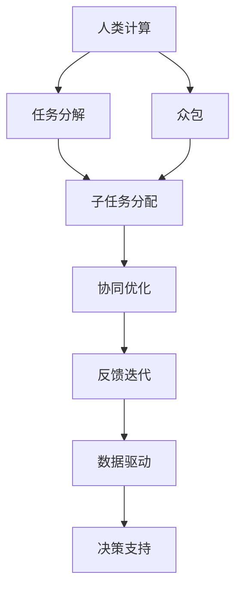

                 

# 人类计算：塑造未来的力量

> 关键词：人类计算,未来科技,人工智能,计算能力,数据驱动,创新生态

## 1. 背景介绍

### 1.1 问题由来
在快速发展的数字时代，计算能力已经成为了推动科技进步和社会发展的重要引擎。从最早的人工计算，到后来的机械计算，再到现代的电子计算，计算技术的演进极大地改变了人类社会的面貌。但随着信息量的爆炸式增长和计算需求的日益复杂化，传统计算模式已经难以满足需求。在这样的背景下，人类计算(Human Computation)应运而生，它以创新的方式利用人类的计算能力和创造力，极大地拓展了计算能力的边界。

### 1.2 问题核心关键点
人类计算的核心理念是通过分散化、众包化、协同化的方式，将计算任务分解为细粒度的子任务，通过大规模人类参与来完成。这种计算方式不仅能够极大地提升计算速度，降低成本，还能在处理复杂的创造性任务时，发挥人类特有的创新和想象能力。

人类计算的关键点在于：
- **任务分解**：将大规模计算任务分解为多个子任务。
- **众包协作**：利用互联网平台，将子任务分发给全球范围内的人类参与者。
- **协同优化**：通过算法和机制，实现任务间的协同工作，提升整体计算效率和准确性。
- **反馈迭代**：实时收集参与者的反馈，不断优化任务设计和工作机制，提升整体效果。

人类计算不仅能处理大规模数据和复杂问题，还能够适应动态变化的环境，为社会和经济带来深刻的变革。

### 1.3 问题研究意义
研究人类计算，对于拓展计算能力边界、激发人类智慧、推动社会经济发展具有重要意义：

1. **计算能力的边界拓展**：人类计算通过大规模协作，可以实现传统计算机难以企及的计算速度和效率，推动计算能力极限的不断突破。
2. **人类智慧的激发**：人类计算不仅利用了人类计算能力，还激发了人类特有的创新和创造力，促进了艺术、科学等多领域的发展。
3. **社会经济的发展**：通过优化资源配置，提升问题解决的效率和质量，人类计算可以为各行各业带来显著的经济效益和社会价值。
4. **数据驱动的决策支持**：通过大规模数据收集和分析，人类计算可以为政府、企业等机构提供科学决策的依据，推动数据驱动的创新生态。

## 2. 核心概念与联系

### 2.1 核心概念概述

为了更好地理解人类计算的原理和应用，本节将介绍几个关键概念：

- **人类计算**：一种利用人类智慧和创造力来完成任务的计算模式，通过任务分解、众包协作、协同优化等方式，实现计算能力的最大化。
- **众包**：通过互联网平台，将任务分解为细粒度的子任务，分发给全球范围内的人类参与者，利用大众的力量共同完成计算任务。
- **任务分解**：将大规模复杂问题分解为多个独立或可并行处理的子任务，便于大规模协作和分布式计算。
- **协同优化**：通过算法和机制，实现任务间的协同工作，提升整体计算效率和准确性。
- **反馈迭代**：实时收集参与者的反馈，不断优化任务设计和机制，提升整体效果。
- **数据驱动**：利用大规模数据分析和挖掘，提供科学决策依据，推动数据驱动的创新生态。

这些核心概念之间的逻辑关系可以通过以下Mermaid流程图来展示：



这个流程图展示了大规模计算任务处理的核心流程：

1. 将任务分解为可独立处理的子任务。
2. 通过众包方式，将这些子任务分发给全球范围内的参与者。
3. 在子任务执行过程中，通过协同优化机制提升整体计算效率。
4. 实时收集参与者的反馈，不断迭代优化任务设计和工作机制。
5. 利用大规模数据分析，提供科学决策的依据。

## 3. 核心算法原理 & 具体操作步骤
### 3.1 算法原理概述

人类计算的核心算法原理是通过任务分解、众包协作、协同优化和反馈迭代等步骤，最大化利用人类智慧和创造力，实现大规模计算任务的完成。

**任务分解**：将一个大规模计算任务分解为多个独立或可并行处理的子任务，便于大规模协作和分布式计算。

**众包协作**：通过互联网平台，将任务分解为细粒度的子任务，分发给全球范围内的人类参与者，利用大众的力量共同完成计算任务。

**协同优化**：通过算法和机制，实现任务间的协同工作，提升整体计算效率和准确性。

**反馈迭代**：实时收集参与者的反馈，不断优化任务设计和机制，提升整体效果。

### 3.2 算法步骤详解

以下是人类计算的详细步骤：

**Step 1: 任务定义和分解**
- 定义大规模计算任务，明确任务目标和要求。
- 将任务分解为多个独立或可并行处理的子任务。
- 确定子任务间的依赖关系，设计合理的任务分配策略。

**Step 2: 众包任务分发**
- 通过互联网平台，将任务分解为细粒度的子任务。
- 将子任务分发给全球范围内的人类参与者。
- 为参与者提供必要的工具和数据，确保任务的顺利执行。

**Step 3: 协同优化**
- 设计协同工作机制，确保参与者间的通信和协作。
- 引入智能算法，优化任务分配和资源配置。
- 实时监控任务执行情况，及时发现并解决问题。

**Step 4: 反馈迭代**
- 收集参与者的反馈，识别问题和瓶颈。
- 根据反馈信息，不断优化任务设计和工作机制。
- 实时调整任务分配策略，提升整体计算效率。

**Step 5: 数据驱动决策**
- 利用大规模数据分析，提供科学决策的依据。
- 基于数据分析结果，不断优化任务执行策略。
- 通过数据驱动的方式，推动计算任务的持续改进和优化。

### 3.3 算法优缺点

人类计算具有以下优点：
1. **高效利用人力资源**：通过众包方式，大规模利用人类智慧和创造力，提升计算效率。
2. **适应性强**：适用于各种规模和类型的计算任务，可以灵活调整任务设计和机制。
3. **灵活创新**：通过任务分解和反馈迭代，实现任务的不断优化和创新，推动技术进步。
4. **降低成本**：通过利用大众力量，降低大规模计算任务的成本。
5. **社会价值**：通过协同工作，增强社会凝聚力和合作精神，推动社会和谐发展。

但人类计算也存在一些缺点：
1. **任务设计复杂**：需要精心设计和优化任务分解策略，以适应不同的计算任务。
2. **协同机制设计难度大**：需要设计高效的协同工作机制，避免沟通和协调问题。
3. **数据隐私和安全问题**：参与者上传的数据可能涉及隐私和安全问题，需要严格保护。
4. **质量控制困难**：参与者的能力和经验参差不齐，需要严格的质量控制机制。
5. **技术门槛高**：需要具备一定的技术能力，才能设计和管理大规模的众包任务。

### 3.4 算法应用领域

人类计算已经在多个领域得到广泛应用，以下是几个典型的应用场景：

- **数据分析和挖掘**：通过众包方式，收集和分析大规模数据，提供科学决策的依据。
- **科学研究和创新**：利用人类智慧和创造力，解决复杂的科学问题，推动技术进步。
- **众包设计和制造**：通过众包平台，收集全球设计师和工程师的创意，设计和制造创新的产品。
- **创意内容生成**：利用大规模人类协作，生成高质量的创意内容，如音乐、电影、游戏等。
- **社会治理和公共服务**：通过众包方式，收集和分析社会数据，优化公共服务和社会治理。

## 4. 数学模型和公式 & 详细讲解 & 举例说明
### 4.1 数学模型构建

为了更好地理解人类计算的数学原理，本节将介绍几个关键的数学模型：

- **任务分解模型**：描述如何将一个大规模计算任务分解为多个子任务的过程。
- **众包模型**：描述如何将任务分配给多个参与者，并通过协同工作完成任务的过程。
- **协同优化模型**：描述如何通过算法和机制，实现任务间的协同工作，提升整体效率的过程。
- **反馈迭代模型**：描述如何通过反馈机制，不断优化任务设计和机制的过程。
- **数据驱动模型**：描述如何利用大规模数据分析，提供科学决策依据的过程。

### 4.2 公式推导过程

以下我们将使用数学语言对人类计算的数学原理进行更加严格的刻画。

假设一个大规模计算任务 $T$，需要分解为 $n$ 个子任务 $T_1, T_2, ..., T_n$。参与者 $i$ 完成子任务 $T_i$ 所需的时间为 $t_i$，完成任务所需的总时间为 $T$。任务分解策略为 $W=(W_1, W_2, ..., W_n)$，其中 $W_i$ 为参与者 $i$ 在子任务 $T_i$ 上的分配权重。任务分配策略为 $A=(A_1, A_2, ..., A_n)$，其中 $A_i$ 为参与者 $i$ 在子任务 $T_i$ 上的分配数量。

任务分解模型的优化目标为：

$$
\min_{W, A} \sum_{i=1}^n \sum_{j=1}^n W_i A_j \cdot t_{ij}
$$

其中 $t_{ij}$ 为参与者 $i$ 在子任务 $T_j$ 上的协作效率。

通过Lagrange乘子法，引入惩罚项，得到优化问题：

$$
\min_{W, A} \sum_{i=1}^n \sum_{j=1}^n W_i A_j \cdot t_{ij} + \lambda (\sum_{i=1}^n W_i - 1) + \mu (\sum_{i=1}^n A_i - T)
$$

其中 $\lambda$ 和 $\mu$ 为Lagrange乘子。

通过求解上述优化问题，可以得到最优的任务分配策略和权重分配策略，实现任务的协同优化和高效执行。

## 5. 项目实践：代码实例和详细解释说明
### 5.1 开发环境搭建

在进行人类计算项目实践前，我们需要准备好开发环境。以下是使用Python进行开发的环境配置流程：

1. 安装Anaconda：从官网下载并安装Anaconda，用于创建独立的Python环境。

2. 创建并激活虚拟环境：
```bash
conda create -n human_computation python=3.8 
conda activate human_computation
```

3. 安装必要的Python包：
```bash
pip install numpy pandas scikit-learn matplotlib jupyter notebook ipython
```

完成上述步骤后，即可在`human_computation`环境中开始项目实践。

### 5.2 源代码详细实现

以下是使用Python和Flask框架实现一个简单的人类计算项目，用于收集和分析大规模数据：

```python
from flask import Flask, request, jsonify

app = Flask(__name__)

@app.route('/submit_task', methods=['POST'])
def submit_task():
    data = request.get_json()
    task_name = data['task_name']
    task_description = data['task_description']
    task_decomposition = data['task_decomposition']
    task_collaboration = data['task_collaboration']
    
    # 将任务数据存入数据库或分布式文件系统
    # 此处仅为示例，实际应用需要更完善的数据管理和存储机制
    
    return jsonify({'success': True}), 200

@app.route('/task_status', methods=['GET'])
def task_status():
    task_id = request.args.get('task_id')
    
    # 获取任务执行情况和参与者反馈
    # 此处仅为示例，实际应用需要更完善的任务监控和反馈机制
    
    return jsonify({'task_status': 'in progress'}), 200

if __name__ == '__main__':
    app.run(debug=True)
```

### 5.3 代码解读与分析

让我们再详细解读一下关键代码的实现细节：

**Flask框架**：
- 使用Flask框架搭建了一个简单的Web应用，用于接收和处理人类计算任务的数据。
- `submit_task` 路由用于接收参与者提交的任务数据，包括任务名称、描述、分解策略和协作策略等。
- `task_status` 路由用于获取任务的执行情况和参与者的反馈。

**任务数据**：
- 任务数据包括任务名称、描述、分解策略和协作策略等，这些数据需要通过API接口提交到服务器。
- 实际应用中，这些数据需要存入数据库或分布式文件系统，以便实时监控和分析。

**任务执行情况和反馈**：
- 实际应用中，需要实时收集参与者的反馈，了解任务执行情况和潜在问题，以便进行优化和调整。
- 反馈数据可以用于优化任务设计和协同工作机制，提升整体计算效率。

## 6. 实际应用场景
### 6.1 数据标注和校验

在数据科学领域，数据标注和校验是重要的预处理环节。通过人类计算，可以将大规模数据标注任务分解为细粒度的子任务，分发给全球参与者协作完成。

例如，在自然语言处理任务中，需要标注大规模的文本数据，将其分解为词汇标注、实体识别、情感分析等子任务，分别分配给不同的参与者完成。参与者可以在线提交标注结果，并通过智能算法进行校验和优化，最终得到高质量的标注数据。

### 6.2 科学研究和创新

在科学研究领域，人类计算可以用于解决复杂的科学问题，推动技术进步。

例如，在物理学研究中，需要计算大规模的分子动力学模拟，可以将其分解为多个独立的分子计算任务，分配给全球参与者协作完成。通过协同工作，可以极大地提升计算速度和精度，推动科学研究的进展。

### 6.3 众包设计和制造

在设计和制造领域，人类计算可以用于收集全球设计师和工程师的创意，设计和制造创新的产品。

例如，在汽车设计中，需要设计新型车身和内饰，可以将其分解为多个独立的设计子任务，分配给不同的参与者完成。通过协同工作，可以极大地提升设计创意的多样性和创新性，推动制造业的创新发展。

### 6.4 创意内容生成

在创意内容生成领域，人类计算可以用于生成高质量的创意内容，如音乐、电影、游戏等。

例如，在电影制作中，需要剪辑和制作大量的特效镜头，可以将其分解为多个独立的视频剪辑任务，分配给不同的参与者完成。通过协同工作，可以极大地提升特效制作的效率和质量，推动影视产业的创新发展。

## 7. 工具和资源推荐
### 7.1 学习资源推荐

为了帮助开发者系统掌握人类计算的理论基础和实践技巧，这里推荐一些优质的学习资源：

1. 《人类计算：开启新时代的计算范式》书籍：全面介绍了人类计算的原理、应用和前景，适合入门和进阶学习。
2. 《众包计算：一种新型的计算范式》课程：介绍了众包计算的基本概念和应用案例，是理解人类计算的重要入门课程。
3. 《协同优化算法》书籍：详细介绍了协同优化的数学模型和算法，是设计高效人类计算系统的关键参考。
4. 《数据驱动的创新生态》课程：介绍了数据驱动的创新生态构建方法和实践案例，有助于理解人类计算的数据驱动特性。

通过对这些资源的学习实践，相信你一定能够快速掌握人类计算的精髓，并用于解决实际的计算问题。

### 7.2 开发工具推荐

高效的开发离不开优秀的工具支持。以下是几款用于人类计算开发的常用工具：

1. Python：强大的编程语言，适用于各种计算任务，是进行人类计算项目开发的常用语言。
2. Flask：轻量级Web框架，适用于搭建简单的人类计算平台和API接口。
3. Apache Spark：分布式计算框架，适用于大规模数据处理和分析，是进行人类计算项目后台支撑的重要工具。
4. Hadoop：分布式文件系统，适用于大规模数据存储和管理，是进行人类计算项目数据存储的重要工具。
5. TensorFlow和PyTorch：深度学习框架，适用于处理大规模数据分析和协同优化任务，是进行人类计算项目的重要工具。

合理利用这些工具，可以显著提升人类计算项目的开发效率，加快创新迭代的步伐。

### 7.3 相关论文推荐

人类计算的研究源于学界的持续探索。以下是几篇奠基性的相关论文，推荐阅读：

1. "Human Computation and the Future of Computing"：探讨了人类计算的潜力和前景，提出了人类计算的重要应用场景。
2. "The Design of Large-Scale Collaborative Systems"：介绍了大规模协作系统的设计原则和实现方法，是理解人类计算的核心文献。
3. "Human Computation: A New Paradigm for Solving Complex Problems"：详细介绍了人类计算的理论基础和应用案例，是理解人类计算的重要文献。
4. "Collaborative Human Computation: A Survey"：总结了人类计算的研究现状和未来发展方向，是理解人类计算的全面综述。

这些论文代表了大规模协作计算的研究进展，通过学习这些前沿成果，可以帮助研究者把握学科前进方向，激发更多的创新灵感。

## 8. 总结：未来发展趋势与挑战
### 8.1 总结

本文对人类计算的原理和应用进行了全面系统的介绍。首先阐述了人类计算的背景和意义，明确了人类计算在拓展计算能力边界、激发人类智慧、推动社会经济发展方面的重要价值。其次，从原理到实践，详细讲解了人类计算的数学模型和操作步骤，给出了人类计算项目开发的完整代码实例。同时，本文还广泛探讨了人类计算在数据标注、科学研究、设计制造、创意内容生成等多个行业领域的应用前景，展示了人类计算的巨大潜力。此外，本文精选了人类计算技术的各类学习资源，力求为读者提供全方位的技术指引。

通过本文的系统梳理，可以看到，人类计算通过大规模协作和众包方式，极大地拓展了计算能力的边界，激发了人类智慧和创造力，为社会和经济带来了深刻的变革。未来，伴随计算技术的持续演进和人类计算的不断探索，相信我们能够实现更加高效、灵活、创新的计算模式，为人工智能和未来科技的发展开辟新的路径。

### 8.2 未来发展趋势

展望未来，人类计算将呈现以下几个发展趋势：

1. **计算能力不断提升**：通过众包方式，大规模利用人类智慧和创造力，计算能力将持续提升。未来的计算任务将更加复杂和多样化，需要更加高效的协同优化机制。
2. **数据驱动的创新生态**：利用大规模数据分析，提供科学决策的依据，推动数据驱动的创新生态。人类计算将与大数据、人工智能等技术深度融合，共同推动社会进步。
3. **跨领域的协同创新**：人类计算将不仅仅局限于单一领域，而是跨学科、跨领域协同创新，推动多领域的协同发展。
4. **创新生态的多样化**：人类计算将推动创新生态的多样化，促进创意内容生成、科学研究、社会治理等多方面的发展。
5. **社会价值的最大化**：人类计算将充分发挥社会价值的最大化，推动社会和谐发展，提升人类生活质量。

### 8.3 面临的挑战

尽管人类计算技术已经取得了瞩目成就，但在迈向更加智能化、普适化应用的过程中，它仍面临着诸多挑战：

1. **任务设计和协同机制**：需要设计高效的任务分解策略和协同工作机制，以适应不同的计算任务。
2. **数据隐私和安全**：参与者上传的数据可能涉及隐私和安全问题，需要严格保护。
3. **质量控制**：参与者的能力和经验参差不齐，需要严格的质量控制机制。
4. **技术门槛**：需要具备一定的技术能力，才能设计和管理大规模的众包任务。
5. **系统效率和稳定性**：大规模协同工作可能面临系统效率和稳定性问题，需要优化算法和机制。

### 8.4 研究展望

面对人类计算面临的挑战，未来的研究需要在以下几个方面寻求新的突破：

1. **优化任务设计和协同机制**：设计更加高效的任务分解策略和协同工作机制，提升整体计算效率和准确性。
2. **增强数据隐私和安全**：开发高效的数据保护和加密技术，保障参与者的数据隐私和安全。
3. **提高质量控制能力**：引入智能算法和机制，优化参与者的选择和任务分配，提升整体质量控制能力。
4. **降低技术门槛**：设计易于使用的工具和平台，降低参与者的技术门槛，提升大规模协作的效率和效果。
5. **提升系统效率和稳定性**：优化协同工作机制，引入高效的算法和机制，提升系统的效率和稳定性。

这些研究方向将推动人类计算技术的发展，进一步拓展计算能力的边界，为人类社会的进步和创新提供新的动力。

## 9. 附录：常见问题与解答
**Q1：人类计算是否适用于所有计算任务？**

A: 人类计算适用于大多数计算任务，特别是那些需要人类智慧和创造力的任务。但对于一些计算量较小或需要高度精确性的任务，可能不适合采用人类计算。此外，对于需要快速响应和高可靠性的任务，人类计算也可能面临一些挑战。

**Q2：如何选择合适的任务分解策略？**

A: 选择合适的任务分解策略需要考虑任务的复杂度、计算量、参与者的能力和经验等因素。通常建议将任务分解为多个独立或可并行处理的子任务，并根据任务的特性和参与者的能力，设计合理的任务分配策略。

**Q3：人类计算如何处理数据隐私和安全问题？**

A: 处理数据隐私和安全问题，需要设计严格的数据保护和加密机制。例如，通过匿名化处理、数据脱敏、访问控制等措施，确保参与者的数据隐私和安全。同时，需要建立透明的数据使用协议，明确数据的使用范围和权限。

**Q4：如何提高参与者的选择和质量控制？**

A: 提高参与者的选择和质量控制，需要引入智能算法和机制。例如，通过参与者的历史表现、技能认证、专业背景等指标，进行筛选和评价。同时，需要建立反馈机制，实时收集和分析参与者的反馈，不断优化任务设计和协同工作机制。

**Q5：人类计算如何在实际应用中提升效率和效果？**

A: 提升效率和效果，需要设计高效的任务分解策略和协同工作机制，优化任务分配和资源配置。例如，通过智能算法和机制，实现任务的自动分派和优化。同时，需要建立反馈机制，实时收集和分析参与者的反馈，不断优化任务设计和机制。

通过解决这些问题，可以最大限度地发挥人类计算的优势，实现大规模协作和创新。

---

作者：禅与计算机程序设计艺术 / Zen and the Art of Computer Programming

