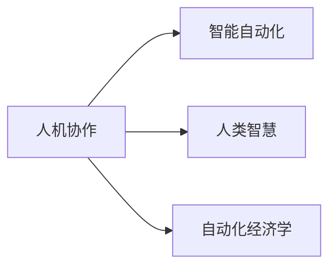

                 

# 人类计算：未来的工作和就业

> 关键词：人类计算, 未来就业, 工作转型, 人工智能, 自动化, 自动化经济学, 技术应用, 人机协作

## 1. 背景介绍

### 1.1 问题由来

随着人工智能技术的迅猛发展，自动化正在逐步渗透到各行各业。自动化正在改变我们的工作方式、商业模式和社会结构。然而，这种自动化并非是无情的，它为人类带来了新的计算范式——“人类计算”。人类计算是指通过与机器协作，利用人类的智慧和情感来处理复杂的、无法被机器自动化的问题。

人工智能的核心是模仿人类的智能和能力，但人类在创造力和情感处理方面仍具有无可比拟的优势。因此，未来的工作模式将不再是“人机竞争”，而是“人机协作”。

### 1.2 问题核心关键点

人类计算的兴起，将深刻影响未来的工作和就业。从当前的热门话题，到未来的趋势，人类计算的核心问题包括：

- 如何通过人类计算，提升生产力，同时减少人类的劳动强度？
- 自动化时代，人类的核心竞争力如何构建？
- 如何设计有效的政策和制度，促进人工智能与人类协作的平衡发展？
- 未来工作和就业，将如何演变？

这些关键问题，将决定人类在新的计算范式下，如何保持价值，如何创造新的机遇。

## 2. 核心概念与联系

### 2.1 核心概念概述

人类计算是指将人类智慧与机器计算相结合，利用人类在创造力和情感处理方面的优势，来解决机器难以自动化的问题。

人类计算的核心概念包括：

- **人机协作**：通过与机器协作，共同完成复杂任务，充分发挥人类的创造力和情感处理能力。
- **智能自动化**：利用人工智能技术，实现部分重复性、规律性任务的自动化，提升生产效率。
- **人类智慧**：利用人类的创造力、判断力和经验，处理复杂、非结构化的问题。
- **自动化经济学**：自动化带来的经济效应，包括就业结构变化、价值分配问题等。

这些概念之间的联系，可以通过以下Mermaid流程图来展示：



这个流程图展示了人类计算的基本架构：通过协作和智慧，实现智能自动化，带来经济效应。

## 3. 核心算法原理 & 具体操作步骤
### 3.1 算法原理概述

人类计算的核心算法原理，是利用人工智能与人类智慧的结合，共同解决复杂问题。其基本思路如下：

- 利用机器自动化处理重复性、规律性任务，提升生产效率。
- 利用人类智慧，处理非结构化、复杂的问题，如创造性工作、情感交流等。
- 通过人机协作，实现任务分配最优，提升整体生产力和价值创造。

### 3.2 算法步骤详解

人类计算的具体操作步骤，通常包括以下几个关键环节：

1. **任务识别**：将复杂问题分解为机器和人类可以处理的子任务。
2. **自动化处理**：利用机器自动化处理重复性、规律性任务，如数据处理、文档生成等。
3. **智能优化**：利用人工智能优化算法，不断提升自动化处理的效率和效果。
4. **人机协作**：在自动化处理的每个阶段，加入人类智慧进行校验、优化和决策。
5. **结果反馈**：通过反馈机制，不断调整自动化和人类协作的策略，提升整体性能。

### 3.3 算法优缺点

人类计算的优点包括：

- **效率提升**：自动化处理重复性任务，提升整体生产效率。
- **质量保证**：利用人类智慧进行校验和优化，提升结果的准确性和可靠性。
- **人机协同**：充分发挥机器和人类的优势，实现任务的最优分配。

缺点包括：

- **成本高**：初始投资较大，需要整合大量先进技术和人才。
- **复杂度高**：设计和实现复杂，需要跨学科的知识和经验。
- **适应性差**：对特定任务或环境依赖较强，难以快速适应变化。

### 3.4 算法应用领域

人类计算技术，已经在多个领域得到应用：

- **医疗**：通过AI辅助诊断，提升医生的诊断效率和准确性，同时利用医生的智慧进行决策和优化。
- **金融**：利用AI进行风险评估和交易策略制定，同时利用金融专家的经验和判断力进行最终决策。
- **制造**：通过自动化生产流程，提升生产效率，同时利用工程师的智慧进行复杂问题的解决和优化。
- **教育**：利用AI进行智能辅导和评估，同时利用教育专家的知识和经验进行教育方法和策略的创新。
- **艺术**：利用AI进行图像生成和音乐创作，同时利用艺术家的创意和情感进行作品的优化和改进。

## 4. 数学模型和公式 & 详细讲解 & 举例说明

### 4.1 数学模型构建

人类计算的数学模型，通常包括以下几个关键组件：

- **任务分解**：将复杂问题分解为多个子任务，分别由机器和人类处理。
- **自动化模型**：建立自动化处理模型的数学模型，如线性回归、神经网络等。
- **人类智慧模型**：建立人类智慧处理的数学模型，如贝叶斯网络、模糊逻辑等。
- **人机协作模型**：建立人机协作的优化模型，如多目标优化、博弈论等。

### 4.2 公式推导过程

以医疗领域为例，通过人机协作处理疾病诊断问题。假设有一个复杂的疾病诊断任务 $D$，可以通过以下步骤进行分解和处理：

1. **任务分解**：将诊断任务 $D$ 分解为两个子任务 $D_1$ 和 $D_2$，分别由机器和人类处理。
2. **自动化模型**：建立机器处理子任务 $D_1$ 的自动化模型 $M_1$，如线性回归模型：
   $$
   y = \beta_0 + \beta_1 x_1 + \beta_2 x_2 + \epsilon
   $$
   其中 $y$ 为诊断结果，$x_1$ 和 $x_2$ 为特征变量，$\epsilon$ 为误差项。
3. **人类智慧模型**：建立人类处理子任务 $D_2$ 的智慧模型 $M_2$，如贝叶斯网络：
   $$
   P(y|x) = \frac{P(x|y)P(y)}{P(x)}
   $$
   其中 $P(y|x)$ 为后验概率，$P(x|y)$ 为似然概率，$P(y)$ 为先验概率，$P(x)$ 为边缘概率。
4. **人机协作模型**：建立人机协作的优化模型 $M_{\text{collab}}$，如多目标优化：
   $$
   \begin{aligned}
   & \min_{x_1, x_2} \mathcal{L}(M_1, D_1) + \mathcal{L}(M_2, D_2) \\
   & \text{s.t. } y = M_1(x_1) + M_2(x_2)
   \end{aligned}
   $$

### 4.3 案例分析与讲解

以一个实际的医疗诊断案例为例，假设需要诊断某种罕见疾病。可以先将问题分解为两个子任务：

1. **机器自动化处理**：利用机器学习模型，如线性回归，分析患者的症状数据，得到初步诊断结果。
2. **人类智慧校验**：医生根据机器提供的诊断结果，结合自身的经验，进行二次诊断和优化。
3. **最终诊断**：结合机器和人类的诊断结果，进行综合判断和决策。

这种人机协作的模式，可以充分利用机器和人类的优势，提升诊断的准确性和效率。

## 5. 项目实践：代码实例和详细解释说明
### 5.1 开发环境搭建

要进行人类计算项目实践，需要搭建一个开发环境。以下是具体的配置步骤：

1. **安装Python**：选择Python版本（3.7及以上），安装最新版本的Python。
2. **安装相关库**：安装必要的Python库，如TensorFlow、Keras、Pandas、NumPy等。
3. **配置开发工具**：配置开发工具，如Jupyter Notebook、PyCharm等。

### 5.2 源代码详细实现

以下是一个简单的医疗诊断项目代码实现：

```python
import tensorflow as tf
import numpy as np
from sklearn.datasets import load_breast_cancer
from sklearn.model_selection import train_test_split
from sklearn.linear_model import LogisticRegression

# 加载数据集
data = load_breast_cancer()
X, y = data.data, data.target

# 划分训练集和测试集
X_train, X_test, y_train, y_test = train_test_split(X, y, test_size=0.2, random_state=42)

# 定义模型
model = LogisticRegression(solver='liblinear', random_state=42)

# 训练模型
model.fit(X_train, y_train)

# 预测测试集
y_pred = model.predict(X_test)

# 评估模型
accuracy = np.mean(y_pred == y_test)
print(f"Accuracy: {accuracy}")
```

### 5.3 代码解读与分析

这段代码实现了一个简单的逻辑回归模型，用于处理医疗诊断问题。具体解释如下：

1. **数据加载**：使用Scikit-Learn库加载乳腺癌数据集，准备训练和测试数据。
2. **模型定义**：定义一个逻辑回归模型，使用liblinear求解器。
3. **模型训练**：在训练集上训练模型。
4. **模型预测**：在测试集上进行预测，并计算预测准确率。

## 6. 实际应用场景

### 6.1 医疗诊断

在医疗领域，人类计算可以广泛应用于疾病诊断、治疗方案制定、手术辅助等方面。通过人机协作，可以大幅提升诊断和治疗的准确性和效率。

### 6.2 金融投资

在金融领域，利用自动化处理数据分析和策略制定，结合人类智慧进行最终决策，可以提高投资回报率和风险管理能力。

### 6.3 教育辅导

在教育领域，利用AI进行智能辅导和评估，同时利用教师的智慧进行教育方法和策略的创新，可以提升教学效果和学习体验。

### 6.4 艺术创作

在艺术领域，利用AI进行图像生成和音乐创作，同时利用艺术家的创意和情感进行作品的优化和改进，可以推动艺术创新和表达。

### 6.5 制造生产

在制造领域，利用自动化处理生产流程，提升生产效率，同时利用工程师的智慧进行复杂问题的解决和优化，可以实现智能制造。

## 7. 工具和资源推荐
### 7.1 学习资源推荐

1. **《人类计算》（Human Computation）**：介绍人类计算的基本概念和应用。
2. **《人工智能与人类协作》（AI and Human Collaboration）**：探讨人工智能与人类协作的未来。
3. **《未来工作：人机协作时代》（Future of Work: Human-Machine Collaboration）**：分析未来工作模式的变化。
4. **《自动化经济学》（The Economics of Automation）**：研究自动化对就业和经济的影响。

### 7.2 开发工具推荐

1. **TensorFlow**：强大的深度学习框架，支持人机协作模型的构建。
2. **Jupyter Notebook**：高效的开发工具，支持代码调试和模型实验。
3. **PyCharm**：Python开发工具，支持多任务协作和项目管理。

### 7.3 相关论文推荐

1. **《人机协作：一种新的计算范式》（Human-Machine Collaboration: A New Paradigm of Computation）**：介绍人机协作的基本原理和应用。
2. **《人类计算：提升生产力和创新的新方法》（Human Computation: A New Approach to Enhance Productivity and Innovation）**：探讨人类计算对生产力和创新的影响。
3. **《人工智能与人类协作的未来》（The Future of AI and Human Collaboration）**：分析人工智能与人类协作的未来发展趋势。

## 8. 总结：未来发展趋势与挑战
### 8.1 研究成果总结

人类计算作为一种新的计算范式，具有广泛的应用前景。通过人机协作，可以大幅提升生产力和创新能力，同时带来新的就业机会和经济效益。

### 8.2 未来发展趋势

未来，人类计算将进一步渗透到各行各业，推动生产力和创新能力的大幅提升。具体趋势包括：

1. **人机协作**：人机协作将进一步深化，机器处理重复性、规律性任务，人类处理复杂、非结构化任务。
2. **智能自动化**：智能化水平将进一步提升，自动化处理更多复杂任务，提升整体效率。
3. **智慧优化**：智慧模型将进一步优化，提升预测和决策的准确性和可靠性。
4. **跨领域应用**：人机协作将应用于更多领域，推动各行各业的智能化转型。

### 8.3 面临的挑战

尽管人类计算带来了诸多机遇，但仍面临以下挑战：

1. **技术复杂性**：设计和实现人机协作系统，需要跨学科的知识和经验，技术复杂性较高。
2. **数据隐私和安全**：大量数据处理带来隐私和安全问题，需要设计有效的保护措施。
3. **伦理和社会影响**：人机协作带来新的伦理和社会问题，需要建立合理的规范和制度。
4. **经济和社会公平**：自动化和智慧化带来就业结构变化，需要设计有效的政策和制度，保障社会公平。

### 8.4 研究展望

未来，人类计算的研究将集中在以下几个方向：

1. **跨领域应用**：推动人机协作在更多领域的应用，提升整体生产力和创新能力。
2. **智能优化**：提升智慧模型的优化能力，提升预测和决策的准确性和可靠性。
3. **隐私和安全**：设计有效的隐私保护和安全措施，保障数据和系统的安全。
4. **伦理和社会影响**：建立合理的伦理和社会规范，保障人机协作的公平和公正。

## 9. 附录：常见问题与解答

**Q1：什么是人类计算？**

A: 人类计算是指通过与机器协作，利用人类的智慧和情感来处理复杂的、无法被机器自动化的问题。

**Q2：人类计算与人工智能有什么不同？**

A: 人类计算强调人机协作，充分利用机器和人类的优势；人工智能则更多关注机器自主处理任务，减少对人类的依赖。

**Q3：人类计算有哪些应用场景？**

A: 人类计算已经在医疗、金融、教育、艺术、制造等领域得到应用，提升了整体生产力和创新能力。

**Q4：人类计算面临哪些挑战？**

A: 技术复杂性、数据隐私和安全、伦理和社会影响、经济和社会公平是当前面临的主要挑战。

**Q5：如何推动人类计算的发展？**

A: 跨领域应用、智能优化、隐私和安全、伦理和社会影响是推动人类计算发展的关键方向。

---

作者：禅与计算机程序设计艺术 / Zen and the Art of Computer Programming

