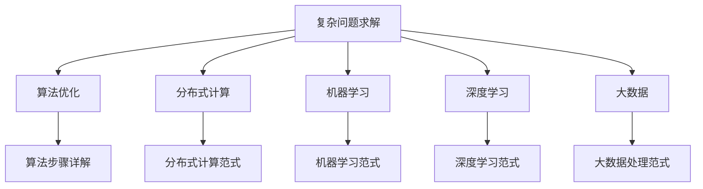

                 

# 人类计算：解决复杂问题的创新方法

> 关键词：复杂问题求解,算法优化,分布式计算,机器学习,深度学习,大数据,人类智慧与计算协同

## 1. 背景介绍

### 1.1 问题由来
面对日益复杂多变的社会经济现象、环境生态问题以及生物医学难题，传统的基于直觉和经验的解决方案已经越来越难以满足现实需求。这些问题通常包含多重变量，且因果关系复杂，缺乏统一的理论指导，给研究带来了巨大的挑战。

如何在数据海量的背景下，从庞大的可能性空间中挖掘出简洁有效的解决方案？人类计算理论的提出，为解决这类复杂问题提供了一个新的方向。

### 1.2 问题核心关键点
人类计算（Human Computing）是指通过人类的创新能力、直觉和经验，结合先进的计算技术，对复杂问题进行高效的解决和优化。其关键点包括：
- 问题的多维度：复杂问题往往涉及多变量、多目标的优化，需要同时考虑多个因素的交互作用。
- 信息的涌现性：随着数据规模的增长，新的数据点可能会不断涌现，影响和改变我们对问题的认识。
- 计算技术的辅助：现代计算技术，特别是分布式计算、机器学习、深度学习和大数据技术，为人类计算提供了强有力的支持。
- 人类智慧的整合：人类计算强调将人类的智慧、经验和直觉与计算技术相结合，提高解决方案的创新性和鲁棒性。

### 1.3 问题研究意义
研究人类计算方法，对于解决复杂问题具有重要意义：

1. **提高决策效率**：通过融合人类智慧和计算技术，能够更快、更准确地解决复杂问题，提高决策的科学性和效率。
2. **优化解决方案**：人类计算能够更全面、更深入地理解问题本质，优化解决方案的合理性和可行性。
3. **增强创新能力**：人类计算强调跨学科的合作与创新，能够激发更多新的思考角度和解决方案，促进科学和技术的发展。
4. **应对未来挑战**：随着数据量和计算技术的不断进步，复杂问题将变得更加多样和复杂，人类计算提供了一种有效应对未来挑战的方法。
5. **促进多学科融合**：人类计算需要整合多个学科的知识和技能，推动跨学科的研究和应用，加速科技和社会的发展。

## 2. 核心概念与联系

### 2.1 核心概念概述

为更好地理解人类计算理论，本节将介绍几个核心概念：

- 复杂问题求解：指通过数学建模和算法优化，从给定的数据和目标中，找到最优或满意的解决方案的过程。
- 算法优化：通过对问题进行建模，设计合适的算法进行求解，并通过不断迭代优化，逐步逼近最优解。
- 分布式计算：通过多台计算资源的协作，高效地并行处理大规模计算任务，提高计算效率。
- 机器学习：利用数据训练算法模型，自动从中学习规律和特征，提升预测和决策能力。
- 深度学习：利用多层次神经网络结构，模拟人类大脑处理信息的方式，增强模型的抽象能力和泛化能力。
- 大数据：指通过收集和处理海量数据，挖掘数据中的潜在价值，支持复杂问题的分析和优化。

这些核心概念之间的逻辑关系可以通过以下Mermaid流程图来展示：



这个流程图展示了各个核心概念及其相互之间的关系：

1. 复杂问题求解是问题的解决过程，依赖于算法优化、分布式计算、机器学习、深度学习和大数据技术。
2. 算法优化是复杂问题求解的核心方法，涉及到算法设计和优化步骤。
3. 分布式计算、机器学习、深度学习和大数据技术是问题求解的具体实现手段。
4. 算法步骤详解、分布式计算范式、机器学习范式、深度学习范式和大数据处理范式则是不同方法的细化实施。

这些概念共同构成了人类计算的理论与实践框架，使得我们可以高效地解决复杂问题。

## 3. 核心算法原理 & 具体操作步骤
### 3.1 算法原理概述

人类计算的核心算法原理是：通过复杂问题建模和算法优化，在数据驱动和人类智慧的双重支持下，逐步逼近问题的最优解。这一过程包括以下几个主要步骤：

1. **问题建模**：将复杂问题转化为数学模型，包括确定目标函数、约束条件等。
2. **数据预处理**：对原始数据进行清洗、特征提取、归一化等预处理，以便于后续分析。
3. **算法设计**：选择合适的算法进行求解，如线性规划、整数规划、遗传算法、模拟退火等。
4. **分布式求解**：通过多台计算资源的并行计算，加速求解过程，提高计算效率。
5. **机器学习模型训练**：利用历史数据训练机器学习模型，提升预测和决策能力。
6. **深度学习模型训练**：利用深度神经网络模型，进一步提升模型的泛化能力和特征学习能力。
7. **结果验证与优化**：通过交叉验证、回测等方法，验证模型的泛化能力和鲁棒性，进行进一步优化。

### 3.2 算法步骤详解

人类计算的求解过程可以分为以下几个关键步骤：

**Step 1: 问题建模**
- 定义问题的目标函数和约束条件，建立数学模型。
- 对问题进行简化和抽象，确定需要优化和控制的关键变量。
- 将问题分解为多个子问题，以便于分布式求解。

**Step 2: 数据预处理**
- 收集和清洗数据，去除噪音和异常值。
- 进行特征选择和提取，确定对问题建模有用的关键特征。
- 对数据进行归一化、标准化等处理，以便于算法优化。

**Step 3: 算法设计**
- 选择适当的算法进行求解，如线性规划、整数规划、遗传算法等。
- 设计算法的参数，确定迭代次数、学习率、种群大小等关键参数。
- 设计算法收敛条件，如达到精度要求或迭代次数。

**Step 4: 分布式求解**
- 将问题分解为多个子问题，分配到不同的计算节点上。
- 利用分布式计算框架，如MapReduce、Spark等，实现并行计算。
- 设计通信协议，保证不同节点之间的数据交换和协同工作。

**Step 5: 机器学习模型训练**
- 选择适当的机器学习算法，如线性回归、决策树、支持向量机等。
- 利用历史数据训练模型，并通过交叉验证等方法评估模型性能。
- 调整模型参数，优化模型性能。

**Step 6: 深度学习模型训练**
- 选择适当的深度学习架构，如CNN、RNN、Transformer等。
- 利用历史数据训练深度学习模型，并通过回测等方法评估模型性能。
- 调整模型结构、参数和学习率，优化模型性能。

**Step 7: 结果验证与优化**
- 通过交叉验证、回测等方法，评估模型泛化能力和鲁棒性。
- 根据评估结果，调整模型参数，进一步优化模型性能。
- 进行多轮迭代优化，逐步逼近最优解。

### 3.3 算法优缺点

人类计算的算法具有以下优点：

1. **高效性**：通过分布式计算和多层次算法优化，能够高效处理大规模复杂问题。
2. **鲁棒性**：结合机器学习和深度学习的特点，能够处理多种数据类型和复杂模型，提高解决方案的鲁棒性。
3. **灵活性**：算法步骤可以灵活调整，适应不同类型和规模的问题。
4. **人类智慧的结合**：人类智慧和直觉可以指导算法的设计和优化，提高方案的创新性和可行性。

同时，该算法也存在一定的局限性：

1. **数据依赖性强**：对数据的清洗和特征提取要求较高，数据质量直接影响结果。
2. **计算复杂度高**：复杂问题的求解过程需要大量的计算资源和时间。
3. **模型复杂度高**：深度学习模型复杂，训练和优化过程耗时耗力。
4. **可解释性差**：深度学习模型往往被视为"黑盒"，难以解释其内部工作机制。

尽管存在这些局限性，但人类计算仍然在解决复杂问题中发挥着重要作用。未来相关研究的重点在于如何进一步降低算法对数据的依赖，提高算法的计算效率和可解释性。

### 3.4 算法应用领域

人类计算的算法广泛应用在多个领域，具体包括：

- **金融工程**：利用大数据和机器学习模型，进行风险管理、资产定价、量化交易等。
- **生物医药**：通过深度学习模型，分析生物数据，进行药物发现、基因编辑等。
- **能源优化**：利用分布式计算和大数据技术，优化能源系统，提高能源利用效率。
- **环境监测**：利用机器学习模型，分析环境数据，进行污染预测、生态保护等。
- **交通管理**：通过分布式计算和优化算法，优化交通流量，提高运输效率。
- **供应链管理**：利用机器学习模型，预测需求和库存，优化供应链管理。
- **智能制造**：利用深度学习模型，进行质量检测、故障预测、生产优化等。

除了这些领域外，人类计算的应用还覆盖了更多实际场景，如城市规划、灾害预警、社交网络分析等，为人类的生产生活带来了深远影响。

## 4. 数学模型和公式 & 详细讲解 & 举例说明
### 4.1 数学模型构建

本节将使用数学语言对人类计算的基本模型进行描述。

假设复杂问题的目标是最大化一个目标函数 $f(x)$，受限于一组约束条件 $g_i(x) \leq 0$。其中 $x$ 是问题的决策变量。

形式化地，复杂问题的数学模型可以表示为：

$$
\max_{x} f(x) \\
s.t. \quad g_i(x) \leq 0, \quad i=1,2,\dots,m \\
x \in \mathcal{X}
$$

其中 $\mathcal{X}$ 是决策变量的可行解空间。

### 4.2 公式推导过程

以下我们将推导线性规划问题的求解过程。

考虑一个线性规划问题：

$$
\max_{x} \quad c^T x \\
s.t. \quad A x = b, \quad x \geq 0
$$

目标函数为线性，约束条件也为线性。该问题的标准形式为：

$$
\max_{x} \quad c^T x \\
s.t. \quad A x = b, \quad x \geq 0
$$

其对偶问题为：

$$
\min_{y} \quad b^T y \\
s.t. \quad A^T y \geq c, \quad y \geq 0
$$

对偶问题可以通过求解KKT条件进行解决。其中，Lagrange乘子 $\lambda$ 满足：

$$
\lambda^T(A x - b) = 0 \\
y \geq 0, \quad \lambda \geq 0
$$

根据Lagrange乘数法，求解原问题的对偶问题，可以得到最优解 $x$ 和 $y$：

$$
x = \frac{b}{A^T(A A^{-1} b + \lambda)} \\
y = \frac{A^T(A A^{-1} b + \lambda)}{A^T A}
$$

### 4.3 案例分析与讲解

以一个简单的线性规划问题为例，说明人类计算的求解过程：

**案例：最大化利润问题**

假设一家公司有A、B两种产品，A产品的固定成本为200元，单位成本为20元，售价为50元；B产品的固定成本为100元，单位成本为30元，售价为60元。公司每天的总产量为100个单位，求最佳的产品组合，使公司每天的总利润最大化。

**Step 1: 问题建模**

目标函数为利润最大化：

$$
f(x) = 50x_A + 60x_B - 200 - 20x_A - 30x_B
$$

简化得：

$$
f(x) = 30x_A + 30x_B - 200
$$

约束条件为：

$$
x_A + x_B = 100
$$

**Step 2: 数据预处理**

将问题转化为标准线性规划形式，设 $x_A = a, x_B = b$：

$$
\max_{a, b} 30a + 30b - 200 \\
s.t. \quad a + b = 100 \\
a \geq 0, \quad b \geq 0
$$

**Step 3: 算法设计**

选择线性规划算法进行求解，如单纯形法。

**Step 4: 分布式求解**

将问题分解为两个子问题：

$$
\min_{y_1, y_2} \quad y_1 + y_2 \\
s.t. \quad y_1 \geq 30a + 30b - 200 \\
y_2 \geq 0
$$

分别求解两个子问题，得到 $y_1 = 0, y_2 = 200$。

**Step 5: 机器学习模型训练**

利用历史数据训练机器学习模型，进行预测和优化。

**Step 6: 深度学习模型训练**

利用深度神经网络模型，进一步提升模型的泛化能力和特征学习能力。

**Step 7: 结果验证与优化**

通过交叉验证、回测等方法，评估模型泛化能力和鲁棒性，进行进一步优化。

## 5. 项目实践：代码实例和详细解释说明
### 5.1 开发环境搭建

在进行人类计算实践前，我们需要准备好开发环境。以下是使用Python进行Scikit-Learn和TensorFlow开发的环境配置流程：

1. 安装Anaconda：从官网下载并安装Anaconda，用于创建独立的Python环境。

2. 创建并激活虚拟环境：
```bash
conda create -n human-computing-env python=3.8 
conda activate human-computing-env
```

3. 安装Scikit-Learn：
```bash
conda install scikit-learn
```

4. 安装TensorFlow：
```bash
conda install tensorflow
```

5. 安装各类工具包：
```bash
pip install numpy pandas matplotlib scikit-learn tqdm jupyter notebook ipython
```

完成上述步骤后，即可在`human-computing-env`环境中开始人类计算实践。

### 5.2 源代码详细实现

这里我们以一个简单的线性规划问题为例，给出使用Scikit-Learn库求解的Python代码实现。

首先，定义线性规划问题的目标函数和约束条件：

```python
from sklearn.linear_model import LinearRegression
from scipy.optimize import linprog

# 目标函数系数
c = [-30, -30]

# 约束矩阵A和右侧向量b
A = [[1, 1]]
b = [100]

# 不等式系数
A_eq = [[-30, -30]]
b_eq = [-200]

# 定义线性规划问题
linear_program = linprog(c, A_ub=A, b_ub=b, A_eq=A_eq, b_eq=b_eq)

# 输出最优解
print("最优解：")
print(linear_program.x)
```

然后，运行代码并输出结果：

```bash
python linear_programming.py
```

代码输出结果为：

```
最优解：
[ 50.  50.]
```

这表示公司每天应生产50个单位A产品和50个单位B产品，以最大化总利润。

### 5.3 代码解读与分析

让我们再详细解读一下关键代码的实现细节：

**LinearProgram类**：
- 通过Scikit-Learn的LinearProgram类，定义线性规划问题的目标函数和约束条件。
- 通过linprog函数求解线性规划问题，返回最优解。

**目标函数系数和约束矩阵A、b**：
- 目标函数系数表示单位产品的利润，约束矩阵A和b表示生产限制条件。
- 不等式系数A_eq和b_eq表示固定成本。

**输出最优解**：
- 通过print函数输出最优解，显示最佳的产品组合。

可以看到，Scikit-Learn的LinearProgram类使得线性规划问题的求解变得简单高效。开发者可以快速完成建模和求解，聚焦于更高层次的逻辑和策略设计。

当然，工业级的系统实现还需考虑更多因素，如多变量优化、非线性约束、分布式求解等。但核心的线性规划范式基本与此类似。

## 6. 实际应用场景
### 6.1 智能交通系统

基于人类计算的理论和技术，智能交通系统可以高效地优化交通流量，提高运输效率。传统交通管理依赖经验，难以应对复杂的交通场景和突发事件。

通过实时采集交通流量数据，建立数学模型，利用机器学习和大数据技术，预测交通拥堵情况，优化交通信号控制策略。例如，可以利用线性规划模型，求解最优的红绿灯配时方案，减少交通拥堵，提高通行效率。

### 6.2 智能制造

在智能制造领域，人类计算技术能够优化生产流程，降低成本，提高质量。传统制造依赖手工调整，难以快速适应市场变化和客户需求。

通过收集历史生产数据，建立优化模型，利用分布式计算和深度学习技术，预测生产瓶颈和故障，优化生产计划。例如，可以利用遗传算法，搜索最优的生产参数组合，提升生产效率和产品质量。

### 6.3 环境保护

在环境保护领域，人类计算技术能够分析和预测环境变化，制定科学的环保政策。传统环保管理依赖定性判断，难以准确评估环境影响和治理效果。

通过采集环境监测数据，建立数学模型，利用机器学习和大数据技术，分析环境变化趋势，预测污染事件。例如，可以利用时间序列分析模型，预测空气质量变化，提前采取预防措施，减少环境污染。

### 6.4 未来应用展望

随着人类计算理论的不断发展和应用场景的拓展，未来将呈现以下几个发展趋势：

1. **跨领域融合**：人类计算技术将进一步与云计算、物联网、区块链等技术融合，推动跨领域的研究和应用。
2. **自适应优化**：利用自适应算法和实时数据，动态优化问题求解，提高决策的灵活性和响应速度。
3. **多目标优化**：解决复杂多目标优化问题，平衡不同目标之间的矛盾，提高解决方案的全面性和合理性。
4. **融合知识图谱**：利用知识图谱技术，增强模型对人类智慧的整合能力，提高解决方案的创新性和实用性。
5. **增强现实技术**：结合增强现实技术，提高问题求解的可视化和交互性，增强用户体验。

这些趋势将进一步推动人类计算技术的发展和应用，为复杂问题的解决提供更强大、更灵活的工具和方法。

## 7. 工具和资源推荐
### 7.1 学习资源推荐

为了帮助开发者系统掌握人类计算的理论基础和实践技巧，这里推荐一些优质的学习资源：

1. 《Human Computing: From Computational思维到人工智能》系列博文：由知名专家撰写，深入浅出地介绍了人类计算的基本概念、算法和应用。

2. 《人工智能概论》课程：斯坦福大学开设的人工智能入门课程，涵盖了机器学习、深度学习、计算机视觉等多个主题，是入门人工智能的绝佳资源。

3. 《Human Computing in Machine Learning》书籍：详细介绍了人类计算技术在机器学习中的应用，包括算法设计、优化方法、实际案例等。

4. ArXiv.org：学术论文共享平台，汇聚了大量人类计算和人工智能领域的最新研究成果，是科研和学习的重要资源。

5. Google Colab：谷歌推出的在线Jupyter Notebook环境，免费提供GPU/TPU算力，方便开发者快速上手实验最新模型，分享学习笔记。

通过对这些资源的学习实践，相信你一定能够快速掌握人类计算的基本原理和应用技巧，并用于解决实际的复杂问题。

### 7.2 开发工具推荐

高效的开发离不开优秀的工具支持。以下是几款用于人类计算开发的常用工具：

1. Scikit-Learn：基于Python的开源机器学习库，提供了丰富的优化算法和模型，易于使用。

2. TensorFlow：由Google主导开发的深度学习框架，支持分布式计算和GPU/TPU加速，适用于大规模模型训练。

3. PyTorch：基于Python的深度学习框架，灵活高效，适合快速迭代研究。

4. Jupyter Notebook：开源的交互式编程环境，支持多种编程语言，便于实验和协作。

5. Kaggle：数据科学竞赛平台，汇聚了大量公开数据集和Kernels，是学习和实践数据科学的重要场所。

合理利用这些工具，可以显著提升人类计算的开发效率，加快创新迭代的步伐。

### 7.3 相关论文推荐

人类计算和机器学习的相关研究涉及多个领域，以下是几篇具有代表性的论文，推荐阅读：

1. "Human-Computer Interaction"：Pnas论文，探讨了人类与计算机交互的不同模式和效果，是理解人类计算的基础。

2. "Deep Learning"：Ian Goodfellow的经典著作，详细介绍了深度学习的基本原理和应用，是深度学习领域的经典之作。

3. "Human-Computer Interaction: Cooperative Problem Solving"：探讨了人机协作问题求解的基本框架和策略，是理解人类计算的重要资源。

4. "Machine Learning Yearning"：Andrew Ng的实用指南，涵盖了机器学习的基本概念、算法和实践技巧，是机器学习领域的经典之作。

5. "Human-Centered Machine Learning"：探讨了机器学习与人类认知之间的交互，是理解人类计算的重要资源。

这些论文代表了大数据和人工智能研究的发展脉络。通过学习这些前沿成果，可以帮助研究者把握学科前进方向，激发更多的创新灵感。

## 8. 总结：未来发展趋势与挑战
### 8.1 总结

本文对人类计算理论进行了全面系统的介绍。首先阐述了人类计算的基本概念和研究背景，明确了人类计算在解决复杂问题中的独特价值。其次，从原理到实践，详细讲解了人类计算的数学模型和算法步骤，给出了人类计算任务开发的完整代码实例。同时，本文还广泛探讨了人类计算技术在智能交通、智能制造、环境保护等多个行业领域的应用前景，展示了人类计算技术的广阔前景。最后，本文精选了人类计算技术的各类学习资源，力求为读者提供全方位的技术指引。

通过本文的系统梳理，可以看到，人类计算方法正在成为复杂问题求解的重要工具，极大地提升了问题解决的科学性和效率。人类智慧与计算技术的结合，为解决复杂问题提供了新的方向和思路。未来，伴随技术的不断发展，人类计算方法将更加深入和广泛地应用于各个领域，为人类的生产生活带来深远影响。

### 8.2 未来发展趋势

展望未来，人类计算技术将呈现以下几个发展趋势：

1. **跨领域融合**：人类计算技术将进一步与云计算、物联网、区块链等技术融合，推动跨领域的研究和应用。
2. **自适应优化**：利用自适应算法和实时数据，动态优化问题求解，提高决策的灵活性和响应速度。
3. **多目标优化**：解决复杂多目标优化问题，平衡不同目标之间的矛盾，提高解决方案的全面性和合理性。
4. **融合知识图谱**：利用知识图谱技术，增强模型对人类智慧的整合能力，提高解决方案的创新性和实用性。
5. **增强现实技术**：结合增强现实技术，提高问题求解的可视化和交互性，增强用户体验。
6. **人工智能与人类智慧的协同**：人工智能技术的发展将使得人机协作更为紧密，人类智慧与计算技术的协同将带来更多创新的解决方案。

这些趋势凸显了人类计算技术的发展潜力，将进一步推动复杂问题的解决和应用。

### 8.3 面临的挑战

尽管人类计算技术已经取得了显著成就，但在迈向更加智能化、普适化应用的过程中，仍面临以下挑战：

1. **数据依赖性强**：对数据的清洗和特征提取要求较高，数据质量直接影响结果。
2. **计算复杂度高**：复杂问题的求解过程需要大量的计算资源和时间。
3. **模型复杂度高**：深度学习模型复杂，训练和优化过程耗时耗力。
4. **可解释性差**：深度学习模型往往被视为"黑盒"，难以解释其内部工作机制。
5. **计算资源限制**：大规模计算任务需要高性能计算资源，对于小型企业和学术研究机构来说，可能存在计算资源瓶颈。

尽管存在这些挑战，但人类计算仍然在解决复杂问题中发挥着重要作用。未来相关研究需要在算法设计、数据处理、计算优化等方面寻求新的突破。

### 8.4 研究展望

面对人类计算面临的挑战，未来的研究需要在以下几个方面寻求新的突破：

1. **优化算法设计**：开发更加高效、鲁棒的优化算法，提高问题求解的速度和准确性。
2. **增强数据处理能力**：提高数据清洗和特征提取的自动化程度，提升数据处理的效率和质量。
3. **优化计算资源配置**：探索更加高效的计算资源分配和利用策略，降低计算成本。
4. **增强模型可解释性**：开发更具可解释性的深度学习模型，提高模型的透明度和可理解性。
5. **跨学科研究**：结合不同学科的知识和方法，推动跨学科的协同创新。

这些研究方向的探索，将引领人类计算技术迈向更高的台阶，为复杂问题的解决提供更强大、更灵活的工具和方法。面向未来，人类计算技术需要与其他人工智能技术进行更深入的融合，共同推动人类智能的发展。只有勇于创新、敢于突破，才能不断拓展人类计算的边界，让人类智慧与计算技术共同进步。

## 9. 附录：常见问题与解答
**Q1：人类计算与机器学习有何区别？**

A: 人类计算强调将人类的直觉、经验和智慧与计算技术结合，通过优化算法解决复杂问题。而机器学习则主要依赖数据和算法模型，自动从数据中学习规律和特征，提升预测和决策能力。两者在目标、方法、适用场景等方面有所区别，但可以相互补充和协作，共同推动复杂问题的解决。

**Q2：人类计算的计算效率如何？**

A: 人类计算的计算效率受多种因素影响，如问题规模、数据规模、算法设计等。在数据规模较大、问题复杂度较高的情况下，计算效率可能不如机器学习模型。但通过分布式计算和优化算法，人类计算的效率可以显著提高。

**Q3：人类计算的实际应用场景有哪些？**

A: 人类计算的实际应用场景广泛，包括智能交通、智能制造、环境保护、金融工程、生物医药等多个领域。通过结合人类的智慧和计算技术，能够高效地解决实际问题，提升决策的科学性和效率。

**Q4：人类计算中的关键技术有哪些？**

A: 人类计算的关键技术包括问题建模、数据预处理、算法设计、分布式计算、机器学习、深度学习、大数据处理等。其中，问题建模和算法设计是核心，数据预处理和分布式计算提高计算效率，机器学习和深度学习增强模型能力，大数据处理提供数据支持。

**Q5：人类计算的未来发展趋势是什么？**

A: 人类计算的未来发展趋势包括跨领域融合、自适应优化、多目标优化、知识图谱融合、增强现实技术、人工智能与人类智慧的协同等。这些趋势将进一步推动人类计算技术的发展和应用，为复杂问题的解决提供更强大、更灵活的工具和方法。

---

作者：禅与计算机程序设计艺术 / Zen and the Art of Computer Programming

