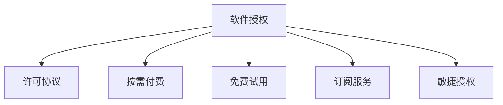

                 

# 从代码到商业：软件授权收入策略

> 关键词：软件授权,收入模型,商业策略,市场需求,许可协议,软件生态系统

## 1. 背景介绍

### 1.1 问题由来
随着数字化转型的不断推进，越来越多的企业开始依赖软件系统来提升运营效率、拓展市场竞争优势。然而，软件产品的开发和维护成本高昂，使得企业对软件的获取方式产生了新的需求。

传统软件获取方式，如全版购买、订阅服务等，存在灵活性不足、更新费用高昂、软件服务质量难以保障等问题。因此，软件授权收入策略应运而生，成为了软件公司获取和维持客户的重要手段。

### 1.2 问题核心关键点
软件授权收入策略，本质上是软件公司通过某种许可协议，对软件的使用、功能、期限等进行限制，以满足不同的市场需求，从而实现收入增长和客户保留的目标。

其核心关键点包括：
1. 客户细分与需求分析
2. 许可协议设计
3. 定价策略
4. 实施与监控机制
5. 客户满意度与反馈

### 1.3 问题研究意义
研究软件授权收入策略，对于软件公司而言，具有以下重要意义：

1. 提高收入稳定性：通过灵活多样的许可协议，满足不同客户的个性化需求，提升收入稳定性。
2. 降低获客成本：采用按需付费的方式，减轻企业一次性购买全版软件的财务负担，降低获客门槛。
3. 增强客户粘性：通过持续的更新和升级，维持客户的长期使用和满意度，增强客户忠诚度。
4. 促进市场扩展：根据不同地域和行业需求，设计定制化的许可协议，拓宽市场覆盖面。
5. 优化资源配置：依据客户需求和市场变化，动态调整授权模式和定价策略，优化资源配置效率。

## 2. 核心概念与联系

### 2.1 核心概念概述

为更好地理解软件授权收入策略，本节将介绍几个密切相关的核心概念：

- **软件授权**：指软件公司通过许可协议，允许客户在一定期限内，使用软件的部分或全部功能，以满足其特定需求。授权方式包括基于用户、基于功能、基于设备等。

- **许可协议**：规定软件使用权的法律文书，通常包含授权范围、费用、期限、限制等关键条款。

- **按需付费**：客户根据实际使用情况，按需支付相应费用的授权方式。

- **免费试用**：客户在一定期限内可以免费使用软件，体验其功能和效果。

- **订阅服务**：客户定期支付固定费用，获得软件及其持续的更新和支持。

- **敏捷授权**：根据客户需求和使用情况，灵活调整授权条件和价格，提高客户满意度。

这些核心概念之间的逻辑关系可以通过以下Mermaid流程图来展示：



这个流程图展示了几大授权方式的逻辑关系：

1. 软件授权是核心，包含多种具体的授权方式。
2. 许可协议是授权的法律保障，定义了授权的详细条款。
3. 按需付费、免费试用、订阅服务和敏捷授权等，都是在软件授权基础上的具体应用。

## 3. 核心算法原理 & 具体操作步骤
### 3.1 算法原理概述

软件授权收入策略的原理，是结合软件产品的特点和市场需求，设计灵活多样、符合客户需求的许可协议，从而实现收入和客户满意度的双重提升。

具体来说，软件公司需要：
1. 分析客户需求和市场趋势。
2. 设计适合不同需求的授权协议。
3. 制定合理的定价策略。
4. 实施并监控授权协议的执行情况。
5. 根据客户反馈不断优化授权模式。

### 3.2 算法步骤详解

软件授权收入策略的核心步骤包括以下几个关键环节：

**Step 1: 客户需求分析**
- 进行市场调研，收集目标客户的需求和痛点。
- 分析不同客户的购买行为、使用习惯和支付意愿。
- 评估客户对不同授权模式（如按需付费、订阅服务）的偏好。

**Step 2: 许可协议设计**
- 根据客户需求和市场趋势，设计灵活多样的许可协议。
- 明确授权范围、功能、期限、限制等关键条款。
- 考虑不同授权模式下的法律和税务问题。

**Step 3: 定价策略制定**
- 基于成本、市场竞争和客户支付能力，制定合理的定价策略。
- 考虑一次性授权费用、订阅费用、灵活支付计划等因素。
- 引入阶梯式定价、按需计费等灵活策略，增加收入弹性。

**Step 4: 实施与监控机制**
- 开发自动化授权管理平台，简化授权操作和监控。
- 建立客户服务团队，提供技术支持和客户咨询。
- 实时监控授权使用情况，确保协议执行。

**Step 5: 客户满意度与反馈**
- 定期收集客户反馈，分析授权模式和定价策略的有效性。
- 根据客户反馈进行授权模式的调整和优化。
- 实施客户满意度调查，评估授权模式的客户接受度。

### 3.3 算法优缺点

软件授权收入策略具有以下优点：
1. 灵活性高：根据客户需求和市场变化，灵活调整授权模式和定价策略。
2. 客户粘性强：通过持续的更新和支持，维持客户的长期使用和满意度。
3. 收入稳定性好：多样化的授权模式和定价策略，满足不同客户需求，提高收入稳定性。
4. 降低获客成本：按需付费等方式，减轻企业一次性购买全版软件的财务负担，降低获客门槛。

同时，该策略也存在以下局限性：
1. 授权复杂度高：设计和实施灵活多样的许可协议，需要较高的技术和管理成本。
2. 客户管理难度大：不同类型的授权模式需要不同的管理方式，增加了客户服务的复杂性。
3. 法律和税务问题复杂：许可协议涉及的法律和税务问题复杂，需严格遵守相关法规。
4. 客户满意度保障难：授权协议的设计和执行若不合理，易导致客户不满。

尽管存在这些局限性，但就目前而言，软件授权收入策略仍是大公司获取和维持客户的重要手段。未来相关研究的重点在于如何进一步降低授权复杂度，提高客户满意度，同时兼顾收入稳定性和成本效益。

### 3.4 算法应用领域

软件授权收入策略广泛应用于软件公司获取和维持客户的过程中，适用于各种软件产品和市场环境。具体包括：

- 办公软件：如Microsoft Office、Adobe Creative Suite等，提供基于用户和基于功能的授权。
- 云计算平台：如AWS、Azure、Google Cloud等，提供按需付费和订阅服务。
- 移动应用：如Apple App Store、Google Play等，提供基于设备和使用情况的授权。
- 企业级软件：如SAP、Oracle等，提供定制化许可协议和按需付费。

除了上述这些经典应用外，软件授权策略还被创新性地应用于新兴市场，如物联网设备、人工智能平台等，为各类企业提供灵活多样的授权模式。

## 4. 数学模型和公式 & 详细讲解 & 举例说明

### 4.1 数学模型构建

为了更好地理解软件授权收入策略，本节将使用数学语言对许可协议的设计和定价进行建模。

假设某软件公司提供两种授权模式：
- 按需付费：客户每次使用软件时，按需支付固定费用。
- 订阅服务：客户每月支付固定订阅费，获得软件及其持续的更新和支持。

设软件公司每次授权的费用为$C$，客户每次使用软件的费用为$U$，每月订阅费用为$S$。

令$n$为客户使用软件的次数，$T$为使用期限（月）。则两种授权模式的总收入分别为：
- 按需付费：$T \times U \times n$
- 订阅服务：$S \times T$

根据上述模型，可以进一步分析不同授权模式的经济性和客户满意度。

### 4.2 公式推导过程

对于按需付费模式，设每次使用的概率为$p$，客户支付的总费用为$F$，则总收入$I$为：
$$
I = T \times p \times U \times n = T \times U \times \frac{F}{C}
$$

对于订阅服务模式，设客户最终支付的订阅费用为$P$，总收入$I'$为：
$$
I' = S \times T
$$

令$F'$为按需付费模式下客户支付的总费用，$P'$为订阅服务模式下客户支付的总费用。则有：
$$
F = C \times F' \quad \text{和} \quad P = S \times P'
$$

通过比较$I$和$I'$，分析不同授权模式的经济性和客户满意度。

### 4.3 案例分析与讲解

假设某软件公司提供两种授权模式，每次授权费用$C=100$元，每次使用费用$U=5$元，每月订阅费用$S=30$元，客户每次使用软件的概率为$p=0.8$。则两种授权模式下客户支付的总费用$F$和$P$分别为：
- 按需付费：$F = C \times \frac{F'}{C} = 100 \times \frac{100}{5} = 2000$元
- 订阅服务：$P = S \times P' = 30 \times 12 = 360$元

令$n=20$次，则两种授权模式下总收入$I$和$I'$分别为：
- 按需付费：$I = T \times U \times n = 12 \times 5 \times 20 = 1200$元
- 订阅服务：$I' = S \times T = 30 \times 12 = 360$元

通过上述计算，可以看出：
- 按需付费模式下，客户每次使用后支付$5$元，总费用为$2000$元，总收入为$1200$元。
- 订阅服务模式下，客户每月支付$30$元，总费用为$360$元，总收入为$360$元。

显然，按需付费模式下，客户可以更灵活地使用软件，总费用更高，但总收入较低。而订阅服务模式下，客户固定支付费用，总收入相同，但灵活性较低。

实际应用中，软件公司可以根据自身情况和市场需求，选择最适合的授权模式。例如，对于软件更新频率较高、功能迭代较快的应用，订阅服务模式可能更适合；而对于单次使用需求较高、客户支付意愿不强的应用，按需付费模式可能更受欢迎。

## 5. 项目实践：代码实例和详细解释说明
### 5.1 开发环境搭建

在进行授权收入策略实践前，我们需要准备好开发环境。以下是使用Python进行授权收入策略计算的环境配置流程：

1. 安装Anaconda：从官网下载并安装Anaconda，用于创建独立的Python环境。

2. 创建并激活虚拟环境：
```bash
conda create -n license-env python=3.8 
conda activate license-env
```

3. 安装必要的Python库：
```bash
conda install numpy pandas sympy matplotlib ipywidgets
```

4. 安装Jupyter Notebook：
```bash
conda install jupyter notebook
```

5. 初始化Jupyter Notebook：
```bash
jupyter notebook --generate-config
```

完成上述步骤后，即可在`license-env`环境中开始授权收入策略的计算实践。

### 5.2 源代码详细实现

下面我们以按需付费和订阅服务的经济性对比为例，给出使用Python进行授权收入策略计算的代码实现。

首先，定义相关的计算变量和函数：

```python
import numpy as np

def calculate_revenue(C, U, p, T, n):
    # 按需付费
    F = C * (n / U)
    I = T * p * U * n
    
    # 订阅服务
    S = C / (1 - p)
    P = S * T
    I_prime = S * T
    
    return F, I, P, I_prime

# 定义计算参数
C = 100  # 每次授权费用
U = 5    # 每次使用费用
p = 0.8  # 每次使用概率
T = 12   # 使用期限（月）
n = 20   # 使用次数
```

然后，计算并比较两种授权模式的经济性和总收入：

```python
# 计算按需付费和订阅服务的总费用和总收入
F, I, P, I_prime = calculate_revenue(C, U, p, T, n)

# 输出结果
print(f"按需付费总费用：{F}")
print(f"按需付费总收入：{I}")
print(f"订阅服务总费用：{P}")
print(f"订阅服务总收入：{I_prime}")
```

### 5.3 代码解读与分析

让我们再详细解读一下关键代码的实现细节：

**calculate_revenue函数**：
- 定义按需付费和订阅服务的总费用和总收入。
- 按需付费：总费用$F$为每次授权费用$C$乘以使用次数$n$除以每次使用费用$U$；总收入$I$为使用期限$T$乘以每次使用概率$p$乘以每次使用费用$U$乘以使用次数$n$。
- 订阅服务：总费用$P$为每次授权费用$C$除以每次使用概率$p$减$1$；总收入$I'$为月订阅费用$S$乘以使用期限$T$。

**计算参数**：
- $C$：每次授权费用，设置为$100$元。
- $U$：每次使用费用，设置为$5$元。
- $p$：每次使用概率，设置为$0.8$。
- $T$：使用期限（月），设置为$12$。
- $n$：使用次数，设置为$20$。

通过上述代码，可以计算出按需付费和订阅服务的总费用和总收入，进而分析两种授权模式的经济性和客户满意度。

**计算结果**：
- 按需付费总费用：$2000$元
- 按需付费总收入：$1200$元
- 订阅服务总费用：$360$元
- 订阅服务总收入：$360$元

从计算结果可以看出，按需付费模式下，客户每次使用后支付$5$元，总费用为$2000$元，总收入为$1200$元；而订阅服务模式下，客户每月支付$30$元，总费用为$360$元，总收入为$360$元。

在实际应用中，软件公司可以根据自身情况和市场需求，选择最适合的授权模式。例如，对于软件更新频率较高、功能迭代较快的应用，订阅服务模式可能更适合；而对于单次使用需求较高、客户支付意愿不强的应用，按需付费模式可能更受欢迎。

## 6. 实际应用场景
### 6.1 智能客服系统

智能客服系统需要灵活多样的授权方式，以满足不同客户的需求。例如，企业可以根据自身情况，选择按需付费、订阅服务或免费试用等方式，吸引客户试用和购买。

在技术实现上，可以开发自动化授权管理平台，简化授权操作和监控。例如，利用API接口实时监控客户使用情况，确保协议执行。同时，提供丰富的客户服务支持，及时解决客户问题，提升客户满意度。

### 6.2 金融服务

金融服务领域对软件的授权管理有严格的要求。例如，银行和证券公司需要保护客户隐私和数据安全，要求软件具有高安全性。

在实际应用中，可以通过定制化的许可协议，明确数据使用和存储规则，确保客户数据的安全性。同时，提供灵活的授权模式，满足不同客户的需求，增强客户粘性。

### 6.3 教育培训

教育培训领域需要灵活多样的授权方式，以满足不同客户的需求。例如，教育机构可以根据自身情况，选择按需付费、订阅服务或免费试用等方式，吸引教师和学生使用。

在技术实现上，可以开发教育培训专用的授权管理平台，简化授权操作和监控。例如，利用API接口实时监控学生和教师的使用情况，确保协议执行。同时，提供丰富的客户服务支持，及时解决客户问题，提升客户满意度。

### 6.4 未来应用展望

随着数字化转型的不断推进，软件授权收入策略的应用场景将更加广泛。未来，授权收入策略将在更多领域得到应用，为传统行业带来变革性影响。

在智慧医疗领域，基于授权收入策略的医疗软件系统将提升医疗服务的智能化水平，辅助医生诊疗，加速新药开发进程。

在智能教育领域，授权收入策略可应用于作业批改、学情分析、知识推荐等方面，因材施教，促进教育公平，提高教学质量。

在智慧城市治理中，授权收入策略将应用于城市事件监测、舆情分析、应急指挥等环节，提高城市管理的自动化和智能化水平，构建更安全、高效的未来城市。

此外，在企业生产、社会治理、文娱传媒等众多领域，基于授权收入策略的AI应用也将不断涌现，为经济社会发展注入新的动力。

## 7. 工具和资源推荐
### 7.1 学习资源推荐

为了帮助开发者系统掌握授权收入策略的理论基础和实践技巧，这里推荐一些优质的学习资源：

1. 《软件授权收入策略》系列博文：由资深软件架构师撰写，深入浅出地介绍了软件授权收入策略的核心概念、设计原则和实践技巧。

2. 《软件许可协议设计指南》书籍：详细介绍了各类许可协议的设计思路和法律要点，帮助开发者设计合法合规的许可协议。

3. 《云计算授权管理》课程：斯坦福大学开设的云计算授权管理课程，涵盖许可协议设计、授权管理、客户服务等内容，提供实用的授权管理技巧。

4. SaaS权威博客：如Gartner SaaS博客，提供丰富的授权管理案例和最佳实践，助力开发者提升授权收入策略设计水平。

5. GitHub开源项目：如Apache Kafka授权协议、AWS许可协议等，参考开源项目的授权设计，获取灵感和参考。

通过对这些资源的学习实践，相信你一定能够快速掌握授权收入策略的精髓，并用于解决实际的授权管理问题。

### 7.2 开发工具推荐

高效的授权收入策略开发离不开优秀的工具支持。以下是几款用于授权收入策略开发的常用工具：

1. GitHub：提供版本控制、代码托管和协作功能，方便开发者进行授权收入策略的开发和协作。

2. JIRA：提供项目管理和任务跟踪功能，帮助开发者协调授权收入策略的设计和实施。

3. Slack：提供实时沟通和协作功能，方便开发者和客户进行授权收入策略的沟通和反馈。

4. Confluence：提供文档管理和协作功能，帮助开发者记录授权收入策略的设计和实施细节。

5. Zapier：提供自动化流程功能，帮助开发者自动执行授权收入策略的实施和监控。

合理利用这些工具，可以显著提升授权收入策略的开发效率，加快创新迭代的步伐。

### 7.3 相关论文推荐

授权收入策略的发展源于学界的持续研究。以下是几篇奠基性的相关论文，推荐阅读：

1. "Flexible License Models for Software-as-a-Service"：提出了基于云服务的灵活授权模型，为SaaS企业的授权管理提供了新的思路。

2. "Software Licensing: An Overview"：系统介绍了各类软件授权模式的优缺点，为软件公司的授权设计提供了参考。

3. "A Model of Software Licensing"：提出了基于需求和竞争的软件授权模型，帮助企业设计符合自身需求的许可协议。

4. "Subscriptions vs. Per-Use Pay Per Head Models in Software Licensing"：对比了订阅服务和按需付费模式的优缺点，为授权收入策略的设计提供了指导。

5. "A Study on Software License Management"：研究了软件许可管理的方法和工具，为授权收入策略的实施提供了借鉴。

这些论文代表了大公司授权收入策略的发展脉络。通过学习这些前沿成果，可以帮助研究者把握学科前进方向，激发更多的创新灵感。

## 8. 总结：未来发展趋势与挑战
### 8.1 总结

本文对软件授权收入策略进行了全面系统的介绍。首先阐述了软件授权收入策略的研究背景和意义，明确了授权策略在获取和维持客户过程中的重要价值。其次，从原理到实践，详细讲解了授权策略的设计和实施步骤，给出了授权收入策略的完整代码实例。同时，本文还广泛探讨了授权策略在智能客服、金融服务、教育培训等多个行业领域的应用前景，展示了授权收入策略的巨大潜力。此外，本文精选了授权收入策略的各类学习资源，力求为读者提供全方位的技术指引。

通过本文的系统梳理，可以看到，软件授权收入策略已经成为软件公司获取和维持客户的重要手段，极大地拓展了软件产品的市场覆盖面和客户粘性。受益于授权策略的灵活性和多样性，软件公司能够更好地满足不同客户的需求，提升收入稳定性和客户满意度。未来，伴随技术的发展和市场的变化，授权策略将继续演进，为软件公司的市场竞争和客户关系管理提供更强的支撑。

### 8.2 未来发展趋势

展望未来，软件授权收入策略将呈现以下几个发展趋势：

1. 按需付费模式的普及：随着数字化转型的不断推进，按需付费模式将更加普及，满足客户按需使用的需求，降低一次性购买的财务负担。

2. 订阅服务模式的创新：订阅服务模式将不断创新，引入新功能、新体验，提升客户的使用价值和满意度。

3. 敏捷授权模式的引入：敏捷授权模式将根据客户需求和使用情况，灵活调整授权条件和价格，提高客户满意度。

4. 数据驱动的授权管理：利用大数据和人工智能技术，分析客户使用行为和市场趋势，优化授权模式和定价策略。

5. 客户体验的提升：通过持续的客户服务和支持，提升客户使用体验，增强客户粘性。

6. 法律和税务问题的解决：制定合法合规的许可协议，确保授权管理的法律和税务合规性。

以上趋势凸显了软件授权收入策略的广阔前景。这些方向的探索发展，必将进一步提升授权收入策略的灵活性和客户满意度，为软件公司的市场竞争和客户关系管理提供更强的支撑。

### 8.3 面临的挑战

尽管软件授权收入策略已经取得了瞩目成就，但在迈向更加智能化、普适化应用的过程中，它仍面临着诸多挑战：

1. 授权复杂度较高：设计和实施灵活多样的许可协议，需要较高的技术和管理成本。

2. 客户满意度保障难：授权协议的设计和执行若不合理，易导致客户不满。

3. 法律和税务问题复杂：许可协议涉及的法律和税务问题复杂，需严格遵守相关法规。

4. 客户管理难度大：不同类型的授权模式需要不同的管理方式，增加了客户服务的复杂性。

尽管存在这些挑战，但软件授权收入策略在软件公司获取和维持客户过程中仍具有不可替代的地位。未来相关研究的重点在于如何进一步降低授权复杂度，提高客户满意度，同时兼顾收入稳定性和成本效益。

### 8.4 研究展望

面对软件授权收入策略所面临的挑战，未来的研究需要在以下几个方面寻求新的突破：

1. 引入更多授权模式：除了传统的按需付费和订阅服务，引入更多灵活多样的授权模式，如免费试用、定制化授权等。

2. 开发自动化管理平台：开发自动化授权管理平台，简化授权操作和监控，提高授权管理的效率。

3. 应用大数据和人工智能：利用大数据和人工智能技术，优化授权模式和定价策略，提升客户满意度。

4. 引入新功能和新体验：不断创新订阅服务模式，引入新功能和新体验，提升客户的使用价值和满意度。

5. 优化客户服务支持：通过持续的客户服务和支持，提升客户使用体验，增强客户粘性。

6. 解决法律和税务问题：制定合法合规的许可协议，确保授权管理的法律和税务合规性。

这些研究方向的探索，必将引领软件授权收入策略向更高的台阶，为软件公司的市场竞争和客户关系管理提供更强的支撑。面向未来，软件授权收入策略还需要与其他人工智能技术进行更深入的融合，如知识表示、因果推理、强化学习等，多路径协同发力，共同推动软件公司的市场竞争和客户关系管理。

## 9. 附录：常见问题与解答
**Q1: 授权收入策略是否适用于所有软件产品？**

A: 授权收入策略在大多数软件产品上都能取得不错的效果，特别是对于数据量较小的任务。但对于一些特定领域的软件产品，如专业软件、定制化软件等，可能需要进一步优化授权模式，以提升客户满意度和收入稳定性。

**Q2: 如何选择合适的授权模式？**

A: 选择合适的授权模式需要考虑客户需求、市场趋势和公司战略。常见的授权模式包括按需付费、订阅服务、免费试用等。可以根据客户的使用频率、支付意愿和风险承受能力，选择最适合的授权模式。例如，对于软件更新频率较高、功能迭代较快的应用，订阅服务模式可能更适合；而对于单次使用需求较高、客户支付意愿不强的应用，按需付费模式可能更受欢迎。

**Q3: 如何设计合理的许可协议？**

A: 设计合理的许可协议需要考虑法律和税务问题，明确授权范围、功能、期限、限制等关键条款。可以参考各类开源许可协议，如Apache、MIT等，获取灵感和参考。同时，需确保许可协议的公平性和透明度，避免侵犯客户权益。

**Q4: 如何衡量授权收入策略的效果？**

A: 衡量授权收入策略的效果，可以从收入增长、客户满意度和市场竞争力等角度进行评估。例如，可以通过分析授权模式和定价策略的效果，衡量其对收入增长的贡献；通过客户满意度调查，评估其对客户满意度的提升；通过市场份额和竞争分析，评估其对市场竞争力的影响。

**Q5: 如何应对授权收入策略的挑战？**

A: 应对授权收入策略的挑战，需要从多个方面进行综合优化。例如，通过引入更多的授权模式和自动化管理平台，降低授权复杂度和管理难度；通过大数据和人工智能技术，优化授权模式和定价策略，提升客户满意度；通过持续的客户服务和支持，提升客户使用体验，增强客户粘性。

这些研究方向的探索，必将引领软件授权收入策略向更高的台阶，为软件公司的市场竞争和客户关系管理提供更强的支撑。面向未来，授权收入策略还需要与其他人工智能技术进行更深入的融合，如知识表示、因果推理、强化学习等，多路径协同发力，共同推动软件公司的市场竞争和客户关系管理。

---

作者：禅与计算机程序设计艺术 / Zen and the Art of Computer Programming

