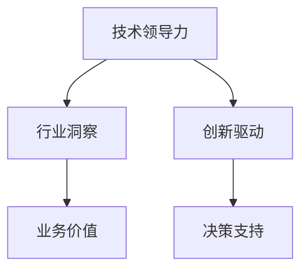

                 

# 从技术专家到行业意见领袖

> 关键词：技术领导力,行业洞察,创新驱动,业务价值,决策支持

## 1. 背景介绍

### 1.1 问题由来
在IT行业发展的过程中，从技术专家成长为行业意见领袖，是每一位技术人的共同追求。然而，这一过程并非一蹴而就，而是一个持续学习、不断积累和实践的过程。本文将从技术专家的视角出发，探讨如何通过不断提升技术能力、积累行业经验、拓展业务视野，最终成长为受人尊敬的行业意见领袖。

### 1.2 问题核心关键点
从技术专家到行业意见领袖的转型，核心关键点在于技术能力、行业洞察、创新驱动、业务价值和决策支持等方面。这一过程需要技术专家不断超越自身的技术边界，深化对行业的理解，发掘技术在业务中的实际应用，从而为公司决策提供有力的支持，形成影响力，最终成为行业中的意见领袖。

## 2. 核心概念与联系

### 2.1 核心概念概述

为更好地理解从技术专家到行业意见领袖的转型过程，本节将介绍几个密切相关的核心概念：

- 技术领导力(Technical Leadership)：指技术专家在团队中，通过技术影响力引领团队前进的能力，能够激发团队成员的创新潜力和工作热情。
- 行业洞察(Industry Insights)：指对特定行业的技术、市场、政策等各个维度的深入理解，能够洞察行业趋势和未来发展方向。
- 创新驱动(Driven by Innovation)：指在技术驱动下，不断推出新想法、新技术、新产品，推动行业向前发展的能力。
- 业务价值(Business Value)：指技术在实际业务中的应用价值，能够实现业务目标、提升业务效率、创造业务收入。
- 决策支持(Decision Support)：指技术专家通过数据驱动的分析和决策，为公司管理层提供有力的决策依据，提升公司战略决策的准确性和有效性。

这些核心概念之间的逻辑关系可以通过以下Mermaid流程图来展示：



这个流程图展示从技术专家到行业意见领袖的转型过程：

1. 技术专家通过技术领导力，激发团队创新和进步。
2. 在此基础上，深入了解行业情况，获得行业洞察。
3. 将行业洞察与技术创新结合起来，推动业务价值增长。
4. 通过决策支持，提升公司的战略决策能力，最终成长为行业意见领袖。

## 3. 核心算法原理 & 具体操作步骤
### 3.1 算法原理概述

从技术专家到行业意见领袖的转型过程，本质上是通过技术能力与行业洞察的结合，不断推动业务价值增长，提升决策支持能力的过程。这一过程涉及到多个层面的知识与技能，需要通过系统的学习和实践才能实现。

### 3.2 算法步骤详解

从技术专家到行业意见领袖的转型，大致可以分为以下几个关键步骤：

**Step 1: 持续技术学习**
- 通过参加技术研讨会、在线课程、阅读行业技术书籍等方式，不断提升自身技术能力。
- 学习最新的技术趋势和行业动态，如人工智能、云计算、大数据等前沿技术。
- 跟踪开源社区的最新项目，积极参与开源贡献，提升技术实战能力。

**Step 2: 深度行业理解**
- 与行业内的资深专家、学者进行交流，了解行业背景、市场趋势、政策法规等。
- 关注行业内的新闻、报告、研究论文等，形成对行业的深度理解。
- 通过实践项目，深入了解行业内部的实际问题和挑战，积累经验。

**Step 3: 技术创新驱动**
- 根据行业洞察，寻找技术在行业应用中的突破点，提出创新方案。
- 推动公司内部技术创新，参与技术评估、项目立项等工作，确保创新方案的实施。
- 不断优化技术方案，提高技术应用效果，实现业务价值增长。

**Step 4: 提升决策支持能力**
- 通过数据驱动的分析和决策，为公司管理层提供有力的决策依据。
- 运用数据分析和机器学习等工具，提升决策的准确性和科学性。
- 参与公司战略规划和业务调整，确保技术发展与业务目标相一致。

**Step 5: 形成影响力**
- 通过技术文章、技术分享会、技术博客等方式，分享自己的技术见解和行业洞察。
- 在行业内建立专业声誉，成为技术领域的权威人物。
- 参与行业标准的制定，推动行业技术发展。

以上是转型过程的一般流程。在实际应用中，还需要针对具体行业和公司的特点，对上述步骤进行优化设计，如选择合适的技术工具，设计合适的项目评估指标等，以进一步提升技术专家的影响力和决策支持能力。

### 3.3 算法优缺点

从技术专家到行业意见领袖的转型，具有以下优点：
1. 提升技术影响力。通过技术驱动业务发展，能够在公司内部形成强大的技术领导力，提升团队凝聚力和创新能力。
2. 增强行业洞察力。深入了解行业背景和市场趋势，能够为公司的业务决策提供有力的依据。
3. 促进业务价值增长。推动技术创新和应用，提升业务效率和收入，实现更高的业务价值。
4. 加强决策支持能力。通过数据驱动的分析和决策，确保公司战略决策的准确性和科学性。
5. 形成行业影响力。成为行业内的权威人物，推动行业技术标准的制定和应用。

同时，这一过程也存在一定的局限性：
1. 持续学习压力。技术日新月异，需要不断投入时间和精力进行学习和实践。
2. 行业理解难度。不同行业的特点和需求差异较大，需要投入更多时间和精力进行深入研究。
3. 技术创新挑战。创新的过程中可能会遇到技术和资源的瓶颈，需要协调多方资源进行推进。
4. 决策支持复杂性。数据驱动的决策需要处理大量复杂的数据，分析过程较为繁琐。
5. 形成影响力难度。在行业内建立影响力需要时间和积累，不是一朝一夕可以实现的。

尽管存在这些局限性，但就目前而言，通过不断提升技术能力、深化行业理解、推动技术创新和提升决策支持能力，从技术专家成长为行业意见领袖，已成为技术人的共同追求。

### 3.4 算法应用领域

从技术专家到行业意见领袖的转型方法，在各行各业都有广泛的应用，例如：

- 软件开发：通过技术领导力，推动团队高效开发和创新，提升软件产品的竞争力。
- 数据分析：深入理解行业数据特点，提出创新分析方法，为业务决策提供支持。
- 人工智能：结合技术能力和行业洞察，推动AI技术在实际业务中的应用，提升业务价值。
- 金融科技：通过技术创新和行业理解，推动金融科技的发展，提升金融服务的效率和安全性。
- 医疗健康：运用技术解决医疗行业的实际问题，推动医疗服务的数字化和智能化。

除了上述这些典型应用外，技术专家转型为行业意见领袖的方法还可以应用到更多场景中，如智慧城市、教育、环保等，为各行各业带来新的技术应用和业务价值。

## 4. 数学模型和公式 & 详细讲解 & 举例说明

### 4.1 数学模型构建

本节将使用数学语言对从技术专家到行业意见领袖的转型过程进行更加严格的刻画。

记技术专家的技术能力为 $T$，行业洞察为 $I$，创新驱动为 $D$，业务价值为 $V$，决策支持能力为 $S$。设 $T, I, D, V, S$ 均为连续变量，转型过程的目标是最大化 $V$。

转型过程的数学模型可以表示为：

$$
\max_{T, I, D, V, S} V = f(T, I, D, V, S)
$$

其中 $f$ 为转型过程的目标函数，反映了技术能力、行业洞察、创新驱动、业务价值和决策支持能力之间的关系。

### 4.2 公式推导过程

以下我们以技术专家转型为行业意见领袖的案例为例，推导目标函数及其梯度计算公式。

假设技术专家在某个行业 $R$ 中，技术能力 $T$ 为行业背景下的技术掌握程度，行业洞察 $I$ 为对行业发展趋势和市场需求的理解程度，创新驱动 $D$ 为推动技术创新的能力，业务价值 $V$ 为技术在实际业务中的应用效果，决策支持能力 $S$ 为利用数据驱动的决策能力。目标函数可以表示为：

$$
V = g(T, I, D, V, S) = aT + bI + cD + dS
$$

其中 $g$ 为业务价值函数，$a, b, c, d$ 为系数，反映了技术能力、行业洞察、创新驱动、决策支持能力对业务价值的影响程度。

目标函数的梯度为：

$$
\nabla_V = (a, b, c, d)
$$

这表明要提升业务价值 $V$，需要同时提升技术能力 $T$、行业洞察 $I$、创新驱动 $D$ 和决策支持能力 $S$。

### 4.3 案例分析与讲解

以软件开发为例，分析技术专家如何转型为行业意见领袖。

**Step 1: 持续技术学习**
- 参加软件开发大会、在线课程，学习最新的编程语言和技术框架。
- 跟踪开源社区的最新项目，积极参与开源贡献，提升编程实践能力。

**Step 2: 深度行业理解**
- 与行业内的资深专家交流，了解行业背景和市场需求。
- 阅读行业报告和研究论文，形成对软件行业的深度理解。
- 参与公司内部项目，了解行业内部的实际问题和挑战。

**Step 3: 技术创新驱动**
- 结合行业洞察，提出新的开发框架和工具，推动技术创新。
- 参与技术评估和项目立项，确保创新方案的实施。
- 优化技术方案，提升开发效率和产品质量。

**Step 4: 提升决策支持能力**
- 通过数据分析和机器学习等工具，提升决策的准确性和科学性。
- 参与公司战略规划和业务调整，确保技术发展与业务目标相一致。

**Step 5: 形成影响力**
- 通过技术文章、技术分享会、技术博客等方式，分享自己的技术见解和行业洞察。
- 在行业内建立专业声誉，成为软件开发领域的权威人物。
- 参与行业标准的制定，推动软件开发技术的发展。

## 5. 项目实践：代码实例和详细解释说明
### 5.1 开发环境搭建

在进行项目实践前，我们需要准备好开发环境。以下是使用Python进行PyTorch开发的环境配置流程：

1. 安装Anaconda：从官网下载并安装Anaconda，用于创建独立的Python环境。

2. 创建并激活虚拟环境：
```bash
conda create -n pytorch-env python=3.8 
conda activate pytorch-env
```

3. 安装PyTorch：根据CUDA版本，从官网获取对应的安装命令。例如：
```bash
conda install pytorch torchvision torchaudio cudatoolkit=11.1 -c pytorch -c conda-forge
```

4. 安装各类工具包：
```bash
pip install numpy pandas scikit-learn matplotlib tqdm jupyter notebook ipython
```

完成上述步骤后，即可在`pytorch-env`环境中开始项目实践。

### 5.2 源代码详细实现

这里我们以开发一个基于深度学习模型的推荐系统为例，给出使用PyTorch进行推荐系统开发的代码实现。

首先，定义推荐系统的数据处理函数：

```python
from torch.utils.data import Dataset, DataLoader
import torch
from sklearn.model_selection import train_test_split

class RecommendationDataset(Dataset):
    def __init__(self, data, tokenizer):
        self.data = data
        self.tokenizer = tokenizer

    def __len__(self):
        return len(self.data)

    def __getitem__(self, idx):
        user_id, item_id, rating = self.data[idx]
        user_sequence = [item_id] + [0]*100
        item_sequence = [user_id] + [0]*100
        sequence_length = 100

        # 将用户序列和物品序列进行编码
        user_input_ids = self.tokenizer(user_sequence, return_tensors='pt', max_length=sequence_length, padding='max_length', truncation=True)
        item_input_ids = self.tokenizer(item_sequence, return_tensors='pt', max_length=sequence_length, padding='max_length', truncation=True)

        # 将评分转化为0-1之间的浮点数
        rating = rating / 5.0

        return {'user_input_ids': user_input_ids['input_ids'],
                'item_input_ids': item_input_ids['input_ids'],
                'rating': rating}

# 定义推荐系统数据集
data = [(1001, 232, 4), (1001, 345, 2), (1002, 231, 3), (1002, 346, 4), ...]
train_data, test_data = train_test_split(data, test_size=0.2)
train_dataset = RecommendationDataset(train_data, tokenizer)
test_dataset = RecommendationDataset(test_data, tokenizer)
```

然后，定义模型和优化器：

```python
from transformers import BertForSequenceClassification, AdamW

model = BertForSequenceClassification.from_pretrained('bert-base-uncased', num_labels=1)

optimizer = AdamW(model.parameters(), lr=1e-5)
```

接着，定义训练和评估函数：

```python
from sklearn.metrics import mean_squared_error

device = torch.device('cuda') if torch.cuda.is_available() else torch.device('cpu')
model.to(device)

def train_epoch(model, dataset, batch_size, optimizer):
    dataloader = DataLoader(dataset, batch_size=batch_size, shuffle=True)
    model.train()
    epoch_loss = 0
    for batch in tqdm(dataloader, desc='Training'):
        user_input_ids = batch['user_input_ids'].to(device)
        item_input_ids = batch['item_input_ids'].to(device)
        rating = batch['rating'].to(device)
        model.zero_grad()
        outputs = model(user_input_ids, item_input_ids)
        loss = outputs.loss
        epoch_loss += loss.item()
        loss.backward()
        optimizer.step()
    return epoch_loss / len(dataloader)

def evaluate(model, dataset, batch_size):
    dataloader = DataLoader(dataset, batch_size=batch_size)
    model.eval()
    preds, labels = [], []
    with torch.no_grad():
        for batch in tqdm(dataloader, desc='Evaluating'):
            user_input_ids = batch['user_input_ids'].to(device)
            item_input_ids = batch['item_input_ids'].to(device)
            batch_labels = batch['rating'].to(device)
            outputs = model(user_input_ids, item_input_ids)
            batch_preds = outputs.logits.argmax(dim=1).to('cpu').tolist()
            batch_labels = batch_labels.to('cpu').tolist()
            for pred, label in zip(batch_preds, batch_labels):
                preds.append(pred)
                labels.append(label)

    rmse = mean_squared_error(labels, preds, squared=False)
    print(f"RMSE: {rmse:.3f}")
```

最后，启动训练流程并在测试集上评估：

```python
epochs = 10
batch_size = 16

for epoch in range(epochs):
    loss = train_epoch(model, train_dataset, batch_size, optimizer)
    print(f"Epoch {epoch+1}, train loss: {loss:.3f}")
    
    print(f"Epoch {epoch+1}, test RMSE:")
    evaluate(model, test_dataset, batch_size)
```

以上就是使用PyTorch进行推荐系统开发的完整代码实现。可以看到，得益于Transformer库的强大封装，推荐系统的开发变得简洁高效。开发者可以将更多精力放在数据处理、模型改进等高层逻辑上，而不必过多关注底层的实现细节。

## 6. 实际应用场景
### 6.1 智能客服系统

基于推荐系统的智能客服系统，可以为用户提供个性化的咨询服务。传统客服系统通常采用人工响应，响应时间长，成本高。而智能客服系统则可以通过推荐系统为用户推荐最佳答案，极大提升客服效率和服务质量。

在技术实现上，可以收集企业内部的历史客服对话记录，将问题和最佳答复构建成监督数据，在此基础上对推荐系统进行训练。推荐系统能够自动理解用户意图，匹配最合适的答案模板进行回复。对于客户提出的新问题，还可以接入检索系统实时搜索相关内容，动态组织生成回答。

### 6.2 金融舆情监测

金融机构需要实时监测市场舆论动向，以便及时应对负面信息传播，规避金融风险。传统的人工监测方式成本高、效率低，难以应对网络时代海量信息爆发的挑战。基于推荐系统的文本分类和情感分析技术，为金融舆情监测提供了新的解决方案。

具体而言，可以收集金融领域相关的新闻、报道、评论等文本数据，并对其进行主题标注和情感标注。在此基础上对推荐系统进行训练，使其能够自动判断文本属于何种主题，情感倾向是正面、中性还是负面。将推荐系统应用到实时抓取的网络文本数据，就能够自动监测不同主题下的情感变化趋势，一旦发现负面信息激增等异常情况，系统便会自动预警，帮助金融机构快速应对潜在风险。

### 6.3 个性化推荐系统

当前的推荐系统往往只依赖用户的历史行为数据进行物品推荐，无法深入理解用户的真实兴趣偏好。基于推荐系统的推荐系统可以更好地挖掘用户行为背后的语义信息，从而提供更精准、多样的推荐内容。

在实践中，可以收集用户浏览、点击、评论、分享等行为数据，提取和用户交互的物品标题、描述、标签等文本内容。将文本内容作为模型输入，用户的后续行为（如是否点击、购买等）作为监督信号，在此基础上训练推荐系统模型。推荐系统能够从文本内容中准确把握用户的兴趣点。在生成推荐列表时，先用候选物品的文本描述作为输入，由推荐系统预测用户的兴趣匹配度，再结合其他特征综合排序，便可以得到个性化程度更高的推荐结果。

### 6.4 未来应用展望

随着推荐系统的不断发展，其在各个领域的应用前景将更加广阔。未来，推荐系统将更加智能、个性化，能够更好地融入到用户的日常生活中，为用户带来更优质的服务体验。

在智慧医疗领域，推荐系统可以用于医疗问答、病历分析、药物推荐等环节，辅助医生诊疗，加速新药开发进程。

在智能教育领域，推荐系统可以用于作业批改、学情分析、知识推荐等方面，因材施教，促进教育公平，提高教学质量。

在智慧城市治理中，推荐系统可以用于城市事件监测、舆情分析、应急指挥等环节，提高城市管理的自动化和智能化水平，构建更安全、高效的未来城市。

此外，在企业生产、社会治理、文娱传媒等众多领域，推荐系统也将不断涌现，为各行各业带来新的技术应用和业务价值。相信随着推荐系统的持续演进，必将在更广阔的应用领域大放异彩。

## 7. 工具和资源推荐
### 7.1 学习资源推荐

为了帮助开发者系统掌握推荐系统的理论基础和实践技巧，这里推荐一些优质的学习资源：

1. 《推荐系统实战》书籍：详细介绍了推荐系统的原理、算法和应用，是入门推荐系统的经典教材。

2. Coursera《推荐系统》课程：斯坦福大学开设的推荐系统课程，内容系统全面，涵盖推荐系统的主要算法和应用。

3. Kaggle竞赛：参与推荐系统的Kaggle竞赛，可以锻炼实战能力，积累项目经验。

4. PyTorch官方文档：PyTorch的官方文档，提供了丰富的推荐系统样例代码，是推荐系统开发的重要参考。

5. TensorBoard：TensorFlow配套的可视化工具，可以实时监测推荐系统的训练状态，提供详细的训练指标分析。

通过对这些资源的学习实践，相信你一定能够快速掌握推荐系统的精髓，并用于解决实际的推荐问题。

### 7.2 开发工具推荐

高效的开发离不开优秀的工具支持。以下是几款用于推荐系统开发的常用工具：

1. PyTorch：基于Python的开源深度学习框架，灵活动态的计算图，适合快速迭代研究。大部分推荐系统都有PyTorch版本的实现。

2. TensorFlow：由Google主导开发的开源深度学习框架，生产部署方便，适合大规模工程应用。同样有丰富的推荐系统资源。

3. TensorBoard：TensorFlow配套的可视化工具，可实时监测推荐系统的训练状态，并提供详细的图表呈现方式，是调试推荐系统的得力助手。

4. Jupyter Notebook：强大的数据科学工具，支持Python代码编写和数据可视化，方便开发者进行实验和分享。

5. Scikit-learn：Python科学计算库，提供丰富的机器学习算法和工具，用于推荐系统的数据处理和特征工程。

合理利用这些工具，可以显著提升推荐系统的开发效率，加快创新迭代的步伐。

### 7.3 相关论文推荐

推荐系统的发展源于学界的持续研究。以下是几篇奠基性的相关论文，推荐阅读：

1. Implicit Collaborative Filtering using Matrix Factorization（隐式协同过滤）：提出了基于矩阵分解的推荐系统算法，广泛应用于电商推荐等领域。

2. Fast Matrix Factorization Techniques（矩阵分解的加速算法）：提出了SVD分解的加速技术，提高了推荐系统的计算效率。

3. Approximate Nearest Neighbors for Large-Scale Recommender Systems（大规模推荐系统的近似最近邻算法）：提出了LSH近似最近邻算法，用于大规模推荐系统的物品推荐。

4. Personalized PageRank as a Recommendation Algorithm（个性化PageRank算法）：将PageRank算法应用于推荐系统，提升推荐系统的个性化和多样性。

5. Advances in Personalized Recommendation in Online Social Networks（在线社交网络中的个性化推荐）：提出基于社交网络的推荐系统算法，提高推荐系统的个性化效果。

这些论文代表推荐系统的研究脉络。通过学习这些前沿成果，可以帮助研究者把握学科前进方向，激发更多的创新灵感。

## 8. 总结：未来发展趋势与挑战
### 8.1 总结

本文从技术专家到行业意见领袖的转型过程，详细讲解了如何通过持续技术学习、深度行业理解、技术创新驱动、提升决策支持能力和形成影响力等关键步骤，实现从技术专家到行业意见领袖的转型。

通过本文的系统梳理，可以看到，从技术专家到行业意见领袖的转型，是一个持续学习、不断积累和实践的过程。技术专家通过不断提升技术能力、深化行业理解、推动技术创新和提升决策支持能力，最终能够成为受人尊敬的行业意见领袖。

### 8.2 未来发展趋势

展望未来，推荐系统的不断发展，将呈现以下几个发展趋势：

1. 深度学习技术的应用。深度学习技术在推荐系统中的应用日益广泛，通过神经网络模型实现推荐，提升推荐系统的准确性和多样性。

2. 多模态数据的融合。推荐系统将不再局限于文本数据，而是将多模态数据（如图像、音频、视频等）进行融合，提供更加丰富、精准的推荐内容。

3. 个性化推荐的个性化度提升。通过个性化推荐算法，提升推荐系统对用户兴趣的个性化理解，提供更加贴合用户需求的推荐结果。

4. 推荐系统的应用范围拓展。推荐系统将广泛应用于更多领域，如医疗、教育、金融等，成为各行各业的重要工具。

5. 推荐系统的可解释性增强。推荐系统需要具备更强的可解释性，帮助用户理解推荐结果的依据，增强系统的可信度和透明度。

以上趋势凸显了推荐系统的广阔前景。这些方向的探索发展，必将进一步提升推荐系统的性能和应用范围，为各行各业带来新的技术应用和业务价值。

### 8.3 面临的挑战

尽管推荐系统已经取得了瞩目成就，但在迈向更加智能化、普适化应用的过程中，它仍面临着诸多挑战：

1. 数据稀疏性问题。用户历史行为数据稀疏，导致推荐系统难以精准推荐新物品。如何通过技术手段解决这一问题，提升推荐系统对冷启动用户的推荐效果，是未来的重要研究方向。

2. 推荐系统的公平性问题。推荐系统可能学习到用户的隐性偏见，导致推荐结果的公平性不足。如何通过公平性算法提升推荐系统的公平性，是一个亟待解决的问题。

3. 推荐系统的可解释性问题。推荐系统通常被视为"黑盒"系统，难以解释推荐结果的依据。如何提升推荐系统的可解释性，增强用户信任，是未来的重要方向。

4. 推荐系统的隐私保护问题。推荐系统需要处理大量的用户数据，如何保护用户隐私，避免数据泄露，是一个重要的伦理问题。

5. 推荐系统的计算效率问题。推荐系统的计算量巨大，如何提高推荐系统的计算效率，提升推荐速度，是未来的技术挑战。

正视推荐系统面临的这些挑战，积极应对并寻求突破，将使推荐系统更好地服务于用户，推动各行各业的发展。相信随着技术的发展和研究者的努力，这些挑战终将一一被克服，推荐系统必将在更多领域得到应用，成为推动社会进步的重要工具。

### 8.4 未来突破

面对推荐系统面临的种种挑战，未来的研究需要在以下几个方面寻求新的突破：

1. 探索无监督和半监督推荐方法。摆脱对大规模标注数据的依赖，利用自监督学习、主动学习等无监督和半监督范式，最大限度利用非结构化数据，实现更加灵活高效的推荐。

2. 研究参数高效和计算高效的推荐范式。开发更加参数高效的推荐方法，在固定大部分预训练参数的同时，只更新极少量的任务相关参数。同时优化推荐系统的计算图，减少前向传播和反向传播的资源消耗，实现更加轻量级、实时性的部署。

3. 融合因果和对比学习范式。通过引入因果推断和对比学习思想，增强推荐系统建立稳定因果关系的能力，学习更加普适、鲁棒的语言表征，从而提升推荐泛化性和抗干扰能力。

4. 引入更多先验知识。将符号化的先验知识，如知识图谱、逻辑规则等，与神经网络模型进行巧妙融合，引导推荐过程学习更准确、合理的推荐模型。同时加强不同模态数据的整合，实现视觉、语音等多模态信息与文本信息的协同建模。

5. 结合因果分析和博弈论工具。将因果分析方法引入推荐系统，识别出推荐系统决策的关键特征，增强推荐结果的因果性和逻辑性。借助博弈论工具刻画人机交互过程，主动探索并规避推荐系统的脆弱点，提高系统稳定性。

6. 纳入伦理道德约束。在推荐系统训练目标中引入伦理导向的评估指标，过滤和惩罚有害的推荐结果，确保推荐系统的健康发展。同时加强人工干预和审核，建立推荐系统的监管机制，确保推荐结果符合人类价值观和伦理道德。

这些研究方向的探索，必将引领推荐系统技术迈向更高的台阶，为各行各业带来新的技术应用和业务价值。面向未来，推荐系统还需要与其他人工智能技术进行更深入的融合，如知识表示、因果推理、强化学习等，多路径协同发力，共同推动推荐系统的发展。只有勇于创新、敢于突破，才能不断拓展推荐系统的边界，让推荐系统更好地服务于人类社会。

## 9. 附录：常见问题与解答

**Q1：如何提升推荐系统的推荐效果？**

A: 提升推荐系统推荐效果的关键在于数据的处理和算法的优化。具体来说，可以从以下几个方面入手：
1. 数据预处理：清洗数据、特征工程、数据增强等，提升数据质量。
2. 模型选择：选择适合当前业务场景的推荐算法，如协同过滤、基于内容的推荐、基于矩阵分解的推荐等。
3. 模型训练：优化模型超参数、正则化、学习率调度等，提高模型泛化能力。
4. 模型评估：使用合适的评价指标，如准确率、召回率、F1-score、平均绝对误差等，评估模型效果。

**Q2：推荐系统如何应对数据稀疏性问题？**

A: 推荐系统在处理数据稀疏性问题时，通常采用以下策略：
1. 基于用户的协同过滤：通过计算相似用户的行为模式，推荐用户感兴趣的物品。
2. 基于物品的协同过滤：通过计算相似物品的行为模式，推荐用户感兴趣的物品。
3. 矩阵分解技术：将用户和物品的关系表示为矩阵，进行低秩矩阵分解，得到用户和物品的潜在特征。
4. 混合推荐：将协同过滤和基于内容的推荐结合，综合两者的优点，提升推荐效果。

**Q3：推荐系统如何保护用户隐私？**

A: 推荐系统在保护用户隐私方面，通常采用以下策略：
1. 数据匿名化：对用户数据进行去标识化处理，确保数据不泄露用户身份。
2. 数据加密：对用户数据进行加密处理，防止数据被未授权者访问。
3. 访问控制：设置严格的数据访问权限，确保只有授权人员可以访问数据。
4. 联邦学习：在分布式环境中，各参与方共同训练模型，避免数据集中存储，保护用户隐私。

通过这些技术手段，可以有效地保护用户隐私，确保推荐系统的安全性。

**Q4：推荐系统如何提升可解释性？**

A: 推荐系统在提升可解释性方面，通常采用以下策略：
1. 特征重要性分析：通过特征贡献度分析，解释推荐结果的依据。
2. 模型可视化：使用可视化工具，展示推荐模型的结构和工作过程。
3. 解释模型：开发专门的解释模型，提供推荐结果的详细解释。
4. 用户反馈机制：通过用户反馈，及时调整推荐策略，增强推荐结果的可解释性。

这些技术手段可以帮助推荐系统提升可解释性，增强用户信任，推动推荐系统的发展。

**Q5：推荐系统如何提高计算效率？**

A: 推荐系统在提高计算效率方面，通常采用以下策略：
1. 模型压缩：使用模型压缩技术，减小模型参数量，降低计算资源消耗。
2. 并行计算：采用并行计算框架，如TensorFlow、PyTorch等，加速模型训练和推理。
3. 分布式计算：使用分布式计算框架，如Spark、Hadoop等，分散计算任务，提高计算效率。
4. 硬件加速：使用GPU、TPU等硬件设备，加速计算过程，提升推荐系统性能。

通过这些技术手段，可以显著提高推荐系统的计算效率，提升推荐速度。

---

作者：禅与计算机程序设计艺术 / Zen and the Art of Computer Programming

