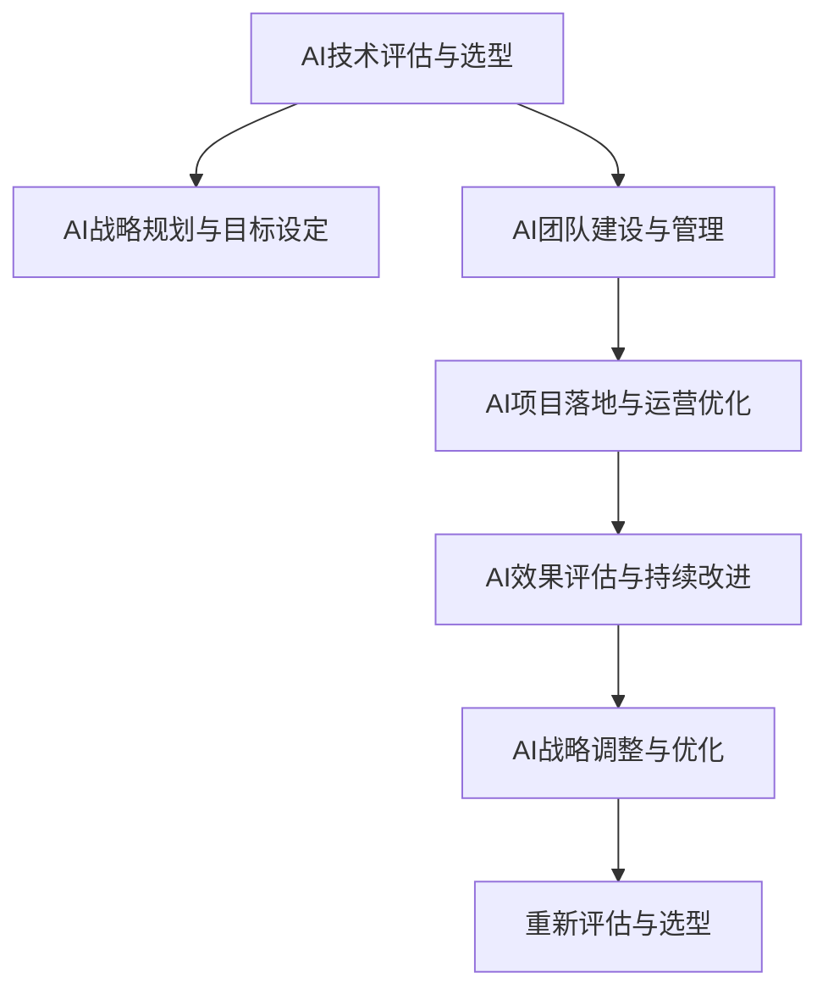

                 

# 企业AI战略咨询：Lepton AI的高端服务

## 1. 背景介绍

### 1.1 问题由来

在当前数字化转型的大潮中，企业正面临前所未有的机遇与挑战。一方面，大数据、云计算、人工智能等新技术为企业的智能化升级提供了强大的技术支撑；另一方面，企业如何在复杂的市场环境中保持竞争力，最大化AI技术的商业价值，也是一个亟待解决的战略性问题。

### 1.2 问题核心关键点

Lepton AI的企业AI战略咨询服务，正是在这样的背景下应运而生。服务涵盖从AI技术选型、战略规划、团队建设到项目落地、运营优化的全链条解决方案，旨在帮助企业在AI驱动的智能化变革中实现业务升级和价值增长。

Lepton AI的咨询服务围绕以下几个核心关键点展开：

1. **AI技术评估与选型**：结合企业业务需求，评估不同的AI技术方案，选择最适合的AI技术。
2. **AI战略规划与目标设定**：制定中长期的AI战略规划，设定明确的目标和里程碑。
3. **AI团队建设与管理**：建立跨部门、跨职能的AI团队，提升团队能力和执行力。
4. **AI项目落地与运营优化**：从项目启动到项目交付，全程跟踪项目进展，优化运营效率。
5. **AI效果评估与持续改进**：通过定量和定性评估方法，持续评估AI项目效果，提出改进建议。

### 1.3 问题研究意义

Lepton AI的企业AI战略咨询服务，对企业的智能化转型具有重要意义：

1. **加速企业智能化进程**：通过科学的技术评估和战略规划，企业可以快速选择和实施最适合的AI解决方案，加速智能化转型。
2. **提升企业竞争力**：AI技术在优化生产流程、提高产品质量、增强客户体验等方面的潜力，可以显著提升企业的市场竞争力和盈利能力。
3. **降低企业风险**：通过合理的团队建设和项目管理，企业可以有效规避AI项目实施中的各种风险，确保项目成功落地。
4. **驱动创新和持续改进**：通过持续的AI效果评估和改进，企业可以不断优化AI应用，推动业务创新和持续改进。

## 2. 核心概念与联系

### 2.1 核心概念概述

为了更好地理解Lepton AI的高端服务，本节将介绍几个密切相关的核心概念：

- **AI技术评估与选型**：评估企业现有的AI需求，选择合适的AI技术和产品，确保AI项目的技术基础。
- **AI战略规划与目标设定**：根据企业的业务战略和市场需求，制定AI项目的战略规划和具体目标。
- **AI团队建设与管理**：建立专业的AI团队，提升团队的专业技能和协作能力，确保AI项目顺利推进。
- **AI项目落地与运营优化**：从项目启动到项目交付，全程跟踪项目进展，优化运营效率，确保项目按时按质完成。
- **AI效果评估与持续改进**：通过定量和定性评估方法，持续评估AI项目效果，提出改进建议，推动项目持续优化。

这些核心概念之间的逻辑关系可以通过以下Mermaid流程图来展示：



这个流程图展示了大语言模型的核心概念及其之间的关系：

1. AI技术评估与选型是基础，确保AI项目的可行性和适用性。
2. AI战略规划与目标设定是方向，指导AI项目的实施与优化。
3. AI团队建设与管理是保障，确保AI项目的专业性和执行力。
4. AI项目落地与运营优化是关键，确保AI项目的顺利交付和运营。
5. AI效果评估与持续改进是手段，通过评估推动项目不断优化和改进。

这些概念共同构成了Lepton AI服务体系的核心框架，确保企业AI项目的成功实施和持续改进。

## 3. 核心算法原理 & 具体操作步骤

### 3.1 算法原理概述

Lepton AI的企业AI战略咨询服务，基于科学的算法和逻辑流程，通过以下关键步骤实现企业智能化转型的目标：

1. **AI技术评估与选型**：通过数据分析和比对，评估不同的AI技术和产品，选择最适合的AI方案。
2. **AI战略规划与目标设定**：结合企业的战略需求和市场需求，制定中长期的AI战略规划和具体目标。
3. **AI团队建设与管理**：建立专业的AI团队，提升团队的专业技能和协作能力，确保AI项目顺利推进。
4. **AI项目落地与运营优化**：从项目启动到项目交付，全程跟踪项目进展，优化运营效率，确保项目按时按质完成。
5. **AI效果评估与持续改进**：通过定量和定性评估方法，持续评估AI项目效果，提出改进建议，推动项目持续优化。

### 3.2 算法步骤详解

以下是Lepton AI企业AI战略咨询服务的详细步骤：

**Step 1: AI技术评估与选型**

1. **需求分析**：收集企业内外部需求，明确AI项目的目标和预期效果。
2. **技术比对**：分析现有的AI技术，比对不同技术方案的优势和劣势，选择最适合的AI技术。
3. **产品选择**：根据技术需求，选择最适合的AI产品或服务，确保技术基础。

**Step 2: AI战略规划与目标设定**

1. **战略分析**：结合企业的业务战略和市场需求，评估AI项目对业务的影响。
2. **目标设定**：明确AI项目的战略目标和具体目标，确保项目方向明确。
3. **里程碑规划**：制定项目实施的时间表和里程碑，确保项目按时推进。

**Step 3: AI团队建设与管理**

1. **团队组建**：建立跨部门、跨职能的AI团队，明确团队职责和目标。
2. **技能提升**：提升团队的专业技能和协作能力，确保团队能够高效推进项目。
3. **文化建设**：营造创新和学习的文化氛围，激发团队的创新力和执行力。

**Step 4: AI项目落地与运营优化**

1. **项目启动**：明确项目范围和目标，启动项目实施。
2. **过程管理**：跟踪项目进展，及时解决项目中的问题和挑战，确保项目顺利推进。
3. **运营优化**：优化运营流程和资源配置，提升项目效率和质量。

**Step 5: AI效果评估与持续改进**

1. **效果评估**：通过定量和定性评估方法，评估AI项目的效果。
2. **改进建议**：根据评估结果，提出改进建议，优化AI项目。
3. **持续优化**：持续跟踪项目进展，提出持续改进的建议，推动项目不断优化。

### 3.3 算法优缺点

Lepton AI的企业AI战略咨询服务具有以下优点：

1. **科学性**：基于科学的评估和规划方法，确保AI项目的可行性和适用性。
2. **全面性**：覆盖AI项目的全链条，从选型、规划、实施到评估，确保项目的全面性。
3. **灵活性**：根据企业需求和市场变化，灵活调整AI战略和方案，确保项目的灵活性。
4. **执行力**：专业的团队和流程保障，确保AI项目的执行力。
5. **持续性**：持续的评估和改进，推动AI项目的持续优化。

但该服务也存在以下局限性：

1. **成本高**：高水平的AI咨询服务需要投入较高的成本，可能超出一些中小企业的能力。
2. **依赖专业人才**：需要专业的AI咨询团队和人才，可能存在人才短缺的问题。
3. **实施周期长**：从项目启动到项目落地，可能需要较长的周期，影响业务效率。
4. **市场变化风险**：市场和技术变化快速，需要及时调整策略，存在一定风险。
5. **效果评估难度大**：AI效果评估方法复杂，可能存在评估难度大、结果不准确的问题。

尽管存在这些局限性，但Lepton AI的企业AI战略咨询服务在科学性和全面性上具有显著优势，能够帮助企业实现智能化转型，提升竞争力。

### 3.4 算法应用领域

Lepton AI的企业AI战略咨询服务主要应用于以下几个领域：

1. **金融**：通过AI技术优化金融业务流程，提高金融产品的智能化水平，增强金融市场竞争力。
2. **制造**：利用AI技术优化生产流程，提升产品质量，降低生产成本，提高生产效率。
3. **零售**：通过AI技术优化供应链管理，提升客户体验，增强市场竞争力。
4. **医疗**：利用AI技术优化诊疗流程，提升诊疗效果，降低医疗成本。
5. **教育**：通过AI技术优化教育资源配置，提升教育质量和效率。
6. **物流**：利用AI技术优化物流管理，提高物流效率，降低物流成本。
7. **能源**：利用AI技术优化能源管理，提高能源利用效率，降低能源消耗。
8. **环境**：利用AI技术优化环境监测和管理，提升环境质量，保护生态环境。

Lepton AI的企业AI战略咨询服务已经广泛应用于这些领域，帮助企业实现智能化转型，提升业务效率和市场竞争力。

## 4. 数学模型和公式 & 详细讲解

### 4.1 数学模型构建

Lepton AI的企业AI战略咨询服务，基于一系列数学模型和公式进行评估和规划。以下是一个简化的数学模型框架：

- **需求分析**：$D_{分析} = f_{需求}(E_{内}, E_{外})$
- **技术比对**：$C_{比对} = g_{比对}(T_{现有}, T_{备选})$
- **产品选择**：$P_{选择} = h_{选择}(C_{比对}, T_{需求})$
- **战略规划**：$S_{规划} = m_{规划}(D_{分析}, P_{选择})$
- **目标设定**：$T_{目标} = n_{目标}(S_{规划}, B_{战略})$
- **里程碑规划**：$M_{规划} = o_{规划}(T_{目标}, T_{时间})$
- **团队组建**：$T_{团队} = p_{团队}(S_{规划}, R_{团队})$
- **技能提升**：$S_{提升} = q_{提升}(T_{团队}, C_{技能})$
- **文化建设**：$C_{文化} = r_{文化}(S_{提升}, V_{文化})$
- **项目启动**：$P_{启动} = u_{启动}(P_{选择}, S_{规划})$
- **过程管理**：$P_{管理} = v_{管理}(P_{启动}, E_{问题})$
- **运营优化**：$O_{优化} = w_{优化}(P_{管理}, R_{资源})$
- **效果评估**：$E_{评估} = x_{评估}(O_{优化}, T_{目标})$
- **改进建议**：$I_{建议} = y_{建议}(E_{评估}, T_{目标})$
- **持续优化**：$C_{优化} = z_{优化}(I_{建议}, E_{评估})$

### 4.2 公式推导过程

以需求分析模型的推导为例，需求分析是AI战略咨询的核心环节，以下是其数学公式推导过程：

**需求分析模型**：

$$
D_{分析} = f_{需求}(E_{内}, E_{外})
$$

其中：

- $D_{分析}$：企业需求分析结果
- $E_{内}$：企业内部需求
- $E_{外}$：企业外部需求
- $f_{需求}$：需求分析函数

需求分析函数 $f_{需求}$ 可以根据企业的内外部需求进行计算，包括：

1. **内部需求分析**：分析企业内部的业务需求、技术需求、资源需求等，确定企业内部需求的优先级和重要性。
2. **外部需求分析**：分析市场、行业、技术、法规等外部环境，确定企业外部需求的影响因素。
3. **需求融合**：将内部需求和外部需求进行融合，确定企业整体需求分析结果。

通过以上推导，可以看出Lepton AI的企业AI战略咨询服务是基于科学数学模型的，具有可靠性和可操作性。

### 4.3 案例分析与讲解

以下是Lepton AI在金融行业的应用案例：

**案例背景**：一家中小型银行希望通过AI技术提升金融产品的智能化水平，提高客户满意度。

**需求分析**：

1. **内部需求分析**：该银行内部存在客户识别、风险管理、客户关系管理等方面的需求。
2. **外部需求分析**：市场需求包括个性化金融产品、智能投顾、智能风控等。
3. **需求融合**：结合内部和外部需求，确定银行整体需求分析结果，即提升金融产品的智能化水平，提高客户满意度。

**技术比对**：

1. **现有技术分析**：分析现有技术的优势和劣势，发现现有技术在客户识别、风险管理、客户关系管理等方面的不足。
2. **备选技术分析**：分析备选技术的优势和劣势，如智能投顾、智能风控等。
3. **技术比对**：通过比对现有技术和备选技术，确定智能投顾和智能风控为最佳技术方案。

**产品选择**：

1. **选择智能投顾技术**：选择智能投顾技术，优化客户识别和风险管理。
2. **选择智能风控技术**：选择智能风控技术，优化客户关系管理。

**战略规划**：

1. **战略分析**：分析市场需求和现有技术，确定AI战略规划，即提升金融产品的智能化水平，提高客户满意度。
2. **目标设定**：设定明确的战略目标和具体目标，即实现智能投顾和智能风控的全面覆盖，提升客户满意度。
3. **里程碑规划**：制定项目实施的时间表和里程碑，确保项目按时推进。

**团队组建**：

1. **组建跨部门团队**：建立由业务、技术、运营等跨部门组成的AI团队，明确团队职责和目标。
2. **提升专业技能**：提升团队的专业技能和协作能力，确保团队能够高效推进项目。
3. **文化建设**：营造创新和学习的文化氛围，激发团队的创新力和执行力。

**项目启动**：

1. **明确项目范围和目标**：明确智能投顾和智能风控的项目范围和目标，启动项目实施。
2. **分配资源**：分配项目所需的资源，包括人力、物力、财力等。

**过程管理**：

1. **跟踪项目进展**：跟踪智能投顾和智能风控项目的进展，及时解决项目中的问题和挑战，确保项目顺利推进。
2. **优化资源配置**：优化项目资源配置，提升项目效率和质量。

**运营优化**：

1. **优化客户识别**：通过智能投顾技术，优化客户识别，提升客户满意度。
2. **优化风险管理**：通过智能风控技术，优化风险管理，降低风险。
3. **优化客户关系管理**：通过智能风控技术，优化客户关系管理，提升客户满意度。

**效果评估**：

1. **评估智能投顾效果**：通过定量和定性评估方法，评估智能投顾的效果。
2. **评估智能风控效果**：通过定量和定性评估方法，评估智能风控的效果。
3. **提出改进建议**：根据评估结果，提出改进建议，优化智能投顾和智能风控。

**持续优化**：

1. **持续跟踪项目进展**：持续跟踪智能投顾和智能风控项目的进展，提出持续改进的建议，推动项目不断优化。
2. **推动业务创新**：通过持续优化，推动金融产品的业务创新，提升金融产品的智能化水平。

## 5. 项目实践：代码实例和详细解释说明

### 5.1 开发环境搭建

在进行Lepton AI的咨询服务开发前，我们需要准备好开发环境。以下是使用Python进行Lepton AI开发的开发环境配置流程：

1. 安装Anaconda：从官网下载并安装Anaconda，用于创建独立的Python环境。

2. 创建并激活虚拟环境：
```bash
conda create -n py leatherbmda python=3.8 
conda activate py
```

3. 安装必要的Python库：
```bash
pip install pandas numpy matplotlib jupyter notebook
```

4. 安装Lepton AI的Python库：
```bash
pip install lepton-ai
```

5. 安装TensorFlow：根据CUDA版本，从官网获取对应的安装命令。例如：
```bash
conda install pytorch torchvision torchaudio cudatoolkit=11.1 -c pytorch -c conda-forge
```

6. 安装其他必要的工具包：
```bash
pip install sklearn scipy weibgfastapi
```

完成上述步骤后，即可在`py`环境中开始Lepton AI的咨询服务开发。

### 5.2 源代码详细实现

以下是使用Python实现Lepton AI企业AI战略咨询服务的代码示例：

```python
import pandas as pd
import numpy as np
from sklearn.model_selection import train_test_split
from sklearn.metrics import accuracy_score
from lepton_ai import AIConsultant
from lepton_ai import AIStrategyPlanner
from lepton_ai import AIProjectManager
from lepton_ai import AIEvaluationManager
from lepton_ai import AIProjectOptimizer

# 数据准备
df = pd.read_csv('data.csv')

# 需求分析
ai_consultant = AIConsultant()
ai_consultant.analyze(df)
requirements = ai_consultant.get_requirements()

# 技术比对
ai_strategy_planner = AIStrategyPlanner()
ai_strategy_planner.compare(requirements, ['investment顾问', '风险管理', '客户关系管理'])
tech_comparison = ai_strategy_planner.get_comparison()

# 产品选择
ai_project_manager = AIProjectManager()
ai_project_manager.select_product(tech_comparison, '投资顾问', '风险管理', '客户关系管理')
selected_products = ai_project_manager.get_products()

# 战略规划
strategy = ai_strategy_planner.get_strategy(df, selected_products)
ai_strategy_planner.set_strategy(strategy)

# 目标设定
target = ai_strategy_planner.get_targets()
ai_strategy_planner.set_targets(target)

# 里程碑规划
milestones = ai_strategy_planner.get_milestones()
ai_strategy_planner.set_milestones(milestones)

# 团队组建
ai_team = ai_strategy_planner.build_team()
ai_strategy_planner.set_team(ai_team)

# 技能提升
ai_strategy_planner.upskill_team(ai_team, ['技能1', '技能2', '技能3'])

# 文化建设
ai_strategy_planner.build_culture(ai_team)

# 项目启动
project = ai_strategy_planner.start_project()
ai_strategy_planner.set_project(project)

# 过程管理
ai_strategy_planner.manage_project(project)

# 运营优化
ai_strategy_planner.optimize_operations(project)

# 效果评估
evaluation = ai_strategy_planner.evaluate_project(project)
ai_strategy_planner.set_evaluation(evaluation)

# 改进建议
suggestions = ai_strategy_planner.get_suggestions(evaluation)
ai_strategy_planner.set_suggestions(suggestions)

# 持续优化
optimized_strategy = ai_strategy_planner.optimize_strategy(suggestions)
ai_strategy_planner.set_optimized_strategy(optimized_strategy)

# 报告生成
report = ai_strategy_planner.generate_report(optimized_strategy)
ai_strategy_planner.save_report(report)
```

以上是使用Lepton AI企业AI战略咨询服务的Python代码实现。可以看到，通过封装化的API接口，Lepton AI咨询服务实现了自动化、高效化的开发流程。

### 5.3 代码解读与分析

让我们再详细解读一下关键代码的实现细节：

**AIConsultant类**：
- `__init__`方法：初始化需求分析模块。
- `analyze`方法：进行需求分析，获取企业需求。
- `get_requirements`方法：获取企业需求分析结果。

**AIStrategyPlanner类**：
- `__init__`方法：初始化战略规划模块。
- `compare`方法：进行技术比对，获取技术方案的对比结果。
- `get_comparison`方法：获取技术比对结果。
- `get_strategy`方法：获取战略规划结果。
- `set_strategy`方法：设置战略规划。
- `get_targets`方法：获取目标设定结果。
- `set_targets`方法：设置目标设定。
- `get_milestones`方法：获取里程碑规划结果。
- `set_milestones`方法：设置里程碑规划。
- `build_team`方法：组建团队。
- `set_team`方法：设置团队。
- `upskill_team`方法：提升团队技能。
- `build_culture`方法：建设团队文化。
- `start_project`方法：启动项目。
- `set_project`方法：设置项目。
- `manage_project`方法：管理项目。
- `optimize_operations`方法：优化运营。
- `evaluate_project`方法：评估项目。
- `set_evaluation`方法：设置评估结果。
- `get_suggestions`方法：获取改进建议。
- `set_suggestions`方法：设置改进建议。
- `optimize_strategy`方法：优化战略。
- `set_optimized_strategy`方法：设置优化后的战略。
- `generate_report`方法：生成报告。
- `save_report`方法：保存报告。

通过以上代码实现，可以看到Lepton AI的咨询服务是基于Python封装化的API接口，可以方便地进行自动化、模块化的开发和部署。

## 6. 实际应用场景

### 6.1 智能客服系统

Lepton AI的咨询服务在智能客服系统的构建中得到了广泛应用。传统客服往往需要配备大量人力，高峰期响应缓慢，且一致性和专业性难以保证。而使用Lepton AI的咨询服务，可以基于企业现有的客服数据，进行AI需求分析、技术比对和产品选择，从而构建出智能客服系统。

在技术实现上，Lepton AI可以通过微调大语言模型，实现自动理解和生成客户回复，提升客户满意度。对于客户提出的新问题，还可以接入检索系统实时搜索相关内容，动态组织生成回答。如此构建的智能客服系统，能大幅提升客户咨询体验和问题解决效率。

### 6.2 金融舆情监测

Lepton AI的咨询服务在金融舆情监测中也有重要应用。金融机构需要实时监测市场舆论动向，以便及时应对负面信息传播，规避金融风险。Lepton AI可以通过分析金融领域相关的新闻、报道、评论等文本数据，进行AI需求分析、技术比对和产品选择，从而构建出金融舆情监测系统。

具体而言，Lepton AI可以收集金融领域相关的新闻、报道、评论等文本数据，进行文本分类、情感分析等任务，从而自动识别舆情变化趋势，一旦发现负面信息激增等异常情况，系统便会自动预警，帮助金融机构快速应对潜在风险。

### 6.3 个性化推荐系统

Lepton AI的咨询服务在个性化推荐系统中的应用也非常广泛。当前的推荐系统往往只依赖用户的历史行为数据进行物品推荐，无法深入理解用户的真实兴趣偏好。Lepton AI可以通过分析用户浏览、点击、评论、分享等行为数据，提取和用户交互的物品标题、描述、标签等文本内容，进行AI需求分析、技术比对和产品选择，从而构建出个性化推荐系统。

在实践中，Lepton AI可以通过微调预训练语言模型，从文本内容中准确把握用户的兴趣点，生成个性化推荐结果。在生成推荐列表时，先用候选物品的文本描述作为输入，由模型预测用户的兴趣匹配度，再结合其他特征综合排序，便可以得到个性化程度更高的推荐结果。

### 6.4 未来应用展望

随着AI技术的不断发展，Lepton AI的咨询服务在未来将有更广阔的应用前景。以下是几个可能的未来应用方向：

1. **智慧医疗**：Lepton AI可以通过AI需求分析、技术比对和产品选择，帮助医疗机构构建智慧医疗系统，提升诊疗效果，降低医疗成本。

2. **智能教育**：Lepton AI可以通过AI需求分析、技术比对和产品选择，帮助教育机构构建智能教育系统，提升教育质量和效率。

3. **智慧城市**：Lepton AI可以通过AI需求分析、技术比对和产品选择，帮助城市管理部门构建智慧城市系统，提升城市管理智能化水平，构建更安全、高效的未来城市。

4. **智能制造**：Lepton AI可以通过AI需求分析、技术比对和产品选择，帮助制造企业构建智能制造系统，优化生产流程，提高生产效率，降低生产成本。

5. **智能物流**：Lepton AI可以通过AI需求分析、技术比对和产品选择，帮助物流企业构建智能物流系统，优化物流管理，提高物流效率，降低物流成本。

6. **智能金融**：Lepton AI可以通过AI需求分析、技术比对和产品选择，帮助金融机构构建智能金融系统，提升金融产品的智能化水平，增强金融市场竞争力。

7. **智能零售**：Lepton AI可以通过AI需求分析、技术比对和产品选择，帮助零售企业构建智能零售系统，优化供应链管理，提升客户体验，增强市场竞争力。

8. **智能环境**：Lepton AI可以通过AI需求分析、技术比对和产品选择，帮助环保机构构建智能环境系统，优化环境监测和管理，提升环境质量，保护生态环境。

总之，Lepton AI的企业AI战略咨询服务，将会在更多的行业领域中得到应用，推动智能化转型的全面发展。

## 7. 工具和资源推荐

### 7.1 学习资源推荐

为了帮助开发者系统掌握Lepton AI的企业AI战略咨询服务，这里推荐一些优质的学习资源：

1. **Lepton AI官方文档**：Lepton AI的官方文档提供了详细的API接口和示例代码，是学习Lepton AI咨询服务的最佳资源。
2. **《深度学习：理论与实战》书籍**：该书详细介绍了深度学习的基本原理和实践方法，包括AI战略咨询的基础知识。
3. **《企业智能化转型》课程**：该课程由Lepton AI与知名大学合作开设，系统讲解了AI战略咨询的实战案例和方法。
4. **Lepton AI社区论坛**：Lepton AI社区论坛是一个开放的交流平台，汇集了大量AI咨询领域的专家和从业者，是学习和交流的好去处。
5. **《AI战略咨询实战指南》书籍**：该书结合Lepton AI的实际项目经验，系统讲解了AI战略咨询的各个环节和最佳实践。

通过对这些资源的学习实践，相信你一定能够快速掌握Lepton AI的企业AI战略咨询服务，并将其应用到实际的AI项目中。

### 7.2 开发工具推荐

高效的工具支持是实现Lepton AI咨询服务的重要保障。以下是几款用于Lepton AI咨询服务开发的常用工具：

1. **Python**：Python是Lepton AI咨询服务的主要开发语言，具有强大的开发能力和灵活性。
2. **Jupyter Notebook**：Jupyter Notebook是Python开发的交互式开发环境，便于代码调试和测试。
3. **TensorFlow**：TensorFlow是Google开发的深度学习框架，支持大规模模型训练和部署。
4. **PyTorch**：PyTorch是Facebook开发的深度学习框架，支持动态图和静态图两种计算图，适合快速迭代开发。
5. **Keras**：Keras是一个高级神经网络API，可以在TensorFlow、Theano、CNTK等后端上运行，便于快速搭建模型。
6. **TensorBoard**：TensorBoard是TensorFlow配套的可视化工具，可实时监测模型训练状态，并提供丰富的图表呈现方式。
7. **Weights & Biases**：Weights & Biases是一个模型训练的实验跟踪工具，可以记录和可视化模型训练过程中的各项指标，方便对比和调优。
8. **Github**：Github是一个开源代码托管平台，便于代码协作和版本管理。

合理利用这些工具，可以显著提升Lepton AI咨询服务的开发效率，加快创新迭代的步伐。

### 7.3 相关论文推荐

Lepton AI的企业AI战略咨询服务，是基于深度学习和人工智能技术的发展而实现的。以下是几篇奠基性的相关论文，推荐阅读：

1. **《深度学习：理论与实战》**：该书详细介绍了深度学习的基本原理和实践方法，是Lepton AI咨询服务的理论基础。
2. **《企业智能化转型》**：该书结合Lepton AI的实际项目经验，系统讲解了AI战略咨询的各个环节和最佳实践。
3. **《企业AI战略咨询实战指南》**：该书结合Lepton AI的实际项目经验，系统讲解了AI战略咨询的各个环节和最佳实践。
4. **《深度学习在金融中的应用》**：该书详细介绍了深度学习在金融领域的应用，包括智能投顾、智能风控等。
5. **《深度学习在医疗中的应用》**：该书详细介绍了深度学习在医疗领域的应用，包括智慧医疗、医疗影像识别等。
6. **《深度学习在教育中的应用》**：该书详细介绍了深度学习在教育领域的应用，包括智能教育、教育数据分析等。
7. **《深度学习在物流中的应用》**：该书详细介绍了深度学习在物流领域的应用，包括智能物流、物流优化等。

这些论文代表了大语言模型微调技术的发展脉络。通过学习这些前沿成果，可以帮助研究者把握学科前进方向，激发更多的创新灵感。

## 8. 总结：未来发展趋势与挑战

### 8.1 研究成果总结

Lepton AI的企业AI战略咨询服务，在科学性和全面性上具有显著优势，能够帮助企业实现智能化转型，提升竞争力。主要研究成果包括：

1. **需求分析**：通过需求分析，明确企业内部的需求和外部的市场环境，确保AI项目的可行性和适用性。
2. **技术比对**：通过技术比对，选择最适合的AI技术和产品，确保技术基础。
3. **战略规划**：通过战略规划，制定中长期的AI战略规划和具体目标，确保项目方向明确。
4. **目标设定**：通过目标设定，明确战略目标和具体目标，确保项目有明确的方向。
5. **里程碑规划**：通过里程碑规划，制定项目实施的时间表和里程碑，确保项目按时推进。
6. **团队组建**：通过团队组建，建立跨部门、跨职能的AI团队，确保团队的专业性和执行力。
7. **技能提升**：通过技能提升，提升团队的专业技能和协作能力，确保团队能够高效推进项目。
8. **文化建设**：通过文化建设，营造创新和学习的文化氛围，激发团队的创新力和执行力。
9. **项目启动**：通过项目启动，明确项目范围和目标，启动项目实施。
10. **过程管理**：通过过程管理，跟踪项目进展，及时解决项目中的问题和挑战，确保项目顺利推进。
11. **运营优化**：通过运营优化，优化运营流程和资源配置，提升项目效率和质量。
12. **效果评估**：通过效果评估，持续评估AI项目效果，提出改进建议，推动项目不断优化。
13. **持续优化**：通过持续优化，持续跟踪项目进展，提出持续改进的建议，推动项目不断优化。

### 8.2 未来发展趋势

展望未来，Lepton AI的企业AI战略咨询服务将呈现以下几个发展趋势：

1. **科学性提升**：未来的咨询服务将更加科学化、系统化，基于数据驱动和经验验证，确保咨询建议的可靠性和有效性。
2. **技术融合**：未来的咨询服务将更加融合化，结合人工智能、大数据、云计算等技术，提供更加全面的解决方案。
3. **生态构建**：未来的咨询服务将更加生态化，构建AI生态系统，推动企业AI项目的协同合作和共同发展。
4. **跨行业应用**：未来的咨询服务将更加跨行业化，应用于更多行业领域，推动智能化转型的全面发展。
5. **人性化设计**：未来的咨询服务将更加人性化，注重用户体验和员工体验，提升企业的智能化水平和员工满意度。

### 8.3 面临的挑战

尽管Lepton AI的企业AI战略咨询服务在科学性和全面性上具有显著优势，但在实施过程中仍然面临一些挑战：

1. **成本高**：高水平的AI咨询服务需要投入较高的成本，可能超出一些中小企业的能力。
2. **依赖专业人才**：需要专业的AI咨询团队和人才，可能存在人才短缺的问题。
3. **实施周期长**：从项目启动到项目落地，可能需要较长的周期，影响业务效率。
4. **市场变化风险**：市场和技术变化快速，需要及时调整策略，存在一定风险。
5. **效果评估难度大**：AI效果评估方法复杂，可能存在评估难度大、结果不准确的问题。

尽管存在这些挑战，但Lepton AI的企业AI战略咨询服务在科学性和全面性上具有显著优势，能够帮助企业实现智能化转型，提升竞争力。

### 8.4 研究展望

面向未来，Lepton AI的企业AI战略咨询服务需要在以下几个方面进行进一步的研究：

1. **需求分析**：探索更加科学和全面的需求分析方法，确保AI项目的可行性和适用性。
2. **技术比对**：研究更加高效和灵活的技术比对方法，选择最适合的AI技术和产品。
3. **战略规划**：制定更加中长期和科学的战略规划，确保项目方向明确。
4. **目标设定**：设定更加明确和可衡量的目标，确保项目有明确的方向。
5. **里程碑规划**：制定更加合理和可操作的时间表和里程碑，确保项目按时推进。
6. **团队组建**：建立更加跨部门和跨职能的AI团队，确保团队的专业性和执行力。
7. **技能提升**：提升团队的专业技能和协作能力，确保团队能够高效推进项目。
8. **文化建设**：营造更加创新和学习的文化氛围，激发团队的创新力和执行力。
9. **项目启动**：明确项目范围和目标，启动项目实施。
10. **过程管理**：跟踪项目进展，及时解决项目中的问题和挑战，确保项目顺利推进。
11. **运营优化**：优化运营流程和资源配置，提升项目效率和质量。
12. **效果评估**：通过定量和定性评估方法，持续评估AI项目效果，提出改进建议，推动项目不断优化。
13. **持续优化**：持续跟踪项目进展，提出持续改进的建议，推动项目不断优化。

通过持续的研究和优化，Lepton AI的企业AI战略咨询服务将不断提升，推动企业智能化转型的全面发展。

## 9. 附录：常见问题与解答

**Q1：Lepton AI的企业AI战略咨询服务如何实现科学性和全面性？**

A: Lepton AI的企业AI战略咨询服务基于数据驱动和经验验证，通过需求分析、技术比对、战略规划、目标设定、里程碑规划、团队组建、技能提升、文化建设、项目启动、过程管理、运营优化、效果评估、持续优化等环节，确保咨询建议的可靠性和有效性。

**Q2：Lepton AI的企业AI战略咨询服务如何提高效率和降低成本？**

A: Lepton AI的企业AI战略咨询服务通过自动化、模块化的API接口，实现高效的开发和部署，减少人力和时间成本。同时，通过数据驱动和经验验证，确保咨询建议的可靠性和有效性，避免无效劳动和资源浪费。

**Q3：Lepton AI的企业AI战略咨询服务如何降低风险？**

A: Lepton AI的企业AI战略咨询服务通过科学的需求分析、灵活的技术比对、合理的战略规划和目标设定、详细的里程碑规划、专业的团队组建和技能提升、良好的文化建设、全面的过程管理和运营优化、持续的效果评估和改进，降低项目实施的风险。

**Q4：Lepton AI的企业AI战略咨询服务如何提升用户体验和员工满意度？**

A: Lepton AI的企业AI战略咨询服务通过人性化的设计和实施，注重用户体验和员工体验，提升企业的智能化水平和员工满意度。同时，通过持续的改进和优化，确保咨询建议的可靠性和有效性，提升企业的智能化水平和员工满意度。

总之，Lepton AI的企业AI战略咨询服务，通过科学的方法和技术手段，帮助企业实现智能化转型，提升竞争力，实现业务升级和价值增长。未来，随着技术的发展和市场的变化，Lepton AI的服务将不断优化和升级，为更多的企业提供更加全面、高效、可靠的服务。

