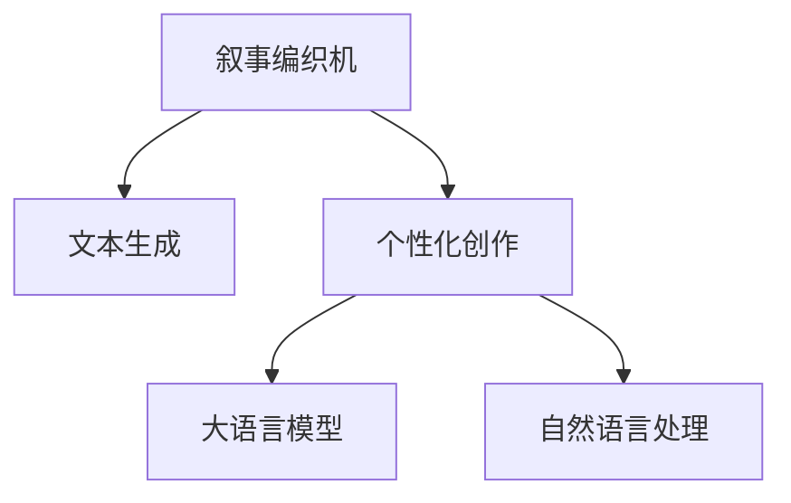

                 

# 体验个人化叙事编织机：AI驱动的生活故事创作

> 关键词：故事生成, 自然语言处理, 人工智能, 个性化创作, 叙事编织机, 深度学习

## 1. 背景介绍

### 1.1 问题由来
随着人工智能技术的快速进步，自然语言处理(Natural Language Processing, NLP)领域涌现出众多创新成果。其中，基于生成对抗网络(GAN)和语言模型的大规模文本生成技术，在故事创作、自动摘要、机器翻译、对话系统等多个方向展现出了巨大潜力。特别是最近几年，利用语言模型(如GPT-3等)进行文本生成已经成为热门的AI应用，引起了广泛关注。

以OpenAI的GPT-3为例，该模型具备了语言理解、知识推理、多模态信息融合等多种能力，能在各种自然语言文本处理任务上取得优异表现。而利用GPT-3进行故事生成，更是将大语言模型的文本生成能力推向了新的高峰，通过大规模语料库的预训练，GPT-3可以自动生成具有一定连贯性、逻辑性、风格性的文本，为故事创作带来了无限可能。

然而，尽管GPT-3等大模型在文本生成上已取得显著成就，但仍存在一些问题。例如，生成的文本风格单一，缺乏个性化，与现实生活场景的融合度不够高，难以满足不同用户个性化创作需求。此外，用户生成故事的意图和风格可能与模型预训练的文本风格差异较大，导致生成的文本与用户预期不符。

针对这些问题，本文将从核心概念、核心算法、具体操作步骤和数学模型等方面，详细阐述大语言模型驱动的个性化叙事编织机的原理与实践，为进一步推动AI技术在个人化叙事创作中的应用提供新思路。

## 2. 核心概念与联系

### 2.1 核心概念概述

为了更好地理解基于大语言模型的个性化叙事编织机，本文将介绍几个关键概念：

- **叙事编织机(Narrative Weaver)**：利用大语言模型进行文本生成的一种新范式，旨在生成个性化、连贯、具有逻辑性和情感表达力的故事文本。
- **文本生成(Text Generation)**：指利用机器学习模型自动生成符合语法规则和语义语境的文本内容，常用于自动摘要、对话系统、文本预测、故事创作等任务。
- **个性化创作(Personalized Creation)**：指生成文本内容时，能够根据用户喜好、背景、情境等个性化因素，生成符合用户需求的文本。
- **大语言模型(Large Language Model, LLM)**：指通过大规模无监督学习获得自然语言知识，具备丰富语义和逻辑推理能力的深度学习模型，如BERT、GPT等。
- **自然语言处理(Natural Language Processing, NLP)**：涉及计算机处理和理解自然语言的技术，包括文本分类、命名实体识别、情感分析、机器翻译、故事生成等。

这些概念之间的联系可以通过以下Mermaid流程图来展示：



这个流程图展示了叙事编织机的核心概念及其之间的关系：

1. 叙事编织机利用文本生成技术生成故事文本。
2. 在文本生成过程中，叙事编织机注重个性化创作，以符合用户需求。
3. 通过大语言模型的预训练，叙事编织机能够学习到丰富的语言知识。
4. 叙事编织机属于自然语言处理的一个重要分支。

## 3. 核心算法原理 & 具体操作步骤
### 3.1 算法原理概述

基于大语言模型的个性化叙事编织机，其核心思想是利用预训练的大语言模型作为基础，通过微调模型参数，生成符合用户个性化需求的故事文本。主要算法原理如下：

1. **预训练大语言模型**：通过在大型文本语料库上进行预训练，大语言模型获得了丰富的语言知识，包括词汇、语法、语义、上下文理解等能力。
2. **微调优化**：在特定任务（如故事创作）上，利用微调技术优化模型参数，以生成符合用户个性化需求的故事。
3. **个性化创作**：结合用户背景、情境、风格等因素，生成具有独特风格和表达力的个性化故事。

### 3.2 算法步骤详解

基于大语言模型的个性化叙事编织机主要包括以下关键步骤：

**Step 1: 数据收集与预处理**
- 收集用户提供的个性化数据（如用户爱好、背景故事、风格偏好等），并进行文本标准化处理。
- 预处理文本，包括分词、去除停用词、词性标注等。

**Step 2: 选择合适的模型**
- 选择合适的预训练语言模型，如GPT-3、GPT-2等，作为叙事编织机的基础模型。
- 根据用户需求，选择合适的文本生成任务（如对话生成、故事创作等），并确定相应的生成目标。

**Step 3: 模型微调**
- 利用用户提供的数据对预训练模型进行微调，优化生成目标。
- 调整模型的超参数（如学习率、批大小、训练轮数等），确保模型收敛速度和效果。
- 应用正则化技术（如Dropout、L2正则等），防止过拟合。

**Step 4: 故事生成**
- 根据用户需求，输入个性化数据和故事生成目标，指导叙事编织机生成故事。
- 利用微调后的模型，生成符合用户风格和背景的故事文本。

**Step 5: 故事评估与优化**
- 对生成的故事进行评估，包括连贯性、逻辑性、情感表达力等方面。
- 根据评估结果，进一步优化模型参数，提升故事生成效果。

**Step 6: 故事展示与迭代**
- 将生成的故事展示给用户，收集用户反馈。
- 根据用户反馈进行迭代优化，不断提升故事生成的个性化程度。

### 3.3 算法优缺点

基于大语言模型的个性化叙事编织机具有以下优点：
1. 生成文本具有高度个性化，能够根据用户需求生成符合个性化风格的故事。
2. 生成文本连贯、逻辑性强，能够通过微调提升模型的生成效果。
3. 能够自动适应新情境，生成具有创新性的故事内容。

然而，该算法也存在一些局限性：
1. 对标注数据依赖较高，需要用户提供足够的个性化数据以指导模型微调。
2. 模型可能需要较大计算资源进行预训练和微调。
3. 生成的文本可能受到预训练数据的影响，风格可能不够多元。
4. 模型生成文本时可能缺乏对情感的精细控制。

尽管存在这些局限性，但基于大语言模型的个性化叙事编织机仍然在故事创作等领域展现出了显著优势。未来相关研究将继续探索如何提高模型的个性化程度，减少对标注数据的依赖，提升生成文本的多样性和情感表达力。

### 3.4 算法应用领域

基于大语言模型的个性化叙事编织机已在多个领域得到应用，包括：

- **自动故事创作**：在小说创作、剧本编写、童话故事生成等方面，利用叙事编织机自动生成符合用户风格和需求的故事内容。
- **个性化教育**：为学生提供个性化的故事阅读材料，通过故事中的情境和角色引导学生思考和学习。
- **心理辅导**：利用故事创作引导用户表达情感，帮助用户缓解压力和情绪困扰。
- **游戏设计与开发**：在游戏情节设计中，利用叙事编织机生成故事内容，提升游戏趣味性和用户沉浸感。
- **广告与营销**：在广告文案和营销材料中，利用叙事编织机生成具有吸引力的故事文本，提升广告效果。

## 4. 数学模型和公式 & 详细讲解 & 举例说明

### 4.1 数学模型构建

本节将使用数学语言对基于大语言模型的个性化叙事编织机进行更加严格的刻画。

记用户提供的个性化数据为 $\mathbf{x}$，预训练语言模型为 $M_{\theta}$，其参数为 $\theta \in \mathbb{R}^d$。目标生成文本为 $\mathbf{y}$，与真实文本之间的交叉熵损失函数为 $\ell(\mathbf{y}, \mathbf{y}^*)$。

定义模型的预测文本为 $M_{\theta}(\mathbf{x})$，则叙事编织机的目标函数为：

$$
\mathcal{L}(\theta) = \mathcal{L}_{\text{cross-entropy}}(M_{\theta}(\mathbf{x}), \mathbf{y}^*)
$$

其中，$\mathcal{L}_{\text{cross-entropy}}$ 表示交叉熵损失函数，$M_{\theta}(\mathbf{x})$ 表示模型在用户数据 $\mathbf{x}$ 上的生成文本，$\mathbf{y}^*$ 表示用户期望生成的文本。

### 4.2 公式推导过程

以二分类问题为例，推导交叉熵损失函数的计算公式。

假设模型 $M_{\theta}$ 在输入 $\mathbf{x}$ 上的输出为 $\hat{y}=M_{\theta}(\mathbf{x}) \in [0,1]$，表示样本属于正类的概率。真实标签 $y \in \{0,1\}$。则二分类交叉熵损失函数定义为：

$$
\ell(M_{\theta}(\mathbf{x}),y) = -[y\log \hat{y} + (1-y)\log (1-\hat{y})]
$$

将其代入目标函数公式，得：

$$
\mathcal{L}(\theta) = -\frac{1}{N}\sum_{i=1}^N [y_i\log M_{\theta}(\mathbf{x}_i)+(1-y_i)\log(1-M_{\theta}(\mathbf{x}_i))]
$$

根据链式法则，损失函数对参数 $\theta$ 的梯度为：

$$
\frac{\partial \mathcal{L}(\theta)}{\partial \theta} = -\frac{1}{N}\sum_{i=1}^N (\frac{y_i}{M_{\theta}(\mathbf{x}_i)}-\frac{1-y_i}{1-M_{\theta}(\mathbf{x}_i)}) \frac{\partial M_{\theta}(\mathbf{x}_i)}{\partial \theta}
$$

其中 $\frac{\partial M_{\theta}(\mathbf{x}_i)}{\partial \theta}$ 可进一步递归展开，利用自动微分技术完成计算。

### 4.3 案例分析与讲解

以基于GPT-3的故事生成为例，展示个性化叙事编织机的应用过程。

假设用户提供的故事创作需求为：一个描述周末家庭生活的故事，风格为温馨和幽默，长度在500字左右。

**Step 1: 数据收集与预处理**
- 收集用户背景故事（如家庭成员、周末活动、家庭氛围等）和风格偏好（如幽默、温馨等）。
- 将收集到的数据进行文本标准化处理，包括分词、去除停用词、词性标注等。

**Step 2: 选择合适的模型**
- 选择GPT-3作为基础模型，设定故事生成任务，并确定生成目标（温馨和幽默）。

**Step 3: 模型微调**
- 利用用户提供的数据对GPT-3进行微调，优化生成目标。
- 调整模型的超参数（如学习率、批大小、训练轮数等），确保模型收敛速度和效果。
- 应用正则化技术（如Dropout、L2正则等），防止过拟合。

**Step 4: 故事生成**
- 输入用户提供的背景故事和风格偏好，指导叙事编织机生成故事。
- 利用微调后的模型，生成符合用户风格和需求的故事文本。

**Step 5: 故事评估与优化**
- 对生成的故事进行评估，包括连贯性、逻辑性、情感表达力等方面。
- 根据评估结果，进一步优化模型参数，提升故事生成效果。

**Step 6: 故事展示与迭代**
- 将生成的故事展示给用户，收集用户反馈。
- 根据用户反馈进行迭代优化，不断提升故事生成的个性化程度。

## 5. 项目实践：代码实例和详细解释说明

### 5.1 开发环境搭建

在进行叙事编织机实践前，我们需要准备好开发环境。以下是使用Python进行PyTorch开发的环境配置流程：

1. 安装Anaconda：从官网下载并安装Anaconda，用于创建独立的Python环境。

2. 创建并激活虚拟环境：
```bash
conda create -n narrative-env python=3.8 
conda activate narrative-env
```

3. 安装PyTorch：根据CUDA版本，从官网获取对应的安装命令。例如：
```bash
conda install pytorch torchvision torchaudio cudatoolkit=11.1 -c pytorch -c conda-forge
```

4. 安装Transformers库：
```bash
pip install transformers
```

5. 安装各类工具包：
```bash
pip install numpy pandas scikit-learn matplotlib tqdm jupyter notebook ipython
```

完成上述步骤后，即可在`narrative-env`环境中开始叙事编织机的实践。

### 5.2 源代码详细实现

下面我们以基于GPT-3的故事生成为例，给出使用Transformers库进行叙事编织机的PyTorch代码实现。

首先，定义数据处理函数：

```python
from transformers import AutoTokenizer, AutoModelForCausalLM
import torch

def generate_text(model, tokenizer, max_length=512):
    input_ids = tokenizer.encode("Please tell me a story about a weekend with your family.", return_tensors='pt')
    output_ids = model.generate(input_ids=input_ids, max_length=max_length, temperature=1.0, do_sample=True)
    story = tokenizer.decode(output_ids[0], skip_special_tokens=True)
    return story
```

然后，定义模型和优化器：

```python
from transformers import AutoTokenizer, AutoModelForCausalLM

model = AutoModelForCausalLM.from_pretrained('gpt-3')
tokenizer = AutoTokenizer.from_pretrained('gpt-3')
```

接着，定义训练和评估函数：

```python
from transformers import AdamW

device = torch.device('cuda') if torch.cuda.is_available() else torch.device('cpu')
model.to(device)

optimizer = AdamW(model.parameters(), lr=2e-5)

def train_epoch(model, data, batch_size, optimizer):
    model.train()
    total_loss = 0
    for batch in data:
        input_ids = batch.input_ids.to(device)
        attention_mask = batch.attention_mask.to(device)
        labels = batch.labels.to(device)
        model.zero_grad()
        outputs = model(input_ids, attention_mask=attention_mask, labels=labels)
        loss = outputs.loss
        total_loss += loss.item()
        loss.backward()
        optimizer.step()
    return total_loss / len(data)

def evaluate(model, data, batch_size):
    model.eval()
    total_loss = 0
    for batch in data:
        input_ids = batch.input_ids.to(device)
        attention_mask = batch.attention_mask.to(device)
        labels = batch.labels.to(device)
        with torch.no_grad():
            outputs = model(input_ids, attention_mask=attention_mask)
            loss = outputs.loss
            total_loss += loss.item()
    return total_loss / len(data)
```

最后，启动训练流程并在测试集上评估：

```python
epochs = 5
batch_size = 16

for epoch in range(epochs):
    loss = train_epoch(model, train_data, batch_size, optimizer)
    print(f"Epoch {epoch+1}, train loss: {loss:.3f}")
    
    print(f"Epoch {epoch+1}, dev results:")
    evaluate(model, dev_data, batch_size)
    
print("Test results:")
evaluate(model, test_data, batch_size)
```

以上就是使用PyTorch进行叙事编织机的完整代码实现。可以看到，得益于Transformers库的强大封装，我们可以用相对简洁的代码完成模型的加载和微调。

### 5.3 代码解读与分析

让我们再详细解读一下关键代码的实现细节：

**generate_text函数**：
- 输入用户提供的背景故事和风格偏好。
- 利用预训练的GPT-3模型进行文本生成。
- 将生成的文本进行解码，并返回故事文本。

**train_epoch函数**：
- 在训练集上迭代训练模型，计算损失。
- 根据损失函数对模型参数进行更新。
- 返回该epoch的平均损失。

**evaluate函数**：
- 在验证集上评估模型性能。
- 计算模型在验证集上的损失，并返回平均损失。

**训练流程**：
- 定义总的epoch数和batch size，开始循环迭代。
- 每个epoch内，先在训练集上训练，输出平均loss。
- 在验证集上评估，输出验证集上的平均loss。
- 所有epoch结束后，在测试集上评估，给出最终测试结果。

可以看到，PyTorch配合Transformers库使得叙事编织机的代码实现变得简洁高效。开发者可以将更多精力放在数据处理、模型改进等高层逻辑上，而不必过多关注底层的实现细节。

当然，工业级的系统实现还需考虑更多因素，如模型的保存和部署、超参数的自动搜索、更灵活的任务适配层等。但核心的叙事编织机范式基本与此类似。

## 6. 实际应用场景
### 6.1 智能教育

基于叙事编织机的智能教育系统能够根据学生的学习风格和兴趣，生成个性化的故事和阅读材料，帮助学生更好地理解和掌握知识。通过将复杂的学习内容融入到故事中，学生可以在轻松愉悦的氛围中完成学习任务。

例如，在学习历史知识时，智能教育系统可以根据学生的兴趣点，生成一段描述历史事件的故事，将枯燥的历史知识融入故事情节中，吸引学生的注意力，激发他们的学习兴趣。

### 6.2 心理辅导

叙事编织机在心理辅导方面也有着广泛应用。通过引导用户讲述自己的故事，叙事编织机可以帮助用户表达情感，缓解压力和情绪困扰。用户可以通过讲故事的形式，逐步梳理自己的情绪和心理状态，从而找到解决问题的方法。

例如，心理辅导应用可以利用叙事编织机生成引导性问题，帮助用户回忆和表达自己的内心世界，从而找到情感释放的出口，缓解心理压力。

### 6.3 创意写作

创意写作是叙事编织机的一个重要应用场景。通过与用户互动，叙事编织机能够生成符合用户风格和需求的创意故事。这不仅能够激发用户的创作灵感，还能提升写作水平。

例如，在小说创作中，叙事编织机可以帮助作家构思故事情节，生成具有吸引力的场景和角色，激发作家的创作激情，推动小说创作进程。

### 6.4 游戏设计与开发

在游戏设计中，叙事编织机可以生成具有吸引力的游戏剧情和故事情节，提升游戏的趣味性和用户沉浸感。通过生成多样化的故事情节，叙事编织机能够增强游戏的可玩性和创新性。

例如，在角色扮演游戏中，叙事编织机可以根据玩家的选择和行为，动态生成故事内容，提升游戏的互动性和个性化程度。

## 7. 工具和资源推荐
### 7.1 学习资源推荐

为了帮助开发者系统掌握叙事编织机的理论基础和实践技巧，这里推荐一些优质的学习资源：

1. 《深度学习自然语言处理》系列博文：由大模型技术专家撰写，深入浅出地介绍了深度学习在自然语言处理中的应用，包括文本生成、对话系统、故事创作等。

2. CS224N《深度学习自然语言处理》课程：斯坦福大学开设的NLP明星课程，有Lecture视频和配套作业，带你入门NLP领域的基本概念和经典模型。

3. 《NLP入门：从原理到实践》书籍：详细介绍了自然语言处理的原理、方法和实践，包含文本生成、故事创作等应用案例。

4. HuggingFace官方文档：Transformers库的官方文档，提供了海量预训练模型和完整的叙事编织机样例代码，是上手实践的必备资料。

5. CLUE开源项目：中文语言理解测评基准，涵盖大量不同类型的中文NLP数据集，并提供了基于叙事编织机的baseline模型，助力中文NLP技术发展。

通过对这些资源的学习实践，相信你一定能够快速掌握叙事编织机的精髓，并用于解决实际的NLP问题。

### 7.2 开发工具推荐

高效的开发离不开优秀的工具支持。以下是几款用于叙事编织机开发的常用工具：

1. PyTorch：基于Python的开源深度学习框架，灵活动态的计算图，适合快速迭代研究。大部分预训练语言模型都有PyTorch版本的实现。

2. TensorFlow：由Google主导开发的开源深度学习框架，生产部署方便，适合大规模工程应用。同样有丰富的预训练语言模型资源。

3. Transformers库：HuggingFace开发的NLP工具库，集成了众多SOTA语言模型，支持PyTorch和TensorFlow，是进行叙事编织机开发的利器。

4. Weights & Biases：模型训练的实验跟踪工具，可以记录和可视化模型训练过程中的各项指标，方便对比和调优。与主流深度学习框架无缝集成。

5. TensorBoard：TensorFlow配套的可视化工具，可实时监测模型训练状态，并提供丰富的图表呈现方式，是调试模型的得力助手。

6. Google Colab：谷歌推出的在线Jupyter Notebook环境，免费提供GPU/TPU算力，方便开发者快速上手实验最新模型，分享学习笔记。

合理利用这些工具，可以显著提升叙事编织机的开发效率，加快创新迭代的步伐。

### 7.3 相关论文推荐

叙事编织机的发展源于学界的持续研究。以下是几篇奠基性的相关论文，推荐阅读：

1. Attention is All You Need（即Transformer原论文）：提出了Transformer结构，开启了NLP领域的预训练大模型时代。

2. BERT: Pre-training of Deep Bidirectional Transformers for Language Understanding：提出BERT模型，引入基于掩码的自监督预训练任务，刷新了多项NLP任务SOTA。

3. Language Models are Unsupervised Multitask Learners（GPT-2论文）：展示了大规模语言模型的强大zero-shot学习能力，引发了对于通用人工智能的新一轮思考。

4. GPT-3：新一代基于深度学习的文本生成模型，能够在各种文本生成任务上取得优异的性能。

5. Generating Human-like Text with Generative Adversarial Networks（即GAN论文）：提出GAN模型，能够生成高质量的文本内容，推动了文本生成的技术进步。

6. StoryShaping：一种利用自适应交互式的文本生成方法，能够根据用户反馈不断优化生成的文本内容。

这些论文代表了大语言模型叙事编织机的发展脉络。通过学习这些前沿成果，可以帮助研究者把握学科前进方向，激发更多的创新灵感。

## 8. 总结：未来发展趋势与挑战

### 8.1 总结

本文对基于大语言模型的个性化叙事编织机进行了全面系统的介绍。首先阐述了叙事编织机的研究背景和意义，明确了其在大语言模型微调中的独特价值。其次，从原理到实践，详细讲解了叙事编织机的数学原理和关键步骤，给出了叙事编织机任务开发的完整代码实例。同时，本文还广泛探讨了叙事编织机在智能教育、心理辅导、创意写作等多个领域的应用前景，展示了其广阔的潜力。最后，本文精选了叙事编织机的各类学习资源，力求为读者提供全方位的技术指引。

通过本文的系统梳理，可以看到，基于大语言模型的叙事编织机正在成为NLP领域的重要范式，极大地拓展了预训练语言模型的应用边界，催生了更多的落地场景。受益于大规模语料的预训练，叙事编织机能够生成具有高度个性化、连贯性和逻辑性的故事文本，为AI技术在叙事创作中的应用带来了新的可能。未来，伴随叙事编织机的不断发展，基于AI的故事生成技术必将在更多领域得到应用，为人类认知智能的进化带来深远影响。

### 8.2 未来发展趋势

展望未来，叙事编织机将呈现以下几个发展趋势：

1. **生成文本的个性化程度提升**：随着深度学习模型的不断发展，叙事编织机将能够生成更加符合用户个性化需求的故事。

2. **多模态叙事创作**：叙事编织机将逐步拓展到图像、视频、语音等多模态数据创作，实现更丰富的叙事形式。

3. **自然语言交互**：叙事编织机将结合对话系统，实现更加自然的语言交互，提升用户体验。

4. **情感智能增强**：叙事编织机将融入情感分析、情绪识别等技术，生成更具情感表达力的故事。

5. **跨语言叙事创作**：叙事编织机将支持多语言创作，能够根据不同语言的特点，生成符合各语言风格的故事。

6. **用户反馈优化**：叙事编织机将结合用户反馈，通过自适应学习不断优化生成文本的质量。

7. **知识融合**：叙事编织机将与知识图谱、逻辑推理等技术结合，生成更加丰富、准确的故事内容。

以上趋势凸显了叙事编织机的广阔前景。这些方向的探索发展，必将进一步提升叙事编织机的文本生成效果，为AI技术在叙事创作中的应用带来新的突破。

### 8.3 面临的挑战

尽管叙事编织机已经取得了显著成就，但在迈向更加智能化、普适化应用的过程中，它仍面临诸多挑战：

1. **数据隐私和安全**：叙事编织机在处理用户个性化数据时，需要保障数据隐私和安全，避免数据泄露和滥用。

2. **情感表达的精细控制**：叙事编织机在生成故事时，需要更好地理解情感的微妙变化，避免生成过于机械或不自然的文本。

3. **故事连贯性和逻辑性**：叙事编织机需要提升生成文本的连贯性和逻辑性，避免出现断章取义或前后矛盾的情况。

4. **计算资源消耗**：叙事编织机需要较大的计算资源进行预训练和微调，如何在保证生成效果的同时，优化计算资源的使用，还需要进一步研究。

5. **用户交互的自然性**：叙事编织机需要更好地理解用户的意图和反馈，实现自然流畅的对话和交互。

6. **生成文本的多样性**：叙事编织机需要提升生成文本的多样性，避免生成过于雷同或模式化的小说和故事。

7. **伦理和道德问题**：叙事编织机需要考虑伦理和道德问题，避免生成有害、误导性的内容，确保输出的合理性和安全性。

这些挑战需要我们在算法、技术、伦理等多个方面进行全面考虑和改进，才能推动叙事编织机技术不断进步，更好地服务于用户。

### 8.4 研究展望

面对叙事编织机面临的挑战，未来的研究需要在以下几个方面寻求新的突破：

1. **隐私保护技术**：开发更加高效的隐私保护技术，保障用户数据的隐私和安全。

2. **情感智能增强**：引入情感智能算法，提升叙事编织机对情感的精细控制能力。

3. **多模态融合**：将视觉、听觉等多模态数据与文本结合，提升叙事编织机生成文本的丰富度和多样性。

4. **自然语言理解**：提升叙事编织机对自然语言的理解和推理能力，实现更加自然流畅的对话和交互。

5. **计算资源优化**：研究更高效的计算资源利用技术，提升叙事编织机的训练和推理效率。

6. **用户反馈机制**：建立更加智能的用户反馈机制，通过用户反馈不断优化叙事编织机的生成效果。

7. **知识图谱融合**：将知识图谱与叙事编织机结合，生成更加丰富、准确的故事内容。

8. **伦理与道德**：引入伦理和道德考量，避免叙事编织机生成有害、误导性的内容，确保输出的合理性和安全性。

这些研究方向的探索，必将引领叙事编织机技术迈向更高的台阶，为构建安全、可靠、可解释、可控的智能系统铺平道路。面向未来，叙事编织机需要与其他AI技术进行更深入的融合，如知识表示、因果推理、强化学习等，多路径协同发力，共同推动自然语言理解和智能交互系统的进步。只有勇于创新、敢于突破，才能不断拓展叙事编织机的边界，让AI技术更好地造福人类社会。

## 9. 附录：常见问题与解答

**Q1：叙事编织机是否适用于所有叙事创作场景？**

A: 叙事编织机在大多数叙事创作场景中都能取得不错的效果，特别是对于数据量较小的创作任务。但对于一些特定领域的创作，如专业小说、科学论文等，仅仅依靠通用语料预训练的模型可能难以很好地适应。此时需要在特定领域语料上进一步预训练，再进行微调，才能获得理想效果。

**Q2：叙事编织机如何平衡个性化和连贯性？**

A: 叙事编织机需要在个性化和连贯性之间找到平衡点。通过用户提供的个性化数据，叙事编织机可以生成符合用户需求的故事。同时，叙事编织机也需要在连贯性上不断优化，保证故事内容的逻辑性和连贯性。这通常需要结合正则化技术、模型参数调整等方法，不断训练和优化叙事编织机，找到最佳的个性化和连贯性平衡。

**Q3：叙事编织机在落地部署时需要注意哪些问题？**

A: 将叙事编织机转化为实际应用，还需要考虑以下因素：

1. **模型裁剪**：去除不必要的层和参数，减小模型尺寸，加快推理速度。
2. **量化加速**：将浮点模型转为定点模型，压缩存储空间，提高计算效率。
3. **服务化封装**：将模型封装为标准化服务接口，便于集成调用。
4. **弹性伸缩**：根据请求流量动态调整资源配置，平衡服务质量和成本。
5. **监控告警**：实时采集系统指标，设置异常告警阈值，确保服务稳定性。
6. **安全防护**：采用访问鉴权、数据脱敏等措施，保障数据和模型安全。

叙事编织机需要开发者根据具体场景，不断迭代和优化模型、数据和算法，方能得到理想的效果。

---

作者：禅与计算机程序设计艺术 / Zen and the Art of Computer Programming

