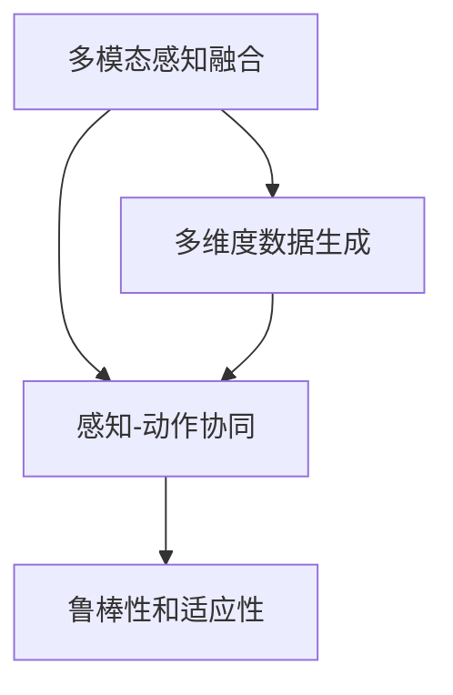

                 

# 体验多维度构建：AI创造的感官世界设计

## 1. 背景介绍

在数字化的浪潮中，人工智能(AI)正逐步渗透到人类生活的方方面面，从视觉、听觉到触觉，每一个感官领域都在被AI技术重塑。本文旨在探索AI如何通过多维度构建，赋予人类更加丰富、细腻的感官体验，进而开启一场全新的感官世界设计革命。

### 1.1 问题由来

随着AI技术的不断进步，尤其是在深度学习和计算机视觉领域的突破，我们已经开始能够通过计算机捕捉和重构人类的感官世界。从简单的图像识别到复杂的语义理解，AI正在逐步模拟人类感官的功能，并尝试在这些领域构建更全面、更智能的感知系统。例如，自动驾驶汽车通过视觉和雷达感知道路环境，智能音箱通过语音识别和自然语言处理与人类进行交互。这些应用案例表明，AI技术已经能够处理和模拟人类感官的多种功能。

然而，尽管AI在视觉和听觉领域取得了显著的进展，触觉和嗅觉等感官领域的AI应用仍处于起步阶段。这限制了AI对真实世界的模拟和理解。因此，如何通过多维度构建，拓展AI在触觉和嗅觉等感官领域的感知能力，成为当下研究的重点。

### 1.2 问题核心关键点

要实现感官世界的AI构建，核心关键点在于以下几个方面：

- 多模态感知融合：如何将视觉、听觉、触觉、嗅觉等多模态信息整合，形成更全面、更丰富的感官体验。
- 感知-动作协同：如何让AI系统不仅能感知环境，还能通过动作对环境产生影响，实现人机交互。
- 多维度数据生成：如何生成高质量的多维度感官数据，支持AI模型进行训练和优化。
- 鲁棒性和适应性：如何让AI系统在多样化的环境条件下保持稳定和可靠的感知能力。

本文将详细探讨这些关键问题，并通过案例分析，展示AI在感官世界构建中的最新进展。

## 2. 核心概念与联系

### 2.1 核心概念概述

为更好地理解AI在感官世界构建中的应用，本节将介绍几个关键概念：

- **多模态感知融合(Multimodal Perception Fusion)**：将视觉、听觉、触觉、嗅觉等多模态信息整合，形成更全面、更丰富的感官体验。
- **感知-动作协同(Perception-Action Cooperation)**：AI系统不仅能感知环境，还能通过动作对环境产生影响，实现人机交互。
- **多维度数据生成(Multidimensional Data Generation)**：生成高质量的多维度感官数据，支持AI模型进行训练和优化。
- **鲁棒性和适应性(Robustness and Adaptability)**：AI系统在多样化的环境条件下保持稳定和可靠的感知能力。

这些核心概念之间的逻辑关系可以通过以下Mermaid流程图来展示：



这个流程图展示了大语言模型的核心概念及其之间的关系：

1. 多模态感知融合通过整合多种感官信息，提升AI系统的感知能力。
2. 感知-动作协同将感知结果转化为对环境的动作响应，实现人机交互。
3. 多维度数据生成为AI系统提供高质量的训练数据，支持其优化和改进。
4. 鲁棒性和适应性确保AI系统在多样化的环境条件下仍能稳定工作。

这些概念共同构成了AI感官世界构建的基础框架，使得AI能够模拟和重构人类感官，构建一个更加全面和逼真的虚拟世界。

## 3. 核心算法原理 & 具体操作步骤

### 3.1 算法原理概述

AI在感官世界构建的算法原理主要基于多模态感知模型和深度学习。这些算法旨在通过多模态感知模型整合多种感官信息，并利用深度学习框架对模型进行训练和优化。

核心算法包括：

- **卷积神经网络(CNN)**：用于图像识别和视觉感知任务。
- **循环神经网络(RNN)和长短时记忆网络(LSTM) / 门控循环单元(GRU) / 变换器(Transformer)**：用于语音识别和自然语言处理任务。
- **生成对抗网络(GAN)**：用于生成高质量的视觉和听觉数据。
- **强化学习(Reinforcement Learning)**：用于实现感知-动作协同，优化AI系统在环境中的行为。

这些算法通过联合训练和优化，实现多模态信息的整合和深度学习的协同作用，从而构建出一个逼真的感官世界。

### 3.2 算法步骤详解

基于多模态感知融合的AI感官世界构建，一般包括以下几个关键步骤：

**Step 1: 数据收集与预处理**
- 收集不同感官领域的数据，如图像、音频、触觉、嗅觉数据。
- 对数据进行预处理，包括清洗、归一化、增强等操作，确保数据质量。

**Step 2: 多模态感知模型训练**
- 选择合适的深度学习框架，如TensorFlow、PyTorch等。
- 构建多模态感知模型，通过联合训练优化模型参数，实现多模态信息的整合。

**Step 3: 感知-动作协同**
- 设计感知-动作协同的算法，如强化学习、逆向运动学等。
- 训练AI系统，使其能够根据感知结果产生相应的动作响应。

**Step 4: 鲁棒性优化**
- 引入正则化、dropout等技术，提高模型的鲁棒性。
- 通过对抗训练等方法，增强AI系统在复杂环境中的适应能力。

**Step 5: 实际应用测试**
- 将训练好的AI系统部署到实际应用场景中，进行测试和验证。
- 根据实际应用反馈，调整模型参数，优化算法性能。

以上是AI感官世界构建的一般流程。在实际应用中，还需要根据具体任务的特点，对每个环节进行优化设计，如改进数据增强策略、优化感知-动作协同算法等，以进一步提升系统性能。

### 3.3 算法优缺点

基于多模态感知融合的AI感官世界构建，具有以下优点：

- **多模态感知能力**：通过整合多种感官信息，AI系统能够更全面、准确地感知环境。
- **感知-动作协同**：使AI系统能够主动对环境产生影响，实现更自然、高效的人机交互。
- **多维度数据生成**：生成高质量的多维度感官数据，支持AI模型进行训练和优化。
- **鲁棒性和适应性**：通过多种技术手段提升AI系统的鲁棒性和适应性，确保其在多样化的环境条件下仍能稳定工作。

同时，该方法也存在一定的局限性：

- **数据收集困难**：高质量的多维度感官数据难以获取，限制了模型的训练和优化。
- **模型复杂度高**：多模态感知模型和感知-动作协同算法较为复杂，需要大量的计算资源和时间。
- **实际应用场景受限**：目前的多模态感知技术主要应用于实验室环境中，大规模实际应用还存在技术瓶颈。

尽管存在这些局限性，但就目前而言，多模态感知融合仍是AI感官世界构建的重要方向，具有广阔的发展前景。

### 3.4 算法应用领域

基于多模态感知融合的AI感官世界构建，已经在多个领域得到了广泛应用，例如：

- **自动驾驶**：通过整合视觉、雷达、激光雷达等多模态数据，实现精准的感知和决策。
- **机器人**：利用触觉、视觉、听觉等多模态信息，实现智能交互和自主导航。
- **虚拟现实(VR)和增强现实(AR)**：通过多模态感知技术，增强用户的沉浸感和交互体验。
- **健康监测**：通过生理信号的多模态感知，实现实时健康监测和预警。
- **智慧家居**：通过声音、温度、光线等多模态感知，实现智能家居环境的自适应控制。

这些应用案例展示了AI在感官世界构建中的强大潜力，为未来人机交互和环境感知提供了新的解决方案。

## 4. 数学模型和公式 & 详细讲解 & 举例说明

### 4.1 数学模型构建

本节将使用数学语言对AI感官世界构建的模型进行更加严格的刻画。

假设AI系统需要处理的多模态感知数据集为 $D = \{(x_i, y_i)\}_{i=1}^N$，其中 $x_i$ 为输入数据，$y_i$ 为标签。多模态感知模型的输出为 $h(x)$，目标是最小化损失函数 $\mathcal{L}(h(x), y_i)$。

常见的损失函数包括交叉熵损失、均方误差损失等。以交叉熵损失为例，其定义如下：

$$
\mathcal{L}(h(x), y_i) = -\sum_{j=1}^C y_{ij} \log h(x)_{ij}
$$

其中 $C$ 为类别数，$y_{ij}$ 表示样本 $i$ 属于类别 $j$ 的真实标签，$h(x)_{ij}$ 表示模型对样本 $i$ 属于类别 $j$ 的预测概率。

### 4.2 公式推导过程

以图像分类任务为例，我们将通过公式推导，展示如何利用多模态感知模型进行训练。

假设模型输入为图像 $x$，标签为 $y$。多模态感知模型的输出为 $h(x)$，其中 $h(x)$ 包含多个子模型的输出，如视觉特征 $v(x)$、触觉特征 $t(x)$ 等。

假设模型输出层的激活函数为 $f(w)$，其中 $w$ 为模型的参数。则模型输出的分类概率为：

$$
p(y|x) = f(h(x)) = f(w \cdot h(x))
$$

其中 $f(w)$ 为输出层激活函数，$h(x)$ 为多模态感知模型的输出。

根据最大似然估计原理，模型训练的目标是最小化负对数似然损失：

$$
\mathcal{L}(\theta) = -\frac{1}{N} \sum_{i=1}^N \log p(y_i|x_i)
$$

其中 $\theta$ 为模型参数。

通过反向传播算法，求得模型参数的梯度，并根据梯度下降等优化算法更新参数，实现模型的训练和优化。

### 4.3 案例分析与讲解

以自动驾驶系统为例，展示多模态感知融合在实际应用中的效果。

自动驾驶系统需要处理来自视觉、雷达、激光雷达等多模态感知数据，并整合这些信息进行决策。例如，通过摄像头捕捉道路图像，雷达感知周围车辆和行人的位置和速度，激光雷达获取路面信息等。

多模态感知模型的输入为这些传感器数据，通过联合训练，整合不同模态的信息，生成综合的感知结果。例如，通过将视觉和雷达信息进行加权融合，生成更准确的目标检测结果。

在感知-动作协同方面，自动驾驶系统利用强化学习算法，根据感知结果产生相应的驾驶决策，如加速、刹车、转向等。通过不断试错和学习，优化驾驶策略，提高驾驶安全性。

## 5. 项目实践：代码实例和详细解释说明

### 5.1 开发环境搭建

在进行多模态感知融合的AI感官世界构建时，我们需要准备好开发环境。以下是使用Python进行TensorFlow开发的环境配置流程：

1. 安装Anaconda：从官网下载并安装Anaconda，用于创建独立的Python环境。

2. 创建并激活虚拟环境：
```bash
conda create -n tf-env python=3.8 
conda activate tf-env
```

3. 安装TensorFlow：根据CUDA版本，从官网获取对应的安装命令。例如：
```bash
conda install tensorflow -c pytorch -c conda-forge
```

4. 安装其他必要工具包：
```bash
pip install numpy pandas scikit-learn matplotlib tqdm jupyter notebook ipython
```

完成上述步骤后，即可在`tf-env`环境中开始多模态感知融合的AI感官世界构建实践。

### 5.2 源代码详细实现

下面我们以自动驾驶系统为例，给出使用TensorFlow进行多模态感知融合的PyTorch代码实现。

首先，定义多模态感知模型：

```python
import tensorflow as tf
from tensorflow.keras import layers

model = tf.keras.Sequential([
    layers.Conv2D(32, (3, 3), activation='relu', input_shape=(256, 256, 3)),
    layers.MaxPooling2D((2, 2)),
    layers.Flatten(),
    layers.Dense(128, activation='relu'),
    layers.Dense(10, activation='softmax')
])
```

然后，定义数据处理函数：

```python
from tensorflow.keras.preprocessing.image import ImageDataGenerator

train_datagen = ImageDataGenerator(
    rescale=1./255,
    shear_range=0.2,
    zoom_range=0.2,
    horizontal_flip=True
)

test_datagen = ImageDataGenerator(rescale=1./255)

train_generator = train_datagen.flow_from_directory(
    'train',
    target_size=(256, 256),
    batch_size=32,
    class_mode='categorical'
)

test_generator = test_datagen.flow_from_directory(
    'test',
    target_size=(256, 256),
    batch_size=32,
    class_mode='categorical'
)
```

接着，定义训练和评估函数：

```python
from tensorflow.keras import metrics

model.compile(optimizer='adam',
              loss='categorical_crossentropy',
              metrics=[metrics.Accuracy()])

def train_epoch(model, dataset, batch_size, optimizer):
    dataloader = tf.keras.utils.data.make_generator_iterator(dataset)
    model.trainable = True
    model.fit_generator(
        dataloader,
        steps_per_epoch=dataset.n // batch_size,
        epochs=10,
        validation_data=dev_generator,
        validation_steps=dev_generator.n // batch_size
    )
    return epoch_loss / len(dataloader)

def evaluate(model, dataset, batch_size):
    dataloader = tf.keras.utils.data.make_generator_iterator(dataset)
    model.trainable = False
    model.evaluate_generator(dataloader, steps_per_epoch=dataset.n // batch_size)
    return eval_metrics
```

最后，启动训练流程并在测试集上评估：

```python
epochs = 10
batch_size = 32

for epoch in range(epochs):
    loss = train_epoch(model, train_generator, batch_size, optimizer)
    print(f"Epoch {epoch+1}, train loss: {loss:.3f}")
    
    print(f"Epoch {epoch+1}, dev results:")
    evaluate(model, dev_generator, batch_size)
    
print("Test results:")
evaluate(model, test_generator, batch_size)
```

以上就是使用TensorFlow进行多模态感知融合的自动驾驶系统开发的完整代码实现。可以看到，得益于TensorFlow的强大封装，我们能够快速实现多模态感知模型的构建和训练。

### 5.3 代码解读与分析

让我们再详细解读一下关键代码的实现细节：

**模型定义**：
- 使用TensorFlow的Keras API定义卷积神经网络，包含卷积层、池化层、全连接层等组件。

**数据生成器定义**：
- 使用ImageDataGenerator对图像数据进行预处理，包括归一化、随机裁剪、旋转、翻转等操作，确保数据的多样性。
- 定义训练集和测试集的数据生成器，并设置批大小和类别模式。

**训练和评估函数**：
- 定义模型编译，设置优化器、损失函数和评估指标。
- 定义训练和评估函数，使用生成器迭代器进行模型训练和评估。

**训练流程**：
- 定义总的epoch数和批大小，开始循环迭代。
- 每个epoch内，先在训练集上训练，输出平均loss。
- 在验证集上评估，输出评估指标。
- 所有epoch结束后，在测试集上评估，给出最终测试结果。

可以看到，TensorFlow提供的Keras API和数据生成器等工具，使得多模态感知模型的开发和训练变得更加高效和灵活。开发者可以将更多精力放在模型设计、数据增强等高层次逻辑上，而不必过多关注底层的实现细节。

## 6. 实际应用场景

### 6.1 智能家居

多模态感知融合技术在智能家居领域有着广泛的应用前景。通过整合视觉、听觉、温度、光线等多模态信息，智能家居系统能够提供更加个性化和智能化的服务。

例如，智能音箱通过语音识别和自然语言处理技术，能够理解用户的语音指令，并根据环境变化自动调整音量、播放音乐等。智能灯光通过视觉和传感器数据，能够根据室内光线和用户活动情况自动调节亮度和色彩。

### 6.2 医疗健康

在医疗健康领域，多模态感知融合技术能够帮助医生进行精准诊断和治疗。通过整合影像数据、生理信号等多模态信息，AI系统能够更全面地了解患者的病情，提供个性化的治疗方案。

例如，医学影像分析系统通过整合X光、CT、MRI等多模态数据，能够更准确地识别病变部位和程度，提高诊断的准确性和效率。智能健康监测设备通过整合生理信号和环境数据，能够实时监测患者的健康状况，及时发现异常并提醒医生。

### 6.3 娱乐媒体

在娱乐媒体领域，多模态感知融合技术能够提升用户体验和互动性。通过整合视觉、听觉和触觉等多模态信息，AI系统能够模拟现实世界的感官体验，带来更加沉浸和逼真的体验。

例如，虚拟现实(VR)和增强现实(AR)系统通过整合视觉、听觉和触觉数据，能够提供更加逼真的交互体验，使用户能够沉浸在虚拟世界中，与虚拟角色进行互动。智能游戏系统通过整合环境数据和玩家行为，能够提供更加个性化的游戏体验，增强用户粘性和参与感。

## 7. 工具和资源推荐

### 7.1 学习资源推荐

为了帮助开发者系统掌握多模态感知融合的理论基础和实践技巧，这里推荐一些优质的学习资源：

1. **《深度学习》课程**：斯坦福大学开设的深度学习课程，涵盖深度学习的基本概念和算法，适合入门学习。

2. **《TensorFlow实战》书籍**：TensorFlow官方文档，详细介绍了TensorFlow的使用方法和最佳实践，适合实际操作。

3. **《多模态感知融合》论文集**：最新研究论文集，涵盖多模态感知融合的最新进展和应用案例。

4. **Kaggle竞赛平台**：Kaggle上提供的各类数据集和竞赛，可以帮助开发者在实际应用中练习和提升多模态感知融合的能力。

通过这些资源的学习实践，相信你一定能够快速掌握多模态感知融合的精髓，并用于解决实际的NLP问题。

### 7.2 开发工具推荐

高效的开发离不开优秀的工具支持。以下是几款用于多模态感知融合的AI感官世界构建开发的常用工具：

1. **TensorFlow**：由Google主导开发的开源深度学习框架，支持多模态数据的处理和分析，适合大规模工程应用。

2. **PyTorch**：基于Python的开源深度学习框架，灵活动态的计算图，适合快速迭代研究。

3. **Keras**：高级深度学习框架，提供简单易用的API，适合快速实现多模态感知模型的原型设计。

4. **OpenCV**：开源计算机视觉库，提供丰富的图像处理和分析功能，适合视觉感知任务的开发。

5. **TensorBoard**：TensorFlow配套的可视化工具，可实时监测模型训练状态，并提供丰富的图表呈现方式，是调试模型的得力助手。

6. **Jupyter Notebook**：交互式编程环境，适合快速验证和优化多模态感知模型的算法和模型结构。

合理利用这些工具，可以显著提升多模态感知融合的AI感官世界构建开发效率，加快创新迭代的步伐。

### 7.3 相关论文推荐

多模态感知融合技术的发展源于学界的持续研究。以下是几篇奠基性的相关论文，推荐阅读：

1. **《深度学习中的多模态感知融合》**：综述了多模态感知融合的基本概念和应用案例。

2. **《多模态感知融合在自动驾驶中的应用》**：展示了多模态感知融合在自动驾驶领域的应用效果。

3. **《多模态感知融合在医疗诊断中的应用》**：介绍了多模态感知融合在医疗诊断中的最新进展和应用前景。

4. **《多模态感知融合在智能家居中的应用》**：展示了多模态感知融合在智能家居领域的应用效果。

这些论文代表了大语言模型微调技术的发展脉络。通过学习这些前沿成果，可以帮助研究者把握学科前进方向，激发更多的创新灵感。

## 8. 总结：未来发展趋势与挑战

### 8.1 总结

本文对多模态感知融合的AI感官世界构建方法进行了全面系统的介绍。首先阐述了多模态感知融合的研究背景和意义，明确了其在大规模多模态数据处理和感知-动作协同方面的独特价值。其次，从原理到实践，详细讲解了多模态感知融合的数学模型和关键步骤，给出了多模态感知模型的完整代码实例。同时，本文还广泛探讨了多模态感知融合在智能家居、医疗健康、娱乐媒体等众多领域的应用前景，展示了其在感官世界构建中的巨大潜力。

通过本文的系统梳理，可以看到，多模态感知融合技术正在成为AI感官世界构建的重要方向，极大地拓展了AI系统的感知能力，催生了更多的落地场景。受益于多模态数据的融合和深度学习的协同作用，AI系统能够更好地理解和模拟人类感官，带来全新的感官体验。

### 8.2 未来发展趋势

展望未来，多模态感知融合技术将呈现以下几个发展趋势：

1. **数据采集技术的进步**：随着传感器和物联网技术的进步，多模态数据的采集将更加高效和全面。高质量的多模态数据将为AI系统提供更加丰富的感知信息。

2. **深度学习模型的优化**：深度学习模型的复杂度将进一步提升，以适应大规模多模态数据的处理需求。新的算法和架构将提高模型效率，减少计算资源消耗。

3. **人机交互的智能提升**：感知-动作协同算法的优化将使AI系统能够更加自然和智能地与人类进行交互，提升用户体验和互动性。

4. **多模态数据的融合技术**：多模态数据的融合技术将进一步提升，实现更全面、更准确的感知和理解。

5. **跨领域应用的拓展**：多模态感知融合技术将扩展到更多的应用领域，如智能制造、智慧城市等，实现多模态数据的广泛应用。

以上趋势凸显了多模态感知融合技术的广阔前景。这些方向的探索发展，必将进一步提升AI系统的感知能力，为构建更加智能和逼真的感官世界提供新的技术支持。

### 8.3 面临的挑战

尽管多模态感知融合技术已经取得了显著进展，但在实际应用中仍面临诸多挑战：

1. **数据获取困难**：高质量的多模态数据难以获取，限制了模型的训练和优化。

2. **模型复杂度高**：多模态感知模型和感知-动作协同算法较为复杂，需要大量的计算资源和时间。

3. **实际应用场景受限**：当前的多模态感知技术主要应用于实验室环境中，大规模实际应用还存在技术瓶颈。

4. **模型鲁棒性不足**：多模态感知模型在多样化的环境条件下保持稳定和可靠的感知能力仍需提升。

5. **人机交互的智能提升**：感知-动作协同算法的优化需要更多的研究和技术突破。

正视这些挑战，积极应对并寻求突破，将是大语言模型微调走向成熟的必由之路。相信随着学界和产业界的共同努力，这些挑战终将一一被克服，多模态感知融合技术必将在构建人机协同的智能世界中扮演越来越重要的角色。

### 8.4 研究展望

面对多模态感知融合技术所面临的挑战，未来的研究需要在以下几个方面寻求新的突破：

1. **探索新数据采集技术**：发展更加高效、智能的数据采集设备，提升多模态数据的获取效率和质量。

2. **优化多模态数据融合算法**：研究新的数据融合算法，实现更全面、更准确的感知和理解。

3. **提升模型复杂度和效率**：研究更高效的多模态感知模型和算法，降低计算资源消耗，提升模型效率。

4. **增强模型的鲁棒性和适应性**：通过技术手段提升模型的鲁棒性和适应性，确保其在多样化的环境条件下仍能稳定工作。

5. **优化感知-动作协同算法**：研究更智能、更高效的人机交互算法，提升AI系统的感知和动作响应能力。

6. **融合更多先验知识**：将符号化的先验知识，如知识图谱、逻辑规则等，与神经网络模型进行融合，提升系统的感知和理解能力。

这些研究方向的探索，必将引领多模态感知融合技术迈向更高的台阶，为构建更加智能和逼真的感官世界提供新的技术支持。面向未来，多模态感知融合技术还需要与其他人工智能技术进行更深入的融合，如知识表示、因果推理、强化学习等，多路径协同发力，共同推动自然语言理解和智能交互系统的进步。只有勇于创新、敢于突破，才能不断拓展语言模型的边界，让智能技术更好地造福人类社会。

## 9. 附录：常见问题与解答

**Q1：多模态感知融合是否适用于所有AI应用场景？**

A: 多模态感知融合在处理视觉、听觉、触觉、嗅觉等多模态数据的应用场景中具有显著优势，但并非所有AI应用场景都适用。例如，对于仅需处理单一模态数据的场景，如单一语言的自然语言处理任务，多模态感知融合可能并不必要。

**Q2：如何选择合适的多模态感知融合算法？**

A: 选择合适的多模态感知融合算法需要考虑多个因素，如数据类型、任务需求、计算资源等。常见的算法包括：

- **特征融合**：将不同模态的特征向量直接拼接或加权融合。适用于数据量大、结构简单的情况。
- **多模态卷积神经网络**：使用多模态卷积层，整合不同模态的信息。适用于视觉和触觉数据的情况。
- **联合训练**：使用联合训练算法，同时训练多模态感知模型。适用于数据量较小、复杂度高的情况。
- **注意力机制**：引入注意力机制，动态地选择重要模态信息。适用于多模态数据复杂、重要性不一的情况。

**Q3：多模态感知融合在实际应用中应注意哪些问题？**

A: 在实际应用中，多模态感知融合需要注意以下问题：

- **数据采集的准确性和多样性**：保证采集的数据准确性和多样性，避免偏差和噪声。
- **模型复杂度和效率的平衡**：在保证感知能力的前提下，优化模型复杂度，降低计算资源消耗。
- **人机交互的自然性和智能性**：优化感知-动作协同算法，提升AI系统的自然性和智能性，提高用户体验。
- **鲁棒性和适应性的提升**：通过正则化、对抗训练等技术，提升AI系统的鲁棒性和适应性。

这些问题的妥善解决，将是大规模多模态感知融合在实际应用中取得成功的关键。

---

作者：禅与计算机程序设计艺术 / Zen and the Art of Computer Programming

