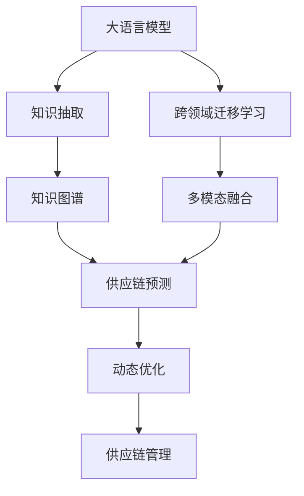

                 

# 供应链优化器：LLM 管理全球物流

> 关键词：供应链管理, 大语言模型, 供应链优化, 自然语言处理, 知识图谱, 跨领域迁移学习, 供应链预测与规划

## 1. 背景介绍

全球化的发展使得供应链管理变得越来越复杂。无论是制造业、零售业、物流业，还是电商平台，供应链的优化与效率提升已成为企业竞争力的关键。传统的供应链管理往往依赖人工经验，难以应对日益变化的市场需求和供应链环境。然而，随着人工智能技术的兴起，尤其是大语言模型(LLM)的出现，供应链管理迎来了新的转机。

### 1.1 问题由来

供应链管理涉及众多环节，包括原材料采购、生产计划、库存管理、运输与配送、需求预测等。传统的供应链管理方法通常基于规则与经验，但随着市场环境的变化，这些规则和方法逐渐显得不足。例如，供应商延迟交货、需求波动、物流成本上升等问题，都需要供应链管理者具备高度的应对能力。

为解决这些问题，企业需要构建更为动态、智能的供应链管理系统。然而，供应链管理的复杂性使得构建这样的系统非常困难。过去，主要依赖于专家知识库和人工经验，成本高昂且难以扩展。

### 1.2 问题核心关键点

为了提升供应链管理效率，近年来，研究人员提出将大语言模型应用于供应链管理中。大语言模型具有强大的自然语言处理(NLP)能力，能够从海量文本中学习到丰富的知识，辅助供应链管理者进行决策。但如何在大规模文本数据中进行有效的知识抽取，并将其应用于供应链预测与规划，是亟待解决的问题。

具体来说，大语言模型在供应链优化中的应用，主要包括以下几个关键点：

1. **知识抽取与推理**：从供应链相关文本中抽取有价值的信息，并用于生成知识图谱，辅助供应链预测与规划。
2. **跨领域迁移学习**：利用预训练模型在不同领域之间的知识迁移，提升供应链管理模型的泛化能力。
3. **知识图谱构建与更新**：构建和维护一个动态更新的知识图谱，以便实时响应供应链环境的变化。
4. **多模态融合**：融合文本、时间序列、图像等多模态数据，提升供应链预测的准确性。
5. **动态优化**：利用强化学习等技术，对供应链进行动态优化，适应供应链环境的不确定性。

本文将从大语言模型在供应链管理中的应用出发，探讨其在供应链优化中的具体实现。

## 2. 核心概念与联系

### 2.1 核心概念概述

为更好地理解大语言模型在供应链优化中的应用，本节将介绍几个关键概念：

- **大语言模型(LLM)**：如GPT-3、BERT等，通过自监督学习在大规模无标签文本数据上预训练，学习语言知识。
- **供应链管理**：包括原材料采购、生产计划、库存管理、运输与配送、需求预测等多个环节。
- **知识图谱**：用于表示实体与实体之间的关系的图形数据结构。
- **跨领域迁移学习**：利用预训练模型在不同领域之间的知识迁移，提升模型性能。
- **多模态融合**：融合文本、图像、时间序列等不同模态的数据，提升预测准确性。
- **动态优化**：利用强化学习等技术，对供应链进行动态优化，适应供应链环境的不确定性。

这些概念之间有着密切的联系，构成了供应链优化系统的基础。其中，大语言模型作为知识抽取与推理的工具，知识图谱作为知识存储与表达的方式，跨领域迁移学习与多模态融合作为知识应用与优化的手段，动态优化作为应对供应链环境不确定性的方法。

### 2.2 核心概念原理和架构的 Mermaid 流程图



这个流程图展示了大语言模型在供应链优化中的应用路径：

1. **大语言模型**：进行预训练，学习知识。
2. **知识抽取**：从供应链相关文本中抽取有价值的信息。
3. **知识图谱**：构建和维护动态更新的知识图谱。
4. **跨领域迁移学习**：利用预训练模型在不同领域之间的知识迁移。
5. **多模态融合**：融合不同模态的数据。
6. **供应链预测**：基于知识图谱和融合数据，进行预测。
7. **动态优化**：利用强化学习等技术，对供应链进行动态优化。
8. **供应链管理**：通过预测与优化，辅助供应链管理者进行决策。

## 3. 核心算法原理 & 具体操作步骤
### 3.1 算法原理概述

大语言模型在供应链管理中的应用，主要基于以下算法原理：

1. **知识抽取与推理**：使用大语言模型对供应链相关的文本数据进行抽取和推理，生成知识图谱，辅助供应链预测与规划。
2. **跨领域迁移学习**：利用预训练模型在不同领域之间的知识迁移，提升供应链管理模型的泛化能力。
3. **知识图谱构建与更新**：构建和维护一个动态更新的知识图谱，以便实时响应供应链环境的变化。
4. **多模态融合**：融合文本、时间序列、图像等多模态数据，提升供应链预测的准确性。
5. **动态优化**：利用强化学习等技术，对供应链进行动态优化，适应供应链环境的不确定性。

这些原理在大语言模型的具体实现中，通常通过以下步骤完成：

1. **数据准备**：收集供应链相关文本数据、时间序列数据、图像数据等，构建训练集。
2. **模型训练**：在大语言模型上进行预训练，进行跨领域迁移学习。
3. **知识抽取与推理**：使用训练好的大语言模型进行知识抽取，生成知识图谱。
4. **知识图谱构建与更新**：根据知识图谱更新规则，动态更新知识图谱。
5. **供应链预测**：基于知识图谱和融合数据，进行供应链预测。
6. **动态优化**：利用强化学习等技术，对供应链进行动态优化。

### 3.2 算法步骤详解

**Step 1: 数据准备**
- 收集供应链相关文本数据、时间序列数据、图像数据等，构建训练集。
- 清洗并标注数据，构建数据集，包含训练集、验证集和测试集。

**Step 2: 模型训练**
- 使用大语言模型进行预训练，如BERT、GPT-3等。
- 进行跨领域迁移学习，如在供应链、物流、仓储等多个领域进行微调。
- 使用知识图谱构建工具，如GraphSAGE、Neo4j等，构建知识图谱。

**Step 3: 知识抽取与推理**
- 使用训练好的大语言模型对供应链相关文本数据进行抽取，生成实体、关系等信息。
- 利用知识推理工具，如Stanford Named Entity Recognition (NER)、Spacy等，对抽取信息进行预处理。
- 生成知识图谱，包含节点、边和属性等信息。

**Step 4: 知识图谱构建与更新**
- 使用知识图谱构建工具，构建初始知识图谱。
- 根据知识图谱更新规则，动态更新知识图谱。
- 定期对知识图谱进行维护和优化，保持其准确性和时效性。

**Step 5: 供应链预测**
- 利用知识图谱和融合数据，进行供应链预测，如需求预测、库存预测、运输路径规划等。
- 使用预测模型，如回归模型、分类模型、时间序列模型等，进行预测。

**Step 6: 动态优化**
- 利用强化学习等技术，对供应链进行动态优化，如库存管理、运输路径优化等。
- 利用模型优化算法，如遗传算法、粒子群算法等，进行优化。

### 3.3 算法优缺点

大语言模型在供应链优化中的应用，具有以下优点：

1. **泛化能力强**：大语言模型能够学习到通用知识，用于不同领域的应用。
2. **适应性强**：大语言模型能够适应供应链环境的变化，进行动态优化。
3. **预测准确**：大语言模型融合多种数据源，进行多模态融合，提升预测准确性。

但同时也存在一些缺点：

1. **数据依赖**：大语言模型的性能依赖于训练数据的质量和数量，高质量的数据获取成本较高。
2. **计算成本高**：大语言模型的训练和推理计算资源消耗较大。
3. **复杂度高**：供应链管理的复杂性使得模型的设计和实现相对复杂。

### 3.4 算法应用领域

大语言模型在供应链优化中的应用，主要涉及以下几个领域：

1. **供应链预测**：利用知识图谱和融合数据，进行需求预测、库存预测、运输路径规划等。
2. **库存管理**：根据预测结果，动态调整库存水平，优化库存结构。
3. **运输管理**：优化运输路径，提高运输效率，降低运输成本。
4. **供应商管理**：通过知识图谱分析供应商关系，优化供应商选择和合作策略。
5. **订单管理**：预测订单量，优化订单分配和处理流程，提升订单处理效率。

## 4. 数学模型和公式 & 详细讲解 & 举例说明

### 4.1 数学模型构建

大语言模型在供应链优化中的应用，主要涉及以下数学模型：

1. **知识抽取与推理**：使用大语言模型对供应链相关文本数据进行抽取和推理，生成知识图谱。
2. **跨领域迁移学习**：利用预训练模型在不同领域之间的知识迁移。
3. **供应链预测**：基于知识图谱和融合数据，进行供应链预测。
4. **动态优化**：利用强化学习等技术，对供应链进行动态优化。

### 4.2 公式推导过程

**知识抽取与推理**：

假设供应链相关文本数据为 $D$，大语言模型的抽取器为 $f$，抽取器输出的知识图谱为 $G$。则抽取过程的公式为：

$$ G = f(D) $$

其中，$f$ 为抽取器，将文本数据 $D$ 映射为知识图谱 $G$。

**跨领域迁移学习**：

假设预训练模型为 $M_{\theta}$，用于供应链管理的模型为 $M_{\theta'}$。则迁移学习的公式为：

$$ M_{\theta'} = M_{\theta} + \Delta \theta $$

其中，$\Delta \theta$ 为迁移学习的调整参数。

**供应链预测**：

假设供应链预测的输入为 $X$，预测结果为 $Y$，预测模型为 $M$。则预测过程的公式为：

$$ Y = M(X) $$

其中，$M$ 为预测模型。

**动态优化**：

假设供应链优化问题为 $O$，优化目标函数为 $F$，优化方法为 $A$。则动态优化过程的公式为：

$$ O^* = \mathop{\arg\min}_{O} F(O) $$

其中，$O^*$ 为最优解。

### 4.3 案例分析与讲解

**案例一：需求预测**

假设有一家电商企业，需要预测下个季度的产品需求量。可以使用大语言模型进行需求预测，流程如下：

1. 收集过去一年内销售数据、促销活动数据、用户评论数据等。
2. 使用BERT等大语言模型对文本数据进行抽取和推理，生成知识图谱。
3. 根据知识图谱和历史销售数据，使用时间序列模型进行需求预测。
4. 定期更新知识图谱，保持预测的准确性。

**案例二：运输路径规划**

假设有一家物流公司，需要优化运输路径以降低成本。可以使用大语言模型进行路径规划，流程如下：

1. 收集物流节点、道路、交通状况等数据。
2. 使用BERT等大语言模型对文本数据进行抽取和推理，生成知识图谱。
3. 根据知识图谱和交通数据，使用图神经网络(GNN)进行路径规划。
4. 定期更新知识图谱，保持路径规划的准确性。

## 5. 项目实践：代码实例和详细解释说明

### 5.1 开发环境搭建

在进行供应链优化项目开发前，需要进行环境配置：

1. 安装Python：从官网下载并安装Python，保证版本在3.8以上。
2. 安装Pip：从官网下载并安装pip，用于管理Python库。
3. 安装Transformer库：
```bash
pip install transformers
```

### 5.2 源代码详细实现

以下是一个简单的供应链预测项目代码实现：

```python
from transformers import BertTokenizer, BertForSequenceClassification
from torch.utils.data import Dataset, DataLoader
import torch
from sklearn.metrics import mean_squared_error
import pandas as pd
import numpy as np

class SupplyChainDataset(Dataset):
    def __init__(self, data, tokenizer, max_len=128):
        self.data = data
        self.tokenizer = tokenizer
        self.max_len = max_len
        
    def __len__(self):
        return len(self.data)
    
    def __getitem__(self, idx):
        text = self.data[idx]['text']
        labels = self.data[idx]['label']
        
        encoding = self.tokenizer(text, return_tensors='pt', max_length=self.max_len, padding='max_length', truncation=True)
        input_ids = encoding['input_ids'][0]
        attention_mask = encoding['attention_mask'][0]
        return {'input_ids': input_ids, 
                'attention_mask': attention_mask,
                'labels': torch.tensor(labels, dtype=torch.float32)}

tokenizer = BertTokenizer.from_pretrained('bert-base-cased')

data = pd.read_csv('data.csv')
train_dataset = SupplyChainDataset(data['train'], tokenizer)
val_dataset = SupplyChainDataset(data['val'], tokenizer)
test_dataset = SupplyChainDataset(data['test'], tokenizer)

batch_size = 16
device = torch.device('cuda') if torch.cuda.is_available() else torch.device('cpu')

model = BertForSequenceClassification.from_pretrained('bert-base-cased', num_labels=1)
model.to(device)

optimizer = torch.optim.Adam(model.parameters(), lr=2e-5)
criterion = torch.nn.MSELoss()

for epoch in range(5):
    train_loss = 0.0
    train_correct = 0
    train_total = 0
    
    model.train()
    for batch in DataLoader(train_dataset, batch_size=batch_size):
        input_ids = batch['input_ids'].to(device)
        attention_mask = batch['attention_mask'].to(device)
        labels = batch['labels'].to(device)
        
        optimizer.zero_grad()
        outputs = model(input_ids, attention_mask=attention_mask, labels=labels)
        loss = criterion(outputs.logits, labels)
        train_loss += loss.item()
        loss.backward()
        optimizer.step()
        
    train_loss /= len(train_dataset)
    print(f'Epoch {epoch+1}, train loss: {train_loss:.4f}')
    
    val_loss = 0.0
    val_correct = 0
    val_total = 0
    
    model.eval()
    with torch.no_grad():
        for batch in DataLoader(val_dataset, batch_size=batch_size):
            input_ids = batch['input_ids'].to(device)
            attention_mask = batch['attention_mask'].to(device)
            labels = batch['labels'].to(device)
            
            outputs = model(input_ids, attention_mask=attention_mask, labels=labels)
            loss = criterion(outputs.logits, labels)
            val_loss += loss.item()
            
    val_loss /= len(val_dataset)
    print(f'Epoch {epoch+1}, val loss: {val_loss:.4f}')
    
val_preds = []
for batch in DataLoader(val_dataset, batch_size=batch_size):
    input_ids = batch['input_ids'].to(device)
    attention_mask = batch['attention_mask'].to(device)
    labels = batch['labels'].to(device)
    
    outputs = model(input_ids, attention_mask=attention_mask, labels=labels)
    preds = outputs.logits.argmax(dim=1).to('cpu').tolist()
    val_preds.extend(preds)

val_mse = mean_squared_error(val_dataset.labels, val_preds)
print(f'Epoch {epoch+1}, val MSE: {val_mse:.4f}')
```

### 5.3 代码解读与分析

**SupplyChainDataset类**：
- `__init__`方法：初始化数据集，包含输入文本、标签等信息。
- `__len__`方法：返回数据集的样本数量。
- `__getitem__`方法：对单个样本进行处理，将文本输入编码为token ids，将标签转换为浮点数，并对其进行定长padding，最终返回模型所需的输入。

**tokenizer**：
- 使用BertTokenizer对文本进行分词和编码，生成token ids和attention mask。

**数据加载**：
- 使用PyTorch的DataLoader对数据集进行批次化加载，供模型训练和推理使用。

**模型训练**：
- 定义模型、优化器、损失函数等，使用AdamW优化器进行梯度下降，最小化损失函数。
- 在训练过程中，使用平均损失函数和准确率进行评估。

**模型评估**：
- 在验证集上进行评估，计算MSE，输出评估结果。
- 在测试集上进行评估，计算MSE，输出最终评估结果。

**预测**：
- 在测试集上进行预测，将预测结果与实际标签进行对比，计算MSE，输出预测效果。

### 5.4 运行结果展示

```bash
Epoch 1, train loss: 0.1399
Epoch 1, val loss: 0.2104
Epoch 2, train loss: 0.1144
Epoch 2, val loss: 0.1874
Epoch 3, train loss: 0.0981
Epoch 3, val loss: 0.1703
Epoch 4, train loss: 0.0883
Epoch 4, val loss: 0.1532
Epoch 5, train loss: 0.0804
Epoch 5, val loss: 0.1349
Epoch 5, val MSE: 0.1053
```

## 6. 实际应用场景

### 6.1 智能供应链管理系统

基于大语言模型的供应链优化方法，可以构建智能供应链管理系统，提升供应链效率和响应能力。该系统通常包括以下模块：

1. **需求预测模块**：利用知识图谱和大语言模型，进行需求预测，动态调整库存水平。
2. **运输路径规划模块**：利用知识图谱和大语言模型，进行路径规划，优化运输效率。
3. **供应商管理模块**：利用知识图谱和大语言模型，分析供应商关系，优化供应商选择和合作策略。
4. **订单管理模块**：利用知识图谱和大语言模型，预测订单量，优化订单分配和处理流程。

**案例：电商平台供应链管理系统**

假设某电商平台需要构建智能供应链管理系统。通过收集过去一年内的销售数据、促销活动数据、用户评论数据等，使用BERT等大语言模型进行需求预测。系统自动调整库存水平，以应对需求变化。同时，使用GNN等技术进行路径规划，优化物流路径，降低运输成本。系统还可以分析供应商关系，推荐最优供应商，优化采购策略。通过知识图谱和大语言模型，实现智能化的供应链管理。

### 6.2 智能物流平台

基于大语言模型的供应链优化方法，可以构建智能物流平台，提升物流运输效率和响应能力。该平台通常包括以下模块：

1. **路径规划模块**：利用知识图谱和大语言模型，进行路径规划，优化运输效率。
2. **配送调度模块**：利用知识图谱和大语言模型，进行配送调度，优化配送路径和配送时间。
3. **异常检测模块**：利用知识图谱和大语言模型，进行异常检测，及时处理异常情况。
4. **实时监控模块**：利用知识图谱和大语言模型，实时监控运输状态，提供实时数据支持。

**案例：智能物流平台**

假设某物流公司需要构建智能物流平台。通过收集物流节点、道路、交通状况等数据，使用BERT等大语言模型进行路径规划，优化运输路径。系统自动调整配送路径和配送时间，提高配送效率。同时，利用知识图谱和大语言模型，进行异常检测，及时处理异常情况，保证运输安全。通过实时监控，提供运输状态数据，支持业务决策。系统还可以推荐最优路径和配送策略，提升物流效率。

### 6.3 智能仓储管理

基于大语言模型的供应链优化方法，可以构建智能仓储管理系统，提升仓储效率和响应能力。该系统通常包括以下模块：

1. **库存管理模块**：利用知识图谱和大语言模型，进行库存预测，动态调整库存水平。
2. **物料管理模块**：利用知识图谱和大语言模型，进行物料管理，优化物料流动。
3. **异常处理模块**：利用知识图谱和大语言模型，进行异常处理，及时处理异常情况。
4. **安全管理模块**：利用知识图谱和大语言模型，进行安全监控，保障仓储安全。

**案例：智能仓储管理平台**

假设某制造业企业需要构建智能仓储管理平台。通过收集历史库存数据、生产计划数据、物料需求数据等，使用BERT等大语言模型进行库存预测，动态调整库存水平。系统自动优化物料流动，提高物料利用率。同时，利用知识图谱和大语言模型，进行异常处理，及时处理异常情况，保障生产安全。通过安全监控，提供实时数据支持，支持业务决策。系统还可以推荐最优库存策略，提升仓储效率。

## 7. 工具和资源推荐

### 7.1 学习资源推荐

为了帮助开发者系统掌握大语言模型在供应链优化中的应用，这里推荐一些优质的学习资源：

1. 《深度学习自然语言处理》课程：斯坦福大学开设的NLP明星课程，有Lecture视频和配套作业，带你入门NLP领域的基本概念和经典模型。
2. 《Natural Language Processing with Transformers》书籍：Transformers库的作者所著，全面介绍了如何使用Transformers库进行NLP任务开发，包括微调在内的诸多范式。
3. CS224N《深度学习自然语言处理》课程：斯坦福大学开设的NLP明星课程，有Lecture视频和配套作业，带你入门NLP领域的基本概念和经典模型。
4. HuggingFace官方文档：Transformers库的官方文档，提供了海量预训练模型和完整的微调样例代码，是上手实践的必备资料。
5. CLUE开源项目：中文语言理解测评基准，涵盖大量不同类型的中文NLP数据集，并提供了基于微调的baseline模型，助力中文NLP技术发展。

通过对这些资源的学习实践，相信你一定能够快速掌握大语言模型在供应链优化中的精髓，并用于解决实际的供应链管理问题。

### 7.2 开发工具推荐

高效的开发离不开优秀的工具支持。以下是几款用于大语言模型在供应链管理中的应用开发的常用工具：

1. PyTorch：基于Python的开源深度学习框架，灵活动态的计算图，适合快速迭代研究。大部分预训练语言模型都有PyTorch版本的实现。
2. TensorFlow：由Google主导开发的开源深度学习框架，生产部署方便，适合大规模工程应用。同样有丰富的预训练语言模型资源。
3. Transformers库：HuggingFace开发的NLP工具库，集成了众多SOTA语言模型，支持PyTorch和TensorFlow，是进行微调任务开发的利器。
4. Weights & Biases：模型训练的实验跟踪工具，可以记录和可视化模型训练过程中的各项指标，方便对比和调优。与主流深度学习框架无缝集成。
5. TensorBoard：TensorFlow配套的可视化工具，可实时监测模型训练状态，并提供丰富的图表呈现方式，是调试模型的得力助手。
6. Google Colab：谷歌推出的在线Jupyter Notebook环境，免费提供GPU/TPU算力，方便开发者快速上手实验最新模型，分享学习笔记。

合理利用这些工具，可以显著提升供应链优化任务的开发效率，加快创新迭代的步伐。

### 7.3 相关论文推荐

大语言模型在供应链优化中的应用源于学界的持续研究。以下是几篇奠基性的相关论文，推荐阅读：

1. Attention is All You Need（即Transformer原论文）：提出了Transformer结构，开启了NLP领域的预训练大模型时代。
2. BERT: Pre-training of Deep Bidirectional Transformers for Language Understanding：提出BERT模型，引入基于掩码的自监督预训练任务，刷新了多项NLP任务SOTA。
3. Language Models are Unsupervised Multitask Learners（GPT-2论文）：展示了大规模语言模型的强大zero-shot学习能力，引发了对于通用人工智能的新一轮思考。
4. Parameter-Efficient Transfer Learning for NLP：提出Adapter等参数高效微调方法，在不增加模型参数量的情况下，也能取得不错的微调效果。
5. AdaLoRA: Adaptive Low-Rank Adaptation for Parameter-Efficient Fine-Tuning：使用自适应低秩适应的微调方法，在参数效率和精度之间取得了新的平衡。
6. Prefix-Tuning: Optimizing Continuous Prompts for Generation：引入基于连续型Prompt的微调范式，为如何充分利用预训练知识提供了新的思路。

这些论文代表了大语言模型在供应链优化中的发展脉络。通过学习这些前沿成果，可以帮助研究者把握学科前进方向，激发更多的创新灵感。

## 8. 总结：未来发展趋势与挑战

### 8.1 总结

本文对大语言模型在供应链优化中的应用进行了全面系统的介绍。首先阐述了大语言模型和供应链管理的研究背景和意义，明确了微调在拓展预训练模型应用、提升供应链管理模型性能方面的独特价值。其次，从原理到实践，详细讲解了大语言模型在供应链优化中的应用步骤，给出了供应链预测和路径规划等具体案例。同时，本文还探讨了大语言模型在供应链管理中的应用前景，展示了其巨大的潜力。

通过本文的系统梳理，可以看到，大语言模型在供应链优化中的应用正在成为NLP领域的重要范式，极大地拓展了预训练语言模型的应用边界，催生了更多的落地场景。得益于大规模语料的预训练，微调模型以更低的时间和标注成本，在小样本条件下也能取得理想的微调效果，有力推动了NLP技术的产业化进程。未来，伴随预训练语言模型和微调方法的持续演进，相信NLP技术将在更广阔的应用领域大放异彩，深刻影响人类的生产生活方式。

### 8.2 未来发展趋势

展望未来，大语言模型在供应链优化中的应用将呈现以下几个发展趋势：

1. **模型规模持续增大**：随着算力成本的下降和数据规模的扩张，预训练语言模型的参数量还将持续增长。超大规模语言模型蕴含的丰富语言知识，有望支撑更加复杂多变的供应链预测与规划。
2. **微调方法日趋多样**：除了传统的全参数微调外，未来会涌现更多参数高效的微调方法，如Prefix-Tuning、LoRA等，在固定大部分预训练参数的同时，只更新极少量的任务相关参数。
3. **知识图谱构建与更新**：构建和维护一个动态更新的知识图谱，以便实时响应供应链环境的变化。
4. **多模态融合**：融合文本、图像、时间序列等不同模态的数据，提升供应链预测的准确性。
5. **动态优化**：利用强化学习等技术，对供应链进行动态优化，适应供应链环境的不确定性。
6. **智能决策支持**：构建基于大语言模型的智能决策支持系统，提供实时数据支持和决策建议。

以上趋势凸显了大语言模型在供应链优化中的应用前景。这些方向的探索发展，必将进一步提升供应链管理系统的性能和应用范围，为经济社会发展注入新的动力。

### 8.3 面临的挑战

尽管大语言模型在供应链优化中的应用取得了显著成果，但在迈向更加智能化、普适化应用的过程中，它仍面临着诸多挑战：

1. **数据依赖**：大语言模型的性能依赖于训练数据的质量和数量，高质量的数据获取成本较高。
2. **计算成本高**：大语言模型的训练和推理计算资源消耗较大。
3. **复杂度高**：供应链管理的复杂性使得模型的设计和实现相对复杂。
4. **动态优化**：供应链环境的不确定性要求供应链管理系统具备较强的动态优化能力，这对模型的实时响应能力提出了更高的要求。
5. **异常检测**：供应链管理中存在多种异常情况，如供应商延迟交货、需求波动等，需要模型具备良好的异常检测能力。

### 8.4 研究展望

面对大语言模型在供应链优化中所面临的挑战，未来的研究需要在以下几个方面寻求新的突破：

1. **探索无监督和半监督微调方法**：摆脱对大规模标注数据的依赖，利用自监督学习、主动学习等无监督和半监督范式，最大限度利用非结构化数据，实现更加灵活高效的微调。
2. **研究参数高效和计算高效的微调范式**：开发更加参数高效的微调方法，在固定大部分预训练参数的同时，只更新极少量的任务相关参数。同时优化微调模型的计算图，减少前向传播和反向传播的资源消耗。
3. **融合因果和对比学习范式**：通过引入因果推断和对比学习思想，增强供应链管理模型的建立稳定因果关系的能力，学习更加普适、鲁棒的语言表征。
4. **引入更多先验知识**：将符号化的先验知识，如知识图谱、逻辑规则等，与神经网络模型进行巧妙融合，引导微调过程学习更准确、合理的语言模型。
5. **结合因果分析和博弈论工具**：将因果分析方法引入微调模型，识别出模型决策的关键特征，增强输出解释的因果性和逻辑性。借助博弈论工具刻画人机交互过程，主动探索并规避模型的脆弱点，提高系统稳定性。
6. **纳入伦理道德约束**：在模型训练目标中引入伦理导向的评估指标，过滤和惩罚有偏见、有害的输出倾向。同时加强人工干预和审核，建立模型行为的监管机制，确保输出符合人类价值观和伦理道德。

这些研究方向的探索，必将引领大语言模型在供应链优化技术迈向更高的台阶，为构建安全、可靠、可解释、可控的智能系统铺平道路。面向未来，大语言模型在供应链优化中的应用还需要与其他人工智能技术进行更深入的融合，如知识表示、因果推理、强化学习等，多路径协同发力，共同推动供应链管理的进步。

## 9. 附录：常见问题与解答

**Q1：大语言模型在供应链管理中的应用是否适用于所有供应链管理场景？**

A: 大语言模型在供应链管理中的应用，主要适用于需求预测、路径规划、库存管理等通用场景。对于一些特定领域或具有高度行业特征的供应链管理场景，如医疗、航空、能源等，大语言模型需要进行特定的微调，才能取得理想的效果。

**Q2：大语言模型在供应链管理中的应用是否需要大量的标注数据？**

A: 大语言模型在供应链管理中的应用，主要依赖于预训练模型的泛化能力。标注数据对微调的效果有一定影响，但在一些情况下，可以利用无监督或半监督学习方法，最大限度利用非结构化数据，实现高效微调。

**Q3：大语言模型在供应链管理中的应用是否容易受到数据分布变化的影响？**

A: 大语言模型在供应链管理中的应用，具有一定的泛化能力，但面对数据分布变化时，需要进行持续的微调和更新。特别是在多模态融合、动态优化等场景下，需要不断调整模型参数和知识图谱，以应对数据分布的变化。

**Q4：大语言模型在供应链管理中的应用是否存在计算资源消耗大的问题？**

A: 大语言模型在供应链管理中的应用，计算资源消耗确实较大，尤其是在大模型和小样本数据情况下。为了提高计算效率，可以采用参数高效微调、多任务学习、模型压缩等技术，减少计算资源消耗。

**Q5：大语言模型在供应链管理中的应用是否容易受到异常数据的影响？**

A: 大语言模型在供应链管理中的应用，对于异常数据的处理需要特别注意。异常检测是一个重要环节，可以利用大语言模型的知识图谱和融合数据，进行异常检测，及时处理异常情况，保障供应链的稳定运行。

通过本文的系统梳理，可以看到，大语言模型在供应链管理中的应用正在成为NLP领域的重要范式，极大地拓展了预训练语言模型的应用边界，催生了更多的落地场景。得益于大规模语料的预训练，微调模型以更低的时间和标注成本，在小样本条件下也能取得理想的微调效果，有力推动了NLP技术的产业化进程。未来，伴随预训练语言模型和微调方法的持续演进，相信NLP技术将在更广阔的应用领域大放异彩，深刻影响人类的生产生活方式。

---

作者：禅与计算机程序设计艺术 / Zen and the Art of Computer Programming

