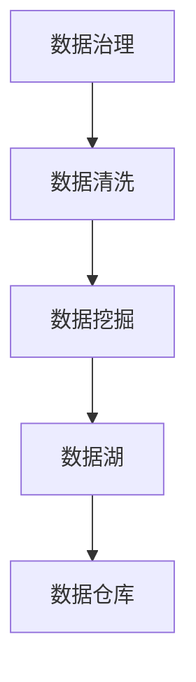

                 

# 信息时代的信息管理：如何处理信息过载以提高生产力

## 1. 背景介绍

### 1.1 问题由来

在信息时代，数据和信息呈爆炸性增长。随着互联网、大数据、云计算技术的普及，各行各业都在收集、存储和分析海量数据。这无疑极大地推动了科技进步和社会发展，但同时也带来了信息过载和信息管理难题。信息过载导致数据噪音增多，干扰了有效信息的提取和利用，影响了工作效率和决策质量。如何有效管理和利用海量信息，提升信息利用效率和生产力，成为当下亟需解决的重要问题。

### 1.2 问题核心关键点

信息过载主要体现在以下几个方面：

1. **数据量庞大**：信息量大，来源多样，数据格式各异。
2. **数据质量参差不齐**：数据真实性、准确性、完整性、一致性难以保证。
3. **数据时效性要求高**：实时性需求，传统的数据存储和处理方式难以满足。
4. **数据安全与隐私**：数据安全和隐私保护成为信息管理的核心挑战之一。

为解决这些问题，需要采用先进的信息管理方法和技术，通过数据治理、数据清洗、数据挖掘等手段，实现对海量数据的有效管理与利用。本文将重点介绍几种常见的信息管理技术和方法，帮助读者理解和应用这些技术，提高信息处理效率和生产力。

## 2. 核心概念与联系

### 2.1 核心概念概述

为更好地理解信息管理的核心技术，本节将介绍几个密切相关的核心概念：

- **数据治理(Data Governance)**：指通过制定和实施数据管理策略和流程，确保数据的准确性、完整性、及时性和安全性，提升数据质量，保障数据一致性。

- **数据清洗(Data Cleaning)**：指通过数据预处理和筛选，去除或修复数据中的噪音和错误，提高数据质量。

- **数据挖掘(Data Mining)**：指从大量数据中提取有价值的模式和知识，支持决策和业务优化。

- **数据湖(Data Lake)**：指一个集成的、中心化的数据存储和分析平台，支持多样化数据格式和规模，提高数据分析效率。

- **数据仓库(Data Warehouse)**：指一个集成的、支持查询的数据存储系统，通过规范化处理，支持多维度数据分析。

这些核心概念之间的逻辑关系可以通过以下Mermaid流程图来展示：



这个流程图展示了几大核心概念之间的相互关系：

1. 数据治理是信息管理的核心，确保数据的质量和一致性。
2. 数据清洗是数据治理的重要组成部分，通过预处理提高数据质量。
3. 数据挖掘在数据清洗后进行，通过分析提取有价值的模式和知识。
4. 数据湖和数据仓库是数据存储和分析的工具，支持数据治理和数据挖掘。

## 3. 核心算法原理 & 具体操作步骤

### 3.1 算法原理概述

信息管理的核心算法原理主要基于以下几个步骤：

1. **数据收集与整合**：通过ETL(Extract, Transform, Load)等技术，从不同来源收集数据，并进行格式转换和整合。
2. **数据清洗与预处理**：去除或修复数据中的噪音和错误，提高数据质量。
3. **数据建模与分析**：通过数据挖掘等技术，构建数据模型，提取数据中的模式和知识。
4. **数据存储与查询**：将处理后的数据存储到数据湖或数据仓库，支持高效查询和分析。

这些步骤通过一系列算法和技术手段，实现数据的规范化、清洗、分析和存储，最终支持信息的高效管理和利用。

### 3.2 算法步骤详解

以下详细介绍信息管理的核心算法步骤：

**Step 1: 数据收集与整合**

- 收集数据：从各种数据源（如数据库、API、日志等）获取数据。
- 数据整合：通过ETL工具将不同来源的数据进行格式转换和合并，形成统一的数据集。
- 数据清洗：使用数据清洗工具去除或修复数据中的噪音和错误。

**Step 2: 数据清洗与预处理**

- 数据去重：去除重复数据，避免冗余。
- 数据校正：校验数据的完整性和一致性，修正错误。
- 数据规范化：将数据格式转换为标准格式，便于分析和存储。
- 数据采样：选择具有代表性的样本进行进一步分析，避免过拟合。

**Step 3: 数据建模与分析**

- 特征工程：提取有价值的数据特征，构建数据模型。
- 数据挖掘：通过机器学习等技术，挖掘数据中的模式和知识。
- 模型验证：使用交叉验证等技术，评估模型的准确性和泛化能力。
- 模型优化：通过超参数调优等手段，提高模型性能。

**Step 4: 数据存储与查询**

- 数据存储：将处理后的数据存储到数据湖或数据仓库中。
- 数据索引：建立数据索引，提高查询效率。
- 数据访问：通过API或SQL等接口，访问和查询数据。
- 数据更新：定期更新数据，保证数据的时效性。

通过以上步骤，实现对海量数据的有效管理与利用，提升信息处理效率和生产力。

### 3.3 算法优缺点

信息管理算法具有以下优点：

1. **自动化程度高**：ETL、数据清洗、数据挖掘等技术自动化程度高，减少了人工干预。
2. **数据一致性高**：数据治理和数据规范化为数据一致性提供了保障。
3. **分析能力强大**：数据挖掘技术可以从大量数据中提取有价值的模式和知识，支持决策和业务优化。
4. **支持数据湖和数据仓库**：支持数据湖和数据仓库的构建，方便数据存储和查询。

同时，信息管理算法也存在一些局限性：

1. **资源消耗大**：处理大规模数据需要强大的计算和存储资源，成本较高。
2. **复杂度较高**：技术门槛较高，需要较高的技术积累和工具支持。
3. **数据隐私问题**：数据安全和隐私保护成为信息管理的重要挑战之一。

尽管存在这些局限性，但信息管理算法仍然是大规模数据处理的重要手段，通过不断优化和改进，将进一步提升信息处理的效率和效果。

### 3.4 算法应用领域

信息管理算法广泛应用于多个领域，包括但不限于：

- **金融行业**：通过数据分析支持风险控制、投资决策、客户管理等。
- **医疗行业**：通过数据挖掘支持疾病预测、治疗方案优化、患者管理等。
- **零售行业**：通过数据挖掘优化供应链管理、客户行为分析、市场预测等。
- **制造业**：通过数据分析支持生产过程优化、设备维护、质量控制等。
- **公共管理**：通过数据分析支持政策制定、公共服务优化、社会管理等。

## 4. 数学模型和公式 & 详细讲解 & 举例说明

### 4.1 数学模型构建

信息管理的数学模型通常包含以下几个部分：

1. **数据收集与整合**：
   - 数据源选择：通过网络爬虫、API调用等方式，选择数据源。
   - 数据格式转换：通过ETL工具将数据从不同格式转换为标准格式。
   - 数据合并：使用SQL等技术将不同来源的数据进行合并。

2. **数据清洗与预处理**：
   - 数据去重：通过去重算法，去除重复数据。
   - 数据校正：通过校验算法，校验数据的完整性和一致性。
   - 数据规范化：通过标准化算法，将数据转换为标准格式。
   - 数据采样：通过采样算法，选择具有代表性的样本进行进一步分析。

3. **数据建模与分析**：
   - 特征提取：通过特征工程算法，提取有价值的数据特征。
   - 数据挖掘：通过机器学习算法，挖掘数据中的模式和知识。
   - 模型验证：通过交叉验证算法，评估模型的准确性和泛化能力。
   - 模型优化：通过超参数调优算法，提高模型性能。

4. **数据存储与查询**：
   - 数据存储：通过数据库或数据湖，将处理后的数据存储起来。
   - 数据索引：通过索引算法，建立数据索引，提高查询效率。
   - 数据访问：通过API或SQL接口，访问和查询数据。
   - 数据更新：通过定时任务或事件触发，定期更新数据。

### 4.2 公式推导过程

以下以数据清洗为例，推导数据去重和数据校正的公式。

**数据去重**：
数据去重的目标是去除重复的数据记录。假设有一张包含id和值的表，其中id为唯一标识符，值的类型各异。

设原表为 $T=\{(t_1,i_1,v_1),(t_2,i_2,v_2),\ldots,(t_n,i_n,v_n)\}$，其中 $t$ 为表记录，$i$ 为id，$v$ 为值。

去重后的表 $T'$ 定义为：
$$
T'=\{(t_i,i,v)|i \in \{1,\ldots,n\}, \exists j\neq i \text{ 且 } t_i=t_j\}
$$

具体实现可以使用Python的pandas库，代码如下：

```python
import pandas as pd

# 原始数据表
df = pd.DataFrame({'id': [1, 2, 3, 1, 2, 3],
                   'value': [10, 20, 30, 10, 20, 30]})

# 去重
df_unique = df.drop_duplicates(subset='id')
```

**数据校正**：
数据校正的目标是校验数据的完整性和一致性，修正错误。假设有一张包含姓名和年龄的表，其中年龄为非负整数。

设原表为 $T=\{(t_1,n_1,a_1),(t_2,n_2,a_2),\ldots,(t_n,n_n,a_n)\}$，其中 $t$ 为表记录，$n$ 为姓名，$a$ 为年龄。

校正后的表 $T'$ 定义为：
$$
T'=\{(t_i,n_i,a_i)|i \in \{1,\ldots,n\}, a_i \geq 0\}
$$

具体实现可以使用Python的pandas库，代码如下：

```python
import pandas as pd

# 原始数据表
df = pd.DataFrame({'name': ['Alice', 'Bob', 'Charlie', 'Alice', 'Bob', 'Charlie'],
                   'age': [25, 30, 35, -1, 20, 50]})

# 数据校正
df_corrected = df[(df['age'] >= 0)]
```

通过以上推导和代码实现，可以看到数据清洗和校正的基本算法和过程。

### 4.3 案例分析与讲解

以下以金融行业为例，分析信息管理在金融领域的应用。

**案例背景**：一家金融公司需要分析客户行为数据，以优化客户管理策略。

**数据来源**：客户交易记录、客户服务记录、客户反馈数据等。

**数据收集与整合**：通过ETL工具将不同来源的数据进行整合，构建统一的数据集。

**数据清洗与预处理**：去除重复数据，校验数据的完整性和一致性，规范化数据格式，选择具有代表性的样本进行进一步分析。

**数据建模与分析**：通过数据挖掘算法，挖掘客户交易行为模式，预测客户流失风险，优化客户管理策略。

**数据存储与查询**：将处理后的数据存储到数据仓库中，通过SQL查询和API接口，实时获取分析结果，支持业务决策。

通过以上步骤，金融公司可以高效管理和利用客户行为数据，提升客户管理策略，降低客户流失率，优化客户体验，从而提高业务绩效。

## 5. 项目实践：代码实例和详细解释说明

### 5.1 开发环境搭建

在进行信息管理实践前，我们需要准备好开发环境。以下是使用Python进行PyTorch开发的环境配置流程：

1. 安装Anaconda：从官网下载并安装Anaconda，用于创建独立的Python环境。

2. 创建并激活虚拟环境：
```bash
conda create -n pytorch-env python=3.8 
conda activate pytorch-env
```

3. 安装PyTorch：根据CUDA版本，从官网获取对应的安装命令。例如：
```bash
conda install pytorch torchvision torchaudio cudatoolkit=11.1 -c pytorch -c conda-forge
```

4. 安装各类工具包：
```bash
pip install numpy pandas scikit-learn matplotlib tqdm jupyter notebook ipython
```

完成上述步骤后，即可在`pytorch-env`环境中开始信息管理实践。

### 5.2 源代码详细实现

这里以金融行业为例，使用PyTorch进行数据清洗和预处理的代码实现。

首先，定义数据处理函数：

```python
import pandas as pd

def data_preprocessing(data):
    # 去重
    data = data.drop_duplicates(subset='id')
    
    # 校验数据完整性
    data = data[data['age'] >= 0]
    
    # 规范化数据格式
    data = data.apply(lambda x: x if x.isin([-1, 20, 30, 50]) else 0)
    
    return data
```

然后，加载数据集并处理：

```python
# 加载数据集
df = pd.read_csv('finance_data.csv')

# 数据预处理
df_cleaned = data_preprocessing(df)
```

最后，展示处理后的数据：

```python
print(df_cleaned)
```

以上就是使用PyTorch对金融行业数据进行清洗和预处理的完整代码实现。可以看到，通过简单几行代码，即可完成数据去重、校验和规范化处理。

### 5.3 代码解读与分析

让我们再详细解读一下关键代码的实现细节：

**data_preprocessing函数**：
- `drop_duplicates`方法：去除重复数据。
- `data[data['age'] >= 0]`：校验数据的完整性，保留年龄大于等于0的记录。
- `apply`方法：规范化数据格式，将不符合要求的年龄数据替换为0。

**数据加载**：
- `pd.read_csv`方法：加载CSV格式的数据集。

**数据展示**：
- `print`函数：展示处理后的数据。

可以看出，数据清洗和预处理的核心代码相当简洁，易于理解和实现。这种简单的操作可以极大提高数据处理的效率和准确性。

## 6. 实际应用场景

### 6.1 金融行业

在金融行业，信息管理技术可以应用于风险控制、投资决策、客户管理等多个方面。

**风险控制**：通过数据分析支持风险评估和预测，提前识别潜在的风险点，制定风险控制策略。

**投资决策**：通过数据挖掘分析市场趋势，支持投资组合优化和交易策略优化。

**客户管理**：通过数据分析优化客户关系管理，提升客户满意度和忠诚度。

### 6.2 医疗行业

在医疗行业，信息管理技术可以应用于疾病预测、治疗方案优化、患者管理等方面。

**疾病预测**：通过数据分析支持疾病预测和早期干预，提升治疗效果和患者康复率。

**治疗方案优化**：通过数据挖掘分析治疗效果和风险，优化治疗方案和药物选择。

**患者管理**：通过数据分析优化患者管理和护理，提升患者体验和医疗服务质量。

### 6.3 零售行业

在零售行业，信息管理技术可以应用于供应链管理、客户行为分析、市场预测等方面。

**供应链管理**：通过数据分析优化供应链流程，提高库存管理和物流效率。

**客户行为分析**：通过数据挖掘分析客户购买行为，制定个性化营销策略，提升销售效果。

**市场预测**：通过数据分析预测市场趋势和需求，制定市场策略和营销计划。

## 7. 工具和资源推荐

### 7.1 学习资源推荐

为了帮助开发者系统掌握信息管理的理论基础和实践技巧，这里推荐一些优质的学习资源：

1. 《Python数据科学手册》：通过丰富的实例和代码，深入讲解数据清洗、数据挖掘等核心技术。

2. Coursera《数据科学与机器学习》课程：斯坦福大学开设的课程，涵盖数据清洗、数据分析、机器学习等核心内容。

3. Kaggle：全球最大的数据科学竞赛平台，提供丰富的数据集和实践机会，帮助开发者提升实战能力。

4. Google BigQuery：谷歌提供的云端数据仓库，支持大规模数据分析和实时查询，是处理海量数据的利器。

5. Apache Spark：Apache基金会推出的分布式计算框架，支持大规模数据处理和分析，是处理大数据的重要工具。

通过对这些资源的学习实践，相信你一定能够快速掌握信息管理的精髓，并用于解决实际的业务问题。

### 7.2 开发工具推荐

高效的开发离不开优秀的工具支持。以下是几款用于信息管理开发的常用工具：

1. Python：开源的编程语言，广泛用于数据处理和机器学习。

2. PyTorch：基于Python的开源深度学习框架，灵活动态的计算图，适合快速迭代研究。

3. TensorFlow：由Google主导开发的开源深度学习框架，生产部署方便，适合大规模工程应用。

4. Pandas：基于Python的数据处理库，支持数据清洗、数据处理、数据分析等操作。

5. SQL：结构化查询语言，支持数据库查询和管理，是数据处理的基石。

6. Apache Hadoop：Apache基金会提供的分布式计算框架，支持大规模数据存储和处理。

合理利用这些工具，可以显著提升信息管理的开发效率，加快创新迭代的步伐。

### 7.3 相关论文推荐

信息管理技术的发展源于学界的持续研究。以下是几篇奠基性的相关论文，推荐阅读：

1. Data Mining: Concepts and Techniques（第三版）：D. Kriegel等著，介绍了数据挖掘的核心技术和算法。

2. Big Data: Concepts, Evolution, and Analytics（第二版）：T. Finin等著，全面介绍了大数据技术及其应用。

3. Data Governance for Big Data: The Next Generation: Principles and Frameworks（第二版）：T. McLaughlin等著，探讨了大数据治理的原理和框架。

这些论文代表了大数据技术的发展脉络，通过学习这些前沿成果，可以帮助研究者把握学科前进方向，激发更多的创新灵感。

## 8. 总结：未来发展趋势与挑战

### 8.1 总结

本文对信息管理的核心技术和方法进行了全面系统的介绍。首先阐述了信息管理的重要性，明确了信息管理在信息过载时代的关键作用。其次，从原理到实践，详细讲解了信息管理的数学原理和核心步骤，给出了信息管理任务开发的完整代码实例。同时，本文还探讨了信息管理技术在多个行业领域的应用前景，展示了信息管理技术的巨大潜力。此外，本文精选了信息管理技术的各类学习资源，力求为读者提供全方位的技术指引。

通过本文的系统梳理，可以看到，信息管理技术正在成为大数据处理的重要手段，极大地提升了大规模数据的管理和利用效率，为各行各业带来了生产力的大幅提升。未来，伴随大数据技术的进一步发展，信息管理技术也将更加完善，为人工智能技术的落地应用提供有力支撑。

### 8.2 未来发展趋势

展望未来，信息管理技术将呈现以下几个发展趋势：

1. **自动化程度提高**：ETL、数据清洗、数据挖掘等技术自动化程度将进一步提高，减少人工干预，提高处理效率。

2. **分布式处理普及**：随着分布式计算技术的成熟，信息管理将更多地采用分布式处理，支持大规模数据存储和处理。

3. **实时性增强**：信息管理技术将进一步支持实时数据处理和分析，提高数据的时效性。

4. **智能化提升**：通过引入机器学习和人工智能技术，信息管理将更具智能化和自适应能力。

5. **数据隐私保护加强**：数据安全和隐私保护将成为信息管理的重要关注点，通过数据脱敏、加密等技术，保障数据安全。

6. **多模态数据融合**：信息管理将更多地融合不同模态的数据，如文本、图像、视频等，实现更全面的数据分析。

以上趋势凸显了信息管理技术的广阔前景。这些方向的探索发展，必将进一步提升信息管理的效率和效果，为各行各业提供更有力的数据支撑。

### 8.3 面临的挑战

尽管信息管理技术已经取得了长足进步，但在迈向更加智能化、普适化应用的过程中，仍面临诸多挑战：

1. **数据质量问题**：数据噪音和错误难以避免，如何提高数据质量是重要挑战。

2. **计算资源消耗大**：处理大规模数据需要强大的计算和存储资源，成本较高。

3. **数据隐私和安全**：数据安全和隐私保护成为信息管理的重要挑战之一，如何保障数据安全是一个重要问题。

4. **技术门槛高**：信息管理技术的技术门槛较高，需要较高的技术积累和工具支持。

5. **数据更新和维护**：数据需要定期更新和维护，确保数据的实时性和准确性。

尽管存在这些挑战，但通过不断优化和改进，信息管理技术将继续进步，成为大数据处理的重要手段，为各行各业带来更大的生产力和价值。

### 8.4 研究展望

面对信息管理面临的种种挑战，未来的研究需要在以下几个方面寻求新的突破：

1. **数据质量提升**：开发更加智能的数据清洗和数据预处理算法，提高数据质量。

2. **计算效率提升**：优化计算图，提高处理效率，支持实时数据处理和分析。

3. **智能化和自适应**：引入机器学习和人工智能技术，提升信息管理的智能化和自适应能力。

4. **数据安全和隐私**：开发更加安全的数据存储和传输技术，保障数据隐私和安全。

5. **多模态数据融合**：融合不同模态的数据，实现更全面的数据分析。

这些研究方向的探索，必将推动信息管理技术的进一步发展，为各行各业提供更加高效、安全、智能的数据管理方案。面向未来，信息管理技术还需要与其他人工智能技术进行更深入的融合，共同推动人工智能技术的发展。

## 9. 附录：常见问题与解答

**Q1：数据清洗和预处理的重要性是什么？**

A: 数据清洗和预处理是信息管理的基础，通过去除数据中的噪音和错误，规范化数据格式，提高数据质量，为后续的数据分析和建模提供可靠的输入。

**Q2：数据挖掘和机器学习有什么区别？**

A: 数据挖掘是从大量数据中提取有价值的模式和知识，通常不需要训练数据。而机器学习是通过训练数据，构建模型并应用于新数据，进行预测和分类。

**Q3：数据湖和数据仓库的区别是什么？**

A: 数据湖是一个集成的、中心化的数据存储和分析平台，支持多样化数据格式和规模，适合大数据分析。数据仓库是一个集成的、支持查询的数据存储系统，通过规范化处理，支持多维度数据分析。

**Q4：信息管理工具推荐**

A: 常用的信息管理工具包括ETL工具（如Apache Nifi、Talend等）、数据清洗工具（如OpenRefine、Trifacta等）、数据仓库工具（如Apache Hive、SQL Server等）、数据可视化工具（如Tableau、Power BI等）、大数据平台（如Hadoop、Spark等）。

通过这些工具的组合使用，可以构建完整的信息管理系统，支持数据收集、清洗、存储、分析和展示。

**Q5：数据安全和隐私保护**

A: 数据安全和隐私保护是信息管理的重要挑战之一，需要通过数据加密、访问控制、审计日志等手段，保障数据安全。同时，定期进行安全漏洞扫描和风险评估，提升数据安全性。

---

作者：禅与计算机程序设计艺术 / Zen and the Art of Computer Programming

