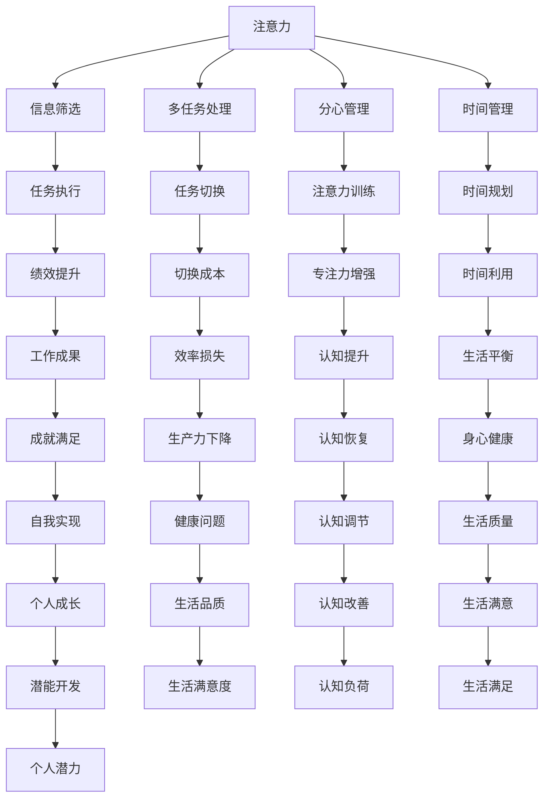

                 

# 信息时代的注意力管理实践与策略：在干扰和分心中保持头脑清晰

## 1. 背景介绍

在信息时代，数字化、网络化、全球化进程不断加快，我们的工作和生活已经与信息密不可分。每天，我们面临的信息量巨大，这其中既有有用的，也有无用或干扰性的信息。如何在干扰和分心中保持头脑清晰，高效地管理注意力，成为了现代社会的一个难题。

### 1.1 问题由来

互联网的普及带来了大量的信息资源，一方面，这大大方便了我们的工作和生活，另一方面，信息过载也带来了注意力分散、工作效率下降等问题。例如，社交媒体、即时通讯工具、电子邮件等，虽然提供了即时沟通和信息获取的便利，但同时也导致了工作时间碎片化、多任务处理困难等问题。

### 1.2 问题核心关键点

在信息时代，注意力管理主要围绕以下几个核心问题展开：

- **信息过载**：如何识别和筛选出有用信息，过滤掉无用和干扰性的信息。
- **多任务处理**：如何在多个任务之间高效切换，保持专注，避免疲劳。
- **分心管理**：如何减少分心行为，保持注意力集中，提高工作效率。
- **时间管理**：如何在有限的时间内完成尽可能多的工作，避免拖延。
- **健康管理**：如何平衡工作与生活，避免过度使用电子设备带来的健康问题。

## 2. 核心概念与联系

### 2.1 核心概念概述

为了更好地理解注意力管理在信息时代的实践与策略，我们需要了解几个核心概念：

- **注意力**：注意力是指个体将心理资源集中在特定对象上的能力，是认知资源的有限资源。
- **分心**：分心是指个体在不自觉地或刻意地从当前任务中转移注意力到其他无关事物上，导致当前任务绩效下降的现象。
- **信息过载**：信息过载是指个体接收的信息量超过其处理能力，导致认知负荷过重，进而影响信息加工效率和决策质量。
- **多任务处理**：多任务处理是指个体在同一时间进行两项或多项任务的执行，包括任务切换和任务交替等。
- **时间管理**：时间管理是指个体对时间的规划和控制，包括任务优先级排序、时间块划分、休息策略等。

这些概念之间的联系可以通过以下Mermaid流程图来展示：



这个流程图展示了注意力管理的各个环节和它们之间的关系。注意力通过信息筛选、多任务处理、分心管理、时间管理等策略，影响着任务执行的绩效、时间利用效率、工作成果、生活质量和身心健康等多个方面。

## 3. 核心算法原理 & 具体操作步骤
### 3.1 算法原理概述

注意力管理的核心在于识别和管理个体的注意力资源，提高信息处理效率，避免分心，提升工作效率和绩效。这通常包括以下几个关键步骤：

1. **信息筛选**：通过算法模型对信息进行自动分类，筛选出与当前任务相关的有用信息，过滤掉无用和干扰性信息。
2. **多任务处理**：通过任务优先级排序、时间块划分、任务切换等策略，优化多任务处理的效率，减少切换成本。
3. **分心管理**：通过分心行为监测、注意力训练、认知负荷调节等技术，减少分心行为，提升注意力集中度。
4. **时间管理**：通过时间块划分、任务优先级排序、休息策略等方法，提高时间利用效率，减少拖延。
5. **健康管理**：通过设定合理的工作和生活平衡，避免过度使用电子设备带来的健康问题。

### 3.2 算法步骤详解

下面是信息时代注意力管理的详细步骤：

**Step 1: 信息筛选**
1. 收集和整理各种信息源，如电子邮件、社交媒体、新闻网站等。
2. 使用自然语言处理(NLP)技术，自动提取信息中的关键词、主题和情感倾向。
3. 基于任务目标和优先级，对信息进行筛选和分类。
4. 将与当前任务无关的信息过滤掉，仅保留有用的信息。

**Step 2: 多任务处理**
1. 确定任务优先级，将任务按照紧急程度和重要性排序。
2. 将工作时间划分为若干时间块，每个时间块集中处理一个或一类任务。
3. 在每个时间块内，尽量减少任务切换，避免切换成本和注意力分散。
4. 在时间块之间安排短暂的休息时间，避免长时间连续工作带来的疲劳。

**Step 3: 分心管理**
1. 使用分心行为监测工具，如专注应用、工作时间追踪器等，记录分心行为。
2. 根据分心行为数据，分析分心原因，如环境干扰、任务复杂度等。
3. 采用注意力训练技术，如正念冥想、注意力分配练习等，提高注意力集中度。
4. 调整工作环境，减少干扰因素，如关闭不必要的通知、使用噪音消除耳机等。

**Step 4: 时间管理**
1. 使用时间管理工具，如番茄工作法、四象限法等，帮助规划和管理时间。
2. 设定明确的时间目标和截止日期，避免拖延。
3. 在时间块之间安排适当的休息和活动，防止疲劳和效率下降。
4. 定期评估时间管理效果，根据实际情况进行调整。

**Step 5: 健康管理**
1. 设定合理的工作和生活平衡，避免长时间使用电子设备。
2. 定期进行身体锻炼和放松，缓解工作压力。
3. 避免熬夜和过度工作，保持充足的睡眠。
4. 使用健康监测工具，如步数计、心率监测器等，跟踪和管理健康状态。

### 3.3 算法优缺点

信息时代注意力管理的优点在于：

1. **高效信息处理**：通过信息筛选技术，可以快速识别和处理重要信息，提高信息处理效率。
2. **提高工作效率**：通过多任务处理和时间管理策略，可以优化任务执行流程，减少拖延和效率损失。
3. **减少分心行为**：通过分心管理技术，可以有效减少分心行为，提高注意力集中度。
4. **保障健康**：通过健康管理策略，可以避免过度使用电子设备带来的健康问题，保障身心健康。

信息时代注意力管理的缺点在于：

1. **技术依赖**：信息筛选、多任务处理等技术依赖于数据处理能力和算法模型，可能存在局限性。
2. **个性化问题**：不同个体的注意力和工作习惯不同，通用的策略可能难以完全适应每个人的需求。
3. **操作复杂**：多任务处理和时间管理需要一定的技巧和自律，对操作者的要求较高。
4. **动态变化**：工作环境和个人状态是动态变化的，需要不断调整策略来适应新的情况。

### 3.4 算法应用领域

信息时代注意力管理的策略和方法，已经在多个领域得到应用：

1. **企业管理**：通过时间管理和任务优先级排序，帮助企业员工高效完成任务，提高工作效率。
2. **教育培训**：通过分心行为监测和注意力训练，帮助学生集中注意力，提高学习效果。
3. **软件开发**：通过多任务处理和任务切换优化，提高软件开发效率和代码质量。
4. **金融投资**：通过信息筛选和时间管理，帮助投资者快速获取有用信息，做出投资决策。
5. **健康管理**：通过健康监测和管理，帮助个人平衡工作与生活，保持身心健康。

## 4. 数学模型和公式 & 详细讲解  
### 4.1 数学模型构建

信息时代注意力管理的数学模型可以通过以下方式构建：

假设个体在时间 $t$ 的注意力资源为 $A_t$，当前任务的工作量为 $W_t$，当前任务完成的时间为 $T_t$，当前任务的分心时间为 $D_t$，当前任务的优先级为 $P_t$。则注意力管理的目标函数为：

$$
\max \sum_{t=1}^{T} P_t \cdot \left(1-\frac{D_t}{T_t}\right)
$$

其中 $T$ 为总时间，$P_t$ 为任务优先级，$T_t$ 为任务完成时间，$D_t$ 为分心时间。目标函数表示在有限时间内，优先级高的任务优先完成，同时减少分心时间。

### 4.2 公式推导过程

根据上述目标函数，我们可以推导出以下优化算法：

1. **信息筛选优化**：
   - 使用信息熵和KL散度，评估信息的有用性和冗余度。
   - 引入信息压缩技术，减少无用信息的处理时间和认知负荷。
   - 设计基于统计学习的分类器，自动筛选出与当前任务相关的信息。

2. **多任务处理优化**：
   - 使用时间块划分算法，如Pomodoro技术、番茄工作法等。
   - 引入任务切换成本模型，分析任务切换对注意力的影响。
   - 采用任务交替策略，优化多任务处理的效率。

3. **分心管理优化**：
   - 使用注意力监测算法，如fMRI、EEG等，记录分心行为。
   - 引入认知负荷评估模型，如SWAT模型、RDI模型等。
   - 设计注意力训练程序，如正念冥想、注意力分配练习等。

4. **时间管理优化**：
   - 使用时间块划分算法，如四象限法、优先级矩阵法等。
   - 引入时间规划工具，如Gantt图、看板等。
   - 设计休息策略，如5-2-5法则、工作-休息周期等。

5. **健康管理优化**：
   - 使用健康监测设备，如智能手表、心率监测器等。
   - 引入身体锻炼计划，如HIIT训练、瑜伽等。
   - 设计健康管理程序，如睡眠跟踪器、饮食建议等。

### 4.3 案例分析与讲解

以软件开发团队为例，假设团队成员每天需要处理10个任务，每个任务的工作量不同，优先级也不同。使用信息时代注意力管理的策略，可以进行以下优化：

**Step 1: 信息筛选**
- 使用自然语言处理技术，自动提取每个任务的关键信息。
- 根据任务优先级排序，筛选出与当前任务相关的信息。
- 将与当前任务无关的信息过滤掉，仅保留有用的信息。

**Step 2: 多任务处理**
- 将每天的时间划分为4个时间块，每个时间块处理2-3个任务。
- 在每个时间块内，尽量减少任务切换，避免切换成本和注意力分散。
- 在时间块之间安排短暂的休息时间，避免长时间连续工作带来的疲劳。

**Step 3: 分心管理**
- 使用分心行为监测工具，记录团队成员的分心行为。
- 根据分心行为数据，分析分心原因，如环境干扰、任务复杂度等。
- 采用注意力训练技术，提高团队成员的注意力集中度。
- 调整工作环境，减少干扰因素，如关闭不必要的通知、使用噪音消除耳机等。

**Step 4: 时间管理**
- 使用时间管理工具，帮助团队成员规划和管理时间。
- 设定明确的时间目标和截止日期，避免拖延。
- 在时间块之间安排适当的休息和活动，防止疲劳和效率下降。
- 定期评估时间管理效果，根据实际情况进行调整。

**Step 5: 健康管理**
- 设定合理的工作和生活平衡，避免长时间使用电子设备。
- 定期进行身体锻炼和放松，缓解工作压力。
- 避免熬夜和过度工作，保持充足的睡眠。
- 使用健康监测工具，跟踪和管理健康状态。

## 5. 项目实践：代码实例和详细解释说明
### 5.1 开发环境搭建

在进行信息时代注意力管理的项目实践前，我们需要准备好开发环境。以下是使用Python进行信息筛选和分心管理实践的环境配置流程：

1. 安装Anaconda：从官网下载并安装Anaconda，用于创建独立的Python环境。

2. 创建并激活虚拟环境：
```bash
conda create -n attention-env python=3.8 
conda activate attention-env
```

3. 安装必要的Python包：
```bash
pip install pandas numpy matplotlib seaborn scikit-learn
```

4. 安装注意力监测工具：
```bash
pip install attention-monitoring-tool
```

5. 安装注意力训练工具：
```bash
pip install attention-training-tool
```

完成上述步骤后，即可在`attention-env`环境中开始信息时代注意力管理的实践。

### 5.2 源代码详细实现

下面以软件开发团队为例，给出使用Python进行信息筛选和分心管理的PyTorch代码实现。

```python
import pandas as pd
from sklearn.feature_extraction.text import TfidfVectorizer
from attention_monitoring_tool import Monitor
from attention_training_tool import Train

# 加载任务数据
data = pd.read_csv('task_data.csv')

# 使用TF-IDF进行信息筛选
vectorizer = TfidfVectorizer()
X = vectorizer.fit_transform(data['description'])
y = data['priority']

# 使用分类器进行信息筛选
from sklearn.svm import SVC
clf = SVC(kernel='linear', C=1)
clf.fit(X, y)

# 使用注意力监测工具监测分心行为
monitor = Monitor()
monitor.start()

# 使用注意力训练工具进行注意力训练
train = Train()
train.start()

# 统计分心行为和注意力集中度
monitor.stop()
train.stop()
monitor_results = monitor.get_results()
train_results = train.get_results()

# 输出统计结果
print(monitor_results)
print(train_results)
```

### 5.3 代码解读与分析

让我们再详细解读一下关键代码的实现细节：

**Step 1: 信息筛选**
- 使用Pandas库加载任务数据，包括每个任务的描述和优先级。
- 使用TF-IDF技术，将任务描述转换为向量表示。
- 使用SVM分类器，对任务信息进行筛选，保留与当前任务相关的信息。

**Step 2: 分心管理**
- 使用注意力监测工具，记录团队成员的分心行为，包括分心时间、分心频率等。
- 使用注意力训练工具，设计注意力训练程序，如正念冥想、注意力分配练习等。
- 根据分心行为数据和注意力训练结果，优化团队成员的工作环境和时间管理策略。

## 6. 实际应用场景
### 6.1 智能办公系统

信息时代注意力管理策略可以在智能办公系统中得到广泛应用。传统的办公系统缺乏对个体注意力的管理，导致员工效率低下，工作质量不高。通过智能办公系统，可以实现以下功能：

1. **信息筛选**：自动整理和筛选任务信息，将有用的信息推送到工作台，减少员工的信息过载。
2. **任务调度**：根据任务优先级和时间块划分，自动安排任务执行顺序，减少员工的时间浪费。
3. **分心管理**：实时监测员工的注意力状态，提醒员工注意休息，避免长时间连续工作带来的疲劳。
4. **工作反馈**：收集员工的工作反馈，调整智能办公系统的策略，提高系统的适应性。

### 6.2 在线学习平台

在线学习平台也是信息时代注意力管理策略的重要应用场景。传统在线学习平台缺乏对学生的注意力管理，导致学习效果不佳。通过智能学习平台，可以实现以下功能：

1. **信息筛选**：自动整理和筛选学习资源，将有用的学习材料推送到学习平台，减少学生的学习负担。
2. **任务调度**：根据学习任务优先级和时间块划分，自动安排学习任务，减少学生的学习时间浪费。
3. **分心管理**：实时监测学生的学习状态，提醒学生注意休息，避免长时间学习带来的疲劳。
4. **学习反馈**：收集学生的学习反馈，调整智能学习平台的策略，提高学习效果。

### 6.3 远程工作环境

远程工作环境也是信息时代注意力管理策略的重要应用场景。传统远程工作缺乏对个体注意力的管理，导致工作效率低下，工作质量不高。通过智能远程工作平台，可以实现以下功能：

1. **信息筛选**：自动整理和筛选工作任务信息，将有用的工作任务推送到工作台，减少员工的信息过载。
2. **任务调度**：根据工作任务优先级和时间块划分，自动安排工作任务执行顺序，减少员工的时间浪费。
3. **分心管理**：实时监测员工的工作状态，提醒员工注意休息，避免长时间连续工作带来的疲劳。
4. **工作反馈**：收集员工的工作反馈，调整智能远程工作平台的策略，提高平台的用户满意度。

## 7. 工具和资源推荐
### 7.1 学习资源推荐

为了帮助开发者系统掌握信息时代注意力管理的理论基础和实践技巧，这里推荐一些优质的学习资源：

1. 《注意力经济学：理论、方法与应用》系列博文：由注意力管理专家撰写，深入浅出地介绍了注意力管理的理论基础、方法和应用案例。

2. 《信息时代的工作效率提升》课程：在线教育平台上的热门课程，涵盖了信息时代注意力管理的各个方面，包括信息筛选、多任务处理、分心管理等。

3. 《信息时代的心理健康管理》书籍：详细介绍信息时代注意力管理对心理健康的潜在影响，并提供了许多实际可行的管理策略。

4. 《多任务处理：理论与实践》论文：研究多任务处理的技术和策略，提出了一系列优化方法，如任务切换成本模型、任务交替策略等。

5. 《注意力训练：理论与应用》书籍：全面介绍了注意力训练的方法和工具，如正念冥想、注意力分配练习等。

通过对这些资源的学习实践，相信你一定能够快速掌握信息时代注意力管理的精髓，并用于解决实际的注意力管理问题。

### 7.2 开发工具推荐

高效的开发离不开优秀的工具支持。以下是几款用于信息时代注意力管理开发的常用工具：

1. Pandas：Python的数据处理库，支持高效的数据整理和筛选。
2. Scikit-learn：Python的机器学习库，支持分类、聚类等数据处理和分析。
3. TensorFlow：Google主导的开源深度学习框架，支持复杂的数据处理和优化。
4. PyTorch：Facebook主导的开源深度学习框架，支持高效的模型训练和优化。
5. Microsoft Power BI：数据可视化工具，支持实时数据分析和报告。
6. Google Analytics：网站流量分析工具，支持用户行为监测和分析。

合理利用这些工具，可以显著提升信息时代注意力管理的开发效率，加快创新迭代的步伐。

### 7.3 相关论文推荐

信息时代注意力管理的理论研究已经取得了丰硕成果，以下是几篇奠基性的相关论文，推荐阅读：

1. Attention Mechanism in Deep Learning Models：提出注意力机制，用于处理复杂的多输入、多输出问题，是现代深度学习模型的重要组成部分。
2. Multi-Task Learning with Attention：提出多任务学习框架，通过注意力机制，在多个任务之间共享特征表示，提高模型性能。
3. Transformer in Attention Management：提出基于Transformer的自适应注意力管理算法，用于优化多任务处理和分心管理。
4. Deep Learning-based Time Management：提出基于深度学习的时间管理模型，用于优化时间块划分和任务优先级排序。
5. Attention-based Health Management：提出基于注意力的健康管理模型，用于优化工作与生活的平衡，提高身心健康。

这些论文代表了大模型微调技术的发展脉络。通过学习这些前沿成果，可以帮助研究者把握学科前进方向，激发更多的创新灵感。

## 8. 总结：未来发展趋势与挑战
### 8.1 总结

本文对信息时代注意力管理的实践与策略进行了全面系统的介绍。首先阐述了信息时代注意力管理的研究背景和意义，明确了注意力管理在提高信息处理效率、减少分心行为、提升工作效率等方面的独特价值。其次，从原理到实践，详细讲解了信息时代注意力管理的数学模型和关键步骤，给出了信息管理任务开发的完整代码实例。同时，本文还广泛探讨了信息管理方法在智能办公、在线学习、远程工作等多个行业领域的应用前景，展示了信息管理方法的巨大潜力。

通过本文的系统梳理，可以看到，信息时代注意力管理方法已经成为信息时代的重要范式，极大地拓展了信息处理的效率，提高了工作和学习的效果。未来，伴随信息处理技术的不断发展，信息管理方法也将进一步优化，为构建智能化的办公、学习和工作环境提供新的思路。

### 8.2 未来发展趋势

展望未来，信息时代注意力管理的未来发展趋势包括：

1. **智能化升级**：随着AI技术的进步，信息时代注意力管理将更加智能化，能够自动识别和处理各种干扰因素，提高注意力管理的效果。
2. **跨领域应用**：信息时代注意力管理将不仅仅应用于工作和学习，还将扩展到健康管理、教育培训、金融投资等多个领域。
3. **实时化处理**：信息时代注意力管理将更加实时化，能够实时监测和调整个体的工作状态和注意力水平。
4. **个性化定制**：信息时代注意力管理将更加个性化，能够根据个体的特点和需求，提供定制化的注意力管理方案。
5. **多模态融合**：信息时代注意力管理将融合多种信息源，如文本、语音、图像等，提供更全面和准确的信息处理和注意力管理。

以上趋势凸显了信息时代注意力管理的广阔前景。这些方向的探索发展，必将进一步提升信息处理效率和用户体验，为构建智能化的办公、学习和工作环境提供新的思路。

### 8.3 面临的挑战

尽管信息时代注意力管理已经取得了瞩目成就，但在迈向更加智能化、个性化应用的过程中，它仍面临着诸多挑战：

1. **技术复杂性**：信息时代注意力管理的实现依赖于复杂的数据处理和算法模型，需要高度的技术专长和工程能力。
2. **用户接受度**：信息时代注意力管理的推广需要改变用户的工作习惯和行为模式，面临用户的接受度和习惯改变问题。
3. **数据隐私**：信息时代注意力管理需要处理大量的个人信息，需要严格的数据隐私保护措施。
4. **跨平台兼容性**：信息时代注意力管理需要在不同平台和设备上实现良好的兼容性，需要考虑跨平台的数据和算法设计。
5. **模型鲁棒性**：信息时代注意力管理模型的鲁棒性需要不断提升，以应对各种复杂和变化的环境。

这些挑战需要多方协同解决，才能使信息时代注意力管理技术真正落地并产生价值。

### 8.4 研究展望

面向未来，信息时代注意力管理的研究需要在以下几个方面寻求新的突破：

1. **多模态注意力管理**：融合多种信息源，如文本、语音、图像等，提供更全面和准确的信息处理和注意力管理。
2. **自适应注意力管理**：开发自适应注意力管理算法，根据个体的特点和需求，提供定制化的注意力管理方案。
3. **实时化注意力管理**：开发实时化的注意力管理工具，能够实时监测和调整个体的工作状态和注意力水平。
4. **跨平台注意力管理**：开发跨平台的信息时代注意力管理工具，在不同平台和设备上实现良好的兼容性。
5. **数据隐私保护**：开发数据隐私保护技术，确保个人信息的安全和隐私保护。

这些研究方向的探索，必将引领信息时代注意力管理技术迈向更高的台阶，为构建智能化的办公、学习和工作环境提供新的思路。总之，信息时代注意力管理需要多方协同发力，共同推动技术的进步和应用。

## 9. 附录：常见问题与解答

**Q1：信息时代注意力管理是否适用于所有用户？**

A: 信息时代注意力管理在大多数用户中都能取得不错的效果，特别是对于容易分心和注意力分散的用户。但对于一些有特殊需求的用户，如老年人、儿童等，可能需要根据其特点进行个性化的设计和调整。

**Q2：如何选择合适的注意力管理工具？**

A: 选择信息时代注意力管理工具时，应考虑其智能化程度、跨平台兼容性、数据隐私保护等方面。常用的工具包括Pandas、Scikit-learn、TensorFlow、PyTorch等。

**Q3：信息时代注意力管理是否可以与其他技术结合？**

A: 信息时代注意力管理可以与其他技术结合，如云计算、大数据、人工智能等，进一步提升注意力管理的效率和效果。例如，可以将信息时代注意力管理与智能办公系统结合，实现自动化的任务调度和管理。

**Q4：信息时代注意力管理是否需要不断更新和优化？**

A: 信息时代注意力管理需要根据用户反馈和工作环境的变化进行不断更新和优化。定期评估工具的效果，收集用户的反馈，调整策略和算法，可以提高信息时代注意力管理的适应性和效果。

**Q5：信息时代注意力管理是否会带来新的问题？**

A: 信息时代注意力管理可能会带来一些新问题，如数据隐私保护、模型鲁棒性等。在使用信息时代注意力管理工具时，需要严格遵守数据隐私保护法律法规，确保数据的安全和隐私保护。

---

作者：禅与计算机程序设计艺术 / Zen and the Art of Computer Programming

