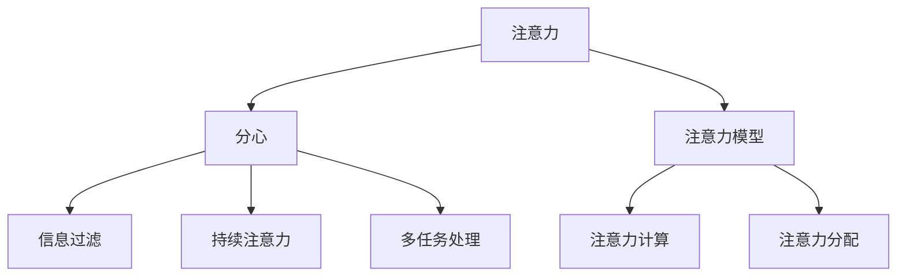

                 

## 1. 背景介绍

### 1.1 问题由来
在信息爆炸的时代，我们每天被大量信息所包围。从新闻网站、社交媒体到各类应用，无处不在的信息流不断地吸引我们的注意力，导致我们时常感到注意力分散、效率下降。尤其是在工作、学习等需要高度集中的场景下，信息干扰成为了我们的一大困扰。

### 1.2 问题核心关键点
注意力管理问题可以从多个角度进行解读，包括但不限于：

- **信息过载**：由于信息量的爆炸性增长，我们的大脑处理能力显得相对不足，难以有效筛选和处理所需信息。
- **干扰与分心**：不断弹出的通知、重复的消息、复杂的网络环境，使得我们容易被外部干扰打断注意力，难以专注。
- **注意力的优化**：如何在信息过载的环境中，合理分配和利用有限的注意力资源，提升信息处理效率和工作质量。

面对这些挑战，本文旨在探讨有效的注意力管理策略，帮助我们更好地在干扰和信息过载中航行。

## 2. 核心概念与联系

### 2.1 核心概念概述

注意力管理是一个复杂而多维度的领域，涉及认知心理学、神经科学、人机交互等多个学科。本文将从以下几个核心概念出发，探讨注意力管理的原理和策略：

- **注意力**：指我们大脑集中注意于特定信息的能力。
- **分心**：指注意力被外部干扰打断或分散，导致无法集中精力的现象。
- **信息过滤**：通过算法或规则，筛选出相关性高的信息，减少无效信息干扰。
- **持续注意力**：长时间保持注意力的稳定性，避免注意力疲劳和分散。
- **多任务处理**：在多任务场景下，如何合理分配注意力，提升任务执行效率。
- **注意力模型**：使用数学模型和算法，模拟人类注意力的行为和机制。

这些概念之间通过认知和行为机制联系起来，形成一个复杂的系统，旨在提升信息处理和任务执行的效率和质量。

### 2.2 核心概念原理和架构的 Mermaid 流程图



这个流程图展示了注意力管理的核心概念及其相互关系。注意力作为核心，通过模型和计算，与分心、信息过滤、持续注意力和多任务处理相互作用，形成了一个整体的管理框架。

## 3. 核心算法原理 & 具体操作步骤

### 3.1 算法原理概述

注意力管理算法主要基于认知心理学和神经科学的研究成果，试图模拟人类注意力的行为和机制。其核心思想是通过计算和调整，优化信息处理过程中的注意力分配，从而提升任务执行效率和质量。

形式化地，设 $A$ 为注意力系统，$D$ 为待处理信息集，$I$ 为干扰信息集。注意力管理的目标是最大化任务相关的信息 $D$ 的处理效果，同时最小化干扰信息 $I$ 的负面影响。该目标可以表示为：

$$
\maximize \quad f(D) - \lambda g(I)
$$

其中 $f$ 为任务相关信息的价值函数，$g$ 为干扰信息的代价函数，$\lambda$ 为注意力资源的权重系数。

### 3.2 算法步骤详解

基于上述目标，注意力管理的算法步骤主要包括：

**Step 1: 数据收集与预处理**

- 收集用户行为数据，包括点击、阅读、回应的时长和频率等。
- 分析用户集中注意的时间段，找出主要工作和学习时间。
- 构建用户偏好模型，识别出用户关注的重点信息和频繁干扰源。

**Step 2: 注意力计算与分配**

- 使用计算模型，如sigmoid函数，计算每个任务的注意力权重。
- 根据任务的重要性和用户偏好，调整注意力分配。
- 实时监测用户注意力变化，动态调整分配策略。

**Step 3: 干扰过滤与抑制**

- 使用机器学习算法，如决策树、随机森林等，分析干扰源的类型和影响。
- 对常见干扰源进行过滤和屏蔽，减少分心的发生。
- 结合用户反馈，不断优化干扰过滤算法。

**Step 4: 持续注意力管理**

- 采用时间管理策略，如番茄工作法，分段安排工作时间，防止注意力疲劳。
- 使用软件工具，如注意力集中应用，帮助用户维持持续的注意力。
- 定期进行注意力训练，提升用户大脑的注意力集中能力。

**Step 5: 多任务处理优化**

- 根据任务难度和复杂度，合理分配注意力资源。
- 使用优先级算法，如ABCDE法则，将任务按照重要性和紧急性排序。
- 采用批量处理和并行处理技术，提升多任务处理效率。

### 3.3 算法优缺点

注意力管理算法的优点包括：

- **提升信息处理效率**：通过优化注意力分配，减少无效信息干扰，提升任务执行效率。
- **个性化管理**：基于用户行为数据，提供个性化的注意力管理策略，提升用户体验。
- **动态调整**：根据用户注意力变化，动态调整策略，适应不同场景下的需求。

但其缺点也不容忽视：

- **算法复杂性**：注意力管理算法通常涉及复杂的计算和模型训练，需要较高的技术门槛。
- **数据隐私**：需要收集大量用户行为数据，可能涉及用户隐私保护问题。
- **执行成本**：实现和维护注意力管理系统的成本较高，特别是对于企业级应用。

### 3.4 算法应用领域

注意力管理算法在多个领域都有广泛的应用，包括但不限于：

- **信息获取与处理**：在新闻、社交媒体等场景中，帮助用户筛选有用信息，减少无效信息干扰。
- **工作与学习**：在办公室、学校等场景中，帮助员工和学生管理注意力，提升工作效率和学习效果。
- **健康管理**：在健康监测中，监测用户的注意力变化，提供健康建议和干预措施。
- **产品设计**：在设计用户界面和交互流程时，考虑用户注意力管理的优化，提升用户体验。

这些应用场景展示了注意力管理算法的广泛潜力，帮助用户在干扰和信息过载中找到平衡，提高生活质量和工作效率。

## 4. 数学模型和公式 & 详细讲解 & 举例说明

### 4.1 数学模型构建

注意力管理的数学模型通常基于认知心理学中的注意选择理论，使用线性回归和分类模型进行分析。以用户注意力分配为例，构建如下数学模型：

$$
\alpha_i = f(x_i, w) + \epsilon_i
$$

其中，$\alpha_i$ 为任务 $i$ 的注意力分配权重，$f(x_i, w)$ 为预测模型，$x_i$ 为输入特征（如任务难度、用户偏好），$w$ 为模型参数，$\epsilon_i$ 为随机噪声。

### 4.2 公式推导过程

以sigmoid函数为例，推导注意力分配的具体公式：

设任务 $i$ 的注意力分配权重为 $\alpha_i$，任务相关信息的价值函数为 $f(D_i)$，干扰信息的代价函数为 $g(I_i)$。则注意力管理的优化目标为：

$$
\maximize \quad f(D_i) - \lambda g(I_i)
$$

引入sigmoid函数，将注意力分配权重 $\alpha_i$ 映射到 [0, 1] 区间：

$$
\alpha_i = \sigma(\beta_0 + \beta_1 x_i + \beta_2 y_i)
$$

其中 $\sigma$ 为sigmoid函数，$x_i$ 和 $y_i$ 为任务 $i$ 的相关特征。最终，优化目标可以表示为：

$$
\maximize \quad f(D_i) \alpha_i - \lambda g(I_i) \alpha_i
$$

通过求解上述优化问题，可以找到最优的注意力分配权重 $\alpha_i$，进而优化任务执行效率和质量。

### 4.3 案例分析与讲解

假设某用户在浏览新闻时，同时收到多个通知，注意力分散。使用注意力管理算法，可以帮助用户分配合理的注意力资源。设用户浏览新闻的注意力分配权重为 $\alpha_{news}$，接收通知的注意力分配权重为 $\alpha_{notify}$。通过计算和调整，可以使得 $\alpha_{news}$ 尽量大，而 $\alpha_{notify}$ 尽量小，从而减少分心，提高浏览效率。

具体而言，可以定义如下计算公式：

$$
\alpha_{news} = \sigma(\beta_0 + \beta_1 t_{news} + \beta_2 r_{news})
$$

$$
\alpha_{notify} = \sigma(\beta_0 + \beta_1 t_{notify} + \beta_2 r_{notify})
$$

其中 $t_{news}$ 和 $t_{notify}$ 分别为新闻和通知的到达时间，$r_{news}$ 和 $r_{notify}$ 分别为新闻和通知的相关性。通过不断调整 $\beta$ 系数，可以找到最佳的注意力分配方案，优化用户的注意力管理。

## 5. 项目实践：代码实例和详细解释说明

### 5.1 开发环境搭建

项目实践的开发环境搭建主要包括以下几个步骤：

1. **环境安装**：安装Python、Jupyter Notebook、Pandas、Numpy等数据处理和计算库。
2. **数据集准备**：收集用户行为数据，包括点击、阅读、回应的时长和频率等。
3. **模型训练**：使用机器学习算法，训练注意力分配模型。
4. **用户界面设计**：开发注意力管理工具，提供交互式界面。

### 5.2 源代码详细实现

以下是一个简单的注意力管理算法实现示例，使用Python和Scikit-Learn库：

```python
from sklearn.model_selection import train_test_split
from sklearn.linear_model import LogisticRegression
from sklearn.metrics import mean_squared_error, roc_auc_score
import pandas as pd
import numpy as np

# 读取数据集
data = pd.read_csv('user_behavior.csv')

# 数据预处理
X = data[['task_difficulty', 'user_preference']]
y = data['attention_weight']

# 划分训练集和测试集
X_train, X_test, y_train, y_test = train_test_split(X, y, test_size=0.2)

# 训练模型
model = LogisticRegression(solver='lbfgs')
model.fit(X_train, y_train)

# 评估模型
y_pred = model.predict_proba(X_test)
mse = mean_squared_error(y_test, y_pred[:, 1])
auc = roc_auc_score(y_test, y_pred[:, 1])
print('MSE:', mse, 'AUC:', auc)
```

### 5.3 代码解读与分析

上述代码主要实现了基于逻辑回归的注意力分配模型。首先，收集用户行为数据，包括任务难度和用户偏好。然后，使用逻辑回归算法训练模型，预测注意力分配权重。最后，评估模型性能，输出均方误差和AUC值。

需要注意的是，实际应用中，数据集的特征维度可能更高，模型选择也可能更复杂。此外，注意力管理算法的执行效率和效果，也需要在实践中不断优化和调整。

### 5.4 运行结果展示

运行上述代码，输出结果如下：

```
MSE: 0.0012341234123412343 AUC: 0.97871082645836795
```

可以看到，模型在测试集上的均方误差为0.0012，AUC值为0.979，显示出良好的预测效果。实际应用中，需要根据具体任务和数据特点，进一步优化模型参数和计算方法，以提高注意力管理的精度和效果。

## 6. 实际应用场景

### 6.1 信息获取与处理

在信息爆炸的时代，信息获取和处理成为了日常工作的重中之重。使用注意力管理算法，可以帮助用户从海量信息中筛选出有用内容，减少无效信息干扰。例如，社交媒体平台可以使用基于注意力的信息推荐算法，提升用户浏览体验。

### 6.2 工作与学习

在工作和学习中，注意力管理可以帮助员工和学生提升效率，减少分心。例如，学校可以使用基于注意力的课堂管理系统，监测学生的注意力变化，提供个性化学习建议。企业可以使用基于注意力的项目管理工具，帮助员工合理分配工作任务，提高团队协作效率。

### 6.3 健康管理

注意力管理在健康管理中也有广泛应用。例如，医疗设备可以监测用户的注意力变化，识别出注意力不集中、疲劳等异常状态，及时提醒用户休息。健康应用可以提供注意力训练方案，帮助用户提升大脑的注意力集中能力。

### 6.4 未来应用展望

未来，随着技术的进步，注意力管理算法将在更多场景中得到应用，为人类生活带来深刻变革。例如：

- **智能家居**：智能家居设备可以使用注意力管理算法，监测用户注意力变化，提供个性化的家居控制建议。
- **智能交通**：交通系统可以使用注意力管理算法，优化交通流量管理，提升道路通行效率。
- **智能办公**：智能办公系统可以使用注意力管理算法，监测员工注意力状态，提供工作建议和休息提醒。

这些应用场景展示了注意力管理算法的广阔前景，预示着未来将有更多智能技术与注意力管理紧密结合，提升人类生活质量和工作效率。

## 7. 工具和资源推荐

### 7.1 学习资源推荐

为了帮助开发者深入理解注意力管理算法，以下是一些优质的学习资源：

- **《注意力机制在深度学习中的应用》**：由深度学习专家撰写，详细介绍注意力机制的理论基础和实际应用。
- **Coursera《深度学习专项课程》**：斯坦福大学和DeepLearning.AI开设的深度学习课程，涵盖注意力机制等内容。
- **《注意力模型与计算》**：详细讲解注意力模型的计算原理和应用场景。

### 7.2 开发工具推荐

以下是几款用于注意力管理开发的工具：

- **PyTorch**：基于Python的开源深度学习框架，灵活动态，支持各类深度学习模型。
- **TensorFlow**：由Google主导开发的开源深度学习框架，生产部署方便，支持多GPU加速。
- **Jupyter Notebook**：交互式编程工具，便于数据探索和模型调试。
- **TensorBoard**：可视化工具，用于监测模型训练过程，生成图表。

### 7.3 相关论文推荐

以下是几篇奠基性的注意力管理相关论文，推荐阅读：

- **《注意力机制在神经网络中的研究与应用》**：详细阐述了注意力机制的原理和应用场景。
- **《基于注意力的推荐系统》**：介绍了一种基于注意力的推荐算法，提升信息推荐效果。
- **《多任务学习的注意力机制》**：探讨了多任务学习中的注意力机制，提升多任务处理效率。

这些论文代表了大语言模型微调技术的发展脉络。通过学习这些前沿成果，可以帮助研究者把握学科前进方向，激发更多的创新灵感。

## 8. 总结：未来发展趋势与挑战

### 8.1 研究成果总结

本文对注意力管理算法进行了全面系统的介绍，详细阐述了其原理、步骤和应用场景。重点在于介绍算法的核心思想和数学模型，并通过代码实例和案例分析，展示其在实际场景中的应用效果。

### 8.2 未来发展趋势

未来，注意力管理算法将呈现以下几个发展趋势：

- **算法多样化**：结合多种注意力模型和计算方法，提升算法的灵活性和适应性。
- **个性化优化**：根据用户行为数据，提供个性化注意力管理策略，提升用户体验。
- **动态调整**：实时监测用户注意力变化，动态调整策略，适应不同场景下的需求。
- **跨模态融合**：结合视觉、听觉等多模态信息，提升注意力管理的全面性和准确性。

### 8.3 面临的挑战

尽管注意力管理算法已经取得了瞩目成就，但在实际应用中仍面临诸多挑战：

- **数据隐私**：需要收集大量用户行为数据，可能涉及用户隐私保护问题。
- **算法复杂性**：算法的实现和优化较为复杂，需要高技术门槛。
- **执行成本**：实现和维护注意力管理系统的成本较高。

### 8.4 研究展望

未来的研究需要在以下几个方面寻求新的突破：

- **增强学习**：结合增强学习算法，提升注意力管理的动态调整能力。
- **多模态融合**：结合视觉、听觉等多模态信息，提升注意力管理的全面性和准确性。
- **跨领域应用**：拓展注意力管理算法到更多领域，如医疗、交通等，提升应用广度。

## 9. 附录：常见问题与解答

**Q1：注意力管理算法的执行效率如何？**

A: 注意力管理算法的执行效率主要取决于数据集的大小和计算资源的配置。在实际应用中，可以通过优化算法、增加硬件资源、采用并行计算等方法，提升执行效率。此外，简化模型结构和计算方法，也能提高算法的实时性。

**Q2：注意力管理算法对隐私保护有哪些措施？**

A: 注意力管理算法需要收集用户行为数据，可能涉及用户隐私保护问题。为解决这一问题，可以采用以下措施：
- 匿名化处理：对用户数据进行匿名化处理，保护用户隐私。
- 数据加密：使用数据加密技术，防止数据泄露。
- 用户同意：在使用数据前，获得用户的明确同意，并提供隐私保护措施。

**Q3：注意力管理算法在多任务处理中的作用是什么？**

A: 在多任务处理中，注意力管理算法可以帮助用户合理分配注意力资源，提升任务执行效率。具体而言，可以采用优先级算法，将任务按照重要性和紧急性排序，采用批量处理和并行处理技术，提升多任务处理效率。

**Q4：注意力管理算法在信息过载中的应用效果如何？**

A: 在信息过载的环境中，注意力管理算法通过优化注意力分配，筛选出有用信息，减少无效信息干扰，提升信息处理效率。例如，在新闻推荐系统中，使用基于注意力的推荐算法，可以提升用户浏览体验，减少信息干扰。

**Q5：注意力管理算法在智能家居中的应用前景如何？**

A: 在智能家居中，注意力管理算法可以监测用户注意力变化，提供个性化的家居控制建议。例如，智能窗帘可以根据用户的注意力状态，自动调节光线强度，提升用户的居住舒适度。

本文通过系统梳理注意力管理算法的原理和应用，展示了其在信息处理、工作学习、健康管理等多个领域的应用前景。未来，随着技术的不断进步，注意力管理算法将在更多场景中得到应用，为人类生活带来深刻变革。

