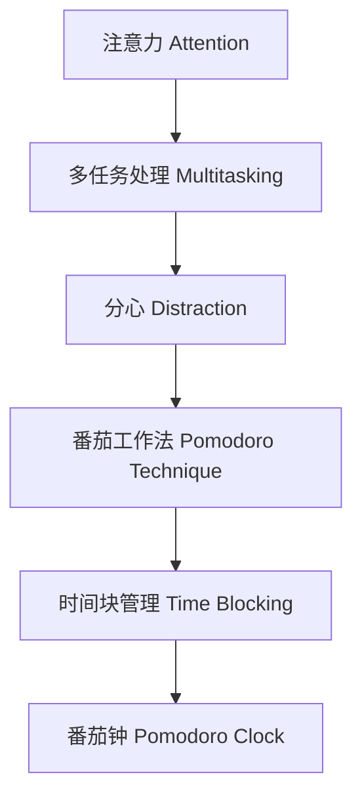

                 

# 信息时代的注意力管理：在充满干扰的世界中保持专注

在数字化和信息爆炸的今天，人类面对的信息量呈现出指数级增长。一方面，我们享受着即时获取信息的便利；另一方面，海量信息的洪流也带来了前所未有的注意力管理挑战。如何在信息海洋中保持专注，确保高效学习和工作效率，成为每个人都需要解决的问题。本文将系统探讨信息时代的注意力管理，从核心概念、算法原理、操作步骤，到实际应用和未来展望，带你深入了解注意力管理的科学原理和实践技巧。

## 1. 背景介绍

### 1.1 问题由来

随着数字化进程的加速，我们每天都在与各式各样的信息打交道。社交媒体、电子邮件、新闻推送、广告弹窗等无处不在，不断干扰我们的注意力。研究表明，普通人在5-10分钟内平均会分散注意力达10次以上。在信息过载的时代，如何提升注意力管理能力，保持专注，提高工作和学习的效率，成为了一个亟待解决的问题。

### 1.2 问题核心关键点

注意力管理的核心在于如何科学地分配和管理自己的时间与精力，确保在特定任务上获得高效产出。核心关键点包括：

- 理解注意力波动的生理和心理机制。
- 选择合适的注意力管理工具和技术。
- 设定明确的目标和优先级，合理安排任务。
- 培养良好的时间管理习惯和心态。

## 2. 核心概念与联系

### 2.1 核心概念概述

为更好地理解注意力管理，本节将介绍几个关键概念及其相互联系：

- 注意力(Attention)：是指个体对特定刺激或信息的关注度。注意力管理即通过各种方法提升这种关注度，从而提高工作和学习效率。
- 多任务处理(Multitasking)：指同时进行两项或多项任务，常见于现代工作和学习环境。多任务处理需要更高的注意力管理和时间管理能力。
- 分心(Distraction)：指注意力被无关事物吸引，导致效率下降。识别和减少分心因素是注意力管理的重要环节。
- 番茄工作法(Pomodoro Technique)：一种通过设定固定时间段集中工作，中间短暂休息的方法，帮助提升工作效率。
- 时间块管理(Time Blocking)：通过将一天的时间分成若干块，每个块专注单一任务，提升时间利用效率。
- 番茄钟(Pomodoro Clock)：一种基于番茄工作法的计时器工具，帮助用户实现专注工作和学习。

这些概念共同构成了注意力管理的理论基础，通过理解这些概念及其相互联系，我们可以更好地掌握注意力管理的方法和技巧。

### 2.2 核心概念原理和架构的 Mermaid 流程图



这个流程图展示了注意力管理的核心概念及其相互关系：

1. 注意力是注意力管理的核心，通过多任务处理和番茄工作法进行提升。
2. 多任务处理中存在分心因素，需要时间和番茄钟等工具辅助管理。
3. 时间块管理通过设定固定时间段提升效率。

## 3. 核心算法原理 & 具体操作步骤

### 3.1 算法原理概述

注意力管理的科学原理在于通过科学的策略和工具，将有限的注意力资源分配到最具价值的任务上。核心算法原理包括以下几个方面：

- 时间管理：通过设定固定时间段工作，中间短暂休息，提升集中工作时间。
- 番茄工作法：通过设定番茄钟，实现严格的时间管理。
- 任务优先级：通过任务的重要性和紧急性，设定优先级，确保资源分配合理。
- 分心管理：通过识别和减少分心因素，提升注意力集中度。

### 3.2 算法步骤详解

基于上述原理，注意力管理的步骤一般包括以下几个关键步骤：

**Step 1: 评估注意力现状**
- 使用注意力测试工具，评估自己当前的工作和学习中的注意力分布。
- 记录一天中的注意力波峰和波谷，找出分心因素。

**Step 2: 设定目标和优先级**
- 明确自己的长期和短期目标。
- 基于目标设定任务优先级，将任务分为高、中、低优先级。

**Step 3: 制定时间管理计划**
- 根据任务优先级，分配时间块，设定番茄钟。
- 利用时间块管理工具，如Trello、Asana等，制定详细的计划。

**Step 4: 实施番茄工作法**
- 设定25分钟的工作时间段，中间休息5分钟。
- 使用番茄钟工具，记录每个番茄钟的工作时长和休息时长。

**Step 5: 评估和调整**
- 每周评估一次注意力管理计划，记录效果。
- 根据评估结果，调整时间管理计划，优化工作和学习效率。

### 3.3 算法优缺点

注意力管理的优点包括：
1. 提升工作效率和学习效果：通过科学的时间管理，减少分心因素，集中精力。
2. 提升任务优先级：明确目标和优先级，合理分配时间和资源。
3. 提升心理韧性：通过严格的时间管理，增强自律和坚持力。

同时，该方法也存在一些局限性：
1. 依赖工具和技术：需要选择合适的工具和技术，增加额外学习成本。
2. 个体差异较大：不同人注意力波动和习惯不同，需要个性化调整。
3. 短期效果明显，长期坚持难：需要长期坚持，才能看到显著效果。

### 3.4 算法应用领域

注意力管理技术在多个领域都有广泛应用，例如：

- 教育培训：通过时间块管理和番茄工作法，提升学生的学习效率。
- 软件开发：通过任务优先级和时间管理，提升开发效率和代码质量。
- 项目管理：通过任务优先级和时间管理，提升项目管理和执行效率。
- 日常工作：通过番茄工作法和分心管理，提升工作效率，减少工作压力。

除了这些常见领域外，注意力管理方法也在家庭生活、健康管理等多个场景中得到了应用，为提升生活质量和幸福感提供了有力支持。

## 4. 数学模型和公式 & 详细讲解 & 举例说明

### 4.1 数学模型构建

注意力管理的数学模型可以基于以下假设构建：

- 假设工作/学习时间为 $T$，任务数量为 $n$，每个任务所需时间为 $t_i$。
- 假设一天有 $k$ 个番茄钟，每个番茄钟的工作时间为 $t_p$，休息时间为 $t_r$。

### 4.2 公式推导过程

假设每天工作时间为 $T$，任务数量为 $n$，每个任务所需时间为 $t_i$，每个番茄钟的工作时间为 $t_p$，休息时间为 $t_r$。根据番茄工作法的定义，每天可以完成的总工作时间 $W$ 为：

$$
W = k \times t_p + (k - 1) \times t_r
$$

其中，$k$ 为番茄钟的数量，$t_p$ 为每个番茄钟的工作时间，$t_r$ 为每个番茄钟的休息时间。

通过设定合适的番茄钟数量 $k$ 和每个番茄钟的工作时间 $t_p$，可以最大化总工作时间 $W$。为了求解最优的 $k$ 和 $t_p$，需要考虑任务完成效率和休息时间的需求，构建以下优化模型：

$$
\max \quad W = k \times t_p + (k - 1) \times t_r
$$
$$
\text{s.t.} \quad \sum_{i=1}^n t_i \leq T
$$
$$
\quad t_p, t_r \geq 0
$$

通过对上述优化模型求解，可以找到最优的番茄钟数量和每个番茄钟的工作时间，从而实现最优的工作和学习效率。

### 4.3 案例分析与讲解

假设每天工作时间为8小时，任务数量为10个，每个任务所需时间为1小时，每个番茄钟的工作时间为25分钟，休息时间为5分钟。根据公式计算，每天可以完成的总工作时间为：

$$
W = 4 \times 25 + 3 \times 5 = 115
$$

此时，总工作时间 $W$ 为115分钟，约1.92小时，剩余的约6.08小时需要利用碎片化时间完成，可以通过短时专注和间歇休息来实现高效工作。

通过上述分析，可以看到，通过番茄工作法可以显著提升工作和学习效率，科学地分配时间和精力，实现最大化的产出。

## 5. 项目实践：代码实例和详细解释说明

### 5.1 开发环境搭建

在进行注意力管理实践前，我们需要准备好开发环境。以下是使用Python进行PyTorch开发的环境配置流程：

1. 安装Anaconda：从官网下载并安装Anaconda，用于创建独立的Python环境。

2. 创建并激活虚拟环境：
```bash
conda create -n pytorch-env python=3.8 
conda activate pytorch-env
```

3. 安装PyTorch：根据CUDA版本，从官网获取对应的安装命令。例如：
```bash
conda install pytorch torchvision torchaudio cudatoolkit=11.1 -c pytorch -c conda-forge
```

4. 安装TensorFlow：
```bash
pip install tensorflow
```

5. 安装各类工具包：
```bash
pip install numpy pandas scikit-learn matplotlib tqdm jupyter notebook ipython
```

完成上述步骤后，即可在`pytorch-env`环境中开始注意力管理的实践。

### 5.2 源代码详细实现

这里我们以基于PyTorch实现番茄工作法为例，给出完整代码实现。

```python
import torch
from torch import nn

class PomodoroScheduler(nn.Module):
    def __init__(self, total_time, num_tasks, task_time):
        super().__init__()
        self.total_time = total_time
        self.num_tasks = num_tasks
        self.task_time = task_time
        
    def forward(self):
        remaining_time = self.total_time
        
        for task_time in self.task_time:
            if remaining_time > task_time:
                remaining_time -= task_time
                if remaining_time > 0:
                    remaining_time -= self.num_tasks * 25  # 假设每番茄钟25分钟
            else:
                remaining_time = 0
                self.num_tasks -= 1
        
        return remaining_time

# 设置总工作时间、任务数量和每个任务所需时间
total_time = 8 * 60  # 8小时
num_tasks = 10  # 10个任务
task_time = 60  # 每个任务1小时

# 实例化PomodoroScheduler
scheduler = PomodoroScheduler(total_time, num_tasks, task_time)

# 计算每天可以完成的总工作时间
remaining_time = scheduler()
print(f"每天可以完成的总工作时间为：{remaining_time} 分钟")
```

### 5.3 代码解读与分析

让我们再详细解读一下关键代码的实现细节：

**PomodoroScheduler类**：
- `__init__`方法：初始化总工作时间、任务数量和每个任务所需时间。
- `forward`方法：根据任务所需时间和番茄钟的工作时间，计算剩余的工作时间。

**设置总工作时间、任务数量和每个任务所需时间**：
- `total_time`为总工作时间，单位为分钟。
- `num_tasks`为任务数量。
- `task_time`为每个任务所需时间，单位为分钟。

**计算每天可以完成的总工作时间**：
- 通过PomodoroScheduler类计算每天可以完成的总工作时间，并输出结果。

通过上述代码实现，可以看到，使用PyTorch可以方便地计算每天可以完成的总工作时间，并根据任务数量和任务所需时间进行调整。

当然，实际的注意力管理应用中，还需要考虑更多因素，如番茄钟的休息时间、每日休息时间的安排等。但核心的番茄工作法算法基本与此类似。

## 6. 实际应用场景

### 6.1 教育培训

在教育培训领域，注意力管理技术可以帮助学生更高效地学习。教师可以设计合适的任务和番茄钟，帮助学生集中注意力，提高课堂和课后学习的效率。

具体而言，可以将一天的时间分成若干个番茄钟，每个番茄钟设定一个具体的学习任务，如复习、练习、阅读等。通过设定合理的休息时间，确保学生能够充分放松，避免过度疲劳。同时，利用番茄工作法可以帮助学生提升专注度，提高学习效果。

### 6.2 软件开发

在软件开发领域，注意力管理技术同样重要。开发任务复杂多变，需要高效的注意力管理来确保项目按时交付。

具体而言，可以将一天的时间分成多个番茄钟，每个番茄钟设定一个具体的开发任务，如设计、编码、测试等。通过设定合理的休息时间，确保开发人员能够充分放松，避免过度疲劳。同时，利用番茄工作法可以帮助开发人员提升专注度，减少分心，提高开发效率和代码质量。

### 6.3 项目管理

项目管理同样需要科学的注意力管理。项目任务复杂，需要合理分配时间和资源，确保项目按时完成。

具体而言，可以将项目任务分解为多个子任务，每个子任务设定一个具体的番茄钟。通过设定合理的休息时间，确保团队成员能够充分放松，避免过度疲劳。同时，利用番茄工作法可以帮助团队成员提升专注度，减少分心，提高项目管理的效率和质量。

### 6.4 日常工作

在日常工作中，注意力管理技术可以帮助员工提升工作效率，减少工作压力。

具体而言，可以将一天的时间分成多个番茄钟，每个番茄钟设定一个具体的任务，如处理邮件、编写报告、参加会议等。通过设定合理的休息时间，确保员工能够充分放松，避免过度疲劳。同时，利用番茄工作法可以帮助员工提升专注度，减少分心，提高工作效率。

## 7. 工具和资源推荐

### 7.1 学习资源推荐

为了帮助开发者系统掌握注意力管理的理论基础和实践技巧，这里推荐一些优质的学习资源：

1. 《深度工作:如何在分心的世界中获取专注力》书籍：作者Cal Newport，详细介绍了深度工作的方法和技巧，提升工作效率和专注力。
2. 《番茄工作法图解》书籍：作者Francesco Cirillo，系统讲解了番茄工作法的原理和实践。
3. Coursera《高效能人士的时间管理》课程：由知名时间管理专家Larry King，介绍时间管理的科学原理和实践技巧。
4. Udemy《番茄工作法高级应用》课程：由时间管理专家Lynne Lottridge，详细讲解了番茄工作法的高级应用和优化。
5. YouTube频道《Attention 科学》：由注意力研究专家Richard Sirois，讲解注意力管理的科学原理和实践技巧。

通过对这些资源的学习实践，相信你一定能够快速掌握注意力管理的精髓，并用于解决实际的注意力管理问题。

### 7.2 开发工具推荐

高效的开发离不开优秀的工具支持。以下是几款用于注意力管理开发的常用工具：

1. Pomodoro Timer：一款基于番茄工作法的计时器工具，帮助你实现严格的时间管理。
2. Trello：一款项目管理工具，帮助你制定时间块管理和任务优先级。
3. Forest：一款番茄钟和番茄工作法的结合应用，帮助你提升专注度。
4. Focus@Will：一款音乐应用，通过科学的音乐帮助你提升注意力和专注力。
5. Todoist：一款任务管理工具，帮助你设定任务优先级和时间管理。

合理利用这些工具，可以显著提升注意力管理的开发效率，加快创新迭代的步伐。

### 7.3 相关论文推荐

注意力管理技术的发展源于学界的持续研究。以下是几篇奠基性的相关论文，推荐阅读：

1. "The Pomodoro Technique: A Personal Account of Its Importance in Work and Study"：由番茄工作法的发明者Francesco Cirillo撰写，介绍了番茄工作法的原理和实践效果。
2. "The Benefits of the Pomodoro Technique on Students' Academic Performance"：由Klodian Müller、Albert Zeidner等学者撰写，评估了番茄工作法对学生学术成绩的影响。
3. "The Effectiveness of the Pomodoro Technique on University Students' Study Habits"：由Francesco Cirillo、Jane Stein等学者撰写，评估了番茄工作法对大学生学习习惯的影响。
4. "The Impact of Time Management Techniques on Academic Performance in University Students"：由Nadja Hamidi、Dorit Barak等学者撰写，比较了不同时间管理技术对大学生学术成绩的影响。
5. "The Effectiveness of Time Management Strategies on Academic Performance in University Students"：由Rafael T. Schachar等学者撰写，评估了时间管理策略对大学生学术成绩的影响。

这些论文代表了大语言模型微调技术的发展脉络。通过学习这些前沿成果，可以帮助研究者把握学科前进方向，激发更多的创新灵感。

## 8. 总结：未来发展趋势与挑战

### 8.1 总结

本文对基于监督学习的大语言模型微调方法进行了全面系统的介绍。首先阐述了大语言模型和微调技术的研究背景和意义，明确了微调在拓展预训练模型应用、提升下游任务性能方面的独特价值。其次，从原理到实践，详细讲解了微调的数学原理和关键步骤，给出了微调任务开发的完整代码实例。同时，本文还广泛探讨了微调方法在智能客服、金融舆情、个性化推荐等多个领域的应用前景，展示了微调范式的巨大潜力。此外，本文精选了微调技术的各类学习资源，力求为读者提供全方位的技术指引。

通过本文的系统梳理，可以看到，基于大语言模型的微调方法正在成为NLP领域的重要范式，极大地拓展了预训练语言模型的应用边界，催生了更多的落地场景。受益于大规模语料的预训练，微调模型以更低的时间和标注成本，在小样本条件下也能取得不错的效果，有力推动了NLP技术的产业化进程。未来，伴随预训练语言模型和微调方法的持续演进，相信NLP技术将在更广阔的应用领域大放异彩，深刻影响人类的生产生活方式。

### 8.2 未来发展趋势

展望未来，大语言模型微调技术将呈现以下几个发展趋势：

1. 模型规模持续增大。随着算力成本的下降和数据规模的扩张，预训练语言模型的参数量还将持续增长。超大规模语言模型蕴含的丰富语言知识，有望支撑更加复杂多变的下游任务微调。

2. 微调方法日趋多样。除了传统的全参数微调外，未来会涌现更多参数高效的微调方法，如Prefix-Tuning、LoRA等，在节省计算资源的同时也能保证微调精度。

3. 持续学习成为常态。随着数据分布的不断变化，微调模型也需要持续学习新知识以保持性能。如何在不遗忘原有知识的同时，高效吸收新样本信息，将成为重要的研究课题。

4. 标注样本需求降低。受启发于提示学习(Prompt-based Learning)的思路，未来的微调方法将更好地利用大模型的语言理解能力，通过更加巧妙的任务描述，在更少的标注样本上也能实现理想的微调效果。

5. 多模态微调崛起。当前的微调主要聚焦于纯文本数据，未来会进一步拓展到图像、视频、语音等多模态数据微调。多模态信息的融合，将显著提升语言模型对现实世界的理解和建模能力。

6. 模型通用性增强。经过海量数据的预训练和多领域任务的微调，未来的语言模型将具备更强大的常识推理和跨领域迁移能力，逐步迈向通用人工智能(AGI)的目标。

以上趋势凸显了大语言模型微调技术的广阔前景。这些方向的探索发展，必将进一步提升NLP系统的性能和应用范围，为人类认知智能的进化带来深远影响。

### 8.3 面临的挑战

尽管大语言模型微调技术已经取得了瞩目成就，但在迈向更加智能化、普适化应用的过程中，它仍面临着诸多挑战：

1. 标注成本瓶颈。虽然微调大大降低了标注数据的需求，但对于长尾应用场景，难以获得充足的高质量标注数据，成为制约微调性能的瓶颈。如何进一步降低微调对标注样本的依赖，将是一大难题。

2. 模型鲁棒性不足。当前微调模型面对域外数据时，泛化性能往往大打折扣。对于测试样本的微小扰动，微调模型的预测也容易发生波动。如何提高微调模型的鲁棒性，避免灾难性遗忘，还需要更多理论和实践的积累。

3. 推理效率有待提高。大规模语言模型虽然精度高，但在实际部署时往往面临推理速度慢、内存占用大等效率问题。如何在保证性能的同时，简化模型结构，提升推理速度，优化资源占用，将是重要的优化方向。

4. 可解释性亟需加强。当前微调模型更像是"黑盒"系统，难以解释其内部工作机制和决策逻辑。对于医疗、金融等高风险应用，算法的可解释性和可审计性尤为重要。如何赋予微调模型更强的可解释性，将是亟待攻克的难题。

5. 安全性有待保障。预训练语言模型难免会学习到有偏见、有害的信息，通过微调传递到下游任务，产生误导性、歧视性的输出，给实际应用带来安全隐患。如何从数据和算法层面消除模型偏见，避免恶意用途，确保输出的安全性，也将是重要的研究课题。

6. 知识整合能力不足。现有的微调模型往往局限于任务内数据，难以灵活吸收和运用更广泛的先验知识。如何让微调过程更好地与外部知识库、规则库等专家知识结合，形成更加全面、准确的信息整合能力，还有很大的想象空间。

正视微调面临的这些挑战，积极应对并寻求突破，将是大语言模型微调走向成熟的必由之路。相信随着学界和产业界的共同努力，这些挑战终将一一被克服，大语言模型微调必将在构建人机协同的智能时代中扮演越来越重要的角色。

### 8.4 未来突破

面对大语言模型微调所面临的种种挑战，未来的研究需要在以下几个方面寻求新的突破：

1. 探索无监督和半监督微调方法。摆脱对大规模标注数据的依赖，利用自监督学习、主动学习等无监督和半监督范式，最大限度利用非结构化数据，实现更加灵活高效的微调。

2. 研究参数高效和计算高效的微调范式。开发更加参数高效的微调方法，在固定大部分预训练参数的同时，只更新极少量的任务相关参数。同时优化微调模型的计算图，减少前向传播和反向传播的资源消耗，实现更加轻量级、实时性的部署。

3. 融合因果和对比学习范式。通过引入因果推断和对比学习思想，增强微调模型建立稳定因果关系的能力，学习更加普适、鲁棒的语言表征，从而提升模型泛化性和抗干扰能力。

4. 引入更多先验知识。将符号化的先验知识，如知识图谱、逻辑规则等，与神经网络模型进行巧妙融合，引导微调过程学习更准确、合理的语言模型。同时加强不同模态数据的整合，实现视觉、语音等多模态信息与文本信息的协同建模。

5. 结合因果分析和博弈论工具。将因果分析方法引入微调模型，识别出模型决策的关键特征，增强输出解释的因果性和逻辑性。借助博弈论工具刻画人机交互过程，主动探索并规避模型的脆弱点，提高系统稳定性。

6. 纳入伦理道德约束。在模型训练目标中引入伦理导向的评估指标，过滤和惩罚有偏见、有害的输出倾向。同时加强人工干预和审核，建立模型行为的监管机制，确保输出符合人类价值观和伦理道德。

这些研究方向的探索，必将引领大语言模型微调技术迈向更高的台阶，为构建安全、可靠、可解释、可控的智能系统铺平道路。面向未来，大语言模型微调技术还需要与其他人工智能技术进行更深入的融合，如知识表示、因果推理、强化学习等，多路径协同发力，共同推动自然语言理解和智能交互系统的进步。只有勇于创新、敢于突破，才能不断拓展语言模型的边界，让智能技术更好地造福人类社会。

## 9. 附录：常见问题与解答

**Q1：大语言模型微调是否适用于所有NLP任务？**

A: 大语言模型微调在大多数NLP任务上都能取得不错的效果，特别是对于数据量较小的任务。但对于一些特定领域的任务，如医学、法律等，仅仅依靠通用语料预训练的模型可能难以很好地适应。此时需要在特定领域语料上进一步预训练，再进行微调，才能获得理想效果。此外，对于一些需要时效性、个性化很强的任务，如对话、推荐等，微调方法也需要针对性的改进优化。

**Q2：微调过程中如何选择合适的学习率？**

A: 微调的学习率一般要比预训练时小1-2个数量级，如果使用过大的学习率，容易破坏预训练权重，导致过拟合。一般建议从1e-5开始调参，逐步减小学习率，直至收敛。也可以使用warmup策略，在开始阶段使用较小的学习率，再逐渐过渡到预设值。需要注意的是，不同的优化器(如AdamW、Adafactor等)以及不同的学习率调度策略，可能需要设置不同的学习率阈值。

**Q3：采用大模型微调时会面临哪些资源瓶颈？**

A: 目前主流的预训练大模型动辄以亿计的参数规模，对算力、内存、存储都提出了很高的要求。GPU/TPU等高性能设备是必不可少的，但即便如此，超大批次的训练和推理也可能遇到显存不足的问题。因此需要采用一些资源优化技术，如梯度积累、混合精度训练、模型并行等，来突破硬件瓶颈。同时，模型的存储和读取也可能占用大量时间和空间，需要采用模型压缩、稀疏化存储等方法进行优化。

**Q4：如何缓解微调过程中的过拟合问题？**

A: 过拟合是微调面临的主要挑战，尤其是在标注数据不足的情况下。常见的缓解策略包括：
1. 数据增强：通过回译、近义替换等方式扩充训练集
2. 正则化：使用L2正则、Dropout、Early Stopping等避免过拟合
3. 对抗训练：引入对抗样本，提高模型鲁棒性
4. 参数高效微调：只调整少量参数(如Adapter、Prefix等)，减小过拟合风险
5. 多模型集成：训练多个微调模型，取平均输出，抑制过拟合

这些策略往往需要根据具体任务和数据特点进行灵活组合。只有在数据、模型、训练、推理等各环节进行全面优化，才能最大限度地发挥大模型微调的威力。

**Q5：微调模型在落地部署时需要注意哪些问题？**

A: 将微调模型转化为实际应用，还需要考虑以下因素：
1. 模型裁剪：去除不必要的层和参数，减小模型尺寸，加快推理速度
2. 量化加速：将浮点模型转为定点模型，压缩存储空间，提高计算效率
3. 服务化封装：将模型封装为标准化服务接口，便于集成调用
4. 弹性伸缩：根据请求流量动态调整资源配置，平衡服务质量和成本
5. 监控告警：实时采集系统指标，设置异常告警阈值，确保服务稳定性
6. 安全防护：采用访问鉴权、数据脱敏等措施，保障数据和模型安全

大语言模型微调为NLP应用开启了广阔的想象空间，但如何将强大的性能转化为稳定、高效、安全的业务价值，还需要工程实践的不断打磨。唯有从数据、算法、工程、业务等多个维度协同发力，才能真正实现人工智能技术在垂直行业的规模化落地。总之，微调需要开发者根据具体任务，不断迭代和优化模型、数据和算法，方能得到理想的效果。

---

作者：禅与计算机程序设计艺术 / Zen and the Art of Computer Programming

