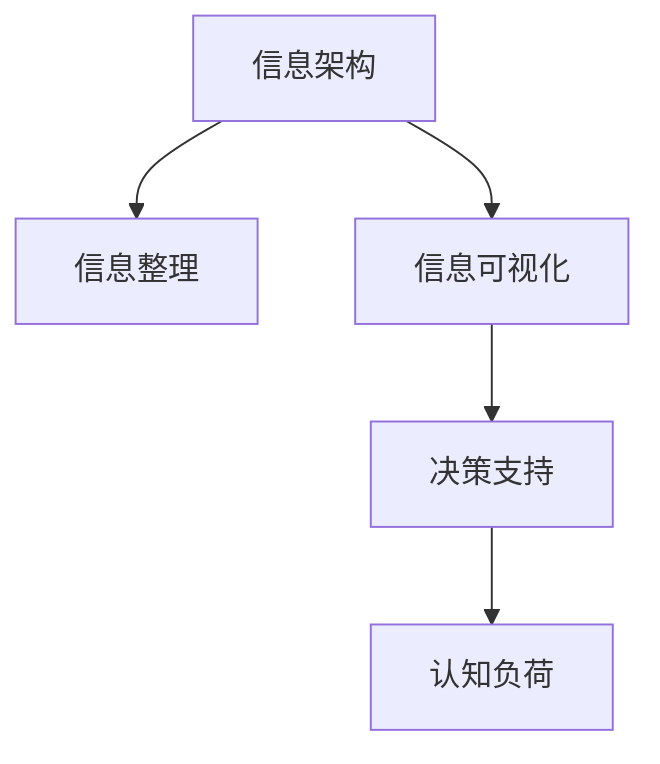

                 

# 信息简化的好处与实践：在复杂世界中简化以改善生活和决策

> 关键词：信息简化, 决策科学, 信息架构, 认知负荷, 交互设计, 复杂系统管理

## 1. 背景介绍

### 1.1 问题由来

在信息化时代，信息量的爆炸式增长为我们的决策带来了前所未有的压力。如何在海量信息中找到关键、有用的数据，成为现代社会的一大挑战。信息过载不仅影响我们的工作效率，还可能导致认知负荷过重，影响决策质量。

然而，尽管信息泛滥，高质量、经过整理的信息资源仍然是稀缺的。随着数字技术的不断进步，如何有效利用信息资源，进行信息简化，提升决策水平，成为一个迫切需要解决的问题。

### 1.2 问题核心关键点

信息简化的核心在于将复杂的信息架构化，通过有组织、系统化的方式简化信息，减少不必要的认知负荷，提升决策效率和质量。这一过程包括：

1. **信息整理**：从原始数据中提取关键信息，进行去重、分类、排序。
2. **信息可视化**：将信息转化为图表、图表等可视化形式，使其更易于理解。
3. **决策支持**：利用信息简化后的数据，辅助决策，减少偏差和误差。

信息简化不仅对企业和组织有益，对个人生活和工作的决策同样具有重要意义。通过科学地简化信息，可以更有效地应对复杂环境，提升决策力和竞争力。

## 2. 核心概念与联系

### 2.1 核心概念概述

为更好地理解信息简化的原理和实践，本节将介绍几个关键概念：

- **信息架构**：通过合理的组织结构和关系，将复杂信息系统化，便于理解和操作。
- **认知负荷**：由于信息过载，导致记忆、注意和决策等认知资源耗竭，影响认知效率。
- **信息可视化**：利用图表、图形等视觉化工具，将复杂信息转化为直观易懂的视觉形式。
- **决策支持系统**：结合人工智能和数据科学技术，辅助决策者进行科学决策。

这些概念通过以下Mermaid流程图来展示：



这个流程图展示了信息简化过程中从信息架构到认知负荷的逻辑路径：

1. 信息架构化，将复杂信息系统化。
2. 通过信息整理和可视化，简化信息。
3. 利用决策支持系统，辅助决策，降低认知负荷。

## 3. 核心算法原理 & 具体操作步骤

### 3.1 算法原理概述

信息简化的核心算法原理是通过信息架构、信息整理和信息可视化的方式，将复杂信息转化为易于理解和操作的简单形式。其核心在于：

- **系统化组织**：将信息按照一定的逻辑和结构进行组织，如层级结构、网络结构等。
- **关键信息提取**：从原始数据中提取关键信息，如核心数据、趋势变化等。
- **可视化表示**：将提取的关键信息转化为图形、图表等形式，便于理解和操作。

### 3.2 算法步骤详解

信息简化的具体操作步骤包括：

1. **信息收集**：获取原始数据，包括结构化数据和非结构化数据，如文本、图像、音频等。
2. **信息整理**：对原始数据进行清洗、去重、分类、聚类等处理，提取关键信息。
3. **信息架构**：设计信息架构模型，确定信息的组织结构和关系。
4. **信息可视化**：利用图表、仪表盘等形式，将信息转化为视觉形式。
5. **决策支持**：利用决策支持系统，结合AI算法和数据分析，辅助决策。

### 3.3 算法优缺点

信息简化的算法有以下优点：

- **提升决策效率**：通过简化信息，减少认知负荷，提升决策效率和质量。
- **降低决策偏差**：利用数据驱动的决策支持系统，减少主观偏见和错误。
- **提高信息可理解性**：通过可视化手段，使复杂信息更易于理解和操作。

同时，信息简化的算法也存在以下缺点：

- **需要高水平技术**：信息整理和可视化需要高水平的技术支持，尤其是数据科学和交互设计。
- **依赖高质量数据**：信息简化的效果很大程度上取决于原始数据的质量。
- **可能忽略细节**：简化信息的过程中，可能会忽略某些细节，影响决策的全面性。

### 3.4 算法应用领域

信息简化技术在多个领域都有广泛应用，例如：

- **商业决策**：帮助企业通过分析市场数据、用户反馈等，进行产品和策略优化。
- **医疗健康**：通过简化医疗数据，辅助医生进行诊断和治疗。
- **城市管理**：利用信息简化技术，优化城市交通、环境等管理决策。
- **金融分析**：分析金融市场数据，辅助投资决策。
- **教育培训**：简化学习内容，提高学习效率和效果。
- **公共政策**：简化政策数据，辅助政策制定和执行。

## 4. 数学模型和公式 & 详细讲解 & 举例说明

### 4.1 数学模型构建

假设原始数据集为 $D=\{(x_i, y_i)\}_{i=1}^N$，其中 $x_i$ 为特征向量，$y_i$ 为标签。信息简化的目标是通过信息整理和可视化，将数据转化为易于理解的形式。

### 4.2 公式推导过程

信息简化的核心在于提取关键信息，因此需要设计合适的特征提取算法。常见的特征提取方法包括：

- **主成分分析(PCA)**：通过线性变换，将高维数据映射到低维空间，保留最大方差的信息。
- **聚类算法**：将数据点按照相似度分组，发现数据中的模式和结构。
- **关联规则挖掘**：从大规模数据集中挖掘出频繁出现的模式和规则。

以主成分分析为例，假设原始数据集 $D$ 的协方差矩阵为 $\Sigma$，则PCA的目标是最小化数据的重构误差，即：

$$
\min_{W} \sum_{i=1}^N \|x_i - W^{T} W x_i\|^2
$$

其中 $W$ 为投影矩阵。求解上述最小化问题，得到主成分的线性组合，用于简化数据。

### 4.3 案例分析与讲解

假设某公司需要分析其销售数据，以辅助决策。原始数据包含多维特征，包括日期、产品、销售量等。

**步骤1: 信息整理**  
将销售数据进行清洗、去重、分类等处理，提取关键信息。例如，可以按日期、产品、销售渠道等维度进行分组，并统计各维度的总销售量、销售额等指标。

**步骤2: 信息架构**  
设计信息架构模型，确定数据的组织结构和关系。例如，可以设计一个层级结构，从年度、季度到月度，再细化到每日，形成一个时间维度的时间序列数据。

**步骤3: 信息可视化**  
利用图表、仪表盘等形式，将信息转化为视觉形式。例如，可以使用折线图展示时间序列数据的变化趋势，使用饼图展示产品销售占比，使用热力图展示各销售渠道的表现等。

**步骤4: 决策支持**  
利用决策支持系统，结合AI算法和数据分析，辅助决策。例如，可以采用时间序列预测模型，预测未来销售趋势，或利用聚类算法发现潜在的市场细分，辅助产品定位和营销策略的制定。

## 5. 项目实践：代码实例和详细解释说明

### 5.1 开发环境搭建

在进行信息简化实践前，我们需要准备好开发环境。以下是使用Python进行Pandas和Matplotlib开发的环境配置流程：

1. 安装Anaconda：从官网下载并安装Anaconda，用于创建独立的Python环境。

2. 创建并激活虚拟环境：
```bash
conda create -n info-simplification python=3.8 
conda activate info-simplification
```

3. 安装Pandas和Matplotlib：
```bash
pip install pandas matplotlib
```

4. 安装其他工具包：
```bash
pip install numpy scikit-learn seaborn statsmodels
```

完成上述步骤后，即可在`info-simplification`环境中开始信息简化实践。

### 5.2 源代码详细实现

下面我们以销售数据分析为例，给出使用Pandas和Matplotlib进行信息简化的PyTorch代码实现。

首先，定义数据处理函数：

```python
import pandas as pd
import numpy as np
import matplotlib.pyplot as plt
import seaborn as sns
from sklearn.preprocessing import StandardScaler
from sklearn.decomposition import PCA

def preprocess_data(data_path):
    data = pd.read_csv(data_path)
    # 清洗数据，去除缺失值和异常值
    data = data.dropna()
    # 标准化数据
    scaler = StandardScaler()
    data = pd.DataFrame(scaler.fit_transform(data), columns=data.columns)
    return data
```

然后，定义信息整理和可视化函数：

```python
def visualize_data(data, feature_columns, target_column, time_columns, plot_type='line'):
    # 按时间分组，统计各维度指标
    for time_column in time_columns:
        data[time_column] = pd.to_datetime(data[time_column]).dt.strftime('%Y-%m-%d')
    data = data.groupby(time_columns).sum().reset_index()
    # 按特征列分组，统计各特征的指标
    for feature_column in feature_columns:
        data[feature_column] = data[feature_column].apply(lambda x: x.describe().median() if pd.isnull(x).any() else x)
    # 可视化
    if plot_type == 'line':
        data.plot(kind=plot_type)
    elif plot_type == 'bar':
        data.plot(kind=plot_type, figsize=(12, 6))
    elif plot_type == 'pie':
        data['target'].value_counts().plot(kind=plot_type, subplots=True)
    else:
        raise ValueError('Unsupported plot type')
    plt.show()
```

最后，启动数据可视化流程：

```python
data_path = 'sales_data.csv'
feature_columns = ['product', 'channel']
target_column = 'sales'
time_columns = ['date']

data = preprocess_data(data_path)
visualize_data(data, feature_columns, target_column, time_columns, plot_type='line')
```

以上就是使用Pandas和Matplotlib进行销售数据分析的完整代码实现。可以看到，利用Pandas和Matplotlib，可以轻松地进行数据整理和可视化，快速展现信息简化的效果。

### 5.3 代码解读与分析

让我们再详细解读一下关键代码的实现细节：

**preprocess_data函数**：
- 使用Pandas读取原始数据，并进行清洗、标准化等处理。
- 去除缺失值和异常值，减少对可视化结果的干扰。
- 标准化数据，使得特征尺度一致，避免某些特征对可视化结果产生过大影响。

**visualize_data函数**：
- 根据时间列和特征列，对数据进行分组统计，提取出关键信息。
- 可视化函数支持折线图、柱状图、饼图等多种图表形式，可以根据需要选择合适的图表类型。
- 在可视化过程中，对目标列进行统计，展示数据分布情况。

**主函数**：
- 指定数据路径，定义特征列、目标列和时间列。
- 调用preprocess_data函数进行数据整理，并调用visualize_data函数进行可视化展示。

可以看到，通过使用Pandas和Matplotlib，信息简化的过程变得非常直观和简洁，可以快速获取关键信息，并进行可视化展示，为决策提供直观的支持。

当然，工业级的系统实现还需考虑更多因素，如数据的高效存储、可视化的动态展示、数据的实时更新等。但核心的信息简化逻辑基本与此类似。

## 6. 实际应用场景

### 6.1 商业决策

信息简化技术在商业决策中具有重要应用。例如，某电商平台需要分析其日销售额、月度销售额、季度销售额等，以辅助制定营销策略和销售计划。通过信息整理和可视化，可以快速获取关键销售数据，发现销售趋势和周期性规律，为决策提供支持。

### 6.2 医疗健康

在医疗健康领域，信息简化技术同样具有重要应用。例如，某医院需要分析其门诊量、住院量、急诊量等数据，以辅助医生制定治疗方案和优化医院资源分配。通过信息整理和可视化，可以快速获取关键医疗数据，发现疾病趋势和医疗资源分布情况，为决策提供支持。

### 6.3 城市管理

在城市管理中，信息简化技术可以用于优化城市交通、环境保护、公共设施管理等方面。例如，某市政府需要分析其交通流量、空气质量、垃圾处理量等数据，以辅助城市规划和管理。通过信息整理和可视化，可以快速获取关键城市管理数据，发现交通拥堵、环境污染等热点问题，为决策提供支持。

### 6.4 金融分析

在金融分析中，信息简化技术可以用于分析市场数据、投资组合、风险管理等方面。例如，某投资公司需要分析其投资组合的收益、风险、流动性等数据，以辅助投资决策。通过信息整理和可视化，可以快速获取关键金融数据，发现市场趋势和投资机会，为决策提供支持。

## 7. 工具和资源推荐

### 7.1 学习资源推荐

为了帮助开发者系统掌握信息简化的理论基础和实践技巧，这里推荐一些优质的学习资源：

1. 《信息架构：设计原则与实践》系列书籍：深入浅出地介绍了信息架构的基本概念、设计原则和实践方法。

2. 《数据科学基础》课程：斯坦福大学开设的Coursera课程，涵盖数据收集、处理、分析等基本概念和方法，适合入门学习。

3. 《数据可视化实战》书籍：详细介绍了如何使用Matplotlib、Seaborn等工具进行数据可视化，适合实战操作。

4. 《决策科学》课程：MIT OpenCourseWare课程，涵盖决策理论、决策模型和实际应用，适合深入学习。

5. 《机器学习实战》书籍：介绍机器学习的基本概念、算法和实践，适合理解信息简化中的机器学习应用。

通过对这些资源的学习实践，相信你一定能够快速掌握信息简化的精髓，并用于解决实际的信息简化问题。

### 7.2 开发工具推荐

信息简化的实现离不开优秀的工具支持。以下是几款用于信息简化开发的常用工具：

1. Pandas：基于Python的数据分析工具，支持数据清洗、处理和分析，是进行信息整理的基础。

2. Matplotlib：基于Python的绘图工具，支持多种图表形式，是进行信息可视化的基础。

3. Seaborn：基于Matplotlib的高级数据可视化库，支持更丰富的图表形式和美化效果，适合进行复杂信息可视化。

4. Plotly：支持交互式图表的绘图库，可以动态展示数据变化，适合进行实时数据可视化。

5. Tableau：商业级数据可视化工具，支持多种数据源和图表形式，适合进行复杂的商业和科学分析。

6. Tableau Public：免费的开源数据可视化工具，支持在线发布和分享，适合进行公共数据可视化。

合理利用这些工具，可以显著提升信息简化的开发效率，加快创新迭代的步伐。

### 7.3 相关论文推荐

信息简化技术的发展源于学界的持续研究。以下是几篇奠基性的相关论文，推荐阅读：

1. A Survey of Information Visualization: From Concepts to Trends：综述了信息可视化的发展历史、主要技术和应用领域。

2. Data Science for Business：介绍数据科学在商业决策中的应用，涵盖数据收集、处理、分析、可视化和应用等全流程。

3. Information Visualization: Towards Human-Centered Interactive Design：介绍了信息可视化的设计原则和实践方法，适合理解信息简化的设计思路。

4. Designing for Understanding: A Data Visualization Resource：由Google设计团队编写，涵盖数据可视化的设计原则和实践技巧，适合设计复杂的信息可视化方案。

这些论文代表了大数据和信息可视化领域的研究进展，通过学习这些前沿成果，可以帮助研究者把握学科前进方向，激发更多的创新灵感。

## 8. 总结：未来发展趋势与挑战

### 8.1 总结

本文对信息简化的原理和实践进行了全面系统的介绍。首先阐述了信息简化的背景和意义，明确了信息简化在提升决策效率和质量方面的独特价值。其次，从原理到实践，详细讲解了信息整理、信息架构和信息可视化的数学模型和具体步骤，给出了信息简化的完整代码实例。同时，本文还探讨了信息简化在多个行业领域的应用，展示了信息简化技术的广泛潜力。最后，本文精选了信息简化技术的各类学习资源，力求为读者提供全方位的技术指引。

通过本文的系统梳理，可以看到，信息简化技术在提升信息处理和决策质量方面具有重要意义，对于企业和组织而言，科学地简化信息，能够有效应对复杂环境，提升决策力和竞争力。

### 8.2 未来发展趋势

展望未来，信息简化技术将呈现以下几个发展趋势：

1. **自动化和智能化**：随着AI和机器学习技术的发展，信息简化过程将逐步自动化和智能化，能够根据用户需求自动优化信息架构和可视化形式。
2. **多模态数据整合**：未来信息简化将更加关注多模态数据整合，如文本、图像、视频等，通过综合多种信息来源，提升决策的全面性和准确性。
3. **交互式可视化**：未来信息可视化将更加交互式，支持用户通过点击、拖拽等操作动态探索数据，增强用户体验。
4. **实时数据更新**：未来信息简化技术将支持实时数据更新，能够根据最新的数据动态调整信息展示，提供动态信息支持。
5. **个性化推荐**：未来信息简化技术将结合个性化推荐算法，根据用户行为和偏好，推荐关键信息，增强用户体验。
6. **数据隐私保护**：未来信息简化技术将更加注重数据隐私保护，通过数据脱敏、加密等手段，保障用户数据安全。

这些趋势凸显了信息简化技术的广阔前景，未来信息简化将更加智能化、个性化和实时化，成为辅助决策的重要工具。

### 8.3 面临的挑战

尽管信息简化技术已经取得了显著进展，但在迈向更加智能化、个性化和实时化的过程中，它仍面临诸多挑战：

1. **高技术门槛**：信息简化涉及数据处理、可视化设计和AI算法等多个领域，需要跨学科的知识和技能。
2. **数据质量依赖**：信息简化的效果很大程度上取决于原始数据的质量，高质量数据采集和处理难度较大。
3. **可视化复杂性**：复杂信息可视化设计需要高水平的设计和实现技能，特别是在多维数据展示上，设计难度较大。
4. **动态数据管理**：实时数据更新和动态信息展示需要高效的数据管理和处理能力，技术实现复杂。
5. **用户界面设计**：交互式可视化的用户界面设计需要考虑用户体验和易用性，设计难度较大。
6. **数据隐私保护**：在数据可视化过程中，需要考虑数据隐私保护和用户数据安全，技术实现复杂。

这些挑战需要研究者不断探索和优化，通过技术创新和工程实践，逐步克服信息简化面临的难题。

### 8.4 研究展望

面对信息简化技术面临的挑战，未来的研究需要在以下几个方面寻求新的突破：

1. **自动化和智能化**：开发更加自动化和智能化的信息简化算法，能够根据用户需求自动优化信息架构和可视化形式。
2. **多模态数据整合**：研究多模态数据整合技术，通过综合多种信息来源，提升决策的全面性和准确性。
3. **交互式可视化**：研究交互式可视化设计，提供更加灵活、动态和个性化的信息展示。
4. **实时数据更新**：研究实时数据更新技术，能够根据最新的数据动态调整信息展示，提供动态信息支持。
5. **个性化推荐**：研究个性化推荐算法，根据用户行为和偏好，推荐关键信息，增强用户体验。
6. **数据隐私保护**：研究数据隐私保护技术，通过数据脱敏、加密等手段，保障用户数据安全。

这些研究方向将引领信息简化技术迈向更高的台阶，为构建智能辅助决策系统提供坚实的基础。面向未来，信息简化技术还需要与其他人工智能技术进行更深入的融合，如知识表示、因果推理、强化学习等，多路径协同发力，共同推动信息简化技术的发展。

## 9. 附录：常见问题与解答

**Q1：信息简化对决策有帮助吗？**

A: 信息简化在提升决策效率和质量方面具有重要意义。通过科学地简化信息，可以快速获取关键数据，减少认知负荷，提高决策速度和准确性。

**Q2：信息简化是否适用于所有行业？**

A: 信息简化技术在多个行业都有广泛应用，如商业、医疗、城市管理、金融、教育等。但不同行业的具体需求和技术实现略有不同，需要根据行业特点进行定制化设计。

**Q3：信息简化是否需要大量数据？**

A: 信息简化的效果很大程度上取决于原始数据的质量，但并不一定需要大量数据。高质量、结构化、去重后的数据足够进行有效的信息整理和可视化。

**Q4：信息简化是否可以自动化？**

A: 信息简化的部分环节可以实现自动化，如数据清洗、去重、标准化等，但复杂的信息架构设计和可视化设计仍需要高水平的设计和实现。

**Q5：信息简化是否需要大量技术支持？**

A: 信息简化涉及数据处理、可视化设计和AI算法等多个领域，需要跨学科的知识和技能。但可以通过学习和实践，逐步掌握相关技术和工具。

---

作者：禅与计算机程序设计艺术 / Zen and the Art of Computer Programming

