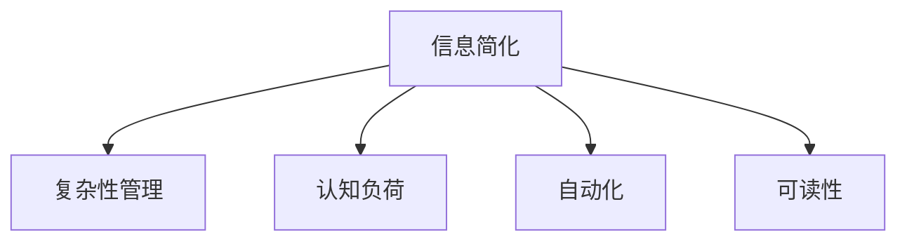

                 

# 信息简化的好处与挑战：简化复杂性的艺术与实践

> 关键词：信息简化, 复杂性管理, 可读性, 人工智能(AI), 机器学习(ML), 自动化, 认知负荷

## 1. 背景介绍

### 1.1 问题由来

在现代社会，信息的爆炸性增长为人类带来了前所未有的便利，同时也带来了巨大的挑战。面对海量的数据和复杂的系统，人们越来越渴望找到一种方法，将复杂的信息转化为易于理解和处理的简明形式。这种需求在人工智能（AI）和机器学习（ML）领域尤为迫切，因为模型和算法通常需要处理大量的数据和复杂的计算过程。信息的简化不仅有助于提升系统的性能和可维护性，还能够在减轻用户认知负荷的同时，增强系统的易用性和普及度。

### 1.2 问题核心关键点

信息简化（Information Simplification）的核心理念是将复杂的信息转化为简明、易于理解和处理的形式，以减少用户的认知负荷，提升系统性能和用户体验。其主要挑战包括：

1. **数据量的处理**：如何在处理大量数据的同时，减少冗余和噪音，提取关键信息。
2. **复杂性的降维**：如何在降维的同时保持信息的准确性和完整性。
3. **信息的呈现方式**：如何选择合适的表示形式，使得信息更容易被用户理解和使用。
4. **系统性能的提升**：如何通过信息简化提升算法的效率和精度。

### 1.3 问题研究意义

研究信息简化的好处与挑战，对提升信息处理效率、优化用户体验、推动AI技术普及具有重要意义：

1. **提升系统性能**：通过简化信息，能够显著减少计算量，提升算法的执行效率。
2. **优化用户体验**：简化的信息能够降低用户的认知负荷，提升系统的易用性和普及度。
3. **促进技术普及**：简化的信息形式更容易被非专业人士理解和接受，有助于推动AI技术的普及。
4. **增强研究创新**：信息简化有助于揭示数据的内在规律，促进科学研究的创新和突破。

## 2. 核心概念与联系

### 2.1 核心概念概述

为更好地理解信息简化的原理和应用，本节将介绍几个关键概念：

- **信息简化（Information Simplification）**：将复杂的信息转化为简明、易于理解和处理的形式，以减少用户的认知负荷，提升系统性能和用户体验。
- **复杂性管理（Complexity Management）**：通过合理的设计和优化，将复杂系统转化为易于管理和维护的形式。
- **认知负荷（Cognitive Load）**：用户处理信息时所需的心理资源，过多认知负荷会降低用户的学习和决策能力。
- **自动化（Automation）**：通过算法和系统实现信息的自动处理和简化，减少人工干预和认知负荷。
- **可读性（Readability）**：信息的表达形式易于用户理解和接受，有助于信息的传递和应用。

这些概念之间的逻辑关系可以通过以下Mermaid流程图来展示：



这个流程图展示了信息简化的核心概念及其与其他概念之间的联系：

1. 信息简化通过将复杂的信息转化为简明形式，直接关联复杂性管理和认知负荷。
2. 自动化通过算法和系统实现信息简化，进一步提升系统的性能和用户体验。
3. 可读性是信息简化的一种重要目标，通过简化的信息形式，提升用户理解和接受信息的效率。

## 3. 核心算法原理 & 具体操作步骤
### 3.1 算法原理概述

信息简化的核心原理是通过算法和模型，将复杂的信息转化为简明、易于理解和处理的形式。这种转化通常包括数据的降维、特征选择、编码和解码等步骤。

形式化地，假设原始信息为 $X$，简化后的信息为 $Y$，信息简化的过程可以表示为：

$$
Y = f(X)
$$

其中，$f$ 为简化算法，$Y$ 为简化后的信息形式。

信息简化的目标是通过 $f$ 去除冗余、噪音，提取关键信息，使得 $Y$ 具有以下特性：

- **精确性**：简化后的信息仍然保留原始信息的关键特征和结构。
- **简洁性**：简化后的信息形式更加简明，易于用户理解和处理。
- **可解释性**：简化后的信息形式能够提供直观的解释和分析，帮助用户理解和应用。

### 3.2 算法步骤详解

信息简化的步骤通常包括数据预处理、特征选择、编码和解码等环节。以下是一个典型的信息简化流程：

1. **数据预处理**：对原始数据进行清洗、归一化、去噪等处理，减少冗余和噪音。
2. **特征选择**：选择对简化目标最有信息量的特征，去除无关特征。
3. **编码**：将预处理后的特征映射为简明的形式，如向量、树、图等。
4. **解码**：将编码后的信息形式还原为易于理解和处理的形式。

### 3.3 算法优缺点

信息简化的算法具有以下优点：

- **提高效率**：简化后的信息通常计算量更小，处理速度更快。
- **增强可解释性**：简化后的信息更容易被用户理解和解释。
- **减少冗余**：通过特征选择和编码，减少信息的冗余和噪音。

但同时，信息简化也存在一些局限性：

- **信息丢失**：在简化过程中，可能会丢失一些关键信息，影响信息精度。
- **算法复杂度**：信息简化的算法通常较为复杂，实现和优化难度较大。
- **应用范围有限**：信息简化方法需要根据具体任务和数据特点进行选择，适用范围有限。

### 3.4 算法应用领域

信息简化在多个领域都有广泛应用，包括但不限于：

- **数据处理**：在数据分析、数据挖掘等领域，信息简化有助于提取关键特征，提升数据分析的效率和精度。
- **自然语言处理**：在文本摘要、信息检索、机器翻译等任务中，信息简化能够将复杂文本转化为简明摘要或关键词，提升任务性能。
- **图像处理**：在图像压缩、特征提取等任务中，信息简化能够将复杂图像转化为简明特征向量，提升处理速度和效率。
- **推荐系统**：在推荐算法中，信息简化能够将用户行为数据转化为简明特征，提升推荐系统的精度和效率。
- **知识图谱**：在知识图谱构建中，信息简化能够将复杂的关系图转化为简明的实体-关系表示，提升知识推理的效率和准确性。

## 4. 数学模型和公式 & 详细讲解 & 举例说明

### 4.1 数学模型构建

信息简化通常使用数学模型来描述和分析，以下是几个常见的数学模型：

- **主成分分析（PCA）**：通过降维技术，将高维数据映射到低维空间，去除冗余信息。
- **t-分布随机邻域嵌入（t-SNE）**：通过降维技术，将高维数据映射到低维空间，保留数据结构。
- **特征选择**：使用信息增益、卡方检验等方法，选择对简化目标最有信息量的特征。

### 4.2 公式推导过程

以主成分分析（PCA）为例，其核心思想是将高维数据映射到低维空间，去除冗余信息。PCA的数学模型为：

$$
\min_{U,S} \text{tr}(S^{T}S) \quad \text{subject to} \quad \text{tr}(U^{T}A_{X}U) = I
$$

其中 $A_{X}$ 为原始数据的协方差矩阵，$U$ 为变换矩阵，$S$ 为对角矩阵，$I$ 为单位矩阵。

通过求解上述优化问题，可以得到变换矩阵 $U$ 和对角矩阵 $S$，使得原始数据 $X$ 映射到低维空间 $Y = U^{T}X$。

### 4.3 案例分析与讲解

以PCA为例，分析其在图像压缩中的应用。假设原始图像的像素数为 $1024\times1024$，转换为256维的特征向量 $X$。通过PCA降维，可以将 $X$ 映射到64维的低维空间 $Y$。设 $U$ 和 $S$ 分别为变换矩阵和对角矩阵，则 $Y = U^{T}X$。

在实际应用中，可以通过以下步骤进行PCA图像压缩：

1. 对原始图像进行预处理，如归一化、去噪等。
2. 计算原始图像的协方差矩阵 $A_{X}$。
3. 通过求解优化问题，得到变换矩阵 $U$ 和对角矩阵 $S$。
4. 将原始图像 $X$ 映射到低维空间 $Y$，得到压缩后的图像。

通过PCA，图像的像素数被压缩至原来的1/16，同时保留了大部分图像信息，实现了高效的信息简化。

## 5. 项目实践：代码实例和详细解释说明
### 5.1 开发环境搭建

在进行信息简化实践前，我们需要准备好开发环境。以下是使用Python进行TensorFlow开发的环境配置流程：

1. 安装Anaconda：从官网下载并安装Anaconda，用于创建独立的Python环境。

2. 创建并激活虚拟环境：
```bash
conda create -n tf-env python=3.8 
conda activate tf-env
```

3. 安装TensorFlow：根据CUDA版本，从官网获取对应的安装命令。例如：
```bash
conda install tensorflow
```

4. 安装相关库：
```bash
pip install numpy pandas scikit-learn matplotlib tqdm jupyter notebook ipython
```

完成上述步骤后，即可在`tf-env`环境中开始信息简化的实践。

### 5.2 源代码详细实现

这里我们以PCA图像压缩为例，给出使用TensorFlow对图像进行PCA压缩的PyTorch代码实现。

首先，导入必要的库和数据：

```python
import tensorflow as tf
import numpy as np
import matplotlib.pyplot as plt
from sklearn.decomposition import PCA

# 读取图像数据
image = plt.imread('image.png')
image = np.array(image)
```

然后，对图像进行PCA压缩：

```python
# 计算协方差矩阵
A_X = np.cov(image.flatten())

# 计算特征值和特征向量
pca = PCA()
Y = pca.fit_transform(image.reshape(1, -1))

# 压缩图像
compressed_image = pca.inverse_transform(Y)
```

最后，将压缩后的图像显示出来：

```python
plt.imshow(compressed_image[0].reshape(128, 128), cmap='gray')
plt.show()
```

以上就是使用TensorFlow对图像进行PCA压缩的完整代码实现。可以看到，TensorFlow配合其他Python库，可以方便地实现复杂的数学模型和算法。

### 5.3 代码解读与分析

让我们再详细解读一下关键代码的实现细节：

**PCA算法**：
- `A_X = np.cov(image.flatten())`：计算原始图像的协方差矩阵。
- `pca = PCA()`：创建PCA模型实例。
- `Y = pca.fit_transform(image.reshape(1, -1))`：使用PCA模型对原始图像进行降维，得到压缩后的图像。

**图像处理**：
- `image = plt.imread('image.png')`：读取图像文件。
- `image = np.array(image)`：将图像转换为NumPy数组。
- `compressed_image = pca.inverse_transform(Y)`：使用PCA模型的逆变换，将压缩后的图像还原为原始图像。

通过上述代码，我们可以看到TensorFlow和NumPy、Sklearn等库的紧密配合，使得复杂的数学模型和算法变得简单易行。

当然，实际的工程应用中，信息简化通常需要更复杂和精细的算法和数据处理流程，开发者需要对算法原理有深入的理解和掌握。

## 6. 实际应用场景
### 6.1 智能推荐系统

信息简化在智能推荐系统中有着广泛应用。推荐系统通常需要处理大量的用户行为数据，包括浏览记录、点击记录、评分记录等。通过信息简化，可以将这些复杂数据转化为简明的特征向量，提升推荐算法的精度和效率。

在实际应用中，可以使用PCA、t-SNE等算法，对用户行为数据进行降维，提取关键特征。然后，将这些特征输入到推荐算法中，进行用户行为建模和推荐计算。通过信息简化，推荐系统能够更快地处理和分析用户数据，提升推荐效果。

### 6.2 图像识别系统

信息简化在图像识别系统中也有着重要应用。图像识别系统通常需要处理大量的图像数据，如人脸识别、物体检测等。通过信息简化，可以将复杂图像转化为简明的特征向量，提升图像识别的精度和速度。

在实际应用中，可以使用PCA、Autoencoder等算法，对图像进行降维和特征提取。然后，将这些特征输入到图像识别算法中，进行图像识别和分类。通过信息简化，图像识别系统能够更快地处理和分析图像数据，提升识别效果。

### 6.3 自然语言处理

信息简化在自然语言处理中也得到了广泛应用。自然语言处理系统通常需要处理大量的文本数据，如文本分类、情感分析、机器翻译等。通过信息简化，可以将复杂文本转化为简明的摘要或关键词，提升处理效率和效果。

在实际应用中，可以使用TF-IDF、LDA等算法，对文本进行降维和特征提取。然后，将这些特征输入到自然语言处理算法中，进行文本分析和处理。通过信息简化，自然语言处理系统能够更快地处理和分析文本数据，提升处理效果。

### 6.4 未来应用展望

随着信息简化的不断发展和应用，其在多个领域的应用前景将会更加广阔。未来，信息简化技术将带来以下几方面的变化和突破：

1. **自动化程度提高**：信息简化的算法和系统将更加自动化和智能化，能够自动处理和简化复杂信息。
2. **应用场景扩展**：信息简化技术将应用于更多领域，如金融、医疗、教育等，提升这些领域的处理效率和精度。
3. **跨领域融合**：信息简化技术将与其他人工智能技术进行更深入的融合，如知识表示、因果推理等，提升系统的综合能力。
4. **数据隐私保护**：信息简化技术将提升数据隐私保护能力，通过数据压缩和加密，减少数据泄露风险。
5. **认知负荷降低**：信息简化技术将进一步降低用户的认知负荷，提升系统的易用性和用户体验。

## 7. 工具和资源推荐
### 7.1 学习资源推荐

为了帮助开发者系统掌握信息简化的理论基础和实践技巧，这里推荐一些优质的学习资源：

1. **《TensorFlow官方文档》**：TensorFlow官方文档，提供了丰富的代码示例和详细说明，是学习TensorFlow的重要资源。
2. **《Python机器学习》**：由Sebastian Raschka和Vahid Mirjalili合著，介绍了机器学习的基本概念和实践，是入门机器学习的重要教材。
3. **《深度学习》**：由Ian Goodfellow、Yoshua Bengio和Aaron Courville合著，介绍了深度学习的基本原理和应用，是深度学习领域的经典教材。
4. **《信息可视化》**：由Torbjørn T. Pedersen等合著，介绍了信息可视化的基本概念和实践，是信息可视化的重要教材。
5. **《数据科学与人工智能导论》**：由Kjell Johnson合著，介绍了数据科学和人工智能的基本概念和实践，是入门数据科学的重要教材。

通过对这些资源的学习实践，相信你一定能够快速掌握信息简化的精髓，并用于解决实际的NLP问题。

### 7.2 开发工具推荐

高效的开发离不开优秀的工具支持。以下是几款用于信息简化开发的常用工具：

1. **TensorFlow**：由Google主导开发的深度学习框架，生产部署方便，适合大规模工程应用。
2. **PyTorch**：基于Python的开源深度学习框架，灵活动态的计算图，适合快速迭代研究。
3. **Sklearn**：基于Python的机器学习库，提供了丰富的数据处理和特征提取算法。
4. **Numpy**：基于Python的科学计算库，提供了高效的数组和矩阵计算功能。
5. **Matplotlib**：基于Python的绘图库，提供了丰富的数据可视化功能。

合理利用这些工具，可以显著提升信息简化的开发效率，加快创新迭代的步伐。

### 7.3 相关论文推荐

信息简化的研究源于学界的持续研究。以下是几篇奠基性的相关论文，推荐阅读：

1. **PCA算法**：由Karhunen和Hotelling提出，是主成分分析的开创性工作。
2. **t-SNE算法**：由Lvd Maaten提出，是t分布随机邻域嵌入的开创性工作。
3. **LDA算法**：由Roberts和Wallach提出，是潜在狄利克雷分布的开创性工作。
4. **TF-IDF算法**：由Salton和McGill提出，是文本特征提取的开创性工作。
5. **Autoencoder算法**：由Hinton和Salakhutdinov提出，是自编码器的开创性工作。

这些论文代表了大数据处理和信息简化的发展脉络。通过学习这些前沿成果，可以帮助研究者把握学科前进方向，激发更多的创新灵感。

## 8. 总结：未来发展趋势与挑战
### 8.1 总结

本文对信息简化的好处与挑战进行了全面系统的介绍。首先阐述了信息简化的研究背景和意义，明确了其在提升系统性能、优化用户体验方面的独特价值。其次，从原理到实践，详细讲解了信息简化的数学原理和关键步骤，给出了信息简化任务开发的完整代码实例。同时，本文还广泛探讨了信息简化方法在智能推荐、图像识别、自然语言处理等多个领域的应用前景，展示了信息简化范式的巨大潜力。此外，本文精选了信息简化技术的各类学习资源，力求为读者提供全方位的技术指引。

通过本文的系统梳理，可以看到，信息简化技术在提升系统性能、优化用户体验方面具有重要价值，将在人工智能领域发挥越来越重要的作用。未来，伴随信息简化的不断发展和应用，我们将能够在更广泛的应用场景下，实现信息的高效处理和优化。

### 8.2 未来发展趋势

展望未来，信息简化的发展趋势将呈现以下几个方向：

1. **自动化程度提高**：信息简化的算法和系统将更加自动化和智能化，能够自动处理和简化复杂信息。
2. **应用场景扩展**：信息简化技术将应用于更多领域，如金融、医疗、教育等，提升这些领域的处理效率和精度。
3. **跨领域融合**：信息简化技术将与其他人工智能技术进行更深入的融合，如知识表示、因果推理等，提升系统的综合能力。
4. **数据隐私保护**：信息简化技术将提升数据隐私保护能力，通过数据压缩和加密，减少数据泄露风险。
5. **认知负荷降低**：信息简化技术将进一步降低用户的认知负荷，提升系统的易用性和用户体验。

### 8.3 面临的挑战

尽管信息简化技术已经取得了瞩目成就，但在迈向更加智能化、普适化应用的过程中，仍面临诸多挑战：

1. **数据质量和标注**：信息简化的效果很大程度上取决于原始数据的质量和标注数据的质量。如何获取高质量数据和标注，将是一大难题。
2. **算法复杂度**：信息简化的算法通常较为复杂，实现和优化难度较大。如何在降低复杂度的同时，保持信息精度的平衡，还需要更多理论和实践的积累。
3. **应用范围有限**：信息简化方法需要根据具体任务和数据特点进行选择，适用范围有限。如何提升方法的可扩展性和通用性，还需要更多研究和优化。
4. **用户接受度**：信息简化的效果很大程度上取决于用户接受度和信任度。如何提高用户对简化后的信息的理解和接受，还需要更多市场教育和推广。

### 8.4 研究展望

面对信息简化的挑战，未来的研究需要在以下几个方面寻求新的突破：

1. **无监督和半监督信息简化**：摆脱对大规模标注数据的依赖，利用自监督学习、主动学习等无监督和半监督范式，最大限度利用非结构化数据，实现更加灵活高效的信息简化。
2. **多模态信息简化**：将符号化的先验知识，如知识图谱、逻辑规则等，与神经网络模型进行巧妙融合，引导信息简化过程学习更准确、合理的语言模型。同时加强不同模态数据的整合，实现视觉、语音等多模态信息与文本信息的协同建模。
3. **因果分析和博弈论工具**：将因果分析方法引入信息简化模型，识别出模型决策的关键特征，增强输出解释的因果性和逻辑性。借助博弈论工具刻画人机交互过程，主动探索并规避模型的脆弱点，提高系统稳定性。
4. **融入伦理道德约束**：在信息简化的目标中引入伦理导向的评估指标，过滤和惩罚有偏见、有害的输出倾向。同时加强人工干预和审核，建立模型行为的监管机制，确保输出符合人类价值观和伦理道德。

这些研究方向的探索，必将引领信息简化技术迈向更高的台阶，为构建安全、可靠、可解释、可控的智能系统铺平道路。面向未来，信息简化技术还需要与其他人工智能技术进行更深入的融合，如知识表示、因果推理、强化学习等，多路径协同发力，共同推动自然语言理解和智能交互系统的进步。只有勇于创新、敢于突破，才能不断拓展信息简化的边界，让智能技术更好地造福人类社会。

## 9. 附录：常见问题与解答

**Q1：信息简化是否适用于所有信息处理场景？**

A: 信息简化在大多数信息处理场景中都能取得不错的效果，特别是对于数据量较大的任务。但对于一些特定领域的任务，如医疗、法律等，仅仅依靠通用语料预训练的模型可能难以很好地适应。此时需要在特定领域语料上进一步预训练，再进行简化，才能获得理想效果。此外，对于一些需要时效性、个性化很强的任务，如对话、推荐等，信息简化方法也需要针对性的改进优化。

**Q2：如何选择合适的信息简化算法？**

A: 信息简化的算法选择通常需要考虑以下几个因素：
1. 数据特点：不同的数据类型和分布可能需要不同的简化算法。
2. 任务需求：不同的任务需要不同的特征提取和表示形式。
3. 系统性能：不同的算法对系统性能的影响不同，需要综合评估。
4. 用户接受度：简化后的信息形式是否易于用户理解和接受。

常见的信息简化算法包括PCA、t-SNE、LDA、TF-IDF、Autoencoder等，需要根据具体场景进行选择。

**Q3：信息简化的效果如何衡量？**

A: 信息简化的效果通常通过以下几个指标进行衡量：
1. 信息精度：简化后的信息是否保留了原始信息的关键特征和结构。
2. 简洁性：简化后的信息形式是否更加简明、易于处理。
3. 可解释性：简化后的信息是否提供了直观的解释和分析，帮助用户理解和应用。
4. 系统性能：简化后的信息是否提高了系统的处理效率和效果。

在实际应用中，通常需要根据具体任务和需求进行综合评估，选择合适的信息简化算法和参数。

**Q4：信息简化在落地部署时需要注意哪些问题？**

A: 将信息简化模型转化为实际应用，还需要考虑以下因素：
1. 模型裁剪：去除不必要的层和参数，减小模型尺寸，加快推理速度。
2. 量化加速：将浮点模型转为定点模型，压缩存储空间，提高计算效率。
3. 服务化封装：将模型封装为标准化服务接口，便于集成调用。
4. 弹性伸缩：根据请求流量动态调整资源配置，平衡服务质量和成本。
5. 监控告警：实时采集系统指标，设置异常告警阈值，确保服务稳定性。
6. 安全防护：采用访问鉴权、数据脱敏等措施，保障数据和模型安全。

信息简化技术需要在数据、算法、工程、业务等多个维度协同发力，才能真正实现信息的简化和优化。

---

作者：禅与计算机程序设计艺术 / Zen and the Art of Computer Programming

