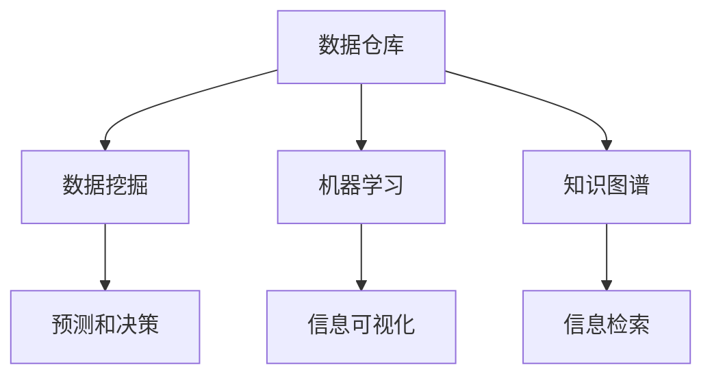

                 

# 信息管理的艺术：如何简化你的生活和工作

在当今信息爆炸的时代，如何高效地管理和利用信息成为了我们每个人都需要面对的挑战。无论是个人生活还是企业工作，信息管理的能力直接影响了我们的决策效率、工作质量和满意度。本文旨在探讨信息管理的艺术，通过深入浅出的技术语言，为你揭示如何简化你的生活和工作，提升信息管理的水平。

## 1. 背景介绍

### 1.1 问题由来

随着互联网和信息技术的发展，信息来源日益多样化，信息总量呈指数级增长。如何从海量信息中筛选、整理、归纳、存储和利用信息，成为了现代社会的一项重要任务。信息管理不仅涉及到数据的采集、整理和存储，更包括对信息的深度分析和利用。然而，传统的信息管理方式往往依赖人工操作，效率低下，容易出错。而自动化、智能化技术的应用，为信息管理提供了新的解决方案，简化了信息处理的过程，提高了管理效率。

### 1.2 问题核心关键点

信息管理的关键点在于如何高效地存储、检索和利用信息。主要包括以下几个方面：

1. **数据收集与清洗**：从不同来源收集数据，并进行去重、去噪、标准化处理。
2. **信息存储与管理**：选择合适的存储技术，保证数据安全、易用、易扩展。
3. **信息检索与分析**：利用算法和模型进行高效的信息检索与分析，发现数据中的规律和趋势。
4. **信息可视化**：将分析结果转化为直观的图形，便于理解与应用。
5. **知识管理与共享**：构建知识库，实现知识的积累、共享与传承。

### 1.3 问题研究意义

在信息时代，信息管理的水平直接决定了个人和企业的竞争力。通过简化信息管理流程，提高信息利用效率，可以大大提升工作和生活质量。此外，自动化和智能化的信息管理方法，能够减少人力成本，降低错误率，提高决策速度和准确性。因此，深入研究信息管理技术，对于个人和企业都具有重要意义。

## 2. 核心概念与联系

### 2.1 核心概念概述

为了更好地理解信息管理的方法和技术，本节将介绍几个密切相关的核心概念：

- **数据仓库(Data Warehouse)**：一个集中的数据存储系统，用于存储企业内部的历史数据，支持复杂的数据分析和管理。
- **数据挖掘(Data Mining)**：从数据仓库中发现知识、模式和关系的过程，是信息管理的重要工具。
- **机器学习(Machine Learning)**：通过算法和模型，自动发现数据中的规律和趋势，支持预测和决策。
- **知识图谱(Knowledge Graph)**：一种语义化的数据表示方法，用于构建实体和关系网络，支持信息检索和知识推理。
- **信息可视化(Information Visualization)**：将复杂的信息和数据转化为图形，帮助人们理解和应用信息。
- **大数据技术(Big Data Technologies)**：包括数据存储、处理和分析的技术，支持大规模数据的处理和管理。

这些核心概念之间的逻辑关系可以通过以下Mermaid流程图来展示：



这个流程图展示了大数据时代信息管理的核心概念及其之间的关系：

1. 数据仓库是信息管理的基石，存储和管理企业内部的数据。
2. 数据挖掘和机器学习利用数据仓库中的数据，发现知识、模式和关系。
3. 信息可视化将发现的知识和模式转化为图形，便于理解和应用。
4. 知识图谱构建实体和关系网络，支持信息检索和知识推理。
5. 预测和决策利用数据挖掘和机器学习的结果，指导业务决策。

## 3. 核心算法原理 & 具体操作步骤

### 3.1 算法原理概述

信息管理的核心在于高效地存储、检索和利用信息。其核心算法包括数据清洗、数据仓库构建、数据挖掘、知识图谱构建和信息可视化等。

- **数据清洗**：通过去除重复、错误、无关的数据，保证数据的质量和一致性。
- **数据仓库构建**：将清洗后的数据存储到一个集中的系统中，支持复杂的数据查询和分析。
- **数据挖掘**：利用算法和模型，从数据中发现知识、模式和关系，支持业务决策。
- **知识图谱构建**：通过语义化的表示方法，构建实体和关系网络，支持知识检索和推理。
- **信息可视化**：将发现的知识和模式转化为图形，帮助人们理解和应用信息。

### 3.2 算法步骤详解

信息管理的步骤通常包括以下几个关键环节：

**Step 1: 数据收集与清洗**
- 从不同来源收集数据，如数据库、日志文件、外部接口等。
- 对数据进行清洗，去除重复、错误、无关的数据。
- 对数据进行标准化处理，如格式转换、去噪等。

**Step 2: 数据仓库构建**
- 选择合适的存储技术，如关系型数据库、NoSQL数据库等。
- 建立数据仓库，将清洗后的数据存储到一个集中的系统中。
- 设计数据模型，保证数据的一致性和完整性。

**Step 3: 数据挖掘**
- 选择合适的算法和模型，如分类、聚类、关联规则等。
- 对数据仓库中的数据进行挖掘，发现知识、模式和关系。
- 评估算法的性能，选择合适的模型进行应用。

**Step 4: 知识图谱构建**
- 设计实体和关系的表示方法，如RDF、OWL等。
- 利用算法和工具，构建知识图谱，如RDF Dataset、Neo4j等。
- 进行知识图谱的查询和推理，支持信息检索和知识应用。

**Step 5: 信息可视化**
- 选择合适的可视化工具，如Tableau、Power BI等。
- 将数据挖掘和知识图谱的结果转化为图形，如柱状图、散点图、网络图等。
- 进行交互式展示，帮助人们理解和应用信息。

### 3.3 算法优缺点

信息管理的优点在于能够通过自动化和智能化技术，提升信息处理的效率和准确性。具体来说：

- **效率提升**：自动化的数据清洗和存储，减少了人工操作的时间和错误率。
- **精度提高**：数据挖掘和机器学习能够发现数据中的模式和规律，提高决策的准确性。
- **知识共享**：知识图谱和信息可视化支持知识的积累和共享，提升企业知识管理水平。

然而，信息管理也存在一些局限性：

- **技术复杂**：数据清洗、数据挖掘、知识图谱构建等技术较为复杂，需要专业知识。
- **资源消耗**：自动化和智能化技术需要较大的计算资源和存储空间，成本较高。
- **数据质量依赖**：信息管理的质量很大程度上依赖于数据的质量和完整性。

### 3.4 算法应用领域

信息管理技术已经被广泛应用于各种行业，如金融、医疗、零售、制造等。以下是几个典型应用场景：

- **金融风控**：通过数据分析和机器学习，发现异常交易行为，进行风险控制。
- **医疗健康**：通过电子病历和数据挖掘，发现疾病模式和趋势，支持临床决策。
- **零售电商**：通过用户行为分析和推荐算法，提升销售额和客户满意度。
- **智能制造**：通过物联网数据和机器学习，优化生产流程，提高生产效率。

## 4. 数学模型和公式 & 详细讲解 & 举例说明

### 4.1 数学模型构建

信息管理中的数学模型通常包括数据清洗、数据挖掘和信息可视化等。

- **数据清洗**：去除重复、错误、无关的数据，可以表示为：

  $$
  \text{CleanData}(D) = D - \text{DuplicateData}(D) - \text{NoisyData}(D)
  $$

- **数据挖掘**：通过分类算法，将数据分为不同的类别，可以表示为：

  $$
  \text{Clusters}(D) = \{\text{Cluster}_i | \text{Cluster}_i \subset D\}
  $$

- **信息可视化**：将数据转化为图形，可以使用散点图表示：

  $$
  \text{ScatterPlot}(X,Y) = \{(x_i,y_i) | x_i \in X, y_i \in Y\}
  $$

### 4.2 公式推导过程

以下是一些具体的公式推导过程：

**数据清洗**：假设原始数据集为 $D$，其中包含重复数据 $D_1$ 和噪声数据 $D_2$。则清洗后的数据集可以表示为：

$$
\text{CleanData}(D) = D - D_1 - D_2
$$

**数据挖掘**：假设原始数据集为 $D$，其中包含 $K$ 个类别。通过分类算法，得到 $K$ 个类别 $C_1, C_2, ..., C_K$。则分类结果可以表示为：

$$
\text{Clusters}(D) = \{C_i | C_i \subset D, \text{Class}(C_i) = i\}
$$

**信息可视化**：假设原始数据集为 $X$ 和 $Y$，其中 $X$ 为横轴数据，$Y$ 为纵轴数据。则散点图可以表示为：

$$
\text{ScatterPlot}(X,Y) = \{(x_i,y_i) | x_i \in X, y_i \in Y\}
$$

### 4.3 案例分析与讲解

**案例：电商平台的用户行为分析**

电商平台上用户的行为数据包括浏览记录、购买记录、评价记录等。通过对这些数据的清洗、挖掘和可视化，可以发现用户的购买偏好和行为模式，进而优化推荐系统，提升销售额和客户满意度。

- **数据收集与清洗**：
  - 收集用户的浏览、购买、评价数据。
  - 去除重复、错误、无关的数据，如缺失值、异常值。
  - 对数据进行标准化处理，如格式转换、去噪等。

- **数据仓库构建**：
  - 选择合适的存储技术，如关系型数据库、NoSQL数据库等。
  - 建立数据仓库，将清洗后的数据存储到一个集中的系统中。
  - 设计数据模型，保证数据的一致性和完整性。

- **数据挖掘**：
  - 选择合适的算法和模型，如关联规则、协同过滤等。
  - 对数据仓库中的数据进行挖掘，发现用户的行为模式和购买偏好。
  - 评估算法的性能，选择合适的模型进行应用。

- **知识图谱构建**：
  - 设计实体和关系的表示方法，如RDF、OWL等。
  - 利用算法和工具，构建知识图谱，如RDF Dataset、Neo4j等。
  - 进行知识图谱的查询和推理，支持信息检索和知识应用。

- **信息可视化**：
  - 选择合适的可视化工具，如Tableau、Power BI等。
  - 将数据挖掘和知识图谱的结果转化为图形，如散点图、网络图等。
  - 进行交互式展示，帮助电商平台优化推荐系统，提升用户满意度和销售额。

## 5. 项目实践：代码实例和详细解释说明

### 5.1 开发环境搭建

在进行信息管理项目开发前，我们需要准备好开发环境。以下是使用Python进行信息管理开发的典型环境配置流程：

1. 安装Anaconda：从官网下载并安装Anaconda，用于创建独立的Python环境。

2. 创建并激活虚拟环境：
```bash
conda create -n info_env python=3.8 
conda activate info_env
```

3. 安装必要的库：
```bash
pip install pandas numpy matplotlib seaborn scikit-learn transformers datasets
```

4. 安装机器学习库：
```bash
pip install scikit-learn numpy pandas matplotlib seaborn
```

5. 安装信息管理库：
```bash
pip install scipy numpy pandas matplotlib seaborn
```

完成上述步骤后，即可在`info_env`环境中开始信息管理项目开发。

### 5.2 源代码详细实现

下面以电商推荐系统的信息管理为例，给出使用Python进行信息管理开发的代码实现。

首先，导入必要的库：

```python
import pandas as pd
import numpy as np
from sklearn.model_selection import train_test_split
from sklearn.preprocessing import StandardScaler
from sklearn.decomposition import PCA
from sklearn.cluster import KMeans
from sklearn.ensemble import RandomForestClassifier
from sklearn.metrics import accuracy_score
import matplotlib.pyplot as plt
import seaborn as sns
from sklearn.metrics import confusion_matrix
```

然后，定义数据集和数据清洗函数：

```python
# 定义数据集
df = pd.read_csv('data.csv')

# 数据清洗
df = df.drop_duplicates()
df = df.dropna()
df = df.drop(columns=['id'])
```

接着，定义数据仓库和数据挖掘函数：

```python
# 定义数据仓库
df_train, df_test = train_test_split(df, test_size=0.2, random_state=42)
df_train.to_csv('train_data.csv', index=False)
df_test.to_csv('test_data.csv', index=False)

# 定义数据挖掘
def data_mining(df):
    # 标准化处理
    scaler = StandardScaler()
    scaled_df = scaler.fit_transform(df)
    
    # PCA降维
    pca = PCA(n_components=3)
    pca_df = pca.fit_transform(scaled_df)
    
    # K-Means聚类
    kmeans = KMeans(n_clusters=5)
    kmeans.fit(pca_df)
    
    # 输出聚类结果
    return kmeans.labels_
```

最后，定义信息可视化函数：

```python
# 定义信息可视化
def info_visualization(df_train, df_test):
    # 散点图
    sns.scatterplot(x='price', y='quality', hue='label', data=df_train)
    plt.show()
    
    # 混淆矩阵
    y_pred = kmeans.labels_
    y_true = df_train['label']
    conf_matrix = confusion_matrix(y_true, y_pred)
    sns.heatmap(conf_matrix, annot=True, fmt='d')
    plt.show()
```

完成上述代码实现后，即可在`info_env`环境中进行信息管理项目的开发。

### 5.3 代码解读与分析

让我们再详细解读一下关键代码的实现细节：

**数据集和数据清洗**：
- 使用Pandas库读取数据集，并使用`drop_duplicates`、`dropna`和`drop`方法进行数据清洗。

**数据仓库和数据挖掘**：
- 使用Scikit-learn库进行数据标准化处理、PCA降维和K-Means聚类。
- 通过设置不同的参数，可以选择最优的模型和算法。

**信息可视化**：
- 使用Seaborn库绘制散点图，展示数据分布和聚类结果。
- 使用Seaborn库绘制混淆矩阵，展示分类器的性能。

通过以上步骤，可以有效地进行信息管理项目的开发，提升数据处理的效率和精度。

## 6. 实际应用场景

### 6.1 智能客服系统

智能客服系统利用信息管理技术，可以大幅提升客服的响应速度和客户满意度。通过对客户的历史对话记录进行分析，智能客服系统可以自动识别客户的意图和需求，提供快速准确的答复。

在技术实现上，可以收集客服系统的历史对话记录，进行数据清洗和标准化处理，建立数据仓库。通过数据挖掘和机器学习，智能客服系统可以学习客户的行为模式和偏好，优化推荐系统，提升客户体验。

### 6.2 金融风控系统

金融风控系统利用信息管理技术，可以实时监控交易行为，识别异常交易，进行风险控制。通过对客户的历史交易数据进行分析，金融风控系统可以发现异常交易行为，及时预警，减少风险损失。

在技术实现上，可以收集金融交易的历史数据，进行数据清洗和标准化处理，建立数据仓库。通过数据挖掘和机器学习，金融风控系统可以发现交易中的异常模式，识别高风险行为，进行风险控制。

### 6.3 智慧医疗系统

智慧医疗系统利用信息管理技术，可以提升医疗服务的效率和质量。通过对电子病历和医疗数据进行分析，智慧医疗系统可以发现疾病模式和趋势，支持临床决策。

在技术实现上，可以收集电子病历和医疗数据，进行数据清洗和标准化处理，建立数据仓库。通过数据挖掘和机器学习，智慧医疗系统可以发现疾病模式和趋势，支持临床决策，提升医疗服务质量。

### 6.4 未来应用展望

随着信息管理技术的不断进步，未来将会有更多的应用场景涌现。

- **智能制造**：通过对生产数据进行分析，优化生产流程，提高生产效率。
- **智慧城市**：通过对城市数据进行分析，优化城市管理，提升城市运行效率。
- **智能交通**：通过对交通数据进行分析，优化交通流，提升交通效率。

## 7. 工具和资源推荐

### 7.1 学习资源推荐

为了帮助开发者系统掌握信息管理的理论基础和实践技巧，这里推荐一些优质的学习资源：

1. 《数据仓库技术与应用》系列书籍：由数据库技术专家撰写，深入浅出地介绍了数据仓库的原理和应用。

2. 《数据挖掘与统计学习》课程：斯坦福大学开设的机器学习课程，有Lecture视频和配套作业，帮助理解数据挖掘的基本概念和经典模型。

3. 《机器学习实战》书籍：Hands-On机器学习实战，通过实际案例展示信息管理的具体实现。

4. Kaggle平台：提供丰富的数据集和竞赛，帮助开发者实践和提升信息管理技能。

5. Coursera平台：提供系统化学习信息管理的课程，包括数据清洗、数据挖掘、信息可视化等。

通过对这些资源的学习实践，相信你一定能够快速掌握信息管理的精髓，并用于解决实际的业务问题。

### 7.2 开发工具推荐

高效的开发离不开优秀的工具支持。以下是几款用于信息管理开发的常用工具：

1. Python：作为信息管理开发的通用语言，Python拥有丰富的库和框架，支持高效的数据处理和机器学习。

2. R语言：专注于数据分析和统计，拥有强大的数据处理和可视化功能，适合数据挖掘和信息可视化任务。

3. SQL：用于关系型数据库的操作，支持高效的数据查询和存储。

4. Tableau：提供直观的数据可视化工具，支持交互式展示和分析。

5. Power BI：提供全面的商业智能工具，支持数据清洗、数据挖掘、信息可视化等。

合理利用这些工具，可以显著提升信息管理项目的开发效率，加快创新迭代的步伐。

### 7.3 相关论文推荐

信息管理技术的发展源于学界的持续研究。以下是几篇奠基性的相关论文，推荐阅读：

1. Data Warehouse: A New Tool for Information Analysis（信息仓库：信息分析的新工具）：介绍数据仓库的概念、原理和应用。

2. Data Mining: Practical Machine Learning Tools and Algorithms（数据挖掘：实用机器学习工具与算法）：系统介绍数据挖掘的基本概念和常用算法。

3. Knowledge Graphs and Semantic Web: A Comprehensive Survey（知识图谱与语义网：综述）：介绍知识图谱的基本概念、表示方法和应用。

4. Information Visualization: Toward a New Foundation of Information Visualization（信息可视化：信息可视化的新基础）：探讨信息可视化的基本概念和常用技术。

5. Big Data Technologies: A Survey（大数据技术综述）：介绍大数据技术的核心概念、存储技术和处理算法。

这些论文代表了大数据时代信息管理技术的发展脉络。通过学习这些前沿成果，可以帮助研究者把握学科前进方向，激发更多的创新灵感。

## 8. 总结：未来发展趋势与挑战

### 8.1 总结

本文对信息管理的艺术进行了全面系统的介绍。首先阐述了信息管理的背景和意义，明确了信息管理在提升个人和企业竞争力方面的重要价值。其次，从原理到实践，详细讲解了信息管理的数学模型和关键步骤，给出了信息管理项目开发的完整代码实例。同时，本文还广泛探讨了信息管理技术在智能客服、金融风控、智慧医疗等众多领域的应用前景，展示了信息管理技术的广阔前景。

通过本文的系统梳理，可以看到，信息管理技术正在成为企业信息化的重要工具，极大地提升了信息处理的效率和准确性。未来，伴随大数据技术和人工智能技术的不断进步，信息管理技术将进一步提升企业的竞争力，助力企业数字化转型升级。

### 8.2 未来发展趋势

展望未来，信息管理技术将呈现以下几个发展趋势：

1. **自动化程度提升**：自动化技术将进一步提升信息处理的效率，减少人工操作的复杂性。
2. **智能化水平提高**：智能算法和模型将帮助信息管理从简单的数据处理转向更深层次的知识发现和应用。
3. **实时性增强**：实时数据处理和分析技术将支持信息管理的实时性，提升决策的及时性和准确性。
4. **跨领域融合**：信息管理技术将与云计算、物联网、人工智能等技术进行深度融合，拓展应用场景。
5. **数据隐私保护**：数据隐私和安全成为重要关注点，信息管理技术需要加强数据保护和隐私保护。

### 8.3 面临的挑战

尽管信息管理技术已经取得了显著的进展，但在迈向更加智能化、自动化、实时化的应用过程中，它仍面临着诸多挑战：

1. **数据质量依赖**：信息管理的质量很大程度上依赖于数据的质量和完整性。低质量数据会导致错误的分析和决策。
2. **技术复杂性**：信息管理技术需要多种技术的综合应用，包括数据清洗、数据挖掘、知识图谱构建等，技术复杂度较高。
3. **资源消耗**：自动化和智能化技术需要较大的计算资源和存储空间，成本较高。
4. **隐私保护**：在信息管理过程中，需要处理大量敏感数据，隐私保护问题不容忽视。

### 8.4 研究展望

未来的研究需要在以下几个方面寻求新的突破：

1. **数据清洗与预处理**：开发更高效的数据清洗和预处理技术，提升数据质量。
2. **算法优化与创新**：开发更高效的算法和模型，提升信息管理的精度和效率。
3. **实时数据处理**：开发实时数据处理技术，支持信息管理的实时性和动态性。
4. **跨领域应用**：拓展信息管理技术在更多领域的应用，如智能制造、智慧城市等。
5. **隐私保护技术**：开发数据隐私保护技术，确保信息管理过程的安全性和合规性。

总之，信息管理技术需要不断创新和优化，才能适应信息爆炸时代的需求，提升个人和企业的数据利用效率，推动智能化、自动化、实时化的发展。相信随着技术的不断进步，信息管理技术必将在更多领域发挥重要作用，助力人类社会的数字化转型升级。

## 9. 附录：常见问题与解答

**Q1：信息管理技术需要哪些基础技能？**

A: 信息管理技术需要掌握以下基础技能：

- **数据处理与分析**：掌握数据清洗、数据预处理和数据分析的技能。
- **机器学习**：掌握常见的机器学习算法和模型，如分类、聚类、关联规则等。
- **编程与工具**：掌握Python、R等编程语言，以及Pandas、Scikit-learn等数据处理和分析工具。
- **可视化技术**：掌握信息可视化的基本技能，使用Tableau、Power BI等工具进行数据展示。

**Q2：如何选择合适的信息管理工具？**

A: 选择信息管理工具需要考虑以下几个因素：

- **数据类型**：根据数据类型选择合适的存储和处理工具，如关系型数据库、NoSQL数据库等。
- **数据规模**：根据数据规模选择合适的计算资源，如单机、集群等。
- **功能需求**：根据功能需求选择合适的工具，如数据清洗、数据挖掘、信息可视化等。
- **成本预算**：根据成本预算选择合适的工具，平衡性能和成本。

**Q3：信息管理中常见的错误有哪些？**

A: 信息管理中常见的错误包括：

- **数据质量问题**：数据清洗不彻底、数据不一致、数据不完整等。
- **算法选择错误**：算法选择不当、模型参数设置不合理等。
- **数据隐私问题**：数据隐私保护不充分、数据泄露等。
- **工具选择不当**：工具选择不当、使用不当等。

**Q4：信息管理的未来发展方向是什么？**

A: 信息管理的未来发展方向包括：

- **自动化与智能化**：自动化和智能化技术将进一步提升信息处理的效率和精度。
- **实时性增强**：实时数据处理和分析技术将支持信息管理的实时性，提升决策的及时性和准确性。
- **跨领域融合**：信息管理技术将与云计算、物联网、人工智能等技术进行深度融合，拓展应用场景。
- **隐私保护**：数据隐私和安全成为重要关注点，信息管理技术需要加强数据保护和隐私保护。

**Q5：信息管理技术如何提升企业的竞争力？**

A: 信息管理技术通过以下方式提升企业的竞争力：

- **提升决策效率**：通过高效的数据分析和信息处理，提升决策的及时性和准确性。
- **优化资源配置**：通过数据分析和机器学习，优化资源配置，提高生产效率和运营效率。
- **增强客户体验**：通过客户数据分析和信息管理，提升客户满意度和忠诚度。
- **降低运营成本**：通过自动化和智能化技术，降低人工操作和运营成本。

通过以上常见问题的解答，相信你能够更好地理解信息管理的艺术，掌握信息管理的技巧，提升信息管理的水平。

---

作者：禅与计算机程序设计艺术 / Zen and the Art of Computer Programming

