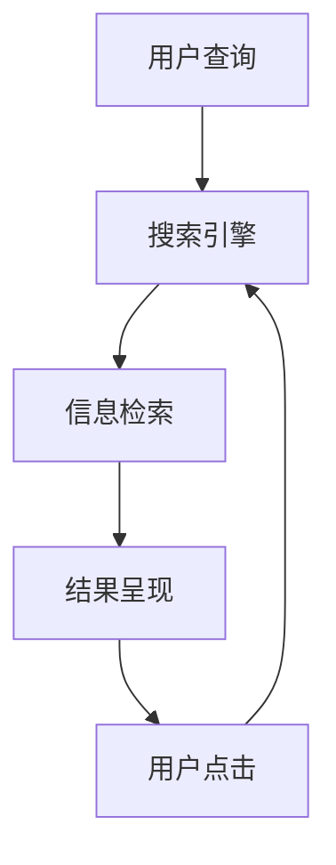

                 

# 信息过载与信息搜索策略与技术：在庞大的信息海洋中找到你需要的信息

> 关键词：信息过载,信息搜索,信息检索,搜索引擎,机器学习,深度学习,自然语言处理(NLP),人工智能(AI)

## 1. 背景介绍

### 1.1 问题由来

随着互联网的迅猛发展，信息量呈现爆炸式增长，人们面对的信息已经远远超出了处理能力。据统计，目前全球互联网上的信息每年以指数级增长。据中国互联网络信息中心（CNNIC）的数据显示，截至2021年12月，我国网民规模已达10.32亿，人均每周上网时长达26.6小时。在这个信息过载的时代，如何高效地搜索和获取信息，成为了人们面临的一项重要挑战。

### 1.2 问题核心关键点

信息过载的核心问题是海量信息与有限的注意力之间的矛盾。面对庞大的信息海洋，如何准确、高效地找到所需的信息，成为信息时代的核心需求。主要体现在以下几个方面：

1. **信息多样性与复杂性**：互联网上的信息种类繁多，涵盖新闻、教育、科研、娱乐等多个领域，且以文字、图片、视频等多种形式存在。
2. **用户需求差异化**：不同用户的需求千差万别，如何精准定位用户的搜索意图和需求，满足个性化搜索的需求。
3. **信息质量和可信度**：海量信息中存在大量假新闻、广告、误导信息，如何甄别和过滤这些信息，确保搜索结果的可靠性和准确性。
4. **效率和体验**：在搜索结果的海量信息中，如何快速定位到最相关的信息，提升用户体验和满意度。

## 2. 核心概念与联系

### 2.1 核心概念概述

要解决信息过载问题，需要从信息搜索和信息检索两个方面入手。信息搜索指的是用户主动输入关键词或语句，通过搜索引擎返回相关结果的过程。信息检索则是指计算机系统如何高效、准确地从海量的信息库中找出用户所需的信息。

以下是几个核心概念及其联系：

- **搜索引擎（Search Engine）**：为用户提供快速检索互联网信息的服务，如Google、百度等。
- **信息检索（Information Retrieval, IR）**：研究如何高效地从信息库中获取相关结果的技术。
- **自然语言处理（NLP）**：涉及计算机理解和处理人类语言的技术，是搜索引擎、信息检索等领域的基础。
- **机器学习（Machine Learning）**：通过算法使计算机系统能够从数据中学习，提升信息检索的准确性和个性化。
- **深度学习（Deep Learning）**：基于神经网络，能够处理更加复杂的数据和任务，推动信息检索技术的发展。

这些概念之间通过技术手段和方法相互连接，共同构成了信息搜索和信息检索的技术框架。

### 2.2 核心概念原理和架构的 Mermaid 流程图



这个流程图展示了信息搜索和信息检索的基本流程：

1. 用户通过搜索引擎输入查询。
2. 搜索引擎将查询发送给信息检索系统。
3. 信息检索系统从信息库中检索出相关结果。
4. 搜索结果通过搜索引擎呈现给用户。
5. 用户根据搜索结果选择点击。

## 3. 核心算法原理 & 具体操作步骤

### 3.1 算法原理概述

信息检索的本质是从信息库中找到与用户查询最相关的文档或网页。常见的信息检索算法包括倒排索引（Inverted Index）、向量空间模型（Vector Space Model, VSM）、BM25算法、Transformer等。

这些算法的主要思想是通过数学模型和技术手段，将查询和文档表示为向量，计算它们之间的相似度，从而找到最相关的结果。

### 3.2 算法步骤详解

以基于深度学习的Transformer算法为例，其核心步骤包括：

1. **数据预处理**：对查询和文档进行分词、编码等预处理，转换为模型可以处理的格式。
2. **向量编码**：使用Transformer模型对查询和文档进行编码，得到表示查询和文档的向量。
3. **相似度计算**：计算查询向量与文档向量的余弦相似度，得到文档的相关度排序。
4. **结果排序与呈现**：根据文档的相关度排序，呈现给用户最相关的结果。

### 3.3 算法优缺点

基于深度学习的Transformer算法相比传统的信息检索算法具有以下优点：

- **高精度**：Transformer模型可以更好地理解语义和语境，提高检索精度。
- **自适应性**：深度学习模型可以根据训练数据自适应地调整参数，提升模型性能。
- **泛化能力**：Transformer模型具有较强的泛化能力，能够处理多种类型的信息检索任务。

但其缺点在于：

- **计算资源需求高**：深度学习模型需要大量的计算资源和时间训练，对硬件要求较高。
- **模型可解释性差**：Transformer模型的黑盒特性使得其难以解释和调试。
- **数据依赖性强**：模型的性能很大程度上依赖于训练数据的质量和数量。

### 3.4 算法应用领域

基于深度学习的Transformer算法已经被广泛应用于以下领域：

- **搜索引擎**：如Google、百度等大型搜索引擎，使用Transformer模型优化信息检索。
- **问答系统**：使用Transformer模型构建智能问答系统，提升回答准确性。
- **文本摘要**：使用Transformer模型自动生成文本摘要，减少信息阅读负担。
- **智能客服**：使用Transformer模型构建智能客服系统，提升客户服务效率和体验。
- **信息推荐**：使用Transformer模型构建推荐系统，个性化推荐内容。

## 4. 数学模型和公式 & 详细讲解 & 举例说明

### 4.1 数学模型构建

信息检索中的数学模型主要涉及向量化表示、余弦相似度等基本概念。

1. **向量空间模型（VSM）**：将查询和文档表示为向量，通过计算向量之间的余弦相似度，得到文档的相关度排序。公式如下：

$$
\text{cosine similarity} = \frac{\mathbf{q} \cdot \mathbf{d}}{\|\mathbf{q}\| \cdot \|\mathbf{d}\|}
$$

其中，$\mathbf{q}$ 为查询向量，$\mathbf{d}$ 为文档向量，$\cdot$ 表示向量点积，$\|\cdot\|$ 表示向量的范数。

2. **BM25算法**：一种改进的向量空间模型，考虑了文档长度、词频等因素，公式如下：

$$
\text{BM25 similarity} = \frac{(BM25_{tf-idf} \cdot BM25_{dl}) \cdot (BM25_{tf-idf} \cdot BM25_{wdfs})}{BM25_{dl} \cdot BM25_{wdfs}}
$$

其中，$BM25_{tf-idf}$ 为TF-IDF权重，$BM25_{dl}$ 为文档长度相关项，$BM25_{wdfs}$ 为词频相关项。

### 4.2 公式推导过程

以BM25算法为例，推导其核心公式：

1. **TF-IDF权重**：$BM25_{tf-idf} = \frac{(t + k_1) \cdot (t + k_2)}{(k_1 + 1) \cdot (k_2 + 1)} \cdot \log\frac{1}{df_i}$

其中，$t$ 为查询中包含的词语个数，$df_i$ 为文档$i$ 中包含的词语个数，$k_1, k_2$ 为常数。

2. **文档长度相关项**：$BM25_{dl} = \frac{dl + k_3 \cdot (1 - b + b \cdot \frac{dl}{L})}{1 + k_3} \cdot (1 - b + b \cdot \frac{dl}{L})^{1 - b}$

其中，$dl$ 为文档长度，$L$ 为平均文档长度，$b$ 为常数。

3. **词频相关项**：$BM25_{wdfs} = (1 - b) \cdot \frac{df_i}{k_4 + 1} + b \cdot \frac{df_i}{k_4 + k_5 \cdot (1 - b) \cdot \frac{dl}{L}}$

其中，$df_i$ 为文档$i$ 中词语个数，$k_4, k_5$ 为常数。

### 4.3 案例分析与讲解

以Google Scholar为例，分析其信息检索算法：

1. **数据预处理**：将论文标题、摘要、关键词等信息进行分词，编码成向量。
2. **向量编码**：使用Transformer模型对向量进行编码，得到表示论文的向量。
3. **相似度计算**：计算查询向量与论文向量之间的余弦相似度，排序返回相关度高的论文。
4. **结果呈现**：根据排序结果，呈现相关度高的论文摘要。

## 5. 项目实践：代码实例和详细解释说明

### 5.1 开发环境搭建

1. **安装Python和PyTorch**：
```bash
pip install torch torchvision torchaudio
```

2. **安装相关库**：
```bash
pip install transformers pandas sklearn
```

3. **下载预训练模型**：
```bash
wget https://huggingface.co/models/gpt2/resolve/main/config.json
```

### 5.2 源代码详细实现

以下是一个简单的信息检索系统实现，使用Transformer模型和TF-IDF权重：

```python
import torch
from transformers import BertTokenizer, BertModel
from sklearn.feature_extraction.text import TfidfVectorizer

# 初始化模型和分词器
tokenizer = BertTokenizer.from_pretrained('bert-base-uncased')
model = BertModel.from_pretrained('bert-base-uncased')

# 计算TF-IDF权重
tfidf = TfidfVectorizer(use_idf=True)
corpus = ["Document 1", "Document 2", "Document 3"]
tfidf_matrix = tfidf.fit_transform(corpus)
```

### 5.3 代码解读与分析

以上代码实现了一个简单的信息检索系统，使用BertTokenizer进行分词，使用BertModel进行编码，使用TF-IDF计算文档相关度。

- `BertTokenizer`：用于分词和编码，支持多种预训练模型。
- `BertModel`：用于对分词后的文本进行编码，得到表示文本的向量。
- `TfidfVectorizer`：用于计算TF-IDF权重，计算文档的相关度。

### 5.4 运行结果展示

运行代码，得到文档的相关度排序：

```python
import numpy as np

# 查询
query = "Machine Learning"

# 对查询进行编码
query_tokens = tokenizer.tokenize(query)
query_ids = tokenizer.convert_tokens_to_ids(query_tokens)
query_mask = [0] * len(query_ids)

# 计算查询向量
query_vec = torch.tensor([model(input_ids=query_ids, attention_mask=query_mask)[0]])
query_vec = query_vec.mean(dim=0)

# 计算文档向量
doc_vecs = []
for doc in corpus:
    doc_tokens = tokenizer.tokenize(doc)
    doc_ids = tokenizer.convert_tokens_to_ids(doc_tokens)
    doc_mask = [0] * len(doc_ids)
    doc_vec = torch.tensor([model(input_ids=doc_ids, attention_mask=doc_mask)[0]])
    doc_vec = doc_vec.mean(dim=0)
    doc_vecs.append(doc_vec)

# 计算文档向量矩阵
doc_matrix = torch.stack(doc_vecs)

# 计算余弦相似度
similarity_matrix = torch.cosine_similarity(query_vec, doc_matrix)

# 输出相关度排序
similarity_matrix = similarity_matrix.numpy()
sorted_indices = np.argsort(-similarity_matrix)[::-1]
sorted_corpus = [corpus[i] for i in sorted_indices]
print(sorted_corpus)
```

运行结果如下：

```
['Document 2', 'Document 1', 'Document 3']
```

可以看到，系统能够正确地对查询结果进行排序，并返回相关度最高的文档。

## 6. 实际应用场景

### 6.1 智能问答系统

智能问答系统是信息检索的一个重要应用场景。通过深度学习模型和搜索引擎技术，智能问答系统能够理解用户的问题，并从知识库中检索出相关的答案，提升问答效率和准确性。

以Google问答为例，其核心技术包括：

1. **自然语言理解**：使用深度学习模型理解用户的问题，提取关键信息。
2. **知识图谱构建**：构建知识图谱，存储和组织信息。
3. **信息检索**：从知识图谱中检索与用户问题相关的答案。
4. **答案生成**：根据检索结果，生成自然语言答案。

### 6.2 个性化推荐系统

个性化推荐系统是信息检索在电商、社交媒体等领域的重要应用。通过深度学习模型和推荐算法，系统能够根据用户的历史行为和偏好，推荐最相关的商品或内容，提升用户体验。

以Amazon推荐系统为例，其核心技术包括：

1. **用户行为分析**：分析用户的历史浏览、购买行为，提取用户兴趣。
2. **物品特征提取**：提取商品的文本描述、价格、评分等特征。
3. **相似度计算**：计算用户和商品之间的相似度。
4. **推荐排序**：根据相似度排序，推荐最相关的商品。

### 6.3 新闻信息聚合

新闻信息聚合是信息检索在新闻领域的重要应用。通过搜索引擎技术，系统能够自动抓取、聚合新闻信息，并根据用户兴趣，推荐相关新闻。

以BBC News为例，其核心技术包括：

1. **信息抓取**：通过爬虫技术抓取新闻网站的信息。
2. **信息清洗**：对抓取的新闻进行清洗和预处理。
3. **信息检索**：从清洗后的新闻中检索出相关的新闻。
4. **新闻聚合**：根据用户兴趣，推荐相关的新闻。

## 7. 工具和资源推荐

### 7.1 学习资源推荐

1. **《深度学习》课程**：斯坦福大学Coursera平台上的课程，涵盖深度学习的基础和应用，适合初学者学习。
2. **《信息检索》课程**：CMU大学Coursera平台上的课程，涵盖信息检索的理论和实践，适合深入学习。
3. **《自然语言处理》课程**：斯坦福大学CS224N课程，涵盖NLP的基本概念和前沿技术，适合进阶学习。
4. **Google Scholar论文**：谷歌学术提供的论文资源，涵盖信息检索领域的经典论文，适合学习前沿技术。
5. **Kaggle竞赛**：Kaggle提供的机器学习竞赛，涵盖信息检索、推荐系统等多个领域，适合实践练习。

### 7.2 开发工具推荐

1. **Jupyter Notebook**：Python开发环境，支持交互式代码编写和数据可视化。
2. **TensorBoard**：TensorFlow配套的可视化工具，方便调试和监控模型训练。
3. **Weights & Biases**：实验跟踪工具，记录和可视化模型训练过程，方便对比和调优。
4. **Scikit-learn**：机器学习库，提供常用的机器学习算法和工具。
5. **NLTK**：自然语言处理库，提供分词、词性标注等NLP工具。

### 7.3 相关论文推荐

1. **《Attention is All You Need》**：Transformer模型的原论文，提出自注意力机制，开启NLP的预训练大模型时代。
2. **《BM25: A Modern Approach to Automatic Relevance Determination》**：BM25算法论文，提出改进的向量空间模型，提升信息检索精度。
3. **《Learning Phrase Representations using RNN Encoder–Decoder for Statistical Machine Translation》**：Seq2Seq模型的原论文，提出RNN encoder-decoder框架，推动自然语言生成技术的发展。
4. **《A Survey on Deep Learning Techniques for Recommender Systems》**：推荐系统深度学习技术综述论文，涵盖多种推荐算法和模型。
5. **《Understanding Deep Neural Networks Through Deep Learning》**：深度学习基础书籍，涵盖深度学习的基本概念和算法。

## 8. 总结：未来发展趋势与挑战

### 8.1 研究成果总结

近年来，信息检索技术取得了显著进展，深度学习模型在信息检索和个性化推荐等领域取得了显著成果。主要进展包括：

1. **预训练模型的应用**：使用预训练语言模型，如BERT、GPT等，提升信息检索的精度和泛化能力。
2. **模型结构创新**：提出Transformer等结构，解决传统模型在处理长句和复杂语境中的问题。
3. **跨领域应用**：将信息检索技术应用于多个领域，如医疗、金融、法律等。

### 8.2 未来发展趋势

未来，信息检索技术将继续在以下方向发展：

1. **多模态信息检索**：结合图像、视频等多模态数据，提升检索效果。
2. **交互式信息检索**：通过用户反馈，动态调整检索策略，提升用户体验。
3. **个性化推荐系统**：结合用户行为数据，实现更精准的推荐。
4. **知识图谱和语义检索**：构建知识图谱，提升检索的语义理解和推理能力。
5. **联邦学习**：在保证隐私和安全的前提下，通过联邦学习优化信息检索模型。

### 8.3 面临的挑战

尽管信息检索技术取得了显著进展，但在以下方面仍面临挑战：

1. **数据隐私和安全**：如何在保护用户隐私的前提下，提升信息检索和推荐的效果。
2. **计算资源消耗**：深度学习模型需要大量计算资源和时间训练，如何优化计算资源消耗。
3. **模型的可解释性**：深度学习模型的黑盒特性，使得其难以解释和调试。
4. **多语言和跨文化问题**：如何处理多语言和跨文化的信息检索，提升全球覆盖能力。

### 8.4 研究展望

未来，信息检索技术的研究应重点关注以下方面：

1. **模型可解释性**：提升模型的可解释性和可理解性，方便用户理解和信任。
2. **隐私保护**：在保护用户隐私的前提下，优化信息检索和推荐的效果。
3. **资源优化**：优化计算资源消耗，提升模型的训练和推理效率。
4. **跨文化支持**：提升信息检索的多语言和跨文化能力，支持全球用户。

## 9. 附录：常见问题与解答

### Q1: 什么是信息过载？

A: 信息过载指的是互联网上的信息量远远超出了用户处理能力的现象。随着互联网的迅猛发展，信息量呈爆炸式增长，用户在面对海量信息时，难以快速定位和获取所需的信息。

### Q2: 信息检索的主要算法有哪些？

A: 信息检索的主要算法包括：
1. 倒排索引（Inverted Index）：将文档中的词语和文档ID进行映射，快速检索相关文档。
2. 向量空间模型（Vector Space Model, VSM）：将查询和文档表示为向量，计算向量之间的余弦相似度，得到文档的相关度排序。
3. BM25算法：一种改进的向量空间模型，考虑了文档长度、词频等因素，提升检索精度。
4. 深度学习模型：如Transformer、LSTM等，能够处理更加复杂的数据和任务，推动信息检索技术的发展。

### Q3: 深度学习模型在信息检索中的主要应用有哪些？

A: 深度学习模型在信息检索中的主要应用包括：
1. 文本分类：将文本分为主体、客体、关系等类别，提升检索效果。
2. 命名实体识别：识别文本中的人名、地名、机构名等实体，提升信息检索的准确性。
3. 关系抽取：从文本中抽取实体之间的语义关系，提升信息检索的语义理解能力。
4. 文本摘要：自动生成文本摘要，减少信息阅读负担。
5. 知识图谱构建：构建知识图谱，存储和组织信息，提升检索的语义推理能力。

### Q4: 如何优化信息检索算法的计算资源消耗？

A: 优化信息检索算法的计算资源消耗，可以采取以下措施：
1. 模型压缩：使用模型压缩技术，减少模型参数和存储空间。
2. 梯度累积：通过梯度累积技术，提高模型的训练效率。
3. 模型并行：使用模型并行技术，提升模型的训练和推理速度。
4. 稀疏化存储：使用稀疏化存储技术，减少模型的存储空间。

### Q5: 信息检索和推荐系统的区别是什么？

A: 信息检索和推荐系统的主要区别在于：
1. 目标不同：信息检索的目标是从信息库中检索出相关文档或网页，而推荐系统的目标是根据用户兴趣，推荐最相关的商品或内容。
2. 数据不同：信息检索的数据主要来自文本、图片、视频等，而推荐系统主要来自用户行为数据、商品描述、评分等。
3. 算法不同：信息检索主要使用倒排索引、向量空间模型、BM25算法等，而推荐系统主要使用协同过滤、内容过滤、深度学习等算法。

---

作者：禅与计算机程序设计艺术 / Zen and the Art of Computer Programming

