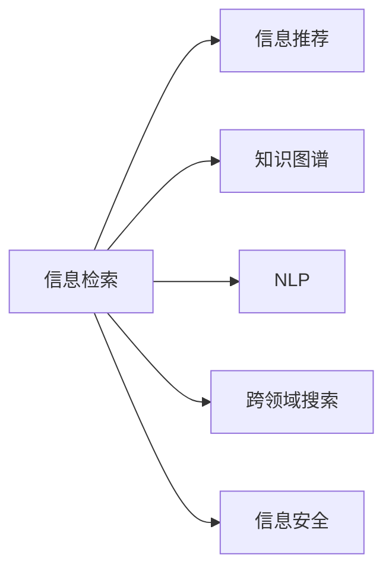

                 

# 信息过载与信息搜索：如何在信息海洋中找到你需要的东西

在当今数字化时代，信息爆炸已经成为不争的事实。大量的信息源和多样化的数据形式，让人们在寻找所需信息时面临前所未有的挑战。如何在大数据时代中快速、准确地获取信息，成为了信息检索和信息管理领域的一个核心问题。本文将从背景、核心概念、算法原理到实际应用，系统地介绍信息搜索的核心方法和技术，以期帮助读者在信息海洋中找到他们需要的东西。

## 1. 背景介绍

### 1.1 问题由来
随着互联网的普及和社交媒体的兴起，全球的信息量呈现出爆炸性的增长。据统计，2022年全球生成的数据总量已经超过了37ZB，而且这一数字还在以每年数倍增长的速度增加[[1]]。这些数据不仅包含了文本、图片、音频、视频等多种形式，还包括来自社交媒体、电商平台、智能设备等各个角落的海量信息。

然而，信息量的大幅增加并没有带来信息质量的提升，反而导致信息过载（Information Overload）现象的加剧。信息过载指个人或组织接收到的信息量远远超过其处理能力，从而导致信息获取、分析和应用效率下降，决策能力和执行效果受阻的现象。在信息过载的背景下，如何在海量的信息中找到所需的信息，并迅速作出反应，成为了一项重要的技术挑战。

### 1.2 问题核心关键点
信息搜索的核心在于如何高效地从大量数据中筛选出与查询相关的信息。查询可以是文本、图片、视频、音频等任意形式，数据来源可以是网络、数据库、档案等多种渠道。有效的信息搜索需要克服以下几个关键问题：

- **数据规模巨大**：随着互联网和数字设备的高速发展，数据量呈指数级增长，导致数据检索的复杂性大大增加。
- **信息质量参差不齐**：不同来源的信息质量差异较大，需要有效过滤噪声信息。
- **用户需求多样化**：用户的需求和查询方式各异，需要灵活适应不同的搜索场景。
- **实时性要求高**：信息检索往往需要满足实时或准实时的需求，以应对快速变化的信息环境。

## 2. 核心概念与联系

### 2.1 核心概念概述

为更好地理解信息搜索的核心方法，本节将介绍几个密切相关的核心概念：

- **信息检索**（Information Retrieval, IR）：利用计算机技术从大量信息中自动检索出与查询相关的文档或数据的过程。常见的信息检索系统包括全文搜索引擎、数据库检索系统等。
- **信息推荐**（Information Recommendation）：通过分析用户的历史行为数据，推荐可能感兴趣的信息。推荐系统广泛应用于电商、新闻、社交媒体等场景。
- **知识图谱**（Knowledge Graph）：一种语义化结构化数据表示方式，用于描述实体、属性及实体间的关系。知识图谱能够帮助查询系统更准确地理解和处理复杂的查询需求。
- **自然语言处理**（Natural Language Processing, NLP）：研究如何使计算机理解和处理人类自然语言的技术。NLP技术在信息检索、问答系统、信息抽取等方面有广泛应用。
- **跨领域搜索**（Cross-domain Search）：在一个数据源中搜索涉及不同领域的信息，如跨语言、跨媒体搜索。跨领域搜索需要处理多源异构数据的融合与映射问题。
- **信息安全**（Information Security）：保护信息免受未经授权的访问和泄露，确保信息检索和推荐系统的安全性。信息安全技术包括数据加密、身份验证、权限控制等。

这些核心概念之间的逻辑关系可以通过以下Mermaid流程图来展示：



这个流程图展示了信息检索与其他相关概念之间的紧密联系。通过综合运用这些技术，可以有效提升信息搜索和信息管理的效率和效果。

## 3. 核心算法原理 & 具体操作步骤

### 3.1 算法原理概述

信息搜索的核心算法包括检索算法和推荐算法，其中检索算法是基础，推荐算法则在此基础上进一步提升用户体验和信息相关性。

信息检索算法通过建立索引数据库，将文档按照特定规则（如倒排索引）进行组织，然后使用匹配算法（如布尔检索、向量空间模型）从索引中查找与查询相关的文档。推荐算法则利用用户行为数据，使用机器学习模型（如协同过滤、内容过滤）预测用户可能感兴趣的信息。

这些算法共同构成了信息搜索的技术基础。通过不断优化和融合这些算法，信息检索和推荐系统可以提供更加智能和高效的信息服务。

### 3.2 算法步骤详解

**信息检索算法步骤**：
1. **数据收集**：从各个数据源收集信息，并将其标准化和清洗。
2. **索引建立**：利用倒排索引等方法，将文档按照关键词或属性进行组织。
3. **查询匹配**：用户输入查询后，算法从索引库中匹配相关的文档。
4. **结果排序**：根据匹配度对搜索结果进行排序，通常使用TF-IDF、BM25等算法。
5. **结果展示**：将排序后的结果展示给用户，并支持分页、排序等交互功能。

**信息推荐算法步骤**：
1. **用户画像建立**：分析用户的历史行为数据，建立用户兴趣模型。
2. **物品画像建立**：分析物品的属性和相关文档，建立物品特征模型。
3. **相似度计算**：利用协同过滤、内容过滤等方法计算用户和物品之间的相似度。
4. **推荐生成**：根据相似度计算结果，生成推荐列表。
5. **结果展示**：将推荐结果展示给用户，并支持实时更新和交互功能。

### 3.3 算法优缺点

信息搜索的优点包括：
- **高效性**：通过建立索引和优化算法，可以快速从大量数据中检索出相关信息。
- **普适性**：可以应用于多种信息形式和数据源，覆盖文本、图片、音频等多种媒体类型。
- **灵活性**：支持多种查询方式和多种交互接口，能够适应不同的应用场景。

缺点包括：
- **数据质量依赖**：搜索结果的质量很大程度上依赖于数据源的质量和完整性。
- **用户需求匹配度**：对于复杂查询或新出现的信息，匹配度可能不足，导致误报或漏报。
- **处理复杂性**：处理大规模数据集和高维度的特征空间，需要较高的计算资源和算法复杂度。

### 3.4 算法应用领域

信息搜索技术在多个领域得到了广泛应用，例如：

- **搜索引擎**：如Google、Bing、百度等，通过爬取网络上的文本信息，利用倒排索引和向量空间模型进行搜索。
- **电商推荐**：如Amazon、淘宝、京东等，根据用户浏览和购买行为，生成个性化推荐商品列表。
- **社交媒体**：如Facebook、Twitter、微博等，根据用户关注和互动，生成个性化推荐内容。
- **新闻推荐**：如今日头条、腾讯新闻等，根据用户阅读历史和兴趣，生成个性化新闻推荐。
- **医疗搜索**：如Medline、PubMed等，利用医学文献数据库进行疾病、药物等方面的信息检索。
- **法律检索**：如LexisNexis、Westlaw等，利用法律文献数据库进行案件、法规等方面的信息检索。

## 4. 数学模型和公式 & 详细讲解

### 4.1 数学模型构建

本节将使用数学语言对信息搜索的核心算法进行严格刻画。

记查询文档集合为 $D$，用户输入的查询为 $q$。设 $D$ 中文档数为 $N$，每个文档 $d$ 表示为一个向量 $\vec{d} = (d_1, d_2, ..., d_M)$，其中 $d_i$ 表示文档 $d$ 中第 $i$ 个关键词的出现次数或权重。查询 $q$ 也表示为一个向量 $\vec{q} = (q_1, q_2, ..., q_M)$。

定义文档 $d$ 与查询 $q$ 的余弦相似度为：

$$
\cos(q, d) = \frac{\vec{q} \cdot \vec{d}}{||\vec{q}|| \cdot ||\vec{d}||}
$$

其中 $\cdot$ 表示向量点积，$||\cdot||$ 表示向量范数。

### 4.2 公式推导过程

在向量空间模型中，查询与文档的匹配度可以通过余弦相似度来计算。余弦相似度越高，表示文档与查询的相关性越强。

余弦相似度的具体计算过程如下：
1. 对查询 $q$ 和文档 $d$ 进行词频统计，得到向量 $\vec{q}$ 和 $\vec{d}$。
2. 计算两个向量的点积 $\vec{q} \cdot \vec{d}$。
3. 计算两个向量的范数 $||\vec{q}||$ 和 $||\vec{d}||$。
4. 计算余弦相似度 $\cos(q, d)$。

在实际应用中，为了提高检索效率，可以引入倒排索引技术。倒排索引通过将文档按照关键词进行索引，可以快速查找包含特定关键词的文档。倒排索引的构建过程包括：

1. 对文档 $d$ 中的每个关键词 $k$，记录包含 $k$ 的文档编号和位置。
2. 将关键词 $k$ 和对应的文档列表 $(N_i, P_i)$ 存储在索引表中。
3. 查询时，根据查询 $q$ 中的关键词，在索引表中查找包含这些关键词的文档。

### 4.3 案例分析与讲解

以查询“2023年世界杯足球预测”为例，假设有一个包含多篇体育报道的文档集合 $D$。查询 $q$ 可以表示为 $\vec{q} = (世界杯, 2023, 预测)$。

1. **数据预处理**：
   - 对文档集合 $D$ 进行词频统计，得到每个文档的向量表示 $\vec{d}$。
   - 对查询 $q$ 进行词频统计，得到向量 $\vec{q}$。

2. **相似度计算**：
   - 计算查询 $q$ 与每个文档 $d$ 的余弦相似度 $\cos(q, d)$。
   - 选择相似度最高的前 $k$ 篇文档作为搜索结果。

3. **结果展示**：
   - 将搜索结果按照相似度排序，展示给用户。

通过这种基于余弦相似度的信息检索方法，可以快速找到与查询相关的文档，帮助用户获取所需信息。

## 5. 项目实践：代码实例和详细解释说明

### 5.1 开发环境搭建

在进行信息搜索项目开发前，我们需要准备好开发环境。以下是使用Python进行Scikit-learn开发的环境配置流程：

1. 安装Anaconda：从官网下载并安装Anaconda，用于创建独立的Python环境。

2. 创建并激活虚拟环境：
```bash
conda create -n ir-env python=3.8 
conda activate ir-env
```

3. 安装Scikit-learn：
```bash
pip install scikit-learn
```

4. 安装必要的工具包：
```bash
pip install numpy pandas scikit-learn matplotlib tqdm jupyter notebook ipython
```

完成上述步骤后，即可在`ir-env`环境中开始信息搜索项目的开发。

### 5.2 源代码详细实现

下面我们以信息检索系统为例，给出使用Scikit-learn进行文本信息检索的Python代码实现。

首先，定义数据处理函数：

```python
from sklearn.feature_extraction.text import TfidfVectorizer
from sklearn.metrics.pairwise import cosine_similarity
import numpy as np

def preprocess_data(texts):
    vectorizer = TfidfVectorizer(stop_words='english', max_df=0.5, min_df=5)
    vectors = vectorizer.fit_transform(texts)
    return vectors
```

然后，定义查询匹配函数：

```python
def search(query, vectors, top_k=10):
    query_vector = vectorizer.transform([query])
    similarities = cosine_similarity(query_vector, vectors)
    top_indices = np.argsort(similarities)[0][-top_k:]
    return vectors[top_indices]
```

最后，启动查询流程并展示结果：

```python
# 假设有一个文档集合 texts
# 查询 q = "2023年世界杯足球预测"
# 预处理数据
vectors = preprocess_data(texts)
# 查询匹配
result = search("2023年世界杯足球预测", vectors, top_k=10)
print(result)
```

以上就是使用Scikit-learn进行文本信息检索的完整代码实现。可以看到，通过简单的几行代码，我们就可以实现基本的文本信息检索功能。

### 5.3 代码解读与分析

让我们再详细解读一下关键代码的实现细节：

**preprocess_data函数**：
- 使用TF-IDF向量器对文本进行预处理，生成文档的向量表示。
- 根据向量表示计算相似度，返回相似度矩阵。

**search函数**：
- 对查询进行预处理，生成查询向量。
- 计算查询向量与所有文档向量的相似度。
- 根据相似度排序，返回相似度最高的前 $k$ 篇文档。

**查询流程**：
- 加载文档集合和查询文本。
- 对文档集合进行预处理，生成文档向量。
- 对查询文本进行预处理，生成查询向量。
- 调用search函数进行匹配，返回最相关的文档向量。

## 6. 实际应用场景

### 6.1 电子商务搜索

电子商务平台每天接收大量的用户搜索请求，如何快速、准确地展示用户可能感兴趣的商品成为了关键问题。

在实践中，可以利用信息检索算法对用户输入的查询进行处理，快速检索出包含相关关键词的商品列表。同时，引入推荐算法，根据用户的历史浏览和购买行为，进一步提升推荐的相关性和准确性。这种基于信息检索和推荐的双重机制，可以显著提升用户的购物体验和平台转化率。

### 6.2 新闻聚合

新闻聚合平台需要处理海量的新闻内容，为用户推荐最新、最相关的文章。

在实际应用中，可以构建一个新闻文章库，利用信息检索算法对用户的查询进行匹配，快速检索出可能相关的文章。同时，引入机器学习模型（如内容过滤、协同过滤等），根据用户的历史阅读行为进行个性化推荐。这种基于检索和推荐的组合方法，可以大幅提高新闻推荐系统的性能和用户体验。

### 6.3 法律咨询

法律咨询平台需要快速回答用户的法律咨询问题，提供准确的法律信息和建议。

在实践中，可以构建一个法律文献库，利用信息检索算法对用户的查询进行匹配，检索出可能相关的法律文献。同时，引入自然语言处理技术，对检索结果进行摘要和分类，提供更加精准和易懂的法律信息。这种基于检索和处理的组合方法，可以显著提升法律咨询平台的查询效率和准确性。

## 7. 工具和资源推荐

### 7.1 学习资源推荐

为了帮助开发者系统掌握信息搜索的理论基础和实践技巧，这里推荐一些优质的学习资源：

1. 《Introduction to Information Retrieval》书籍：由Christopher D. Manning等人所著，全面介绍了信息检索的基本原理和经典算法。
2. 《Python for Data Science》书籍：由Jake VanderPlas等人所著，介绍了使用Python进行数据处理和机器学习的方法，包括信息检索和推荐系统。
3. Coursera《Natural Language Processing with Python》课程：由Coursera开设的NLP入门课程，涵盖信息检索、文本处理、推荐系统等多个方面。
4. Kaggle《Information Retrieval Kernels》比赛：利用Kaggle平台进行信息检索算法的实际应用练习，提升实践能力。
5. GitHub《IR-Engine》项目：开源信息检索引擎的代码实现，包含详细的文档和示例代码。

通过对这些资源的学习实践，相信你一定能够快速掌握信息搜索的精髓，并用于解决实际的搜索问题。

### 7.2 开发工具推荐

高效的开发离不开优秀的工具支持。以下是几款用于信息搜索开发的常用工具：

1. Scikit-learn：基于Python的开源机器学习库，提供了多种数据处理和机器学习算法，包括信息检索和推荐系统。
2. Elasticsearch：一个开源的全文本搜索引擎，支持复杂的查询语法和分布式架构，适用于大规模信息检索应用。
3. Apache Solr：一个基于Lucene的开放源码搜索引擎，提供丰富的查询功能和扩展模块，支持多种数据源和查询方式。
4. TensorFlow和PyTorch：深度学习框架，可以用于构建更复杂的推荐系统模型，支持自动微分和模型优化。
5. Apache Spark：大数据处理引擎，可以用于处理大规模数据集，支持并行计算和分布式部署。

合理利用这些工具，可以显著提升信息搜索任务的开发效率，加快创新迭代的步伐。

### 7.3 相关论文推荐

信息搜索技术的发展源于学界的持续研究。以下是几篇奠基性的相关论文，推荐阅读：

1. "A Vector Space Model for Automatic Indexing"（Salton & Buckley, 1988）：提出了向量空间模型，为信息检索奠定了基础。
2. "An Introduction to Information Retrieval"（Robertson & Shriberg, 1996）：介绍了经典的信息检索算法，如布尔检索、TF-IDF等。
3. "Information Retrieval: Text Retrieval and Search Engine Technology"（Robertson & Shriberg, 1998）：深入讲解了信息检索的原理和实践，包含多种经典算法和评估方法。
4. "The Effectiveness of Automatic Retrieval System"（Robertson & Shriberg, 1990）：提出了BM25算法，提升了信息检索的效果。
5. "Probabilistic Information Retrieval"（Riordan, 1988）：介绍了概率检索模型，提高了检索的准确性和鲁棒性。

这些论文代表了大数据时代信息搜索技术的发展脉络。通过学习这些前沿成果，可以帮助研究者把握学科前进方向，激发更多的创新灵感。

## 8. 总结：未来发展趋势与挑战

### 8.1 总结

本文对信息搜索的核心方法和技术进行了全面系统的介绍。首先阐述了信息搜索的背景和意义，明确了检索和推荐算法的核心思想。其次，从原理到实践，详细讲解了信息搜索的数学模型和实际应用，给出了信息检索的代码实例。同时，本文还广泛探讨了信息搜索技术在电商、新闻、法律等多个行业领域的应用前景，展示了信息搜索技术的广阔应用范围。

通过本文的系统梳理，可以看到，信息搜索技术在信息管理领域的重要性，以及其对提升用户体验和业务效率的巨大潜力。未来，伴随信息技术的进一步发展，信息搜索技术将在更多领域发挥其重要作用。

### 8.2 未来发展趋势

展望未来，信息搜索技术将呈现以下几个发展趋势：

1. **深度学习与推荐系统的结合**：随着深度学习技术的发展，基于神经网络的推荐模型将进一步提升信息搜索的性能。深度学习可以通过复杂的特征提取和表示学习，提高推荐的相关性和个性化程度。
2. **多模态信息融合**：当前的信息搜索主要聚焦于文本信息，未来将拓展到图像、视频、音频等多模态数据。多模态信息的融合，将提升搜索系统的感知能力和应用范围。
3. **实时化搜索技术**：随着大数据和云计算技术的发展，实时信息搜索成为可能。通过分布式计算和流处理技术，可以实现实时搜索和动态更新，满足用户对信息时效性的需求。
4. **隐私保护与数据安全**：信息搜索涉及大量个人和企业数据，隐私保护和数据安全成为重要课题。未来需要引入隐私计算、联邦学习等技术，保护用户隐私和数据安全。
5. **跨领域和跨语言搜索**：随着全球化和国际化进程的加快，跨领域和跨语言搜索需求日益增加。未来的搜索系统需要支持多语言、多领域的检索和推荐，提供更加全面和灵活的信息服务。

这些趋势凸显了信息搜索技术的未来前景。通过不断创新和优化，信息搜索系统可以提供更加智能、高效、安全的信息服务，为各行各业提供强大的数据支持和决策依据。

### 8.3 面临的挑战

尽管信息搜索技术已经取得了瞩目成就，但在迈向更加智能化、普适化应用的过程中，它仍面临着诸多挑战：

1. **数据质量与噪声过滤**：大规模数据集的噪声和冗余信息可能导致搜索结果不准确或不可靠。如何高效过滤噪声信息，提高搜索结果的质量，是一个长期挑战。
2. **用户需求的多样性与复杂性**：用户的查询需求多种多样，复杂查询场景下，如何提升系统的理解能力和匹配精度，是一个重要问题。
3. **计算资源和算法复杂度**：大规模数据集的检索和推荐，需要高计算资源和算法复杂度，如何优化算法效率，降低计算成本，是一个重要方向。
4. **隐私保护与数据安全**：用户隐私和数据安全问题日益凸显，如何在保护隐私的同时，实现高效的信息检索和推荐，是一个重要课题。
5. **模型鲁棒性与可解释性**：深度学习模型在实际应用中，可能存在鲁棒性不足和解释性差的问题，如何提高模型的鲁棒性和可解释性，是一个重要研究方向。

## 9. 附录：常见问题与解答

**Q1：信息搜索和推荐系统的主要区别是什么？**

A: 信息搜索和推荐系统虽然都是面向用户的信息服务，但它们的主要区别在于：

- **信息搜索**：从大量数据中检索出与查询相关的信息，关注的是信息的匹配度和相关性。
- **推荐系统**：根据用户的历史行为数据，预测用户可能感兴趣的信息，关注的是信息的个性化和多样性。

信息搜索和推荐系统可以互相结合，共同提升用户体验和信息检索的效率和效果。

**Q2：如何提高信息搜索系统的效率？**

A: 提高信息搜索系统的效率需要从多个方面进行优化，包括：

1. **数据预处理**：对数据进行清洗、归一化和标准化，减少噪音和冗余信息。
2. **索引优化**：建立高效的索引结构，如倒排索引、哈希索引等，快速定位相关文档。
3. **算法优化**：优化检索算法，如TF-IDF、BM25等，提升匹配精度和效率。
4. **分布式处理**：利用分布式计算技术，处理大规模数据集，提高检索速度和系统可扩展性。
5. **缓存技术**：引入缓存机制，减少频繁的数据访问，提升检索速度。

这些优化措施可以显著提升信息搜索系统的性能，满足用户对实时性和准确性的需求。

**Q3：信息搜索和推荐系统如何保护用户隐私？**

A: 信息搜索和推荐系统在处理用户数据时，需要考虑隐私保护和数据安全问题。常见的隐私保护方法包括：

1. **差分隐私**：在数据处理过程中，引入随机噪声，保护用户隐私不被泄露。
2. **联邦学习**：将模型训练和数据处理分布式到多个设备上，不集中存储用户数据，保护用户隐私。
3. **数据匿名化**：对数据进行去标识化处理，使数据无法与特定个体对应。
4. **访问控制**：对用户数据进行严格的访问控制，确保只有授权用户才能访问。

这些隐私保护措施可以有效保护用户隐私，增强系统的可信度和可靠性。

---

作者：禅与计算机程序设计艺术 / Zen and the Art of Computer Programming

