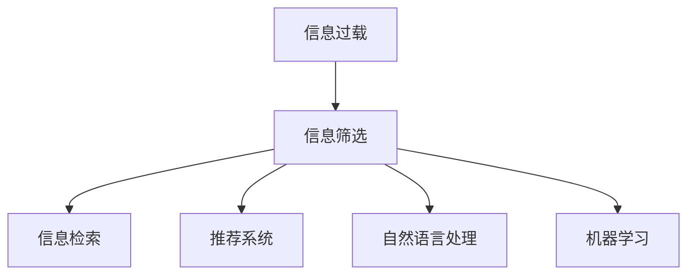

                 

# 信息过载与信息筛选策略与实践：在信息洪流中找到有价值的信息

## 1. 背景介绍

在当今数字化时代，我们每时每刻都在生成和消费海量的信息。从社交媒体、新闻网站到在线课程、电子书，信息源的多样性和丰富性令我们目不暇接。然而，这背后也隐藏着巨大挑战：信息过载（Information Overload）。信息过载指的是人们面对的信息量远远超出了其处理能力，导致无法有效筛选和利用有价值信息，甚至出现决策疲劳和认知负荷过重等问题。

信息筛选（Information Filtering）技术正是在这样的背景下应运而生。通过分析用户的行为和偏好，以及信息内容的特征，智能系统能够帮助用户快速找到其感兴趣的有价值信息，从而提升信息获取的效率和质量。在技术层面，信息筛选是信息检索（Information Retrieval, IR）、推荐系统（Recommendation System）、自然语言处理（NLP）、机器学习（Machine Learning）等领域的交叉产物。本文将系统介绍信息筛选的核心原理、实践方法，并展望未来发展趋势与面临的挑战。

## 2. 核心概念与联系

### 2.1 核心概念概述

为更好地理解信息筛选技术的本质，本文将介绍几个关键概念：

- **信息过载**：用户接收到的信息远远超出其处理能力，导致无法有效筛选和利用有价值信息的现象。
- **信息筛选**：通过算法和技术手段，帮助用户从海量的信息中快速找到感兴趣的有价值信息，提升信息获取效率和质量。
- **信息检索**：从大量数据中检索出与用户查询相关的信息，是信息筛选的基础技术之一。
- **推荐系统**：根据用户历史行为和兴趣，推荐潜在感兴趣的信息，是信息筛选的重要应用领域。
- **自然语言处理**：分析处理自然语言文本，提取关键信息，辅助信息筛选的算法和模型设计。
- **机器学习**：通过数据分析和算法优化，不断提升信息筛选系统的性能和效果。

这些概念之间的逻辑关系可以通过以下Mermaid流程图来展示：



这个流程图展示了许多关键概念及其相互之间的关系：

1. 信息过载为信息筛选提供了技术需求。
2. 信息检索和推荐系统是信息筛选的主要技术手段。
3. 自然语言处理和机器学习为信息筛选提供技术和数据支持。

## 3. 核心算法原理 & 具体操作步骤
### 3.1 算法原理概述

信息筛选技术的核心原理是，通过分析用户的行为和偏好，以及信息内容的特征，利用机器学习、自然语言处理等技术，自动预测用户对信息的兴趣程度，从而推荐或检索出用户感兴趣的信息。

具体来说，信息筛选系统通常由以下几个部分组成：

1. **用户模型**：建立用户兴趣、行为等方面的模型，用于描述用户的基本特征和兴趣偏好。
2. **内容模型**：分析信息内容的特征，如文本关键词、主题、情感等，构建信息内容的模型。
3. **相似度计算**：计算用户模型和内容模型之间的相似度，用于筛选出与用户最相关的信息。
4. **推荐和检索算法**：根据相似度计算结果，设计算法推荐或检索出用户感兴趣的信息。

### 3.2 算法步骤详解

信息筛选的算法步骤通常包括以下几个关键环节：

**Step 1: 用户建模**
- 收集用户的历史行为数据，如浏览、点击、评分、收藏等。
- 使用机器学习算法，如协同过滤、矩阵分解等，构建用户兴趣模型。
- 使用自然语言处理技术，如词向量、主题模型等，分析用户文本数据，构建用户行为模型。

**Step 2: 内容建模**
- 对信息内容进行特征提取，如使用TF-IDF、Word2Vec等方法提取文本关键词、构建词向量等。
- 使用主题模型，如LDA（Latent Dirichlet Allocation），分析文本内容的主题分布。
- 使用情感分析技术，如VADER（Valence Aware Dictionary and sEntiment Reasoner），分析文本的情感倾向。

**Step 3: 相似度计算**
- 使用余弦相似度、Jaccard相似度等方法，计算用户模型和内容模型之间的相似度。
- 根据相似度得分，排序筛选出与用户最相关的信息。

**Step 4: 推荐和检索**
- 设计推荐算法，如基于协同过滤、内容基推荐、混合推荐等，根据用户模型和内容模型推荐信息。
- 设计检索算法，如倒排索引、向量空间模型等，根据用户查询，检索出相关信息。

**Step 5: 反馈与优化**
- 收集用户对推荐结果的反馈，如点击率、评分等，用于更新用户模型和内容模型。
- 使用在线学习算法，如Adaboost、在线矩阵分解等，不断优化模型性能。

### 3.3 算法优缺点

信息筛选技术具有以下优点：

1. **高效性**：自动化的算法能够快速处理大量信息，提供实时推荐和检索服务。
2. **个性化**：通过分析用户行为和偏好，能够提供高度个性化的信息服务。
3. **可扩展性**：基于算法的筛选方法能够适应大规模信息处理的需要。

同时，信息筛选技术也存在以下局限性：

1. **数据依赖**：系统的性能很大程度上依赖于用户数据和信息内容的质量，难以处理非结构化数据。
2. **隐私问题**：用户数据和信息内容的隐私保护是重要考量，需要设计合适的数据匿名和加密策略。
3. **动态性**：用户兴趣和偏好变化较快，系统需要及时更新模型以适应变化。
4. **冷启动问题**：新用户或信息缺乏足够历史数据的冷启动问题，需要设计合适的引导策略。

### 3.4 算法应用领域

信息筛选技术在多个领域得到了广泛应用，例如：

- **电商推荐**：根据用户浏览和购买记录，推荐潜在感兴趣的商品。
- **新闻个性化**：根据用户兴趣，推荐相关新闻文章。
- **社交媒体信息流**：根据用户行为，推荐动态更新的朋友圈、微博等信息。
- **信息检索系统**：根据用户查询，检索相关网页和文档。
- **智能客服**：根据用户问题和历史对话，推荐相关答案或知识库条目。

这些领域展示了信息筛选技术的强大潜力，为人们的生活带来了便利和效率。

## 4. 数学模型和公式 & 详细讲解 & 举例说明

### 4.1 数学模型构建

本节将使用数学语言对信息筛选的核心算法进行更加严格的刻画。

记用户模型为 $u$，内容模型为 $c$，相似度计算结果为 $s$。信息筛选的数学模型可以表示为：

$$
s = f(u, c)
$$

其中 $f$ 为相似度计算函数，可以使用余弦相似度、Jaccard相似度等方法。

假设用户模型为 $u = (u_1, u_2, \ldots, u_n)$，每个 $u_i$ 表示用户对信息 $i$ 的兴趣评分。内容模型为 $c = (c_1, c_2, \ldots, c_n)$，每个 $c_i$ 表示信息 $i$ 的特征评分。则余弦相似度计算公式为：

$$
s = \frac{\sum_{i=1}^n u_i \cdot c_i}{\sqrt{\sum_{i=1}^n u_i^2} \cdot \sqrt{\sum_{i=1}^n c_i^2}}
$$

### 4.2 公式推导过程

以下我们以余弦相似度为例，推导其计算公式及其数学原理。

余弦相似度的计算公式为：

$$
s = \frac{\sum_{i=1}^n u_i \cdot c_i}{\sqrt{\sum_{i=1}^n u_i^2} \cdot \sqrt{\sum_{i=1}^n c_i^2}}
$$

其数学原理在于，通过将用户模型和内容模型投影到高维空间中，计算它们之间的夹角余弦值。夹角余弦值越接近1，表示两个向量越相似，即用户对信息越感兴趣。

余弦相似度公式的具体推导过程如下：

设 $u = (u_1, u_2, \ldots, u_n)$，$c = (c_1, c_2, \ldots, c_n)$。它们的余弦相似度为：

$$
s = \frac{\sum_{i=1}^n u_i \cdot c_i}{\sqrt{\sum_{i=1}^n u_i^2} \cdot \sqrt{\sum_{i=1}^n c_i^2}}
$$

通过将分子和分母分别平方，可以推导出：

$$
s^2 = \frac{\left(\sum_{i=1}^n u_i \cdot c_i\right)^2}{\left(\sum_{i=1}^n u_i^2\right) \cdot \left(\sum_{i=1}^n c_i^2\right)}
$$

使用余弦定理，可以进一步推导出：

$$
\cos \theta = \frac{\sum_{i=1}^n u_i \cdot c_i}{\sqrt{\sum_{i=1}^n u_i^2} \cdot \sqrt{\sum_{i=1}^n c_i^2}}
$$

其中 $\theta$ 为向量 $u$ 和 $c$ 之间的夹角。

### 4.3 案例分析与讲解

为了更好地理解余弦相似度的计算公式，下面以电商推荐系统为例，进行具体分析。

假设电商平台的商品列表为 $M$，每个商品 $m_i$ 都有一个向量 $v_i = (v_{i1}, v_{i2}, \ldots, v_{in})$，表示商品的各个属性评分。用户的兴趣模型为 $u = (u_1, u_2, \ldots, u_n)$，表示用户对不同属性的偏好。余弦相似度计算公式可以表示为：

$$
s = \frac{\sum_{i=1}^n u_i \cdot v_i}{\sqrt{\sum_{i=1}^n u_i^2} \cdot \sqrt{\sum_{i=1}^n v_i^2}}
$$

根据相似度得分 $s$，可以对商品进行排序，推荐用户可能感兴趣的商品。

## 5. 项目实践：代码实例和详细解释说明
### 5.1 开发环境搭建

在进行信息筛选系统开发前，我们需要准备好开发环境。以下是使用Python进行Scikit-learn开发的常见环境配置流程：

1. 安装Anaconda：从官网下载并安装Anaconda，用于创建独立的Python环境。

2. 创建并激活虚拟环境：
```bash
conda create -n infofilter-env python=3.8 
conda activate infofilter-env
```

3. 安装Scikit-learn：使用以下命令进行安装：
```bash
conda install scikit-learn
```

4. 安装各类工具包：
```bash
pip install numpy pandas scikit-learn scikit-learn tensorflow
```

完成上述步骤后，即可在`infofilter-env`环境中开始信息筛选系统开发。

### 5.2 源代码详细实现

下面我们以电商推荐系统为例，给出使用Scikit-learn进行用户行为分析的Python代码实现。

首先，准备数据集：

```python
import pandas as pd

# 读取用户行为数据
user_data = pd.read_csv('user_behavior.csv')

# 统计用户行为
user_behavior = user_data.groupby(['user_id', 'item_id'])['behavior'].value_counts().unstack().loc[0, 1:].reset_index().drop('user_id', axis=1)
```

然后，构建用户行为模型：

```python
from sklearn.decomposition import TruncatedSVD

# 构建用户行为矩阵
user_matrix = user_behavior.pivot_table(index='user_id', columns='item_id', values='count', fill_value=0)

# 进行奇异值分解，提取用户行为矩阵的低维表示
user_model = TruncatedSVD(n_components=10).fit_transform(user_matrix)
```

接着，计算相似度：

```python
from sklearn.metrics.pairwise import cosine_similarity

# 计算用户之间的相似度
similarity_matrix = cosine_similarity(user_model, user_model)
```

最后，设计推荐算法：

```python
from sklearn.metrics.pairwise import cosine_similarity

# 设计推荐算法
def recommend(user_id, n=5):
    # 获取用户行为矩阵的相似度矩阵
    similarity_matrix = cosine_similarity(user_model, user_model)
    
    # 获取用户行为的推荐商品列表
    user_vector = user_model[user_id]
    similar_user_indices = similarity_matrix.argsort()[user_id].tolist()
    recommended_items = [user_matrix.index[i] for i in similar_user_indices]
    
    # 返回前n个推荐商品
    return recommended_items[:n]
```

以上代码实现了基于余弦相似度的电商推荐系统，通过用户行为矩阵和奇异值分解构建用户模型，使用余弦相似度计算用户之间的相似度，并设计推荐算法返回推荐商品列表。

### 5.3 代码解读与分析

让我们再详细解读一下关键代码的实现细节：

**用户行为数据读取**：
- 使用`pandas`库读取用户行为数据，统计用户对不同商品的访问次数，构建用户行为矩阵。

**奇异值分解**：
- 使用`sklearn.decomposition`中的`TruncatedSVD`类，对用户行为矩阵进行奇异值分解，提取用户行为的低维表示。

**余弦相似度计算**：
- 使用`sklearn.metrics.pairwise`中的`cosine_similarity`函数计算用户之间的余弦相似度。

**推荐算法设计**：
- 定义`recommend`函数，输入用户ID和推荐商品数量n，返回推荐商品列表。首先计算用户之间的相似度，然后获取与用户行为最相似的n个用户，从这些用户的访问记录中提取推荐商品列表。

**运行结果展示**：
- 在实际应用中，可以通过调用`recommend`函数，输入目标用户的ID，得到其推荐商品列表。

## 6. 实际应用场景
### 6.1 电商推荐系统

电商推荐系统通过分析用户的浏览、点击、购买行为，推荐用户可能感兴趣的商品，提升用户体验和购买转化率。在技术实现上，可以构建用户行为矩阵，使用奇异值分解提取用户行为的低维表示，通过余弦相似度计算用户之间的相似度，再设计推荐算法返回推荐商品列表。

电商推荐系统在实际应用中效果显著，已经在各大电商平台上广泛应用。用户能够快速找到感兴趣的商品，提升了购物体验，平台也通过精准推荐提高了用户粘性和销售额。

### 6.2 个性化新闻推荐

新闻推荐系统根据用户的兴趣和行为，推荐用户可能感兴趣的新闻文章，提升用户的新闻获取效率和质量。在技术实现上，可以构建用户兴趣模型和新闻内容模型，使用余弦相似度计算用户和新闻之间的相似度，再设计推荐算法返回推荐新闻。

新闻推荐系统已经在各种新闻平台上广泛应用，用户能够快速找到感兴趣的新闻，提升信息获取的效率和质量。同时，平台也能够通过精准推荐增加用户粘性和流量。

### 6.3 社交媒体信息流

社交媒体信息流根据用户的兴趣和行为，推荐用户可能感兴趣的内容，提升用户的社交互动体验。在技术实现上，可以构建用户兴趣模型和内容模型，使用余弦相似度计算用户和内容之间的相似度，再设计推荐算法返回推荐内容。

社交媒体信息流在实际应用中效果显著，用户能够快速找到感兴趣的内容，提升了社交互动的体验。同时，平台也能够通过精准推荐增加用户粘性和流量。

## 7. 工具和资源推荐
### 7.1 学习资源推荐

为了帮助开发者系统掌握信息筛选技术的理论基础和实践技巧，这里推荐一些优质的学习资源：

1. 《Python数据科学手册》：详细介绍了Python在数据分析和机器学习中的应用，适合初学者和进阶开发者。
2. 《推荐系统实战》：由著名推荐系统专家撰写，涵盖推荐系统的理论基础和实现技巧，适合深入学习。
3. 《深度学习实战》：介绍深度学习在各种NLP任务中的应用，包括信息检索、推荐系统等，适合NLP领域的开发者。
4. Kaggle机器学习竞赛平台：提供大量的数据集和竞赛题目，通过实践积累经验，提高信息筛选的实战能力。

通过对这些资源的学习实践，相信你一定能够快速掌握信息筛选技术的精髓，并用于解决实际的NLP问题。

### 7.2 开发工具推荐

高效的开发离不开优秀的工具支持。以下是几款用于信息筛选开发的常用工具：

1. Scikit-learn：基于Python的机器学习库，提供丰富的机器学习算法和工具，适合快速原型开发。
2. TensorFlow：由Google主导开发的深度学习框架，支持分布式计算和自动微分，适合大规模工程应用。
3. PyTorch：基于Python的深度学习框架，灵活动态的计算图，适合快速迭代研究。
4. Weights & Biases：模型训练的实验跟踪工具，可以记录和可视化模型训练过程中的各项指标，方便对比和调优。
5. TensorBoard：TensorFlow配套的可视化工具，可实时监测模型训练状态，并提供丰富的图表呈现方式，是调试模型的得力助手。

合理利用这些工具，可以显著提升信息筛选任务的开发效率，加快创新迭代的步伐。

### 7.3 相关论文推荐

信息筛选技术的发展源于学界的持续研究。以下是几篇奠基性的相关论文，推荐阅读：

1. "Information Retrieval: An Introduction" by Christopher D. Manning and Prabhakar Raghavan：介绍了信息检索的基本原理和算法，适合初学者阅读。
2. "The Recommender Systems Handbook" edited by James Kakushmanova and Ipek Altunkaynak：涵盖了推荐系统的各种算法和实践，适合深入学习。
3. "A Survey of Collaborative Filtering Technique" by Jian Wang and Tony K. Ho：总结了协同过滤等推荐算法的最新进展，适合研究者阅读。
4. "Evaluation in Recommender Systems: Alternative Metrics and the case of Recommender Systems" by Antonio Domingos：介绍了推荐系统评价指标的最新研究进展，适合评估和优化信息筛选系统。

这些论文代表了大语言模型微调技术的发展脉络。通过学习这些前沿成果，可以帮助研究者把握学科前进方向，激发更多的创新灵感。

## 8. 总结：未来发展趋势与挑战

### 8.1 总结

本文对信息筛选技术的核心原理、实践方法进行了全面系统的介绍。首先阐述了信息过载为信息筛选提供了技术需求，信息检索和推荐系统是信息筛选的主要技术手段，自然语言处理和机器学习为信息筛选提供技术和数据支持。其次，从原理到实践，详细讲解了信息筛选的数学模型和关键算法，给出了信息筛选任务开发的完整代码实例。同时，本文还广泛探讨了信息筛选方法在电商推荐、新闻推荐、社交媒体信息流等多个领域的应用前景，展示了信息筛选技术的强大潜力。

通过本文的系统梳理，可以看到，信息筛选技术在信息处理和推荐方面发挥了重要作用，极大提升了信息获取的效率和质量。未来，伴随信息技术的进一步发展和数据量的持续增长，信息筛选技术也将迎来更多的应用场景和挑战。

### 8.2 未来发展趋势

展望未来，信息筛选技术将呈现以下几个发展趋势：

1. **深度学习在信息筛选中的应用**：深度学习技术能够处理更加复杂的数据结构和特征，未来将进一步扩展到图像、视频、音频等多模态数据的信息筛选。
2. **个性化推荐技术的提升**：个性化推荐技术将继续改进，通过多维度和多层次的用户建模，提升推荐效果和用户体验。
3. **大数据技术的应用**：大数据技术能够处理海量信息，未来将更加广泛地应用于信息筛选系统的开发和优化。
4. **实时计算和流计算技术的应用**：实时计算和流计算技术能够提供更快速的信息筛选服务，满足用户实时信息需求。
5. **跨领域融合与创新**：信息筛选技术与自然语言处理、机器学习、知识图谱等技术进一步融合，实现跨领域创新应用。

以上趋势凸显了信息筛选技术的广阔前景。这些方向的探索发展，必将进一步提升信息筛选系统的性能和效果，为信息时代提供更加高效、智能的信息服务。

### 8.3 面临的挑战

尽管信息筛选技术已经取得了显著进展，但在迈向更加智能化、普适化应用的过程中，它仍面临着诸多挑战：

1. **数据隐私和安全**：信息筛选系统需要处理大量用户数据，如何保护用户隐私和数据安全是重要挑战。
2. **动态性和实时性**：用户兴趣和行为的变化速度较快，如何实时更新模型以适应变化是重要挑战。
3. **算法复杂度**：信息筛选算法通常较为复杂，如何简化算法、提升效率是重要挑战。
4. **计算资源**：信息筛选系统需要处理大量数据，如何优化资源配置、降低计算成本是重要挑战。
5. **多模态融合**：多模态数据融合是信息筛选的重要方向，但不同模态数据的特征提取和融合技术需要进一步研究。

### 8.4 研究展望

面对信息筛选技术所面临的挑战，未来的研究需要在以下几个方面寻求新的突破：

1. **隐私保护技术**：开发更加安全和匿名的用户数据处理技术，保护用户隐私和数据安全。
2. **实时计算技术**：开发更加高效和实时化的信息筛选算法，满足用户动态变化的需求。
3. **多模态融合技术**：研究多模态数据的特征提取和融合技术，提升跨领域信息筛选的性能。
4. **深度学习优化**：进一步探索深度学习在信息筛选中的应用，提升算法复杂度和实时性。
5. **跨领域融合**：探索信息筛选技术与自然语言处理、机器学习、知识图谱等技术的融合，实现跨领域创新应用。

这些研究方向的探索，必将引领信息筛选技术迈向更高的台阶，为信息时代提供更加高效、智能的信息服务。相信随着技术的不断发展，信息筛选技术将更好地服务于人类，提升信息获取和处理的效率和质量。

## 9. 附录：常见问题与解答

**Q1：如何优化信息筛选系统的性能？**

A: 优化信息筛选系统性能的关键在于数据质量、算法优化和系统设计。具体来说，可以采取以下措施：
1. 数据清洗：对原始数据进行清洗，去除噪声和错误，提高数据质量。
2. 算法优化：选择合适的算法，并根据实际需求进行优化，如特征选择、正则化、剪枝等。
3. 系统设计：合理设计系统架构，优化计算资源，提高系统性能。

**Q2：如何处理信息筛选系统的冷启动问题？**

A: 信息筛选系统的冷启动问题指的是新用户或新信息缺乏足够历史数据的场景。解决冷启动问题的方法包括：
1. 基于内容的推荐：根据新信息的内容特征，进行推荐。
2. 基于协同过滤的推荐：根据其他用户的历史行为，进行推荐。
3. 基于模型的推荐：使用机器学习模型，如协同过滤、矩阵分解等，进行推荐。

**Q3：如何在多模态数据中融合信息？**

A: 多模态数据的融合是信息筛选的重要方向。可以采取以下方法：
1. 特征对齐：将不同模态数据的特征对齐，构建统一的特征表示。
2. 联合学习：使用联合学习算法，同时学习多模态数据的特征。
3. 融合算法：使用融合算法，如Stacking、Boosting等，将多模态数据的特征融合到一起。

这些方法能够帮助信息筛选系统更好地处理多模态数据，提升系统性能和效果。

**Q4：如何处理信息过载问题？**

A: 处理信息过载问题需要综合考虑用户需求和系统能力。具体来说，可以采取以下措施：
1. 智能推荐：使用智能推荐系统，根据用户兴趣推荐相关内容。
2. 内容聚合：使用内容聚合技术，将相关内容组织到一起，方便用户浏览。
3. 个性化设置：提供个性化设置选项，让用户根据自己的需求定制信息流。

这些方法能够帮助用户从信息洪流中快速找到感兴趣的内容，提升信息获取效率和质量。

---

作者：禅与计算机程序设计艺术 / Zen and the Art of Computer Programming

